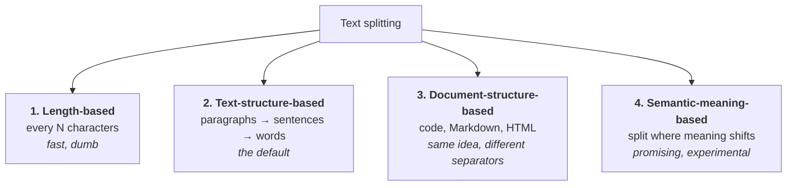
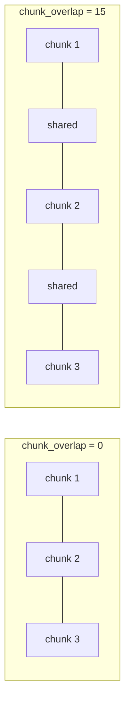
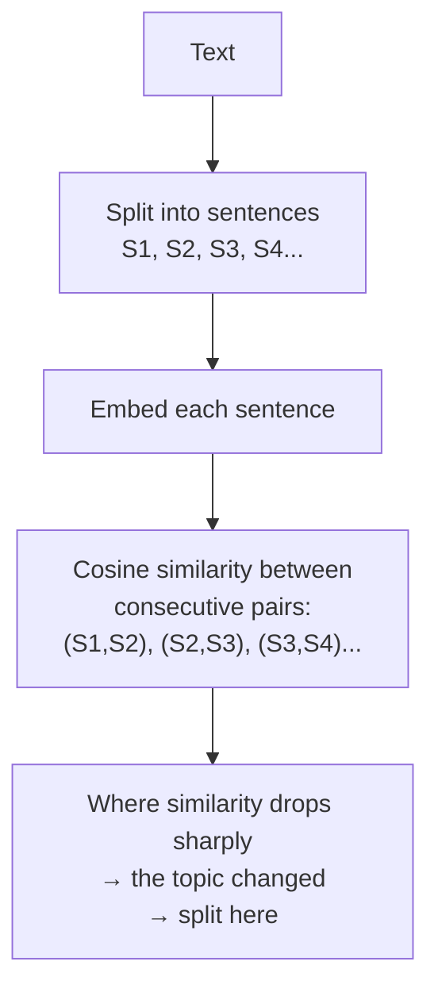

**In one line.** Splitting large text into smaller chunks is not an optimisation — it is what makes embeddings, retrieval and summarisation work at all.

## Why split

### 1. Context length limits

Every model caps how many tokens it can accept. A thousand-page PDF will not fit. Splitting is the only way to process it.

### 2. Downstream tasks get better

**Embeddings.** A vector has fixed capacity. Compress a page covering three unrelated topics into one vector and it represents none of them well. Split it so each chunk covers one topic and each vector becomes sharp.

**Semantic search.** Sharper vectors mean better matches. Search quality tracks chunk quality directly.

**Summarisation.** Models drift on very long inputs — wandering off-topic, or asserting things the document never said. Shorter inputs produce more faithful summaries.

### 3. Cheaper and parallelisable

Smaller pieces mean less memory and work that can run concurrently.

## Four strategies



## 1. Length-based splitting

Walk the text, cut every *N* characters. That is all.

```python
from langchain.text_splitter import CharacterTextSplitter

splitter = CharacterTextSplitter(
    chunk_size=100,
    chunk_overlap=0,
    separator="",
)
chunks = splitter.split_text(text)
```

**Upside:** conceptually trivial, easy to implement, very fast.

**Downside, and it is a big one:** it ignores grammar, structure and meaning entirely. Hit 100 characters mid-word and it cuts mid-word. A paragraph explaining one concept gets sliced in half, and now half the information lives in one chunk and half in another. Embed those and neither captures the idea.

For that reason it is rarely the right choice — but it is the clearest way to see what the other strategies are fixing.

### Working with Documents instead of strings

```python
from langchain_community.document_loaders import PyPDFLoader

loader = PyPDFLoader("dl_curriculum.pdf")
docs = loader.load()

chunks = splitter.split_documents(docs)   # not split_text
print(chunks[0].page_content)
```

`split_text` takes a string and returns strings. `split_documents` takes Documents and returns Documents, **preserving metadata**. Use the latter in any real pipeline.

## Chunk overlap

`chunk_overlap` makes consecutive chunks share a few characters at the boundary.



The point is **context preservation**. When a chunk boundary cuts through an idea, starting the next chunk slightly earlier carries the lost context forward.

The trade-off: more overlap means more chunks, more embeddings, more storage, more comparisons. **Around 10–20% of chunk size** is the usual guidance — so 10 to 20 characters for a 100-character chunk.

## 2. Text-structure-based splitting (the default)

Text has a natural hierarchy: paragraphs contain sentences, sentences contain words, words contain characters. `RecursiveCharacterTextSplitter` exploits it.

It tries separators in order — `"\n\n"` (paragraphs), then `"\n"` (lines), then `" "` (words), then `""` (characters) — descending only when a chunk is still too large.

```python
from langchain.text_splitter import RecursiveCharacterTextSplitter

splitter = RecursiveCharacterTextSplitter(chunk_size=300, chunk_overlap=0)
chunks = splitter.split_text(text)
```

### A worked trace

Take this text, with character counts:

```text
My name is Nitish.        (17)
I am 35 years old.        (17)

I live in Gurgaon.        (17)
How are you?              (11)
```

With `chunk_size=10`:

1. **Split on paragraphs.** Two chunks of 34 and 28 characters. Both exceed 10.
2. **Split on lines.** Four chunks of 17, 17, 17, 11. All still exceed 10.
3. **Split on words.** `My`(2) `name`(4) `is`(2) `Nitish`(6) — all under 10, but wastefully small.
4. **Merge back up to the limit.** `My name is` is exactly 10. Adding `Nitish` would make 17, so it stays separate.

Final chunks: `My name is` / `Nitish` / `I am 35` / `years old` / `I live in` / `Gurgaon` / `How are` / `you?`

That merge-back step is what makes this splitter good. It descends only as far as it must, then packs chunks as full as the limit allows.

### Chunk size changes the granularity

| `chunk_size` | Result on the same text |
|---|---|
| 10 | word-level fragments |
| 25 | four chunks, one per sentence |
| 50 | two chunks, one per paragraph |

Raise the limit and it splits on larger units; lower it and it descends further. **This is the splitter you will use most.**

:::tip Try it visually
LangChain's documentation hosts an interactive chunk visualiser. Paste text, pick a splitter, and drag `chunk_size` and `chunk_overlap` to watch the boundaries move. Five minutes there beats a page of explanation.
:::

## 3. Document-structure-based splitting

Code is text, but it is not organised into paragraphs and sentences. It is organised by `class`, `def`, loops and blocks. Markdown is organised by headings and lists. HTML by tags.

Same recursive algorithm, different separator list:

```python
from langchain.text_splitter import RecursiveCharacterTextSplitter, Language

# Python
splitter = RecursiveCharacterTextSplitter.from_language(
    language=Language.PYTHON,
    chunk_size=300,
    chunk_overlap=0,
)
chunks = splitter.split_text(python_code)

# Markdown
splitter = RecursiveCharacterTextSplitter.from_language(
    language=Language.MARKDOWN,
    chunk_size=200,
    chunk_overlap=0,
)
```

For Python it tries `\nclass `, then `\ndef `, then `\n\tdef `, before falling back to the plain-text separators. Result: a class tends to stay whole, and methods split at method boundaries rather than mid-body.

Many languages are supported — JavaScript, Java, PHP, HTML, Markdown, LaTeX and more.

## 4. Semantic-meaning-based splitting

Sometimes structure lies. Consider a paragraph that starts on farming and, without a paragraph break, switches to cricket.

```text
Farmers were working hard in the fields, preparing the soil and sowing seeds.
The sun was bright and the air smelled of earth and fresh grass. Meanwhile,
in the IPL, the crowd erupted as the batsman hit a six...

Terrorism poses a threat to global stability...
```

A structure-based splitter sees two paragraphs and makes two chunks. But the first mixes two unrelated topics, so its embedding represents neither well. You wanted **three** chunks: farming, IPL, terrorism.

### How semantic chunking works



```python
from langchain_experimental.text_splitter import SemanticChunker
from langchain_openai import OpenAIEmbeddings

splitter = SemanticChunker(
    OpenAIEmbeddings(),
    breakpoint_threshold_type="standard_deviation",
    breakpoint_threshold_amount=1,
)
docs = splitter.create_documents([sample_text])
print(len(docs))
```

Threshold types include `percentile`, `interquartile`, `standard_deviation` and `gradient`. With standard deviation set to 1, a drop of more than one standard deviation counts as a topic change.

:::warning Experimental, and it shows
It lives in `langchain_experimental` for a reason. On the example above it does find three chunks, but boundaries land a sentence or two off — a line about the sun and fresh grass ends up in the cricket chunk. Raise the threshold too far and everything collapses into one chunk.

Promising, worth watching as embedding models improve, **not** the default today.
:::

## Choosing

| Strategy | Use when | Reality |
|---|---|---|
| Length-based | you need speed above all | rarely worth it |
| **Recursive character** | **general text** | **the default** |
| Document-structure | code, Markdown, HTML | when the input is code-shaped |
| Semantic | topic boundaries matter more than structure | experimental |

Start with `RecursiveCharacterTextSplitter`, `chunk_size` around 1000 and `chunk_overlap` around 200, then tune against retrieval quality.

## Pitfalls

- **Using `split_text` on Documents.** You silently lose metadata; use `split_documents`.
- **`chunk_overlap=0` on prose.** You lose context at every boundary.
- **Over-large chunks.** One chunk covering many topics embeds badly.
- **Over-small chunks.** No chunk contains a complete thought.
- **Expecting the semantic chunker to be production-ready.** It is not yet.

## Checklist

- [ ] I can give three reasons splitting improves results
- [ ] I can trace `RecursiveCharacterTextSplitter` through a worked example
- [ ] I can explain chunk overlap and its trade-off
- [ ] I know when document-structure splitting is required
- [ ] I can explain what semantic chunking fixes and why it is not the default
