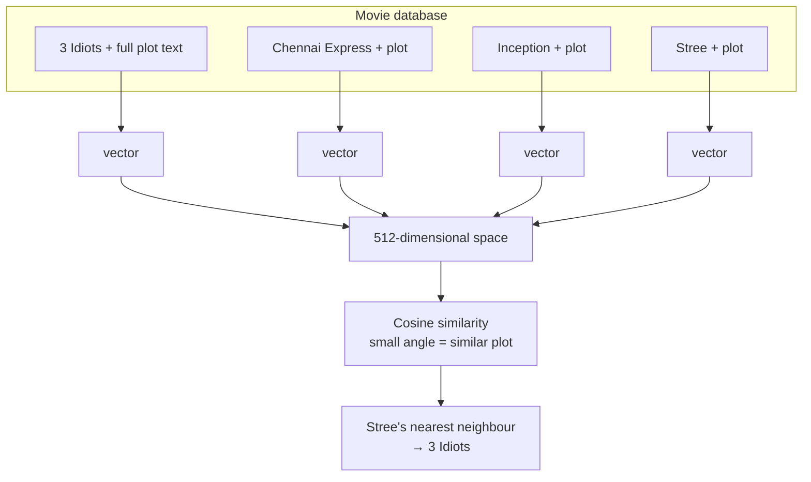
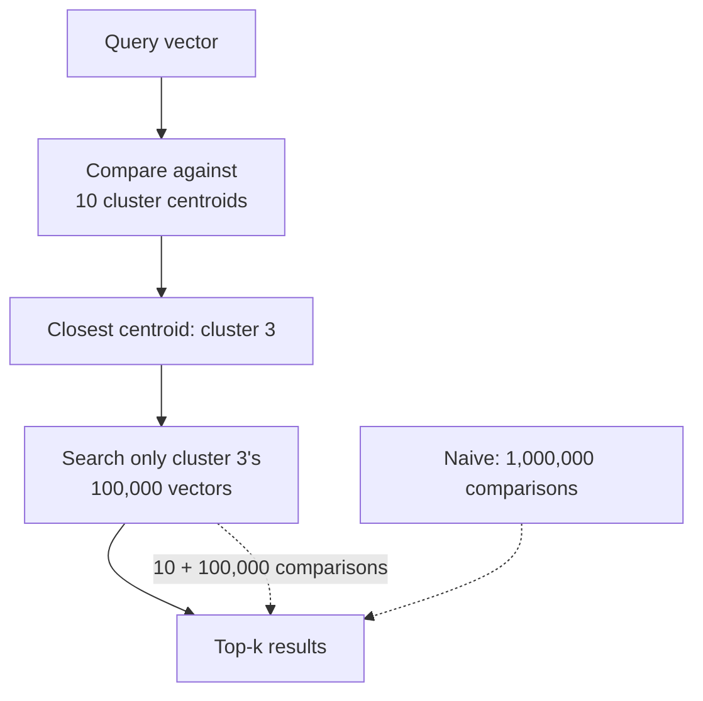

**In one line.** A vector store is a system built to **store** embedding vectors and **search** them by similarity — fast — which is something a relational database cannot do.

## Motivating problem: a movie recommender

Suppose you are building an IMDb-style catalogue and want a "similar movies" section.

### Attempt 1 — keyword matching

Compare movies on director, lead actor, genre and release year. More matches, more similar.

It works, and it is wrong in two directions:

**False positives.** *My Name Is Khan* and *Kabhi Alvida Naa Kehna* share a director, a lead actor, a rough release window and a genre. Keyword matching calls them near-identical. They are completely different films.

**False negatives.** *Taare Zameen Par* and *A Beautiful Mind* share a genuine theme — a protagonist facing a serious difficulty while being brilliant in another dimension. Different directors, actors, decades, languages. Zero keywords in common, so keyword matching will *never* connect them.

The underlying signal is not metadata. It is **plot**.

### Attempt 2 — compare plots

Comparing the meaning of two blocks of text is a hard NLP problem — solved by embeddings.



Conceptually clean. Three problems appear the moment you build it.

## Three challenges

**1. Generating embeddings.** Millions of movies, one vector each.

**2. Storage.** Generate once, reuse forever — so persist them. But you cannot put them in MySQL or Oracle: relational databases will store the numbers and give you no way to compute similarity across rows.

**3. Fast search.** Finding the five closest vectors among a million means a million comparisons — O(n). Do that per request and the app crawls.

**A vector store solves all three.**

## What a vector store gives you

### Storage

Vectors plus **associated metadata** — the movie ID, title, anything else you want to filter on later. Two modes:

- **In memory** — fast, gone when the process exits. Fine for prototypes.
- **On disk** — persistent. What production uses.

### Similarity search

Compare a query vector against everything stored and return the closest, ranked.

### Indexing — the interesting one

This is what makes search fast. One accessible technique: **clustering**.



Cluster a million vectors into ten groups of about 100,000. Average each group to get a centroid. At query time, compare against the ten centroids, pick the winner, and search only inside it. **Roughly 100,010 comparisons instead of 1,000,000** — an order of magnitude, for a negligible loss in accuracy.

Production systems use more sophisticated schemes — approximate nearest neighbour, HNSW graphs — but the bargain is always the same: **trade a little exactness for a lot of speed.**

### CRUD

Add, read, update and delete vectors, as with any database.

## Vector store vs vector database

The terms get used interchangeably. The distinction is simple:

> **Vector store** = storage + similarity search.
> **Vector database** = a vector store **plus** database features.

Those extra features: distributed architecture for scaling, backup and restore, ACID-style transactional guarantees, concurrency control, and authentication and authorisation.

| | Vector store | Vector database |
|---|---|---|
| Storage + search | ✅ | ✅ |
| Distributed scaling | ❌ | ✅ |
| Backup / restore | ❌ | ✅ |
| Transactions | ❌ | ✅ |
| Access control | ❌ | ✅ |
| Examples | FAISS | Milvus, Qdrant, Weaviate, Pinecone |
| Best for | prototypes, small scale | production |

**Every vector database is a vector store; the reverse is not true.**

Chroma sits in between — lightweight like a store, with some database features. Good middle ground for learning and small production work.

## Vector stores in LangChain

LangChain wraps every major vector store behind a **common interface**: `from_documents`, `add_documents`, `similarity_search`, metadata filtering. Swap FAISS for Pinecone as you scale and almost nothing else changes.

## Chroma, hands on

Chroma organises data as: **tenant** → **database** → **collection** (like a table) → **documents** (vector + metadata).

### Setup

```python
from langchain_openai import OpenAIEmbeddings
from langchain_chroma import Chroma
from langchain_core.documents import Document
from dotenv import load_dotenv
load_dotenv()

doc1 = Document(
    page_content="Virat Kohli is one of the most successful and consistent batsmen in IPL history.",
    metadata={"team": "Royal Challengers Bangalore"},
)
doc2 = Document(
    page_content="Rohit Sharma is the most successful captain in IPL history.",
    metadata={"team": "Mumbai Indians"},
)
doc3 = Document(
    page_content="MS Dhoni, famous for his calm captaincy and finishing ability.",
    metadata={"team": "Chennai Super Kings"},
)
doc4 = Document(
    page_content="Jasprit Bumrah is one of the best fast bowlers in T20 cricket.",
    metadata={"team": "Mumbai Indians"},
)
doc5 = Document(
    page_content="Ravindra Jadeja is a world-class all-rounder, contributing with bat and ball.",
    metadata={"team": "Chennai Super Kings"},
)

docs = [doc1, doc2, doc3, doc4, doc5]

vector_store = Chroma(
    embedding_function=OpenAIEmbeddings(),
    persist_directory="my_chroma_db",
    collection_name="sample",
)
```

Three arguments: which embedding model converts text to vectors, where to persist, and which collection.

:::note Chroma persists to SQLite
Look inside `my_chroma_db/` and you will find a `.sqlite3` file. The whole vector database is a SQLite file you can open with any SQL client.
:::

### Add

```python
ids = vector_store.add_documents(docs)
print(ids)   # auto-generated unique IDs, one per document
```

Each document gets an ID you can use later to update or delete it. Pass your own if you prefer.

### View

```python
vector_store.get(include=["embeddings", "documents", "metadatas"])
```

### Search

```python
results = vector_store.similarity_search(
    query="Who among these are a bowler?",
    k=2,
)
for doc in results:
    print(doc.page_content)
```

With `k=1` you get Bumrah. With `k=2` you also get Jadeja — because "all-rounder" is semantically close to bowling. No document contains the word "bowler" in the query's sense; the embedding does the work.

### Search with scores

```python
results = vector_store.similarity_search_with_score(
    query="Who among these are a bowler?",
    k=2,
)
for doc, score in results:
    print(round(score, 4), doc.page_content)
```

:::warning Lower is better
Chroma returns a **distance**, not a similarity. Smaller means closer. Different stores use different conventions — check before you sort.
:::

### Filter by metadata

```python
results = vector_store.similarity_search_with_score(
    query="",
    filter={"team": "Chennai Super Kings"},
)
```

Returns Dhoni and Jadeja. This gets genuinely useful when you combine it with a query — "find chunks about refunds, but only from the 2024 policy document."

### Update and delete

```python
updated_doc = Document(
    page_content="Virat Kohli, former RCB captain, is renowned for his aggressive leadership.",
    metadata={"team": "Royal Challengers Bangalore"},
)
vector_store.update_document(document_id=ids[0], document=updated_doc)

vector_store.delete(ids=[ids[0]])
```

## Where you use vector stores

- **RAG** — the main event. See [RAG](/docs/genai/rag).
- **Recommender systems** — the movie problem above.
- **Semantic search** — over any corpus.
- **Image and multimedia search** — embed images, search by similarity.

Anywhere vectors are stored and retrieved, a vector store beats a relational database.

## Pitfalls

- **Storing vectors in a relational database.** It works and you cannot search them.
- **Re-embedding on every run.** Embed once, persist, reuse.
- **Treating the score as a similarity.** Chroma returns distance.
- **Choosing Pinecone for a prototype.** FAISS or Chroma locally; scale later — the interface barely changes.
- **Ignoring metadata.** It is what makes filtered retrieval possible.

## Checklist

- [ ] I can explain why keyword matching fails for recommendations
- [ ] I can name the three challenges a vector store solves
- [ ] I can explain clustering-based indexing and its trade-off
- [ ] I can state the vector store vs vector database distinction
- [ ] I can create a Chroma store and add, search, filter, update and delete
- [ ] I know which direction Chroma's score runs
