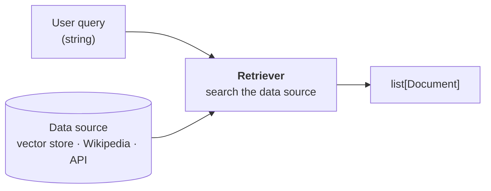
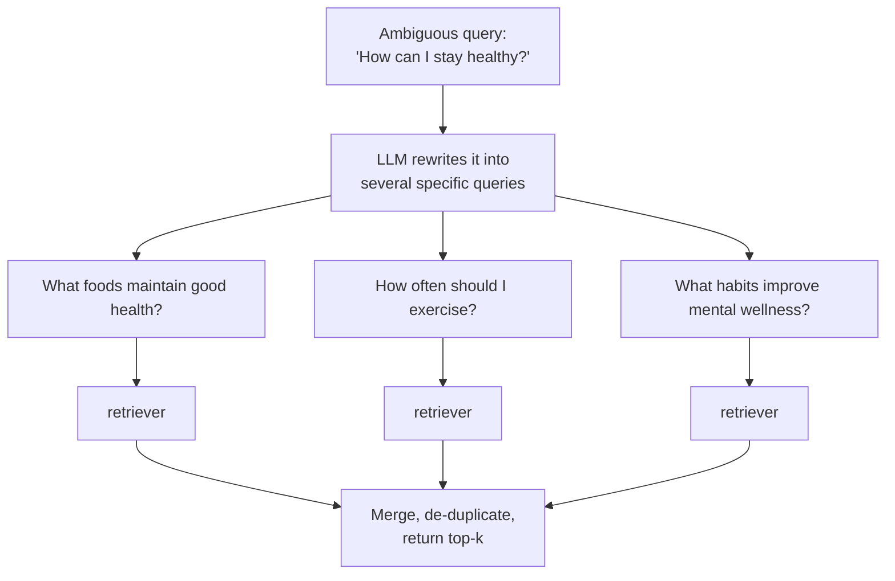
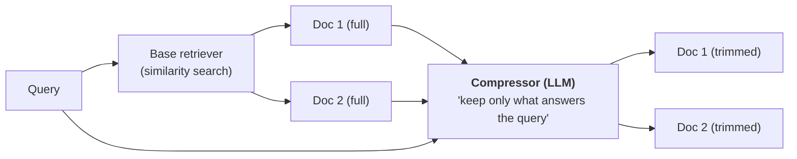

**In one line.** A retriever takes a query and returns relevant Documents — and swapping in a smarter retriever is the most common way to improve a RAG system.



Three facts to anchor on:

1. There is **no single retriever**. LangChain ships twenty-plus.
2. Every retriever is a **Runnable**, so it has `invoke` and drops into chains.
3. Retrievers differ along two axes: **data source** and **search strategy**.

## Categorised by data source

### WikipediaRetriever

Sends the query to Wikipedia's API and returns matching articles as Documents.

```python
from langchain_community.retrievers import WikipediaRetriever

retriever = WikipediaRetriever(top_k_results=2, lang="en")

query = "the geopolitical history of India and Pakistan from the perspective of a Chinese"
docs = retriever.invoke(query)

for i, doc in enumerate(docs):
    print(f"--- Result {i + 1} ---")
    print(doc.page_content[:500])
```

:::note Why is this a retriever, not a loader?
Fair question — it fetches documents, which sounds like a loader's job. The difference is **selection**: it does not fetch everything, it decides which articles are relevant to a query. That decision-making is what makes something a retriever. (Internally it is keyword matching, not semantic search.)
:::

### Vector store retriever

The one you will use most. Semantic search over embeddings.

```python
from langchain_chroma import Chroma
from langchain_openai import OpenAIEmbeddings
from langchain_core.documents import Document
from dotenv import load_dotenv
load_dotenv()

documents = [
    Document(page_content="LangChain helps developers build applications powered by LLMs."),
    Document(page_content="Chroma is a vector database optimised for LLM-based search."),
    Document(page_content="Embeddings convert text into high-dimensional vectors."),
    Document(page_content="OpenAI provides powerful embedding models."),
]

vectorstore = Chroma.from_documents(
    documents=documents,
    embedding=OpenAIEmbeddings(),
    collection_name="my_collection",
)

retriever = vectorstore.as_retriever(search_kwargs={"k": 2})

for doc in retriever.invoke("What is Chroma used for?"):
    print(doc.page_content)
```

#### "But the vector store can already search"

True — `vectorstore.similarity_search(query, k=2)` gives the same result. So why build a retriever?

Two reasons:

1. **A retriever is a Runnable.** It plugs into a chain; a raw `similarity_search` call does not.
2. **A retriever can use a different strategy.** `similarity_search` does one thing: compare vectors, return the closest. Retrievers open the door to everything below.

This basic retriever is the vanilla case. The interesting ones follow.

## Categorised by search strategy

### MMR — Maximum Marginal Relevance

**The problem it fixes: redundancy.**

Say your store holds five documents about climate change, and the first two say nearly the same thing about Arctic glaciers melting. Ask *"What are the adverse effects of climate change?"* with `k=3` and plain similarity search returns both glacier documents plus one more. Two of your three results are duplicates. One slot wasted.

What you wanted was three *different* effects: glaciers, wildfires, rising sea levels.

**How MMR works:** pick the most relevant document first. Then, for each subsequent pick, favour documents that are relevant **and dissimilar to what you already picked**. Repeat.

```python
retriever = vectorstore.as_retriever(
    search_type="mmr",
    search_kwargs={"k": 3, "lambda_mult": 0.5},
)
```

`lambda_mult` runs from 0 to 1:

- **1.0** — pure relevance; MMR behaves like ordinary similarity search.
- **0.0** — maximum diversity.
- **0.5** — a reasonable starting balance.

### MultiQueryRetriever

**The problem it fixes: ambiguous queries.**

*"How can I stay healthy?"* could mean what to eat, how often to exercise, or how to manage stress. The relevant documents differ for each reading. A single embedding of a vague question retrieves vaguely.



```python
from langchain.retrievers.multi_query import MultiQueryRetriever
from langchain_openai import ChatOpenAI

multiquery_retriever = MultiQueryRetriever.from_llm(
    retriever=vectorstore.as_retriever(search_kwargs={"k": 5}),
    llm=ChatOpenAI(model="gpt-4o"),
)

results = multiquery_retriever.invoke("How to improve energy levels and maintain balance?")
```

**The failure it prevents:** run that query through a plain retriever over a store mixing health documents with unrelated ones, and words like "energy" and "balance" pull in a document about solar panels balancing electricity demand. The multi-query version does not make that mistake, because its rewritten queries pin down the health reading.

### ContextualCompressionRetriever

**The problem it fixes: noisy chunks.**

Suppose a chunk reads:

> The Grand Canyon is a famous natural site. Photosynthesis is how plants convert light into energy. Many tourists visit every year.

Ask *"What is photosynthesis?"* and this chunk is genuinely relevant — one sentence answers the question. But you return all three sentences, two of which are noise. That noise wastes context-window budget and can distract the model.

"Why would I have a chunk like that?" Because splitting large documents is imprecise. A split that lands mid-paragraph produces exactly this.

**How it works:** two stages. A base retriever fetches candidates, then an LLM-based compressor trims each one to only the parts relevant to the query.



```python
from langchain.retrievers.contextual_compression import ContextualCompressionRetriever
from langchain.retrievers.document_compressors import LLMChainExtractor
from langchain_openai import ChatOpenAI

compressor = LLMChainExtractor.from_llm(ChatOpenAI(model="gpt-4o"))

compression_retriever = ContextualCompressionRetriever(
    base_retriever=vectorstore.as_retriever(search_kwargs={"k": 5}),
    base_compressor=compressor,
)

for doc in compression_retriever.invoke("What is photosynthesis?"):
    print(doc.page_content)
```

Even with paragraph-length source documents, the results come back as one-sentence answers.

**Use it when** documents are long, mix topics, you are hitting context-window limits, or answer accuracy is suffering from noise.

**Cost:** an extra LLM call per retrieved document. Not free.

## Choosing

| Retriever | Fixes | Cost |
|---|---|---|
| Vector store (similarity) | — | baseline |
| **MMR** | redundant results | negligible |
| **MultiQuery** | ambiguous queries | one extra LLM call |
| **Contextual compression** | noisy chunks | one LLM call per document |

Others worth knowing when you need them: `ParentDocumentRetriever`, `TimeWeightedVectorStoreRetriever`, `SelfQueryRetriever`, `EnsembleRetriever`.

## Why so many retrievers exist

Because **retrieval is where RAG systems usually fail.** When answers are poor, the cause is normally that the wrong chunks were fetched — not that the model is bad.

So the standard improvement loop is: build with a simple retriever, measure quality, then swap in a smarter retriever. When you see a course or article titled "Advanced RAG," this is most of what it covers.

## Pitfalls

- **Defaulting to similarity search forever.** It is the baseline, not the answer.
- **Setting `lambda_mult=1` and expecting diversity.** That is plain similarity search.
- **Using contextual compression on every query.** The per-document LLM call adds up.
- **Blaming the model for bad answers.** Check what the retriever returned first.

## Checklist

- [ ] I can explain what a retriever is and why it is a Runnable
- [ ] I can categorise retrievers by data source and by strategy
- [ ] I can explain the exact failure MMR, MultiQuery and compression each fix
- [ ] I can tune `lambda_mult` deliberately
- [ ] I know retrieval is the first place to look when RAG answers are poor
