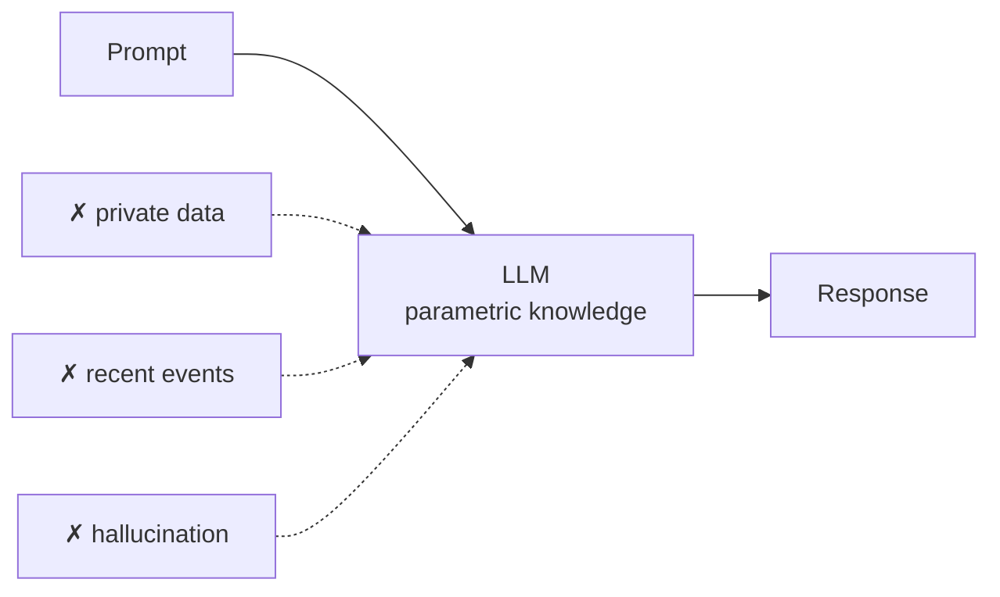
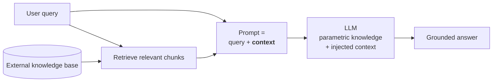
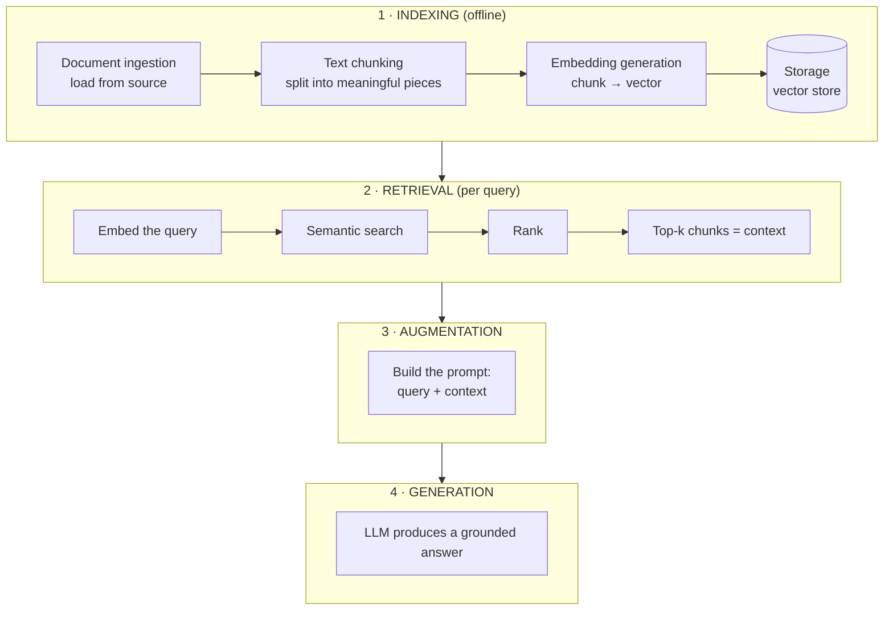

**In one line.** RAG injects the knowledge needed to answer a question directly into the prompt, so the model answers from **your** documents instead of only its training data.

## Where an LLM's knowledge lives

An LLM is a transformer trained on internet-scale data. Everything it knows is stored in its **parameters** — the weights and biases. That is why it is called **parametric knowledge**, and why more parameters generally means a more capable model.

You access that knowledge by prompting. Usually it works. Three situations where it does not.

### Problem 1 — private data

Ask about your company's leave policy, your emails, or your internal documentation, and the model cannot help. It never saw that data during pre-training.

### Problem 2 — the knowledge cutoff

Every model was last trained on a specific date. Ask about yesterday's news and it has nothing. (ChatGPT often answers because it can search the web — download an open model and try the same question to see the raw behaviour.)

### Problem 3 — hallucination

The model states something false, confidently. Ask about a historical figure and it may invent a plausible-sounding biography detail out of nothing. Generation is probabilistic, and a fluent wrong answer is often more likely than an admission of ignorance.



## Solution attempt 1 — fine-tuning

Take a pre-trained model and retrain it on a smaller, domain-specific dataset.

**The analogy:** an engineering graduate has studied broadly — physics, chemistry, computer science. When they join a company they still get two or three months of training on how this company works. Pre-training is the degree; fine-tuning is the onboarding.

### Approaches

- **Supervised fine-tuning** — a labelled dataset of prompt/desired-output pairs. The most common.
- **Continued pre-training** — unsupervised, on raw domain text. Suits transcripts and manuals.
- **RLHF** — reinforcement learning from human feedback, for shaping behaviour and safety.
- **LoRA / QLoRA** — parameter-efficient methods that freeze the base weights and train a small adapter.

### The four steps

1. Collect domain data in the right format.
2. Choose a method — full-parameter, or LoRA-style.
3. Train for a small number of epochs (it is expensive).
4. Evaluate: exact match, factuality, hallucination rate, safety tests.

### It does solve all three problems

Private data becomes parametric knowledge. Recent data can be folded in by retraining. Hallucination drops if you include examples that teach the model to say "I don't know."

### But the costs are prohibitive

- **Computationally expensive.** You are training a very large model.
- **Requires expertise.** Not a task for a general software team.
- **Terrible for churn.** Add a course to your catalogue? Fine-tune again. Remove one? Fine-tune again to get it *out* of the weights. If your knowledge changes weekly, fine-tuning is the wrong tool.

## Solution attempt 2 — in-context learning

A different idea: instead of changing the weights, put what the model needs **in the prompt**.

Show it a few labelled examples and ask about a new case:

```text
Below are examples of text labelled with their sentiment.

"I love this phone, it's so smooth."  -> positive
"This app crashes a lot."             -> negative
"The camera is amazing."              -> positive

"I hate the battery life."            -> ?
```

The model infers the pattern and answers correctly — **without any weight update**. This is **few-shot prompting**, and the general capability is **in-context learning**.

:::note An emergent property
In-context learning was never designed in. It **appeared** once models got large enough. GPT-1 and GPT-2 did not reliably have it; GPT-3, at around 175 billion parameters, did. That is what the paper *Language Models are Few-Shot Learners* documented — and it is worth reading at least the abstract. An emergent property is a behaviour that shows up at scale without being explicitly programmed.
:::

## RAG: in-context learning, taken further

Few-shot prompting injects **examples**. What if you inject the **knowledge** needed instead?

Concretely: a student watching a two-hour lecture on linear regression has a doubt about gradient descent. Send the model two things — the student's question, and the transcript of the minutes where gradient descent is actually taught. The model answers from that.

That is RAG.

> **RAG** = combine information **retrieval** with language **generation**. Fetch relevant documents from a knowledge base, then use them as context to produce a grounded answer.



A typical RAG prompt:

```text
You are a helpful assistant.
Answer the question ONLY from the provided transcript context.
If the context is insufficient, just say you don't know.

{context}

Question: {question}
```

The instruction about insufficient context is the anti-hallucination clause. Do not omit it.

## The four stages



### 1. Indexing — build the knowledge base

Done once, ahead of time. Four steps, each with its own chapter:

1. **Document ingestion** — [document loaders](/docs/genai/document-loaders) pull data from wherever it lives.
2. **Text chunking** — [text splitters](/docs/genai/text-splitters) break it into semantically coherent pieces. Two reasons: context-length limits, and the fact that semantic search degrades on large chunks.
3. **Embedding generation** — each chunk becomes a dense vector.
4. **Storage** — vectors plus original text plus metadata go into a [vector store](/docs/genai/vector-stores).

### 2. Retrieval — find the context

Runs per query. The [retriever](/docs/genai/retrievers) embeds the query with the **same model** used for the chunks, searches, ranks, and returns the top matches.

:::warning Same embedding model, both sides
Vectors from different models live in different spaces. Embedding your chunks with one model and your queries with another produces meaningless similarity scores — and the failure is silent.
:::

### 3. Augmentation — build the prompt

Combine the query and the retrieved chunks into a single prompt. You are adding knowledge on top of the model's parametric knowledge.

### 4. Generation — answer

The model reads the prompt and produces a response grounded in the supplied context.

## How RAG solves the three problems

| Problem | How RAG addresses it |
|---|---|
| **Private data** | The knowledge base *is* your data, so the context comes from it |
| **Recent data** | Add new documents to the store — no retraining |
| **Hallucination** | Supply exact context and instruct the model to answer only from it |

That middle row is the decisive advantage over fine-tuning. Updating knowledge means embedding a few new chunks, not retraining a model.

## RAG vs fine-tuning

| | RAG | Fine-tuning |
|---|---|---|
| Cost | low — no training | high |
| Updating knowledge | add documents | retrain |
| Expertise | moderate | significant |
| Complexity | lower | higher |
| Teaches new *behaviour* or style | poorly | well |
| Handles frequently-changing facts | well | poorly |

They are not rivals so much as tools for different jobs. **RAG adds knowledge; fine-tuning changes behaviour.** Teaching a model your company's facts is RAG. Teaching it to always answer in your legal team's house style is fine-tuning. Systems often use both.

## Pitfalls

- **Dropping the "say you don't know" instruction.** You have removed the main anti-hallucination lever.
- **Different embedding models for chunks and queries.** Silent, total failure.
- **Chunks too large.** Retrieval quality collapses.
- **Reaching for fine-tuning to add facts.** Expensive and stale immediately.
- **Assuming RAG eliminates hallucination.** It reduces it. Grounding is a lever, not a guarantee.

## Checklist

- [ ] I can name the three problems RAG solves
- [ ] I can explain fine-tuning and why it is a poor fit for changing facts
- [ ] I can explain in-context learning and why it is an emergent property
- [ ] I can name the four RAG stages and what happens in each
- [ ] I can say when to use RAG and when to fine-tune
