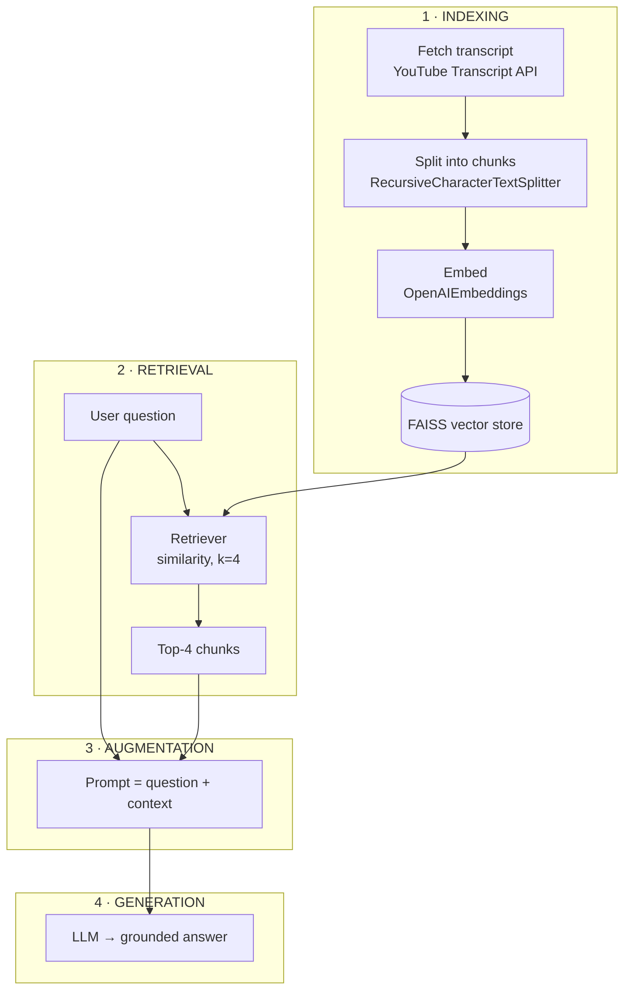
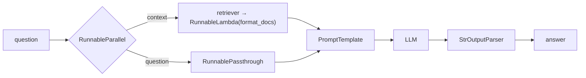

**In one line.** A RAG system that lets you ask questions about any YouTube video without watching it.

## The problem

Long videos are expensive to search. A three-hour podcast might mention one topic you care about for six minutes. Today you either scrub through it or watch the whole thing.

With this system you ask: *"Is AI discussed in this podcast? Summarise it in five bullets."* — and get an answer in seconds.

## Plan

We follow the four RAG stages directly.



## Setup

```bash
pip install langchain langchain-openai langchain-community \
            youtube-transcript-api faiss-cpu tiktoken python-dotenv
```

```python
from dotenv import load_dotenv
load_dotenv()   # needs OPENAI_API_KEY
```

## Step 1a — fetch the transcript

```python
from youtube_transcript_api import YouTubeTranscriptApi, TranscriptsDisabled

video_id = "Gfr50f6ZBvo"     # just the ID, not the full URL

try:
    transcript_list = YouTubeTranscriptApi.get_transcript(video_id, languages=["en"])
    transcript = " ".join(chunk["text"] for chunk in transcript_list)
except TranscriptsDisabled:
    print("No captions available for this video.")
    transcript = ""

print(len(transcript))
```

The API returns a list of `{text, start, duration}` dictionaries — one per caption line. We join them into a single string, discarding timestamps.

:::tip Two gotchas
**Use the ID, not the URL.** From `youtube.com/watch?v=Gfr50f6ZBvo`, pass `Gfr50f6ZBvo`.

**Match the language.** A Hindi video has no English transcript, so `languages=["en"]` raises. Use `["hi"]`, or list several: `["en", "hi"]`.

LangChain does have a `YoutubeLoader`, but the API directly has proven more reliable across videos.
:::

## Step 1b — split

```python
from langchain.text_splitter import RecursiveCharacterTextSplitter

splitter = RecursiveCharacterTextSplitter(chunk_size=1000, chunk_overlap=200)
chunks = splitter.create_documents([transcript])
print(len(chunks))     # ~168 for a two-hour video
```

`chunk_size=1000` with `chunk_overlap=200` is a reasonable starting point for transcripts. Tune it against answer quality.

:::note Why transcripts need overlap
Speech has no paragraph breaks. A spoken explanation runs continuously, so chunk boundaries land arbitrarily. Overlap is what stops an idea being cut in half.
:::

## Step 1c — embed and store

```python
from langchain_openai import OpenAIEmbeddings
from langchain_community.vectorstores import FAISS

embeddings = OpenAIEmbeddings(model="text-embedding-3-small")
vector_store = FAISS.from_documents(chunks, embeddings)
```

`from_documents` creates the store and adds the documents in one call. FAISS is in-memory — perfect here, since we rebuild per video.

Indexing complete.

## Step 2 — retrieval

```python
retriever = vector_store.as_retriever(
    search_type="similarity",
    search_kwargs={"k": 4},
)

docs = retriever.invoke("What is deepmind?")
for d in docs:
    print(d.page_content[:200], "\n---")
```

Query in, four Documents out. Retrievers are Runnables, hence `invoke`.

## Step 3 — augmentation

```python
from langchain_openai import ChatOpenAI
from langchain_core.prompts import PromptTemplate

llm = ChatOpenAI(model="gpt-4o", temperature=0.2)

prompt = PromptTemplate(
    template="""You are a helpful assistant.
Answer ONLY from the provided transcript context.
If the context is insufficient, just say you don't know.

{context}

Question: {question}""",
    input_variables=["context", "question"],
)
```

Low temperature because we want faithful extraction, not creativity.

The retriever returns a *list* of Documents, but the prompt wants a *string*, so we flatten:

```python
def format_docs(retrieved_docs):
    return "\n\n".join(doc.page_content for doc in retrieved_docs)

question = "Is the topic of aliens discussed in this video? If yes, what was said?"
retrieved_docs = retriever.invoke(question)
context_text = format_docs(retrieved_docs)

final_prompt = prompt.invoke({"context": context_text, "question": question})
```

## Step 4 — generation

```python
answer = llm.invoke(final_prompt)
print(answer.content)
```

The pipeline works — but every stage is invoked by hand.

## Step 5 — make it one chain

Look at the structure. The prompt needs **two** inputs. `question` comes straight from the user. `context` has to travel through the retriever first. So the two arrive by different routes and must run in parallel.



```python
from langchain_core.runnables import RunnableParallel, RunnablePassthrough, RunnableLambda
from langchain_core.output_parsers import StrOutputParser

parallel_chain = RunnableParallel({
    "context":  retriever | RunnableLambda(format_docs),
    "question": RunnablePassthrough(),
})

parser = StrOutputParser()
main_chain = parallel_chain | prompt | llm | parser

print(main_chain.invoke("Can you summarise the video?"))
```

Three details worth naming, because each is a pattern you will reuse:

- **`RunnableLambda(format_docs)`** — `format_docs` is a plain function, and only Runnables can join a chain.
- **`RunnablePassthrough()`** — carries the question through untouched, so it arrives alongside the context.
- **`retriever | RunnableLambda(format_docs)`** — retrievers are Runnables, so they pipe like anything else.

Test it:

```python
main_chain.get_graph().print_ascii()

print(main_chain.invoke("What is deepmind?"))
print(main_chain.invoke("Was nuclear fusion discussed? If so, what was said?"))
print(main_chain.invoke("Who is the president of France?"))   # -> "I don't know"
```

That last one matters. A question the transcript cannot answer should return "I don't know," not a confident guess. If it guesses, your grounding instruction is not working.

## Complete script

```python
from dotenv import load_dotenv
from youtube_transcript_api import YouTubeTranscriptApi, TranscriptsDisabled
from langchain.text_splitter import RecursiveCharacterTextSplitter
from langchain_openai import OpenAIEmbeddings, ChatOpenAI
from langchain_community.vectorstores import FAISS
from langchain_core.prompts import PromptTemplate
from langchain_core.output_parsers import StrOutputParser
from langchain_core.runnables import RunnableParallel, RunnablePassthrough, RunnableLambda

load_dotenv()


def build_chain(video_id: str, language: str = "en"):
    try:
        transcript_list = YouTubeTranscriptApi.get_transcript(video_id, languages=[language])
    except TranscriptsDisabled:
        raise RuntimeError("No captions available for this video.")

    transcript = " ".join(chunk["text"] for chunk in transcript_list)

    splitter = RecursiveCharacterTextSplitter(chunk_size=1000, chunk_overlap=200)
    chunks = splitter.create_documents([transcript])

    vector_store = FAISS.from_documents(chunks, OpenAIEmbeddings(model="text-embedding-3-small"))
    retriever = vector_store.as_retriever(search_type="similarity", search_kwargs={"k": 4})

    prompt = PromptTemplate(
        template="""You are a helpful assistant.
Answer ONLY from the provided transcript context.
If the context is insufficient, just say you don't know.

{context}

Question: {question}""",
        input_variables=["context", "question"],
    )

    def format_docs(docs):
        return "\n\n".join(d.page_content for d in docs)

    parallel_chain = RunnableParallel({
        "context":  retriever | RunnableLambda(format_docs),
        "question": RunnablePassthrough(),
    })

    return parallel_chain | prompt | ChatOpenAI(model="gpt-4o", temperature=0.2) | StrOutputParser()


if __name__ == "__main__":
    chain = build_chain("Gfr50f6ZBvo")
    print(chain.invoke("Summarise this video in five bullet points."))
```

## Where to take it

**A real interface.** A Streamlit page that takes a URL and opens a chat window, or a browser extension that activates on YouTube and lets you chat while watching.

**Evaluation.** You cannot improve what you do not measure. **RAGAS** scores a RAG system on faithfulness (is the answer supported by the context?), answer relevance, context precision and context recall. **LangSmith** traces every step so you can see exactly which chunks were retrieved. Adding evaluation is the single biggest step from demo to system.

**Better indexing.** Auto-generated transcripts contain errors — clean them first. Non-English transcripts can be translated at ingestion. Swap the recursive splitter for the semantic chunker. Move from FAISS to Pinecone or Qdrant for persistence.

**Better retrieval.** Rewrite short user queries with an LLM before searching. Use [MultiQuery](/docs/genai/retrievers) for ambiguous questions. Use MMR for diversity. Add keyword search alongside semantic search (hybrid retrieval) and merge. Re-rank results with an LLM.

**Better augmentation.** Trim the context to fit the window. Strengthen the grounding instruction. Add few-shot examples of good answers.

**Better generation.** Ask for citations — which part of the context each claim came from. Add guardrails so the system refuses to answer out of scope.

These are the techniques collectively marketed as **Advanced RAG**. The gap between this project and a production system is mostly this list.

## Pitfalls

- **Passing the full URL as the video ID.**
- **Requesting the wrong transcript language.**
- **Forgetting `RunnableLambda`** around `format_docs`.
- **Passing Documents where a string is expected.** The prompt needs flattened text.
- **Not testing an out-of-scope question.** It is the only way to verify grounding works.

## Checklist

- [ ] I can fetch and join a YouTube transcript
- [ ] I can build the full indexing pipeline
- [ ] I can explain why `RunnableParallel` is needed here
- [ ] I can explain the roles of `RunnablePassthrough` and `RunnableLambda`
- [ ] I verified the system says "I don't know" when it should
