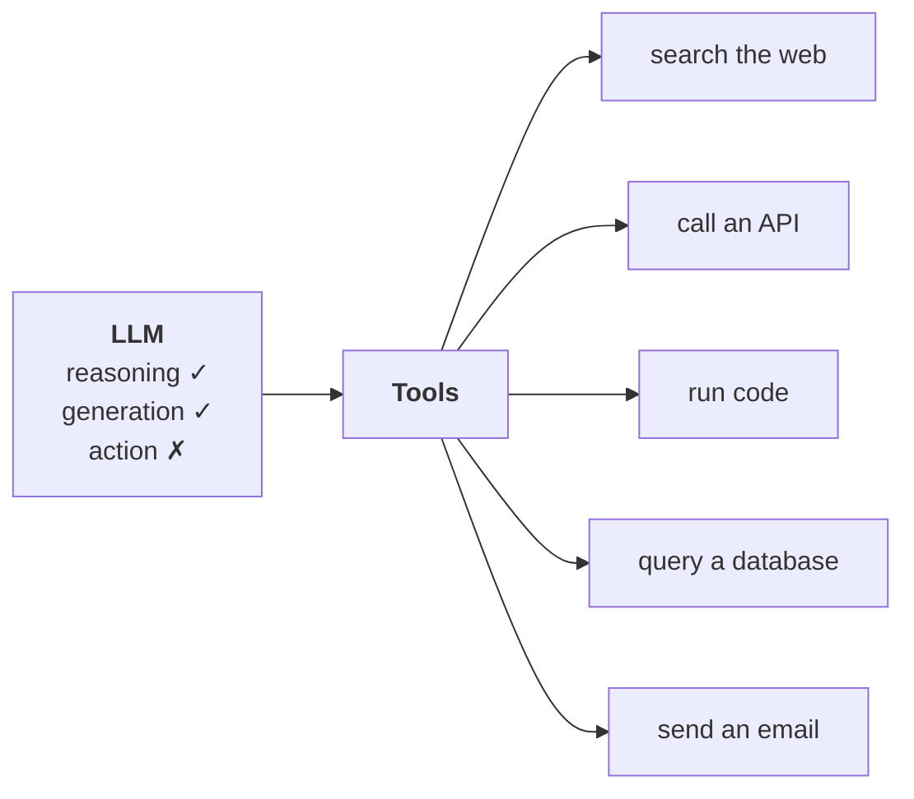

**In one line.** An LLM can think and speak but cannot *do*; a tool is a Python function packaged so the model can call it.

## What LLMs cannot do

Two things they are genuinely good at:

1. **Reasoning** — break a question down and work out how to answer it.
2. **Language generation** — produce a fluent, relevant response.

Think of a mind that can reason and speak but has no hands. Ask for the best way to get from Delhi to Mumbai and you get a thoughtful answer. Ask it to *book the ticket* and nothing happens.

Concretely, an LLM on its own cannot:

- fetch live weather or prices
- do reliable arithmetic (basic sums yes; anything complex, not dependably)
- call an external API
- run code
- query or modify a database
- post to a social account on your behalf

**Tools are the hands.** Each tool is a function with logic to perform a task, packaged so the model can invoke it. Add more tools, widen what the model can do.



And that is the whole of an agent:

> **Agent = LLM (reasoning) + tools (action)**

## Built-in tools

LangChain ships production-ready tools for common tasks. Import and use.

| Tool | Does |
|---|---|
| `DuckDuckGoSearchRun` | search the web |
| `WikipediaQueryRun` | search and summarise Wikipedia |
| `PythonREPLTool` | execute raw Python |
| `ShellTool` | run shell commands |
| `RequestsGetTool` | make HTTP requests |
| `GmailSendMessageTool` | send email |
| `SlackSendMessageTool` | post to Slack |
| `QuerySQLDatabaseTool` | run SQL |

```python
from langchain_community.tools import DuckDuckGoSearchRun

search_tool = DuckDuckGoSearchRun()
print(search_tool.invoke("top news in India today"))
```

Tools are Runnables, so they answer to `invoke`.

```python
from langchain_community.tools import ShellTool

shell_tool = ShellTool()
print(shell_tool.invoke("whoami"))
```

:::danger The shell tool deserves respect
It runs arbitrary commands on the host. In production, a model that decides to run something destructive will succeed. Sandbox it, restrict it, or leave it out.
:::

## Custom tools

Write your own when no built-in fits — which is most of the time in a real product. Typical cases:

- calling **your own API**
- encapsulating **your business logic**
- letting the model interact with **your database or app**

LangChain cannot ship a tool for your company's booking system. You write it.

### Way 1 — the `@tool` decorator (use this)

Three steps.

```python
from langchain_core.tools import tool

@tool                                          # 3. decorate
def multiply(a: int, b: int) -> int:           # 2. type hints
    """Given two numbers a and b, this tool returns their product."""   # 1. docstring
    return a * b

print(multiply.invoke({"a": 3, "b": 5}))       # 15
```

1. **Write the function** with a docstring. The docstring is not documentation for you — it is how the **model** learns what the tool does. Omit it and the model is guessing.
2. **Add type hints.** They tell the model what to pass and what comes back.
3. **Apply `@tool`.** That is what makes the function callable by an LLM.

Every tool exposes three attributes:

```python
print(multiply.name)          # multiply
print(multiply.description)   # the docstring
print(multiply.args)          # {'a': {'title': 'A', 'type': 'integer'}, ...}
```

### What the model actually sees

Not your function body. It sees a **JSON schema**:

```python
print(multiply.args_schema.model_json_schema())
```

```json
{
  "description": "Given two numbers a and b, this tool returns their product.",
  "properties": {
    "a": {"title": "A", "type": "integer"},
    "b": {"title": "B", "type": "integer"}
  },
  "required": ["a", "b"],
  "title": "multiply",
  "type": "object"
}
```

This is the single most clarifying fact about tools. When you bind a tool to a model, **you send the schema, never the implementation**. The model knows the name, the purpose and the argument shape — nothing about how the work gets done.

It also explains why docstrings and type hints matter so much: they are the entire contract.

### Way 2 — `StructuredTool` with Pydantic

Same result, stricter argument validation.

```python
from langchain_core.tools import StructuredTool
from pydantic import BaseModel, Field

class MultiplyInput(BaseModel):
    a: int = Field(required=True, description="The first number to multiply")
    b: int = Field(required=True, description="The second number to multiply")

def multiply_func(a: int, b: int) -> int:
    return a * b

multiply = StructuredTool.from_function(
    func=multiply_func,
    name="multiply",
    description="Multiply two numbers",
    args_schema=MultiplyInput,
)

print(multiply.invoke({"a": 3, "b": 5}))
```

Instead of inferring everything from the function, you state name, description and schema explicitly. More verbose, more control, better per-field descriptions. Worth it for production tools where a wrong argument is expensive.

### Way 3 — subclass `BaseTool`

The most control. `BaseTool` is the abstract base every tool inherits from — including everything `@tool` and `StructuredTool` produce.

```python
from langchain_core.tools import BaseTool
from pydantic import BaseModel, Field
from typing import Type

class MultiplyInput(BaseModel):
    a: int = Field(required=True, description="The first number to multiply")
    b: int = Field(required=True, description="The second number to multiply")

class MultiplyTool(BaseTool):
    name: str = "multiply"
    description: str = "Multiply two numbers"
    args_schema: Type[BaseModel] = MultiplyInput

    def _run(self, a: int, b: int) -> int:
        return a * b

multiply = MultiplyTool()
print(multiply.invoke({"a": 3, "b": 5}))
```

`_run` is a required name. The payoff: you can also define `_arun` for an async version — which neither of the other approaches supports. Reach for this when you need concurrency.

### Choosing

| Approach | Use when |
|---|---|
| **`@tool`** | **almost always — covers 80–90% of cases** |
| `StructuredTool` | production tools needing strict argument validation |
| `BaseTool` | deep customisation, or async |

## Toolkits

Group related tools for reuse.

```python
from langchain_core.tools import tool

@tool
def add(a: int, b: int) -> int:
    """Add two numbers."""
    return a + b

@tool
def multiply(a: int, b: int) -> int:
    """Multiply two numbers."""
    return a * b

class MathToolkit:
    def get_tools(self):
        return [add, multiply]

toolkit = MathToolkit()
for t in toolkit.get_tools():
    print(t.name, "->", t.description)
```

A Google Drive toolkit might bundle upload, search and read. The point is **reusability** — package once, use across projects. LangChain ships built-in toolkits too.

## Pitfalls

- **No docstring.** The model cannot tell what the tool does, so it will not call it correctly.
- **No type hints.** The model guesses argument types.
- **Vague names.** `process_data` tells the model nothing; `get_current_weather` does.
- **Expecting the model to see your code.** It sees the schema only.
- **Exposing dangerous tools without guardrails.** Shell and SQL tools especially.

## Checklist

- [ ] I can explain what LLMs cannot do and why tools exist
- [ ] I can use a built-in tool
- [ ] I can write a custom tool with `@tool` and name the three steps
- [ ] I know what the model actually receives about a tool
- [ ] I can name all three creation approaches and when each applies
- [ ] I can bundle related tools into a toolkit
