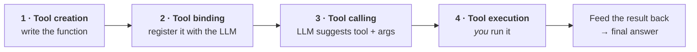
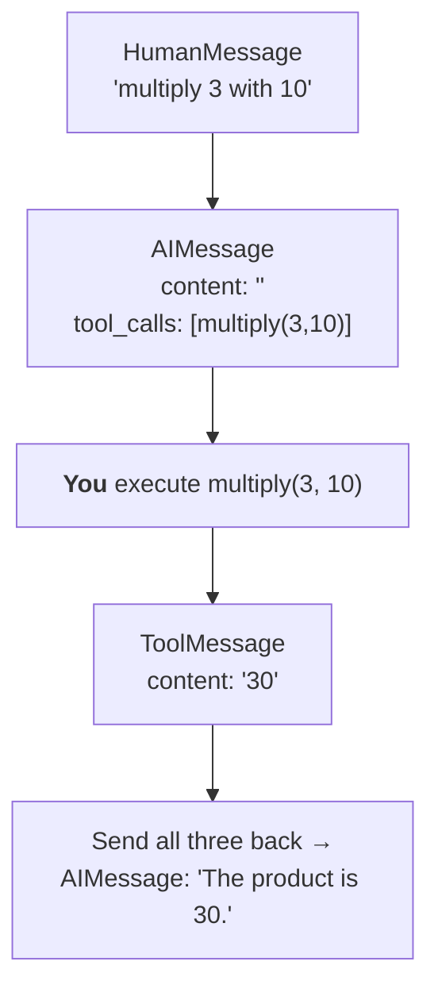
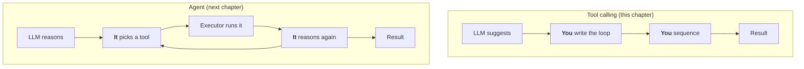

**In one line.** Tool calling is the model **suggesting** which tool to run and with what arguments — you run it, then hand the result back.

Four steps:



## Step 1 — create the tool

```python
from langchain_core.tools import tool

@tool
def multiply(a: int, b: int) -> int:
    """Given two numbers a and b, this tool returns their product."""
    return a * b
```

## Step 2 — bind it

Binding tells the model three things: which tools exist, what each does, and what arguments each expects.

```python
from langchain_openai import ChatOpenAI
from dotenv import load_dotenv
load_dotenv()

llm = ChatOpenAI(model="gpt-4o")
llm_with_tools = llm.bind_tools([multiply])
```

Capture the result in a new variable — `bind_tools` returns a new object rather than mutating the original.

:::warning Not every model supports tool binding
Tool calling is a capability the model must be fine-tuned for. Frontier models (GPT, Claude, Gemini) support it; many small open-source models do not. LangChain's chat-model documentation lists which providers offer it.
:::

## Step 3 — tool calling

Now ask something that does not need a tool:

```python
result = llm_with_tools.invoke("Hi, how are you?")
print(result.content)      # "Hello! I'm here to help..."
print(result.tool_calls)   # []
```

No tool call. The model handled it unaided.

Now ask something that does:

```python
result = llm_with_tools.invoke("Can you multiply 3 with 10?")
print(result.content)      # '' - empty!
print(result.tool_calls)
# [{'name': 'multiply', 'args': {'a': 3, 'b': 10}, 'id': 'call_...', 'type': 'tool_call'}]
```

Two things changed. `content` is **empty** — the model did not answer. And `tool_calls` is populated with the tool name and the arguments it extracted from your sentence.

:::danger The most common misconception
**The LLM does not execute the tool.** It only *suggests* a tool and arguments. Execution is handled by you, or by LangChain on your behalf.

This is a deliberate safety design. If models executed tools autonomously, a wrong choice would run before you could intervene — a database wipe, an unwanted purchase. Keeping execution under your control means the model advises and you decide.
:::

## Step 4 — tool execution

Two ways to run it.

```python
# Pass just the arguments -> raw return value
print(multiply.invoke(result.tool_calls[0]["args"]))   # 30

# Pass the whole tool call -> a ToolMessage
tool_result = multiply.invoke(result.tool_calls[0])
print(tool_result)
# ToolMessage(content='30', name='multiply', tool_call_id='call_...')
```

**Prefer the second.** A `ToolMessage` is the fourth message type — alongside `SystemMessage`, `HumanMessage` and `AIMessage` — and it carries the `tool_call_id` that links the result back to the request. That link is what lets you send it to the model so it can compose a final answer.

## Putting the loop together

```python
from langchain_core.messages import HumanMessage

query = HumanMessage("Can you multiply 3 with 10?")
messages = [query]

# 1. Model suggests a tool
ai_message = llm_with_tools.invoke(messages)
messages.append(ai_message)

# 2. We execute it
tool_result = multiply.invoke(ai_message.tool_calls[0])
messages.append(tool_result)

# 3. Model sees the result and answers
final = llm_with_tools.invoke(messages)
print(final.content)      # "The product of 3 and 10 is 30."
```



Building a message list is the pattern. The model needs the whole trace — what was asked, what it suggested, what came back — to produce a sensible final answer.

## A real application: live currency conversion

An LLM cannot know today's exchange rate. Its training data is stale. Two tools fix that.

```python
import requests
import json
from langchain_core.tools import tool
from langchain_core.messages import HumanMessage
from langchain_openai import ChatOpenAI
from dotenv import load_dotenv
load_dotenv()


@tool
def get_conversion_factor(base_currency: str, target_currency: str) -> dict:
    """Fetch the live currency conversion factor between a base and a target currency."""
    url = (f"https://v6.exchangerate-api.com/v6/YOUR_API_KEY/pair/"
           f"{base_currency}/{target_currency}")
    return requests.get(url).json()


@tool
def convert(base_currency_value: float, conversion_rate: float) -> float:
    """Given a currency conversion rate, calculate the target value from a base value."""
    return base_currency_value * conversion_rate


llm = ChatOpenAI(model="gpt-4o")
llm_with_tools = llm.bind_tools([get_conversion_factor, convert])

messages = [HumanMessage(
    "What is the conversion factor between USD and INR, "
    "and based on that convert 10 USD to INR?"
)]

ai_message = llm_with_tools.invoke(messages)
print(ai_message.tool_calls)
```

### The bug this exposes

Inspect those tool calls and you find something wrong:

```python
[
  {'name': 'get_conversion_factor', 'args': {'base_currency': 'USD', 'target_currency': 'INR'}},
  {'name': 'convert', 'args': {'base_currency_value': 10, 'conversion_rate': 74.53}},
]
```

Where did `74.53` come from? The first tool has not run yet — there is no rate to use.

The model handled both requests **in one pass**. To call `convert` it needed a `conversion_rate`, did not have one, and so filled it from its training data. A stale number, invented to satisfy the schema.

Your whole logic depended on threading the *real* rate from tool one into tool two. It just got silently bypassed.

### The fix: `InjectedToolArg`

Mark an argument as one the model must **not** fill.

```python
from typing import Annotated
from langchain_core.tools import InjectedToolArg

@tool
def convert(base_currency_value: float,
            conversion_rate: Annotated[float, InjectedToolArg]) -> float:
    """Given a currency conversion rate, calculate the target value from a base value."""
    return base_currency_value * conversion_rate
```

Re-run and the second tool call carries only `base_currency_value`. The `conversion_rate` slot is left empty — for **you** to fill after the first tool has run.

### Executing dependent tools in order

```python
for tool_call in ai_message.tool_calls:
    if tool_call["name"] == "get_conversion_factor":
        tool_message1 = get_conversion_factor.invoke(tool_call)
        conversion_rate = json.loads(tool_message1.content)["conversion_rate"]
        messages.append(tool_message1)

    if tool_call["name"] == "convert":
        tool_call["args"]["conversion_rate"] = conversion_rate     # inject it
        tool_message2 = convert.invoke(tool_call)
        messages.append(tool_message2)

print(llm_with_tools.invoke(messages).content)
```

:::tip `ToolMessage.content` is a string
`tool_message1.content` holds JSON **as text**, so `tool_message1.content["conversion_rate"]` fails. Run it through `json.loads` first.
:::

## Is this an agent?

No — and the distinction is worth being precise about.

An agent is **autonomous**: it decides on its own to call tool one, reads the result, reasons that it now needs tool two, calls it, and continues until it is done.

In this code, **you** wrote the loop. You checked tool names, you sequenced the calls, you injected the rate. The model advised; you orchestrated.



That said, everything here is the foundation. [Agents](/docs/genai/agents) automate the loop you just wrote by hand.

## Pitfalls

- **Expecting the LLM to execute tools.** It never does.
- **Reading `.content` on a tool-calling response.** It is empty; read `.tool_calls`.
- **Passing only `args` when you want a `ToolMessage`.** Pass the whole tool call.
- **Dependent tools without `InjectedToolArg`.** The model invents the missing value.
- **Treating `ToolMessage.content` as a dict.** It is a string.
- **Not appending the `AIMessage`** to the history before sending it back.

## Checklist

- [ ] I can name the four steps of tool calling
- [ ] I can explain why the model does not execute tools, and why that is correct
- [ ] I can read `tool_calls` and execute a suggested tool
- [ ] I can explain what a `ToolMessage` is and why `tool_call_id` matters
- [ ] I can spot and fix the dependent-argument bug with `InjectedToolArg`
- [ ] I can explain why this is not yet an agent
