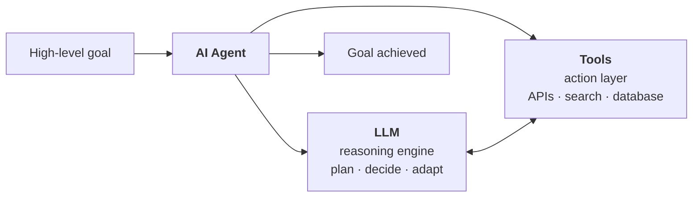
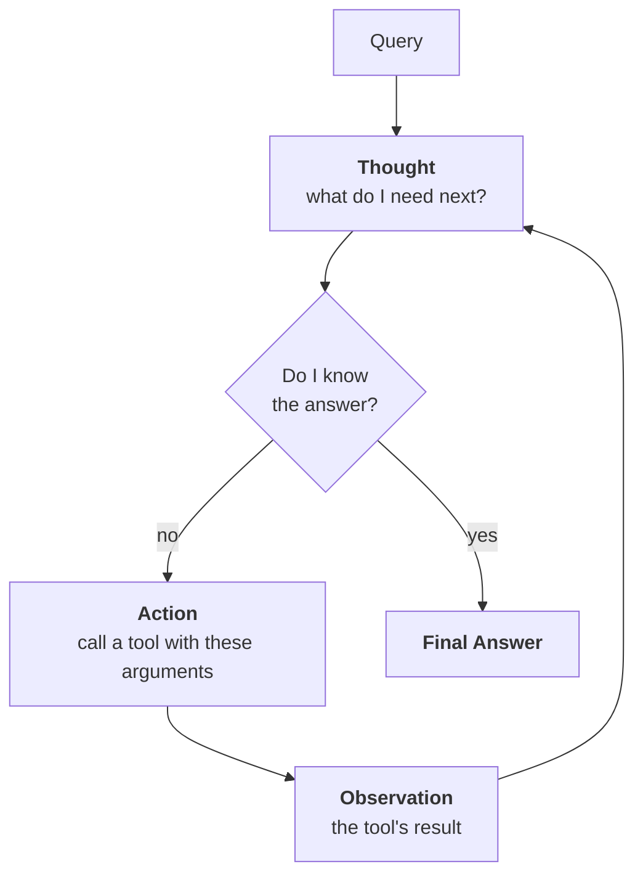
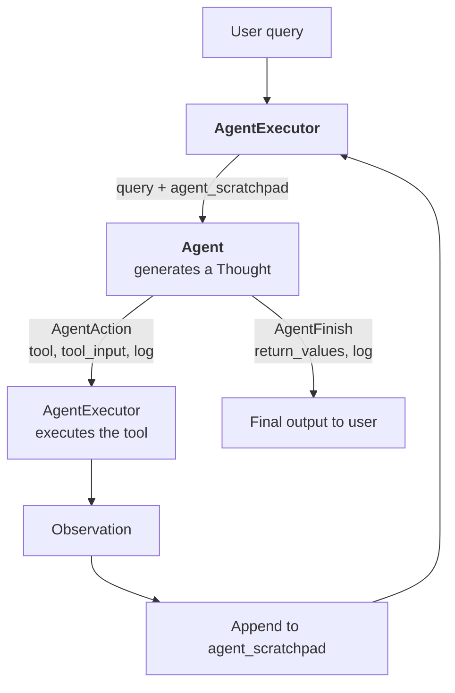

**In one line.** An agent takes a high-level goal and works out the steps itself — reasoning with an LLM, acting through tools, looping until done.

## The problem agents solve

Planning a week-long trip today means: open a travel site, fill a form, compare trains and flights, book both legs. Open the hotels section, fill another form, compare, book. Search for attractions, build an itinerary, arrange local transport. Pay, save invoices, add calendar entries.

Hours of form-filling and cross-referencing across days. And it assumes you are comfortable with these websites — which many people, particularly older users, are not.

**An agent collapses that into a conversation.** State the goal — *"Plan a budget trip from Delhi to Goa, 1–7 May"* — and it researches options, proposes the cheapest, waits for your yes, books it, moves to hotels, then local transport, then the itinerary, then presents a total cost and handles payment.

The work does not shrink. It moves.

## Definition

> An **AI agent** receives a high-level goal and autonomously plans, decides and executes a sequence of actions using external tools, APIs and knowledge sources — maintaining context, reasoning across steps, adapting to new information, and optimising for the intended outcome.



**Agent = LLM + tools.** The LLM decides; the tools do.

## Five characteristics

1. **Goal-driven.** You say what, not how.
2. **Planning.** It decomposes the goal into steps and sequences them.
3. **Tool awareness.** It knows what tools exist *and when each is appropriate*.
4. **Context maintenance.** Across many steps it remembers what it has done and what the user prefers.
5. **Adaptive.** If a tool fails or new information arrives, it re-plans rather than breaking.

That last one separates an agent from a script. A script with a dead API stops. An agent tries a different tool, or tells you and proposes an alternative.

## ReAct: Reasoning + Acting

There are several agent design patterns. **ReAct** is the most widely used, introduced in the 2022 paper *ReAct: Synergizing Reasoning and Acting in Language Models*.

An ordinary LLM interaction is single-turn: question in, answer out. ReAct replaces that with a **loop** of three moves:



### A worked trace

*"What is the population of the capital of France?"* — a question requiring two lookups.

**Iteration 1**
- *Thought:* I need to find the capital of France first.
- *Action:* `search("capital of France")`
- *Observation:* Paris

**Iteration 2**
- *Thought:* The capital is Paris. Now I need its population.
- *Action:* `search("population of Paris")`
- *Observation:* 2.1 million

**Iteration 3**
- *Thought:* I now know the final answer.
- *Final Answer:* Paris is the capital of France, with a population of about 2.1 million.

The loop breaks the moment the model has enough. Two philosophies interleaved: **reasoning** via Thought, **acting** via Action.

**Why ReAct is popular:** it handles multi-step problems, it works naturally with tools, and the entire thought trace is visible — so you can audit exactly what the agent thought and did. That transparency matters more than it sounds when something goes wrong.

## Agent vs AgentExecutor

LangChain splits the work in two, and the split confuses everyone at first.

| | **Agent** | **AgentExecutor** |
|---|---|---|
| Role | the brain | the hands |
| Does | reasons, decides which tool and arguments | runs the loop, executes tools, collects results |
| Returns | `AgentAction` or `AgentFinish` | the final output |

> The **Agent thinks**. The **AgentExecutor does**.

Ask for Delhi's temperature times ten: the Agent reasons *"I need the temperature first, call the weather API"* — and stops. The AgentExecutor calls the API, gets 25, hands it back. The Agent reasons *"now multiply 25 by 10, use the calculator."* The AgentExecutor calls it, gets 250. The Agent decides it is done.

### The loop in detail



The **`agent_scratchpad`** is the thought trace so far — every Thought, Action and Observation. It starts empty and grows each iteration. On every pass the AgentExecutor sends the Agent two things: the original query, and the current scratchpad. That is the agent's working memory.

The Agent returns one of two objects:

- **`AgentAction`** — `{tool, tool_input, log}`. The loop continues.
- **`AgentFinish`** — `{return_values, log}`. The loop ends.

## Building one

```python
from langchain_openai import ChatOpenAI
from langchain.agents import create_react_agent, AgentExecutor
from langchain_community.tools import DuckDuckGoSearchRun
from langchain import hub
from dotenv import load_dotenv
load_dotenv()

search_tool = DuckDuckGoSearchRun()
llm = ChatOpenAI(model="gpt-4o")

prompt = hub.pull("hwchase17/react")      # a proven ReAct prompt

agent = create_react_agent(
    llm=llm,
    tools=[search_tool],
    prompt=prompt,
)

agent_executor = AgentExecutor(
    agent=agent,
    tools=[search_tool],
    verbose=True,
)

response = agent_executor.invoke({"input": "What are three ways to reach Goa from Delhi?"})
print(response["output"])
```

With `verbose=True` you watch the loop run — each Thought, each tool call, each Observation.

### About that prompt

`hub.pull("hwchase17/react")` fetches a community prompt from LangChain Hub — a shared repository of prompts. You could write your own; this one is battle-tested.

Read it and the whole mechanism becomes concrete. It tells the model which tools it has, then prescribes an exact format:

```text
Question: the input question you must answer
Thought: you should always think about what to do
Action: the action to take, should be one of [tool names]
Action Input: the input to the action
Observation: the result of the action
... (this Thought/Action/Action Input/Observation can repeat N times)
Thought: I now know the final answer
Final Answer: the final answer to the original question
```

So the ReAct loop is, quite literally, a **prompt format** the model has been asked to follow — plus a Python loop that parses its output and runs the tools.

### Why are tools passed twice?

`create_react_agent` needs them to describe the tools **in the prompt**. `AgentExecutor` needs them to **execute** them. Two different jobs, same list.

## Adding a second tool

```python
import requests
from langchain_core.tools import tool

@tool
def get_weather_data(city: str) -> str:
    """Fetch the current weather data for a given city."""
    url = f"https://api.weatherstack.com/current?access_key=YOUR_KEY&query={city}"
    return requests.get(url).json()


tools = [search_tool, get_weather_data]

agent = create_react_agent(llm=llm, tools=tools, prompt=prompt)
agent_executor = AgentExecutor(agent=agent, tools=tools, verbose=True)

response = agent_executor.invoke({
    "input": "Find the capital of Madhya Pradesh, then find its current weather condition"
})
print(response["output"])
```

Watch the trace and the two-step reasoning is explicit: search for the capital → observe "Bhopal" → call the weather tool with "Bhopal" → observe the conditions → answer. **Nobody wrote that sequence.** Compare with the [tool calling](/docs/genai/tool-calling) chapter, where you hand-wrote the loop. That difference is autonomy.

## An important caveat

LangChain's own documentation now recommends **LangGraph** for production agents. LangChain's agent abstractions work — the examples above run — but they were not designed for the complexity of real agentic systems: cycles, branching, persistence, human-in-the-loop, and fine-grained state control.

LangGraph models an agent as a **graph** with explicit nodes and edges, which is a better fit for how agents actually behave.

**Why learn this first, then?** Because the concepts carry over completely. ReAct, the Thought–Action–Observation loop, the scratchpad, the Agent/Executor split — all of it applies in LangGraph. You are learning the ideas, and you will change frameworks, not concepts.

## Pitfalls

- **Confusing Agent and AgentExecutor.** Brain and hands.
- **Forgetting `verbose=True`** while developing. You are debugging blind without it.
- **Passing tools to only one of the two.** Both need them.
- **Giving an agent too many tools.** Selection accuracy drops as the list grows.
- **No loop cap.** A confused agent can loop indefinitely. Set `max_iterations`.
- **Building a production agent on LangChain agents.** Use LangGraph.

## Checklist

- [ ] I can define an agent and name its five characteristics
- [ ] I can explain ReAct and trace a two-step problem through the loop
- [ ] I can state the Agent / AgentExecutor split
- [ ] I can explain what `agent_scratchpad` holds and why
- [ ] I can name the two objects an Agent returns and what each triggers
- [ ] I can build a ReAct agent with multiple tools
- [ ] I know why LangGraph is recommended for production
