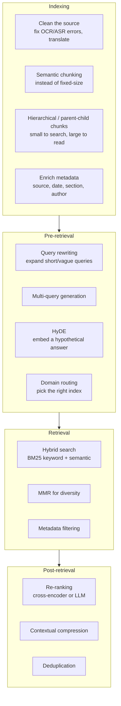
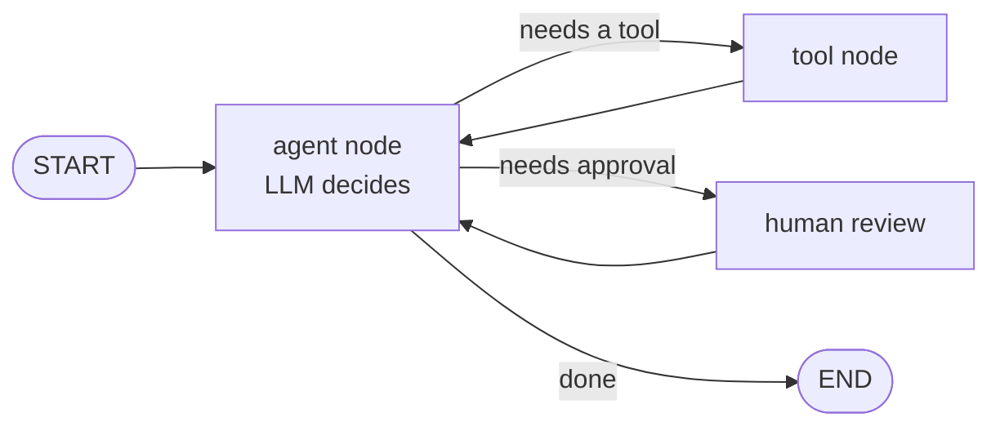
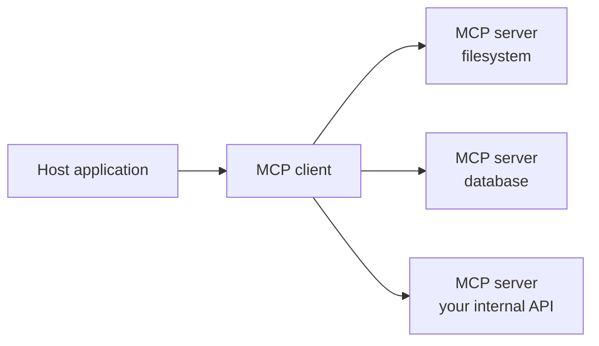

**In one line.** Everything so far builds a system that works; this chapter is about making one that keeps working.

## 1. Advanced RAG

A naive RAG pipeline fails in predictable ways. Each stage has known fixes.

**Query rewriting.** Users type three words. Have an LLM expand the query before it hits the retriever.

**HyDE (Hypothetical Document Embeddings).** Ask the LLM to *invent* an answer, embed that, and search with it. A hypothetical answer is lexically closer to real answers than the question was — often a large gain for little work.

**Hybrid retrieval.** Semantic search misses exact tokens: product codes, error numbers, surnames. Keyword search (BM25) misses paraphrase. Run both, merge with Reciprocal Rank Fusion. This is one of the highest-value upgrades available.

**Re-ranking.** Retrieve twenty candidates cheaply, then re-score them with a cross-encoder that reads query and document *together*. Slower per item, far more accurate than embedding similarity. Keep the top five.

**Parent-child chunking.** Index small chunks for precise matching, but return the larger parent chunk for context. Best of both.

## 2. Evaluating a RAG system

You cannot improve what you do not measure, and "the answers look good" is not measurement.

**RAGAS** scores four things:

| Metric | Question |
|---|---|
| **Faithfulness** | Is every claim in the answer supported by the retrieved context? |
| **Answer relevance** | Does the answer address the question asked? |
| **Context precision** | Of what was retrieved, how much was useful? |
| **Context recall** | Of what was needed, how much was retrieved? |

The last two diagnose **retrieval**; the first two diagnose **generation**. Low context recall means your retriever is missing documents — no amount of prompt engineering will fix that.

**LangSmith** traces every step of a run: which chunks came back, what the prompt looked like, tokens, latency, cost. When quality drops, the trace tells you which stage broke.

**Build a golden set.** Thirty to a hundred question-answer pairs, written by someone who knows the domain. Run it after every change. Without a regression set you are guessing.

## 3. LangGraph

LangChain expresses **chains** — directed acyclic graphs. Agents are not acyclic: they loop, branch, backtrack, pause for human approval and resume.

LangGraph models a workflow as a **state graph**: nodes are steps, edges are transitions, and a shared state object flows through.

What it gives you that chains cannot:

- **Cycles** — the fundamental agent shape.
- **Persistence** — checkpoint state, resume after a crash or days later.
- **Human-in-the-loop** — pause before consequential actions, wait for approval.
- **Streaming intermediate state** — show progress, not just the final answer.
- **Time travel** — rewind to an earlier state and take a different branch.

Everything you learned about ReAct, scratchpads and tool calling applies directly. The framework changes; the ideas do not.

## 4. Memory

LangChain's memory components are migrating to LangGraph. The strategies matter more than the API.

| Strategy | Keeps | Cost |
|---|---|---|
| Buffer | everything | grows without bound |
| Window | last *N* turns | bounded, forgets |
| Summary | an LLM summary of history | cheap, lossy |
| Vector-backed | embeds turns, retrieves relevant ones | scalable, more complex |
| Entity | facts about people and things | precise, needs design |

Production systems usually **combine** them: recent turns verbatim, older turns summarised, durable facts in a separate store.

## 5. Multi-agent systems

One agent with twenty tools picks the wrong one. Several specialist agents, each with three or four, do better.

**Supervisor pattern** — a coordinator routes work to specialists and assembles the result.

**Hierarchical** — supervisors of supervisors, for genuinely large problems.

**Peer collaboration** — agents debate or critique one another. A generator plus a critic often beats a single pass.

The costs are real: more tokens, more latency, harder debugging, and failures that compound across handoffs. Do not reach for multi-agent because it sounds sophisticated. Reach for it when one agent measurably cannot cope.

## 6. Model Context Protocol (MCP)

Every framework invented its own tool format, so integrations never transferred. MCP is an open standard: expose your capability once as an MCP server, and any compatible client can use it.

Servers expose **tools** (callable functions), **resources** (readable data) and **prompts** (reusable templates). Practically: write one integration instead of one per framework.

## 7. Guardrails and safety

**Input guardrails** — prompt-injection detection, PII scrubbing, topic restriction, rate limiting.

**Output guardrails** — check for hallucination against the retrieved context, block unsafe content, validate schema, enforce citations.

**Grounding and citations.** Require the model to cite which chunk each claim came from. Users can verify, and models cite less confidently when they are inventing.

:::danger Prompt injection is unsolved
If your system reads untrusted content — web pages, uploaded files, user-supplied text — that content can contain instructions aimed at your model. Treat every retrieved document as untrusted input. Defences (delimiters, instruction hierarchies, output filtering) reduce risk; none eliminate it.
:::

## 8. Cost and latency

**Prompt caching.** Providers cache repeated prefixes. Put stable content (system prompt, few-shot examples) first and variable content last — a large saving for near-zero effort.

**Semantic caching.** Cache answers by query embedding. A near-identical question returns the cached answer without a model call.

**Model routing.** Send easy requests to a small fast model, hard ones to a frontier model. Classification, extraction and formatting rarely need your most expensive option.

**Streaming.** Does not reduce cost, transforms perceived latency. Users tolerate a slow complete answer far less than a fast partial one.

**Batching.** Use `batch()` rather than looping `invoke()`.

**Context trimming.** Every retrieved token is billed. Compression and re-ranking pay for themselves.

## 9. Structured generation at scale

Beyond `with_structured_output`:

- **Constrained decoding** — restrict token sampling so output *cannot* violate the schema.
- **Retry with repair** — feed validation errors back and ask for a fix (`OutputFixingParser`).
- **Schema evolution** — version your schemas; consumers outlive producers.

## 10. Fine-tuning, revisited

RAG adds knowledge. Fine-tuning changes **behaviour**. Consider it when you need a consistent format or tone, a domain vocabulary the base model lacks, or a small fast model taught to imitate a large one (distillation).

**LoRA / QLoRA** train a small adapter while freezing base weights — orders of magnitude cheaper than full fine-tuning, and usually sufficient.

Most production systems use both: fine-tune for behaviour, RAG for facts.

## 11. Deployment and LLMOps

**Serving.** FastAPI plus LangServe exposes chains as endpoints. Stream with SSE or WebSockets.

**Observability.** Trace every request. Log prompts, retrieved context, token counts, latency, cost. You will need this the first time someone reports a bad answer.

**Versioning.** Prompts and schemas are code. Version them, review them, roll them back.

**Evaluation in CI.** Run your golden set on every change. Block merges that regress faithfulness.

**Canary releases.** Model and prompt changes are behaviour changes. Ship to a slice first.

**Feedback loops.** Collect thumbs up/down with the trace attached. That becomes your next evaluation set.

## 12. Multimodal and beyond

**Multimodal RAG** — index images and diagrams alongside text. Essential for technical manuals, where the diagram carries the meaning.

**Agentic RAG** — an agent that decides *whether* to retrieve, *which* index to use, and whether to search the web instead.

**Memory-augmented RAG** — personalised systems that recall what a specific user asked last week.

## A maturity ladder

| Level | You have |
|---|---|
| 0 | A prompt and a model |
| 1 | Naive RAG: load, split, embed, retrieve, generate |
| 2 | Better retrieval: hybrid search, re-ranking, metadata filters |
| 3 | Evaluation: a golden set, RAGAS, tracing |
| 4 | Agents: tool calling, ReAct, LangGraph |
| 5 | Production: guardrails, caching, cost control, CI evaluation, feedback |

Most tutorials stop at level 1. Most **value** appears between 2 and 5.

## Checklist

- [ ] I can name three advanced-RAG techniques and the failure each fixes
- [ ] I can explain the four RAGAS metrics and which stage each diagnoses
- [ ] I can explain why agents need LangGraph rather than chains
- [ ] I can name three memory strategies and their trade-offs
- [ ] I can explain prompt injection and why it is not solved
- [ ] I can list three ways to cut cost without hurting quality
- [ ] I can place my own project on the maturity ladder
