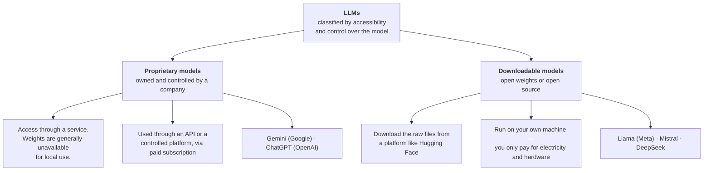
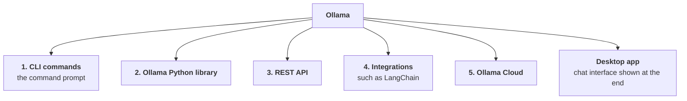
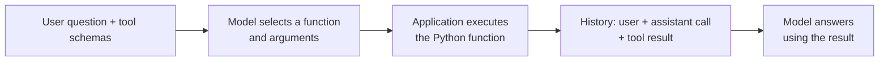
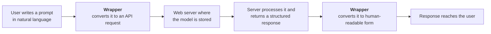
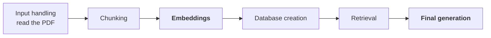

> **Video 21 of 21** · [Watch on YouTube](https://www.youtube.com/watch?v=YcAYmIFtA0o)

**In one line.** Use Ollama to download, run and customise language models on your own computer, then connect them to Python applications.

## Why run a model locally?

Proprietary models such as OpenAI's GPT models are convenient, but API access usually requires payment. For students without an international payment method, even a small API bill can be an obstacle.

Downloadable models such as **DeepSeek**, **Qwen** and **GLM** offer another route. You can run supported models on your own hardware and build applications without paying for each local model request.

This chapter covers model selection, hardware requirements and the main ways to use Ollama: **CLI**, **the Python library**, **REST API**, **LangChain**, **Ollama Cloud** and **the desktop app**.

## What an LLM is, briefly

LLMs are **complex neural networks** — many layers, many connections. At a lower level, an LLM is basically a **collection of numbers**, and those numbers are your **model weights and biases**. Everything the model learned during training is stored inside them.

## Classifying LLMs by accessibility and control

Based on how much control you have over the model you are using, LLMs split into two groups.



### Proprietary models

The provider controls access to the model, usually through an API or a hosted application. Its weights are generally unavailable for you to download and run locally. The provider may publish technical information about the architecture or training, while keeping the model itself private.

You use them **through an API** or through a **controlled platform**. For general purposes you open the chat application; for development and coding you use the API key.

And mostly you use them through a **paid subscription**. The free tier gives very limited access; for the advanced capabilities you have to pay.

**Summarised crisply:** with proprietary models you only have the right to *use* the model. Most of the time you do not have information about it.

### Open weights and open-source models

**Open weights** means the trained model weights are available to download. This does not automatically mean the training data or complete training code is public. The release may include architecture details, inference code and tools for fine-tuning.

**Open source** describes a broader level of openness; check which materials are released and what their licences allow. For running a model with Ollama, the practical starting point is a supported weight package and enough local hardware.

You can obtain supported models through Ollama's library or other model platforms. Local inference avoids a per-request hosted API charge, but still uses electricity, storage and compute. Access to weights also makes fine-tuning possible when the model format, tools, hardware and licence support it.

:::tip The cloth analogy
Having the weights is like having cloth you can work with, rather than buying access to a finished outfit. You have more control over how you use it, within the model's licence and your hardware limits.
:::

## So why do people still pay for proprietary models?

A downloadable model gives you local control. A hosted service can save you the work of managing hardware, model deployment and capacity. Which is better depends on your task, privacy requirements and operating costs.

**Because having many open-source models in the market does not mean using them is easy.** Using an open-source model is itself the **biggest pain point**.

When a company releases a model, it releases it as **raw model weights** — numbers, in an architecture. Downloading that and running it on your PC is a very big friction:

- **Storage.** How do you store these raw model weights on your local system? They have to be optimised so the LLM works well there. Do you know how to store them? Where would you store them?
- **Working memory.** Suppose you stored the model. Now you have to *use* it. How do you configure your working memory — your RAM and VRAM — to run it? The model has to run, calculations happen over the weights and biases, so working memory is needed. How do you optimise and configure it?
- **Compatibility.** Many times these raw weights and biases are **not compatible** with direct use on your local system.

Downloading weights is only the first step. You still need a compatible runtime and enough memory to use them efficiently.

**And this is exactly where Ollama comes in.**

## What Ollama is

> Ollama is a tool that helps you run large language models on your own computer.

In short: a tool with which you can **download, run and manage** open-source models — all on your local PC.

Ollama handles model downloads, storage, loading and a common interface for inference. You choose a supported model and send it requests. You still need to match its capabilities and memory requirements to your machine.

:::tip The WhatsApp analogy
Think of Ollama as WhatsApp for open-source models. When you use WhatsApp you only focus on **sending and receiving** — text messages, images, audio, video. How those messages are actually passed in the backend, how your privacy is maintained, how images travel — each and every thing is handled by WhatsApp for you.

Ollama is the same thing for open-source models.
:::

Another way to put it: **Ollama is a consultant** who handles, on your behalf, every technical aspect related to the model.

## The benefits of Ollama

### 1. Privacy and data control

You bring the open-source LLM onto your own PC and run it there. **Local inference keeps the prompt and response on your machine**, provided your application does not send them to external services. Downloaded local models can work **without internet**. Cloud models and external tools have a different data flow, covered below.

### 2. Low latency and offline access

Once a local model is downloaded, inference can work without internet. Local execution avoids a network round trip, but response time still depends on model size, hardware, prompt length and how much text you generate. A large model on a slow CPU can take longer than a hosted model.

### 3. Cost predictability and potential savings

The model sits on your local PC and you are using it, so **you do not need to pay anyone**.

With cloud or proprietary models, the model lives in a cloud, and you pay to interact with it — because the weights, biases and architecture responsible for generating output are all sitting there. With Ollama you have downloaded all of it locally.

### 4. Simple installation and setup

Installing Ollama is extremely easy — **one click** and it is set up on your local system. And it is not only Ollama that is easy to set up: downloading models locally and running them is also very easy, through simple commands.

**You do not need to be an ML engineer** to run an LLM locally. Anyone with a laptop of decent configuration can use Ollama.

### 5. A prebuilt model library

Ollama already has many models you can download and use, from the big companies — DeepSeek, Meta's Llama models, Qwen, and many more. Ollama has **already converted these models** into a format you can easily download, store and use.

Go to the **Models** section on the Ollama site and you will find a huge list, spanning many families — **Qwen**, **Mistral**, **Llama**, **Gemma**, **Llava**, **DeepSeek**.

Not only is the variety wide, the repository also lets you filter **by capability**:

| Filter | Gives you models that |
|---|---|
| **Vision** | can read your images |
| **Thinking** | have reasoning capabilities |
| **Tools** | support tool calling |
| **Embedding** | generate embeddings |
| **Cloud** | can run on Ollama Cloud |

And the **same model comes in different sizes**. Take Qwen 3 — it exists at many parameter counts, so you can download a size that matches your system's configuration.

### 6. Customisation

With Ollama you can set system instructions, adjust generation parameters and package them in a Modelfile. These settings guide inference. Fine-tuning is a separate training process that updates model weights.

### 7. More control over deployment

A downloaded model gives you control over where it runs and can reduce dependence on a hosted API. Its licence still applies. For example, the [Llama 3.2 model page](https://ollama.com/library/llama3.2:1b) includes a community licence and an acceptable-use policy. Check the chosen model's terms before using, modifying or redistributing it.

### 8. Easy to run and manage

Simple commands do everything. To bring a model onto your local system, `ollama pull`. To remove it, `ollama rm`. When you write `ollama pull`, Ollama does all the work on your behalf — which files to fetch, how many, where to store them. Removal is the same in reverse.

## Requirements

Since you are downloading and running models locally, there are some system requirements.

Ollama runs on **macOS, Windows and Linux**. But the main thing when using Ollama is **hardware**.

| Requirement | Guidance |
|---|---|
| **RAM** | At least **8 GB** is recommended, and more RAM gives a smoother experience. Leave room for the operating system, the model and its context; larger models need more memory. |
| **Processor** | An Intel Core i5 of the 13th generation or newer gives a smooth experience with the models in this course. Older or slower processors also work, but generation is slower. |
| **Storage** | you need room for the model files. Qwen 3-VL at 2 billion parameters needs roughly **2 GB**; the 8-billion version roughly **6.2 GB** |
| **Internet** | **first time only** — while downloading Ollama and the models |
| **Command line** | very basic knowledge; you can manage with little |
| **GPU** | **optional** — cherry on the cake, makes the experience much smoother |

## Installing Ollama

Search for Ollama, open the first link, and click **Download**. You get a setup file. Click it, then click **Install**. That is it — Ollama is on your local system.

## The five ways to use Ollama



:::note Ollama is not the model
A point worth being clear about. Whether a model gives good output, poor output, or cannot read images — **that depends on the model, not on Ollama**. Ollama downloads, runs and manages models for you. How well any given model answers your prompt is nothing to do with Ollama. It is used for those three tasks only.
:::

## Mode 1 — CLI

```bash
# check Ollama is installed
ollama --version

# bring a model from Ollama's repository onto your machine
ollama pull ministral-3:8b

# see which models are on your local system
ollama ls          # or: ollama list

# load a model into working memory and talk to it
ollama run llama3.2:1b

# delete a model
ollama rm llama3.2:1b
```

**What `ollama run` actually does.** Right now the model sits in your **storage**. This command takes all the files related to that model, lifts them out of storage and brings them into your **working memory** — your RAM or VRAM. As soon as the model is in working memory, you can use it.

Use the exact model tag when downloading. **Ministral 3 8B** is [`ministral-3:8b`](https://ollama.com/library/ministral-3:8b); the tag identifies both the model family and its size.

Then you can ask it anything — *"what is photosynthesis?"*, *"what fundamental rights does the Indian constitution give?"* — and it answers.

:::tip Try it offline
While using the model, **disconnect yourself from the internet** and then give it a prompt. It will still answer, with no error. Worth doing once, because it makes the point concrete.
:::

### Passing an image

Copy the path to an image and pass it with your prompt. But it may fail — try it with `llama3.2` and you get *"I cannot summarise the image file."*

**Why?** Because that model **does not have vision capabilities**; it only has tool calling. To have your image read you need a model with vision capability, such as **Gemma 3**. Load that instead, pass the same image, and it describes what is in it correctly.

### In-session commands

| Command | Does |
|---|---|
| `/bye` | exit the model and return to your shell |
| `/show` | list what you can inspect |
| `/show info` | architecture, parameters, context length, quantisation, capabilities |
| `/show parameters` | the model's default parameters |
| `/show system` | the current system instruction |
| `/show modelfile` | the configuration used to build the model |
| `/show template` | how messages are formatted for the model |
| `/show license` | the model's licence |
| `/set parameter top_p 0.9` | override a parameter |
| `/set system "You are a helpful assistant"` | set a system instruction |

Once you set a parameter, it **overrides** the model-defined one, and every output afterwards follows your system instruction and your parameter set.

:::note CLI is for experimentation
Command-line usage is mainly for **testing and experimentation** — developers try different prompts, different system instructions, different model behaviours. Once satisfied that a particular set of instructions and parameters gives the right output, they **integrate** that model into a real application, coded in Python or JavaScript.

That is why it is so easy here to pass a new system instruction or change a parameter.
:::

## Mode 2 — the Ollama Python library

If you want to build a chatbot with memory and an interface, the command line cannot do it. **You need to code.**

```bash
pip install ollama
```

### The `generate` method

```python
import ollama

response = ollama.generate(
    model="llama3.2:1b",
    prompt="Why does the moon glow?",
)

print(response)            # lots of metadata: model, created_at, eval_duration, eval_count...
print(response.response)   # just the text
```

The first run takes time, because the model has to move from storage into working memory.

### Streaming

```python
import ollama

response = ollama.generate(
    model="llama3.2:1b",
    prompt="Why does the moon glow?",
    stream=True,
)

for chunk in response:
    print(chunk.response, end="")
```

With `stream=False` you only see output once the whole thing is generated. With `stream=True` the output arrives **in chunks**, as it is generated.

### Passing images

:::note Python SDK and REST accept images differently
The **REST JSON payload** requires base64-encoded image data. The Python SDK also accepts file paths and raw bytes and handles encoding. The example below encodes the image explicitly. See the [vision reference](https://docs.ollama.com/capabilities/vision).
:::

```python
import base64
import ollama

with open("chart.png", "rb") as f:
    image_64 = base64.b64encode(f.read()).decode("utf-8")

response = ollama.generate(
    model="gemma3:4b",          # a model with vision capability
    prompt="Give a caption to the image",
    images=[image_64],
)

print(response.response)
```

To pass **multiple** images, encode each one and pass them all as a list. Then a prompt like *"generate a story based on the images"* produces a story drawing details from both.

### System instructions and parameters

```python
import ollama

response = ollama.generate(
    model="llama3.2:1b",
    prompt="Why do we dream?",
    system="You are a funny assistant. Answer everything in a humorous way.",
    options={
        "temperature": 0.9,
        "top_p": 0.95,
        "top_k": 40,
    },
)
```

The **`system`** parameter carries your system instruction — set it to a funny assistant and the phrasing of the output changes accordingly. The **`options`** parameter takes a dictionary of parameters to tune: temperature, top_k, top_p, min_p, stop and more.

### The limitation of `generate`

**`generate` does not maintain context awareness.** It is built for *one prompt, one output*. Ask a simple question, get an answer — but it does **not** maintain history the way ChatGPT or Gemini do.

Use **`chat`** for conversations. You supply the history in `messages`; the method does not automatically remember previous calls.

Keep both user and assistant messages before asking a follow-up question:

```python
import ollama

messages = [{"role": "user", "content": "My name is Ajay."}]
response = ollama.chat(model="llama3.2:1b", messages=messages)
messages.append(response.message)
messages.append({"role": "user", "content": "What is my name?"})
response = ollama.chat(model="llama3.2:1b", messages=messages)
print(response.message.content)
```

The second request includes the earlier introduction, so the model has the information needed to answer **Ajay**. The application owns this list. As it grows, it must still fit the model's context window.

### Other methods

Everything you can do from the CLI has a matching method:

```python
ollama.list()          # list models
ollama.pull("...")     # pull a model
ollama.delete("...")   # delete a model
ollama.show("...")     # show a model's details
ollama.push("...")     # push a model
```

`ollama.list()` returns model information; iterate over it if you only want names and sizes. `ollama.show()` gives you the date, the template showing how your input reaches the model, the Modelfile, licensing details, and the capabilities — for example, that Qwen 3 has completion, tool calling and thinking.

## Tool calling

> Tool calling is a method that allows an LLM to use external tools or systems to perform tasks it cannot do by itself.

In simple words: a way to get an LLM to do the work it is **not initially capable of**.

We all know LLMs are very good at **generation** and very good at **understanding language**. But there are tasks where they fail:

- *"Go and fetch data from my database"* — it cannot
- *"Give me the current temperature of Chandigarh"* — it cannot
- *"Give me the news of today"* — it cannot

**Why?** Because of the LLM's own limitations. The biggest is the **knowledge cutoff date** — it is trained on data up to some date, and beyond that it may not answer. The other is that **the LLM cannot interact with the outside world**.

With tool calling you give the LLM **additional capabilities** by giving it tools. The LLM is already very good at generation, reasoning, writing code and solving problems; tools extend that set.

*(This is the same concept covered in depth in the [tools](/docs/genai/tools) and [tool calling](/docs/genai/tool-calling) chapters.)*

### The Ollama workflow

Tool calling separates **choosing a tool** from **executing it**:

1. Write Python functions for the tasks the model cannot perform alone.
2. Describe each function with a **tool schema**: its name, purpose, argument types and required arguments.
3. Call `ollama.chat` with the user's messages and the schemas in `tools`. Use a model with **Tools** capability, such as `qwen3:8b`. `generate` has no `tools` parameter.
4. Read `response.message.tool_calls`. Each call identifies a function and its arguments. An empty text `content` can be normal at this stage.
5. Your application runs the selected function. Append the assistant message and the result as a message with `role="tool"`.
6. Send that history back to the model so it can answer using the result.



The schema describes what a function does and which arguments it accepts. The model returns a request to run it; your application executes the Python code. You can write schemas explicitly, as below, or let the SDK derive them from typed functions. See [Ollama's tool-calling reference](https://docs.ollama.com/capabilities/tool-calling).

### Worked example: an electronic shop

An electronic shop wants an assistant to answer two questions: **is the product in stock?** and **what does it cost after a loyalty discount?** The answers depend on the shop's inventory and pricing rule, so the model needs tools to look them up and calculate them.

Start with this inventory:

| Product | Stock | Base price |
| --- | ---: | ---: |
| Laptop | 5 | 1200 |
| Monitor | 0 | 300 |
| Keyboard | 25 | 80 |

Create the two functions and the name-to-function lookup used to dispatch calls. Run the Python blocks in order, in one notebook or script, so each block can use the names defined before it. First install `ollama` and download the model with `ollama pull qwen3:8b`.

```python
import json
import ollama

inventory_db = {
    "laptop": {"stock": 5, "base_price": 1200},
    "monitor": {"stock": 0, "base_price": 300},
    "keyboard": {"stock": 25, "base_price": 80},
}

def check_inventory(product_name: str) -> dict:
    return inventory_db.get(
        product_name.lower(), {"stock": 0, "base_price": None}
    )

def calculate_loyalty_discount(base_price: float, years_as_customer: int) -> float:
    discount = min(years_as_customer * 0.05, 0.30)
    return round(base_price * (1 - discount), 2)

available_functions = {
    "check_inventory": check_inventory,
    "calculate_loyalty_discount": calculate_loyalty_discount,
}
```

The first function returns the stored facts. The second gives **5% per year, capped at 30%**. For five years, the discount is `min(5 × 0.05, 0.30) = 0.25`, so a laptop costs `1200 × 0.75 = 900`. An unknown product returns no price; a monitor is listed but has zero stock.

Now describe the functions. `properties` defines the inputs; `required` identifies those the model must supply.

```python
tools = [
    {
        "type": "function",
        "function": {
            "name": "check_inventory",
            "description": "Get stock and base price for a product.",
            "parameters": {
                "type": "object",
                "properties": {"product_name": {"type": "string"}},
                "required": ["product_name"],
            },
        },
    },
    {
        "type": "function",
        "function": {
            "name": "calculate_loyalty_discount",
            "description": "Calculate the final price using loyalty years.",
            "parameters": {
                "type": "object",
                "properties": {
                    "base_price": {"type": "number"},
                    "years_as_customer": {"type": "integer"},
                },
                "required": ["base_price", "years_as_customer"],
            },
        },
    },
]
```

Before the model is called, the application keeps the whole conversation in a list called `messages`. It starts with the user's prompt. The model's reply and the tool's result are added to the same list later, because the final call must see the entire history.

The model is called with `ollama.chat`, passing both the messages and the tool schemas. Notice that the schemas go in, not the Python functions themselves.

```python
messages = [
    {"role": "user", "content": "I want to buy a laptop. Can you check stock?"}
]

response = ollama.chat(model="qwen3:8b", messages=messages, tools=tools)

print(response.message)
```

**Reading the output.** The assistant message has an empty `content`. The model has not written an answer; it has asked for a tool. A reasoning-capable model such as `qwen3` may also fill a `thinking` field that says it cannot check stock itself and will use `check_inventory`. The part that matters is `tool_calls`: a list holding the function name and its arguments, here `check_inventory` with `product_name` set to the laptop.

The model cannot run anything. Your code reads the request, runs the function and returns the result. Reading it from the response, instead of typing the name by hand, keeps the code general:

```python
call = response.message.tool_calls[0]
name = call.function.name
arguments = call.function.arguments
print(name, arguments)

function = available_functions[name]
result = function(**arguments)
print(result)
```

`available_functions` is the lookup built earlier. It turns the name the model chose into the real function. You could also write the function name out by hand; the lookup only saves you from doing that for every tool.

Now add two items to `messages`: the assistant message that asked for the tool, then a message with `role` set to `"tool"` that carries the result. The list now reads user, assistant, tool. Send the whole list back so the model can compose its answer.

```python
messages.append(response.message)
messages.append({
    "role": "tool",
    "tool_name": name,
    "content": json.dumps(result),
})

final = ollama.chat(model="qwen3:8b", messages=messages, tools=tools)
print(final.message.content)
```

**Reading the output.** The model now reads the user's question, its own request and the tool's result together, and writes a sentence such as "five laptops are in stock at a base price of 1200". Change the prompt to *"I want to buy an iPhone. Can you check stock?"* and the lookup finds no such product, so the same code ends with an answer that none is available.

:::note Why the history is sent back
The second call is a new request. The model has no memory of the first one, so the application must resend the question, the model's own tool request and the tool's result. That is exactly the conversation list you built.
:::

### A question that needs both tools

Try this prompt: *"I have been a customer for five years. What is the final price of the laptop?"*

The discount function needs the base price, and the base price comes from the inventory lookup. The model therefore asks for `check_inventory` first. Only after it sees the price can it ask for `calculate_loyalty_discount`. A single pass runs the first request and stops, so the second tool never runs.

The fix is to repeat the same steps until the model stops asking for tools. The loop below is the same code as above, run more than once and capped so it cannot spin forever.

```python
messages = [
    {"role": "system", "content": "Look up stock and price before calculating a discount. Do not guess prices."},
    {"role": "user", "content": "I have been a customer for five years. What is the final price of the laptop?"},
]

for _ in range(5):
    response = ollama.chat(model="qwen3:8b", messages=messages, tools=tools)
    messages.append(response.message)
    if not response.message.tool_calls:
        print(response.message.content)
        break
    for call in response.message.tool_calls:
        name = call.function.name
        result = available_functions[name](**call.function.arguments)
        print(name, call.function.arguments, result)
        messages.append({
            "role": "tool",
            "tool_name": name,
            "content": json.dumps(result),
        })
else:
    raise RuntimeError("Tool-call limit reached without a final answer")
```

**Reading the output.** Look at the printed calls, not only the final sentence. A correct run prints the inventory lookup (stock 5, base price 1200) and then the discount calculation, which gives **900**: five years at 5% a year is 25% off, so `1200 × 0.75 = 900`. If the final text shows a different number, check that the discount function was really called and that its result is in `messages`.

:::note This loop is an addition
The sequence of steps above follows the course demo. The system message and the loop are added here so that a question needing two dependent tools gets a complete answer. The lookup only permits the two named functions; a real application must also validate the arguments and handle failures.
:::

## Modelfiles — building a customised LLM

You can create your own customised model from an existing one, using a **Modelfile** — which is just a text file.

The trained **base model** supplies the learned capabilities. The Modelfile supplies instructions about how to use them. This changes how the model responds; it does **not retrain its weights**. Think of a student learning a new shortcut for a familiar problem, rather than relearning all the mathematics.

For a sentiment classifier, specify the base model, generation settings, output instructions and example responses. Save the following configuration as **`Modelfile`**, without a `.txt` extension, and run the next command from its directory.

```text
FROM llama3.2:1b
PARAMETER temperature 0.1
PARAMETER num_ctx 1024
PARAMETER num_predict 20
PARAMETER top_k 10

SYSTEM """
You are a sentiment analysis API.
You ONLY output JSON in the following schema: {"score": float, "label": "string"}.
Labels allowed: [POSITIVE, NEGATIVE, NEUTRAL].
Scores range from 0.0 to 1.0.
"""

MESSAGE user "This product is okay, but the shipping was slow."
MESSAGE assistant {"score": 0.4, "label": "NEUTRAL"}
MESSAGE user "Absolutely amazing experience, highly recommend!"
MESSAGE assistant {"score": 0.95, "label": "POSITIVE"}
```

| Instruction | What it controls |
| --- | --- |
| `FROM` | The existing base model |
| `PARAMETER` | Generation settings, including context and output-token budgets |
| `SYSTEM` | The model's role and response instructions |
| `MESSAGE` | Example user/assistant turns that guide responses |
| `TEMPLATE` | How prompts are assembled; this example keeps the base model's template |

`MESSAGE` examples are **few-shot prompting**: they show the model the response pattern to follow. They do not update its weights. The [Modelfile reference](https://docs.ollama.com/modelfile) describes the supported instructions.

```bash
ollama create sentiment:latest -f Modelfile
```

`ollama create` takes the name you want for your new model (with a tag), and `-f` points at the Modelfile it should build from. Ollama reads the existing model, applies the instructions from the file, and produces a **new customised LLM**.

Run `ollama ls` afterwards and your new model is there. Then:

```bash
ollama run sentiment:latest "I love the course"
```

The intended output is JSON containing a score and a label. Try *"I love the course but this course is expensive"* as a second input. Check both the JSON structure and the classification: a correctly formatted response can still assign the wrong label.

**The point:** a text configuration packages reusable behaviour around the base model. It does not guarantee correct sentiment labels. The small `num_predict 20` budget can also truncate output; raise it if JSON is incomplete. In application code, validate the result rather than trusting the system instruction alone.

You can also do this through the Python library — the API reference has a **create a model** method — but the command-line route is simpler.

## Mode 3 — REST API

So far we have used Ollama two ways: CLI commands and the Python library. Now an important fact:

> **Internally, Ollama works using REST API only.** The CLI commands and the Python library are just **wrappers** around the API endpoints.

### How proprietary models work, for comparison

A company trains a model and stores it on the **web**. As a user you interact with it through **API requests**.



The whole flow happens through API calls. And whichever method you use — the chatbot, or their libraries — **those methods are wrappers**: they turn your natural-language prompt into an API request, and turn the structured response back into something readable.

### Ollama follows exactly the same flow

**The only difference:** the brain — your LLM — is **not hosted on the web**. It is hosted **locally**.

The Ollama service listens locally by default at:

```text
http://localhost:11434
```

`ollama run` talks to that running service and loads the model as needed. The app can start the service; `ollama serve` starts it explicitly. CLI commands and the Python library send requests to the same service rather than creating a new server for each model call. The [FAQ](https://docs.ollama.com/faq) documents the default loopback binding and port.

### Seeing the endpoints

In the Ollama documentation, under **API references**, every method you have been using is really an **endpoint**:

| Method | Endpoint | Verb |
|---|---|---|
| `generate` | `/api/generate` | POST |
| `chat` | `/api/chat` | POST |
| `list` | `/api/tags` | GET |
| `push` | `/api/push` | POST |

**Which endpoint to hit, and which request to send — you do not need to worry about it.** Ollama handles that for you and interacts with the server on your behalf.

### Hitting the endpoint directly

```python
import requests
import json

url = "http://localhost:11434/api/generate"

payload = {
    "model": "llama3.2:1b",
    "prompt": "What are black holes?",
}

response = requests.post(url, json=payload)

# the output arrives as multiple JSON lines, so iterate and join
output = ""
for line in response.iter_lines():
    if line:
        output += json.loads(line).get("response", "")

print(output)
```

And for a GET endpoint:

```python
r = requests.get("http://localhost:11434/api/tags")
data = r.json()

for model in data["models"]:
    print(model["name"])
```

**Both approaches work and give the same output.** But notice: hitting the endpoint directly means writing these **extra lines of code**, and it gets a little more complex. Because the library is just a wrapper, it makes coding easy for you.

## Mode 4 — LangChain

### What LangChain is, briefly

> LangChain is an open-source framework with which you can build advanced-level LLM applications.

When you build an industry-level LLM application, frameworks like LangChain act as an **orchestrator layer**. You do not only give input to an LLM and generate output — you handle many components: memory, a web search, creating embeddings, and more. Your whole application is made of those components working together.

**LangChain coordinates between all those parts.**

### The RAG example

Say you need a chatbot over your company's policy, which exists as a PDF — so you need a RAG-based system. Look at how many components that means handling:



Of those, **only embedding and final generation** are done by the AI / the LLM. **All the other components have nothing to do with AI.**

So you have two options. **One:** code each individual component from scratch — write how a PDF is read, how chunks are made, how databases are created. **Two:** use a framework like LangChain, where those components are **already written**. You just use them and build your flow.

Build the whole flow that way and you get a **chain**, where the output of one component automatically becomes the input of the next, and the task executes smoothly.

### Three ways to use Ollama in LangChain

```bash
pip install langchain-ollama
```

**1. Chat**

```python
from langchain_ollama import ChatOllama

llm = ChatOllama(model="llama3.2:1b")

response = llm.invoke("Explain the concept of quantum entanglement in one sentence")

print(response.content)
```

Make sure the model is **already downloaded** on your local system, and that **Ollama is installed**. You can pass model parameters here too.

**2. Plain generation (non-chat)**

```python
from langchain_ollama import OllamaLLM

llm = OllamaLLM(model="llama3.2:1b")

response = llm.invoke("What is the capital of France?")

print(response)
```

**3. Embeddings**

```python
from langchain_ollama import OllamaEmbeddings

embeddings = OllamaEmbeddings(model="nomic-embed-text")

# a single text
query_result = embeddings.embed_query("What is LangChain?")

# multiple texts
doc_result = embeddings.embed_documents([
    "Document one content",
    "Document two content",
])

print(len(doc_result))     # 2 embeddings
```

### Why use LangChain rather than the Ollama library directly?

A fair question — these simple tasks could be done straight from the Ollama library, so why bring LangChain in?

Go back to the RAG diagram. **The embedding task and the generation task you can do with Ollama.** But what about the other components — input handling, chunking, database creation, retrieval? **Those cannot be done with Ollama.**

LangChain's model adapters provide a common interface for composing these steps. `ChatOllama` returns a message, `OllamaLLM` returns text, and `OllamaEmbeddings` returns vectors. Match each component's output to the next component's expected input.

You can also combine ordinary Python functions and direct Ollama calls with framework components. The interface between steps matters, rather than whether every step comes from the same library. See LangChain's [model interface](https://docs.langchain.com/oss/python/langchain/models).

*(The [LangChain playlist chapters](/docs/genai/intro-to-langchain) cover this framework in depth.)*

## Mode 5 — Ollama Cloud

Around **September 2025**, Ollama launched a new feature: **Ollama Cloud**.

### The problem it solves

The same model family can come in several sizes. Qwen 3-VL includes 2B, 4B, 8B, 30B, 32B and 235B variants. Larger models often offer more capability, but parameter count alone does not determine quality. Compare their answers on your actual task.

The size you can run locally depends on your hardware and the model's storage format.

The CPU or GPU performs the computation, while **RAM or VRAM** holds the weights and working data. A model needs memory for both its weights and its context. If there is too little available memory, loading can fail or execution can become very slow. Cloud inference moves this hardware requirement to the provider.

### What Ollama Cloud is

> Ollama Cloud is a cloud-based extension of the Ollama platform that allows you to run large language models without needing powerful local hardware.

Instead of running those large models on your local system, you run them on **powerful data-centre-grade hardware that Ollama manages**. The computation that would have happened on your local system now happens on Ollama Cloud instead.

:::warning Not every model can run on Ollama Cloud
You can only run LLMs that have **cloud capabilities**. In the Ollama model list, click the **Cloud** filter to see exactly which models those are.
:::

### Using it

```bash
# 1. Sign in on the website first (ollama.com), then:
ollama signin
```

That gives you a URL. Copy it, paste it into your browser, and click **Connect**. You are now signed in for Ollama Cloud. Run `ollama signin` again and it confirms which user you are signed in as.

Then run a cloud model:

```bash
ollama run deepseek-v3.1:671b-cloud
```

It reports that you are connected to a **671-billion-parameter model** — and that the connection is on **Ollama Cloud**, not your local system. Running a 671B model locally is unimaginable; you can use it only because of this feature.

Ask it anything and it answers. You can also use cloud models **through the Python library** — the code is exactly the same as for any model. **The one condition:** you must be signed in to your Ollama account.

### Authentication, usage limits and privacy

The local Ollama service needs an authenticated account to access cloud models. After `ollama signout`, a cloud request through that service can fail with **unauthorised**. Sign in again before retrying.

Cloud inference has usage limits. In the course, cloud models are free to start with, and the limit is on how many requests you send, not on which cloud-enabled models you may use. Heavier or commercial use needs the paid **Pro** or **Max** plans. Plans change, so check the current [cloud usage and plans](https://docs.ollama.com/cloud#usage) before choosing a tier or relying on a quota. Running a downloaded model locally does not consume a cloud inference quota.

**A cloud request leaves your machine.** Ollama's [FAQ](https://docs.ollama.com/faq#does-ollama-send-my-prompts-and-answers-back-to-ollamacom) says it does not store or log cloud prompt/response content or use it for training; it does collect limited account and usage metadata. This is a provider policy, not the same guarantee as keeping inference local. External tools can send data elsewhere too.

:::note Two authentication routes
CLI and Python requests through the local Ollama service use that service's signed-in account to access cloud models. Direct requests to `https://ollama.com/api/chat` use an API key and bearer authentication. See the [cloud reference](https://docs.ollama.com/cloud).
:::

## Using the desktop app

The Ollama desktop app provides a chat interface for talking to models without writing commands or code.

1. Open **Ollama** and select **New chat**. **Settings** contains the account sign-in option needed for cloud models.
2. Use the model picker to select a downloaded model, such as `llama3.2:1b`, and send a message.
3. Select `gemma3:4b`, attach an image and ask for a summary. For example, use a chart about AI's electricity and water use. Image input requires a vision-capable model.
4. Select a local model that is not downloaded, such as `deepseek-r1:8b`. The app downloads it before answering. Search by its library name if it is absent from the picker.
5. While signed in, select a cloud model, such as `gpt-oss:120b-cloud`. Inference runs remotely.

The model picker shows a download indicator for models not yet on disk. Use the app for casual chat and model exploration. Use the CLI, Python library or a Modelfile when you need explicit control over instructions and generation settings.

## Checklist

- [ ] I can explain the difference between proprietary and open-source models across ownership, access and cost
- [ ] I can name the friction points that make raw open-source weights hard to use
- [ ] I can explain what Ollama is, using the WhatsApp or consultant analogy
- [ ] I can name at least five benefits of Ollama
- [ ] I know the hardware requirements and why they matter
- [ ] I can pull, list, run, inspect, tune and delete a model from the CLI
- [ ] I know why a model fails on an image, and how to fix it
- [ ] I can use the Python library for generation, streaming, images, system instructions and options
- [ ] I can pass conversation history explicitly to `chat`
- [ ] I can describe a tool schema, execute a requested function and return its result to the model
- [ ] I can reproduce the shop's stock lookup and five-year price of 900
- [ ] I can create a sentiment Modelfile and explain why it does not retrain weights
- [ ] I can explain that CLI and the library are wrappers over a local REST API at port 11434
- [ ] I can hit an Ollama endpoint directly with `requests`
- [ ] I can use Ollama in LangChain three ways, and say why LangChain is worth it
- [ ] I can explain what Ollama Cloud solves and how to sign in and use it
- [ ] I can distinguish cloud inference from local inference for authentication, usage limits and privacy
- [ ] I can use the desktop app to select a model, start a chat and attach an image

## Summary table

| Topic | Summary |
| --- | --- |
| Purpose | Ollama runs supported models locally through a CLI, Python library, REST API or LangChain. |
| Model selection | Match model capabilities such as vision and tool calling to the task and available hardware. |
| Customisation | Use parameters and Modelfiles to package repeatable local behaviour. |
| Model access | Compare proprietary API access with downloadable models that can run under local control. |
| Ollama service | Ollama packages model download, runtime and a local interface. |
| Hardware fit | Check memory, model size and feature support before choosing a local model. |
| CLI and Python | Pull, inspect and run a model from a terminal or application code. |
| REST and LangChain | Call the local service directly or through a framework adapter. |
| Modelfiles | Package a base model with system instructions and parameters for reuse. |
