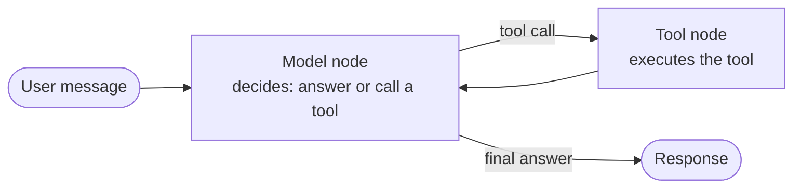

:::note Addition — not from the playlist
This chapter and the rest of **LangChain Advanced Topics** are built from LangChain's [official documentation](https://docs.langchain.com/oss/python/langchain/overview), not the CampusX playlist. The playlist's [agent chapter](/docs/genai/ai-agent) ends with the old `initialize_agent`/`AgentExecutor` style and a pointer to LangGraph "for real agents" — this is that next step, made concrete with code.
:::

**In one line.** `create_agent` is a factory function that builds the same "model calling tools in a loop" pattern you built by hand in the [AI agent chapter](/docs/genai/ai-agent), except the loop, the state and the extension points are already written for you.

## Why this exists

In the playlist you built an agent two ways: a manual ReAct loop, then LangChain's built-in `AgentExecutor`. Both work, but `AgentExecutor` is now **legacy** — LangChain 1.0 replaced it with `create_agent`, a single function backed by [LangGraph](https://docs.langchain.com/oss/python/langgraph/overview) underneath.

:::warning `AgentExecutor` and `initialize_agent` are legacy
They still import and run, but LangChain's own docs point new code at `create_agent`. Everything in this subfolder assumes `create_agent`, not the old executor.
:::

The mental model does not change: an LLM decides what to do, tools get called, results come back, the LLM decides again, until it is done. What changes is *how much of that loop you have to write yourself* — none of it, and every stage now has a documented extension point (state, context, middleware, persistence).



An agent has two parts:

- **Model** — the LLM making decisions.
- **Harness** — everything around the loop: prompt, tools, middleware, state.

## A minimal agent

```python
from langchain.agents import create_agent
from langchain.tools import tool

@tool
def get_weather(city: str) -> str:
    """Get the current weather for a city."""
    return f"It's sunny and 22°C in {city}."

agent = create_agent(
    model="anthropic:claude-sonnet-4-5",
    tools=[get_weather],
    system_prompt="You are a helpful weather assistant. Be concise.",
)

result = agent.invoke(
    {"messages": [{"role": "user", "content": "What's the weather in Bengaluru?"}]}
)
print(result["messages"][-1].content)
```

The `model` argument is a `"provider:model_name"` string — the same convention `init_chat_model` uses (see the [models chapter](/docs/genai/models)) — or an already-constructed chat model instance when you need custom parameters:

```python
from langchain_anthropic import ChatAnthropic

model = ChatAnthropic(model="claude-sonnet-4-5", temperature=0)
agent = create_agent(model=model, tools=[get_weather])
```

## Key parameters

| Parameter | Purpose |
|---|---|
| `model` | `"provider:model"` string or a chat model instance |
| `tools` | `@tool`-decorated functions, `StructuredTool`s, or plain callables |
| `system_prompt` | string or `SystemMessage` shaping the agent's behaviour |
| `response_format` | a Pydantic model — validates the agent's final answer (see below) |
| `state_schema` | a custom `AgentState` subclass — extra fields beyond `messages` (see [memory](/docs/genai/langchain-advanced/memory)) |
| `context_schema` | per-run configuration such as user IDs or feature flags, not stored in state |
| `checkpointer` | persistence layer for conversation history (see [memory](/docs/genai/langchain-advanced/memory)) |
| `store` | cross-session persistence layer (see [memory](/docs/genai/langchain-advanced/memory)) |
| `middleware` | a list of hooks that intercept the loop (see [middleware](/docs/genai/langchain-advanced/middleware)) |
| `name` | an identifier, needed once an agent becomes a subagent (see [multi-agent](/docs/genai/langchain-advanced/multi-agent-systems)) |

## Structured final answers

`with_structured_output` (from the [structured output chapter](/docs/genai/structured-output)) forces a *model* to answer in a schema. `response_format` does the same for an entire *agent*: the agent can still call tools freely, and only the final answer is validated against your schema.

```python
from pydantic import BaseModel, Field

class WeatherReport(BaseModel):
    city: str
    summary: str = Field(description="One-sentence summary of conditions")
    temperature_c: float

agent = create_agent(
    model="anthropic:claude-sonnet-4-5",
    tools=[get_weather],
    response_format=WeatherReport,
)

result = agent.invoke(
    {"messages": [{"role": "user", "content": "Weather in Bengaluru?"}]}
)
report = result["structured_response"]
print(report.city, report.temperature_c)
```

## What `invoke` returns

The result is a dict (technically the graph's final state). The two keys you will use immediately:

- `result["messages"]` — the full running transcript for this turn: `HumanMessage`, any `AIMessage`s with `tool_calls`, the matching `ToolMessage`s, and the final `AIMessage`.
- `result["structured_response"]` — present only when `response_format` was set.

```python
for msg in result["messages"]:
    print(type(msg).__name__, "→", msg.content)
```

## Old vs new, side by side

| | `AgentExecutor` (legacy) | `create_agent` |
|---|---|---|
| Build | `create_react_agent` + `AgentExecutor(agent=..., tools=...)` | `create_agent(model=..., tools=...)` |
| Loop | Hard-coded ReAct parsing | LangGraph state machine |
| Extend | Subclass or wrap | `middleware=[...]` list |
| Persist conversation | Manual, via `ConversationBufferMemory` | `checkpointer=` + `thread_id` |
| Pause for approval | Not supported natively | `HumanInTheLoopMiddleware` |
| Structured final answer | Manual parsing of the last message | `response_format=` |

Every later chapter in this subfolder builds on the agent object created here — middleware wraps it, memory persists it, subagents compose it, streaming reads from it.

## Checklist

- [ ] I can explain why `create_agent` replaces `AgentExecutor`
- [ ] I can build an agent with tools and a system prompt
- [ ] I can tell `with_structured_output` (model-level) apart from `response_format` (agent-level)
- [ ] I know which parameter each later chapter (middleware, memory, multi-agent) plugs into
