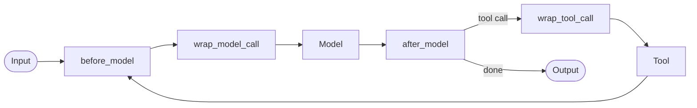

:::note Addition — not from the playlist
Part of [LangChain Advanced Topics](/docs/genai/langchain-advanced/create-agent), built from LangChain's [middleware docs](https://docs.langchain.com/oss/python/langchain/middleware/overview). Builds directly on [`create_agent`](/docs/genai/langchain-advanced/create-agent).
:::

**In one line.** Middleware is a list of hooks you attach to `create_agent` that can inspect or rewrite what goes into the model, what comes out of it, and which tool calls are allowed to run.

## Why middleware instead of subclassing

The old way to customise `AgentExecutor` was to subclass it or wrap it in Python. `create_agent` instead exposes fixed points in the loop where you can plug in behaviour, without touching the loop itself:



Four use cases cover almost everything teams reach for middleware to do:

| Use case | Example |
|---|---|
| **Monitoring** | log every model call, count tokens |
| **Transformation** | rewrite the prompt, trim history, reformat output |
| **Resilience** | retry a failed model or tool call, fall back to a cheaper model |
| **Governance** | block PII, rate-limit, require human approval |

## Built-in middleware

```python
from langchain.agents import create_agent
from langchain.agents.middleware import (
    SummarizationMiddleware,
    PIIMiddleware,
    ModelRetryMiddleware,
    ToolRetryMiddleware,
)

agent = create_agent(
    model="anthropic:claude-sonnet-4-5",
    tools=[...],
    middleware=[
        PIIMiddleware("email"),
        ModelRetryMiddleware(max_retries=3),
        ToolRetryMiddleware(max_retries=2),
        SummarizationMiddleware(
            model="anthropic:claude-haiku-4-5",
            trigger=("tokens", 4000),
            keep=("messages", 20),
        ),
    ],
)
```

`SummarizationMiddleware` is covered in depth in [memory](/docs/genai/langchain-advanced/memory) and `HumanInTheLoopMiddleware` gets its own chapter: [human-in-the-loop](/docs/genai/langchain-advanced/human-in-the-loop). Middleware in a list runs in order, and order matters — retries should generally sit closer to the model than logging or PII scrubbing.

## Writing your own middleware

Custom middleware is a plain function decorated with one of four hooks. The simplest is `@before_model`, which runs before every model call and can rewrite state:

```python
from typing import Any
from langchain.agents import AgentState
from langchain.agents.middleware import before_model
from langgraph.runtime import Runtime

@before_model
def log_turn(state: AgentState, runtime: Runtime) -> dict[str, Any] | None:
    print(f"[turn] {len(state['messages'])} messages so far")
    return None  # None = no change to state

agent = create_agent(model="...", tools=[...], middleware=[log_turn])
```

Returning `None` leaves state untouched; returning a dict merges those keys into state — the same pattern used to trim or delete messages in the [memory chapter](/docs/genai/langchain-advanced/memory).

`@after_model` inspects the model's response and can override it — this is how `HumanInTheLoopMiddleware` intercepts tool calls before they execute:

```python
from langchain.agents.middleware import after_model

@after_model
def block_bad_words(state: AgentState, runtime: Runtime) -> dict[str, Any] | None:
    last = state["messages"][-1]
    if "confidential" in last.content.lower():
        last.content = "[redacted]"
        return {"messages": [last]}
    return None
```

`@wrap_model_call` and `@wrap_tool_call` wrap the call itself — useful for retries, fallbacks, and timing, because they run *around* the model or tool rather than before/after it:

```python
from langchain.agents.middleware import wrap_model_call
import time

@wrap_model_call
def time_the_model(request, handler):
    start = time.time()
    response = handler(request)
    print(f"model call took {time.time() - start:.2f}s")
    return response
```

## Dynamic prompts

A common `wrap_model_call`-adjacent pattern is rewriting the system prompt per turn, based on context or state — for example, addressing the user by name once you know it:

```python
from langchain.agents.middleware import dynamic_prompt

@dynamic_prompt
def personalised_prompt(request) -> str:
    user_name = request.runtime.context.get("user_name", "there")
    return f"You are a helpful assistant. Address the user as {user_name}."

agent = create_agent(model="...", tools=[...], middleware=[personalised_prompt])
```

## Putting several together

Middleware composes. A realistic production stack combines governance, resilience and memory management in one list:

```python
agent = create_agent(
    model="anthropic:claude-sonnet-4-5",
    tools=[search, write_file],
    middleware=[
        PIIMiddleware("email"),
        ModelRetryMiddleware(max_retries=3),
        SummarizationMiddleware(model="anthropic:claude-haiku-4-5", trigger=("tokens", 4000)),
    ],
)
```

:::tip Order top to bottom is execution order
Read a `middleware=[...]` list the way you'd read a request pipeline: the first entry sees the request first and the response last.
:::

## Checklist

- [ ] I can name the four middleware hooks and when each fires
- [ ] I can attach a built-in middleware (PII, retry, summarization) to an agent
- [ ] I can write a custom `@before_model` or `@after_model` function
- [ ] I understand why hook order in the `middleware=[...]` list matters

## Summary table

| Topic | Summary |
| --- | --- |
| Purpose | Middleware adds cross-cutting behaviour around model and tool calls. |
| Order | The middleware list order affects how hooks compose. |
| Hooks | Before-model, after-model and wrapper hooks intercept different points in an agent run. |
| Built-ins | Ready-made middleware supports tasks such as PII handling, summarisation and retries. |
| Custom policy | A custom hook can change prompts or validate responses with application context. |
| Composition | Ordering middleware determines what each hook sees and what it can modify. |
