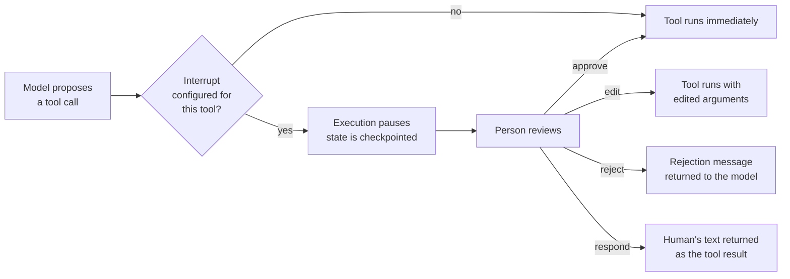

:::note Addition — not from the playlist
Part of [LangChain Advanced Topics](/docs/genai/langchain-advanced/create-agent), built from LangChain's [human-in-the-loop docs](https://docs.langchain.com/oss/python/langchain/human-in-the-loop). Builds on [`create_agent`](/docs/genai/langchain-advanced/create-agent) and [middleware](/docs/genai/langchain-advanced/middleware).
:::

**In one line.** `HumanInTheLoopMiddleware` pauses the agent right before a chosen tool executes, and waits for a person to approve, edit, reject, or answer on its behalf.

## Why this matters

The [tools chapter](/docs/genai/tools) and [AI agent chapter](/docs/genai/ai-agent) give the model access to real actions — sending an email, running SQL, writing a file. An agent that is *sometimes* wrong should not be allowed to take *irreversible* actions unsupervised. Human-in-the-loop (HITL) is the standard fix: let the agent decide, but gate the consequential steps behind a person.



## Configuring which tools pause

```python
from langchain.agents import create_agent
from langchain.agents.middleware import HumanInTheLoopMiddleware
from langgraph.checkpoint.memory import InMemorySaver

agent = create_agent(
    model="anthropic:claude-sonnet-4-5",
    tools=[write_file, execute_sql, read_data],
    middleware=[
        HumanInTheLoopMiddleware(
            interrupt_on={
                "write_file": True,                                  # any decision allowed
                "execute_sql": {"allowed_decisions": ["approve", "reject"]},
                "read_data": False,                                  # never interrupt
            },
            description_prefix="Tool execution pending approval",
        ),
    ],
    checkpointer=InMemorySaver(),
)
```

:::warning A checkpointer is not optional
Pausing means the graph's execution state has to be saved somewhere so it can resume later — possibly minutes or days after the pause. Without `checkpointer=`, there is nowhere to save it, and the interrupt cannot work.
:::

## The four decisions

| Decision | What happens |
|---|---|
| **approve** | the tool runs exactly as proposed |
| **edit** | the tool runs with arguments the person changed |
| **reject** | the tool does not run; a message goes back to the model instead |
| **respond** | the person's text is returned *as if it were the tool's result* — useful for "ask the user a question" tools |

## Pausing and inspecting the interrupt

```python
config = {"configurable": {"thread_id": "session-1"}}

result = agent.invoke(
    {"messages": [{"role": "user", "content": "Delete records older than 2 years"}]},
    config=config,
)
print(result["__interrupt__"])  # the pending request(s) awaiting a decision
```

## Resuming with a decision

Resuming uses LangGraph's `Command(resume=...)`, passed back into the same thread:

```python
from langgraph.types import Command

# Approve exactly as proposed
agent.invoke(
    Command(resume={"decisions": [{"type": "approve"}]}),
    config=config,
)

# Edit the arguments before running
agent.invoke(
    Command(resume={"decisions": [{
        "type": "edit",
        "edited_action": {"name": "execute_sql", "args": {"query": "SELECT 1"}},
    }]}),
    config=config,
)

# Reject, with feedback the model can act on
agent.invoke(
    Command(resume={"decisions": [{
        "type": "reject",
        "message": "Do not delete records; archive them instead.",
    }]}),
    config=config,
)
```

## Interrupting only on specific arguments

Not every call to a sensitive tool is equally risky. A `when` predicate lets you interrupt conditionally — here, only writes outside a safe workspace directory need approval:

```python
def writes_outside_workspace(request) -> bool:
    path = request.tool_call["args"].get("path", "")
    return not path.startswith("/workspace/")

HumanInTheLoopMiddleware(
    interrupt_on={
        "write_file": {
            "allowed_decisions": ["approve", "edit", "reject"],
            "when": writes_outside_workspace,
        },
    },
)
```

## Streaming with interrupts

An interrupt shows up mid-stream as a distinct event, so a UI can react to it instead of waiting for a full response:

```python
for chunk in agent.stream(
    {"messages": [{"role": "user", "content": "Delete old records"}]},
    config=config,
    stream_mode=["messages", "updates"],
):
    if chunk["type"] == "updates" and "__interrupt__" in chunk["data"]:
        print("Waiting for approval:", chunk["data"]["__interrupt__"])
```

## When to reach for this

Gate anything that is expensive, irreversible, or externally visible: destructive database operations, sending messages or emails, spending money, or writing to a shared filesystem. Read-only tools (`read_data` above) rarely need it — approval fatigue defeats the purpose if everything pauses.

## Checklist

- [ ] I can configure `HumanInTheLoopMiddleware` to gate one tool but not another
- [ ] I can explain why a `checkpointer` is required for interrupts to work
- [ ] I can resume a paused agent with each of the four decisions
- [ ] I can write a `when` predicate to interrupt only on risky arguments
