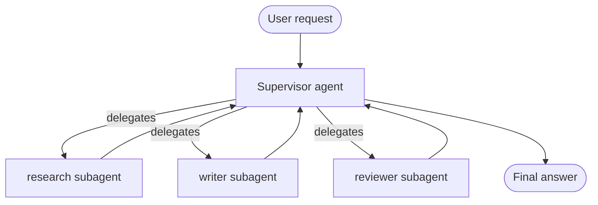

:::note Addition — not from the playlist
Part of [LangChain Advanced Topics](/docs/genai/langchain-advanced/create-agent), built from LangChain's [subagents docs](https://docs.langchain.com/oss/python/langchain/multi-agent/subagents). The [advanced concepts chapter](/docs/genai/advanced-concepts) introduces the supervisor/hierarchical/peer patterns conceptually; this chapter is the code for the supervisor pattern.
:::

**In one line.** A **supervisor** is a normal `create_agent` whose "tools" are other agents — call each subagent the same way you'd call any tool, and let the supervisor decide which one to use.

## Why wrap an agent as a tool

The [tools chapter](/docs/genai/tools) built tools from Python functions. A subagent is nothing more than a Python function that happens to run an entire agent inside it:

```python
from langchain.agents import create_agent
from langchain.tools import tool

research_agent = create_agent(model="google_genai:gemini-2.5-flash", tools=[search_tool])

@tool("research", description="Research a topic and return findings")
def call_research_agent(query: str) -> str:
    result = research_agent.invoke({"messages": [{"role": "user", "content": query}]})
    return result["messages"][-1].content

supervisor = create_agent(
    model="anthropic:claude-sonnet-4-5",
    tools=[call_research_agent],
)
```

That is the whole pattern. Everything else in this chapter is about scaling it past one subagent.



Each subagent runs **stateless and isolated** by default — it only sees what the wrapper tool passes it, not the supervisor's full conversation. That isolation is a feature: a research subagent's job is to answer one question well, not to inherit fifty turns of unrelated context.

## Pattern 1 — tool per agent

Fine-grained control, one wrapper per subagent:

```python
@tool("research_agent", description="Find and synthesize research")
def call_research(query: str) -> str:
    result = research_agent.invoke({"messages": [{"role": "user", "content": query}]})
    return result["messages"][-1].content

@tool("write_agent", description="Draft and edit content")
def call_writer(query: str) -> str:
    result = writer_agent.invoke({"messages": [{"role": "user", "content": query}]})
    return result["messages"][-1].content

supervisor = create_agent(
    model="anthropic:claude-sonnet-4-5",
    tools=[call_research, call_writer],
    system_prompt="Delegate research to research_agent and drafting to write_agent.",
)
```

## Pattern 2 — single dispatch tool

Once you have more than a handful of subagents, one parameterised `task` tool scales better than a growing tool list:

```python
from enum import Enum

class AgentName(str, Enum):
    RESEARCH = "research"
    WRITER = "writer"
    REVIEWER = "reviewer"

SUBAGENTS = {
    "research": research_agent,
    "writer": writer_agent,
    "reviewer": reviewer_agent,
}

@tool
def task(agent_name: AgentName, description: str) -> str:
    """Delegate work to a named subagent."""
    result = SUBAGENTS[agent_name].invoke({"messages": [{"role": "user", "content": description}]})
    return result["messages"][-1].content

supervisor = create_agent(
    model="anthropic:claude-sonnet-4-5",
    tools=[task],
    system_prompt=(
        "Coordinate specialist sub-agents: research (fact-finding), "
        "writer (drafting), reviewer (quality check). Use the task tool to delegate."
    ),
)
```

For a registry too large to enumerate in the prompt, add a discovery tool instead:

```python
@tool
def list_agents(query: str = "") -> str:
    """List available subagents, optionally filtered by query."""
    return format_agent_list(search_agent_registry(query))

supervisor = create_agent(
    model="anthropic:claude-sonnet-4-5",
    tools=[task, list_agents],
    system_prompt="Call list_agents to discover available subagents before delegating.",
)
```

## Sync vs asynchronous subagents

By default a wrapper tool blocks: the supervisor waits for the subagent to finish. That is right when the supervisor needs the result to keep going, but wrong for a genuinely long-running job — a contract review, a large crawl. The fix is a **three-tool pattern**: start the job, poll it, fetch the result once it is done.

```python
@tool
def start_review_job(contract_text: str) -> str:
    """Kick off a background review job and return its job_id."""
    job_id = queue_async_task(contract_reviewer, contract_text)
    return f"job_id: {job_id}"

@tool
def check_job_status(job_id: str) -> str:
    """Check whether a job is pending, running, completed, or failed."""
    return get_job_status(job_id)

@tool
def get_job_result(job_id: str) -> str:
    """Retrieve the result of a completed job."""
    return retrieve_completed_result(job_id)
```

## Passing context: isolated vs forked

**Isolated** (default) — the subagent gets only the task description, nothing else:

```python
@tool("subagent", description="Handle a focused, self-contained task")
def call_subagent(query: str) -> str:
    result = subagent.invoke({"messages": [{"role": "user", "content": query}]})
    return result["messages"][-1].content
```

**Forked** — the subagent continues the supervisor's own conversation, useful when it genuinely needs prior context to do its job:

```python
from langchain.tools import ToolRuntime

@tool("subagent", description="Continue the parent conversation with specialist help")
def call_subagent(query: str, runtime: ToolRuntime) -> str:
    forked_input = [*runtime.state["messages"], {"role": "user", "content": query}]
    result = subagent.invoke({"messages": forked_input})
    return result["messages"][-1].content
```

## Returning state, not just text

A wrapper tool can hand structured state back to the supervisor via `Command`, rather than squeezing everything into a string:

```python
from langgraph.types import Command
from langchain.tools import InjectedToolCallId
from langchain.messages import ToolMessage
from typing import Annotated

@tool("subagent", description="Handle a task and report structured results")
def call_subagent(query: str, tool_call_id: Annotated[str, InjectedToolCallId]) -> Command:
    result = subagent.invoke({"messages": [{"role": "user", "content": query}]})
    return Command(update={
        "messages": [ToolMessage(content=result["messages"][-1].content, tool_call_id=tool_call_id)],
    })
```

## When to reach for this

Multiple distinct domains (calendar, email, CRM, database), subagents that never need to talk to the user directly, or a genuine need for centralised control — those justify the extra moving parts. A single agent with five or six well-described tools usually beats a supervisor with two subagents; the failure modes in [advanced concepts](/docs/genai/advanced-concepts) (more tokens, more latency, compounding errors across handoffs) are real costs, not theoretical ones.

## Checklist

- [ ] I can wrap a `create_agent` instance as a tool for a supervisor to call
- [ ] I can choose between tool-per-agent and single-dispatch based on subagent count
- [ ] I can explain isolated vs forked context passing, and when each is right
- [ ] I can justify — or refuse — a multi-agent design against a single agent with more tools

## Summary table

| Topic | Summary |
| --- | --- |
| Pattern | A supervisor can call specialist agents as tools. |
| Routing | Use one tool per specialist or a dispatch tool according to the number of roles. |
| Context | Choose isolated or shared context and return structured state when the supervisor needs it. |
| Supervisor | A primary agent routes bounded tasks to specialist agents exposed as tools. |
| Tool-per-agent | Separate tool names make a small specialist set easy to route. |
| Dispatch | A single dispatch tool can handle a larger or dynamic specialist set. |
| Context transfer | Choose isolated input, a context fork or returned state according to the collaboration need. |
| Design test | Use multiple agents only when specialist boundaries improve the workflow. |
