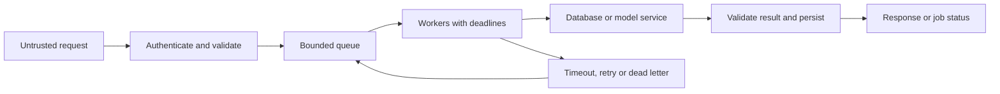
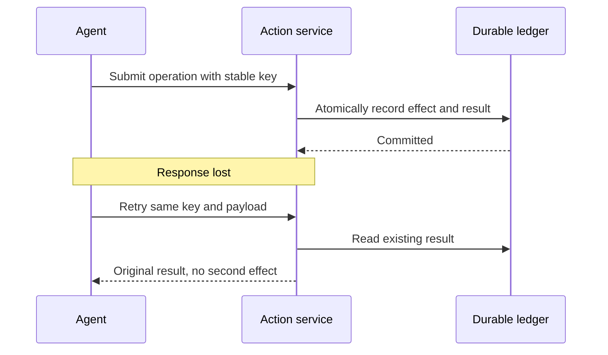
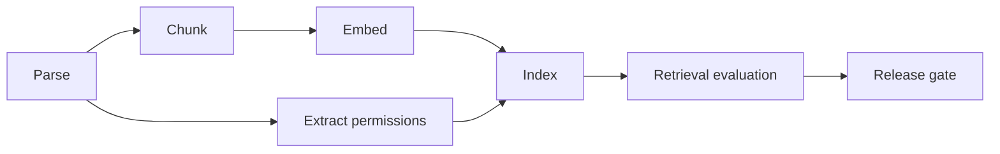

# Python, APIs, SQL, and Data Pipelines

Build the software and data contracts that make models useful and their evaluations trustworthy.

**Evidence:** [S1](98-sources.md#s1) reports async, SQL, and coding rounds; [S3](98-sources.md#s3) reports REST, framework choices, topological sort, and deduplication. Concrete workloads below are original practice extensions. All examples use synthetic data.

## Mental model



A model call is a remote operation with uncertain duration, cost, and failure mode. A data row is a statement about an entity **at a time**, with a provenance and an availability time. Both ideas matter in training, retrieval, agents, and evaluation runners.

## PY01 · Evaluate 10,000 prompts without overwhelming the provider

**Evidence: reported theme → practice scenario, [S1](98-sources.md#s1).** The interviewer gives a script that creates one task for every prompt. It exhausts memory, hits rate limits, and loses results when one call fails.

**Answer.** Separate work admission from execution. A bounded queue limits queued work; a fixed worker pool limits in-flight calls. A semaphore alone limits active requests but does not stop you allocating a million waiting tasks. Track each case by a stable ID, save each completed result, and support resumption without repeating successful paid calls.

Concurrency limits and rate limits solve different problems. Ten workers can exceed a request-per-minute quota if calls return quickly. Add a shared request/token budget and obey provider retry timing. Limit retries to transient errors, use jitter, and apply one overall deadline that includes queueing and backoff.

| Approach | Useful for | Main limitation |
| --- | --- | --- |
| `asyncio` | Many waiting network calls | Blocking code stalls the event loop |
| Threads | Blocking I/O libraries | Shared state needs synchronisation; Python bytecode parallelism depends on interpreter build |
| Processes | CPU-heavy Python transforms | Serialisation, startup, and memory overhead |
| GPU/vectorised kernels | Tensor computation | Data movement and batch shape can dominate |

**Cross-questions.**

- **Does `async def` make a CPU loop concurrent?** No. It must yield at an await point. Move blocking work off the loop, vectorise it, or use a process pool.
- **What happens if a worker is cancelled?** Release resources in `finally`; propagate cancellation. Do not catch cancellation and silently turn it into a successful score.
- **Should one bad prompt stop the run?** A corrupt case should become a recorded case error. A broken credential or invalid global configuration should usually fail the run promptly.

**Test:** inject a timeout, malformed response, quota error, and worker cancellation; verify the concurrency bound, complete case accounting, and no “failed = score zero” conflation. [Python documents cancellation and TaskGroup behaviour](https://docs.python.org/3/library/asyncio-task.html). Run [the bounded-worker lab](11-coding-labs.md#lab-3).

**Executable check:**

```python
import asyncio

async def main():
    semaphore = asyncio.Semaphore(3)
    async def score(i):
        async with semaphore:
            await asyncio.sleep(0)
            return i, "ok"
    assert len(await asyncio.gather(*(score(i) for i in range(10)))) == 10

asyncio.run(main())
# This bounds active calls only. Lab 3 also bounds queued work.
```

## PY02 · An HTTP timeout happens after an agent submits an action. Retry?

**Evidence: practice extension.** A support agent requests a credit adjustment; the server commits it but the response is lost.

**Answer.** A timeout means the outcome is unknown. Retrying with a fresh operation ID can duplicate the effect. Generate a stable idempotency key for the intended operation, keep it across retries, and make the action service atomically enforce uniqueness with the stored result. Bind the key to the tenant and a canonical hash of the payload; reusing it with a different payload must fail.

A local dictionary prevents duplicates only inside one process lifetime. A durable database uniqueness constraint handles competing workers. An external provider requires its own idempotency contract or a reconciliation query. Updating a local “done” flag after calling the provider leaves a crash gap.



**Cross-questions.**

- **Does HTTP POST mean it cannot be retried?** Method semantics and endpoint guarantees differ. POST can be retry-safe when the service implements idempotency; do not assume it does.
- **Why not promise exactly once?** Delivery and execution can fail independently. Describe atomic boundaries, deduplication, reconciliation, and remaining failure windows.
- **What if approval expires?** Revalidate authorisation before first execution. A retry returning an existing result should not execute again.

**Test:** crash before commit, after commit, and before returning; retry with the same and conflicting payloads. [The durable action lab](11-coding-labs.md#lab-4) exercises these boundaries in SQLite.

## PY03 · FastAPI or Flask for an inference service?

**Evidence: reported, paraphrased from [S3](98-sources.md#s3).**

**Answer.** Compare the service's workload, contracts, existing code, and operational support. FastAPI's ASGI model and typed request/response integration suit async APIs. Flask is a mature web framework whose established extensions and existing application can be the best fit. Neither framework makes GPU inference faster or fixes an overloaded database.

| Decision | FastAPI | Flask |
| --- | --- | --- |
| Interface | ASGI; async and sync handlers | Traditionally WSGI; async support has deployment constraints |
| Schema integration | Pydantic models and generated OpenAPI | Commonly configured through additional libraries |
| Existing application | Good if contracts/async fit | Good if team and codebase already use it |
| Inference bottleneck | Still needs worker/GPU strategy | Still needs worker/GPU strategy |

Use a long-lived client and connection pool. Load a model once per appropriate worker, rather than per request. Multiple web workers may duplicate a large model in memory. Put long jobs behind a queue and return a job identifier. For streaming, handle client disconnects and cancellation so a disconnected user does not leave expensive inference running indefinitely.

**Cross-questions.**

- **Can a synchronous database call go inside an async handler?** It can block the loop. Use an async client or an explicitly managed thread boundary.
- **What should validation reject?** Oversized input, unsupported types, invalid IDs, missing required fields, and disallowed options, before model work starts.
- **How do you test without a paid model?** Inject a fake provider at the client boundary, then run a smaller live contract suite separately.

**Read:** [FastAPI async guidance](https://fastapi.tiangolo.com/async/), [Flask async guidance](https://flask.palletsprojects.com/en/stable/async-await/). See [versions](99-tools-versions.md) before copying older Pydantic code.

**Executable check:**

```python
# Framework-independent request validation. An ASGI route can call this.
def validate_request(body):
    if set(body) != {"text"} or not isinstance(body["text"], str):
        raise ValueError("expected text field")
    if not 1 <= len(body["text"]) <= 1000:
        raise ValueError("text length outside contract")
    return body["text"]

assert validate_request({"text": "refund policy"}) == "refund policy"
```

## PY04 · Build features without using information from the future

**Evidence: reported SQL theme → practice scenario, [S1](98-sources.md#s1).** A fraud training set joins each transaction to the customer's latest risk score. Offline performance looks exceptional.

**Answer.** “Latest today” is not “known when this transaction occurred”. Track both the feature's event time and its availability time. A score describing Monday but computed Wednesday was unavailable to Tuesday's prediction. Join only values satisfying both time constraints, then choose the newest eligible record with a deterministic tie-breaker.

```sql
-- Complete runnable tables, fixture and checks: feature_join.py in the labs.
SELECT p.id,
       (SELECT f.value
        FROM features AS f
        WHERE f.entity = p.entity
          AND f.event_time <= p.prediction_time
          AND f.available_time <= p.prediction_time
        ORDER BY f.event_time DESC, f.available_time DESC, f.id DESC
        LIMIT 1) AS historical_feature
FROM predictions AS p;
```

Use UTC storage with a documented timezone convention. A “same day” join can leak an event from later that day. Ensure feature windows also end before the prediction and avoid including the target event in an aggregate.

**Cross-questions.**

- **What about missing history?** Return a missing value with an indicator and a defined fallback; do not silently fill from a future row.
- **Is `merge_asof` enough?** A backward event-time join helps, but availability time, entity partitioning, sorting, and tie rules still require explicit treatment.
- **Which index?** Start from entity and temporal filtering; inspect a real query plan. Data distribution determines whether an index scan, partition pruning, or batch temporal join is best.

**Test:** future events, late-arriving past events, two entities with the same timestamps, missing features, and exact boundary equality. The [feature-join lab](11-coding-labs.md#lab-5) includes these cases.

## PY05 · Deduplicate documents or evaluation cases without losing meaning

**Evidence: reported coding task, [S3](98-sources.md#s3); pipeline constraints are extensions.**

**Answer.** First define equality: exact text, canonical URL, business ID, document revision, or semantic similarity. Deduplication by a lossy normalisation can merge two distinct policy clauses or languages. For a stable list of hashable IDs, preserve the first occurrence:

```python
# Python 3.12+; standalone.
def unique_in_order(values):
    seen = set()
    result = []
    for value in values:
        if value not in seen:
            seen.add(value)
            result.append(value)
    return result

assert unique_in_order(["a", "b", "a", "c"]) == ["a", "b", "c"]
```

Expected time is O(n), space O(u) for u unique values. For a stream larger than memory, partition by key or use durable uniqueness constraints. A Bloom filter has false positives, so it cannot by itself decide to discard records when losing one matters.

**Cross-questions.**

- **Why not `list(set(values))`?** It does not preserve the input's order contract.
- **What if two duplicates have different labels?** Flag a label conflict. Taking the first label silently can corrupt an evaluation set.
- **Can near-duplicates cross train/test boundaries?** They can inflate measured generalisation. Group revisions and near-duplicate families before splitting.

## PY06 · Topologically schedule ingestion and evaluation steps

**Evidence: reported, [S3](98-sources.md#s3).**

**Answer.** Model prerequisite relationships as a directed graph. Kahn's algorithm starts with zero-indegree nodes, emits them, and reduces successor indegrees. If fewer than all nodes are emitted, a cycle prevents a valid ordering. Complexity is O(V + E) with a queue and adjacency lists.



Topological order is not a full scheduler: independent nodes may run concurrently; resource limits, retries, and cancellation need additional policy. An agent loop intentionally contains cycles, so use a state machine with termination conditions rather than treating every agent graph as a DAG.

**Cross-questions.**

- **Two valid orders exist. Which do you return?** Any if the contract allows it; use deterministic tie-breaking if reproducible builds require it.
- **Can a failed embedding stage be skipped?** Only if a valid cached artefact with the same input and configuration hash exists.
- **What identifies a cached stage?** Input content, implementation version, parameters, dependency versions, and relevant external-state versions.

Run the graph exercise in [the coding labs](11-coding-labs.md#lab-6).

## PY07 · A pandas upgrade changes a preprocessing result

**Evidence: practice extension.** A developer modifies a selected Series and expects the original DataFrame to change.

**Answer.** In pandas 3.0, Copy-on-Write is the default and only mode. Derived objects behave independently for mutation. Change the parent explicitly with `.loc`; do not rely on chained assignment. [The pandas migration documentation](https://pandas.pydata.org/docs/user_guide/copy_on_write.html) describes this contract.

```python
# Requires pandas; exact tested dependency pins are in the lab requirements.
import pandas as pd

df = pd.DataFrame({"country": ["IN", "UK"], "value": [10.0, 20.0]})
subset = df["value"]
subset.iloc[0] = 99.0
# Under pandas 3.x, df is unchanged by the preceding mutation.
df.loc[df["country"].eq("IN"), "value"] = 30.0
assert df.loc[0, "value"] == 30.0
```

NumPy has different view/copy rules: basic slices commonly share storage while advanced indexing commonly copies. Broadcasting avoids Python loops but can allocate a huge output. Pairwise distances for 100,000 vectors create 10 billion entries; even float32 distances alone need about 40 GB.

**Cross-questions.**

- **Is `np.vectorize` a performance solution?** Usually it is a convenience wrapper around Python calls. Use actual array operations or compiled kernels and profile.
- **Float32 or float64?** Measure accuracy and memory. Use wider accumulation where numerical error matters; do not cast IDs to floating point.
- **Why did a join multiply rows?** Check key uniqueness and intended join cardinality. Assert `many_to_one` where that is the contract.

## PY08 · A data pipeline receives duplicates, late events, and schema changes

**Evidence: practice extension.**

**Answer.** Define event ID, event time, ingestion time, schema version, and source. Land immutable raw records, validate schema, quarantine bad records, and materialise a versioned curated view. Watermarks bound how long a streaming aggregation waits for late data; they are a policy choice, not proof that no late event exists.

| Concern | Mechanism | Test |
| --- | --- | --- |
| Duplicate delivery | Idempotent upsert by event ID/version | Replay the same batch |
| Late correction | Versioned update or recomputation | Correct yesterday's feature |
| Schema change | Compatibility check and explicit migration | Field removed or type changed |
| Partial failure | Checkpoint only committed work | Kill worker halfway through |
| Poison record | Quarantine with reason and provenance | Invalid timestamp or encoding |

For training, freeze the dataset snapshot. For RAG, propagate revisions and deletions. For QA, version fixtures and expected results with the schema. A successful job with silently dropped rows is not necessarily a successful pipeline.

**Cross-questions.**

- **CSV or Parquet?** CSV is simple interchange; Parquet supports typed, columnar analytical reads. Choose for the access pattern and compatibility requirements.
- **Kafka or a batch job?** Use streaming when freshness justifies continuous operations. A nightly batch is often enough for daily labels or document updates.
- **What should alert?** Freshness, row counts, missingness, schema violations, duplicate rates, and reconciled source-to-sink counts.

**Executable check:**

```python
events = [{"id": "e1", "version": 1}, {"id": "e1", "version": 1},
          {"id": "e2", "version": 9}]
seen, accepted, quarantined = set(), [], []
for event in events:
    if event["version"] != 1:
        quarantined.append(event)
    elif event["id"] not in seen:
        accepted.append(event)
        seen.add(event["id"])
assert len(accepted) == len(quarantined) == 1
# Persist identity and accepted effects atomically for restart safety.
```

## PY09 · A retry loop triples the bill during an outage

**Practice extension.** Three layers each retry three times, so one request can create up to 27 downstream attempts. Choose one owner for retries, propagate a deadline, and classify transient errors separately from invalid requests. Respect server retry guidance and include jitter to avoid synchronised clients.

```python
layer_attempts = [3, 3, 3]
import math
assert math.prod(layer_attempts) == 27
```

**Cross-question:** **Retry a schema-validation error?** Usually no; the same invalid payload will fail again. **What proves recovery works?** Inject a transient failure followed by success and a persistent failure; check attempts, elapsed budget, and recorded final status. Instrument attempts per logical request, not only HTTP status counts.

## PY10 · `gather` returns but requests keep running after a failure

**Practice extension.** Concurrency APIs have different sibling-cancellation semantics. Decide whether independent cases should continue or whether one failure invalidates the whole operation. Use structured task lifetimes and explicit per-case error handling; retain handles and await cancellation cleanup.

```python
import asyncio
async def main():
    async with asyncio.TaskGroup() as group:
        tasks = [group.create_task(asyncio.sleep(0, result=i)) for i in range(3)]
    assert [t.result() for t in tasks] == [0, 1, 2]
asyncio.run(main())
```

**Cross-question:** **Catch every exception in every task?** Only if errors are valid case outcomes. A broken global credential should surface as a run failure. **Cancellation testing?** Cancel while waiting and during cleanup; verify clients and locks are released.

## PY11 · Your async timeout never fires during preprocessing

**Practice extension.** An event-loop timeout cannot interrupt a long synchronous Python loop that never yields. Profile tokenisation, parsing, and numerical work. Offload suitable blocking calls or run CPU work in a process, and bound the work's input size.

```python
import asyncio
import hashlib
async def main():
    digest = await asyncio.to_thread(hashlib.sha256, b"synthetic-document")
    assert len(digest.hexdigest()) == 64
asyncio.run(main())
```

This illustrates a thread boundary, not a claim that this tiny hash needs offloading. **Cross-question:** **Does cancelling the await stop a running thread?** Not necessarily. Design cooperative cancellation or isolate killable work. **How avoid resource leaks?** Track worker lifetime and do not release capacity accounting before the underlying work actually stops.

## PY12 · Limit a stream without loading all prompts into RAM

**Practice extension.** Use an iterator, bounded batches, and incremental persistence. A generator reduces eager allocation but cannot fix a consumer that immediately calls `list()` on the whole stream. Record progress using stable record IDs rather than fragile byte offsets when formats change.

```python
from itertools import islice
source = iter(range(10))
first = list(islice(source, 3))
second = list(islice(source, 3))
assert first == [0, 1, 2] and second == [3, 4, 5]
```

**Cross-question:** **How resume?** Persist the completed case IDs and source snapshot; skip committed cases. **What about ordering?** Separate processing order from result identity. Parallel completion order need not match input order if downstream joins by stable ID.

## PY13 · A JSON boolean passes your integer validation

**Practice extension.** In Python, `bool` is a subclass of `int`, so `isinstance(True, int)` is true. For counts, amounts, or horizons, use a strict schema or explicitly reject booleans. Validate finite floats too: NaN can bypass naïve comparison logic.

```python
import math
assert isinstance(True, int)
def valid_count(x):
    return type(x) is int and 0 <= x <= 100
assert not valid_count(True)
assert not math.isfinite(float("nan"))
```

**Cross-question:** **Coerce string `"5"`?** Only if the API contract permits coercion; strict tool contracts often should reject it. **Why validate again at execution?** The action boundary must enforce its own invariant regardless of which caller or model supplied the input.

## PY14 · A mutable default leaks messages across users

**Practice extension.** Default arguments are evaluated once, so a default list can persist across calls. Create per-call state explicitly and scope conversation state by authenticated identity.

```python
def add_message(text, history=None):
    history = [] if history is None else list(history)
    history.append(text)
    return history
assert add_message("user A") == ["user A"]
assert add_message("user B") == ["user B"]
```

Copying here avoids mutating a caller-supplied list. **Cross-question:** **Would a global dictionary fix it?** Only with correct keys, concurrency, retention, and persistence semantics. **How test?** Interleave requests from two users and assert their state and tool results never cross.

## PY15 · Hashable objects change after entering a cache

**Practice extension.** Hash keys must have stable equality/hash behaviour while stored. Mutable request objects can create subtle cache misses or incorrect reuse. Use an immutable canonical key containing the fields that define equivalence.

```python
from dataclasses import dataclass
@dataclass(frozen=True)
class Key:
    tenant: str
    corpus_revision: str
    question: str
cache = {Key("A", "v1", "policy?"): "answer"}
assert Key("B", "v1", "policy?") not in cache
```

**Cross-question:** **Can you normalise whitespace/case?** Only where equivalence is valid; identifiers and code can be case-sensitive. **Why not hash only the prompt?** Permissions, model, corpus, and relevant state can change the correct answer.

## PY16 · A shallow copy still shares nested agent state

**Practice extension.** Copying a dictionary copies references to nested values. A child worker appending to a shared list can mutate the parent's state. Prefer immutable data or explicit ownership; use deep copy only when its cost and semantics are appropriate.

```python
import copy
original = {"evidence": ["doc1"]}
child = copy.deepcopy(original)
child["evidence"].append("doc2")
assert original == {"evidence": ["doc1"]}
```

**Cross-question:** **Deep-copy a database client?** No; resources such as sockets and locks need explicit lifetime management, not structural copying. **How test concurrent branches?** Give both branches distinct updates and assert deterministic merge semantics rather than relying on shared mutable objects.

## PY17 · Catching `Exception` makes every evaluation pass

**Practice extension.** A broad handler returning a default “success” turns outages and parser bugs into false positive evaluations. Return a typed error outcome and keep quality scoring separate from execution status.

```python
import json
try:
    value = json.loads("not-json")
except json.JSONDecodeError as exc:
    result = {"status": "parse_error", "error_type": type(exc).__name__}
assert result["status"] != "success"
```

**Cross-question:** **Expose the exception string to users?** It may contain sensitive details; store safe diagnostic metadata and an internal trace ID. **Retry a parser error?** Investigate whether it is truncation/provider failure or an invalid contract; do not blindly repeat indefinitely.

## PY18 · Context managers and connection leaks under failure

**Practice extension.** Acquire resources with a defined cleanup path. Transactions, files, locks, and clients must be released even when parsing or model calls fail. Do not hold a database transaction open while waiting minutes for an LLM unless the design truly requires it.

```python
from tempfile import TemporaryDirectory
from pathlib import Path
with TemporaryDirectory() as folder:
    path = Path(folder) / "result.txt"
    path.write_text("synthetic result")
    assert path.read_text() == "synthetic result"
assert not path.exists()
```

**Cross-question:** **Does a context manager always close a SQLite connection?** Its exact contract matters; SQLite's transaction context is not the same as connection closure. **How detect leaks?** Repeated failure tests plus connection/file-descriptor counts and pool saturation metrics.

## PY19 · A DataFrame join doubles your positive labels

**Practice extension.** A many-to-many join multiplies matches. Check key uniqueness and desired cardinality before merging. Aggregating afterwards can hide the defect and corrupt training weights or evaluation denominators.

```python
import pandas as pd
left = pd.DataFrame({"id": [1, 2], "label": [1, 0]})
right = pd.DataFrame({"id": [1, 2], "score": [0.8, 0.2]})
joined = left.merge(right, on="id", validate="one_to_one")
assert len(joined) == len(left)
```

**Cross-question:** **One entity legitimately has many events?** Define the event-level output or aggregate with a time window before joining. **What should QA assert?** Row counts, unmatched keys, uniqueness, and label totals under the intended relationship.

## PY20 · SQL `NOT IN` silently loses rows with NULL

**Practice extension.** SQL uses three-valued logic. A NULL in a subquery can make `NOT IN` comparisons unknown. For an anti-join, use a correlated `NOT EXISTS` with an explicit key/null policy.

```sql
-- Fixture assumptions: requests(id), completed(request_id).
SELECT r.id
FROM requests AS r
WHERE NOT EXISTS (
  SELECT 1 FROM completed AS c WHERE c.request_id = r.id
);
```

**Cross-question:** **Should NULL request IDs exist?** Usually enforce non-null identifiers at ingestion. **How test?** Include an empty completion table, a matching ID, a NULL completion row, and duplicate completions. The anti-join should preserve each unmatched request once.

## PY21 · Compute the latest evaluation result per case

**Practice extension.** Define latest by completion time and a deterministic tie-breaker. A simple `MAX(score)` selects the best score, not the most recent result. Window functions make the intended ordering explicit.

```sql
-- Fixture: results(case_id, completed_at, run_id, score).
WITH ranked AS (
  SELECT *, ROW_NUMBER() OVER (
    PARTITION BY case_id ORDER BY completed_at DESC, run_id DESC
  ) AS rn
  FROM results
)
SELECT case_id, run_id, score FROM ranked WHERE rn = 1;
```

**Cross-question:** **Should retries overwrite history?** Preserve attempts and select according to policy. **What about unfinished runs?** Filter or report status explicitly; a missing score must not be treated as a valid latest success.

## PY22 · Avoid future leakage in rolling features

**Practice extension.** A rolling average including the current target can leak information. Shift before rolling when predicting the current event from earlier observations, and group by entity so one user's history does not bleed into another's.

```python
import pandas as pd
s = pd.Series([10., 20., 30., 40.])
lag_mean = s.shift(1).rolling(2, min_periods=2).mean()
assert lag_mean.iloc[2] == 15.0
assert lag_mean.iloc[3] == 25.0
```

**Cross-question:** **Does shifting one row equal one day?** Only for regular, correctly sorted observations; irregular timestamps require time-aware windows. **What about data arriving late?** The availability-time condition remains necessary even when event order is correct.

## PY23 · A timestamp is valid but belongs to the wrong day

**Practice extension.** Store an unambiguous instant and preserve source timezone where interpretation needs it. Daylight-saving changes create repeated or nonexistent local times. “Yesterday” must be defined in the user's/product's timezone, not assumed to be server time.

```python
from datetime import datetime, timezone
from zoneinfo import ZoneInfo
instant = datetime(2026, 9, 26, 0, 0, tzinfo=timezone.utc)
local = instant.astimezone(ZoneInfo("Asia/Kolkata"))
assert (local.hour, local.minute) == (5, 30)
```

**Cross-question:** **Compare naïve and aware datetimes?** Reject or normalise with an explicit source convention. **How test forecasts?** Bound feature availability and label windows by actual instants and verify local-date reporting separately.

## PY24 · Out-of-order events break an incremental feature

**Practice extension.** Incremental state must define how late events and corrections affect prior aggregates. Use event IDs for deduplication and a recomputation or retraction policy. A watermark bounds waiting; it does not make late events impossible.

```python
seen = set()
total = 0
for event_id, value in [("e2", 4), ("e1", 3), ("e2", 4)]:
    if event_id not in seen:
        total += value
        seen.add(event_id)
assert total == 7
```

This handles duplicate immutable events, not corrections to an existing ID. **Cross-question:** **Updated value for e2?** Track versions and apply a delta or recompute. **Which test catches it?** Permute arrival order, replay duplicates, and inject a correction after a checkpoint.

## PY25 · A queue worker dies halfway through a document

**Practice extension.** Persist stage outputs with content/configuration identity and acknowledge only committed work. On redelivery, resume or safely repeat completed stages. Write a manifest so partial embeddings cannot be mistaken for a complete active document.

```python
expected_chunks = {"d1:0", "d1:1", "d1:2"}
written_chunks = {"d1:0", "d1:1"}
ready_to_activate = expected_chunks == written_chunks
assert not ready_to_activate
```

**Cross-question:** **Acknowledge before processing?** It risks lost work on crash. **Acknowledge after processing?** It permits redelivery, so effects need idempotency. **How handle poison documents?** Bound retries and quarantine with diagnostics rather than blocking the whole queue forever.

## PY26 · A heap finds the best k documents without sorting everything

**Practice extension.** For streaming candidate scores, maintain a size-k min-heap. Insertion/replacement costs O(log k), producing O(n log k) work and O(k) memory. Specify tie-breaking and whether duplicate IDs are permitted.

```python
import heapq
scores = [(0.2, "a"), (0.9, "b"), (0.5, "c"), (0.8, "d")]
top = heapq.nlargest(2, scores)
assert [item for score, item in top] == ["b", "d"]
```

**Cross-question:** **Why not sort?** Sorting is simpler and fine for small in-memory lists; the heap helps when n is large and k small. **What about distributed top-k?** Merge local candidates, but prove local truncation preserves the global ranking under the scoring contract.

## PY27 · Use binary search for a token-budget boundary

**Practice extension.** Binary search requires a monotonic predicate. If prefixes' measured token counts increase monotonically, find the largest fitting prefix. Arbitrary summarisation quality is not monotonic, so binary search cannot optimise it without a justified structure.

```python
from bisect import bisect_right
prefix_tokens = [0, 12, 25, 41, 70]
budget = 40
last_prefix = bisect_right(prefix_tokens, budget) - 1
assert last_prefix == 2
```

**Cross-question:** **Tokenise every prefix?** That may erase the algorithmic gain; use cached counts where the tokenizer's boundary behaviour permits or measure carefully. **What edge cases?** Empty input, exact equality, one oversized item, and special-token overhead.

## PY28 · Implement an LRU cache and explain its limits

**Practice extension.** LRU evicts the least recently used entry, which is different from least frequently used. Python's cache decorators suit pure function calls with hashable arguments; they do not supply distributed invalidation, per-tenant security, or time-based freshness automatically.

```python
from functools import lru_cache
@lru_cache(maxsize=2)
def normalise_id(value):
    return value.strip()
assert normalise_id(" a ") == "a"
normalise_id(" a ")
assert normalise_id.cache_info().hits == 1
```

**Cross-question:** **Cache an async coroutine object?** Avoid blindly applying a synchronous cache decorator; awaiting an already-consumed coroutine can fail. Cache resolved results with explicit lifetime/concurrency semantics. **How test?** Eviction order, stale-version invalidation, tenant separation, and concurrent misses.

## PY29 · A distributed lock expires while a worker is still writing

**Practice extension.** A lease alone does not prevent a paused old worker from continuing after a new owner acquires the resource. Use fencing/version tokens checked by the protected storage service, or a transactional conditional update.

```python
stored_version = 12
worker_expected_version = 11
may_write = worker_expected_version == stored_version
assert not may_write
```

**Cross-question:** **Just increase the TTL?** That changes availability and probability, not the stale-writer correctness argument. **Where check the token?** At the resource receiving the write, not only in the worker before it starts. Test pause/resume, lease expiry, and delayed network requests.

## PY30 · Log a request without leaking prompts or tokens

**Practice extension.** Use structured metadata and a correlation ID. Redact credentials and unnecessary content before serialization; logging an exception can still expose headers or payloads. Make debugging access and retention explicit.

```python
raw = {"request_id": "r1", "api_key": "synthetic-secret", "latency_ms": 20}
allowed_fields = {"request_id", "latency_ms"}
log_event = {k: v for k, v in raw.items() if k in allowed_fields}
assert "api_key" not in log_event
```

**Cross-question:** **Regex redaction enough?** It can miss encodings and unexpected fields; prefer minimising logged fields and test representative leaks. **Need the full prompt to reproduce?** Use authorised, protected artefact storage or a minimised regression fixture linked by ID.

## PY31 · Securely handle a model-generated filename

**Practice extension.** Treat model output as untrusted input. A filename can contain `..`, absolute paths, or symlink-based escapes. Resolve paths against an allowed root and enforce resource permissions at the actual operation boundary.

```python
from pathlib import Path
root = Path("/tmp/interview-sandbox").resolve()
candidate = (root / "../outside.txt").resolve()
assert not candidate.is_relative_to(root)
```

This lexical/resolution check alone does not eliminate time-of-check/time-of-use races or malicious symlink changes. **Cross-question:** **Why not ask the model for a safe path?** Instructions are not a filesystem boundary. **Production design?** Constrain tool APIs, use OS/container isolation, and avoid arbitrary path access where a resource ID suffices.

## PY32 · Avoid shell injection in an agent tool

**Practice extension.** Do not interpolate model-generated text into shell commands. Prefer a narrow library API or argument-vector subprocess call with an allowlisted executable/options. Sandbox tools when they must execute untrusted code.

```python
import subprocess
import sys
result = subprocess.run([sys.executable, "-c", "print('synthetic')"],
                        capture_output=True, text=True, check=True, timeout=2)
assert result.stdout.strip() == "synthetic"
```

**Cross-question:** **Does `shell=False` make everything safe?** It removes shell parsing, but the target programme can still interpret dangerous flags or paths. **How test?** Include spaces, semicolons, option-like strings, long inputs, timeouts, and denied destinations using harmless fixtures.

## PY33 · Batch embeddings while preserving record alignment

**Practice extension.** Out-of-order completion must not attach vectors to the wrong document. Keep stable IDs with every request/result and validate vector count, dimension, finite values, and model revision before committing.

```python
requested = ["a", "b"]
returned = {"b": [0.0, 1.0], "a": [1.0, 0.0]}
aligned = [returned[item] for item in requested]
assert aligned == [[1.0, 0.0], [0.0, 1.0]]
```

**Cross-question:** **One result missing?** Mark the batch incomplete or persist only clearly identified successes; do not zip mismatched lists and silently truncate. **Retry duplicate vectors?** Use deterministic chunk/version IDs and idempotent writes. Add a test that deliberately shuffles responses.

## PY34 · A NumPy broadcast allocates 40 GB

**Practice extension.** Vectorisation removes Python loops but can create a large intermediate tensor. Calculate shapes and bytes before computing pairwise distances; use blocks, top-k streaming, or an index when the full matrix is unnecessary.

```python
n, dtype_bytes = 100_000, 4
bytes_needed = n * n * dtype_bytes
assert bytes_needed == 40_000_000_000
```

**Cross-question:** **Does broadcasting copy the inputs?** It often uses views, but the result and intermediates can still be huge. **How choose block size?** Leave room for inputs, outputs, workspace, and concurrency; measure peak memory. **QA check?** Test non-square shapes and compare block results with a small exact reference.

## PY35 · Float equality makes a regression test flaky

**Practice extension.** Use tolerances tied to numerical precision and the task. Relative tolerance scales with magnitude; absolute tolerance is important near zero. A loose tolerance can hide a meaningful error, so justify it and test boundary cases.

```python
import math
assert 0.1 + 0.2 != 0.3
assert math.isclose(0.1 + 0.2, 0.3, rel_tol=1e-12, abs_tol=1e-12)
```

**Cross-question:** **Use tolerance for money?** Prefer exact minor units or decimal arithmetic where the contract requires exact amounts. **What about NaNs?** Detect them explicitly; do not let a test library's permissive NaN option turn invalid output into a pass.

## PY36 · Make a training/evaluation split reproducible

**Practice extension.** Seed the actual random generator used, persist split membership, and version the source data. A fixed seed with a changed row order or library algorithm may produce a different split. Stable hash assignment can help for some workloads but must still respect group/time boundaries.

```python
import random
ids = ["a", "b", "c", "d"]
shuffled = ids.copy()
random.Random(17).shuffle(shuffled)
assert sorted(shuffled) == sorted(ids)
```

**Cross-question:** **Why save IDs if a seed exists?** IDs make the actual split auditable after data changes. **Can a hash split leak duplicates?** Yes if related records use unrelated IDs. Group by the semantic entity/source family first.

## PY37 · Distinguish unit, integration, contract, and load tests

**Practice extension.** A unit test checks local logic; an integration test checks connected components; a contract test checks an interface's allowed inputs/outputs/errors; a load test checks behaviour under traffic. Each catches defects the others can miss.

```python
response = {"status": "ok", "items": [{"id": "d1", "score": 0.8}]}
assert response["status"] in {"ok", "partial", "error"}
assert all(set(item) >= {"id", "score"} for item in response["items"])
```

**Cross-question:** **Is this full schema validation?** No, it illustrates required fields; real contracts also enforce types, ranges, extra fields, and error variants. **Why not test everything end-to-end?** Such tests are slower and failures are harder to localise. Use layers plus a few critical full paths.

## PY38 · A dependency upgrade breaks saved artefacts

**Practice extension.** Package pins alone do not ensure model/checkpoint compatibility. Record serialisation format, model class, preprocessing, schema, and library/runtime versions. Test loading trusted historical fixtures and reproduce representative predictions before promotion.

```python
manifest = {"format": "example-v2", "feature_schema": ["age", "balance"]}
expected_schema = ["age", "balance"]
assert manifest["feature_schema"] == expected_schema
```

**Cross-question:** **Same columns in a different order?** Array-based models can misinterpret them; enforce names/order or an explicit mapping. **Can we load an unknown pickle to inspect it?** Do not load untrusted executable serialisation. Use trusted artefacts and safer inspectable formats where supported.

## PY39 · Backpressure versus dropping work

**Practice extension.** Backpressure slows admission to match downstream capacity. Dropping/shedding rejects work according to policy. A bounded queue needs a decision when full: wait within deadline, reject, or persist for later. Do not silently discard evaluation cases.

```python
import queue
q = queue.Queue(maxsize=1)
q.put_nowait("case-1")
try:
    q.put_nowait("case-2")
except queue.Full:
    status = "rejected_capacity"
assert status == "rejected_capacity"
```

**Cross-question:** **Interactive requests and batch jobs share one queue?** Separate classes or enforce fairness so a large batch cannot starve users. **What should metrics show?** Queue age, depth, admission rate, rejections, and completed work, per tenant/class.

## PY40 · Review AI-generated pipeline code in an interview

**Practice extension.** Read the requirements, identify invariants, run small adversarial fixtures, and inspect error paths. Check hidden I/O, credentials/logging, dependency versions, complexity, unsafe deserialisation, unbounded concurrency, and data leakage. Explain each proposed change through an observed or reproducible defect.

```python
# A tiny fixture catches silent truncation from zip on unequal inputs.
case_ids = ["a", "b", "c"]
scores = [0.7, 0.9]
assert len(case_ids) != len(scores)
try:
    list(zip(case_ids, scores, strict=True))
except ValueError:
    detected = True
assert detected
```

**Cross-question:** **Can you use AI during the interview?** Follow the interviewer's stated tool policy. **What demonstrates ownership?** You can explain the code, predict failure cases, verify fixes, and state remaining limits without trusting generated output by default.

## Summary in simple points

- **PY01–02:** Bound queued and active requests. After an uncertain timeout, reuse the same durable action ID and reconcile the result.
- **PY03–04:** Pick an API framework for its execution model and contracts. Historical features must exist and be available before prediction time.
- **PY05–06:** Define duplicate identity before removing records. Topological sorting schedules dependencies and rejects cycles.
- **PY07–08:** pandas Copy-on-Write changes mutation behaviour. Validate schemas, late events, counts and restart behaviour in pipelines.
- **PY09–10:** Retry only eligible failures with a shared budget and jitter. TaskGroup helps cancel sibling tasks when a job fails.
- **PY11–12:** CPU work can block an async event loop. Use bounded queues and incremental input for large workloads.
- **PY13–14:** Python booleans are integers for some type checks. Mutable default arguments can share state between users.
- **PY15–16:** Cache keys need stable identity. A shallow copy still shares nested mutable objects.
- **PY17–18:** Keep errors distinct from valid zero scores. Context managers must clean up connections even during failure.
- **PY19–20:** Check join cardinality before trusting labels. SQL NULL changes comparisons, so use explicit null handling and suitable anti-joins.
- **PY21–22:** Pick the latest result with a deterministic tie-breaker. Shift rolling features so the current outcome cannot leak into its predictors.
- **PY23–24:** Normalise time zones and units. Define event-time, arrival-time and late-data policies separately.
- **PY25–26:** Acknowledgement and checkpoint order determines restart safety. A bounded heap finds top-k without sorting every record.
- **PY27–28:** Binary search requires a monotonic condition. An LRU cache needs a capacity bound, correct scope and invalidation.
- **PY29–30:** An expired lock does not stop an old writer; fencing can reject stale writes. Log identifiers and measurements with controlled sensitive data.
- **PY31–32:** Resolve and validate filesystem paths. Pass subprocess arguments as a list and avoid shell interpretation.
- **PY33–34:** Preserve IDs through batching and partial failures. Calculate broadcast shapes, dtypes and allocations before running large array operations.
- **PY35–36:** Use meaningful numerical tolerances. Reproducibility needs saved split IDs, data and dependency versions as well as a seed.
- **PY37–38:** Unit, contract, integration and load tests check different failures. Validate saved artefacts when upgrading dependencies.
- **PY39–40:** Apply backpressure, admission control and fairness deliberately. Review generated code through invariants, adversarial fixtures and error paths.
