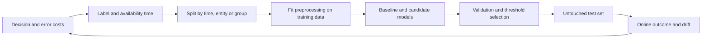

# Machine Learning and Statistical Reasoning

Connect mathematical definitions to model choices, trustworthy experiments, and operational decisions.

**Evidence:** [S1](98-sources.md#s1) reports loss derivations, k-means, statistics, and ML coding; [S2](98-sources.md#s2) reports predictive modelling inside an LLM workflow. Other scenarios are explicit practice extensions. Prerequisites: [ML foundations](machine-learning.md) and [statistics](statistics.md).

## The model-development loop



A score is meaningful only after you define what it predicts, who it generalises to, and what information was available. The same discipline applies to a fraud classifier, retrieval reranker, LLM judge, and QA release gate.

## ML01 · Validation AUC is 0.99; production predictions are poor

**Evidence: practice extension of reported ML depth in [S1](98-sources.md#s1).**

**Answer.** Start with leakage and dataset mismatch before tuning another model. Audit target-derived columns, post-outcome events, duplicates across splits, entity overlap, and preprocessing fitted on the full dataset. Then reproduce the serving transformation on a captured input and compare the features with training.

Split to match deployment. Random row splits answer “new rows from the same mixture”; a group split tests unseen customers; a temporal split tests future traffic. A time split alone may still leak nearly identical documents or correlated records across the boundary. Use a time gap when feature/label windows overlap.

The important implementation rule is to fit learned transformations inside each training fold. A scikit-learn Pipeline helps enforce this; it does not fix a leaked feature or a wrong split strategy. [scikit-learn explains these leakage boundaries](https://scikit-learn.org/stable/common_pitfalls.html).

**Cross-questions.**

- **Should we delete customer ID?** It may be a leakage route or a legitimate entity feature. Decide from the serving contract and unseen-entity test, not its name alone.
- **Can oversampling happen before splitting?** No. Synthetic or duplicate examples can contaminate validation. Apply resampling only to the training portion of each fold.
- **How does this affect LLM evaluation?** Near-duplicate prompts, source documents, and reference answers must not leak from test into optimisation data.

**Test:** compare random, group, and temporal splits; inspect the largest performance changes. See [cross-validation guidance](https://scikit-learn.org/stable/modules/cross_validation.html).

**Executable check:**

```python
# Entity overlap can explain spectacular validation performance.
train_customer_ids = {"a", "b", "c"}
validation_customer_ids = {"c", "d"}
leaked = train_customer_ids & validation_customer_ids
assert leaked == {"c"}
# A production-shaped split must also enforce event/availability time.
```

## ML02 · Which model should be the baseline?

**Evidence: practice extension.** A team wants a transformer for a tabular churn dataset with 30,000 rows.

**Answer.** Establish a majority/constant baseline, then logistic regression with appropriate encoding and a tree ensemble. Logistic regression offers a useful linear decision boundary and interpretable coefficients under stated assumptions. Random forests average decorrelated trees and reduce variance; boosting fits stages that correct residual errors or loss gradients and can capture strong tabular interactions.

| Method | Strength | Failure to check |
| --- | --- | --- |
| Linear/logistic model | Fast, stable, sparse features | Nonlinear interactions, correlated predictors |
| Random forest | Nonlinear relations, modest tuning | Memory, poor extrapolation, rare-pattern coverage |
| Gradient boosting | Strong tabular baseline | Leakage, overfitting through tuning, calibration |
| Neural network | Representation learning, multimodal inputs | Data/compute requirements, optimisation, serving cost |
| kNN | Simple local baseline | Scaling, irrelevant dimensions, distance choice |
| SVM | Margins and useful kernel models | Kernel scaling, tuning, probability calibration |

Measure held-out utility, training cost, inference latency, calibration, and stability across slices. Choose extra complexity only when it buys a measured improvement worth operating.

**Cross-questions.**

- **Why scale for logistic regression or SVM?** Regularisation and distance/margin geometry depend on feature scale. Tree split orderings are usually less sensitive to monotonic scaling.
- **Does a feature importance prove causation?** No. Importance depends on correlations, model, and metric; permuting a correlated feature can understate its contribution.
- **Bagging versus boosting?** Bagging aggregates separately fitted learners; boosting fits sequential corrections. Both can overfit or fail under shift.

**Executable check:**

```python
from sklearn.dummy import DummyClassifier
from sklearn.metrics import balanced_accuracy_score

x, y = [[0], [1], [2], [3]], [0, 0, 0, 1]
model = DummyClassifier(strategy="most_frequent").fit(x, y)
pred = model.predict([[4], [5]])
assert balanced_accuracy_score([0, 1], pred) == 0.5
# Fit stronger candidates on training data, then compare on the same holdout.
```

## ML03 · Why cross-entropy for logistic regression? Why can MSE be non-convex?

**Evidence: reported derivation, paraphrased from [S1](98-sources.md#s1).**

**Answer.** Let `z = w·x + b`, `p = sigmoid(z)`, and `y` be 0 or 1. The Bernoulli negative log-likelihood is:

```text
L_BCE = -y log(p) - (1-y) log(1-p)
      = log(1 + exp(z)) - y z
Derivative with respect to z: p - y
Second derivative: p(1-p) >= 0
```

For ordinary logistic regression with a linear logit and fixed data, the Hessian with respect to weights is `Xᵀ D X`, where `D` has nonnegative entries `p(1-p)`. It is positive semidefinite, so the objective is convex. This statement does not extend to a multilayer neural network merely because it uses cross-entropy.

For half squared error `L = 0.5(p-y)²`, the derivative is `(p-y)p(1-p)`. For `y=0`, its second derivative with respect to z is `p²(1-p)(2-3p)`, negative when `p > 2/3`. This supplies a counterexample to global convexity.

**Cross-questions.**

- **Why can wrong saturated predictions learn slowly with MSE?** The extra `p(1-p)` factor shrinks the gradient. With BCE the logit gradient is `p-y`.
- **Why use a logits-based loss implementation?** It evaluates the log-sum-exp form stably instead of separately taking logs of probabilities rounded to zero.
- **Does convex mean a unique solution?** Not necessarily. Rank deficiency, separable data, and absent regularisation affect uniqueness and finite optima.

**Code:** the [numerical lab](11-coding-labs.md#lab-7) compares analytical and finite-difference gradients.

## ML04 · Derive the k-means centroid, then change the loss

**Evidence: reported, [S1](98-sources.md#s1).**

**Answer.** For fixed cluster membership, minimise `J(μ) = Σ ||xᵢ-μ||²`. Setting `∇μ J = 2nμ - 2Σxᵢ = 0` gives `μ = mean(xᵢ)`. This is why a mean appears in k-means: it is the optimiser of squared Euclidean distortion, not an arbitrary representative.

With absolute distance in one dimension, a median minimises the loss. With a requirement that the centre be an actual observation, use a medoid. Standard k-means alternates assignment and mean updates; each step does not increase its objective, but convergence can be to a local optimum.

**Cross-questions.**

- **Why scale features?** Squared distance weights large-unit coordinates more heavily. Kilometres and metres change the objective unless normalised deliberately.
- **Can k-means cluster embeddings?** Yes, but align the objective with embedding geometry; normalised vectors and spherical clustering may fit cosine-based tasks better.
- **How do you choose k?** Combine domain utility, stability across seeds, silhouette/inertia diagnostics, and downstream evaluation. An elbow is not a proof.
- **An empty cluster appears?** Reinitialise deliberately, for example using a high-error observation, and document the policy.

**Executable check:**

```python
import numpy as np

points = np.array([0., 1., 2., 100.])
mean, median = points.mean(), np.median(points)
assert np.sum((points - mean) ** 2) < np.sum((points - median) ** 2)
assert np.sum(abs(points - median)) < np.sum(abs(points - mean))
# Mean minimises squared distances; median minimises absolute distances.
```

## ML05 · A classifier has 99% accuracy. Should it ship?

**Evidence: practice extension.** Positive prevalence is 1%.

**Answer.** Predicting every case negative already achieves 99% accuracy. Inspect the confusion matrix at the proposed threshold, the ranking curve, and the operating cost. Suppose there are 10,000 cases: 100 positive, 80 true positives, 20 false negatives, and 200 false positives. Precision is `80/280 = 28.6%`; recall is `80/100 = 80%`. Those numbers reveal workload that accuracy hides.

| Metric | Measures | Limitation |
| --- | --- | --- |
| Precision | Fraction of flagged cases that are positive | Can improve by flagging almost nothing |
| Recall | Fraction of positives found | Can improve by flagging everything |
| F1 | Harmonic mean of precision and recall | Assumes a particular balance; ignores true negatives |
| ROC-AUC | Ranking positives above negatives | Can look strong with low useful precision |
| PR-AUC / average precision | Ranking under positive-class emphasis | Depends strongly on prevalence; interpolation conventions differ |
| Log loss / Brier score | Quality of probabilities | Does not directly set a business threshold |

[scikit-learn's metric definitions](https://scikit-learn.org/stable/modules/model_evaluation.html) distinguish these targets. Always specify the positive class and averaging scheme.

**Cross-questions.**

- **How choose a threshold?** Use validation data and the actual review capacity or cost function. Evaluate once on the held-out test.
- **Is 0.5 optimal?** Only under particular calibration and cost assumptions. For calibrated probability p, zero cost for correct decisions, false-positive cost Cfp and false-negative cost Cfn, choose positive when `p > Cfp/(Cfp+Cfn)`.
- **What if prevalence changes?** Precision and calibration can change even if class-conditional ranking stays similar. Re-estimate on recent labelled traffic.

**Executable check:**

```python
from sklearn.metrics import accuracy_score, recall_score

y = [0] * 99 + [1]
pred = [0] * 100
assert accuracy_score(y, pred) == .99
assert recall_score(y, pred) == 0
# Report positive counts and error costs alongside the headline metric.
```

## ML06 · High AUC, unreliable probabilities: what changes?

**Evidence: practice extension.** A model calls 1,000 items “90% likely”, but only 600 are positive.

**Answer.** Ranking and calibration are different. AUC can stay identical under a strictly increasing score transformation, while probabilities become unreliable. Draw a reliability diagram and evaluate Brier score or log loss alongside ranking. Fit a calibration mapping on data not used to fit the underlying estimator, and preserve a final untouched test set.

Sigmoid calibration fits a smooth parametric mapping; isotonic calibration fits a monotonic nonparametric mapping and needs enough data. Neither guarantees calibration under a changed population. [Calibration documentation](https://scikit-learn.org/stable/modules/calibration.html) explains the distinction.

**Cross-questions.**

- **Can an LLM's “confidence: 0.9” be used the same way?** Only after empirical calibration against correctness on the intended task. Self-reported confidence is not automatically a probability.
- **What about each language or customer group?** Check calibration per meaningful slice with adequate sample sizes, not only globally.
- **Can calibration improve decisions without improving AUC?** Yes. Cost-based thresholds require usable probabilities.

**Executable check:**

```python
import numpy as np
from sklearn.metrics import brier_score_loss, roc_auc_score

y = [0, 0, 1, 1]
p1, p2 = [.01, .02, .03, .04], [.1, .2, .8, .9]
assert roc_auc_score(y, p1) == roc_auc_score(y, p2) == 1
assert brier_score_loss(y, p2) < brier_score_loss(y, p1)
# Equal ranking quality does not mean equally useful probabilities.
```

## ML07 · Explain bias, variance, regularisation, and learning curves in an incident

**Evidence: practice extension.** Training error is low; validation error is high and unstable across folds.

**Answer.** Compare training and validation curves as data size and model complexity change. High training error can indicate underfitting, poor features, optimisation failure, or label problems. Low training error with a persistent validation gap suggests overfitting or mismatch; it does not uniquely prove high variance.

The familiar squared-error decomposition is an expectation over repeated training datasets at a fixed input: squared bias plus prediction variance plus irreducible noise. It is not an identity that decomposes any observed classification error.

L2 regularisation smoothly penalises large weights; L1 can produce sparse coefficients; early stopping limits fitting duration. Cross-validation selects strengths on training/validation data. The test set is not another hyperparameter tuning tool.

**Cross-questions.**

- **More data or a smaller model?** Inspect whether the learning curves converge as data grows and whether additional data covers the actual failure slices.
- **Will dropout fix leakage?** No. Regularisation does not repair a dataset containing future information.
- **Why does validation loss worsen while accuracy improves?** A few confidently wrong predictions can increase log loss while thresholded classification improves.

**Executable check:**

```python
# Synthetic learning-curve diagnostic; investigate, do not prove causality.
train_error = [.02, .04, .06]
validation_error = [.30, .20, .14]
gaps = [v - t for t, v in zip(train_error, validation_error, strict=True)]
assert gaps[-1] < gaps[0]
# More data is narrowing a generalisation gap in this example.
```

## ML08 · Explain p-values and confidence intervals without misleading the interviewer

**Evidence: reported statistics themes, [S1](98-sources.md#s1).**

**Answer.** Specify the null hypothesis, the test statistic, and sampling assumptions. A p-value is the probability, under the null model, of a statistic at least as extreme as observed. It is not the probability that the null is true or the probability a result happened “by chance”. A confidence procedure's 95% coverage is a repeated-sampling property; a particular realised interval is not assigned a frequentist probability over a fixed parameter.

For two independent sample means, Welch's statistic is `(meanA-meanB)/sqrt(sA²/nA+sB²/nB)`, with approximate degrees of freedom. For scores on the **same** cases, analyse paired differences rather than pretending the samples are independent. For multiple prompts from one conversation, preserve conversation-level dependence.

**Cross-questions.**

- **Statistically significant but useless?** A tiny gain can be detectable with huge n. Predefine the smallest useful improvement.
- **No significant difference means equal?** No. The experiment may lack power. Equivalence/non-inferiority needs a margin and an appropriate test design.
- **Why is daily peeking a problem?** Repeated tests with optional stopping alter false-positive rates. Use a prespecified horizon or a valid sequential design.

**Executable check:**

```python
import numpy as np
from scipy.stats import t

observations = np.array([3., 4., 2., 5., 4., 3.])
se = observations.std(ddof=1) / np.sqrt(len(observations))
lo, hi = t.interval(.95, df=len(observations)-1,
                    loc=observations.mean(), scale=se)
assert lo < observations.mean() < hi
# IID sampling and an appropriate mean model are assumptions, not guarantees.
```

## ML09 · Design an A/B test for a new model

**Evidence: reported theme → practice scenario, [S1](98-sources.md#s1).**

**Answer.** Choose the unit of randomisation: user, account, conversation, or request. Keep assignment stable to avoid mixing treatment histories. Define a primary outcome, safety guardrails, minimum detectable effect, duration, and stopping policy before launch. Check sample-ratio mismatch and logging consistency before interpreting uplift.

A retrieval change may improve answer ratings while increasing abandonment through latency. Measure task completion, cost per successful task, and latency alongside quality. If users interact with each other or compete for shared inventory, independent-user assumptions may fail; consider cluster randomisation or a switchback design.

**Cross-questions.**

- **Can offline metrics replace the experiment?** They screen candidates cheaply but may miss behaviour and feedback effects. Use both when safe and feasible.
- **What about delayed conversions or labels?** Wait for the observation window and avoid counting immature labels as failures.
- **Do you analyse only users who clicked?** That conditions on post-treatment behaviour and can bias comparisons. Define the population before treatment.

**Executable check:**

```python
import hashlib

def variant(user_id):
    # Stable assignment; use a separate experiment namespace for each test.
    value = hashlib.sha256(f"experiment-7:{user_id}".encode()).digest()
    return "B" if int.from_bytes(value[:8], "big") % 2 else "A"

assert variant("user-17") == variant("user-17")
# Randomise at the unit that prevents interference; analyse at that unit.
```

## ML10 · Data drift, concept drift, and training-serving skew differ how?

**Evidence: practice extension.**

| Failure | Meaning | Useful evidence |
| --- | --- | --- |
| Covariate drift | Input distribution changes | Missingness, category frequencies, distribution tests |
| Label/prior shift | Class prevalence changes | Mature labels and class proportions |
| Concept drift | Relationship between inputs and outcomes changes | Conditional performance with labels |
| Training-serving skew | Implementation or feature availability differs | Replay and feature parity checks |

**Answer.** An input distribution alert is a reason to investigate, not proof of a quality regression. A marketing campaign can shift geography while the model stays accurate. Conversely, concept drift can reduce accuracy without an obvious marginal feature shift.

Maintain data checks, prediction distributions, latency, and delayed-label performance. Slice by cohort, time, language, source, and model version. Decide whether the remedy is a pipeline fix, threshold update, recalibration, retraining, or rollback.

**Cross-questions.**

- **No labels for weeks?** Use proxies and human sampling, communicate uncertainty, and later reconcile against mature labels.
- **Automatically retrain on every drift alert?** That can amplify bad data and feedback loops. Validate the source and candidate before deployment.
- **Does RAG have drift?** Yes: changing documents, query mix, permissions, parsers, embedding versions, and judge behaviour can each change outcomes.

**Executable check:**

```python
import numpy as np

training_feature_mean = np.array([10., 20.])
serving_feature_mean = np.array([10., 2000.])
ratio = serving_feature_mean / training_feature_mean
assert ratio[1] == 100
# This suggests a unit/schema defect to inspect before retraining.
```

## ML11 · Explain Bayes, conditional probability, and base rates

**Evidence: practice extension for reported statistics depth.** A detector is 99% sensitive with a 1% false-positive rate. The event occurs in 0.1% of cases.

**Answer.** In 100,000 cases there are about 100 positives, 99 detected positives, and 999 false positives among 99,900 negatives. Therefore a positive flag has probability `99/(99+999) ≈ 9.0%` of being correct under these assumptions.

Bayes' rule combines likelihood with the base rate. In notation, `P(A|B) = P(B|A)P(A)/P(B)`. Conditioning direction matters: sensitivity `P(flag|event)` is not precision `P(event|flag)`. This applies to anomaly alerts, hallucination detectors, and automated security classifiers.

**Cross-questions.**

- **Can we multiply two detectors' error rates?** Only with justified conditional independence. Two models trained similarly may fail together.
- **What should a detector trigger?** A review queue or a second check may be appropriate when precision is low; do not treat every flag as an established incident.
- **How do you improve the system?** Change threshold, collect more discriminating evidence, target a higher-risk population, or reduce false-positive rate, then re-evaluate.

**Executable check:**

```python
prevalence, sensitivity, false_positive_rate = .01, .9, .05
posterior = sensitivity * prevalence / (
    sensitivity * prevalence + false_positive_rate * (1 - prevalence))
assert .15 < posterior < .16
# A positive test is not 90% likely to be correct at this base rate.
```

## ML12 · How do you choose regression losses and uncertainty estimates?

**Evidence: practice extension.** A forecast looks good on average but fails on extreme days.

**Answer.** MSE penalises large errors strongly and targets a conditional mean; absolute error targets a conditional median. Quantile loss targets a chosen conditional quantile and supports asymmetric costs. MAPE divides by the actual value, making zero and near-zero targets problematic. Report units and compare against a seasonal or persistence baseline.

A prediction interval describes uncertainty in a future outcome; a confidence interval for the mean estimates uncertainty in the average response. A narrow mean interval does not imply a narrow outcome interval. Conformal methods can give useful coverage under exchangeability assumptions; time dependence and shift require care and empirical coverage checks.

**Cross-questions.**

- **What if underprediction costs more?** Choose an asymmetric objective or quantile aligned with that cost.
- **Are intervals calibrated everywhere?** Check empirical coverage and width by region, horizon, and extreme-event slice.
- **Can an LLM write the numeric forecast?** Use the predictive service's typed numeric output; let the LLM explain it with units and limitations.

**Executable check:**

```python
import numpy as np

errors = np.array([1., 1., 1., 20.])
mae, rmse = np.mean(abs(errors)), np.sqrt(np.mean(errors ** 2))
assert rmse > mae
q, residual = .9, np.array([-2., 2.])
pinball = np.maximum(q * residual, (q - 1) * residual)
assert pinball[1] > pinball[0]  # Underprediction costs more for q=.9.
```

## ML13 · Derive a linear-regression gradient and verify it numerically

**Practice extension.** For mean half-squared error, the gradient is `X.T @ (Xw-y) / n`. A finite-difference check compares the analytic derivative with small perturbations; it catches sign, scaling, and shape mistakes before training.

```python
import numpy as np
X = np.array([[1., 2.], [1., 3.]])
y = np.array([2., 4.]); w = np.array([0.1, 0.2])
loss = lambda v: np.mean((X @ v - y)**2) / 2
grad = X.T @ (X @ w - y) / len(y)
eps = 1e-6
numeric = np.array([(loss(w + eps*e)-loss(w-eps*e))/(2*eps) for e in np.eye(2)])
assert np.allclose(grad, numeric, atol=1e-7)
```

**Cross-question:** **Why not use an extremely tiny epsilon?** Floating-point cancellation can dominate. **What about deep networks?** Check a small smooth deterministic example; dropout and nonsmooth points can complicate comparison.

## ML14 · Logistic scores overflow for extreme inputs

**Practice extension.** Computing `log(1+exp(z))` directly can overflow. Use a stable softplus/log-sum-exp implementation, and use a loss that accepts logits. Avoid clipping probabilities without understanding how it alters the objective and gradient.

```python
import numpy as np
z = np.array([-1000., 0., 1000.]); y = np.array([0., 1., 1.])
loss = np.logaddexp(0, z) - y*z
assert np.isfinite(loss).all()
assert np.isclose(loss[1], np.log(2))
```

**Cross-question:** **Does finite loss imply a healthy model?** No; predictions may still be confidently wrong. **Which tests?** Extreme logits, both labels, batch dimensions, and agreement with a trusted implementation on moderate values.

## ML15 · Missing values appear only in production

**Practice extension.** Determine whether missingness means unavailable, not applicable, censored, or broken ingestion. Fit imputation on training folds and consider a missingness indicator when it represents useful information. A blanket zero can be a valid real value and hide the distinction.

```python
import numpy as np
from sklearn.impute import SimpleImputer
train = np.array([[1.], [3.], [np.nan]])
imputer = SimpleImputer(strategy="median", add_indicator=True).fit(train)
result = imputer.transform([[np.nan]])
assert result.tolist() == [[2.0, 1.0]]
```

**Cross-question:** **Impute using the full dataset?** That leaks validation information. **What if a new column is entirely missing?** Validate schema and monitor coverage; a learned median cannot repair a disconnected upstream source.

## ML16 · New categorical values crash the encoder

**Practice extension.** Decide whether unknown categories should map to a reserved value, be ignored, or cause a contract error. Fit vocabulary only on training data and monitor unknown rates. High-cardinality identifiers may require careful hashing or another representation rather than enormous one-hot vectors.

```python
from sklearn.preprocessing import OneHotEncoder
encoder = OneHotEncoder(handle_unknown="ignore", sparse_output=False)
encoder.fit([["basic"], ["premium"]])
assert encoder.transform([["new-plan"]]).tolist() == [[0.0, 0.0]]
```

**Cross-question:** **Is all-zero harmless?** It has a particular model meaning and may be indistinguishable from some baseline representations. **Target encoding?** Learn it out-of-fold with smoothing to avoid leaking each row's target.

## ML17 · Target encoding makes validation unrealistically good

**Practice extension.** A category mean computed from all labels leaks the validation targets. Construct training encodings out-of-fold, using only other folds' labels, and fit a final mapping on training data for later inference. Rare categories need shrinkage towards a global prior.

```python
category_sum, category_count = 8, 10
global_mean, smoothing = 0.2, 5
smoothed = (category_sum + smoothing*global_mean) / (category_count + smoothing)
assert smoothed == 0.6
```

**Cross-question:** **What if a category occurs once?** Without regularisation its encoding can reveal its label. **Time-dependent categories?** Out-of-fold alone may still use future labels; respect time and availability constraints.

## ML18 · Class weighting versus oversampling versus threshold tuning

**Practice extension.** Weighting changes the training loss, resampling changes the observed training distribution, and threshold tuning changes the operating decision after scoring. They solve related but distinct problems. Reassess calibration after weighting or sampling.

```python
# Weighted binary-error illustration, not a full training loss.
labels = [0, 0, 1]; predicted = [0, 1, 0]
weights = [1, 1, 5]
weighted_error = sum(w*(a != b) for a,b,w in zip(labels,predicted,weights)) / sum(weights)
assert weighted_error == 6/7
```

**Cross-question:** **Apply SMOTE before cross-validation?** No, it can leak synthetic information across folds. **Which choice wins?** Compare at the same business operating constraint, such as recall at a fixed review capacity, rather than comparing arbitrary default thresholds.

## ML19 · Choose a threshold under a review-capacity limit

**Practice extension.** If reviewers can inspect 100 cases/day, evaluate precision and recall in the top 100 and the benefit/cost of that queue. A threshold tuned to a fixed probability may produce wildly different queue sizes as traffic changes.

```python
scores = [0.9, 0.1, 0.8, 0.4]
capacity = 2
selected = sorted(range(len(scores)), key=lambda i: -scores[i])[:capacity]
assert selected == [0, 2]
```

**Cross-question:** **Always fill the queue?** Not if the remaining cases have negative expected value; combine capacity and minimum-value criteria. **How test ties?** Use deterministic or explicitly randomised tie rules and assess fairness/utility effects.

## ML20 · Diagnose correlated features and unstable coefficients

**Practice extension.** Strongly correlated predictors can make coefficients unstable while predictions remain similar. Inspect conditioning, regularisation, and feature redundancy. Do not interpret a single coefficient as a causal effect without a justified identification design.

```python
import numpy as np
X = np.array([[1., 2.], [2., 4.], [3., 6.]])
assert np.linalg.matrix_rank(X) == 1
solution, *_ = np.linalg.lstsq(X, np.array([1., 2., 3.]), rcond=None)
assert np.allclose(X @ solution, [1, 2, 3])
```

**Cross-question:** **Invert `X.T @ X` directly?** It can be singular or ill-conditioned; use appropriate numerical solvers. **Does dropping one feature fix every issue?** It addresses redundancy, not leakage, confounding, or distribution mismatch.

## ML21 · PCA improves runtime but hurts rare-class recall

**Practice extension.** PCA retains directions of high variance, not necessarily directions predictive of the target. Fit scaling/PCA inside training folds and assess class/slice performance. A low-variance direction may carry important rare-event signal.

```python
import numpy as np
from sklearn.decomposition import PCA
X = np.array([[0., 0.], [1., 0.1], [2., 0.], [3., 0.1]])
projection = PCA(n_components=1).fit_transform(X)
assert projection.shape == (4, 1)
```

**Cross-question:** **PCA versus feature selection?** PCA creates combinations; selection preserves chosen original features. **Why standardise?** Units affect variance and therefore the retained directions. Compare against a supervised representation or no reduction.

## ML22 · Explain entropy and information gain in a decision tree

**Practice extension.** A split improves impurity by making child label distributions more homogeneous. Information gain is parent entropy minus the sample-weighted child entropies. Greedy local gain is not a guarantee of globally optimal generalisation.

```python
import math
def entropy(probabilities):
    return -sum(p*math.log2(p) for p in probabilities if p > 0)
assert entropy([0.5, 0.5]) == 1.0
assert entropy([1.0, 0.0]) == 0.0
```

**Cross-question:** **Why constrain depth/minimum leaf size?** Tiny leaves memorise noise. **What about high-cardinality features?** They can offer many opportunistic splits; evaluate held-out behaviour and importance carefully.

## ML23 · Gradient boosting versus random forest on noisy data

**Practice extension.** Random forests average many randomised trees; boosting sequentially fits loss-reducing updates. Boosting can fit strong patterns but also chase noise when capacity/iterations are excessive. Compare learning rate, number/depth of trees, subsampling, and early stopping on valid splits.

```python
# A boosting-style additive update, illustrating the mechanism only.
current = [0.2, 0.6]
correction = [0.5, -0.2]
learning_rate = 0.1
updated = [a + learning_rate*b for a,b in zip(current,correction)]
assert updated == [0.25, 0.58]
```

**Cross-question:** **Does a smaller learning rate always generalise better?** It changes optimisation and usually needs more stages; evaluate jointly. **Why not just quote a leaderboard?** Dataset size, leakage, objective, and serving constraints determine the relevant comparison.

## ML24 · Use nested cross-validation without optimistic selection bias

**Practice extension.** Selecting hyperparameters and reporting the best score on the same folds overstates generalisation. An inner loop selects configurations; an outer loop estimates the entire selection procedure. A final temporal holdout may still be needed for future deployment.

```python
from sklearn.model_selection import KFold
outer = KFold(n_splits=3, shuffle=True, random_state=7)
for train, test in outer.split(range(12)):
    assert set(train).isdisjoint(test)
```

**Cross-question:** **Is nested CV always necessary?** Cost and decision context matter; a clean train/validation/test scheme can suffice. **How preserve groups?** Use group-aware splitting in both loops and verify that entities do not cross their relevant boundaries.

## ML25 · Regularisation parameter names have opposite directions

**Practice extension.** In some estimators a larger `alpha` means stronger regularisation; in common linear classifiers a larger `C` means weaker regularisation. Read the estimator contract and search on a log scale over plausible values.

```python
alphas = [10**power for power in range(-4, 3)]
assert alphas[0] == 0.0001 and alphas[-1] == 100
```

**Cross-question:** **Can you transfer the same value between libraries?** Not safely without checking objective normalisation, penalty definitions, and solver behaviour. **How catch a reversed interpretation?** Plot training/validation performance and coefficient norms across the parameter sweep.

## ML26 · An anomaly detector flags every new customer

**Practice extension.** Unusual does not necessarily mean harmful. New customers may differ from the training population in legitimate ways. Define the target action and label a review sample, then measure precision at available review capacity and performance by cohort.

```python
scores = {"new_a": 0.95, "old_b": 0.20, "new_c": 0.90}
flagged = [key for key, score in scores.items() if score >= 0.9]
assert flagged == ["new_a", "new_c"]
```

The code applies a threshold; it does not prove these cases are bad. **Cross-question:** **No labelled anomalies?** Evaluate synthetic/known incidents, stability, and human-reviewed samples while stating limits. **Automatically block?** Usually use risk-proportionate actions and an appeal/review path.

## ML27 · Confidence intervals for a proportion near zero or one

**Practice extension.** A naïve normal interval can go outside [0,1] or collapse at zero observed failures. Use an appropriate binomial interval or exact bound and report the assumptions. For zero failures, the one-sided bound has a simple form.

```python
n = 100
upper_95 = 1 - 0.05 ** (1/n)
assert 0.029 < upper_95 < 0.030
```

**Cross-question:** **Does this certify adversarial safety?** No, it assumes representative independent trials. **What if samples cluster by user?** Independence is questionable; use a cluster-aware design or report the narrower claim supported by the sample.

## ML28 · Simpson's paradox reverses an aggregate result

**Practice extension.** A model can improve within each group yet look worse overall if group proportions differ. Compare like-for-like slices and standardise weights to the intended population before interpreting an aggregate.

```python
scores = {"easy": 0.95, "hard": 0.60}
mixture_a = 0.9*scores["easy"] + 0.1*scores["hard"]
mixture_b = 0.1*scores["easy"] + 0.9*scores["hard"]
assert mixture_a > mixture_b
```

Nothing about the model changed in this example; only the mixture changed. **Cross-question:** **Equal-weight every slice?** Only if that is the intended decision metric; also report traffic-weighted performance. **What should the dashboard show?** Counts, per-slice outcomes, and stable population weights where comparisons require them.

## ML29 · Correlation versus causal effect in a product metric

**Practice extension.** Users who invoke an assistant may already be more engaged. Comparing their outcomes with non-users does not isolate the assistant's effect. Random assignment, a valid natural experiment, or a defensible causal model is needed for a causal claim.

```python
# Random assignment illustration; assignment precedes observed engagement.
import random
rng = random.Random(7)
assignment = {user: rng.choice(["control", "treatment"]) for user in range(100)}
assert len(assignment) == 100
```

**Cross-question:** **Control for every observed feature?** That can introduce bias if conditioning on post-treatment variables or colliders. **No experiment possible?** State the observational limitation and assumptions rather than presenting adjusted correlation as proven causation.

## ML30 · Estimate power before running an experiment

**Practice extension.** Required sample size depends on baseline rate/variance, desired detectable effect, significance, power, randomisation unit, and dependence. Small effects need more data. Clustered users or repeated measurements change the effective sample size.

```python
# Rough two-arm mean-test planning formula with assumed known variance.
z_alpha, z_power, sigma, delta = 1.96, 0.84, 1.0, 0.1
n_per_arm = 2 * (z_alpha + z_power)**2 * sigma**2 / delta**2
assert round(n_per_arm) == 1568
```

This is an approximation under stated assumptions, not a universal calculator. **Cross-question:** **Stop early on significance?** Use a valid sequential procedure or the planned horizon. **Low traffic?** Choose a realistic effect/decision scope and report uncertainty; do not promise an underpowered test can settle a tiny difference.

## ML31 · Multiple comparisons create a winning model by chance

**Practice extension.** Trying many candidates and reporting only the best validation result selects noise as well as signal. Keep a development set for iteration and an untouched confirmation set. Use error-rate control when making simultaneous inferential claims.

```python
alpha, tests = 0.05, 20
familywise_false_positive_if_independent = 1 - (1-alpha)**tests
assert familywise_false_positive_if_independent > 0.64
```

**Cross-question:** **Are model comparisons independent?** Often not; the calculation illustrates the issue, not an exact estimate for correlated candidates. **Does Bonferroni solve dataset overfitting?** It controls a specified family of tests, not every adaptive decision and hidden reuse of data.

## ML32 · Bootstrap the right unit of data

**Practice extension.** Resampling individual turns from the same conversation treats correlated observations as independent. Resample conversations or other independent groups, retaining all paired model results inside each sampled group.

```python
import random
groups = {"u1": [1, 0], "u2": [1], "u3": [0, 1, 1]}
sampled_ids = random.Random(7).choices(list(groups), k=len(groups))
sample = [value for key in sampled_ids for value in groups[key]]
assert len(sample) >= len(sampled_ids)
```

**Cross-question:** **Equal weight per user or per turn?** Those estimate different quantities; state the target before aggregating. **Very few groups?** Bootstrap intervals can be unstable; gather more independent groups and avoid overconfident conclusions.

## ML33 · Label noise versus ambiguous requirements

**Practice extension.** Disagreements can arise from annotation errors, unclear instructions, missing context, or genuinely multiple valid answers. Review examples and provenance before choosing a noise-robust loss. A model cannot learn a coherent target from contradictory policy definitions.

```python
labels = {"case1": ["pass", "pass"], "case2": ["pass", "fail"]}
needs_review = [case for case, votes in labels.items() if len(set(votes)) > 1]
assert needs_review == ["case2"]
```

**Cross-question:** **Majority vote enough?** Not if all raters share a misconception or the required expertise is missing. **How improve?** Pilot the rubric, adjudicate examples, preserve uncertainty, and separate unresolved cases from confidently labelled test data.

## ML34 · Why does a random seed not guarantee reproducibility?

**Practice extension.** Data order, thread scheduling, GPU kernels, distributed reduction order, dependency versions, and external services can vary. Save artefacts and split IDs, use deterministic options where supported, and distinguish bitwise reproducibility from statistically similar behaviour.

```python
import numpy as np
a = np.random.default_rng(17).normal(size=5)
b = np.random.default_rng(17).normal(size=5)
assert np.array_equal(a, b)
```

This verifies one generator sequence in one environment. **Cross-question:** **Guarantee the same across all future NumPy versions?** Do not infer a broader contract without documentation. **What should the report include?** Environment, data/model/configuration hashes, seeds, hardware, and observed run-to-run variability.

## ML35 · A feature is predictive because the model changed the world

**Practice extension.** A recommendation system only observes clicks on shown items; a fraud system may never observe outcomes for blocked transactions. Training directly on this feedback can reinforce previous decisions and hide counterfactual outcomes.

```python
logged = [{"shown": True, "clicked": False}, {"shown": False, "clicked": None}]
assert logged[1]["clicked"] is None  # unobserved, not a negative label
```

**Cross-question:** **Treat unshown items as negative?** That introduces assumptions and bias; use appropriate sampling/exposure correction or exploration. **Inverse propensity weighting?** It needs valid propensities and overlap; tiny probabilities create high variance. Explain assumptions before presenting it as a fix.

## ML36 · Explain decision trees, linear models, and neural models under shift

**Practice extension.** Different inductive biases affect extrapolation. A tree ensemble tends to piecewise predictions based on learned splits; a linear model extrapolates its fitted relation; a neural network's out-of-distribution behaviour depends on architecture/training and is not automatically meaningful.

```python
from sklearn.tree import DecisionTreeRegressor
model = DecisionTreeRegressor(max_depth=2, random_state=1).fit([[0], [1], [2]], [0, 1, 2])
assert model.predict([[100]])[0] <= 2
```

This example illustrates a conventional regression tree's leaf prediction. **Cross-question:** **Linear extrapolation is better?** Only if the relationship persists. **How test?** Hold out the regions/horizons/ranges the deployment will encounter and consider abstention or constrained models.

## ML37 · Quantile regression and asymmetric error costs

**Practice extension.** If underprediction is more expensive, optimise a suitable upper quantile rather than assuming the mean is the correct decision. Pinball loss is `q*e` for positive residual e and `(q-1)*e` for negative residuals.

```python
def pinball(actual, predicted, q):
    error = actual - predicted
    return max(q*error, (q-1)*error)
assert pinball(10, 8, 0.9) == 1.8
assert abs(pinball(8, 10, 0.9) - 0.2) < 1e-12
```

**Cross-question:** **Why not call the 90th percentile a 90% confidence interval?** A quantile is a point on the conditional outcome distribution, not an interval for an estimated parameter. **What test matters?** Empirical quantile coverage and cost under the intended deployment distribution.

## ML38 · A high silhouette score produces useless clusters

**Practice extension.** Internal clustering metrics describe geometry, not business usefulness. Clusters may simply reflect language, document length, or a noisy high-variance feature. Inspect representative members, stability, and downstream utility.

```python
clusters = {"c1": ["short_en_1", "short_en_2"], "c2": ["long_en_1"]}
assert sum(map(len, clusters.values())) == 3
```

The fixture forces a membership audit; it does not calculate semantic quality. **Cross-question:** **No labels available?** Use domain review and task outcomes in addition to internal metrics. **How test stability?** Perturb sampling/seeds/features and compare assignments with an appropriate permutation-invariant measure.

## ML39 · Deploy a calibrated model with preprocessing intact

**Practice extension.** Export the entire trusted preprocessing/model/calibration contract, with feature names/order and expected missing/unknown behaviour. Serving only the final estimator can produce different inputs from training.

```python
from sklearn.pipeline import make_pipeline
from sklearn.preprocessing import StandardScaler
from sklearn.linear_model import LogisticRegression
pipeline = make_pipeline(StandardScaler(), LogisticRegression())
pipeline.fit([[0., 1.], [1., 1.], [2., 0.], [3., 0.]], [0, 0, 1, 1])
assert pipeline.predict_proba([[1.5, 0.5]]).shape == (1, 2)
```

**Cross-question:** **Does this code calibrate explicitly?** No, it demonstrates preprocessing preservation; explicit calibration needs separate fitting data. **What regression test?** Compare offline and served predictions on identical feature fixtures, including missing/unknown values and reordered fields.

## ML40 · Explain your model's failure without blaming the dataset vaguely

**Practice extension.** Form falsifiable hypotheses: delayed labels, wrong join, changed user mix, insufficient capacity, calibration shift, or changed decision cost. For each, name the evidence needed and a small experiment that could disprove it.

```python
hypotheses = {
    "feature_skew": "compare captured online features with offline replay",
    "label_delay": "recompute metrics using only mature labels",
    "threshold_shift": "compare utility across thresholds on recent validation",
}
assert all(hypotheses.values())
```

**Cross-question:** **What do you do before retraining?** Validate input/label contracts and reproduce the failure. **What is a strong interview conclusion?** State what is known, what remains uncertain, the smallest next test, and a safe operational response such as rollback or fallback.

## Summary in simple points

- **ML01–02:** Diagnose time, entity and preprocessing leakage before tuning. Compare with a simple baseline on a production-shaped holdout.
- **ML03–04:** Logistic cross-entropy has useful convexity in linear parameters; logistic MSE need not. Squared-distance clustering uses means, while absolute-distance objectives use medians.
- **ML05–06:** Accuracy can hide complete minority-class failure. Ranking metrics and probability calibration measure different things.
- **ML07–08:** Learning curves help distinguish underfitting and variance. State what p-values and confidence intervals actually describe.
- **ML09–10:** Choose an experiment unit that controls interference. Separate input drift, changed target relationships and implementation skew.
- **ML11–12:** Use base rates when interpreting a positive prediction. Choose losses and uncertainty estimates for the cost of mistakes.
- **ML13–14:** Derive gradients and compare with finite differences. Use numerically stable sigmoid and log-loss calculations.
- **ML15–16:** Fit missing-value handling on training data. Define a safe, tested path for previously unseen categories.
- **ML17–18:** Target encoding must avoid using the row's own outcome. Class weights, resampling and threshold changes have different effects.
- **ML19–20:** Choose thresholds under actual review capacity and error costs. Correlated predictors can make individual coefficients unstable.
- **ML21–22:** PCA preserves high variance, which may discard rare predictive signals. Tree splits reduce impurity according to the chosen criterion.
- **ML23–24:** Bagging and boosting reduce error differently and respond differently to noise. Separate tuning from final estimation with nested validation when needed.
- **ML25–26:** Regularisation parameter directions vary by API. Evaluate anomalies by segment and use case, especially for new users.
- **ML27–28:** Near-zero error rates need suitable intervals, not a misleading normal approximation. Aggregates can reverse the pattern within groups.
- **ML29–30:** Correlation does not identify an intervention's effect. Plan power using the baseline, effect size, variance and randomisation unit.
- **ML31–32:** Repeated comparisons increase false discoveries. Bootstrap independent units, such as users or documents, rather than correlated rows.
- **ML33–34:** Separate noisy labels from unclear requirements. Seeds alone cannot fix changing data, kernels, hardware or dependencies.
- **ML35–36:** Predictions can change future training data. Judge model families by evidence and constraints, especially under distribution shift.
- **ML37–38:** Quantile losses represent asymmetric prediction costs. Clustering metrics need to agree with useful downstream groups.
- **ML39–40:** Ship preprocessing, calibration, feature schema and model together. Explain a failure with a reproducible case and an experiment that isolates its cause.
