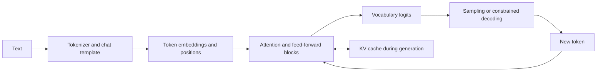

# Deep Learning, Transformers, and LLM Adaptation

Explain the tensor operations, learning objectives, and inference constraints underneath model APIs.

**Evidence:** [S1](98-sources.md#s1) explicitly reports attention coding, convolution, decoding, KV caches, and attention optimisations. The remaining scenarios extend those themes. See [deep-learning foundations](deep-learning.md) for additional CNN, RNN, and optimisation definitions.

## From text to output



The model predicts tokens. The application supplies task context, enforces authorisation, validates outputs, and measures whether the task was achieved. Token likelihood alone does not supply those guarantees.

## DL01 · Implement attention and then extend it to multiple heads

**Evidence: reported, [S1](98-sources.md#s1).**

**Answer.** For input `X` shaped `(batch, tokens, d_model)`, learned projections produce Q, K, V. Reshape them to `(batch, heads, tokens, d_head)`. Compute `QKᵀ / sqrt(d_head)`, apply a causal/padding mask, normalise along the key dimension, multiply by V, concatenate heads, and apply an output projection.

Scaling controls the growth of dot-product variance as head dimension increases. Softmax must operate over keys for each query; applying it over the wrong axis can produce plausible shapes and incorrect behaviour. Subtract the row maximum for numerical stability.

```python
# Standalone NumPy single-head reference; multi-head implementation is in the lab.
import numpy as np

q = np.array([[1., 0.], [0., 1.], [1., 1.]])
k = q.copy()
v = np.array([[1., 2.], [3., 4.], [5., 6.]])
scores = q @ k.T / np.sqrt(q.shape[-1])
allowed = np.tril(np.ones(scores.shape, dtype=bool))
scores = np.where(allowed, scores, -np.inf)
weights = np.exp(scores - scores.max(axis=-1, keepdims=True))
weights /= weights.sum(axis=-1, keepdims=True)
out = weights @ v
assert np.allclose(weights.sum(axis=-1), 1)
assert np.allclose(out[0], v[0])
print(out)
```

**Cross-questions.**

- **Complexity?** The attention matrix costs O(T²d) compute across heads and O(hT²) memory if materialised, per batch/layer. Projections and the feed-forward network add their own costs.
- **What if all keys for a query are masked?** Softmax of all negative infinities is undefined. Reject invalid masks or define a safe padded-query output; never silently allow NaNs.
- **How test causal behaviour?** Change only future input tokens and verify earlier outputs are unchanged. Shape checks alone miss a reversed mask.
- **Are mask booleans universal?** No. Different attention APIs use different conventions. Verify the exact function contract.

Run [the attention lab](11-coding-labs.md#lab-2), which includes a causality test and a reference calculation.

## DL02 · Encoder, decoder, and encoder-decoder: what differs?

**Evidence: reported transformer theme → comparison exercise, [S1](98-sources.md#s1).**

| Architecture | Attention pattern | Typical use | Testing concern |
| --- | --- | --- | --- |
| Encoder | Bidirectional input attention | Embeddings, classification, tagging | Pooling, padding, truncation |
| Decoder | Causal attention over prior tokens | Autoregressive generation | Future-token leakage, cache correctness |
| Encoder-decoder | Input encoder plus causal decoder and cross-attention | Conditional sequence generation | Correct source attention and decoder shift |

**Answer.** In encoder-decoder cross-attention, decoder queries attend to keys/values derived from encoder outputs. In self-attention, Q, K, and V derive from the same sequence representation. A decoder-only model can still perform classification or produce embeddings; architecture tendencies are not strict capability boundaries.

**Cross-questions.**

- **Why positional information?** Attention alone does not encode token order. Position embeddings or mechanisms such as rotary embeddings introduce sequence-position structure.
- **Does increasing the context configuration guarantee long-context quality?** No. Training distribution, positional scaling, retrieval of distant evidence, and memory must be tested.
- **Why do chat templates matter?** Role delimiters and turn formatting are part of the model's expected input. A wrong template can damage instruction following without a Python error.

**Executable check:**

```python
import numpy as np

length = 4
encoder_allowed = np.ones((length, length), dtype=bool)
decoder_allowed = np.tril(encoder_allowed)
assert encoder_allowed[0, 3] and not decoder_allowed[0, 3]
# Cross-attention has target-query length by source-key length.
```

## DL03 · Temperature, top-k, top-p, greedy, and beam search

**Evidence: reported follow-ups, [S1](98-sources.md#s1).**

**Answer.** Temperature rescales logits before sampling. Lower positive temperature concentrates probability; higher temperature flattens it. Top-k keeps a fixed number of highest-probability candidates; top-p keeps a smallest high-probability set reaching a cumulative mass threshold. Greedy decoding selects the highest-probability token each step. Beam search retains several high-scoring partial sequences and uses a sequence-level scoring policy.

| Method | Controls | Common misunderstanding |
| --- | --- | --- |
| Temperature | Distribution sharpness | Low temperature guarantees truth |
| Top-k | Candidate count | The same k suits all probability shapes |
| Top-p | Retained probability mass | p is a correctness probability |
| Greedy | Local argmax path | Local optimum is best complete answer |
| Beam | Multiple candidate sequences | More beams always improve open-ended quality |

**Cross-questions.**

- **Is temperature zero deterministic?** It often requests greedy behaviour, but distributed kernels, tie-breaking, backend changes, and model revisions can still affect results.
- **Which parameters should a QA fixture save?** Model identifier/revision, template, generation settings, seed if supported, tool definitions, and complete input artefacts.
- **Should an evaluator sample several outputs?** If user-visible variability matters, yes. Separate within-case stochastic variation from variation across distinct tasks.

**Executable check:**

```python
import numpy as np

logits = np.array([3., 2., 1.])
def probabilities(temperature):
    scaled = logits / temperature
    weights = np.exp(scaled - scaled.max())
    return weights / weights.sum()
assert probabilities(.5)[0] > probabilities(2.)[0]
assert logits.argmax() == 0  # Greedy decoding avoids division by zero.
```

## DL04 · Estimate the memory needed for inference

**Evidence: reported KV-cache theme → numerical exercise, [S1](98-sources.md#s1).**

**Answer.** Separate model weights, KV cache, activations/workspace, and framework/runtime overhead. For a conventional decoder cache:

```text
KV bytes ≈ 2 × layers × batch × cached_tokens × kv_heads × head_dim × bytes_per_element
```

The factor two is for K and V. For 32 layers, batch 8, 4,096 tokens, 8 KV heads, head dimension 128, and two-byte values, the cache is **4 GiB**. With 32 KV heads instead of 8, it becomes **16 GiB**. This estimate excludes weights and workspace and assumes full caching at all layers.

A hypothetical 8-billion-parameter model needs about 16 GB decimal for two-byte weights alone. Four-bit weights have an ideal payload near 4 GB, but quantisation metadata, unquantised layers, cache, and kernels add memory. “It fits at batch one” says little about production concurrency.

**Cross-questions.**

- **What does GQA change?** Several query heads share each KV head, reducing cache size. MQA shares a single KV head; MHA has separate K/V per attention head.
- **Why not cache Q too?** In autoregressive decoding the new query attends to past keys and values; past queries are not needed for this computation.
- **Can cache quantisation be independent of weight quantisation?** Yes. They affect different tensors and have different quality/performance trade-offs.

[Hugging Face documents cache strategies and their limitations](https://huggingface.co/docs/transformers/en/kv_cache).

## DL05 · FlashAttention, paged attention, batching, and speculative decoding differ how?

**Evidence: reported optimisation follow-ups, [S1](98-sources.md#s1).**

| Technique | Main target | What to measure |
| --- | --- | --- |
| FlashAttention | Attention memory traffic through tiled exact computation | Memory use, kernel speed, supported shapes/dtypes |
| Paged KV management | Cache allocation and fragmentation | Active sequences, memory utilisation, scheduling overhead |
| Continuous batching | Scheduling sequences as they enter/finish | Throughput under TTFT and inter-token latency limits |
| Speculative decoding | Verifying proposed tokens in fewer target-model steps | Acceptance rate and end-to-end speedup |

**Answer.** These mechanisms can complement one another because they attack different bottlenecks. FlashAttention does not make dense attention mathematically linear in sequence length. Paged KV management does not improve a model's reasoning. Batching may improve throughput while increasing waiting time. A weak draft model can make speculative decoding slower if proposals are frequently rejected.

**Cross-questions.**

- **Does speculative decoding change the distribution?** Some algorithms preserve the target distribution through an acceptance/correction procedure. That guarantee belongs to the particular algorithm, not every “draft and verify” implementation.
- **When is batching less helpful?** Low traffic, tight first-token deadlines, or very uneven sequence lengths can reduce benefits.
- **How do you benchmark?** Use representative prompt/output lengths and arrival patterns, and compare p50/p95 latency, throughput, memory, and correctness.

Primary mechanisms: [FlashAttention](https://arxiv.org/abs/2205.14135), [PagedAttention](https://arxiv.org/abs/2309.06180), [speculative decoding](https://arxiv.org/abs/2211.17192).

**Executable check:**

```python
# Page allocation arithmetic; not an implementation of PagedAttention.
import math
sequence_lengths, block_size = [17, 31, 8], 16
allocated = sum(math.ceil(n / block_size) * block_size for n in sequence_lengths)
assert allocated == 80
assert allocated - sum(sequence_lengths) == 24
# Block management and FlashAttention's IO optimisation solve different issues.
```

## DL06 · Prompting, RAG, fine-tuning, or a conventional model?

**Evidence: practice extension connecting [S2](98-sources.md#s2) and [S6](98-sources.md#s6).** A customer wants current policy answers, consistent JSON, and numeric demand forecasts.

**Answer.** Decompose the needs. Current, access-controlled evidence suggests retrieval. Output structure suggests constrained generation plus validation. Stable behaviour/style may benefit from fine-tuning if simpler instructions and examples fail. Numeric forecasts need a validated forecasting model. These solutions can coexist.

| Approach | Changes | Good fit | Does not guarantee |
| --- | --- | --- | --- |
| Prompting/few-shot | Inference input | Instructions, examples, simple behaviour | Reliable authorisation or factuality |
| RAG | Retrieved evidence | Fresh or private knowledge and citations | Relevant retrieval or correct synthesis |
| Fine-tuning | Model parameters/adapters | Repeated task behaviour, format, domain adaptation | Fresh knowledge or easy record deletion |
| Tool call | External computation/action | Exact queries, calculators, predictive models | Safe execution without validation |
| Classical ML/rules | Explicit predictor or policy | Structured labels, well-defined decisions | General language understanding |

**Cross-questions.**

- **Can fine-tuning and retrieval be combined?** Yes. Tune behaviour while keeping mutable facts in retrieval.
- **What evidence justifies tuning?** A stable failure taxonomy, enough representative data, a strong baseline, a held-out improvement, and acceptable serving/maintenance cost.
- **How to avoid overfitting an evaluation set?** Separate training, development, and final test examples, including source families and time periods.

**Executable check:**

```python
# Quantify a measured choice rather than selecting by fashionable tooling.
trials = [
    {"approach": "prompt", "accuracy": .76, "cost": .01},
    {"approach": "rag", "accuracy": .89, "cost": .03},
    {"approach": "adapter", "accuracy": .85, "cost": .02},
]
feasible = [r for r in trials if r["accuracy"] >= .87]
assert min(feasible, key=lambda r: r["cost"])["approach"] == "rag"
# Synthetic inputs; repeat with held-out cases and uncertainty.
```

## DL07 · Explain LoRA and QLoRA with parameter counts

**Evidence: practice extension.**

**Answer.** For a frozen weight matrix W shaped `(d_out, d_in)`, LoRA learns a low-rank update `ΔW = (alpha/r) B A`, with A shaped `(r, d_in)` and B shaped `(d_out, r)`. It trains `r(d_in+d_out)` parameters instead of `d_in*d_out` for that matrix. For 4,096 by 4,096 and rank 8, that is 65,536 versus 16,777,216 parameters.

QLoRA combines adapter training with a quantised frozen base model and other memory-saving choices. Fewer trainable weights reduce optimiser-state requirements; forward/backward activations still cost memory. Rank, target modules, learning rate, sequence length, and data quality matter more than choosing a method by popularity.

**Cross-questions.**

- **Why initialise one factor to zero?** It starts the adapter update at zero while allowing gradients to begin learning; both factors identically zero would obstruct useful initial gradients.
- **Can adapters be merged?** Often yes for supported weights/configurations, but quantised serving and multiple adapters need implementation-specific checks.
- **What must be versioned?** Base model revision, tokenizer/template, adapter, target modules, quantisation configuration, data snapshot, training seed, and evaluator.

[PEFT's LoRA contract](https://huggingface.co/docs/peft/en/package_reference/lora) and [the QLoRA paper](https://arxiv.org/abs/2305.14314) describe the methods. Do not assume an old PEFT example matches the installed major/minor version.

**Executable check:**

```python
width, rank = 4096, 16
full_parameters = width * width
adapter_parameters = width * rank + rank * width
assert adapter_parameters == 131072
assert full_parameters / adapter_parameters == 128
# Base weights, activations, optimiser state and KV cache remain separate costs.
```

## DL08 · Training loss falls but the assistant gets worse

**Evidence: practice extension.**

**Answer.** Check labels and loss masking first. In supervised chat tuning, ensure the chosen training objective scores the intended assistant tokens rather than accidentally rewarding copying user/system text. Check sequence truncation, padding labels, response boundaries, chat template, and data contamination. Lower loss on repeated easy examples can coexist with worse performance on real tasks.

Compare a frozen baseline on the same held-out dataset and slices. Inspect length distribution, over-refusal, formatting, domain accuracy, and general capabilities. Use learning curves and a small controlled ablation before changing architecture.

**Cross-questions.**

- **Why NaNs?** Invalid targets/masks, unstable operations, excessive learning rate, overflow, or corrupted data. Find the first non-finite tensor or gradient.
- **Gradient clipping or smaller learning rate?** Clipping limits gradient norm spikes; a learning-rate change affects all steps. Diagnose before treating either as a cure.
- **Does gradient accumulation reproduce a large batch exactly?** It can approximate its gradient with correct scaling, but dropout, batch statistics, optimiser step timing, and distributed details may differ.

**QA tests:** label shift, pad masking, finite gradients, tiny-batch overfit, checkpoint reload, deterministic preprocessing, and held-out regression checks.

**Executable check:**

```python
# A release guard catches capability loss despite better training loss.
old = {"train_loss": 1.2, "heldout_accuracy": .86}
new = {"train_loss": .8, "heldout_accuracy": .77}
assert new["train_loss"] < old["train_loss"]
assert new["heldout_accuracy"] < old["heldout_accuracy"]
# Inspect split contamination, masking, style drift and per-task slices.
```

## DL09 · SFT, RLHF, DPO, and verifiable rewards

**Evidence: practice extension.**

| Method | Training signal | Important failure |
| --- | --- | --- |
| SFT | Demonstrated desired completions | Learning annotator mistakes or narrow style |
| Reward-model RLHF | Preferences train a reward model, then policy optimisation | Reward-model exploitation and instability |
| DPO | Preferred/rejected response pairs with a reference-policy formulation | Biased preference data and loss of useful diversity |
| RL with verifiable rewards | Executable or otherwise checkable outcomes | Exploiting an incomplete verifier |

**Answer.** A preference is not automatically factual truth. A response can be persuasive and wrong. Pairwise data should represent the intended task, and safety/utility trade-offs need explicit measurement. DPO directly optimises a preference objective; it does not require the same explicit reward-model-plus-RL loop as a standard RLHF pipeline. [The DPO paper](https://arxiv.org/abs/2305.18290) defines its assumptions.

**Cross-questions.**

- **Can a unit-test reward be gamed?** Yes: hard-coded fixtures, disabled tests, leaked expected outputs, or changes to the evaluator. Keep the verifier outside the agent's write permissions.
- **Why preserve a reference model?** It provides a comparison/regularisation anchor; the exact role depends on the objective.
- **How do you detect over-optimisation?** Evaluate on independent human judgements, task outcomes, and hidden cases that were not used to produce the training signal.

**Executable check:**

```python
import numpy as np

beta = .1
# Log-probability difference chosen-minus-rejected, policy vs reference.
policy_gap, reference_gap = 2., .5
dpo_loss = np.logaddexp(0, -beta * (policy_gap - reference_gap))
assert dpo_loss < np.log(2)
# A preference objective still depends on the quality of the preference labels.
```

## DL10 · Debug a deep-learning training loop

**Evidence: reported ML coding theme → practice scenario, [S1](98-sources.md#s1).**

**Answer.** Verify data, shapes, objective, gradients, optimiser, and evaluation state in that order. A tiny subset should usually be overfittable by a sufficiently expressive model; if it is not, inspect the pipeline before scaling. Backpropagation applies the chain rule through the computation graph. Accidentally detaching a tensor or converting it to an ordinary number can break that path.

| Pair | Difference that matters |
| --- | --- |
| `train()` / `eval()` | Changes modules such as dropout and batch normalisation |
| No-grad / evaluation mode | No-grad disables gradient recording; it does not itself change module mode |
| Batch norm / layer norm | Batch norm uses batch-derived statistics; layer norm normalises within an example's feature dimensions |
| FP16 / BF16 | Different exponent and mantissa trade-offs; hardware support and numerical behaviour differ |
| Data parallel / model sharding | Replicate and split examples versus partition model state/computation |

**Cross-questions.**

- **Why clear gradients?** Many frameworks accumulate into gradient buffers unless cleared deliberately.
- **Why use gradient checkpointing?** Recompute selected activations during backward to save memory, trading extra compute for memory.
- **How do you reproduce a run?** Record data/order, seeds, library/hardware versions, preprocessing, optimiser, schedule, and checkpoint. Seeds alone do not ensure identical distributed execution.

**Executable check:**

```python
import numpy as np

weights = np.array([.5, -.2])
gradient = np.array([.1, -.3])
before = weights.copy()
learning_rate = .01
assert np.isfinite(gradient).all()
weights -= learning_rate * gradient
assert not np.array_equal(weights, before)
# In a framework also verify train/eval mode, zero_grad, backward and step.
```

## DL11 · Implement a convolution and explain its output shape

**Evidence: reported, [S1](98-sources.md#s1).**

**Answer.** For input height H, padding P, kernel K, stride S, and dilation D, output height is `floor((H + 2P - D(K-1) - 1)/S + 1)` when the configuration is valid. Iterate over output locations, multiply each corresponding patch by the kernel, sum input channels, and add the output-channel bias. Most deep-learning “convolutions” implement cross-correlation, without flipping the kernel.

For a 5×5 single-channel input, a 3×3 kernel, no padding, stride 1, output is 3×3. With stride 2, output is 2×2. Multiple filters produce multiple output channels.

**Cross-questions.**

- **Why not loop in production?** Loops are useful as a reference; optimised libraries use specialised kernels and memory layouts.
- **How do you test it?** A hand-computable example, non-square shapes, channels, stride/padding boundaries, and comparison with a trusted framework.
- **Convolution versus attention?** Convolution builds local translation-shared interactions; attention can make content-dependent interactions across positions. Cost and inductive bias differ.

**Executable check:**

```python
height, width, kernel, padding, stride = 7, 9, 3, 1, 2
out_h = (height + 2 * padding - kernel) // stride + 1
out_w = (width + 2 * padding - kernel) // stride + 1
assert (out_h, out_w) == (4, 5)
# Lab 7 implements channel summation and checks an asymmetric kernel.
```

## DL12 · Tokenisation, embeddings, perplexity, and structured outputs

**Evidence: reported embeddings theme, [S6](98-sources.md#s6); remaining constraints are practice extensions.**

**Answer.** Tokenisers map text to vocabulary IDs; embeddings map IDs or whole inputs into vectors. A sentence embedding model's pooling and training objective determine whether distances are useful for retrieval. A language model's token embedding table is not automatically a strong sentence-retrieval model.

Perplexity is the exponential of average negative token log-likelihood. Compare it only with compatible tokenisation and evaluation conditions. It does not directly measure factuality, tool success, or answer usefulness.

A structured-output mechanism constrains syntax/schema. The application must still validate semantics: an existing order ID, authorised customer, allowed date range, consistent units, and evidence-backed values. Handle refusal, truncation, and tool errors as explicit outcomes.

**Cross-questions.**

- **Why does the same character count produce different costs?** Tokenisation varies by language, formatting, and tokenizer vocabulary.
- **Can two embeddings with the same dimension share an index?** Matching dimensions do not imply compatible vector spaces. Use a consistent model/revision or rebuild and evaluate a migration.
- **Is valid JSON a successful answer?** No. It may encode false or unauthorised content.

**Executable check:**

```python
import math

mean_token_nll = 1.5
perplexity = math.exp(mean_token_nll)
assert 4.48 < perplexity < 4.49
# Compare only compatible tokenisation/data/normalisation conventions.
# A low perplexity does not check whether an output satisfies a business rule.
```

## DL13 · A causal mask is reversed and training loss looks excellent

**Practice extension.** Future-token leakage can make training artificially easy. Draw a tiny visibility matrix: query position i may attend to keys j no greater than i. Test earlier outputs after changing only future tokens.

```python
import numpy as np
allowed = np.tril(np.ones((4, 4), dtype=bool))
assert allowed[2, 1] and not allowed[1, 2]
assert allowed[0].tolist() == [True, False, False, False]
```

**Cross-question:** **Why can ordinary validation miss it?** If validation uses the same leaked full-sequence computation, it reproduces the defect. Compare autoregressive generation with teacher-forced scoring. **Boolean convention?** Read the exact API; some masks mean allowed positions and others mean blocked positions.

## DL14 · Padding changes a sentence embedding

**Practice extension.** Pool only valid tokens and preserve the model's expected special-token/pooling convention. Averaging padded vectors can change representations with batch composition or maximum length.

```python
import numpy as np
hidden = np.array([[2., 4.], [4., 6.], [0., 0.]])
mask = np.array([1., 1., 0.])
pooled = (hidden * mask[:, None]).sum(axis=0) / mask.sum()
assert np.allclose(pooled, [3., 5.])
```

**Cross-question:** **An empty valid-token set?** Reject or define a fallback; avoid division by zero. **Is mean pooling always correct?** No, use the embedding model's trained contract and evaluate it rather than selecting pooling arbitrarily.

## DL15 · Label shifting is off by one in language-model training

**Practice extension.** Next-token training aligns each position's prediction with the following token. Libraries may perform the shift internally, so shifting twice is also a bug. Inspect a three-token example and the framework's loss contract.

```python
tokens = [11, 22, 33, 44]
inputs, targets = tokens[:-1], tokens[1:]
assert list(zip(inputs, targets)) == [(11, 22), (22, 33), (33, 44)]
```

**Cross-question:** **Do you score system/user tokens during SFT?** It depends on the intended objective; assistant-only masking is common but must be implemented deliberately. **How test?** Print token IDs, decoded tokens, and loss masks for a tiny synthetic conversation before launching training.

## DL16 · A softmax is normalised over the batch axis

**Practice extension.** The output may have the right shape while examples influence one another. Specify which dimension represents alternatives: vocabulary for token probabilities, keys for attention, classes for classification.

```python
import numpy as np
logits = np.array([[1., 2., 3.], [3., 2., 1.]])
exp = np.exp(logits - logits.max(axis=-1, keepdims=True))
probabilities = exp / exp.sum(axis=-1, keepdims=True)
assert np.allclose(probabilities.sum(axis=-1), [1., 1.])
```

**Cross-question:** **How detect batch contamination?** Evaluate an example alone and beside unrelated examples under identical padding/settings. **Why subtract the maximum?** It leaves softmax mathematically unchanged while avoiding overflow in exponentiation.

## DL17 · Explain backpropagation with a scalar chain

**Practice extension.** Backpropagation applies the chain rule and accumulates contributions where paths meet. For `y=(wx+b)^2`, the derivative with respect to w is `2(wx+b)x`. A small analytic example makes gradient debugging concrete.

```python
x, w, b = 3.0, 2.0, 1.0
prediction = (w*x+b)**2
grad_w = 2*(w*x+b)*x
assert prediction == 49 and grad_w == 42
```

**Cross-question:** **Why accumulate gradients at shared weights?** Every use contributes to the same parameter's derivative. **What breaks the graph?** Detaching, converting to non-differentiable values, or using operations without the intended gradient path. Inspect gradients before blaming the optimiser.

## DL18 · Vanishing and exploding gradients in a deep model

**Practice extension.** Repeated Jacobian products can shrink or amplify gradients. Activation choice, initialisation, normalisation, residual paths, and learning rate affect this behaviour. Measure gradient norms by layer instead of only the final loss.

```python
small_product = 0.5**20
large_product = 2.0**20
assert small_product < 1e-6
assert large_product > 1e6
```

**Cross-question:** **Does clipping fix vanishing gradients?** No, clipping limits large norms. **Why residual connections?** They provide an additional gradient/information path, though they do not guarantee successful optimisation for any architecture or learning rate.

## DL19 · Calculate and apply gradient clipping

**Practice extension.** Global norm clipping rescales the gradient vector when its norm exceeds a threshold while preserving direction. It differs from clipping each coordinate independently.

```python
import numpy as np
grad = np.array([3., 4.])
limit = 2.0
clipped = grad * min(1.0, limit / np.linalg.norm(grad))
assert np.allclose(clipped, [1.2, 1.6])
```

**Cross-question:** **Clip before or after unscaling mixed-precision gradients?** Apply the framework's documented sequence; clipping scaled gradients changes the intended threshold. **Does frequent clipping indicate success?** It may reveal an excessive learning rate or unstable batches. Monitor clipping frequency and underlying norms.

## DL20 · Gradient accumulation changes the effective update size

**Practice extension.** When accumulating equal-sized microbatches to approximate one larger batch, scale losses/gradients consistently and step the optimiser once per intended effective batch. Unequal final microbatches require sample-aware weighting.

```python
microbatch_gradients = [2.0, 4.0]
mean_gradient = sum(microbatch_gradients) / len(microbatch_gradients)
assert mean_gradient == 3.0
```

**Cross-question:** **Sum without division?** It changes update magnitude unless learning rate/objective scaling compensates. **Exactly equal to a large batch?** Dropout, batch normalisation, optimiser schedule, and distributed reduction can differ. Test a deterministic simple model first.

## DL21 · Layer normalisation versus batch normalisation in practice

**Practice extension.** Batch normalisation uses statistics across a batch/spatial grouping and maintains inference statistics in conventional implementations. Layer normalisation operates over designated feature dimensions within each example, making it useful where batch size or sequence length varies.

```python
import numpy as np
x = np.array([[1., 2., 3.], [10., 20., 30.]])
normalised = (x-x.mean(axis=-1, keepdims=True)) / np.sqrt(x.var(axis=-1, keepdims=True)+1e-5)
assert np.allclose(normalised.mean(axis=-1), 0)
```

**Cross-question:** **Why specify axes?** “Layer” is not a universal tensor axis; the API configuration defines it. **Why does evaluation differ from training?** Inspect dropout and batch-statistic use, not only gradient recording.

## DL22 · Dropout is active during evaluation

**Practice extension.** Inverted dropout zeroes randomly chosen activations during training and scales retained values so their expectation is preserved. Ordinary inference disables it; Monte Carlo dropout is a deliberate alternative requiring its own evaluation contract.

```python
import numpy as np
x = np.ones(4); keep_probability = 0.5
mask = np.array([1, 0, 1, 0])
train_output = x * mask / keep_probability
assert train_output.tolist() == [2., 0., 2., 0.]
```

**Cross-question:** **Why does no-grad not fix it?** Module mode and gradient recording are separate controls. **How test?** Repeatedly evaluate the same fixed batch and compare expected determinism/configuration; inspect training flags on nested modules.

## DL23 · Weight decay and L2 penalty are not always identical

**Practice extension.** With basic SGD under matching conventions, an L2 term can resemble multiplicative shrinkage. Adaptive optimisers scale gradients per parameter, so coupling the penalty into the gradient differs from decoupled weight decay.

```python
weight, learning_rate, decay = 2.0, 0.1, 0.01
shrunk = weight * (1-learning_rate*decay)
assert abs(shrunk - 1.998) < 1e-12
```

**Cross-question:** **Decay every parameter?** Biases/normalisation parameters are often treated separately, but justify the configuration. **Why can two “same hyperparameter” runs differ?** Optimiser definitions, scaling, exclusions, and schedules may differ. Compare exact update rules rather than names alone.

## DL24 · Quantisation reduces memory but worsens a critical slice

**Practice extension.** Quantisation maps values to a lower-precision representation using scale/offset or other schemes. Evaluate end-to-end task quality and numerical stability, especially rare languages, long context, and precise extraction. Memory savings do not guarantee speed on unsupported hardware/kernels.

```python
import numpy as np
x = np.array([-1., -0.3, 0.2, 1.])
scale = np.max(np.abs(x)) / 127
q = np.round(x/scale).clip(-127, 127).astype(np.int8)
restored = q.astype(float)*scale
assert np.max(np.abs(restored-x)) <= scale/2 + 1e-12
```

**Cross-question:** **Weight-only versus activation quantisation?** They affect different memory/compute paths. **How release?** Compare against the unquantised baseline with the actual serving runtime, hardware, and critical evaluation slices.

## DL25 · Calculate LoRA savings without claiming the same total-memory reduction

**Practice extension.** Adapter parameter reduction does not reduce every tensor in training. Frozen weights still load; activations and workspace remain; optimiser states apply primarily to trainable parameters.

```python
d_in = d_out = 4096
rank = 8
full = d_in*d_out
adapter = rank*(d_in+d_out)
assert full/adapter == 256
```

**Cross-question:** **Training is 256 times cheaper?** No, the parameter ratio is not an end-to-end compute or memory ratio. **Which layers get adapters?** Target modules must fit the architecture and task; evaluate attention-only versus broader choices under a controlled data/budget setup.

## DL26 · An adapter is loaded on the wrong base model

**Practice extension.** Shape compatibility is insufficient. Adapter weights were learned relative to a particular base revision, tokenizer/template, and target-module structure. Validate a manifest and run known fixtures before serving.

```python
adapter_manifest = {"base_revision": "base-r7", "tokenizer": "tok-r2"}
loaded = {"base_revision": "base-r8", "tokenizer": "tok-r2"}
assert adapter_manifest != loaded
```

**Cross-question:** **Can a minor revision still work?** Possibly, but treat it as a new combination requiring evaluation rather than assuming compatibility. **Rollback?** Keep the previous base-plus-adapter-plus-template bundle, not merely one file.

## DL27 · Distil a large model into a smaller one

**Practice extension.** Distillation transfers behaviour using teacher outputs, soft targets, intermediate representations, or task examples. A smaller student can reduce serving cost but inherit teacher errors and lose coverage outside the distilled distribution.

```python
import numpy as np
teacher = np.array([0.7, 0.2, 0.1])
student = np.array([0.6, 0.3, 0.1])
kl = np.sum(teacher*np.log(teacher/student))
assert kl > 0
```

**Cross-question:** **Teacher agreement is the only metric?** No, evaluate task truth and user outcomes on independent data. **How choose examples?** Cover real task distribution and difficult slices, deduplicate, and prevent test contamination. Include the cost of producing and validating teacher data.

## DL28 · Mixture-of-experts active parameters versus total parameters

**Practice extension.** A router selects a subset of experts for each token. Active compute can be smaller than the total parameter count suggests, but total weights, communication, routing balance, and expert placement still matter.

```python
experts, active_per_token, parameters_per_expert = 8, 2, 100
assert experts*parameters_per_expert == 800
assert active_per_token*parameters_per_expert == 200
```

This simplified calculation excludes shared layers and router overhead. **Cross-question:** **Does every request use the same experts?** Routing may vary by token. **What can fail under load?** Expert imbalance, communication bottlenecks, and capacity policies. Benchmark realistic token distributions, not only parameter counts.

## DL29 · Long context passes synthetic tests but misses evidence in practice

**Practice extension.** An advertised context window is a capacity limit, not a guarantee that all positions or tasks are handled equally. Test evidence at different positions, multiple distractors, conflicting facts, and tasks requiring several distant facts.

```python
positions = ["beginning", "middle", "end"]
fixtures = [{"evidence_position": p, "distractor_count": 20} for p in positions]
assert len(fixtures) == 3
```

**Cross-question:** **Increase context again?** It may add cost and distractors; compare retrieval and structured extraction. **Which metric?** Task correctness and required-evidence usage by position/length, not simply whether the request fits the API.

## DL30 · KV cache output differs from full-sequence inference

**Practice extension.** Check position indices, causal masks, cache length, dtype, padding side, and whether cached states correspond to the same prefix and model revision. Incremental decoding must reproduce the intended full-prefix computation within numerical tolerance.

```python
cached_prefix = [11, 22, 33]
new_token = 44
full_prefix = cached_prefix + [new_token]
assert len(full_prefix) == len(cached_prefix) + 1
```

**Cross-question:** **Reuse cache after changing the system prompt?** Not for mismatching prefix states. **What tests?** One-token and multi-token extensions, variable batch lengths, reset/reuse boundaries, and comparison of logits from cached and uncached paths.

## DL31 · Beam search returns short generic answers

**Practice extension.** Sequence scores combine token probabilities, and longer sequences accumulate additional negative log probabilities. Length penalties, stopping rules, and task suitability matter. Beam search optimises its defined score, which may not align with open-ended usefulness.

```python
short_logprob, short_length = -2.0, 2
long_logprob, long_length = -3.0, 6
assert short_logprob > long_logprob
assert long_logprob/long_length > short_logprob/short_length
```

**Cross-question:** **Average log probability always better?** It changes the bias and can create other pathologies. **How choose decoding?** Evaluate task-level quality, diversity, constraints, and latency, using the same prompt/model and clearly stated settings.

## DL32 · Top-p implementation keeps the wrong token set

**Practice extension.** Sort probabilities descending, accumulate mass, and retain enough tokens to meet the threshold, including the boundary-crossing token. Renormalise the retained distribution before sampling.

```python
probabilities = [0.6, 0.25, 0.1, 0.05]
kept, total = [], 0.0
for index, p in enumerate(probabilities):
    kept.append(index); total += p
    if total >= 0.8:
        break
assert kept == [0, 1]
```

**Cross-question:** **Apply temperature before or after filtering?** The implementation order changes the distribution; use the provider/runtime contract. **Why test a flat distribution?** It stresses the difference between top-k's fixed count and top-p's variable count.

## DL33 · Perplexity improves but extraction accuracy drops

**Practice extension.** Token likelihood weights common easy tokens heavily and can improve while rare required fields regress. Compare perplexity only under compatible tokenisation and masking, and use task-specific held-out metrics for release.

```python
import math
mean_negative_log_likelihood = math.log(4)
perplexity = math.exp(mean_negative_log_likelihood)
assert abs(perplexity - 4) < 1e-12
```

**Cross-question:** **Perplexity across two tokenisers?** Not directly comparable without an appropriate common normalisation/evaluation scheme. **Which extraction metric?** Field correctness, required-field recall, unsupported-field rate, schema validity, and downstream decision errors.

## DL34 · Structured output is valid but semantically impossible

**Practice extension.** JSON schema constrains structure and some ranges. Cross-field relationships and business rules need application validation. Distinguish parse failure, schema failure, semantic failure, and unsupported evidence.

```python
from datetime import date
record = {"start": "2026-09-30", "end": "2026-09-01"}
valid = date.fromisoformat(record["start"]) <= date.fromisoformat(record["end"])
assert not valid
```

**Cross-question:** **Let the model repair it?** A bounded repair step can help, but revalidate and avoid inventing missing facts. **How test?** Valid-looking wrong IDs, inverted dates, impossible units, extra fields, truncation, and refusal outputs.

## DL35 · Model confidence is used as an automatic approval score

**Practice extension.** A generated confidence number is text produced by the model. Treat it as a feature requiring calibration, not a direct probability of correctness or permission. Compare confidence bins against adjudicated outcomes.

```python
reported_confidence = [0.9, 0.9, 0.9, 0.9]
correct = [1, 0, 1, 0]
empirical_accuracy = sum(correct)/len(correct)
assert empirical_accuracy == 0.5
```

**Cross-question:** **Token log probabilities solve it?** They measure sequence likelihood under the model, not necessarily factual correctness. **Approval alternative?** Enforce deterministic authorisation and evidence requirements, with calibrated uncertainty informing escalation only where appropriate.

## DL36 · Fine-tuning data contains the final test questions

**Practice extension.** Leakage can arise through direct examples, paraphrases, shared documents, synthetic generation from test answers, or public benchmark contamination. Split by source/task family before generation and maintain data lineage.

```python
train_families = {"policy-a", "policy-b"}
test_families = {"policy-c"}
assert train_families.isdisjoint(test_families)
```

**Cross-question:** **Exact string deduplication enough?** No, paraphrases and source overlap remain. **How detect contamination?** Provenance checks, near-duplicate search, temporal holdouts, and private task sets, while acknowledging that pretraining contamination may be hard to rule out fully.

## DL37 · Compare full fine-tuning, adapters, and prompt tuning

**Practice extension.** Full fine-tuning updates many/all model weights; adapters update added/subset parameters; prompt tuning learns soft input representations while the base remains frozen. Their memory, expressivity, serving, and portability trade-offs differ.

```python
parameters = {"full": 8_000_000_000, "adapter": 8_000_000, "soft_prompt": 409_600}
assert parameters["soft_prompt"] < parameters["adapter"] < parameters["full"]
```

Counts are hypothetical examples, not model benchmarks. **Cross-question:** **Smallest trainable count wins?** No; task quality, activation memory, data, and deployment support matter. **Can soft prompts move between models?** Do not assume compatibility across embedding spaces or architectures.

## DL38 · Distributed training hangs after one worker fails

**Practice extension.** Collective operations require participating ranks to follow compatible execution. A failed or divergent rank can leave others waiting. Use distributed timeouts, consistent data/control flow, coordinated failure handling, and restartable checkpoints.

```python
world_size = 4
reported_ranks = {0, 1, 3}
missing = set(range(world_size)) - reported_ranks
assert missing == {2}
```

**Cross-question:** **Save only model weights?** Resume may also need optimiser, scheduler, random state, data position, and sharding metadata. **How test?** Kill a worker at controlled points and verify restart without silently repeating/skipping training data beyond the documented policy.

## DL39 · Implement convolution as a reference for an optimised kernel

**Practice extension extending the reported convolution task.** A tiny loop is useful for checking semantics even when production uses a GPU library. Test stride, padding, channels, dilation, and kernel orientation independently.

```python
import numpy as np
x = np.arange(9).reshape(3, 3)
kernel = np.ones((2, 2))
out = np.array([[np.sum(x[i:i+2, j:j+2]*kernel) for j in range(2)] for i in range(2)])
assert out.tolist() == [[8., 12.], [20., 24.]]
```

**Cross-question:** **Why call it cross-correlation?** The kernel is not flipped in this common deep-learning convention. **What makes a strong test?** An asymmetric kernel catches orientation errors that an all-ones kernel cannot; include one in the full lab.

## DL40 · Choose a model using capability, constraints, and evidence

**Practice extension.** Build a representative task set and compare candidates under the actual prompt/tool/retrieval setup. Include quality, security/abstention, latency, context behaviour, cost, hardware/API constraints, and operating burden. Public leaderboard rank is insufficient.

```python
candidates = [
    {"name": "small", "quality": 0.86, "p95_ms": 800},
    {"name": "large", "quality": 0.91, "p95_ms": 2400},
]
feasible = [m["name"] for m in candidates if m["quality"] >= 0.85 and m["p95_ms"] <= 1000]
assert feasible == ["small"]
```

Numbers are exercise inputs. **Cross-question:** **What if no candidate qualifies?** Change scope, latency contract, workflow, or escalation rather than hiding a failed requirement. **How keep the choice current?** Version the benchmark and rerun when models, traffic, tools, or costs materially change.

## Summary in simple points

- **DL01–02:** Implement projected attention with correct shapes, scaling and masks. Encoder, decoder and encoder-decoder attention expose different context.
- **DL03–04:** Decoding controls change output distributions and search. Estimate weights, KV cache, activations and runtime overhead separately.
- **DL05–06:** FlashAttention, paged KV management, batching and speculative decoding address different bottlenecks. Choose prompting, retrieval or adaptation from measured task failures.
- **DL07–08:** LoRA reduces trainable parameters; QLoRA also quantises the base during adaptation. Lower training loss does not prove better held-out assistant behaviour.
- **DL09–10:** SFT, preference optimisation and reward optimisation use different supervision. Debug a training loop with finite values, gradient checks and actual parameter updates.
- **DL11–12:** Convolution sums over channels and has explicit stride/padding output sizes. Tokenisation and valid JSON do not guarantee semantic correctness.
- **DL13–14:** A causal mask must block future tokens. Mask padding in attention and pooling, including fully masked cases.
- **DL15–16:** Next-token labels must shift exactly once. Softmax normalisation must use the intended axis.
- **DL17–18:** Backpropagation applies the chain rule through local derivatives. Inspect gradient magnitudes to diagnose vanishing or exploding updates.
- **DL19–20:** Gradient clipping limits update magnitude. Accumulation changes effective batch size and needs correct loss scaling and final partial-batch handling.
- **DL21–22:** Batch and layer normalisation use different statistics. Switch dropout and other training-only behaviour appropriately during evaluation.
- **DL23–24:** Decoupled weight decay differs from an L2 gradient under adaptive optimisation. Quantisation needs slice-level quality checks after memory savings.
- **DL25–26:** Adapter parameter savings do not equal total memory savings. An adapter must match its base model and tokenizer revisions.
- **DL27–28:** Distillation trades teacher capability for a cheaper student and needs held-out evaluation. MoE active compute differs from total stored parameters.
- **DL29–30:** Advertised context length is not reliable evidence use. Cached decoding must match full decoding with correct positions, masks and cache identity.
- **DL31–32:** Beam-search scoring can bias length. Nucleus sampling must retain the token that crosses the cumulative-probability threshold.
- **DL33–34:** Perplexity measures token prediction under a particular setup. Validate business rules and units after validating output syntax.
- **DL35–36:** Model self-confidence is not a calibrated approval policy. Keep test data and near-duplicates out of adaptation and model selection.
- **DL37–38:** Full tuning, adapters and prompt tuning have different capacity and serving costs. Distributed training needs worker-failure handling and consistent checkpoints.
- **DL39–40:** Compare optimised kernels with a clear reference, using asymmetric and multi-channel cases. Select models with a versioned quality, latency, memory and cost experiment.
