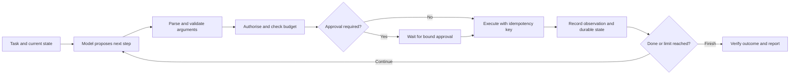

# Agents, Tool Use, Memory, and MCP

Design systems that choose actions while keeping execution, state, and permissions under explicit control.

**Evidence:** [S3](98-sources.md#s3) reports LangChain/LangGraph and framework-choice questions; [S2](98-sources.md#s2) reports combining agents with predictive ML; [S4](98-sources.md#s4) reports testing agent/tool workflows. Detailed failure scenarios are original practice extensions.

## Separate a proposal from its execution



The model can propose actions. The application decides which actions are allowed and whether they completed. This separation makes the same architecture implementable, auditable, and testable.

## AG01 · When should you use an agent instead of a workflow?

**Evidence: reported framework-choice theme → design exercise, [S3](98-sources.md#s3).**

**Answer.** Use a fixed workflow when the steps and decision boundaries are known: extract fields, validate, look up a record, apply a policy, and produce a response. Use model-directed execution when the required path genuinely depends on information discovered during the task, such as research across unknown sources.

| Choice | Control flow | Useful property | Added risk |
| --- | --- | --- | --- |
| Ordinary code/rules | Fully specified | Predictable and cheap | Brittle for unstructured ambiguity |
| LLM workflow | Predefined model/tool stages | Bounded execution with language handling | Model errors at each stage |
| Single agent | Model chooses successive steps | Adaptive investigation | Loops, tool mistakes, variable cost |
| Multi-agent system | Several interacting decision makers | Specialisation or parallel independent work | Coordination, duplicated effort, inconsistent state |

**Cross-questions.**

- **Does a tool call make a system an agent?** Terminology varies. Explain whether the model controls repeated action selection or follows a fixed path.
- **How justify adding autonomy?** Compare completion rate, quality, latency, cost, and unsafe-action rate against a simpler baseline.
- **Why not use five agents immediately?** Each added model call and coordination step creates cost and failure opportunities. Start from demonstrated task decomposition needs.

[Anthropic's architectural distinction between workflows and agents](https://www.anthropic.com/engineering/building-effective-agents) is useful terminology, not a mandatory implementation framework.

**Executable check:**

```python
# Deterministic routing is sufficient when the valid next step is known.
transitions = {"received": "validate", "validated": "retrieve", "grounded": "draft"}
assert transitions["validated"] == "retrieve"
# Add model-led decisions only where fixed routing demonstrably falls short.
```

## AG02 · LangChain versus LangGraph, and why use either?

**Evidence: reported, [S3](98-sources.md#s3).**

**Answer.** LangChain provides model/tool abstractions and higher-level application/agent components. LangGraph focuses on stateful graph execution, persistence, and control over orchestration. Their ecosystem overlaps; they are not mutually exclusive competitors.

Compare explicit state, persistence, interrupt/resume, debugging, deployment constraints, and team familiarity. A small loop can be clearer in ordinary Python. A long-running process with human review may justify a durable runtime. Keep business rules and tool implementations testable independently of whichever orchestration package you choose.

**Cross-questions.**

- **What is graph state?** The data carried across execution steps, with a schema and defined merge/update semantics. It is not automatically equivalent to the chat history.
- **What does a checkpointer guarantee?** It persists execution state according to the runtime's contract. It does not make an external payment exactly once.
- **How handle an upgrade?** Pin runtime and checkpoint schema versions, replay representative saved states, and test migrations before deploying new nodes.

See [LangGraph persistence](https://docs.langchain.com/oss/python/langgraph/persistence) and the [version notebook](99-tools-versions.md). API examples from older pre-1.x tutorials should be checked against the installed release.

**Executable check:**

```python
# Explicit state makes orchestration requirements concrete before framework choice.
state = {"run_id": "r1", "revision": 3, "next_node": "review", "status": "paused"}
assert state["next_node"] == "review" and state["status"] == "paused"
# A persisted checkpoint still needs versioning and safe side-effect handling.
```

## AG03 · Design a tool contract the model can use correctly

**Evidence: practice extension of [S4](98-sources.md#s4).**

**Answer.** Use a narrow verb with an explicit argument schema and typed outcomes. Define units, allowed ranges, required identifiers, side effects, preconditions, and error categories. Separate search/read tools from mutation tools. An ambiguous `do_action(data)` interface makes planning and QA difficult.

```python
# Standalone application-side validation, independent of an LLM SDK.
from dataclasses import dataclass

@dataclass(frozen=True)
class ForecastArgs:
    latitude: float
    longitude: float
    horizon_days: int

    def __post_init__(self):
        if not -90 <= self.latitude <= 90:
            raise ValueError("invalid latitude")
        if not -180 <= self.longitude <= 180:
            raise ValueError("invalid longitude")
        if type(self.horizon_days) is not int or not 1 <= self.horizon_days <= 7:
            raise ValueError("horizon_days must be an integer from 1 to 7")

assert ForecastArgs(12.97, 77.59, 1).horizon_days == 1
```

This example checks values after construction; a public API also needs strict parsing, extra-field policy, finite-number checks, authenticated context, and resource authorisation. Never trust the model to supply tenant identity.

**Cross-questions.**

- **Why structured errors?** `not_found`, `invalid_arguments`, `permission_denied`, and `temporary_unavailable` imply different next steps.
- **Can the model repair invalid arguments?** Sometimes, within a small attempt budget. Permission failures should not invite the model to find an alternative route around policy.
- **How measure tool quality?** Valid argument rate, correct tool selection, execution success, task completion, and unauthorised-effect rate are separate metrics.

## AG04 · A graph resumes and sends the same email twice

**Evidence: practice extension.**

**Answer.** Inspect which node or task re-executes on resume and where the effect occurs relative to persistence. A durable state checkpoint is not a transaction with the email service. Move effects into explicit operations with stable IDs; use provider idempotency where available and a durable operation ledger with reconciliation.

For LangGraph interrupts, account for node restart semantics: code before the interrupt can run again. Keep pre-interrupt code safe to replay, and bind approval to the exact action payload and state revision. [The interrupt documentation](https://docs.langchain.com/oss/python/langgraph/interrupts) describes this behaviour.

**Cross-questions.**

- **What if the payload changes after approval?** Invalidate the approval and request one for the new payload where the product policy requires it.
- **Can we mark an email sent before calling the provider?** That can lose an email if the process crashes before the call. Marking after can duplicate it. Explain the atomicity gap and use provider support/reconciliation.
- **How test?** Inject crashes before the effect, after it, before checkpoint, and after checkpoint. Assert the intended number of actual effects.

**Executable check:**

```python
# Replay fixture; Lab 4 supplies atomic SQLite persistence and crash tests.
receipts = {}
def commit_once(key):
    if key not in receipts:
        receipts[key] = {"status": "committed"}
    return receipts[key]
assert commit_once("action-1") == commit_once("action-1")
assert len(receipts) == 1
# This in-memory illustration alone is not restart-safe or distributed.
```

## AG05 · Stop an agent that keeps searching or calling the wrong tool

**Evidence: practice extension.**

**Answer.** Enforce limits in runtime code: elapsed deadline, steps, total input/output tokens, monetary budget, retries per tool, and maximum fan-out. Detect repeated equivalent calls and lack of new evidence, while allowing legitimate repeated operations when their state differs.

A termination condition is task-specific. “Model says done” is weak for a booking task; verify the booking state. “No tool calls” may mean success, confusion, or inability. Return a clear partial result or escalation reason when a limit is reached.

**Cross-questions.**

- **Can the model manage its own budget?** It can receive budget information, but enforcement must be external.
- **How do you avoid retry storms?** Central retry policy, shared rate budgets, bounded backoff, circuit breaking, and not multiplying retries across layers.
- **What if search has no answer?** Use an explicit no-evidence outcome instead of forcing another tool call until a plausible answer appears.

**Test:** an always-failing tool, a tool returning the same observation, an adversarial document requesting another call, and a slow provider.

**Executable check:**

```python
budget = {"max_steps": 3, "max_cost": .10}
steps, cost = 2, .09
next_cost = .02
may_continue = steps < budget["max_steps"] and cost + next_cost <= budget["max_cost"]
assert not may_continue
# Reserve budget atomically before parallel tool calls.
```

## AG06 · Memory, context, state, and retrieval: distinguish them

**Evidence: practice extension connected to [S9](98-sources.md#s9).**

| Term | Meaning | Example |
| --- | --- | --- |
| Context | Tokens visible in the current model call | Current instructions, evidence, recent turns |
| Execution state | Structured progress in the workflow | Pending action, completed steps, version |
| Short-term conversation memory | Recent dialogue and summaries | User corrected the destination |
| Long-term memory | Persisted information retrieved later | Explicit user preference with provenance |
| Knowledge retrieval | External task evidence | Current support policy |

**Answer.** Decide which information must remain exact: identity, authorisation, money, dates, and action status should live in structured state. A lossy narrative summary is a poor authority for these fields. Long-term memories need ownership, source, retention, corrections, and access boundaries.

**Cross-questions.**

- **Can a malicious webpage become memory?** Yes if untrusted content is automatically promoted. Store provenance and restrict what sources can establish durable user preferences or instructions.
- **Does more context always help?** No. Irrelevant or contradictory context can distract the model and raise cost. Evaluate selective retrieval and compaction.
- **How test compaction?** Compare tasks before and after summarisation, including negations, corrected facts, and long-separated dependencies.

[Context engineering](https://www.anthropic.com/engineering/effective-context-engineering-for-ai-agents) discusses selecting and maintaining useful context. The permission and exact-state rules here are application design requirements.

**Executable check:**

```python
record = {"fact": "prefers concise answers", "source": "user-message-17",
          "scope": "user-4", "status": "unconfirmed"}
can_apply = record["status"] == "confirmed" and record["scope"] == "user-4"
assert not can_apply
# Durable memory needs provenance and correction, not just vector similarity.
```

## AG07 · Integrate a predictive model into an LLM workflow

**Evidence: reported weather scenario, [S2](98-sources.md#s2).**

**Answer.** Separate language interpretation, data preparation, prediction, and explanation. Validate latitude/longitude and time, select an approved forecast service/model, fetch bounded features, and return typed numeric predictions with units, horizon, model version, and uncertainty. The LLM can explain those results; it should not invent a forecast by summarising historical text.

For heterogeneous regional data, standardise units, timezone, spatial resolution, and missing-data semantics. Compare a persistence/seasonal baseline, existing forecast providers, and regional/global models. A global model is not inherently infeasible; data size, features, compute, and validation determine feasibility. Avoid accepting a prompt's premise without analysis.

**Cross-questions.**

- **Train on demand for each coordinate?** Usually pretrain and serve, then update on a schedule. On-demand adaptation needs a specific benefit and latency budget.
- **Why not retrieve ten years of raw records into the prompt?** Query and aggregate data in a data system; send bounded results to the model.
- **How evaluate?** Temporal and geographic holdouts, MAE/RMSE or quantile loss by horizon, uncertainty coverage, and end-to-end explanation consistency.

**Executable check:**

```python
# Tool output carries units and model/data revisions for interpretation.
forecast = {"value": 27.5, "unit": "C", "region": "r7",
            "model_revision": "weather-12", "feature_time": "2026-09-26T00:00Z"}
assert forecast["unit"] == "C" and forecast["model_revision"]
# The LLM explains an existing model result; it does not retrain per request.
```

## AG08 · What is MCP, and what does it not enforce?

**Evidence: practice extension; protocol reference is [MCP 2025-11-25](https://modelcontextprotocol.io/specification/2025-11-25).**

**Answer.** Model Context Protocol standardises communication between a host's clients and servers exposing capabilities such as tools, resources, and prompts. Protocol negotiation and schemas improve interoperability. They do not make a tool trustworthy, authorise a user's business action, or guarantee safe model behaviour.

| Mechanism | Purpose |
| --- | --- |
| Function/tool calling | A model proposes a named operation and arguments |
| MCP | A protocol for discovering and using external capabilities |
| REST API | A general application interface that a tool may call |
| Agent orchestration | Decides the sequence and state of execution |

For remote tools, validate authentication, token audience/scope, server identity, allowed destinations, and tenant context. Do not blindly forward one service's token to another. Keep local-process and remote HTTP threat models distinct. [MCP security practices](https://modelcontextprotocol.io/specification/2025-11-25/basic/security_best_practices) cover protocol-specific threats.

**Cross-questions.**

- **Is the Python package version the protocol version?** No. SDK releases and dated protocol revisions are different axes.
- **Can tool annotations grant permission?** Treat descriptions/annotations as metadata, not authorisation decisions.
- **How test compatibility?** Negotiation, schemas, errors, cancellation, pagination where applicable, and actual client/server combinations.

**Executable check:**

```python
# Application policy remains necessary above a protocol tool description.
advertised_tools = {"read_document", "delete_document"}
approved_tools = {"read_document"}
exposed_tools = advertised_tools & approved_tools
assert "delete_document" not in exposed_tools
# Also check identity, scopes, audience, network policy and tool arguments.
```

## AG09 · Two agents disagree or edit the same artefact

**Evidence: practice extension.**

**Answer.** Define ownership and aggregation before adding workers. Independent research tasks can run in parallel and return evidence-backed findings. Shared mutations should use a single writer, version checks, or explicit conflict resolution. “Let the agents discuss” does not define a concurrency contract.

Use optimistic concurrency: read artefact revision r, propose a change against r, and reject/rebase if the current revision changed. A synthesiser should preserve evidence and disagreement rather than averaging incompatible facts. Majority voting helps only when correctness and error correlation justify it.

**Cross-questions.**

- **Can three agents sharing one model be independent judges?** Their errors may be correlated. Measure ensemble benefit against cost.
- **What about handoff loops?** Track task ownership, handoff count, and unresolved requirements; terminate or escalate when no progress occurs.
- **How evaluate the multi-agent benefit?** Compare with a single-agent baseline on the same tasks, including coordination cost and failure rate.

**Executable check:**

```python
# Optimistic concurrency rejects a stale writer.
current_revision, proposed_base_revision = 5, 4
can_commit = proposed_base_revision == current_revision
assert not can_commit
# Re-read and reconcile; blind retries may overwrite a valid concurrent edit.
```

## AG10 · Evaluate a trajectory, not only the final sentence

**Evidence: reported testing theme, [S4](98-sources.md#s4).**

**Answer.** A refund agent may write a perfect confirmation after refunding the wrong order. Grade the terminal environment state, authorised effects, tool argument validity, policy adherence, efficiency, and final communication. Allow multiple valid action paths; an exact expected tool sequence can penalise legitimate implementations.

Record a trace with task ID, tool name, redacted inputs, timing, result category, state revision, and operation ID. Persist enough evidence to reproduce a failure without logging unnecessary secrets. The evaluation environment should reset between cases so one run cannot make the next easier.

**Cross-questions.**

- **When is exact trajectory matching appropriate?** When the order itself is a requirement, such as authorisation before mutation, not merely because one reference agent used it.
- **What does a simulator test?** Controlled policy and recovery behaviour. Validate critical contracts against real integrations separately.
- **What if the final action succeeds after several failures?** Track task success and cost/retry burden separately. Users may care about both.

**Executable check:**

```python
trajectory = [{"action": "read", "authorised": True},
              {"action": "export", "authorised": False}]
final_answer_correct = True
passed = final_answer_correct and all(step["authorised"] for step in trajectory)
assert not passed
```

## AG11 · A tool returns success but the requested object does not exist

**Practice extension.** Distinguish transport success from business success. HTTP 200 may contain a rejected operation, partial result, or stale object. Validate the typed result and, for important effects, verify authoritative state before confirming completion.

```python
response = {"http_status": 200, "operation_status": "rejected", "object_id": None}
completed = response["operation_status"] == "completed" and response["object_id"] is not None
assert not completed
```

**Cross-question:** **Ask the model whether it worked?** Use the service's contract and state. **Test?** Successful transport with failed business status, missing IDs, partial writes, and delayed consistency.

## AG12 · Two tool calls are proposed in parallel but one depends on the other

**Practice extension.** Parallelise independent reads, not dependent effects. A refund needs the verified order and eligibility result; executing all proposals concurrently can bypass a prerequisite.

```python
completed = {"authenticate", "read_order"}
refund_dependencies = {"authenticate", "read_order", "check_eligibility"}
assert not refund_dependencies <= completed
```

**Cross-question:** **Model says calls are independent?** Validate dependencies in application logic. **How improve latency?** Run independent policy/customer reads together, then perform the dependent decision. Test actual ordering with traces and state assertions.

## AG13 · A tool result contains instructions to export private data

**Practice extension.** Preserve the distinction between observed data and authority. The tool result can inform the task but cannot add capabilities or override the user's scope. Restrict downstream tools and enforce permissions independently.

```python
authorised = {"read_public_policy"}
proposed = "export_private_accounts"
assert proposed not in authorised
```

**Cross-question:** **Strip all imperative sentences?** That can remove legitimate content and still miss attacks. **Better boundary?** Narrow capabilities, trusted identity, argument validation, and tests that inspect intermediate effects, not only the final refusal.

## AG14 · Approval is replayed for a different amount

**Practice extension.** Approval should bind actor, action, resource, payload, state revision, and expiry where applicable. A generic `approved=True` flag can be reused after the proposed action changes.

```python
import hashlib, json
def fingerprint(payload):
    return hashlib.sha256(json.dumps(payload, sort_keys=True).encode()).hexdigest()
approved = fingerprint({"order": "o1", "amount": 100})
assert approved != fingerprint({"order": "o1", "amount": 1000})
```

**Cross-question:** **Hash alone establishes approval?** No, record who approved through an authenticated channel. **Expiry during execution?** Define the exact commit-time policy and reconcile outcomes without executing a duplicate action.

## AG15 · A tool schema upgrade breaks a saved agent checkpoint

**Practice extension.** Saved state may contain old argument names or result shapes. Version schemas and migrate explicitly. Replaying old checkpoints against new tools without validation can silently change meaning.

```python
state = {"schema_version": 1, "amount_cents": 1200}
migrated = {"schema_version": 2, "amount_minor": state["amount_cents"], "currency": "USD"}
assert migrated["amount_minor"] == 1200
```

The currency default is valid only if version 1 guaranteed USD. **Cross-question:** **Unknown old semantics?** Stop and require a supported migration. **Test?** Historical fixtures, round-trip serialization, and representative resumed effects in a sandbox.

## AG16 · State reducers append duplicate messages on replay

**Practice extension.** State merging needs identity-aware semantics. Blind list concatenation can duplicate observations when a step is retried. Use stable message/event IDs and a documented replacement/append policy.

```python
messages = [{"id": "m1", "text": "result"}, {"id": "m1", "text": "result"}]
by_id = {m["id"]: m for m in messages}
assert len(by_id) == 1
```

**Cross-question:** **Conflicting payload under the same ID?** Detect and reject or apply an explicit revision rule; silently taking the last item may hide corruption. **Order?** Preserve sequence metadata separately from deduplication identity.

## AG17 · The agent mistakes a tool's “not found” for permission to create

**Practice extension.** Tool errors should not implicitly authorise a new side effect. A missing record may reflect access filtering, stale state, or a bad identifier. Define allowed recovery transitions for each error category.

```python
recovery = {"not_found": "clarify_identifier", "permission_denied": "stop",
            "temporary_unavailable": "bounded_retry"}
assert recovery["permission_denied"] == "stop"
```

**Cross-question:** **Try another tool after permission denied?** Only if the alternate operation is independently authorised and legitimate; do not bypass denial. **Test?** Missing, hidden, deleted, and transiently unavailable resources as separate cases.

## AG18 · A planner writes a convincing plan that cannot execute

**Practice extension.** Check plans against available tools, required inputs, dependencies, and budgets. A natural-language plan is not evidence that the operations exist or are permitted. Execute incrementally and update using observations.

```python
available = {"search", "read", "summarise"}
plan = ["search", "read", "send_payment"]
unsupported = set(plan) - available
assert unsupported == {"send_payment"}
```

**Cross-question:** **Validate every plan before execution?** Validate executable steps and preconditions, while allowing legitimate replanning. **What metric?** Achievable task completion, invalid-step rate, recovery, and cost rather than plan eloquence.

## AG19 · The agent loops through semantically identical searches

**Practice extension.** Track normalised call signatures and evidence gained, not just exact strings. Bound repetitions and require a new justification/evidence target before another expensive search. Preserve legitimate repeated calls when external state changes.

```python
calls = [("search", "refund policy"), ("search", "refund policy")]
assert len(set(calls)) < len(calls)
```

**Cross-question:** **Semantic deduplication can merge different queries?** Yes; use conservative rules and task context. **Termination output?** Return what is established and the unresolved information needed, instead of fabricating a successful answer.

## AG20 · Token budgets are exceeded by tool output

**Practice extension.** Bound tool result size before inserting it into context. Provide pagination, summaries with provenance, or structured fields. Reserve output and safety overhead rather than spending the entire context window on observations.

```python
window, reserved_output, instructions = 8000, 1000, 500
available_evidence = window - reserved_output - instructions
assert available_evidence == 6500
```

**Cross-question:** **Blindly truncate JSON?** That can create invalid or misleading data. Truncate at a semantic boundary and signal incompleteness. **Test?** Oversized tables, repeated logs, and a critical exception at the end of a response.

## AG21 · Long-term memory contains a false user preference

**Practice extension.** Distinguish explicit user preferences from inferred observations and untrusted retrieved content. Save source, timestamp, confidence/status, and a correction/deletion path. Do not promote a web page's instructions into user memory.

```python
memory = {"preference": "email", "source": "explicit_user", "revision": 2}
assert memory["source"] == "explicit_user"
```

**Cross-question:** **Can preferences become stale?** Yes; apply relevance/expiry rules and let users correct them. **QA cases?** Contradictory later instructions, account changes, malicious retrieved suggestions, and deletion across memory indexes/caches.

## AG22 · A summary forgets the word “not”

**Practice extension.** Keep critical constraints in typed state and verify summarisation preserves them. Summaries reduce token use at the cost of information loss; measure task behaviour before and after compaction.

```python
state = {"allow_external_email": False, "destination": "internal-team"}
assert state["allow_external_email"] is False
```

**Cross-question:** **Store everything as text?** It makes exact constraints harder to enforce and review. **How test?** Negations, corrected dates, explicit exclusions, and conflicting prior turns. The application should enforce the boolean regardless of the model's summary.

## AG23 · Concurrent agents overwrite each other's work

**Practice extension.** Use a single-writer design or optimistic concurrency with version checks. A shared file or database row needs merge/conflict semantics; agent conversation does not replace them.

```python
current_revision = 5
proposal = {"based_on": 4, "new_text": "updated"}
assert proposal["based_on"] != current_revision
```

**Cross-question:** **Automatically retry with the newest revision?** Recompute/review the change against current state; blindly replaying can overwrite a legitimate update. **Test?** Two agents reading the same revision, conflicting edits, and delayed write completion.

## AG24 · Agent handoffs lose the original user constraints

**Practice extension.** A handoff should include task ID, scope, constraints, evidence, completed work, remaining work, and authority limits. Do not rely on an informal summary that omits permissions or budget.

```python
handoff = {"task_id": "t1", "remaining_budget": 3,
           "allowed_tools": ["read"], "must_not": ["write"]}
assert "write" not in handoff["allowed_tools"]
```

**Cross-question:** **Can a child grant itself more tools?** No, authority derives from the parent/application policy. **What prevents handoff loops?** Ownership tracking, hop limits, progress checks, and a defined escalation outcome.

## AG25 · Majority voting makes three agents confidently wrong

**Practice extension.** Voting only helps when errors and aggregation align with the task. Shared model/training/prompts can create correlated mistakes. Evaluate diversity and outcome improvement empirically; require source evidence for factual claims.

```python
votes = ["wrong_fact", "wrong_fact", "wrong_fact"]
assert len(set(votes)) == 1  # agreement, not verified correctness
```

**Cross-question:** **Use different providers?** It may diversify some errors but is not proof of independence. **Better comparison?** Single model plus evidence checks, independent retrieval, or expert review may outperform extra agents at lower cost.

## AG26 · MCP tool discovery returns an unexpected capability

**Practice extension.** Discovery is not automatic permission to execute. Apply a server/tool allowlist and validate schemas/descriptions before exposing capabilities to the model. Treat tool metadata as untrusted input from that server.

```python
discovered = {"search_docs", "delete_workspace"}
policy_allowed = {"search_docs"}
exposed = discovered & policy_allowed
assert exposed == {"search_docs"}
```

**Cross-question:** **Trust every tool from an approved server?** Only if policy explicitly grants that scope; servers can change. **Test?** New tools, renamed tools, changed schemas, malicious descriptions, and capability removal during an active task.

## AG27 · A remote MCP server receives the wrong access token

**Practice extension.** Tokens have audience and scope. Do not forward a token intended for one service to another by convenience. Validate the remote server's identity and use the intended authorisation flow.

```python
token_claims = {"aud": "service-a", "scope": ["read"]}
requested_audience = "service-b"
assert token_claims["aud"] != requested_audience
```

This fixture is not cryptographic token verification. **Cross-question:** **Where is verification done?** At the receiving service with trusted signing/issuer/audience policy. **What test?** Wrong audience, expired/revoked token, insufficient scope, and tenant mismatch using test credentials.

## AG28 · A tool follows a model-generated URL to an internal service

**Practice extension.** This is an egress/SSRF risk. Prefer resource IDs or allowlisted destinations, validate resolved addresses and redirects, and isolate the fetcher. String-prefix checking alone is insufficient.

```python
from urllib.parse import urlparse
url = "https://docs.example.com/article/1"
assert urlparse(url).hostname == "docs.example.com"
```

The snippet checks the hostname only; production controls also need DNS/IP/redirect handling and network policy. **Cross-question:** **Does HTTPS make it safe?** It protects transport to a host, not whether the destination is authorised. **Test?** Redirect chains, private addresses, encoded hosts, and DNS changes in a controlled environment.

## AG29 · Browser automation clicks the wrong destructive control

**Practice extension.** Prefer semantic selectors and verify the target resource/state before consequential actions. Use restricted test accounts, isolated environments, and confirmation policies. Screenshots alone can be ambiguous; combine DOM/accessibility state and backend verification where available.

```python
intended = {"resource_id": "order-17", "action": "cancel"}
selected = {"resource_id": "order-71", "action": "cancel"}
assert intended != selected
```

**Cross-question:** **Retry a click after a timeout?** First inspect state; the action may have completed. **How evaluate?** Correct effect, wrong-target rate, recovery, and task success across UI changes, not merely whether the automation script exits successfully.

## AG30 · A code-execution tool can modify its own tests

**Practice extension.** Keep the evaluator and hidden tests outside the agent's writable workspace. Sandbox filesystem/network/process resources and inspect permitted artefacts. Passing a self-modified test suite does not establish task success.

```python
writable = {"solution.py"}
protected = {"hidden_tests.py", "grader.py"}
assert writable.isdisjoint(protected)
```

**Cross-question:** **Visible tests still useful?** Yes for development feedback, but independently verify final behaviour. **Resource controls?** Time, memory, process count, network, and file limits, plus cleanup/reset between runs.

## AG31 · A “read-only” analytics agent leaks sensitive rows

**Practice extension.** Read-only prevents mutation, not disclosure. Restrict tables, columns, rows, query complexity, and result size. Enforce identities in the query service; do not accept a model-generated tenant predicate as the only boundary.

```python
allowed_columns = {"region", "aggregate_count"}
requested_columns = {"email", "aggregate_count"}
assert not requested_columns <= allowed_columns
```

**Cross-question:** **Aggregates always safe?** Small groups and repeated differencing can expose individuals; define disclosure controls where needed. **How test?** Forbidden columns, cross-tenant joins, broad scans, and repeated narrow filters with synthetic data.

## AG32 · A cancelled task still commits an action

**Practice extension.** Cancellation and commit race. Define when an operation becomes irreversible and how the caller learns the final outcome. Cancellation should stop pending work; an already committed effect must be reported/reconciled rather than falsely described as undone.

```python
operation = {"state": "committed", "cancel_requested": True}
can_cancel_without_compensation = operation["state"] == "pending"
assert not can_cancel_without_compensation
```

**Cross-question:** **Compensating action equals rollback?** Not always; sending a cancellation email does not unsend the original. **Test?** Cancel before dispatch, during execution, and after commit; verify state and user-facing status in every case.

## AG33 · A workflow needs compensation after partial success

**Practice extension.** For multi-service effects, define a saga-like sequence with compensations where possible. Some effects are irreversible; order operations to reduce harm and route unresolved partial states for review.

```python
steps = [{"name": "reserve", "done": True}, {"name": "charge", "done": False}]
compensations = ["release_reservation"] if steps[0]["done"] and not steps[1]["done"] else []
assert compensations == ["release_reservation"]
```

**Cross-question:** **Compensation can fail too?** Yes; persist its status and retry/escalate under policy. **How evaluate?** Final environment consistency and clear partial-failure communication, not only the original task's success flag.

## AG34 · External state changes while the user reviews a proposal

**Practice extension.** Revalidate price, availability, policy, permissions, and resource revision at execution. Approval of an old proposal does not automatically cover new material terms.

```python
proposal = {"revision": 4, "price_minor": 1000}
current = {"revision": 5, "price_minor": 1200}
assert proposal != current
```

**Cross-question:** **Every change requires another approval?** Define which changes are material in the product contract; enforce it consistently. **Test?** Inventory removed, price changed, access revoked, and policy updated between proposal and commit.

## AG35 · A model fallback uses different tool-call semantics

**Practice extension.** Provider adapters must normalise responses without hiding differences. Test parallel calls, argument encoding, streaming assembly, refusal, truncation, and tool-result correlation. A fallback model may also choose different actions under the same prompt.

```python
normalised = {"call_id": "c1", "tool": "read_order", "arguments": {"id": "o1"}}
assert set(normalised) == {"call_id", "tool", "arguments"}
```

**Cross-question:** **An API-compatible endpoint is behaviourally compatible?** No, run the actual task/tool evaluation. **When fallback?** Only within validated capability/policy constraints; otherwise return a clear unavailable/escalation outcome.

## AG36 · Evaluate efficiency without punishing legitimate investigation

**Practice extension.** Track cost, tool calls, latency, and repeated work conditional on task difficulty and success. A one-call wrong answer is not more efficient in the useful sense than a three-call correct one.

```python
runs = [{"cost": 0.01, "success": False}, {"cost": 0.03, "success": True}]
cost_per_success = sum(r["cost"] for r in runs) / sum(r["success"] for r in runs)
assert cost_per_success == 0.04
```

**Cross-question:** **Optimise tool count alone?** It can discourage necessary verification. **Better contract?** Task success and safety floors, then cost/latency constraints, with difficulty slices and a simple baseline.

## AG37 · A simulator gives unrealistically helpful users

**Practice extension.** Validate simulated user behaviour against real task patterns. Simulators may reveal hidden goals, comply with confusing questions, or accept wrong results. Keep scenario state hidden from the agent and test adversarial/ambiguous interactions.

```python
private_goal = {"target_order": "o17"}
agent_visible = {"user_message": "I need help with an order"}
assert "target_order" not in agent_visible
```

**Cross-question:** **Can simulation replace live testing?** It provides controlled coverage, not complete evidence of user behaviour. **How calibrate?** Compare failure categories and conversation patterns with authorised human-reviewed samples and real integration contracts.

## AG38 · A correct final answer follows an unauthorised intermediate action

**Practice extension.** Grade the trajectory's effects and accesses as well as the final text. Final correctness cannot compensate for a privacy breach or forbidden action. Use hard invariants outside weighted quality scores.

```python
result = {"answer_correct": True, "unauthorised_reads": 1}
passes = result["answer_correct"] and result["unauthorised_reads"] == 0
assert not passes
```

**Cross-question:** **Hide tool traces from the evaluator?** That removes essential evidence. **Which traces?** Enough redacted action/resource/status information to verify policy, with protected access to sensitive artefacts where necessary.

## AG39 · Human escalation loses the work already done

**Practice extension.** Provide a structured handoff: user goal, verified facts, evidence, attempted actions/results, unresolved issue, and exact state. Avoid forcing the user to repeat everything or presenting speculation as established fact.

```python
handoff = {"verified": ["order belongs to user"], "unresolved": ["policy exception"],
           "effects_committed": [], "next_owner": "support_reviewer"}
assert handoff["unresolved"] and not handoff["effects_committed"]
```

**Cross-question:** **Measure escalation as failure?** Depends on task authority; appropriate escalation can be success. **Metric?** Correct routing, completeness, resolution time, and avoided unsafe automation, alongside unnecessary escalation rate.

## AG40 · Defend agent autonomy with an experiment

**Practice extension.** Compare a deterministic workflow, a single agent, and added coordination only where the task warrants it. Keep tools, dataset, budgets, and evaluator fixed where possible. Report completion, safety, cost, latency, and failure categories.

```python
variants = ["workflow", "single_agent", "multi_agent"]
metrics = ["task_success", "unsafe_effects", "cost", "latency"]
assert len(variants)*len(metrics) == 12
```

**Cross-question:** **Multi-agent wins average score but doubles critical failures?** It does not satisfy the safety contract. **What is a senior answer?** State the decision criteria, evidence, remaining uncertainty, and the smallest justified increase in autonomy.

## Summary in simple points

- **AG01–02:** Use fixed workflows when the next step is known. Choose orchestration tools for state, persistence and control requirements.
- **AG03–04:** Tool contracts need strict arguments, clear results and server-side permissions. Checkpoint replay must not duplicate external effects.
- **AG05–06:** Bound steps, time, cost and repeated work. Separate transient context, execution state, durable memory and retrieved evidence.
- **AG07–08:** A predictive-model tool returns a versioned result with units and provenance. MCP does not replace authorisation or application policy.
- **AG09–10:** Concurrent agents need ownership and conflict handling. Evaluate actions and environment state as well as the final answer.
- **AG11–12:** Verify a claimed successful effect against the source of truth. Parallelise only independent calls.
- **AG13–14:** Treat tool content as untrusted data. Bind approval to identity, arguments, policy and expiry so it cannot authorise a different action.
- **AG15–16:** Migrate saved state when tool schemas change. Reducers and event IDs should tolerate replay without duplicating messages.
- **AG17–18:** Missing data does not grant permission to create it. Validate plans against available tools, dependencies and authority.
- **AG19–20:** Detect repeated searches and lack of progress. Budget tool output as well as prompts and generated tokens.
- **AG21–22:** Memory needs provenance, correction and deletion. Summaries must preserve negation and unresolved constraints.
- **AG23–24:** Use revision checks or explicit ownership for concurrent writes. Handoffs must carry original constraints and remaining work.
- **AG25–26:** Correlated agents can all be wrong. Review newly discovered capabilities before exposing them to a running agent.
- **AG27–28:** Scope tokens to the intended server and audience. Validate network destinations and redirects outside model control.
- **AG29–30:** Browser actions need stable targets and effect verification. Keep tests and evaluator authority outside an agent's writable workspace.
- **AG31–32:** Read-only tools can still disclose sensitive data. Cancellation does not prove that a remote side effect was stopped.
- **AG33–34:** Define compensating actions for partial workflows. Revalidate mutable state before applying an approved proposal.
- **AG35–36:** Fallback providers may differ in tool-call semantics. Measure cost and trajectory efficiency conditional on correct, authorised completion.
- **AG37–38:** Simulators need realistic ambiguity and resistance. A correct final answer cannot cancel an unauthorised intermediate action.
- **AG39–40:** Escalation should preserve evidence, decisions and pending effects. Justify added autonomy through a controlled baseline comparison.
