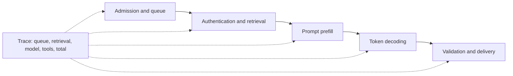

# Serving, LLMOps, MLOps, and Observability

Explain how a model-backed system meets its quality, latency, availability, and cost constraints after deployment.

**Evidence:** [S9](98-sources.md#s9) reports traffic spikes, queuing, scaling, and degradation; [S1](98-sources.md#s1) reports inference optimisation; [S8](98-sources.md#s8) attributes batching design to candidate reports. Specific capacities and incidents below are practice inputs.

## Request latency has several owners



## OPS01 · Traffic jumps tenfold. What do you do first?

**Evidence: reported theme → scenario, [S9](98-sources.md#s9).**

**Answer.** Protect capacity before chasing perfect throughput. Inspect queue age, active requests, provider quotas, database connections, GPU memory, and dependency latency. Bound admission per tenant and globally, shed excess work explicitly, and cancel abandoned requests. Prioritise critical tasks and use predefined degradation such as shorter outputs or a lower-cost path whose quality has been evaluated.

```python
# Capacity planning example, not a queue implementation.
arrival_rate_per_second = 20
mean_seconds_in_system = 3
mean_in_flight = arrival_rate_per_second * mean_seconds_in_system
assert mean_in_flight == 60
```

Little's law relates long-run averages in a stable system. It does not tell you the p95 concurrency or guarantee that 60 workers will meet a tail-latency target. Load-test burstiness and service-time distributions.

**Cross-questions:** **Just autoscale web workers?** They may increase pressure on the same constrained model or database. **Unlimited queue?** It hides overload as unacceptable waiting time and memory growth. **Retry rejected requests instantly?** That amplifies overload; supply retry guidance and a bounded client policy.

## OPS02 · Design inference batching for a single GPU

**Evidence: publisher-attributed reported task, [S8](98-sources.md#s8).**

**Answer.** Clarify maximum tokens, batch compatibility, latency targets, and memory. Collect compatible requests until a size/token limit or maximum waiting time is reached. Batch by token budget as well as request count; 100 long prompts and 100 short prompts have very different costs. For autoregressive generation, continuous batching admits/removes sequences as they progress.

```python
# Standalone token-budget packing example with a fixed arrival order.
def first_batch(lengths, token_budget):
    if token_budget <= 0:
        raise ValueError("budget must be positive")
    batch, used = [], 0
    for index, length in enumerate(lengths):
        if length <= 0:
            raise ValueError("length must be positive")
        if length > token_budget:
            if batch:
                break  # Return ready work; reject the oversized head next time.
            raise ValueError("single request exceeds budget")
        if used + length > token_budget:
            break
        batch.append(index)
        used += length
    return batch

assert first_batch([100, 200, 800], 500) == [0, 1]
try:
    first_batch([800], 500)
except ValueError:
    pass
else:
    raise AssertionError("oversized head request must be rejected")
```

This reference is not a production scheduler: padding, output reservations, deadlines, fairness, and cancellation need extra policy.

**Cross-questions:** **Batch size or throughput first?** Maximise useful throughput subject to latency and quality constraints. **Short jobs starve long jobs?** Add aging or explicit classes and monitor fairness. **What if a member fails?** Preserve per-request outcomes and avoid losing the whole batch unnecessarily.

## OPS03 · TTFT, inter-token latency, and total latency

**Evidence: reported optimisation theme → practice question, [S1](98-sources.md#s1).**

**Answer.** Time to first token includes queueing and prefill before the first streamed token. Inter-token latency describes subsequent token delivery. End-to-end latency includes full completion and any validation. Streaming improves perceived responsiveness but does not automatically reduce total compute.

```python
# Synthetic timestamps in seconds from request admission.
tokens_at = [0.8, 0.85, 0.90, 1.00]
ttft = tokens_at[0]
intervals = [b-a for a, b in zip(tokens_at, tokens_at[1:])]
assert round(ttft, 2) == 0.8
assert round(max(intervals), 2) == 0.1
```

**Cross-questions:** **Can you add p95s of each stage to obtain total p95?** Generally no; quantiles of sums depend on joint distributions. Trace whole requests. **Fast first token but slow answers?** Inspect decode rate, output length, downstream buffering, and tool loops. **What about client timing?** Server metrics exclude some network and rendering delays; measure both perspectives.

## OPS04 · Reduce cost without silently reducing usefulness

**Evidence: practice extension.**

**Answer.** Attribute spend to request type, model, tokens, retries, tool calls, retrieval, and evaluators. Optimise the biggest component: shorter unnecessary context, bounded outputs, caching, model routing, fewer redundant calls, and batching where latency allows. Evaluate each change against task success and critical slices.

```python
# Hypothetical rates only: dollars per million tokens, not provider prices.
in_tokens, out_tokens = 6000, 600
in_rate, out_rate = 2.0, 8.0
cost = (in_tokens * in_rate + out_tokens * out_rate) / 1_000_000
assert round(cost, 4) == 0.0168
```

Cost per successful task includes retries and failed tasks. A model costing half as much per call can be more expensive if it needs four attempts.

**Cross-questions:** **What makes routing safe?** A measured routing policy, fallbacks, and subgroup evaluation. **Can output length be capped?** Yes, but detect truncation and incomplete structured output. **Use current pricing in an interview?** State assumed rates and units; verify provider-specific prices when making a real purchase decision.

## OPS05 · Exact, semantic, prefix, and retrieval caches

**Evidence: practice extension.**

| Cache | Reuses | Main correctness risk |
| --- | --- | --- |
| Exact response | Same request/configuration result | Missing identity or version in key |
| Semantic response | Similar question's answer | Similar text with different meaning/permissions |
| Prefix/KV | Repeated model input prefix computations | Provider/runtime-specific applicability |
| Retrieval | Candidate/evidence results | Stale corpus or ACL state |

**Answer.** Define cache equivalence before implementation. Include tenant/access scope, relevant user state, corpus revision, model/prompt/tool versions, locale, and freshness policy. Semantic reuse needs additional compatibility checks; negation, amounts, and account-specific facts are dangerous near-matches.

```python
import hashlib
import json

request = {"tenant": "A", "acl_revision": 7, "corpus": "v3",
           "prompt": "p2", "question": "Refund window?"}
key = hashlib.sha256(json.dumps(request, sort_keys=True).encode()).hexdigest()
assert len(key) == 64
```

**Cross-questions:** **Hashing removes sensitivity?** It is not automatically anonymisation, especially for predictable inputs. **How test eviction?** Change document or permission revision and verify reuse is prevented. **Cache an action?** Cache/read the operation result with idempotency semantics; do not skip required authorisation.

## OPS06 · Version and reproduce an AI deployment

**Evidence: practice extension.**

**Answer.** A model version alone is incomplete. Record code, container, dependencies, model/revision, tokenizer/template, prompt, tools/schemas, feature/embedding transforms, index snapshot, policy, and evaluation artefacts. Use immutable identifiers and a release manifest that resolves to actual artefacts.

```json
{
  "release": "candidate-17",
  "code_commit": "example-commit-id",
  "model_revision": "example-model-revision",
  "prompt_sha256": "example-hash",
  "corpus_snapshot": "corpus-2026-09-26",
  "tool_schema": "v4",
  "eval_run": "run-317",
  "rollback_release": "candidate-16"
}
```

Values above illustrate a schema; replace them with real resolved identifiers in a deployment.

**Cross-questions:** **What if a provider alias changes weights?** Prefer a fixed revision when offered; detect behavioural changes with sentinel evaluations and record response metadata. **What else must rollback?** Incompatible schemas/indexes/prompts can make a model-only rollback ineffective. **Pickle a model?** Only load trusted artefacts; executable serialisation formats can execute code.

## OPS07 · Shadow, canary, A/B, and blue-green deployments

**Evidence: practice extension.**

| Method | What happens | Key limit |
| --- | --- | --- |
| Shadow | Candidate observes/copies traffic without user-visible effect | Must suppress writes and protect data |
| Canary | Small traffic share receives candidate | Needs representative traffic and fast rollback |
| A/B | Randomised comparison for outcome estimation | Experiment design and sample size matter |
| Blue-green | Two environments, switch routing | Data/schema compatibility and warmup |

**Answer.** Choose the method for the decision. Shadow catches operational issues and lets you compare outputs, but cannot fully measure user behaviour. Canary limits blast radius. A/B tests estimate user-outcome effects. Blue-green simplifies environment switching but does not establish model quality.

```python
# Stable toy bucketing; production assignment needs a documented key/salt policy.
import hashlib
bucket = int(hashlib.sha256(b"experiment-1:user-42").hexdigest(), 16) % 100
variant = "candidate" if bucket < 5 else "baseline"
assert variant in {"candidate", "baseline"}
```

**Cross-questions:** **Can shadow execute a refund?** No; use a read-only/simulated action path. **Rollback on what?** Critical effects, error rate, task success, latency, and cost thresholds with explicit owners.

## OPS08 · Design observability without logging everything

**Evidence: reported tracing theme, [S9](98-sources.md#s9).**

**Answer.** Trace request → retrieval → model → tools → validation. Record durations, status, token/cost counts, model/prompt/index versions, and redacted identifiers. Distinguish application failures from model-quality failures. Sample and redact content based on purpose and access policy; avoid treating raw prompts as harmless logs.

```python
trace = {"request_id": "req-17", "stage": "retrieval", "duration_ms": 45,
         "status": "ok", "index_revision": "v8", "result_count": 4}
assert "raw_customer_text" not in trace
assert trace["duration_ms"] >= 0
```

**Cross-questions:** **What alerts page someone?** User-impacting SLOs or critical security effects; diagnostic drift metrics may open investigation instead. **A judge score drops overnight?** Check candidate behaviour, corpus changes, traffic mix, and evaluator/model changes. **How reproduce?** Link a trace to immutable inputs or safely retained/reconstructed fixtures and versions.

## OPS09 · Self-host or call a managed model API?

**Evidence: practice extension.**

**Answer.** Compare total cost, capability, latency, data constraints, scaling, hardware utilisation, operations, and vendor dependence. Self-hosting gives control but requires model serving, patching, GPU capacity, evaluation, and incident response. Managed APIs simplify some operations but impose quotas, availability dependencies, retention settings, and changing contracts.

```python
# Illustrative break-even arithmetic; include utilisation and staffing separately.
monthly_hosting_cost = 6000
api_cost_per_request = 0.02
break_even_requests = monthly_hosting_cost / api_cost_per_request
assert break_even_requests == 300000
```

This excludes many real costs and quality differences; it is a starting calculation, not a procurement recommendation.

**Cross-questions:** **What about idle GPUs?** Utilisation dominates economics for variable traffic. **One vendor fallback enough?** Test semantic/API differences, rate limits, and correlated outages. **Are local models private automatically?** Network, logs, connectors, and deployment permissions still determine data exposure.

## OPS10 · Train, serve, monitor, and retrain a conventional ML model

**Evidence: reported ML system-design theme, [S1](98-sources.md#s1).**

**Answer.** Use a versioned data snapshot and feature pipeline, a reproducible training job, validation gates, a registry, a deployment manifest, and serving/quality monitoring. Separate batch scoring from online prediction when latency permits. Promote a candidate only after testing the features and serving package, not merely a notebook's model score.

```python
# Promotion policy with independently supplied validation measurements.
candidate = {"auc": 0.89, "p95_ms": 24, "feature_contract_ok": True}
promote = (candidate["auc"] >= 0.88 and candidate["p95_ms"] <= 30
           and candidate["feature_contract_ok"])
assert promote
```

Thresholds are hypothetical exercise requirements. A real gate also handles uncertainty, slices, calibration, and complete evidence.

**Cross-questions:** **Feature store or ordinary tables?** A feature store helps reuse and online/offline consistency but introduces cost; point-in-time correctness remains essential. **Scheduled or drift-triggered retraining?** Either needs fresh labels, validated data, and controlled promotion. **Can feedback create bias?** Yes; model decisions affect which outcomes get observed.

## OPS11 · Queue depth is stable but users wait too long

**Practice extension.** Queue length alone misses aging and workload variation. Measure oldest-item age, wait-time distribution, service time, and task class. A few very long jobs can produce unacceptable delays without an enormous queue.

```python
now = 100
queued_at = [10, 95, 98]
oldest_age = max(now-t for t in queued_at)
assert oldest_age == 90
```

**Cross-question:** **Add workers?** Only if the downstream resource has capacity. **Better policy?** Deadline-aware admission, separate interactive/batch classes, bounded queues, and explicit rejection/deferment.

## OPS12 · Requests per minute fit, but token quota is exhausted

**Practice extension.** Rate limits can apply to requests, input/output tokens, concurrency, or account/model scopes. Reserve estimated tokens and reconcile actual usage, with an explicit policy for underestimated outputs.

```python
requests = 10
input_tokens_each, output_tokens_each = 6000, 1000
estimated_tokens = requests*(input_tokens_each+output_tokens_each)
assert estimated_tokens == 70000
```

**Cross-question:** **A semaphore solves it?** It limits simultaneous work, not cumulative token rate. **How test?** Mix short and long requests, retries, and multiple tenants sharing one provider quota.

## OPS13 · Retry amplification overwhelms a recovering provider

**Practice extension.** Use bounded retries with jitter, shared admission, and circuit breaking. A circuit breaker stops repeatedly calling a failing dependency and probes recovery under a defined policy; it does not improve answer quality.

```python
consecutive_failures, open_after = 5, 3
circuit_open = consecutive_failures >= open_after
assert circuit_open
```

**Cross-question:** **Retry every 500 error?** Some failures are persistent/configuration-related; classify them and respect the remaining deadline. **Recovery test?** Verify half-open probes do not release a synchronized flood of queued requests.

## OPS14 · A slow client keeps expensive generation alive

**Practice extension.** Handle disconnects, output backpressure, and cancellation across application and provider boundaries. Bound buffered output and define whether a disconnected long-running job continues or stops.

```python
client_connected = False
job_policy = "cancel_on_disconnect"
should_cancel = not client_connected and job_policy == "cancel_on_disconnect"
assert should_cancel
```

**Cross-question:** **Cancelling the local task stops billing?** Not necessarily; inspect provider/runtime semantics and measure. **Test?** Disconnect before first token, mid-stream, during a tool call, and after an action commit.

## OPS15 · GPU OOM appears only at high concurrency

**Practice extension.** Account for weights, per-sequence KV cache, activations/workspace, and allocator overhead. Limit active tokens/sequences rather than only web requests. Long outputs can grow cache after admission.

```python
weight_gib, cache_per_request_gib, requests, overhead_gib = 12, 0.5, 20, 3
total = weight_gib + cache_per_request_gib*requests + overhead_gib
assert total == 25
```

**Cross-question:** **Quantise weights only?** It may help but leaves cache/workspace costs. **Test?** Long-context, long-output, mixed-length, and cancelled sequences under sustained load, checking memory reclamation.

## OPS16 · Prefill and decode have different bottlenecks

**Practice extension.** Prefill processes the prompt; decode generates incrementally using cache. Long prompts can delay other users' first tokens, while long outputs occupy serving slots. Scheduling and hardware utilisation differ across phases.

```python
prompt_tokens, generated_tokens = 8000, 200
assert prompt_tokens > generated_tokens
```

**Cross-question:** **One throughput number enough?** Report prompt/output token throughput and user latency under the workload. **Possible optimisation?** Chunked prefill, batching, prefix reuse, or routing, only after measuring the actual runtime's trade-offs.

## OPS17 · Autoscaling reacts after the latency incident

**Practice extension.** GPU/container startup, model loading, and warmup create delay. Scale on leading indicators such as admitted workload and queue age, retain appropriate warm capacity, and bound admission during startup.

```python
startup_seconds, burst_duration_seconds = 90, 30
assert startup_seconds > burst_duration_seconds
```

**Cross-question:** **Scale to zero?** It can save idle cost but introduces cold-start latency; choose according to the product contract. **Test?** Cold starts, rolling restarts, quota-limited capacity, and traffic bursts shorter than the scale-up time.

## OPS18 · A rolling deployment doubles GPU memory

**Practice extension.** Old and new workers may coexist while loading separate model copies. Budget rollout overlap and control surge/unavailable replicas. Readiness must reflect model availability, not only that the HTTP process started.

```python
model_gib, old_workers, new_workers = 12, 1, 1
rollout_memory = model_gib*(old_workers+new_workers)
assert rollout_memory == 24
```

**Cross-question:** **Kill the old model first?** That may cause downtime; choose a rollout strategy matching capacity/SLO. **What readiness probe?** A bounded local inference/health contract with loaded artefact checks, avoiding expensive full external calls on every probe.

## OPS19 · Liveness and readiness checks differ

**Practice extension.** Liveness asks whether the process should be restarted; readiness asks whether it should receive traffic. A temporary downstream outage should not automatically trigger endless restarts that worsen recovery.

```python
health = {"process_responsive": True, "model_loaded": False}
live = health["process_responsive"]
ready = live and health["model_loaded"]
assert live and not ready
```

**Cross-question:** **Deep dependency checks in liveness?** They can cause restart storms. **Test?** Slow startup, model-load failure, transient provider outage, and a genuinely stuck process.

## OPS20 · A model alias changes behaviour without a code deploy

**Practice extension.** Record model response metadata and prefer immutable revisions when supported. Run sentinel/representative evaluations and monitor behavioural changes independently of application deploys.

```python
release = {"configured_alias": "model-current", "observed_revision": "r17"}
new_observation = "r18"
assert release["observed_revision"] != new_observation
```

**Cross-question:** **Pinning guarantees no change?** Check the provider contract and surrounding runtime/tooling too. **Response?** Evaluate the new behaviour, update the manifest, and use a validated fallback or rollback route where available.

## OPS21 · Prompt changes need deployment discipline

**Practice extension.** Treat prompts, examples, templates, and tool descriptions as versioned code-like artefacts. Review diffs, run relevant evaluations, and retain rollback. A one-line instruction can change tool policy or refusal behaviour.

```python
import hashlib
prompt = "Answer using the supplied evidence."
version = hashlib.sha256(prompt.encode()).hexdigest()
assert len(version) == 64
```

**Cross-question:** **Store only the hash?** Keep the actual authorised artefact as well; the hash identifies it. **What tests?** Task quality, critical instructions, ambiguous inputs, tool use, and regression cases affected by the changed wording.

## OPS22 · Trace IDs disappear across asynchronous jobs

**Practice extension.** Propagate correlation and parent identifiers explicitly through queues and tool calls. Separate a user request ID, logical task ID, attempt ID, and provider call ID so retries remain distinguishable.

```python
job = {"request_id": "r1", "task_id": "t1", "attempt_id": "a2"}
assert len(set(job.values())) == 3
```

**Cross-question:** **Use one ID everywhere?** It can obscure fan-out and retries. **How test?** Follow one synthetic task through admission, queue, worker, provider, grader, and final report, including a retried attempt.

## OPS23 · High-cardinality metrics overload monitoring

**Practice extension.** Labels such as raw user ID, prompt text, or request ID create huge time-series counts and may expose sensitive data. Keep aggregate metrics low-cardinality and use traces/logs for per-request diagnosis.

```python
metric_labels = {"model": "m1", "stage": "retrieval", "status": "ok"}
assert "request_id" not in metric_labels
```

**Cross-question:** **Need per-tenant cost?** Use a controlled accounting/reporting system or bounded labels, according to scale/privacy needs. **Test?** Estimate series growth from label combinations and inspect logging/metric exports for unexpected identifiers.

## OPS24 · Average latency hides a painful tail

**Practice extension.** Report distributions and timeout/rejection rates. Long-tail requests may correlate with specific tenants, languages, prompt lengths, or tools. Trace representative slow cases rather than optimising the average blindly.

```python
latencies = [100]*99 + [10000]
mean = sum(latencies)/len(latencies)
assert mean == 199 and max(latencies) == 10000
```

**Cross-question:** **p99 from 100 requests reliable?** It is noisy; collect enough representative data and report the measurement conditions. **Do retries count?** Include end-user elapsed time and the additional attempt cost.

## OPS25 · A database connection pool becomes the bottleneck

**Practice extension.** More async tasks do not create more database capacity. Bound pool usage, avoid holding connections during model calls, batch appropriate reads, and inspect query plans and lock waits.

```python
workers, pool_size = 50, 10
assert workers > pool_size
```

**Cross-question:** **Increase pool size indefinitely?** It can overload the database. **Test?** Concurrent long queries, transaction contention, cancellation, leaked connections, and recovery after a dependency outage.

## OPS26 · A feature pipeline changes column order

**Practice extension.** Arrays lose column names, so a model can accept valid shapes and predict from the wrong features. Version and enforce ordered schemas at serving boundaries.

```python
expected = ["age", "balance"]
received = ["balance", "age"]
assert expected != received
```

**Cross-question:** **Same values, different order?** That changes meaning for position-based estimators. **Fix?** Validate names and reorder explicitly, then compare offline/online predictions on known fixtures. Include missing/extra columns and dtype changes.

## OPS27 · Delayed labels make production quality look worse

**Practice extension.** Only some outcomes have matured. Counting unfinished cases as negative biases metrics. Define label observation windows and compare cohorts with equal maturity.

```python
cases = [{"age_days": 2, "label": None}, {"age_days": 30, "label": 1}]
mature = [c for c in cases if c["age_days"] >= 14]
assert len(mature) == 1
```

**Cross-question:** **No monitoring until labels arrive?** Use data/operational proxies and review samples, then reconcile with mature labels. **Retrain on partial labels?** Account for selection/censoring rather than silently treating missing labels as negatives.

## OPS28 · Retraining repeatedly promotes a worse model

**Practice extension.** Automated training is not automated permission to deploy. Validate data, compare a fixed champion and candidate on appropriate holdouts, inspect slices/calibration, and preserve rollback.

```python
candidate = {"quality_delta": -0.03, "data_valid": True}
can_promote = candidate["data_valid"] and candidate["quality_delta"] >= -0.01
assert not can_promote
```

Thresholds are exercise choices. **Cross-question:** **Drift alert requires immediate retraining?** Investigate whether the cause is data corruption, calibration, threshold, or concept change. **What artefact?** A promotion report linking all evidence and versions.

## OPS29 · Model artefact provenance and supply-chain checks

**Practice extension.** Load trusted, verified artefacts with recorded origin, digest, format, and compatibility. Some serialisation formats execute code. Restrict write access to registries and separate training from production deployment authority.

```python
import hashlib
payload = b"synthetic-model-artefact"
expected = hashlib.sha256(payload).hexdigest()
assert hashlib.sha256(payload).hexdigest() == expected
```

**Cross-question:** **Hash proves trust?** It proves equality to a trusted expected digest; it does not establish who supplied that digest. **Test?** Tampered artefacts, wrong versions, unsupported formats, and failed signature/digest validation.

## OPS30 · Multi-region serving and data residency

**Practice extension.** Define where requests, source text, logs, caches, and evaluation artefacts may be processed/stored. Region routing must apply to all dependencies, including fallback providers and tracing systems.

```python
request_region = "region-a"
allowed_regions = {"region-a"}
fallback_region = "region-b"
assert fallback_region not in allowed_regions
```

**Cross-question:** **Fail over anywhere for availability?** Only within the actual data-processing contract. **How test?** Regional outage, misrouted cache/log storage, and fallback selection using synthetic data and explicit policy fixtures.

## OPS31 · A cache stampede floods the embedding service

**Practice extension.** Many callers miss the same key simultaneously. Use single-flight/coalescing, bounded refresh, and stale-serving only when permitted. Key the shared work correctly so one tenant cannot reuse another's private result.

```python
requests = ["same-key"]*100
unique_work = set(requests)
assert len(unique_work) == 1
```

**Cross-question:** **A lock is enough?** Handle lock-holder failure, deadlines, and result/error propagation. **Test?** Simultaneous misses, refresh failure, expired permissions, and cancellation of the initiating caller.

## OPS32 · Background evaluation competes with interactive traffic

**Practice extension.** Separate resource classes or assign quotas/priorities. Batch jobs should not consume all provider tokens, database connections, or GPUs needed by users. Allow pausing/resuming evaluations with complete accounting.

```python
total_capacity = 100
reserved_interactive = 70
batch_limit = total_capacity-reserved_interactive
assert batch_limit == 30
```

**Cross-question:** **Unused interactive capacity wasted?** Permit controlled borrowing with preemption/admission rules if the platform supports it. **What metrics?** Per-class queue age, throughput, errors, and user SLO impact.

## OPS33 · Graceful shutdown loses in-flight results

**Practice extension.** Stop admission, drain or checkpoint work within a deadline, persist completed outputs, and release leases appropriately. Do not terminate immediately after a worker reports a result but before it is committed.

```python
worker = {"accepting": False, "in_flight": 2, "committed": 0}
can_exit = worker["in_flight"] == 0
assert not can_exit
```

**Cross-question:** **Drain forever?** Bound shutdown and make unfinished work resumable/idempotent. **Test?** Termination during provider call, after result generation, during persistence, and during acknowledgement.

## OPS34 · Cost anomalies come from recursive agent calls

**Practice extension.** Attribute usage to the logical task and enforce a cumulative budget across child calls/retries. Per-call limits do not bound total task cost when fan-out is uncontrolled.

```python
branching, depth = 3, 4
calls = sum(branching**level for level in range(depth+1))
assert calls == 121
```

**Cross-question:** **Let each child have the full budget?** That multiplies spend; allocate from a shared parent budget. **Test?** Recursive delegation, repeated failed searches, large tool outputs, and cancellation propagation.

## OPS35 · Compute an error budget from an SLO

**Practice extension.** Define the eligible event and success condition, then calculate permitted bad events over the measurement window. An availability SLO does not capture factual quality unless that is explicitly part of the event definition.

```python
requests, target = 1_000_000, 0.999
allowed_bad = round(requests*(1-target))
assert allowed_bad == 1000
```

**Cross-question:** **Count rejected overload requests?** Define eligibility transparently; excluding inconvenient failures can game the SLO. **What response to burn?** Investigate, reduce risky changes, mitigate, and follow the agreed operational policy.

## OPS36 · Benchmark throughput without misleading comparisons

**Practice extension.** Fix hardware, software, model/revision, precision, prompt/output distributions, arrival pattern, concurrency, and latency constraints. Report warmup and cache conditions. Maximum tokens/second under unlimited latency is not an interactive capacity claim.

```python
benchmark = {"prompt_tokens": 1000, "output_tokens": 200, "concurrency": 16,
             "cache": "cold", "latency_limit_ms": 3000}
assert benchmark["cache"] == "cold"
```

**Cross-question:** **Two models with different tokenisers?** Token throughput may not represent equal user work; include task/request measures. **Quality?** Keep output/task quality constraints while comparing performance.

## OPS37 · An observability pipeline becomes a source of latency

**Practice extension.** Avoid synchronous heavy exports on the request path. Use bounded asynchronous buffers, sampling, and explicit loss/backpressure policies. Critical audit events may require stronger durability than ordinary diagnostic traces.

```python
buffer_limit, queued = 1000, 1000
full = queued >= buffer_limit
assert full
```

**Cross-question:** **Drop every log when full?** Define priorities and counters so loss is visible; some audit requirements need durable handling. **Test?** Collector outage, slow export, oversized payloads, and recovery without exhausting memory.

## OPS38 · Roll back the model but keep an incompatible index

**Practice extension.** Rollback must restore a compatible bundle: model, prompt, embedding/index, tool schemas, and relevant data contracts. Keep dependency compatibility in the release manifest.

```python
release = {"query_embedding": "e1", "index_embedding": "e2"}
assert release["query_embedding"] != release["index_embedding"]
```

**Cross-question:** **Same embedding dimension?** It does not prove vector-space compatibility. **How test rollback?** Exercise it before release, including schema/index pointers, warmup, and representative end-to-end cases.

## OPS39 · Separate quality incidents from infrastructure incidents

**Practice extension.** A service can be available and wrong, or unavailable while the model itself is unchanged. Classify symptoms using traces, data checks, evaluator controls, and recent artefact changes. Route ownership without losing end-to-end accountability.

```python
incident = {"http_error_rate": 0.0, "unsupported_claim_rate": 0.3}
assert incident["http_error_rate"] == 0 and incident["unsupported_claim_rate"] > 0
```

**Cross-question:** **Restart fixes hallucinations?** Usually not unless the cause is corrupted state/configuration. **First evidence?** Reproduce on fixed cases, inspect retrieval/evidence, and compare versions before choosing mitigation.

## OPS40 · Defend an operational trade-off with numbers

**Practice extension.** Present workload assumptions, measured bottleneck, candidate change, quality constraints, cost/latency impact, uncertainty, and rollback. Separate estimates from observed benchmarks.

```python
measurement = {"kind": "hypothetical", "before_ms": 1200, "after_ms": 900}
improvement = (measurement["before_ms"]-measurement["after_ms"])/measurement["before_ms"]
assert improvement == 0.25
```

**Cross-question:** **Can you claim production improvement from this fixture?** No; it demonstrates arithmetic only. **What makes the claim real?** Reproducible workload, recorded runs, comparable configurations, representative traffic, and an end-to-end quality check.

## Summary in simple points

- **OPS01–02:** On a traffic spike, identify the constrained resource and control admission. Batch requests within latency, token and memory budgets.
- **OPS03–04:** Separate time to first token, token pacing and completion latency. Optimise cost per useful completion and re-evaluate any quality trade-off.
- **OPS05–06:** Exact, semantic, prefix and retrieval caches have different correctness rules. Version the complete serving system, including prompts and data.
- **OPS07–08:** Shadow, canary, A/B and blue-green rollouts answer different questions. Trace important stages while controlling sensitive data and telemetry volume.
- **OPS09–10:** Compare managed and hosted inference using real workloads and operating costs. Retraining needs fresh labels, evaluation and rollback criteria.
- **OPS11–12:** Queue age matters even when depth looks stable. Enforce both request and token quotas.
- **OPS13–14:** Coordinate retry budgets to avoid amplifying outages. Stop or reconcile work when clients disconnect or cancel.
- **OPS15–16:** Concurrency and sequence length drive KV-cache memory. Prefill and decoding can have different hardware bottlenecks.
- **OPS17–18:** Account for model-loading delay in autoscaling. Rolling deployment capacity must include temporary duplicate replicas.
- **OPS19–20:** Liveness means the process is functioning; readiness means it can serve. Provider aliases can change behaviour without a code release.
- **OPS21–22:** Treat prompt changes as releases. Propagate trace and job identity across asynchronous boundaries.
- **OPS23–24:** Keep high-cardinality identifiers out of metric labels. Tail latency and timeout rates reveal problems that means hide.
- **OPS25–26:** Measure connection-pool waiting and database pressure. Bind feature names, order and transformations to the model artefact.
- **OPS27–28:** Compare cohorts with mature labels. Retraining should not promote candidates merely because a schedule fired.
- **OPS29–30:** Verify model origin, digest and compatible runtime. Include failover and telemetry paths in regional data constraints.
- **OPS31–32:** Coalesce repeated cache misses and limit refresh work. Isolate background evaluation from interactive quotas and capacity.
- **OPS33–34:** Drain, checkpoint and acknowledge work deliberately at shutdown. Propagate financial budgets across recursive tool and agent calls.
- **OPS35–36:** Define SLOs and compute an error budget over a fixed window. Benchmark with comparable token mixes, concurrency and hardware.
- **OPS37–38:** Bound telemetry queues so logging cannot stall inference. Roll back a compatible bundle of model, index, prompt and schema.
- **OPS39–40:** Separate quality defects from infrastructure faults while tracing their interaction. Defend capacity and cost decisions with measured numbers and assumptions.
