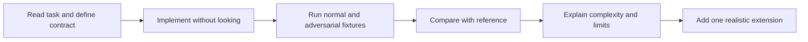
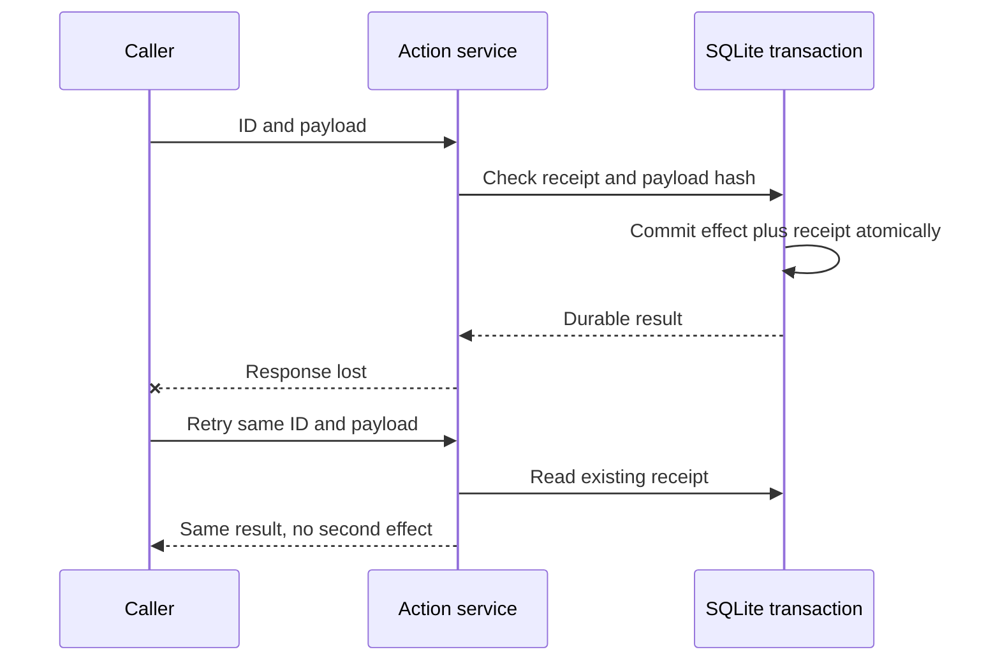

# Runnable Interview Coding Labs

Implement the mechanisms, break them with adversarial fixtures, then explain the limits of your solution.

This workbook supports the **400-question topic banks**. These are original reference implementations for reported task families and practice extensions. They are not claimed to be an employer's expected solution. Each lab includes real code and tests; the small fixtures are synthetic.

## Download and run

[Download all eight labs and tests](/examples/interviews/interview-labs.zip), or open the <a href="/examples/interviews/README.md">README</a>, [tested requirements](/examples/interviews/requirements.txt) and [test suite](/examples/interviews/test_labs.py).

From the extracted directory:

```bash
python3.12 -m venv .venv
source .venv/bin/activate
python -m pip install -r requirements.txt
python -m unittest -v test_labs.py
```

The checked environment is **Python 3.12.8**, NumPy **2.5.3**, pandas **3.0.6**, scikit-learn **1.9.1**, with transitive versions recorded in `requirements.txt`. The eight labs need NumPy and the standard library; pandas/scikit-learn also support the inline chapter examples. The tests run without API keys, a GPU, paid calls or network access. Installation needs access to your package index. On Windows use `.venv\Scripts\activate`.

The suite contains **32 tests**. Passing small fixtures establishes the behaviours tested, not production readiness. The [version notebook](99-tools-versions.md) separates this tested environment from observed framework releases.



## Lab 1 · Retrieval, permissions and ranking metrics {#lab-1}

**Source connection:** live RAG and retrieval debugging appear in [S1 and S6](98-sources.md). **Reference:** [retrieval.py](/examples/interviews/retrieval.py). **Practise:** RAG01–09, RAG17–18, RAG31–34.

**Task, 40 minutes.** Given documents with ID, tenant, text and revision, return authorised current evidence. Implement rank fusion and precision, recall, hit rate, reciprocal rank and graded nDCG. Show a no-evidence path.

```bash
python retrieval.py
python -m unittest -v test_labs.RetrievalTests
```

The demo returns the `refund` document for tenant `acme`, excludes the other tenant, and calculates recall and precision of `2/3` with reciprocal rank `0.5` for the example ranking. Precision divides by requested k; missing slots reduce precision. Recall/nDCG are undefined when no relevant judgments exist and are returned as `None`.

**Why this implementation?** Token overlap exposes identity, filtering and accounting without hiding them behind an SDK. The result is explicitly `evidence_only`. It does not claim to implement BM25, dense embeddings, a reranker or generated answers. Lexical overlap is not proof that a question can be answered.

**Cross-examination:** Why filter before scoring? It prevents unauthorised candidates from entering downstream paths. Why deduplicate per ranking before RRF? Duplicate IDs should not create extra votes. Why latest revision? Otherwise deleted or superseded claims can compete with current evidence; a production manifest also needs tombstones and coherent activation.

**Live-generation extension:** Define a provider adapter accepting a question, authorised evidence records and an output schema of answer, claim citations and abstention reason. Pin its model and SDK, construct context within the actual tokenizer budget, and validate citations and factual support separately. Run paid calls only in your own authorised environment. The supplied tests use no live provider and therefore do not establish generated-answer quality.

**Next test:** Revoke access after retrieval but before citation rendering. A second authorisation check should stop disclosure.

## Lab 2 · Projected attention and causal masking {#lab-2}

**Source connection:** single-head to multi-head implementation in [S1](98-sources.md#s1). **Reference:** [attention.py](/examples/interviews/attention.py). **Practise:** DL01, DL13–16, DL30.

**Task, 45 minutes.** Accept `x` shaped `(batch, time, width)` and four projection matrices. Project Q/K/V, split heads, apply scaled dot-product attention, merge heads and project output. Support causal and padding masks.

```bash
python attention.py
python -m unittest -v test_labs.AttentionTests
```

Expected demo shapes are output `(1, 3, 8)` and weights `(1, 2, 3, 3)`. Tests compare single- and multi-head outputs against independently expressed references. Changing future tokens must leave earlier outputs unchanged. Fully masked rows must remain finite and produce zero output.

**Mechanism:** Q/K/V change representations before partitioning heads. Dividing logits by the square root of head width limits scale growth. Subtracting each row maximum stabilises softmax. Invalid keys get zero probability; invalid query rows get zero outputs. A fully masked row needs explicit handling to avoid `-inf - -inf` producing NaN.

**Cross-examination:** Why not only reshape X? That omits learned projections. Why is output projection needed? It mixes concatenated head outputs. Does this implement FlashAttention? No; it materialises the quadratic attention matrix and is a correctness reference.

**Next test:** Add cache positions and compare token-by-token cached decoding with full-sequence decoding. Bias, rotary positions, dropout, gradients and optimised GPU execution are outside this reference.

## Lab 3 · Bounded asynchronous evaluation workers {#lab-3}

**Source connection:** async coding in [S1](98-sources.md#s1), evaluation scale in [S5](98-sources.md#s5). **Reference:** [async_workers.py](/examples/interviews/async_workers.py). **Practise:** PY01, PY09–12, EV08, OPS12–14.

**Task, 35 minutes.** Consume a case iterator, cap queued and active work, preserve case IDs, handle per-case timeouts/errors, and propagate cancellation.

```bash
python async_workers.py
python -m unittest -v test_labs.AsyncTests
```

The demo reports three `ok` cases and one `error`; errors do not become numeric quality scores. Tests observe a maximum of three simultaneous operations, full case accounting, timeout status and worker cleanup on cancellation. Duplicate IDs fail the job.

**Mechanism:** A bounded `asyncio.Queue` blocks the producer when workers fall behind. `TaskGroup` owns worker lifetimes. Each operation has a timeout, and cancellation is re-raised. `task_done()` runs in `finally`. The result list and identity set are still O(number of cases); a large service should persist them incrementally.

**Cross-examination:** Does a semaphore bound memory if you create a million tasks? No. Does a timeout stop blocking CPU code? No; move that work outside the event loop. Is concurrency the same as a token quota? No; add a shared rate/token limiter and retry budget.

**Next test:** Simulate quota rejection with a fake clock and verify that retries cannot exceed the job deadline.

## Lab 4 · Durable action receipts and crash boundaries {#lab-4}

**Reference:** [safe_action.py](/examples/interviews/safe_action.py). **Practise:** PY02, AG04, AG14, AG32–34, QA12. This is a practice extension for production agent reliability.

**Task, 35 minutes.** Commit a simulated local action once per ID, reject a changed payload under the same ID, and return the same receipt after a lost response and restart.

```bash
python safe_action.py
python -m unittest -v test_labs.ActionTests
```

The demo simulates a crash after commit, retries `refund-1`, returns `committed`, and prints `effects 1`. The tests also crash before commit and reopen a file-backed database before retry.



**Mechanism:** A unique key and payload digest bind identity to semantics. `BEGIN IMMEDIATE` serialises writers for this SQLite boundary. The effect and receipt share one transaction, so a pre-commit exception rolls both back.

**Cross-examination:** Does this guarantee exactly-once payment through a remote API? No; the remote effect does not share this transaction. Use the provider's idempotency contract and reconcile uncertain results. Does cancelling the caller undo a committed action? No. Are exception injection and abrupt process termination identical? No; process-kill, contention and storage-failure tests are further work.

**Next test:** Add an authorised principal and policy revision to action identity, then reject replay after permission revocation.

## Lab 5 · Point-in-time features in executable SQL {#lab-5}

**Reference:** [feature_join.py](/examples/interviews/feature_join.py). **Practise:** PY04, PY19–24, ML01, SYS24.

**Task, 30 minutes.** Create SQLite tables and retrieve the latest feature that both occurred and became available at or before each prediction. Preserve rows with no known feature and resolve ties deterministically.

```bash
python feature_join.py
python -m unittest -v test_labs.FeatureTests
```

The demo chooses feature value `4.0` for `p1`. It excludes the tempting `999.0` feature because it arrived too late. Prediction `p2` remains present with a missing feature.

**Mechanism:** Both time predicates belong in the join condition so the left join keeps missing predictions. `ROW_NUMBER` ranks eligible versions by event time, availability time and unique feature ID. Integer timestamps represent UTC epoch seconds, with units fixed by contract.

**Cross-examination:** Why is event time alone insufficient? A backfilled historical event was unknown to the live predictor. Why not fill missing values before splitting? Fit learned imputations on training data. What about retroactive corrections? Define effective-time and system-time history explicitly rather than overwriting the old value.

**Next test:** Add a feature freshness limit without dropping predictions that have no fresh value.

## Lab 6 · Dependency scheduling and cycles {#lab-6}

**Source connection:** topological sorting in [S3](98-sources.md#s3). **Reference:** [graph.py](/examples/interviews/graph.py). **Practise:** PY06, AG12, SYS15.

**Task, 25 minutes.** Return a deterministic valid ordering for declared nodes and prerequisite edges. Handle duplicate edges, disconnected nodes and cycles.

```bash
python graph.py
python -m unittest -v test_labs.GraphTests
```

The demo returns `audit, parse, embed, index`. `audit` is independent; `parse` still precedes `embed`, which precedes `index`. The tests reject self-cycles, longer cycles and undeclared endpoints.

**Mechanism:** Kahn's algorithm repeatedly removes a zero-indegree node. A heap chooses a deterministic lexicographic next node. Deduplicating edges avoids inflating indegree. If fewer than all nodes are removed, a cycle remains. A FIFO implementation can run in O(V+E); the heap and sorted adjacency add ordering overhead.

**Cross-examination:** Can you use this for an agent that intentionally loops? A DAG ordering cannot represent an execution loop. Use an explicit state machine with termination budgets. Does a topological order maximise parallelism? It establishes dependency legality; a resource-aware scheduler still decides which ready nodes to run.

**Next test:** Associate memory requirements with nodes and enforce a shared execution budget.

## Lab 7 · Stable gradients and a convolution reference {#lab-7}

**Source connection:** loss derivations and convolution implementation in [S1](98-sources.md#s1). **Reference:** [numerical.py](/examples/interviews/numerical.py). **Practise:** ML03, ML13–14, DL11, DL17, DL39.

**Task, 45 minutes.** Implement stable binary logistic loss and gradient, verify with central finite differences, then implement a small NCHW convolution reference.

```bash
python numerical.py
python -m unittest -v test_labs.NumericalTests
```

The logistic gradient matches finite differences within `1e-8`. Extreme logits of magnitude 1000 stay finite. The convolution tests use an asymmetric kernel to detect accidental flipping, then compare multi-channel stride/padding results with an `einsum`/sliding-window reference.

**Mechanism:** `logaddexp(0, z) - y*z` avoids direct exponential overflow in binary cross-entropy. Central differences perturb each parameter in both directions. The convolution operation is the cross-correlation convention commonly used by deep-learning libraries: it multiplies a patch by the kernel without reversing it.

**Cross-examination:** Why not use an arbitrarily tiny finite-difference step? Cancellation and floating-point error can dominate. Why is a symmetric kernel a weak test? Flipping it gives the same result. Is this convolution optimised? No; the loops prioritise inspectable correctness.

**Next test:** Add dilation and grouped convolution, then compare shapes and values against a pinned framework on small inputs.

## Lab 8 · Evaluation gates that cannot hide missing cases {#lab-8}

**Source connection:** scalable comparative evaluation in [S5](98-sources.md#s5), QA gates in [S4](98-sources.md#s4). **Reference:** [eval_gate.py](/examples/interviews/eval_gate.py). **Practise:** EV06, EV10, EV13–17, EV33–39, QA16.

**Task, 40 minutes.** Compare baseline and candidate on exactly the expected IDs. Reject missing, duplicate, nonfinite and out-of-range scores. Gate critical candidate failures independently of quality. Compute a paired bootstrap confidence interval.

```bash
python eval_gate.py
python -m unittest -v test_labs.GateTests
```

The demo produces `pass` for a uniform synthetic improvement and `incomplete` when a case is missing. Tests cover clear regression, an inconclusive result, NaN, wrong IDs, timeout status, duplicate IDs, critical failure and an empty run.

**Mechanism:** Align scores by case identity before subtraction. Resample paired deltas, not two unrelated score arrays. A candidate is non-inferior when the lower confidence bound stays above the prespecified negative margin. An interval crossing the boundary is inconclusive, not evidence of equivalence. Synthetic uniform deltas are a mechanics demonstration and do not estimate realistic variation.

**Cross-examination:** What if several cases belong to one user? Resample users or another independent unit. Is 20 synthetic cases enough for a production gate? No sample size is justified by this demo; plan precision and power for the actual failure rates. Can high mean quality offset an unauthorised action? A critical-failure gate should prevent that.

**Next test:** Add slice-specific constraints, repeated-run uncertainty, a dataset manifest digest and a minimum evidence requirement.

## Summary in simple points

- Implement first, then use the references to inspect your reasoning and edge cases.
- Retrieval needs permissions, identity, revisions and honest no-evidence behaviour.
- Attention needs correct projections, dimensions, stable softmax and masks.
- Async workers must bound both queued and active work and clean up on cancellation.
- Durable retries require action identity and a well-defined atomic boundary.
- Historical feature joins need event time and availability time.
- Topological sorting handles DAG prerequisites and must detect cycles.
- Numerical checks need stable formulas and independent references.
- Evaluation gates must reject incomplete data before comparing quality.
- Run the tests, explain their assumptions, and add a realistic failure case of your own.
