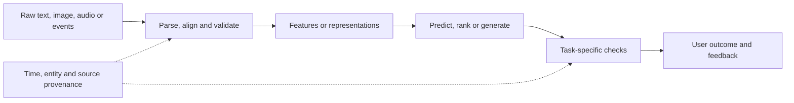

# Ranking, Recommendations, Vision, Speech, and Forecasting

Apply the same data, modelling, evaluation, and deployment discipline when the task extends beyond text generation.

**Evidence:** [S1](24-sources.md#s1) reports computer vision, embeddings, ML coding, and system design; [S2](24-sources.md#s2) reports forecasting; [S3](24-sources.md#s3) reports ranking; [S7](24-sources.md#s7) describes broad multimodal ML interviews. Unless explicitly labelled reported, the following incidents are original practice extensions.

## A shared pipeline across modalities



## APP01 · Design a two-stage recommendation system

**Evidence: practice extension of reported ML design and ranking themes.**

**Answer.** Candidate generation finds a manageable set from a large catalogue using popularity, collaborative signals, content, or approximate vector search. A ranker scores the candidates using user/item/context features. A final policy layer handles availability, duplicates, diversity, and product constraints.

```python
candidates = [{"id": "i1", "score": 0.9, "available": False},
              {"id": "i2", "score": 0.8, "available": True},
              {"id": "i3", "score": 0.7, "available": True}]
ranked = sorted((x for x in candidates if x["available"]),
                key=lambda x: -x["score"])
assert ranked[0]["id"] == "i2"
```

Evaluate candidate recall separately from ranking nDCG and user outcomes. Logged clicks depend on previous ranking exposure, so “unclicked” does not necessarily mean irrelevant.

**Cross-questions:** **New user/item?** Use contextual/content/popularity baselines and update as evidence arrives. **How prevent popularity feedback loops?** Measure coverage and exposure, use carefully designed exploration, and inspect long-term utility. **Can LLMs rank everything?** They may rerank a small set or extract features, but cost/latency and reliability must justify the role.

## APP02 · Train embeddings with contrastive learning

**Evidence: practice extension of reported embedding-system interviews, [S1](24-sources.md#s1).**

**Answer.** Positive pairs represent relationships you want nearby; negatives represent distinctions. A contrastive objective increases relative similarity of positives against competing candidates. Pair quality matters: two near-duplicate support articles should not accidentally be strong negatives if both answer the query.

```python
import numpy as np
scores = np.array([2.0, 1.0, -1.0])  # first item is the labelled positive
logsumexp = scores.max() + np.log(np.exp(scores - scores.max()).sum())
loss = logsumexp - scores[0]
assert loss > 0
```

Hard negatives teach difficult distinctions but mislabeled false negatives damage training. Separate train/test by entities or source families to avoid memorisation.

**Cross-questions:** **Bi-encoder versus cross-encoder?** Bi-encoders allow reusable document embeddings; cross-encoders jointly score pairs but cost more per candidate. **How detect collapse?** Inspect vector variance, pair similarities, and retrieval performance against trivial baselines. **Why temperature?** It changes the concentration of the similarity-based training distribution and gradient emphasis.

## APP03 · Evaluate OCR and document extraction

**Evidence: practice extension of document ingestion and vision themes.**

**Answer.** Evaluate character/word transcription, layout relationships, field extraction, and downstream task outcomes separately. A one-character error in a product code or amount can matter more than several punctuation errors. Preserve page/bounding-box provenance, table headers, units, and reading order.

```python
# Exact field checks are useful even when a general text score looks good.
expected = {"invoice_id": "INV-017", "amount_minor": 12000}
extracted = {"invoice_id": "INV-O17", "amount_minor": 12000}
field_accuracy = sum(extracted[k] == v for k, v in expected.items()) / len(expected)
assert field_accuracy == 0.5
```

**Cross-questions:** **OCR confidence is high; accept the amount?** Calibrate confidence against real errors and apply domain constraints. **What about rotated/scanned documents?** Include resolution, skew, handwriting, language, and layout slices. **How relate to RAG?** Test whether retrieval can find correct table/field evidence and whether the answer preserves numbers and qualifiers.

## APP04 · Object detection or segmentation?

**Evidence: practice extension of reported vision questions, [S1](24-sources.md#s1).**

| Task | Output | Typical metric |
| --- | --- | --- |
| Classification | Label per input | Accuracy, PR, calibration |
| Detection | Boxes plus classes/scores | AP at specified IoU thresholds |
| Semantic segmentation | Class per pixel | IoU/Dice per class |
| Instance segmentation | Separate object masks | Mask AP and instance errors |

**Answer.** Choose the output representation needed by the product. Counting packages may need instances; measuring damaged surface area may need masks. Evaluate small objects, occlusion, camera changes, and empty scenes. Detection AP depends on matching and IoU thresholds; a bare “mAP” value lacks enough context.

```python
intersection_area, union_area = 60, 100
box_iou = intersection_area / union_area
assert box_iou == 0.6
```

**Cross-questions:** **Why nonmaximum suppression?** To reduce overlapping duplicate detections, with a risk of suppressing nearby true objects. **How split data?** Group correlated frames/videos/cameras where necessary. **What if lighting changes?** Diagnose input shift and evaluate augmentation/retraining against the actual deployment distribution.

## APP05 · Forecast tomorrow's temperature across regions

**Evidence: reported scenario, [S2](24-sources.md#s2).**

**Answer.** Fix units, timezone, resolution, horizon, source freshness, and missingness before modelling. Compare persistence/seasonal baselines, external forecast products, and learned models. Train with rolling-origin evaluation and geographic holdouts that match the deployment question. Do not randomly split overlapping windows and call it future forecasting.

```python
# Persistence baseline and MAE on synthetic daily temperatures.
observed = [20.0, 22.0, 21.0, 24.0]
predicted = observed[:-1]
actual = observed[1:]
mae = sum(abs(a-p) for a, p in zip(actual, predicted)) / len(actual)
assert mae == 2.0
```

**Cross-questions:** **Global or regional model?** Compare on regional/horizon slices; shared patterns may help sparse regions, while local adaptation may capture differences. **Millions of rows into an LLM?** Query/aggregate features in a data system and call a predictive tool. **Explain uncertainty?** Return calibrated intervals with units and horizon, and measure coverage on held-out regions/times.

## APP06 · Build a speech assistant with interruption support

**Evidence: practice extension.**

**Answer.** Separate voice activity detection, speech recognition, dialogue/model logic, tool calls, speech generation, and playback. Track turn IDs and cancellation. When the user interrupts, stop or supersede obsolete speech and prevent stale tool responses from being applied to the new turn.

```python
active_turn = 8
incoming = {"turn_id": 7, "transcript": "old request"}
should_apply = incoming["turn_id"] == active_turn
assert not should_apply
```

Evaluate word error rate, entity/number accuracy, end-to-end task success, turn latency, interruption recovery, and accent/noise slices. A transcript can have low word error rate and still invert “do not cancel”.

**Cross-questions:** **Can partial transcripts trigger writes?** Require a policy that prevents unstable partial recognition from executing a consequential action. **Where does latency accumulate?** Endpoint detection, recognition, inference/tools, synthesis, and playback buffering. **Why use transcript confidence cautiously?** It requires calibration and may not capture semantic errors.

## APP07 · An image question fails despite a capable multimodal model

**Evidence: practice extension.**

**Answer.** Inspect image resolution/cropping, orientation, colour conversion, text legibility, and the question's required visual evidence. A chart question may require precise axis/unit extraction; an object question may require small-region detail. Store the transformation chain so QA can reproduce what the model actually saw.

```python
original_size = (4000, 3000)
resized_size = (800, 600)
scale_x = resized_size[0] / original_size[0]
original_box = (1000, 500, 1400, 900)
resized_box = tuple(round(v * scale_x) for v in original_box)
assert resized_box == (200, 100, 280, 180)
```

This example assumes uniform scaling and no crop; actual pipelines must track offsets and both axes.

**Cross-questions:** **Can OCR replace vision?** It may suffice for clean text, but layout, diagrams, or visual relationships can require more. **How test hallucinated objects?** Label absent-object and ambiguous cases, require evidence localisation when appropriate, and test abstention. **Image-based injection?** Treat recognised instructions in images as untrusted content like retrieved text.

## APP08 · Explain diffusion models and when they matter

**Evidence: reported broad multimodal interview theme, [S7](24-sources.md#s7); this is a practice explanation.**

**Answer.** A diffusion model learns to reverse a noising process, often predicting noise or another parameterisation of the denoising target. Sampling repeatedly applies a learned denoising update. Latent diffusion performs much of this process in a compressed representation, reducing cost but adding autoencoder reconstruction limits.

```python
import numpy as np
rng = np.random.default_rng(7)
x = np.array([0.2, -0.4, 0.8])
alpha_bar = 0.7
noise = rng.normal(size=x.shape)
noisy = np.sqrt(alpha_bar) * x + np.sqrt(1-alpha_bar) * noise
assert noisy.shape == x.shape
```

This demonstrates forward noising only, not a trained generator. Evaluate adherence, diversity, artefacts, unwanted memorisation, and task-specific quality; a single embedding similarity score is insufficient.

**Cross-questions:** **Fewer sampling steps?** They can reduce latency with quality trade-offs depending on sampler/model/distillation. **Guidance scale?** It changes the conditioning trade-off and can introduce artefacts; evaluate a range. **Why relevant to an LLM engineer?** Multimodal pipelines may combine document/image generation or understanding with agents and require modality-specific failure analysis.

## APP09 · Cold-start recommendations for a new item

**Practice extension.** Collaborative signals are absent, so use content/metadata, category priors, and controlled exploration. Avoid treating zero interactions as evidence of low quality. Evaluate new-item cohorts separately from established items.

```python
item = {"interaction_count": 0, "category": "hiking", "content_available": True}
use_content_path = item["interaction_count"] == 0 and item["content_available"]
assert use_content_path
```

**Cross-question:** **Cold-start user?** Use session/context and explicit preferences while gathering feedback. **Metric?** Utility, coverage, and time to useful personalisation, with exposure bias considered.

## APP10 · Negative sampling accidentally labels relevant items as bad

**Practice extension.** Unobserved items are not necessarily irrelevant. Sample negatives according to the training objective and exposure assumptions; inspect hard negatives for false labels.

```python
known_positive = {"a", "b"}
candidate_negative = {"b", "c", "d"}
clean = candidate_negative-known_positive
assert clean == {"c", "d"}
```

**Cross-question:** **Remaining items definitely negative?** No, they are only not known positive. **How evaluate?** Use independent relevance judgements or reliable outcomes, and compare sampling strategies on actual ranking utility.

## APP11 · Position bias in click-based ranking labels

**Practice extension.** High-ranked items receive more exposure and clicks even at equal relevance. Log exposure/position and consider appropriate experimentation or propensity correction under justified assumptions.

```python
clicks, impressions = 20, 100
ctr = clicks/impressions
assert ctr == 0.2
```

**Cross-question:** **CTR proves relevance?** It mixes relevance, presentation, position, and user intent. **How test a new ranker?** Offline evaluation plus controlled online outcomes, including long-term satisfaction and harmful feedback loops.

## APP12 · Diversity versus relevance in a recommendation list

**Practice extension.** Repeated near-identical items can reduce user value despite high individual scores. Add a documented diversity constraint or objective and measure its utility effect, not just category count.

```python
items = [("a", "shoes"), ("b", "shoes"), ("c", "jackets")]
selected, categories = [], set()
for item, category in items:
    if category not in categories:
        selected.append(item); categories.add(category)
assert selected == ["a", "c"]
```

**Cross-question:** **Always one per category?** This toy policy can discard useful items; tune against the product's task and user needs. **Test?** Niche interests, short catalogues, and availability constraints.

## APP13 · Matrix factorisation and implicit feedback

**Practice extension.** Learn user/item latent factors whose interaction predicts preference. Implicit events such as views/clicks have confidence and exposure differences; absence is not a clean negative. Compare with popularity and content baselines.

```python
import numpy as np
user = np.array([0.2, 0.8])
item = np.array([0.5, 0.5])
assert np.isclose(user @ item, 0.5)
```

**Cross-question:** **Can it handle new items?** Pure collaborative factors need interactions; hybrid content paths help. **How split?** Respect time and user/item generalisation goals rather than random event leakage.

## APP14 · Contextual bandits for exploration

**Practice extension.** A bandit balances learning about actions with choosing currently promising ones. Define reward, context, constraints, and logging propensities. Exploration in consequential decisions needs an approved bounded policy.

```python
import random
rng = random.Random(7)
epsilon = 0.1
action = rng.choice(["a", "b"]) if rng.random() < epsilon else "a"
assert action in {"a", "b"}
```

**Cross-question:** **Bandit versus full reinforcement learning?** Bandits typically focus on immediate action rewards; sequential state consequences require a broader model. **Evaluation?** Controlled experiments or valid off-policy methods with overlap and reliable propensities.

## APP15 · Off-policy evaluation has huge variance

**Practice extension.** Importance weights grow when the logging policy rarely chose actions favoured by the new policy. Without support/overlap, logs cannot reliably evaluate unseen actions. Clipping reduces variance while introducing bias.

```python
new_probability, logging_probability = 0.5, 0.01
weight = new_probability/logging_probability
assert weight == 50
```

**Cross-question:** **Use the weighted average blindly?** Check propensity validity, support, effective sample size, and uncertainty. **No overlap?** Gather appropriate exploration data or run a controlled experiment rather than claiming an unsupported estimate.

## APP16 · Time-series seasonality versus trend

**Practice extension.** Compare persistence, seasonal naïve, and simple trend models before complex networks. Choose evaluation horizons matching deployment and avoid leakage from future normalisation or overlapping windows.

```python
series = [10, 12, 11, 13, 14, 12, 9, 10]
weekly_naive_next = series[-7]
assert weekly_naive_next == 12
```

**Cross-question:** **One-step accuracy enough for seven-day forecasts?** No, evaluate each horizon and the actual multi-step strategy. **Structural break?** Monitor recent performance and consider shorter windows, external features, or model changes with validation.

## APP17 · Intermittent demand makes MAPE unusable

**Practice extension.** Zero actual values make percentage errors undefined or unstable. Choose metrics compatible with the task, such as MAE, scaled errors with a valid denominator, or inventory cost, and evaluate zero/nonzero periods separately.

```python
actual = [0, 0, 5]
predicted = [1, 0, 4]
mae = sum(abs(a-p) for a,p in zip(actual,predicted))/len(actual)
assert mae == 2/3
```

**Cross-question:** **Add a tiny epsilon to MAPE?** That can create arbitrary huge penalties. **Business metric?** Stockout/holding cost and service level may better represent the decision than a generic forecast score.

## APP18 · Hierarchical forecasts do not add up

**Practice extension.** Store/product forecasts may conflict with regional/global totals. Reconciliation should respect the hierarchy and uncertainty, while avoiding a simple fix that worsens important bottom-level predictions.

```python
stores = {"s1": 10, "s2": 15}
regional_forecast = 30
assert sum(stores.values()) != regional_forecast
```

**Cross-question:** **Always sum bottom-up?** It ensures coherence but may be noisy at sparse leaves. **Evaluation?** Accuracy and decision cost at each level plus coherence, with temporal holdouts.

## APP19 · Spatial leakage in geographic prediction

**Practice extension.** Nearby stations or image tiles can share highly correlated information. Random splits may overstate transfer to unseen regions. Use spatial blocks and time-aware evaluation appropriate to the intended deployment.

```python
train_regions = {"north", "east"}
test_regions = {"south"}
assert train_regions.isdisjoint(test_regions)
```

**Cross-question:** **Region split alone enough?** Weather/time patterns and shared data processing can still leak. **How compare global/local models?** Use the same regional/horizon holdouts and uncertainty coverage, including low-data regions.

## APP20 · Prediction intervals are narrow but under-cover extremes

**Practice extension.** Evaluate empirical coverage and interval width by horizon, region, and outcome range. A useful interval must balance sharpness with calibrated coverage; average coverage can hide failure during extreme events.

```python
actual = [5, 10, 20]
intervals = [(4,6), (9,11), (12,16)]
coverage = sum(lo <= y <= hi for y,(lo,hi) in zip(actual,intervals))/3
assert coverage == 2/3
```

**Cross-question:** **Widen every interval?** It improves coverage but may destroy usefulness. Diagnose conditional failures and recalibrate under appropriate assumptions.

## APP21 · Video frames leak across train and test

**Practice extension.** Adjacent frames are near-duplicates. Split by video/session/camera or subject according to generalisation requirements, then sample frames within each split. Augmented versions must stay with their source.

```python
train_videos = {"v1", "v2"}
test_frames = [{"video": "v3", "frame": 10}]
assert all(f["video"] not in train_videos for f in test_frames)
```

**Cross-question:** **Different frames guarantee independence?** No, source correlation persists. **Test?** New cameras, lighting, locations, subjects, and temporal periods, with representative sample sizes.

## APP22 · Detection AP changes when IoU threshold changes

**Practice extension.** Detection success depends on class, confidence ordering, and matching overlap threshold. A box can count as correct at 0.5 IoU and fail at 0.75. State the evaluation protocol precisely.

```python
iou = 0.6
assert iou >= 0.5 and not iou >= 0.75
```

**Cross-question:** **Compare two mAP numbers from different benchmarks?** Not without matching class sets, thresholds, size slices, and matching rules. **Production metric?** Include task-specific misses/false alarms and localisation tolerance.

## APP23 · Nonmaximum suppression removes nearby true objects

**Practice extension.** NMS suppresses overlapping detections based on score and overlap policy. Crowded scenes or class-agnostic suppression can remove valid objects. Evaluate crowded/small-object slices and alternative thresholds/methods.

```python
higher_score_box_iou = 0.8
nms_threshold = 0.5
would_suppress = higher_score_box_iou > nms_threshold
assert would_suppress
```

**Cross-question:** **Lower threshold improves precision always?** It can reduce duplicate false positives but hurt recall. **How test?** Separate duplicate predictions from two overlapping genuine objects using labelled fixtures.

## APP24 · Segmentation background dominates accuracy

**Practice extension.** If 99% of pixels are background, a blank mask can achieve 99% pixel accuracy. Report per-class IoU/Dice, boundary quality, and task-specific miss costs.

```python
tp, fp, fn = 20, 5, 10
iou = tp/(tp+fp+fn)
dice = 2*tp/(2*tp+fp+fn)
assert dice > iou
```

**Cross-question:** **Empty target and prediction?** Define the metric convention explicitly. **Why boundary metrics?** Thin structures or small localisation errors can matter more than global overlap in some tasks.

## APP25 · Image augmentation changes the label

**Practice extension.** Augmentations must preserve or correctly transform target semantics. Horizontal flips may invert text or left/right labels; crops can remove the target; colour changes may alter a class-defining feature.

```python
box = (10, 20, 30, 40)
image_width = 100
flipped = (image_width-box[2], box[1], image_width-box[0], box[3])
assert flipped == (70, 20, 90, 40)
```

**Cross-question:** **Augment before splitting?** Keep all derived examples with their original source. **Test?** Visual/coordinate checks and task-specific semantic review, not only shape preservation.

## APP26 · Class activation maps are presented as proof

**Practice extension.** Attribution visualisations can aid debugging but do not prove causality or correctness. Test sensitivity to model/data changes and inspect whether highlighted regions correspond to legitimate evidence.

```python
claim = {"type": "attribution_visualisation", "proves_causality": False}
assert not claim["proves_causality"]
```

**Cross-question:** **How find shortcut learning?** Controlled perturbations, background changes, source-group splits, and counterexamples. **What should an explanation say?** Describe the method and limits rather than treating a heatmap as a verified reasoning trace.

## APP27 · Word error rate hides a wrong account number

**Practice extension.** WER averages insertions, deletions, and substitutions relative to reference words. A single critical entity error may dominate task risk even when WER is low. Add entity/number and intent metrics.

```python
substitutions, deletions, insertions, reference_words = 1, 0, 0, 100
wer = (substitutions+deletions+insertions)/reference_words
assert wer == 0.01
```

**Cross-question:** **WER can exceed one?** Yes, many insertions can make the numerator exceed reference length. **Test?** Numbers, negation, accents, noise, domain terms, and downstream tool arguments.

## APP28 · Speaker diarisation assigns an action to the wrong person

**Practice extension.** Separate transcription accuracy from speaker segmentation/identity. Overlapping speech, similar voices, and channel quality can break attribution. Preserve uncertainty rather than inventing an owner.

```python
utterance = {"text": "I will review it", "speaker": "unknown", "confidence": 0.4}
assert utterance["speaker"] == "unknown"
```

**Cross-question:** **Resolve identity from context alone?** Treat it as an uncertain inference and validate where ownership matters. **Evaluation?** Diarisation errors plus downstream action-owner correctness and explicit unknown handling.

## APP29 · Streaming ASR revises a partial transcript

**Practice extension.** Partial hypotheses are provisional. Track revisions/turn IDs and avoid executing consequential actions from unstable text. Finalisation and confirmation policies depend on the task's risk and latency needs.

```python
partial = {"text": "cancel", "final": False}
final = {"text": "cancel nothing", "final": True}
assert not partial["final"] and final["text"] != partial["text"]
```

**Cross-question:** **Wait for final text for every UI update?** You may display provisional text while keeping action execution gated. **Test?** Negation arriving late, interruption, silence, and revised entities.

## APP30 · Text-to-speech reads numbers or names incorrectly

**Practice extension.** Define pronunciation/normalisation rules for dates, currency, units, abbreviations, and names. Keep the underlying semantic value separate from the spoken rendering and evaluate critical entities.

```python
value = {"amount_minor": 1200, "currency": "USD"}
dollars = value["amount_minor"] / 100
assert dollars == 12
```

**Cross-question:** **Every currency has two decimals?** No; use the currency's actual minor-unit convention. **Evaluation?** Intelligibility, entity correctness, latency, interruption, and user task completion, with native-speaker review where needed.

## APP31 · A multimodal model reads a chart without its units

**Practice extension.** Extract axis labels, scale, legend, units, and time range before interpreting values. Log preprocessing/crops so the evaluator sees what the model received. Require source-localised evidence for precise claims.

```python
chart = {"value": 5, "axis_multiplier": 1000, "unit": "requests"}
actual = chart["value"]*chart["axis_multiplier"]
assert actual == 5000
```

**Cross-question:** **Linear interpolation always valid?** Log axes and irregular scales change interpretation. **Test?** Truncated axes, multiple series, tiny legends, negative values, and intentionally absent information.

## APP32 · Cross-modal retrieval finds the right image for the wrong reason

**Practice extension.** Similarity may track style/background rather than the requested object or relationship. Evaluate image-text relevance with hard negatives that share superficial features but differ in the target fact.

```python
query = {"object": "red bicycle"}
negative = {"object": "red motorcycle", "background": "same street"}
assert query["object"] != negative["object"]
```

**Cross-question:** **Embedding score is calibrated relevance?** No. **How improve?** Better labels/negatives, suitable encoders, reranking, or region-aware retrieval, validated on a held-out task set.

## APP33 · Diffusion guidance improves adherence but reduces diversity

**Practice extension.** Guidance changes the balance between conditional and unconditional predictions in common classifier-free guidance formulations. Higher scale can improve prompt adherence while introducing artefacts or reducing diversity; evaluate the actual model/sampler.

```python
unconditional, conditional, scale = 0.2, 0.5, 3.0
guided = unconditional + scale*(conditional-unconditional)
assert abs(guided-1.1) < 1e-12
```

**Cross-question:** **This scalar formula is a full sampler?** No, it illustrates one combination step. **Metrics?** Adherence, diversity, artefacts, task usefulness, and latency with human/automated evaluation appropriate to the output.

## APP34 · Fewer diffusion steps improve speed but change quality

**Practice extension.** Step count, scheduler, prediction parameterisation, and model training/distillation interact. Compare at equal resolution/conditioning and measure actual wall time, not only nominal steps.

```python
steps_before, steps_after = 50, 10
assert steps_before/steps_after == 5
```

**Cross-question:** **Fivefold fewer steps means fivefold speedup?** Fixed overhead and different kernels/schedulers can change the ratio. **Test?** Quality across prompt types, fine details, text rendering, and difficult compositions, with repeated samples.

## APP35 · Image-generation metrics disagree with human judgement

**Practice extension.** Distributional/embedding metrics can miss task-specific defects or be sensitive to preprocessing/sample size. Use multiple complementary signals and expert/user review for intended use; avoid a single score as a universal quality claim.

```python
ratings = {"prompt_adherence": 0.9, "text_legibility": 0.2, "visual_style": 0.95}
assert ratings["text_legibility"] < ratings["prompt_adherence"]
```

**Cross-question:** **Average these dimensions?** Only with justified weights, and keep critical requirements visible. **Reproducibility?** Record model, seed, sampler, resolution, prompts, preprocessing, and evaluation versions.

## APP36 · Reinforcement learning rewards a shortcut

**Practice extension.** The agent optimises the specified reward, which may differ from the intended goal. Inspect environment loopholes, reward timing, and hidden side effects. Use held-out tasks and independent state checks.

```python
result = {"reward": 100, "task_completed": False, "exploit_detected": True}
assert result["reward"] > 0 and not result["task_completed"]
```

**Cross-question:** **Add more reward terms?** It may help but can create new trade-offs; define the task contract and verify outcomes. **LLM-agent connection?** A grading shortcut or modified test suite is the same class of objective mismatch.

## APP37 · Graph neural networks versus graph retrieval

**Practice extension.** A GNN learns representations/predictions through graph-structured computation; graph retrieval traverses/selects evidence relationships for a downstream task. They can coexist but are not interchangeable.

```python
edges = {"supplier": ["component"], "component": ["product"]}
one_hop = edges["supplier"]
assert one_hop == ["component"]
```

This is retrieval traversal, not a trained GNN. **Cross-question:** **When use learning?** When labelled prediction or representation objectives justify it. **Evaluation?** Respect graph/entity/time leakage and separately test evidence provenance, permissions, and downstream answer correctness.

## APP38 · Semi-supervised learning amplifies bad pseudo-labels

**Practice extension.** High-confidence predictions on unlabelled data can still be systematically wrong. Use calibrated thresholds, class/slice monitoring, independent labelled validation, and safeguards against feedback amplification.

```python
pseudo = [{"label": 1, "confidence": 0.95}, {"label": 0, "confidence": 0.55}]
selected = [x for x in pseudo if x["confidence"] >= 0.9]
assert len(selected) == 1
```

**Cross-question:** **Confidence threshold proves correctness?** No, especially under shift. **How compare?** A supervised baseline on the same labelled data, plus held-out gains and pseudo-label error audits by class/slice.

## APP39 · Active learning selects only unusual outliers

**Practice extension.** Uncertainty sampling may overfocus on noise, out-of-scope data, or unrepresentative regions. Combine uncertainty, diversity, expected value, and a representative sample; account for annotation cost and expertise.

```python
pool = [{"id":"a","uncertainty":0.9,"in_scope":False},
        {"id":"b","uncertainty":0.7,"in_scope":True}]
selected = max((x for x in pool if x["in_scope"]), key=lambda x:x["uncertainty"])
assert selected["id"] == "b"
```

**Cross-question:** **Use selected cases for final accuracy?** They are selection-biased; keep a separate representative holdout. **Success metric?** Improvement per annotation cost and better coverage of meaningful failure regions.

## APP40 · Transfer a model to a new domain responsibly

**Practice extension.** Audit input/label semantics, preprocessing, population, and operating constraints. Evaluate a frozen baseline, simple adaptation, and retraining options on target-domain holdouts. Monitor negative transfer and retain a fallback.

```python
source = {"unit": "celsius", "horizon_hours": 24}
target = {"unit": "fahrenheit", "horizon_hours": 24}
assert source["unit"] != target["unit"]
```

**Cross-question:** **Fine-tune immediately?** First repair schema/unit mismatches and establish a baseline. **What evidence supports transfer?** Target-domain quality, calibration/uncertainty, slice behaviour, latency/cost, and a clear account of remaining distribution gaps.

## Summary in simple points

- **APP01–02:** Recommendation systems separate candidate retrieval and ranking. Contrastive training depends on meaningful positives, negatives and sampling.
- **APP03–04:** OCR quality and field extraction quality are different. Detection predicts boxes, while segmentation predicts pixel-level regions.
- **APP05–06:** Forecasting uses historical availability, spatial structure and appropriate backtests. Speech assistants must manage interruption and partial results.
- **APP07–08:** Multimodal failures can start with resizing, parsing or missing units. Diffusion generates by iterative denoising, with quality and latency trade-offs.
- **APP09–10:** Content features can help new items before interaction history exists. Sample negatives carefully because unobserved interactions are not always dislikes.
- **APP11–12:** Clicks include position and exposure bias. Measure diversity and relevance against the product's actual objective.
- **APP13–14:** Matrix factorisation models user/item interactions with latent factors. Contextual bandits trade exploration for immediate reward under explicit constraints.
- **APP15–16:** Off-policy estimates need action overlap and can have high variance. Separate trend and seasonality using time-respecting analysis.
- **APP17–18:** Percentage errors break near zero demand. Reconcile hierarchical forecasts when totals must agree.
- **APP19–20:** Nearby places can leak information across geographic splits. Check interval coverage by horizon, region and extreme conditions.
- **APP21–22:** Split related frames by video or event. Detection quality changes with confidence and IoU thresholds.
- **APP23–24:** Suppression can remove nearby true objects. Background-dominated accuracy can hide poor foreground segmentation.
- **APP25–26:** Augmentation must preserve labels or transform them correctly. Saliency maps are diagnostics rather than proof of causal reasoning.
- **APP27–28:** Word error rate can hide a critical numeric error. Wrong speaker attribution can turn a correct transcript into a wrong action.
- **APP29–30:** Partial transcripts may be revised, so delay irreversible actions. Test spoken numbers, names and units directly in speech output.
- **APP31–32:** Charts need axes, units and legends. Cross-modal retrieval can exploit watermarks or other shortcuts.
- **APP33–34:** Guidance strength changes adherence and diversity. Fewer denoising steps require quality checks on representative prompts and seeds.
- **APP35–36:** Image metrics may disagree with human task quality. Reward optimisation can exploit shortcuts instead of the intended goal.
- **APP37–38:** Graph neural networks learn over graph structure; graph retrieval fetches evidence. Pseudo-labels can amplify early model errors.
- **APP39–40:** Active learning should balance uncertainty, usefulness and coverage. Domain transfer needs target-domain evaluation, calibration and monitoring.
