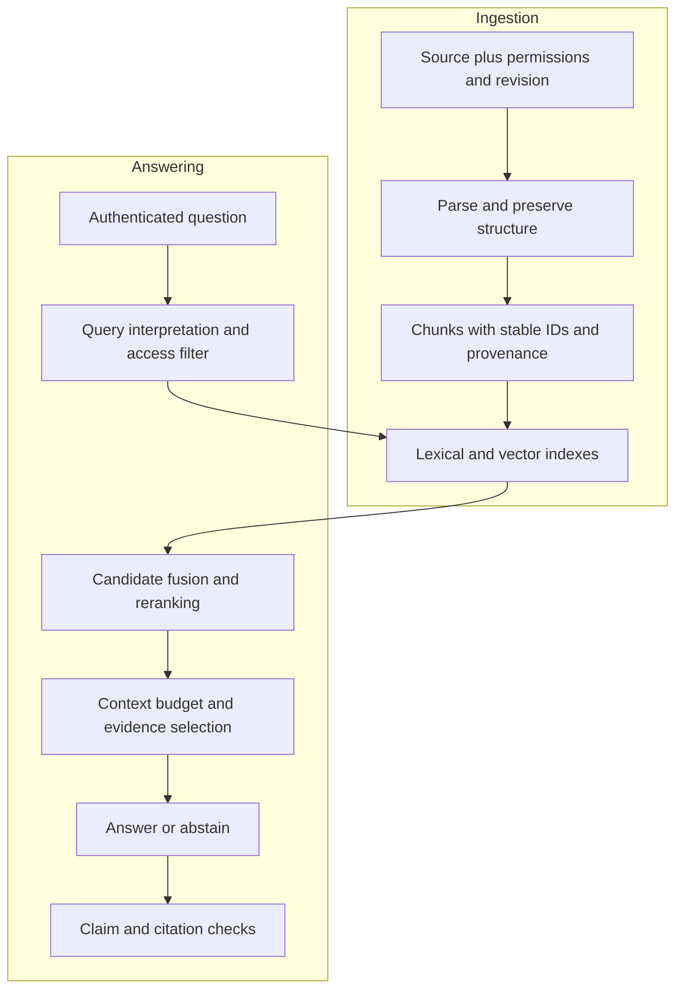
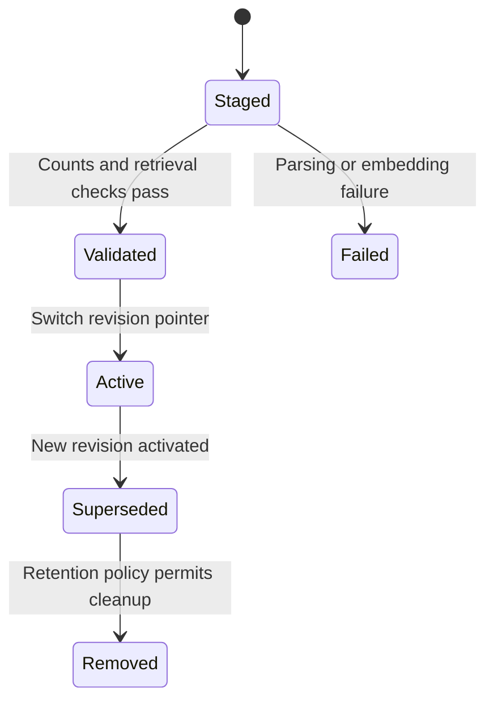

# Retrieval, Search, and RAG

Build retrieval that finds usable evidence, respects permissions, and supports a verifiable answer.

**Evidence:** [S6](24-sources.md#s6) reports pipeline, embedding, retrieval-debugging, and response-validation questions; [S3](24-sources.md#s3) reports vector-document updates; [S2](24-sources.md#s2) reports sensitive-data and evaluation questions. Every numerical workload and detailed follow-up below is an original practice extension.

## The two paths you must explain



Keep intermediate artefacts. Without parsed text, retrieved IDs, rankings, context, answer, citations, and versions, it is difficult to distinguish a search defect from a generation defect.

## RAG01 · Build a basic RAG system in a live interview

**Evidence: reported, [S1](24-sources.md#s1), [S6](24-sources.md#s6).**

**Answer.** Clarify corpus format, question types, freshness, access model, and what counts as a correct answer. Start with a small end-to-end path: parse documents, preserve source metadata, chunk, index, retrieve, and build an answer from returned evidence. Add a no-evidence path before adding sophisticated retrieval.

Give each chunk `document_id`, `revision`, `chunk_id`, source location, text, and access metadata. Save the embedding model revision and preprocessing configuration. Treat ingestion as repeatable work; do not re-embed the entire corpus on every query.

In a time-limited round, a lexical baseline with transparent diagnostics can expose the pipeline clearly. State what an embedding model and vector index would replace. Add a few answerable, unanswerable, and permission-restricted cases; print retrieved IDs so the interviewer can inspect failures.

**Cross-questions.**

- **Why does a larger context window not remove retrieval?** It changes the trade-off, but corpus size, permissions, freshness, cost, and distractors still matter.
- **How many chunks?** Select using measured retrieval quality and the usable context budget. “Always five” is not a general answer.
- **What makes it RAG?** Generated output is conditioned on retrieved external evidence. A vector search endpoint alone is retrieval, not the full system.

**Code:** [the retrieval lab](21-coding-labs.md#lab-1) supplies a local pipeline and metrics without network or model charges. Its extractive answer is deliberately a baseline; the live-generation extension is specified separately.

**Executable check:**

```python
# Minimal retrieval plumbing; the downloadable lab adds permissions/metrics.
documents = {"d1": "Refunds require a receipt", "d2": "Delivery takes five days"}
query = "refunds"
ids = [key for key, text in documents.items() if query in text.casefold()]
evidence = [{"source_id": key, "text": documents[key]} for key in ids]
assert evidence[0]["source_id"] == "d1"
# Generation is an explicit later stage; this code returns evidence only.
```

## RAG02 · Why are the retrieved passages irrelevant?

**Evidence: reported, [S6](24-sources.md#s6).**

**Answer.** Freeze a failing query and inspect each stage. Is the relevant text in the source? Did parsing preserve it? Did chunking separate the heading, table, or qualifying sentence? Is the current revision indexed? Do permissions exclude it correctly? Are query and document embeddings compatible? Did retrieval find it but reranking or truncation remove it?

Use an **oracle context experiment**: supply the known correct evidence directly to the generator. If the answer becomes correct, retrieval/context assembly is implicated. If it stays wrong, investigate prompt interpretation, synthesis, conflicting evidence, and answer validation. This isolates causes better than changing the model, chunk size, and prompt simultaneously.

**Cross-questions.**

- **Cosine score is 0.88. Is that relevant?** A similarity score is not a calibrated relevance probability. Thresholds depend on model, corpus, query distribution, and index configuration.
- **What if the document is not indexed?** Retrieval tuning cannot recover absent evidence. Fix ingestion and add a freshness/coverage check.
- **How do you know the fix helped?** Compare on a held-out query set, inspect slices, and report retrieval and answer metrics separately.

**Executable check:**

```python
trace = {"parsed": {"a", "b"}, "indexed": {"a", "b"},
         "retrieved": {"b"}, "context": {"b"}}
gold = "a"
first_loss = next(stage for stage, ids in trace.items() if gold not in ids)
assert first_loss == "retrieved"
# If oracle context still fails, investigate generation as a separate defect.
```

## RAG03 · Sparse, dense, hybrid, and reranking: compare them

**Evidence: reported retrieval-improvement question, [S6](24-sources.md#s6).**

| Technique | Strength | Failure mode |
| --- | --- | --- |
| Sparse/BM25 | Exact tokens, identifiers, rare terms | Paraphrases and vocabulary mismatch |
| Dense retrieval | Semantic matches and paraphrases | Exact codes, negation, domain mismatch |
| Hybrid retrieval | Combines complementary candidate sets | More tuning and operational paths |
| Cross-encoder reranking | Jointly scores query and candidate text | Latency and candidate-length limits |

**Answer.** For queries containing an error code such as `ZX-419`, lexical search protects exact matching; for “my subscription keeps renewing”, dense search may match “disable automatic renewal”. Retrieve candidates through both, fuse rankings, then rerank a manageable set if the quality benefit fits latency.

Reciprocal rank fusion uses `Σ 1/(c + rank)` across result lists. It avoids assuming BM25 and cosine raw scores share a scale. It is a fusion method; **MRR is an evaluation metric**, not an interchangeable fusion algorithm.

```python
# Standalone reciprocal rank fusion; duplicate IDs in one list count once.
from collections import defaultdict

def rrf(rankings, c=60):
    if c <= 0:
        raise ValueError("c must be positive")
    scores = defaultdict(float)
    for ranking in rankings:
        for rank, item in enumerate(dict.fromkeys(ranking), 1):
            scores[item] += 1 / (c + rank)
    return sorted(scores, key=lambda item: (-scores[item], item))

assert rrf([["a", "b"], ["b", "c"]])[0] == "b"
```

**Cross-questions.**

- **Can a reranker recover a missing document?** No. Candidate recall bounds what reranking can achieve.
- **Why not rerank the whole corpus?** Joint scoring every document is usually too expensive; use a cheap candidate stage first.
- **How evaluate fusion?** Compare candidate recall, final nDCG/MRR, answer quality, and latency on the same queries.

## RAG04 · Chunk size, overlap, and document structure

**Evidence: practice extension of the reported RAG pipeline.**

**Answer.** A chunk should carry enough context to interpret its claims while remaining selective for retrieval. Start from document structure: headings, paragraphs, sections, tables, code blocks, and source boundaries. Attach the heading path and source location. Measure token length using the actual tokenizer when budget enforcement depends on tokens.

Smaller chunks can improve focus but lose qualifications; larger chunks preserve context but can dilute relevance and crowd out other evidence. Overlap reduces boundary loss at the cost of duplicate retrieval and storage. Parent-child retrieval uses small units for search and larger parent context for reading; apply access control to both.

**Cross-questions.**

- **A table spans several pages?** Preserve headers, units, row/column relationships, and page provenance. Plain newline splitting can change meaning.
- **Should overlap count twice in recall?** Define relevance units so duplicate chunks do not inflate evidence coverage.
- **How choose size?** Sweep a small set of plausible structures/sizes on held-out query types, including multi-section and table questions. Report quality versus cost.

[Contextual retrieval](https://www.anthropic.com/engineering/contextual-retrieval) is one approach that augments chunks with explanatory context before indexing. Generated context must still be checked against the source; it can introduce errors.

**Executable check:**

```python
heading, rows = "Refund exceptions", ["Opened items: no refund", "Sealed items: 30 days"]
chunks = [{"heading": heading, "text": row, "row": i} for i, row in enumerate(rows)]
assert all(c["heading"] == "Refund exceptions" for c in chunks)
# Preserve table structure and attach source locations in a real parser.
```

## RAG05 · Explain embeddings, distance, and ANN indexes

**Evidence: embeddings reported in [S6](24-sources.md#s6); index questions are extensions.**

**Answer.** Embeddings represent inputs as vectors trained to make particular relationships useful. Cosine similarity normalises by vector norms; dot product also depends on magnitude; Euclidean distance measures geometric separation. For unit-normalised vectors, cosine and squared Euclidean distance yield equivalent ordering, since `||u-v||² = 2-2(u·v)`.

Approximate nearest-neighbour (ANN) search trades exactness for speed/memory. HNSW uses a navigable graph; IVF partitions the space and searches selected partitions. More search effort can improve recall while increasing latency. Build an exact-search sample as a reference so ANN recall is not confused with semantic relevance.

**Cross-questions.**

- **Why use a vector database instead of a NumPy matrix?** Durable storage, filtering, concurrency, updates, indexing, and operational tooling may justify it. Small corpora may not need a separate service.
- **Can we change the embedding model in place?** Usually build a new versioned index, evaluate, switch an alias, and retain rollback. Same dimension does not mean compatible coordinates.
- **Why return fewer than k results after filtering?** Approximate search may generate candidates before filtering. Check the index's filtering semantics and search-effort controls.

[pgvector documents exact/approximate search, filters, and iterative scans](https://github.com/pgvector/pgvector). It is one implementation, not a universal contract for every vector store.

**Executable check:**

```python
import numpy as np

u, v = np.array([3., 4.]), np.array([4., 3.])
u, v = u / np.linalg.norm(u), v / np.linalg.norm(v)
assert np.isclose(np.sum((u - v) ** 2), 2 - 2 * (u @ v))
# Unit normalisation makes cosine and squared Euclidean rankings equivalent.
```

## RAG06 · Update and delete documents without stale answers

**Evidence: reported, [S3](24-sources.md#s3).**

**Answer.** Track source ID, content hash, revision, and an ingestion manifest listing active chunk IDs. For an update, parse/chunk/embed the new revision, validate it, and atomically switch which revision is active. Remove or tombstone the superseded chunks. A failed partial upload should not leave half-old, half-new evidence visible.

Use deterministic IDs for repeatable ingestion, but do not key only by chunk position if content and boundaries can shift. Deletions must reach lexical/vector indexes, parent documents, caches, derived summaries, and evaluation fixtures where required by the product's retention policy.



**Cross-questions.**

- **What if a query runs during migration?** Give it a coherent corpus/index revision snapshot, or document consistency semantics and handle mixed-version risk explicitly.
- **What invalidates the cache?** Content revision, permissions, retrieval/prompt/model changes, and freshness rules; a text-only query key is insufficient.
- **How test deletion?** Query exact phrases from the removed document and inspect all retrieval paths and answer caches.

## RAG07 · Protect sensitive data in retrieval

**Evidence: reported, [S2](24-sources.md#s2).**

**Answer.** Derive identity and tenant from authenticated server context. Enforce authorisation in storage/retrieval before text reaches the model. Apply the same rules to lexical candidates, vectors, parent expansion, rerankers, tools, citations, logs, and caches. A prompt saying “do not reveal private documents” is not access control.

Permissions can change while an index is stale. Recheck access before returning source text or executing an action. Partitioning by tenant can reduce accidental mixing, but query filtering and server authorisation still need tests. Encryption at rest and in transit protects different risks from an authorised process retrieving the wrong tenant's data.

**Cross-questions.**

- **Should the model generate the tenant ID?** No. Tenant identity comes from authenticated application state, never a model argument.
- **Can a shared cache leak?** Yes, if keys omit identity/access scope or if permission changes do not invalidate entries.
- **What should the test assert?** No unauthorised IDs or text at any stage, including traces and citation previews, not merely a polite final refusal.

Continue with [security testing](18-testing-security.md).

**Executable check:**

```python
# Authenticated tenant is supplied by the server, not by generated arguments.
server_tenant = "acme"
docs = [{"id": "a", "tenant": "acme"}, {"id": "b", "tenant": "other"}]
allowed = [d for d in docs if d["tenant"] == server_tenant]
assert [d["id"] for d in allowed] == ["a"]
# Repeat authorisation before parent expansion, citations and actions.
```

## RAG08 · Measure retrieval separately from generated answers

**Evidence: reported evaluation, [S2](24-sources.md#s2), [S3](24-sources.md#s3).**

**Answer.** Create queries with relevance labels and, where practical, required evidence units. For a ranked list `[x, a, b]` and relevant set `{a, b, c}`, recall@3 is 2/3, precision@3 is 2/3, hit@3 is 1, and reciprocal rank is 1/2. These are different questions about the result list.

| Metric | Meaning | Beware |
| --- | --- | --- |
| Recall@k | Relevant units retrieved / all labelled relevant units | Incomplete relevance labels |
| Precision@k | Relevant results / defined top-k denominator | Duplicate chunks and short result lists |
| Hit@k | Any relevant result found | Does not ensure all needed evidence |
| MRR | Mean inverse rank of first relevant result | Ignores later required evidence |
| nDCG@k | Rank-discounted graded relevance, normalised by ideal ranking | Label scale and gain convention |

For answers, score correctness, claim support, citation correctness/completeness, and abstention. Faithfulness to context is not the same as truth: an answer can faithfully repeat an outdated document. [Ragas exposes separate retrieval and answer metrics](https://docs.ragas.io/en/stable/concepts/metrics/available_metrics/); inspect each metric's inputs and definition.

**Cross-questions.**

- **No gold evidence?** Human-label a stratified sample; use weaker proxy metrics with explicit uncertainty. A reference-free judge is not ground truth.
- **What about unanswerable queries?** Evaluate abstention separately. Recall with an empty relevant set needs an explicit convention, not division by zero.
- **Why deduplicate?** Repeated chunks must not turn one piece of evidence into multiple successful hits.

**Executable check:**

```python
ranked, relevant = ["x", "a", "b"], {"a", "b", "c"}
hits = sum(d in relevant for d in ranked)
recall, precision = hits / len(relevant), hits / len(ranked)
rr = next((1 / i for i, d in enumerate(ranked, 1) if d in relevant), 0)
assert recall == precision == 2/3 and rr == .5
```

## RAG09 · The answer cites a document but invents the claim

**Evidence: reported response-validation theme → scenario, [S6](24-sources.md#s6).**

**Answer.** Verify three layers: the cited ID exists and was actually supplied; the cited passage supports the particular claim; and important claims are covered by citations. A syntactically valid citation proves only formatting.

Split compound assertions when needed. “Refunds last 30 days and include shipping” contains two claims that may have different support. Exact amounts, dates, product names, and exceptions deserve strict checks. Where support is absent, omit, qualify, ask for clarification, or abstain according to the task contract.

**Cross-questions.**

- **Can a judge prove support?** It can assist, but assess agreement with human annotation and keep evidence spans for audit.
- **What if documents disagree?** Respect authoritative source, effective date, jurisdiction, and revision rules; show unresolved conflict instead of blending incompatible rules.
- **Would lowering temperature fix it?** It may reduce variation but does not add missing evidence or enforce semantic correctness.

**Executable check:**

```python
# Human-labelled claim/source entailment fixture, not an automatic detector.
claims = [{"text": "Refund window is 30 days", "source_exists": True, "supported": True},
          {"text": "Opened items qualify", "source_exists": True, "supported": False}]
citation_precision = sum(c["supported"] for c in claims) / len(claims)
assert citation_precision == .5
# Resolving a citation ID alone would incorrectly pass both claims.
```

## RAG10 · Handle multi-turn conversation without corrupting retrieval

**Evidence: reported theme, [S9](24-sources.md#s9).**

**Answer.** Resolve references such as “does that apply to the annual plan?” using relevant conversation context. Preserve the original question, rewritten query, retrieved evidence, and the rewrite's source turns. Do not let a summariser silently change customer IDs, dates, negations, or previously stated constraints.

Keep dialogue state separate from authoritative evidence. Previous assistant statements are not trustworthy source documents merely because they appear in history. Recheck facts and permissions when context or account state changes.

**Cross-questions.**

- **Store the full history forever?** Use a retention policy, bounded context, and structured state for durable facts. Summaries need provenance and correction mechanisms.
- **When ask a clarification?** When plausible interpretations lead to materially different retrieval or actions and context cannot resolve them safely.
- **How test?** Pronouns, topic switches, corrections, conflicting earlier answers, account switches, and a long irrelevant history.

**Executable check:**

```python
state = {"product": "Plan A", "region": "UK", "question": "Can I cancel?"}
standalone_query = f'{state["product"]} {state["region"]}: {state["question"]}'
assert "Plan A UK" in standalone_query
# Verify a model rewrite preserves entities, negations and unresolved ambiguity.
```

## RAG11 · Multi-query, HyDE, decomposition, and GraphRAG

**Evidence: graph-RAG theme reported in [S1](24-sources.md#s1); detailed scenario is a practice extension.**

| Technique | Useful when | Main risk |
| --- | --- | --- |
| Query rewriting | Original wording is vague or conversational | Changes intent |
| Multi-query search | Several phrasings improve recall | Duplicate noise and extra cost |
| HyDE | A hypothetical answer-shaped text improves retrieval | Invented details steer search incorrectly |
| Query decomposition | A question needs several distinct facts | Missing dependencies or error propagation |
| Graph retrieval | Explicit relationships/multi-hop structure matter | Extraction errors, stale edges, permissions |

**Answer.** Begin with a baseline and a specific failure slice. If a question asks which suppliers depend on a recalled component, entity relationships may justify a graph. If a query is an exact invoice lookup, SQL or lexical search may suffice. Rerun the same evaluation with each addition and retain it only if it improves the intended trade-off.

**Cross-questions.**

- **Is graph data automatically trustworthy?** No. Each edge needs provenance, revision, confidence where appropriate, and access rules.
- **Can multiple searches share a budget?** They should. Bound total queries, candidates, reranking, context size, and elapsed time.
- **Where does agentic RAG begin?** The model dynamically chooses retrieval steps based on intermediate results. A fixed two-query chain can remain a workflow.

**Executable check:**

```python
# Multi-hop completion requires all evidence obligations.
required = {"purchase_date", "applicable_policy"}
retrieved = {"purchase_date"}
assert bool(required & retrieved)  # Hit@k could be 1.
assert not required <= retrieved   # The question still cannot be answered.
```

## RAG12 · Choose a retrieval stack and defend it

**Evidence: practice extension.**

**Answer.** Compare capabilities against the workload, not tool names. PostgreSQL with pgvector can simplify operations when transactional data and filtering already live there. A search engine can be appropriate for lexical/hybrid requirements. A dedicated vector service can fit larger vector workloads or managed operations. FAISS can provide local ANN primitives but requires surrounding persistence, filtering, and service infrastructure.

Estimate size first: 10 million vectors × 768 dimensions × 4 bytes is about **30.72 GB decimal** of raw vector payload, before index graph/quantisation, metadata, source text, replicas, and overhead. Query latency also includes filtering, network, reranking, and generation.

**Cross-questions.**

- **What proves the chosen store works?** Benchmarks on representative vectors, filters, updates, concurrency, and failure/recovery, with exact-search recall checks.
- **Can managed services remove all operational work?** They shift responsibilities. You still own schema, permissions, data quality, costs, and application behaviour.
- **Which versions matter?** Client and server, distance/index settings, embedding revision, parser, schema, and reranker. See the [version notebook](23-tools-versions.md).

**Executable check:**

```python
# Synthetic measured alternatives, with explicit acceptance constraints.
options = [{"name": "exact", "recall": 1., "p95_ms": 120},
           {"name": "ann", "recall": .96, "p95_ms": 25}]
accepted = [o for o in options if o["recall"] >= .95 and o["p95_ms"] <= 50]
assert accepted[0]["name"] == "ann"
# Measure filtering, update/deletion behaviour and operating cost too.
```

## RAG13 · An exact product code retrieves a semantically similar wrong product

**Practice extension.** Preserve identifier tokens and use lexical/exact filters alongside semantic retrieval. A near-neighbour product description can be plausible while referring to a different SKU. Evaluate identifier-heavy queries as their own slice.

```python
products = [{"sku": "ZX-419", "text": "pump manual"},
            {"sku": "ZX-491", "text": "pump manual"}]
selected = [p for p in products if p["sku"] == "ZX-419"]
assert len(selected) == 1 and selected[0]["sku"] == "ZX-419"
```

**Cross-question:** **Normalise hyphens/case?** Only according to the identifier's business rules. **Rerank the wrong product higher?** Add explicit identifier-consistency checks and test transposed digits, prefixes, and multilingual surrounding text.

## RAG14 · A relevant passage loses its heading and changes meaning

**Practice extension.** Attach section hierarchy or retrieve a parent section. A chunk saying “available for 30 days” may refer to returns, trials, or warranty claims. The heading is evidence-bearing context, not decoration.

```python
chunk = {"heading_path": ["Returns", "Annual plans"], "text": "Available for 30 days."}
context = " > ".join(chunk["heading_path"]) + "\n" + chunk["text"]
assert context.startswith("Returns > Annual plans")
```

**Cross-question:** **Embed the heading too?** Evaluate it; it may improve disambiguation but introduce repeated boilerplate. **How test?** Create identical body text under different headings and verify correct retrieval and answer interpretation.

## RAG15 · Parent expansion crosses an access boundary

**Practice extension.** A child chunk can be authorised while its parent contains restricted sections. Apply access checks after expansion and preserve source-level policy. Do not assume the entire document inherits the retrieved child's permissions.

```python
parent_sections = [{"id": "public", "allowed": True}, {"id": "private", "allowed": False}]
expanded = [s["id"] for s in parent_sections if s["allowed"]]
assert expanded == ["public"]
```

**Cross-question:** **Filter only the final answer?** Restricted text has already reached the model or logs. **How test?** Place a synthetic secret in a neighbouring section and inspect assembled context, reranker input, and citation previews.

## RAG16 · Overlap fills all top-k slots with the same evidence

**Practice extension.** Deduplicate or diversify by evidence/document identity after candidate retrieval while retaining enough context to answer. Raw chunk recall can overstate evidence coverage when many chunks repeat one sentence.

```python
ranked = [("d1", "c1"), ("d1", "c2"), ("d2", "c1")]
seen, diverse = set(), []
for doc, chunk in ranked:
    if doc not in seen:
        diverse.append((doc, chunk)); seen.add(doc)
assert len(diverse) == 2
```

**Cross-question:** **Always one chunk per document?** No, some questions need several sections of one document. Use task-aware coverage and evaluate a diversity policy. **Which metric?** Required-evidence coverage and answer quality, not merely distinct-document count.

## RAG17 · Compute nDCG with graded relevance

**Practice extension.** nDCG rewards placing more relevant results earlier. State the gain convention and cutoff; a common gain is `2^relevance - 1` with logarithmic rank discount.

```python
import math
labels = [0, 2, 1]
def dcg(values):
    return sum((2**r-1)/math.log2(i+2) for i,r in enumerate(values))
ndcg = dcg(labels)/dcg(sorted(labels, reverse=True))
assert 0 < ndcg < 1
```

**Cross-question:** **No relevant items?** Define the convention or exclude/report separately. **Can two nDCG numbers be compared?** Only with compatible relevance labels, query sets, cutoffs, and gain definitions. Keep per-query results for diagnosis.

## RAG18 · Distinguish ANN recall from semantic retrieval recall

**Practice extension.** ANN recall compares approximate neighbours with exact neighbours under the same vector distance. Semantic recall compares results with labelled relevant evidence. An approximate index can perfectly reproduce a poor embedding model's neighbours.

```python
exact_neighbours = {"a", "b", "c"}
approximate = {"a", "b", "x"}
ann_recall = len(exact_neighbours & approximate)/len(exact_neighbours)
assert ann_recall == 2/3
```

**Cross-question:** **Tune search effort or embeddings?** Diagnose which recall is failing first. **How benchmark?** Sample representative filtered queries, calculate exact neighbours, then compare latency/recall as ANN parameters change.

## RAG19 · A filter makes the retriever return fewer than requested results

**Practice extension.** The engine may approximate neighbours before filtering, leaving too few authorised matches. Inspect pre/post-filter semantics, iterative search support, tenant partitioning, and search effort. Never remove access filters to improve recall.

```python
candidates = ["private1", "public1", "private2"]
allowed = {"public1", "public2"}
visible = [x for x in candidates if x in allowed]
assert len(visible) == 1
```

**Cross-question:** **Overfetch indefinitely?** Bound effort and report partial results; evaluate latency under selective filters. **Exact search fallback?** It can be appropriate for small filtered subsets, but benchmark the real workload and preserve the same permissions.

## RAG20 · Document deletions remain in semantic caches

**Practice extension.** A deletion pipeline must invalidate derived state as well as the vector row. Use content/ACL revision in cache keys and track which artefacts depend on the deleted document. Tombstones can block retrieval while asynchronous cleanup proceeds.

```python
cache_entry = {"answer": "old answer", "source_ids": {"d1", "d2"}}
deleted = {"d2"}
valid = cache_entry["source_ids"].isdisjoint(deleted)
assert not valid
```

**Cross-question:** **TTL enough?** It bounds staleness but may not meet immediate deletion/revocation requirements. **How test?** Query exact and paraphrased questions before/after deletion and inspect cache, index, parent text, summaries, and citations.

## RAG21 · A parser joins two table columns incorrectly

**Practice extension.** Preserve row/column associations and units. A flat text extractor can pair a product with another row's price, yielding a confidently grounded-looking wrong answer. Evaluate structured parsing separately from retrieval.

```python
rows = [{"product": "A", "price": 10}, {"product": "B", "price": 20}]
lookup = {row["product"]: row["price"] for row in rows}
assert lookup["A"] == 10
```

**Cross-question:** **Use a vision model instead?** It may help, but compare against labelled tables and keep provenance; it can also misread alignment. **What fixtures?** Merged cells, repeated headers, page breaks, footnotes, and currency/unit changes.

## RAG22 · OCR changes a minus sign or decimal point

**Practice extension.** General OCR accuracy can hide critical numeric mistakes. Validate extracted values against source regions, units, ranges, and cross-field totals. Route uncertain high-impact fields for review instead of treating every recognised token equally.

```python
expected, extracted = -1.5, 1.5
assert expected != extracted
assert abs(expected-extracted) == 3.0
```

**Cross-question:** **A semantic judge says equivalent?** Use deterministic numeric comparison where the task requires it. **Can range checks prove the number?** No, plausible wrong values can pass; combine source verification and field-level evaluation.

## RAG23 · Multilingual queries fail on an English-heavy corpus

**Practice extension.** Compare multilingual embeddings, query translation, and language-specific retrieval. Preserve original terms and identifiers. Translation can change negation, names, or technical vocabulary, so keep both original and transformed queries for diagnosis.

```python
request = {"original": "synthetic non-English query", "translated": "refund policy",
           "language": "example-language", "query_transform": "translation-v1"}
assert request["original"] and request["query_transform"]
```

**Cross-question:** **One global score enough?** Report per-language performance and sample sizes. **Translate documents or queries?** Trade ingestion cost, freshness, retrieval quality, and translation errors; benchmark both on actual language/task pairs.

## RAG24 · Query rewriting turns “not eligible” into “eligible”

**Practice extension.** Treat rewriting as a component with its own evaluation. Preserve entities, negation, dates, numeric constraints, and user intent. Compare original and rewritten retrieval, and fall back when a rewrite violates a deterministic constraint.

```python
original = {"eligible": False, "product": "annual"}
rewrite = {"eligible": True, "product": "annual"}
assert original["eligible"] != rewrite["eligible"]
```

**Cross-question:** **String matching enough to validate intent?** No, it is useful for exact constraints but semantic changes need labelled tests. **Why log both queries?** It separates rewrite errors from retriever errors without guessing from the final answer.

## RAG25 · HyDE invents details that misdirect retrieval

**Practice extension.** A hypothetical answer is a retrieval aid, not source evidence. Keep it distinct from retrieved documents and do not cite it as truth. Compare HyDE with the original-query baseline on difficult paraphrase and entity-specific slices.

```python
artefacts = [{"kind": "hypothetical", "id": "h1"}, {"kind": "source", "id": "d1"}]
citable = [a["id"] for a in artefacts if a["kind"] == "source"]
assert citable == ["d1"]
```

**Cross-question:** **Can hypothetical text enter the final context?** Only with explicit treatment as untrusted generated material; usually keep authoritative evidence separate. **What measures the benefit?** Retrieval and answer improvements net of extra model calls and latency.

## RAG26 · Multi-hop question needs two documents, but hit@k is perfect

**Practice extension.** Hit@k only requires one relevant item. A question connecting a supplier to a component and then to a recall needs all required evidence. Label evidence sets or subquestions and measure coverage/composition.

```python
required = {"supplier-component", "component-recall"}
retrieved = {"supplier-component"}
hit = bool(required & retrieved)
complete = required <= retrieved
assert hit and not complete
```

**Cross-question:** **Can the generator fill the missing hop?** That risks an unsupported conclusion. Retrieve more, clarify, or abstain. **How evaluate decomposition?** Check both subquestion correctness and whether the combined answer follows from the retrieved relationships.

## RAG27 · Graph edges are stale after a source update

**Practice extension.** Treat graph extraction as derived data with source revision and validity intervals. Updating a document can invalidate entities, edges, summaries, and communities. A graph answer should trace its relationships back to current permitted evidence.

```python
edge = {"source_revision": "v2", "relation": "supplies"}
active_revision = "v3"
assert edge["source_revision"] != active_revision
```

**Cross-question:** **Regenerate the whole graph?** Depends on dependency tracking and scale; incremental invalidation can help but must preserve correctness. **What test?** Remove a relationship from the source and verify it disappears from graph queries and generated explanations.

## RAG28 · A long context drops the only qualifying exception

**Practice extension.** Context packing must preserve evidence units, not just fit as many high-scoring tokens as possible. A main rule without its exception can invert the answer. Use section-aware grouping and inspect exactly what reaches the model.

```python
facts = {"rule": "returns allowed", "exception": "custom items excluded"}
required_fields = {"rule", "exception"}
assert required_fields <= facts.keys()
```

**Cross-question:** **Truncate at a token boundary?** It prevents invalid size, not semantic completeness. **How test?** Put exceptions near chunk/context boundaries and require the final answer to reflect them. Compare evidence selection against oracle context.

## RAG29 · Retrieved documents conflict on effective dates

**Practice extension.** Define authority and temporal validity. “Newest ingestion time” does not necessarily mean “current policy”. Keep publication, effective, expiry, and ingestion times distinct where needed.

```python
from datetime import date
policies = [{"id": "old", "start": date(2025,1,1), "end": date(2026,1,1)},
            {"id": "new", "start": date(2026,1,1), "end": date(2027,1,1)}]
at = date(2026,9,26)
assert [p["id"] for p in policies if p["start"] <= at < p["end"]] == ["new"]
```

**Cross-question:** **Historical question?** Retrieve the policy effective at the requested event date. **Unresolved conflict?** Report it and escalate/abstain according to the task; do not average incompatible rules.

## RAG30 · Citation precision and citation completeness differ

**Practice extension.** Citation precision asks whether cited evidence supports the associated claims. Completeness asks whether material claims that require evidence are adequately cited. A single correct citation can coexist with several unsupported claims.

```python
claims = [{"supported": True, "cited": True},
          {"supported": False, "cited": False}]
coverage = sum(c["cited"] for c in claims)/len(claims)
assert coverage == 0.5
```

The code measures citation presence, not semantic support. **Cross-question:** **How establish support?** Evidence-span review or a calibrated claim grader. **What about common knowledge?** Define which claims require citation in the product contract instead of changing the rule case by case.

## RAG31 · Abstention becomes a way to maximise apparent accuracy

**Practice extension.** Report accuracy on answered cases together with coverage and the appropriateness of refusals. A system answering one easy question correctly can show 100% conditional accuracy while being useless for most requests.

```python
answered, correct, total = 1, 1, 100
selective_accuracy = correct/answered
coverage = answered/total
assert selective_accuracy == 1 and coverage == 0.01
```

**Cross-question:** **How choose an abstention threshold?** Use validation data and costs, then evaluate on held-out cases. **Unanswerable versus ambiguous?** Missing evidence may require abstention; ambiguity may be resolved by a clarifying question. Track these outcomes separately.

## RAG32 · Add relevance labels without marking every unjudged document irrelevant

**Practice extension.** A pooled candidate set from several retrievers can improve annotation coverage, but unjudged items remain unknown. Incomplete judgements can favour systems whose candidates were already labelled. Audit newly retrieved high-ranked items.

```python
judgements = {"d1": 1, "d2": 0}
status = judgements.get("d3", "unjudged")
assert status == "unjudged"
```

**Cross-question:** **How compare a new retriever fairly?** Expand the judgement pool and re-evaluate all candidates under the same labels where practical. **Can synthetic labels replace humans?** They can assist triage, but validate label quality and retain uncertainty.

## RAG33 · Index build succeeds with half the vectors missing

**Practice extension.** Validate expected IDs, counts, dimensions, finite values, revision consistency, and searchable canary queries before activating an index. A successful API response for one batch does not prove complete ingestion.

```python
expected = {"c1", "c2", "c3"}
indexed = {"c1", "c3"}
assert expected-indexed == {"c2"}
```

**Cross-question:** **Compare counts only?** Equal counts can still contain wrong IDs or duplicates. **Activation strategy?** Stage and validate a coherent revision, then switch a pointer/alias; leave the prior index available for rollback.

## RAG34 · Embedding vectors contain NaNs or zero norms

**Practice extension.** Validate numerical outputs before indexing. Cosine similarity is undefined for a zero-norm vector; NaNs can corrupt ordering or be handled inconsistently by libraries. Record the affected input/model revision and retry/quarantine under policy.

```python
import numpy as np
vectors = np.array([[1., 0.], [0., 0.], [np.nan, 1.]])
valid = np.isfinite(vectors).all(axis=1) & (np.linalg.norm(vectors, axis=1) > 0)
assert valid.tolist() == [True, False, False]
```

**Cross-question:** **Replace NaNs with zero?** That hides an upstream failure and may produce meaningless embeddings. **How test?** Empty text, malformed encoding, provider partial errors, and mixed-dimension responses.

## RAG35 · Reranker latency dominates the answer path

**Practice extension.** Profile candidate count, text length, batching, and model runtime. Reduce candidate count only after measuring candidate recall, use shorter relevant passages, or route easy exact-match cases around reranking under a validated policy.

```python
candidate_count, cost_ms_per_pair = 100, 4
serial_estimate = candidate_count*cost_ms_per_pair
assert serial_estimate == 400
```

This estimate ignores batching/overlap and needs measurement. **Cross-question:** **Rerank only top five?** It may remove the reranker's opportunity to rescue lower-ranked relevant results. **What compare?** Latency-quality curves across candidate counts and representative query slices.

## RAG36 · Semantic caching confuses “can cancel” and “cannot cancel”

**Practice extension.** Embedding proximity does not establish answer equivalence. Use exact constraints, scope/version checks, and a conservative reuse policy; test negation, dates, quantities, and account-specific state.

```python
first = {"action": "cancel", "negated": False, "account": "A"}
second = {"action": "cancel", "negated": True, "account": "A"}
assert first != second
```

**Cross-question:** **Increase similarity threshold?** It may reduce risk but cannot prove semantic equivalence. **Safer cache target?** Reuse retrieval candidates or model prefixes where the contract is clearer, then regenerate/validate the answer as needed.

## RAG37 · Text-to-SQL is proposed instead of document retrieval

**Practice extension.** Structured data questions often fit a constrained query service better than embedding rows. Validate the requested operation, use parameterised queries or a restricted query builder, enforce row/column permissions, and cap execution cost.

```python
import sqlite3
with sqlite3.connect(":memory:") as db:
    db.execute("CREATE TABLE inventory(sku TEXT, count INTEGER)")
    db.execute("INSERT INTO inventory VALUES (?, ?)", ("ZX-419", 3))
    assert db.execute("SELECT count FROM inventory WHERE sku=?", ("ZX-419",)).fetchone()[0] == 3
```

**Cross-question:** **Read-only SQL safe enough?** It can still leak data or exhaust resources. **How evaluate?** Result correctness, permission enforcement, query cost, and handling of ambiguity, not SQL-string similarity alone.

## RAG38 · A knowledge base changes during an evaluation run

**Practice extension.** Freeze or record corpus/index revisions so baseline and candidate face comparable evidence. Otherwise a model change can be confounded with a document update. If live freshness is the task, explicitly log the changing state and interpret results accordingly.

```python
baseline = {"index": "snapshot-12", "model": "m1"}
candidate = {"index": "snapshot-12", "model": "m2"}
assert baseline["index"] == candidate["index"]
```

**Cross-question:** **Evaluate stale snapshots forever?** No, refresh datasets deliberately and retain comparable baselines. **Which artefacts?** Source versions, parser/chunker, embeddings, index settings, reranker, context builder, prompt, model, and grader.

## RAG39 · Build a relevance feedback loop without training on accidental clicks

**Practice extension.** Clicks reflect exposure, position, curiosity, and interface design. Combine explicit judgements, task outcomes, and carefully interpreted interaction signals. Sample low-engagement/no-click cases too, rather than collecting only positive feedback.

```python
interaction = {"shown_rank": 1, "clicked": True, "task_resolved": False}
assert interaction["clicked"] and not interaction["task_resolved"]
```

**Cross-question:** **Use clicks as relevance labels?** Only with justified assumptions and correction/validation. **How avoid leakage?** Keep feedback used for tuning separate from final evaluation and version the collection policy.

## RAG40 · Defend a retrieval improvement with an ablation

**Practice extension.** Change one component at a time where feasible: chunking, embedding, hybrid fusion, reranking, or context packing. Compare the same queries and evidence snapshot, then inspect interactions with a small planned combination study.

```python
runs = ["dense-baseline", "dense-plus-bm25", "hybrid-plus-reranker"]
assert len(set(runs)) == 3
```

**Cross-question:** **All components changed and score improved?** You can report the whole-system gain but cannot attribute it to one component. **What belongs in the answer?** Per-query/slice quality, uncertainty, latency/cost, failure examples, and a rollback path, with numerical claims tied to actual run artefacts.

## Summary in simple points

- **RAG01–02:** Build a traceable parse–index–retrieve–answer path. Use a known-good context to separate retrieval failures from generation failures.
- **RAG03–04:** Sparse and dense retrieval find different candidates; reranking cannot recover absent ones. Preserve headings, tables, exceptions and provenance when chunking.
- **RAG05–06:** Distinguish vector distance, ANN approximation and semantic relevance. Update documents through versioned manifests and coherent revision switches.
- **RAG07–08:** Enforce permissions before evidence reaches any model or tool. Measure retrieval and generated answers separately.
- **RAG09–10:** A valid citation ID does not prove support for a claim. Conversation rewriting must preserve entities, scope and negation.
- **RAG11–12:** Multi-query, HyDE, decomposition and graph retrieval add specific assumptions and costs. Choose a retrieval stack with measured requirements.
- **RAG13–14:** Exact identifiers often need lexical matching. Keep headings and source relationships attached to passages.
- **RAG15–16:** Recheck permissions during parent expansion. Deduplicate overlapping evidence so top-k is not filled with the same claim.
- **RAG17–18:** nDCG rewards highly relevant items near the top. ANN recall compares against exact neighbours, while retrieval recall compares against relevance labels.
- **RAG19–20:** Filtering can reduce the number of returned candidates. Deletion must reach caches, summaries and all search paths.
- **RAG21–22:** Table structure and OCR errors can change a number's meaning. Validate cells, signs, decimals, units and source coordinates.
- **RAG23–24:** Evaluate multilingual and cross-language retrieval separately. Test query rewrites for changed intent rather than fluent wording alone.
- **RAG25–26:** Hypothetical answers can introduce misleading details. Multi-hop questions need all required evidence, even when hit@k is already one.
- **RAG27–28:** Derived graph edges need source versions and invalidation. Context packing must preserve qualifying exceptions within the real token budget.
- **RAG29–30:** Resolve conflicting evidence using applicability and effective dates. Citation precision and coverage of answer claims are separate measures.
- **RAG31–32:** Report answer coverage alongside selective accuracy. Unjudged documents are not automatically irrelevant.
- **RAG33–34:** Validate expected IDs, counts and vectors before activating an index. Reject nonfinite embeddings and handle zero norms explicitly.
- **RAG35–36:** Measure reranker benefit against its latency. Semantic caches must distinguish negation and respect identity, permissions and freshness.
- **RAG37–38:** Structured facts may need authorised database queries instead of text retrieval. Freeze corpus versions for valid evaluation comparisons.
- **RAG39–40:** Clicks are biased relevance signals. Use controlled ablations to show which retrieval change caused the improvement.
