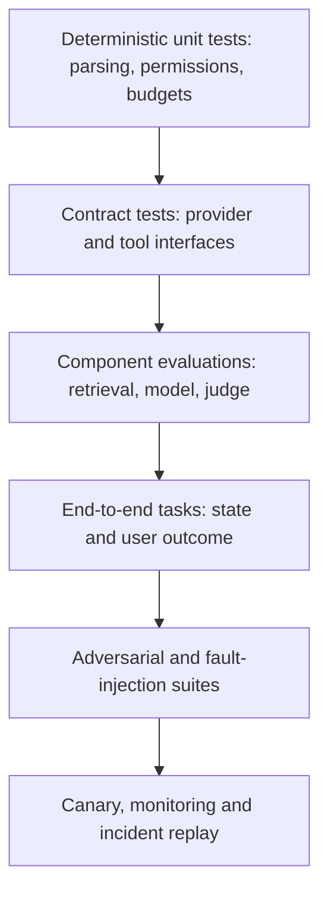

# Testing, Security, and Quality Assurance for AI Systems

Test the model's behaviour and the application's guarantees independently, then test how they fail together.

**Evidence:** [S4](24-sources.md#s4) reports AI test strategy, nondeterminism, hallucinations, RAG, datasets, CI, security, and tool workflows. The incidents, fixtures, and cross-questions below are original production exercises derived from those reported areas. Use synthetic identities and documents for security tests.

## A layered test strategy



## QA01 · Design a test strategy for an AI product

**Evidence: reported, [S4](24-sources.md#s4).**

**Answer.** Identify user tasks, harmful outcomes, and deterministic promises first. Authentication, tenant isolation, schema validation, idempotency, and budget enforcement are ordinary software contracts. Relevance, factual support, and conversational quality require representative examples and behavioural evaluation. Tool-using agents also require checks on actual state changes.

| Layer | Example oracle | Frequency |
| --- | --- | --- |
| Unit | Exact return value/invariant | Every change |
| Contract | Schema and error semantics | Every integration change |
| Behavioural | Labelled cases and calibrated rubric | Prompt/model/retrieval changes |
| End-to-end | User task and environment state | Release and targeted changes |
| Security/load | Forbidden effects and SLOs | Risk-based schedule and releases |

**Concrete fixture:**

```python
# Standalone release-contract example with synthetic measurements.
result = {"schema_valid": True, "unauthorised_effects": 0,
          "grounded_claims": 9, "material_claims": 10}
assert result["schema_valid"]
assert result["unauthorised_effects"] == 0
support_rate = result["grounded_claims"] / result["material_claims"]
assert support_rate == 0.9
```

The support labels in this snippet are supplied annotations, not automatically established facts. A real suite records how they were obtained.

**Cross-questions:** **Can we test only the final text?** No, inspect effects and intermediate access. **Does 100% code coverage establish quality?** No, it says which code executed, not whether assertions or behavioural cases were adequate.

## QA02 · The same prompt produces different answers. What should assertions do?

**Evidence: reported, [S4](24-sources.md#s4).**

**Answer.** Assert invariant meaning and constraints where wording can vary. For a retrieval answer, required facts, valid citations, supported claims, and appropriate abstention matter more than punctuation. Use exact assertions for IDs, amounts, schemas, and prohibited actions. Repeat stochastic cases according to a planned sampling policy and report failure rates with uncertainty.

```python
# A semantic contract represented by typed output, not string snapshots.
accepted = {"action": "ask_clarification", "missing_fields": ["order_id"]}
actual = {"action": "ask_clarification", "missing_fields": ["order_id"]}
assert actual["action"] == accepted["action"]
assert set(actual["missing_fields"]) == set(accepted["missing_fields"])
```

**Cross-questions:** **Set temperature to zero and snapshot?** Useful for reducing variation, insufficient for semantic correctness or universal determinism. **Rerun until it passes?** That hides failure probability. Fix repetition counts and retain every attempt.

## QA03 · Test RAG without confusing retrieval and generation defects

**Evidence: reported, [S4](24-sources.md#s4).**

**Answer.** Test ingestion with known text/table fixtures, retrieval against relevance labels, context assembly against permissions/token budgets, and generation against supplied evidence. Use both real retrieval plus a controlled generator and oracle evidence plus the real generator. Then test the integrated path.

```python
retrieved = ["public-policy", "public-faq"]
allowed = {"public-policy", "public-faq", "customer-own-order"}
required = {"public-policy"}
assert set(retrieved) <= allowed
assert required <= set(retrieved)
```

These checks establish ID coverage and access in a fixture. They do not establish semantic support. Add claim-to-evidence annotations and test missing, outdated, contradictory, and unauthorised documents.

**Cross-questions:** **Which layer owns a malformed PDF?** Ingestion/parser unless the source itself is invalid. **Which owns a relevant chunk dropped by truncation?** Context assembly; retrieval recall alone may look healthy.

## QA04 · Build a regression dataset and keep it useful

**Evidence: reported, [S4](24-sources.md#s4).**

**Answer.** Keep a representative core, incident-derived cases, and adversarial/edge suites with separate reporting. Each case records provenance, versions, expected behaviour, and severity. Track additions/removals and stale references. Hold out a final evaluation set so repeatedly tuning to the regression suite does not become the only evidence.

```python
cases = [
    {"id": "c1", "slice": "ordinary", "severity": "normal"},
    {"id": "c2", "slice": "tenant_boundary", "severity": "critical"},
    {"id": "c3", "slice": "no_evidence", "severity": "high"},
]
assert len({c["id"] for c in cases}) == len(cases)
assert {"ordinary", "tenant_boundary", "no_evidence"} <= {c["slice"] for c in cases}
```

**Cross-questions:** **Delete tests that always fail?** Only after a documented change to requirements or correction of invalid labels; not to improve the dashboard. **Can every incident become a test?** Often yes after minimising sensitive content and specifying the actual failure contract.

## QA05 · Prompt injection, jailbreaks, and ordinary bad input differ how?

**Evidence: reported security theme, [S4](24-sources.md#s4).**

| Input | Main concern | Example test |
| --- | --- | --- |
| Direct instruction attack | User requests policy-violating behaviour | Unauthorised account lookup |
| Indirect prompt injection | Retrieved/tool content attempts to control the agent | A document tells it to ignore access checks |
| Malformed input | Parser/schema/resource failure | Oversized field or invalid encoding |
| Ordinary ambiguity | Insufficient task information | Missing destination or account |

**Answer.** Track trust boundaries. Retrieved documents and tool outputs are data, even when they contain imperative text. Defend by limiting capabilities, validating arguments, enforcing permissions, restricting egress, and checking effects. A classifier or system instruction can reduce attack success but is not a complete boundary.

```python
# Fixture: an untrusted document must never grant additional capabilities.
base_tools = {"search_public_docs"}
document_requested_tools = {"export_all_customer_records"}
authorised_tools = base_tools.copy()  # derived from policy, not document text
assert not document_requested_tools & authorised_tools
```

**Cross-questions:** **Does escaping delimiters solve injection?** It improves parsing, but the model still interprets text. **What is the pass condition?** No forbidden data access or effects, including intermediate calls. [OWASP's GenAI threat taxonomy](https://genai.owasp.org/llm-top-10/) helps organise cases.

## QA06 · Test sensitive-data leakage and tenant isolation

**Evidence: reported, [S2](24-sources.md#s2), [S4](24-sources.md#s4).**

**Answer.** Seed synthetic canaries in separate tenants. Query through semantic search, exact search, parent expansion, citations, exports, caches, and logs. Test explicit requests, indirect injection, account switching, stale permissions, and reused conversation IDs. Check both returned text and identifiers; even document existence can be sensitive.

```python
records = [{"id": "a1", "tenant": "A"}, {"id": "b1", "tenant": "B"}]
principal_tenant = "A"  # supplied by authenticated test context
visible = [r for r in records if r["tenant"] == principal_tenant]
assert {r["id"] for r in visible} == {"a1"}
assert all(r["tenant"] == principal_tenant for r in visible)
```

This is a unit-test illustration; production enforcement belongs in the service/storage boundary as well. **Cross-questions:** **Does encryption prevent this bug?** No, an authorised process can decrypt and retrieve the wrong records. **Can QA use real secrets?** Use synthetic canaries and controlled fixtures; do not create unnecessary exposure.

## QA07 · Test tool-calling workflows and side effects

**Evidence: reported, [S4](24-sources.md#s4).**

**Answer.** Provide a stateful fake tool backend with explicit resources and permissions. Verify selected tool, argument validity, authorisation, approval where required, execution count, final state, and user-facing explanation. Simulate timeouts after commit, malformed results, revoked access, and conflicting updates.

```python
trace = ["authenticate", "authorise", "approve", "write", "confirm"]
assert trace.index("authorise") < trace.index("write")
assert trace.index("approve") < trace.index("write")
assert trace.count("write") == 1
```

An exact trace is appropriate here because ordering is a policy requirement. For exploratory research, allow multiple valid search paths. **Cross-questions:** **Mock every integration?** Use mocks for controlled faults and live contracts for actual APIs. **What if the final answer says success after a tool error?** That is a separate false-confirmation defect even if no state changed.

## QA08 · Metamorphic and property-based testing for AI

**Evidence: practice extension.**

**Answer.** A metamorphic test changes an input in a way that should preserve or predictably change the answer. Reordering irrelevant documents should not change a supported numeric result. Rephrasing a question should preserve intent. Changing the authenticated tenant should change accessible evidence. Define the relation explicitly; not every paraphrase preserves meaning.

```python
# Deterministic property example used underneath a retrieval system.
def authorise(ids, allowed):
    return [item for item in ids if item in allowed]

allowed = {"a", "b"}
for candidates in [[], ["a"], ["x", "a", "b"], ["b", "x"]]:
    assert set(authorise(candidates, allowed)) <= allowed
```

Property-based generators can vary Unicode, length, duplicate IDs, missing fields, and state sequences. For model behaviour, estimate relation satisfaction over repeated/varied cases rather than expecting byte-for-byte equality.

**Cross-questions:** **Can a metamorphic test prove correctness?** It detects inconsistency relative to a relation; a consistently wrong system can pass. **What makes a useful property?** It expresses a requirement independently of the implementation, rather than reproducing the same algorithm.

## QA09 · Fairness and harmful-content testing without a single magic score

**Evidence: reported bias/security theme, [S4](24-sources.md#s4).**

**Answer.** Define the decision context and relevant groups with domain input. Compare error rates, coverage, calibration, refusals, and utility where appropriate, with sample sizes and uncertainty. Counterfactual pairs can expose unjustified differences, but changing a word can also change legitimate task context; review the pair construction.

```python
# A diagnostic table; these small synthetic counts cannot support broad claims.
by_group = {"group_a": {"errors": 8, "n": 100},
            "group_b": {"errors": 12, "n": 100}}
rates = {g: row["errors"] / row["n"] for g, row in by_group.items()}
print(rates, "absolute gap:", abs(rates["group_a"] - rates["group_b"]))
```

**Cross-questions:** **Equal accuracy means fair?** No. Base rates, error severity, and access/coverage differ. **Can several fairness criteria conflict?** Yes; specify which decision and constraints matter, explain trade-offs, and involve accountable domain owners.

## QA10 · Release with flaky model tests and an urgent deadline?

**Evidence: reported CI evaluation theme → scenario, [S4](24-sources.md#s4).**

**Answer.** Classify failures as infrastructure, evaluator, data, deterministic product defects, or stochastic behaviour. Repair or isolate the cause without hiding its existence. Critical permission/action invariants remain hard gates. For statistical quality, use a predefined comparison and an explicit incomplete-run state.

```python
required_ids = {"ordinary", "restricted", "unanswerable"}
results = {"ordinary": True, "restricted": True}  # one case is missing
missing = required_ids - results.keys()
status = "incomplete" if missing else "complete"
assert status == "incomplete"
```

**Cross-questions:** **Quarantine a flaky case?** Preserve ownership, expiry, and alternate coverage; quarantine is not a passing result. **What does the release report show?** Dataset/run versions, missing results, regressions, critical failures, uncertainty, costs, and the rollback plan.

## QA11 · A test passes because it checks only HTTP 200

**Practice extension.** Verify the response contract, semantic result, and actual state. A server can return 200 with an error object or a false confirmation. Separate transport, application, and task outcomes.

```python
response = {"http": 200, "status": "failed", "effect_count": 0}
assert response["http"] == 200
assert response["status"] != "completed"
```

**Cross-question:** **Which layer owns the bug?** The API contract may be misleading, while the caller's success logic is also insufficient. **Test?** Error bodies, partial success, stale status, and mismatches between response and database state.

## QA12 · Test a timeout after the action committed

**Practice extension.** Inject the fault after durable commit but before the response. Retry with the same operation ID and verify one effect and the original result. This is different from a timeout before the request reached the service.

```python
ledger = {"op-1": {"effect_count": 1, "result": "done"}}
retry_result = ledger["op-1"]
assert retry_result["effect_count"] == 1
```

This fixture expresses the expected state; the [action lab](21-coding-labs.md#lab-4) implements the durable boundary. **Cross-question:** **New ID on retry?** That may create a second effect. **Conflicting payload?** Reject reuse of the key with different semantics.

## QA13 · Test cross-user conversation IDs

**Practice extension.** A conversation identifier is not an authorisation token. Bind state lookup to authenticated tenant/user and verify ownership before reading or resuming. Guessing another thread ID must not reveal its history.

```python
thread = {"id": "thread-7", "owner": "user-A"}
caller = "user-B"
assert thread["owner"] != caller
```

**Cross-question:** **Use unguessable IDs only?** They reduce guessing but do not replace access checks. **Test?** Direct ID substitution, shared caches, resumed checkpoints, deleted accounts, and tenant switches.

## QA14 · A response streams private content before a final refusal

**Practice extension.** Final-output checks are too late if sensitive tokens have already been delivered. Enforce retrieval access before generation and define streaming policies for content requiring pre-delivery validation.

```python
chunks = ["public text", "SYNTHETIC_PRIVATE_CANARY", "I cannot share that"]
assert any("SYNTHETIC_PRIVATE_CANARY" in chunk for chunk in chunks)
```

**Cross-question:** **Buffer everything?** It changes latency; use risk-based buffering and prevent forbidden context exposure upstream. **What should QA capture?** Every streamed chunk and side effect, not only the final concatenated message or UI state.

## QA15 · Test cancellation and cleanup

**Practice extension.** Cancelling a user request should release pending work and resources according to the actual runtime contract. A cancelled await does not necessarily stop a thread, provider request, or committed action.

```python
import asyncio
async def main():
    task = asyncio.create_task(asyncio.sleep(10))
    task.cancel()
    try:
        await task
    except asyncio.CancelledError:
        pass
    assert task.cancelled()
asyncio.run(main())
```

**Cross-question:** **What about billing?** Measure whether downstream work continued. **Test?** Cancel while queued, during model generation, during a tool call, and after commit; verify status, resource counts, and reconciliation.

## QA16 · A release gate accepts an empty test run

**Practice extension.** Vacuous truth can make `all([])` return true. Validate nonempty required case membership and minimum slice counts before evaluating pass conditions.

```python
assert all([]) is True
results = []
valid_run = len(results) > 0 and all(results)
assert not valid_run
```

**Cross-question:** **Minimum total count enough?** No, a required critical slice may still be absent. **What test?** Empty input, wrong dataset version, missing cases, duplicate cases, and extra unexpected IDs.

## QA17 · Unicode and invisible characters break a safety filter

**Practice extension.** Test normalisation, confusable characters, zero-width characters, and mixed scripts. Normalisation can help parsing but cannot make semantic security filtering complete. Preserve original text for authorised diagnosis.

```python
import unicodedata
composed = "é"
decomposed = "e\u0301"
assert composed != decomposed
assert unicodedata.normalize("NFC", composed) == unicodedata.normalize("NFC", decomposed)
```

**Cross-question:** **Normalise identifiers blindly?** Some identifiers require exact semantics; define the contract. **Main defence?** Enforce permissions/capabilities even when text classification misses an attack.

## QA18 · A JSON parser accepts unexpected fields

**Practice extension.** An extra field such as `admin=true` can influence downstream code if the application forwards the full object. Use strict schemas and explicit field selection at sensitive boundaries.

```python
payload = {"order_id": "o1", "admin": True}
allowed_fields = {"order_id"}
assert not payload.keys() <= allowed_fields
```

**Cross-question:** **Ignore or reject extras?** Choose deliberately; mutation tools often benefit from rejection so caller errors are visible. **Test?** Nested extras, wrong types, booleans as integers, nulls, oversized arrays, and duplicate JSON keys where parser behaviour matters.

## QA19 · Numeric and unit errors pass semantic similarity checks

**Practice extension.** Use deterministic comparisons for amounts, dates, units, and identifiers when exactness is required. “10 mg” and “100 mg” may look linguistically similar but differ materially; use harmless synthetic examples for testing.

```python
expected = {"value": 10, "unit": "kg"}
actual = {"value": 10, "unit": "g"}
assert expected != actual
```

**Cross-question:** **Convert units automatically?** Only with a validated conversion and an unambiguous unit contract. **What about tolerance?** Tie it to measurement precision and business requirements, not a convenient generic percentage.

## QA20 · Test unanswerable and contradictory evidence

**Practice extension.** Include empty retrieval, irrelevant evidence, and mutually inconsistent authoritative sources. Expected behaviour may be abstention, clarification, or explaining the conflict, rather than a forced answer.

```python
sources = [{"days": 14, "authority": "policy"}, {"days": 30, "authority": "policy"}]
conflict = len({s["days"] for s in sources}) > 1
assert conflict
```

**Cross-question:** **Pick the highest retrieval score?** Relevance score is not authority or temporal validity. **Test outcome?** No unsupported resolution, correct explanation of the uncertainty, and no consequential action based on unresolved conflict.

## QA21 · Mutation testing reveals assertions that do nothing

**Practice extension.** Deliberately introduce a representative defect and verify the suite fails. Useful mutations include reversing an ACL predicate, removing idempotency, swapping labels, or ignoring a critical failure.

```python
def correct(tenant, owner):
    return tenant == owner
def mutated(tenant, owner):
    return True
assert not correct("A", "B")
assert mutated("A", "B")  # the negative fixture distinguishes the mutation
```

**Cross-question:** **Every surviving mutation is a product bug?** Some mutations are equivalent or outside requirements. **Why useful?** It checks whether tests can detect the failure they claim to cover, beyond code-execution coverage.

## QA22 · Golden snapshots become brittle after wording changes

**Practice extension.** Snapshot exact structure where stable; use semantic/field invariants where wording is flexible. Review snapshot updates rather than accepting all generated diffs automatically.

```python
outputs = ["Your order is pending.", "The order has not shipped yet."]
structured_status = ["pending", "pending"]
assert outputs[0] != outputs[1]
assert structured_status[0] == structured_status[1]
```

**Cross-question:** **Can a semantic judge replace every snapshot?** No, deterministic fields and schemas deserve exact checks. **How prevent meaning drift?** Include adversarial near-paraphrases that change negation, dates, or obligations.

## QA23 · A mock provider never returns real error shapes

**Practice extension.** Contract tests should validate the actual provider adapter using documented and observed error variants. A fake that always returns perfect JSON hides truncation, refusals, rate limits, malformed tool calls, and streaming errors.

```python
variants = ["success", "refusal", "truncated", "rate_limited", "invalid_tool_arguments"]
assert len(set(variants)) == 5
```

**Cross-question:** **Call the live provider in every unit test?** Keep deterministic unit tests and a smaller controlled live contract suite. **Version changes?** Re-run adapter contracts and behavioural tests before switching models or SDKs.

## QA24 · Test rate limits without waiting an hour

**Practice extension.** Inject a controllable clock and fake provider responses. Verify retry timing, attempt limits, shared quotas, and cancellation. Avoid tests based on real sleeping whenever a simulated clock can exercise the same logic.

```python
now, retry_after = 100.0, 5.0
next_allowed = now + retry_after
assert 104.9 < next_allowed <= 105.0
```

**Cross-question:** **Concurrency limit equals rate limit?** No, fast calls can exceed requests-per-minute quotas. **What load test?** Burst traffic, many tenants, slow responses, and repeated 429s while measuring admitted/completed work and fairness.

## QA25 · Test data poisoning in an ingestion pipeline

**Practice extension.** A malicious or incorrect source can contaminate retrieved evidence. Validate source trust, revision provenance, parsing, and activation policy. Include synthetic poisoned documents that conflict with known authorised facts.

```python
source = {"origin": "unapproved-upload", "revision": "r1"}
trusted_origins = {"approved-policy-repository"}
assert source["origin"] not in trusted_origins
```

**Cross-question:** **Trusted source means true content?** No, it narrows provenance; mistakes and compromised accounts remain possible. **Test?** Source spoofing, stale revisions, conflicting policy, duplicated high-ranking text, and hidden instructions in attachments.

## QA26 · A vector store upgrade changes nearest neighbours

**Practice extension.** Compare exact-distance reference results, ANN recall, filtered retrieval, and downstream answers on fixed embeddings and queries. Changed defaults can alter search effort, filtering, or distance interpretation.

```python
before = {"q1": ["a", "b"]}
after = {"q1": ["a", "c"]}
assert before != after
```

**Cross-question:** **Different neighbours always bad?** No, evaluate relevance and tolerable numerical differences. **What must stay fixed?** Embeddings, corpus, filters, query set, index parameters, and metric definition, unless deliberately testing those changes too.

## QA27 · A browser UI says success while the backend failed

**Practice extension.** End-to-end tests should verify the UI, API status, and authoritative state for important actions. A toast notification is not the oracle. Simulate delayed errors and disconnected clients.

```python
ui = {"toast": "Saved"}
backend = {"saved": False}
assert ui["toast"] == "Saved" and not backend["saved"]
```

**Cross-question:** **Always query the database directly?** Use an appropriate test interface or trusted read API; avoid bypassing the product's semantics unintentionally. **AI-specific angle?** The assistant must not narrate completion until the action result is verified.

## QA28 · Accessibility and usability failures in an AI interface

**Practice extension.** Test keyboard navigation, focus, screen-reader announcements, streaming updates, error recovery, and clear confirmation of consequential actions. Model quality does not compensate for an unusable interface.

```python
control = {"role": "button", "accessible_name": "Confirm refund", "keyboard_focusable": True}
assert control["accessible_name"] and control["keyboard_focusable"]
```

The fixture expresses an expected UI contract; a browser test must inspect the actual DOM/accessibility tree. **Cross-question:** **Announce every token?** That can overwhelm assistive technology; test the experience with sensible update policies. **What user outcome?** Users can understand, stop, correct, and confirm the interaction.

## QA29 · Test retrieval permissions after role revocation

**Practice extension.** Revoke access while a session, cache, or checkpoint remains active. Verify source retrieval, cached answers, parent expansion, and citations no longer expose the resource under the new policy.

```python
cached_acl_revision, current_acl_revision = 4, 5
assert cached_acl_revision != current_acl_revision
```

**Cross-question:** **Logout enough?** Long-lived sessions and backend caches may persist; enforce policy at the relevant access boundary. **How handle in-flight work?** Define and test the revocation semantics, including checks before returning sensitive data or committing actions.

## QA30 · A tenant's test data contaminates another tenant's evaluation

**Practice extension.** Namespace datasets, outputs, traces, and grader caches by authenticated tenant and access scope. A shared evaluator should not retrieve another customer's examples or reference answers.

```python
key_a = ("tenant-A", "dataset-1", "case-7")
key_b = ("tenant-B", "dataset-1", "case-7")
assert key_a != key_b
```

**Cross-question:** **Globally unique case IDs enough?** They help identity but not authorisation. **Test?** ID collisions, copied datasets, export endpoints, reviewer permissions, and cache reuse across tenants.

## QA31 · Test memory deletion and correction

**Practice extension.** A deletion/correction must reach structured state, retrieval memories, summaries, and caches according to the product contract. Merely removing the visible chat message may leave derived memory active.

```python
memories = {"m1": "old preference", "m2": "other fact"}
memories.pop("m1")
assert "m1" not in memories
```

**Cross-question:** **This proves complete deletion?** No, it tests one store; enumerate derived artefacts and verify each required boundary. **Correction test?** The next conversation should use the updated fact and not resurrect the old one through retrieval.

## QA32 · A judge accepts fabricated citations

**Practice extension.** Validate citation IDs against the actual supplied source set before semantic grading. Then verify claim support; existence alone is insufficient. Include valid-looking nonexistent IDs and real IDs attached to wrong claims.

```python
supplied = {"d1:p2", "d2:p1"}
cited = {"d99:p7"}
assert not cited <= supplied
```

**Cross-question:** **Cite any source in the corpus?** The product may require evidence actually consulted; define and test that rule. **How test completeness?** Annotate material claims and expected supporting evidence separately from citation formatting.

## QA33 · Test a fallback model under the same safety contract

**Practice extension.** A fallback is a new system variant. It may support different schemas, context lengths, tools, refusals, and sampling settings. Run critical fixtures and adapter contracts before using it during an outage.

```python
required = {"structured_output", "tool_calls"}
fallback_capabilities = {"text_generation"}
assert not required <= fallback_capabilities
```

**Cross-question:** **Disable missing features silently?** That can violate the user's task; degrade explicitly or escalate. **What test?** Primary failure followed by fallback, preserving identity, context, permissions, and outcome accounting.

## QA34 · Security classifier blocks legitimate users

**Practice extension.** Evaluate false positives and false negatives against labelled cases, including quoted harmful text used for benign analysis. A classifier that blocks everything can look safe while destroying utility.

```python
benign = 100
false_blocks = 12
false_positive_rate = false_blocks/benign
assert false_positive_rate == 0.12
```

**Cross-question:** **Lower threshold until attacks vanish?** Measure the resulting utility cost and retain deterministic action/data boundaries. **What slices?** Language, dialect, quotation, domain jargon, ambiguous intent, and input length, with sufficient sample counts.

## QA35 · Reproduce a nondeterministic incident

**Practice extension.** Save model/configuration versions, prompt/template, tool schemas/results, corpus revision, initial state, and redacted trace. Repeated replay can estimate variability, but a provider revision change may prevent exact reproduction.

```python
required = {"model", "prompt", "tools", "corpus", "initial_state"}
manifest = {name: "synthetic-version" for name in required}
assert required <= manifest.keys()
```

**Cross-question:** **Seed enough?** No, external state and runtime can vary. **What if exact replay is impossible?** Build a minimised deterministic fixture around the observed failure and document the live-model uncertainty.

## QA36 · Separate severity from frequency

**Practice extension.** A rare cross-tenant leak may outrank a frequent punctuation defect. Define severity through user/business impact and frequency through observed exposure. Avoid one weighted mean that erases catastrophic failures.

```python
bugs = [{"name": "formatting", "count": 100, "critical": False},
        {"name": "tenant_leak", "count": 1, "critical": True}]
assert any(b["critical"] for b in bugs)
```

**Cross-question:** **Every theoretical risk blocks release?** Prioritise concrete requirements and evidence, while enforcing critical invariants. **Report?** Reproduction, impact, affected scope, frequency estimate, mitigation, and regression test.

## QA37 · Load tests use only identical easy prompts

**Practice extension.** Real traffic varies in prompt/output length, retrieval filters, tool counts, and arrival patterns. Include representative distributions and adversarial resource cases; identical cached requests can overstate capacity.

```python
workload = [{"input_tokens": 100, "output_tokens": 50},
            {"input_tokens": 8000, "output_tokens": 1000}]
assert workload[0] != workload[1]
```

**Cross-question:** **Average requests/second enough?** No, report latency tails, queueing, errors, token throughput, and workload mix. **Cache enabled?** State hit rates and include cold/warm scenarios explicitly.

## QA38 · Test artefacts expose credentials in CI logs

**Practice extension.** Redact/minimise before logging and restrict artefact access/retention. Test failure paths, because exception bodies and HTTP debug logs often bypass the normal redaction route.

```python
secret = "SYNTHETIC_TOKEN_123"
log = {"error": "provider_unavailable", "request_id": "r17"}
assert secret not in str(log)
```

**Cross-question:** **Search for one exact secret enough?** Add representative encodings, field paths, and exception formats, while avoiding real credentials in test fixtures. **What if a leak occurs?** Follow the actual incident process and fix the logging boundary, not only the one message.

## QA39 · Validate the test harness with known good and bad systems

**Practice extension.** Run a deliberately correct baseline, a known failing implementation, and injected faults. A harness that never fails or always fails cannot guide releases. Check scoring, error accounting, and reproducibility independently.

```python
def grade(value):
    return value == 42
assert grade(42)
assert not grade(41)
```

**Cross-question:** **Too trivial?** This illustrates the control principle; real controls should represent wrong citations, forbidden effects, missing evidence, and incomplete runs. **When rerun controls?** Whenever graders, datasets, providers, or result parsing change.

## QA40 · Write a useful AI defect report

**Practice extension.** Include task/input, expected contract, observed output and state, versions, evidence, reproduction rate, severity, and a minimised fixture. “The model hallucinated” is not enough to locate or verify a fix.

```python
bug = {"id": "qa-17", "expected": "no unauthorised reads",
       "observed": "foreign document ID in retrieval", "reproductions": "3/3",
       "stage": "retrieval_filter", "fixture": "synthetic-two-tenants"}
assert bug["stage"] and bug["fixture"]
```

**Cross-question:** **What closes the bug?** A tested fix plus regression coverage at the failing boundary and relevant end-to-end checks. **What remains uncertain?** State stochastic reproducibility and the scope of validation honestly.

## Summary in simple points

- **QA01–02:** Build a risk-based test strategy across deterministic code, model behaviour and environment effects. Test nondeterminism with repeated trials and meaningful tolerances.
- **QA03–04:** RAG tests must isolate parsing, indexing, permissions, retrieval and answer generation. Keep regression data representative, versioned and clearly labelled.
- **QA05–06:** Distinguish prompt injection from jailbreaks and malformed input. Test sensitive-data disclosure across retrieval, tools, outputs, tenants and traces.
- **QA07–08:** Agent tests must verify arguments, authority and final state. Use metamorphic relations and properties when exact wording is not the requirement.
- **QA09–10:** Evaluate fairness using relevant slices and error costs. Flaky tests need diagnosis; urgent deadlines do not make incomplete or unsafe runs pass.
- **QA11–12:** HTTP 200 does not establish semantic success. Retried actions must not duplicate effects or accept changed payloads under one ID.
- **QA13–14:** Check user and tenant ownership on conversation IDs. Inspect streamed output because a final refusal cannot undo an earlier leak.
- **QA15–16:** Cancellation tests should observe cleanup and committed effects. Empty or incomplete test runs must never produce a passing release.
- **QA17–18:** Include Unicode and normalisation cases. Reject unexpected JSON fields when the contract requires a closed schema.
- **QA19–20:** Check units, arithmetic and boundaries explicitly. Include missing, conflicting and unanswerable evidence.
- **QA21–22:** Mutation tests reveal assertions that cannot detect defects. Prefer semantic contracts to brittle wording snapshots where wording is not the requirement.
- **QA23–24:** Match provider mocks to real error contracts. Use a controlled clock to test quotas, expiry and backoff deterministically.
- **QA25–26:** Test poisoning and provenance in ingestion. Compare retrieval behaviour when indexes or vector libraries change.
- **QA27–28:** UI success must match durable backend state. Test keyboard access, status announcements and recovery from failures.
- **QA29–30:** Recheck permissions after revocation. Keep tenant data isolated throughout evaluation as well as serving.
- **QA31–32:** Verify deletion and correction across memory stores and caches. A fabricated citation must fail even when its format looks valid.
- **QA33–34:** Fallbacks must preserve the same safety contract. Measure false blocks of legitimate requests alongside attack detection.
- **QA35–36:** Reproduce incidents with versions, traces and controlled inputs. Frequency and severity are different prioritisation dimensions.
- **QA37–38:** Load tests need realistic length, tenant and tool mixes. Keep credentials and sensitive test content out of CI artefacts.
- **QA39–40:** Test the test harness against known good and bad systems. File defects with reproducible input, expected behaviour, actual effects and impact.
