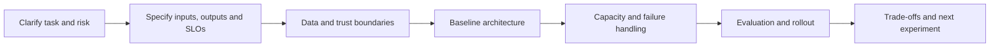
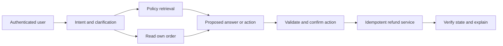

# AI System Design and Project Defence

Turn ambiguous business requests into explicit contracts, measurable architecture choices, and a safe release plan.

**Evidence:** [S3](24-sources.md#s3) reports résumé ranking; [S2](24-sources.md#s2) reports predictive weather tooling; [S8](24-sources.md#s8) reports publisher-attributed support-agent, claims, and batching prompts. The workloads and solutions here are original. [S7](24-sources.md#s7) and [V1](24-sources.md#v1) support practising project and design defence.

## Explain the decisions behind the design



A useful design explains why the components exist. A list containing a vector database, an agent framework, Kubernetes, and a dashboard is not yet an architecture.

| Decision | First option | Alternative | Evidence that should decide |
| --- | --- | --- | --- |
| Execution | Fixed workflow with known steps | Agent selects its next step | Tasks requiring adaptation, measured completion and bounded risk |
| Knowledge | Retrieve current external evidence | Adapt model weights for stable behaviour | Freshness, citation needs, held-out task errors and update cost |
| Delivery | Synchronous response | Durable asynchronous job | Work duration, deadlines, cancellation and restart needs |
| Retrieval storage | Database with exact/vector search | Separate search service | Corpus size, filtering semantics, latency, updates and operating cost |
| Serving | Managed provider | Hosted model | Quality, capacity, privacy constraints, accelerator utilisation and support cost |
| Release | Shadow traffic to observe behaviour | Canary traffic with controlled user exposure | Whether you need offline comparison or actual user-impact evidence |

These options can coexist. State which part of the system uses each and which experiment could change your choice.

## SYS01 · Design a customer-support agent

**Evidence: publisher-attributed reported task, [S8](24-sources.md#s8).**

**Scenario.** A retailer handles policy questions, order-status queries, and refunds. Assume 20 requests/second peak, authenticated users, and a product requirement that refunds require explicit confirmation.

**Answer.** Use retrieval for policy, a read-only order tool for status, and a separate transactional refund service. Route ambiguous requests to clarification. The refund service validates ownership, eligibility, amount, and a stable operation ID; the model cannot override these checks. Bind confirmation to order, amount, currency, and policy revision.



```python
proposal = {"order": "o17", "amount_minor": 1200, "currency": "USD"}
approved = proposal.copy()
assert proposal == approved
assert isinstance(proposal["amount_minor"], int)
```

Use integer minor units or an appropriate decimal representation for money. This snippet checks payload equality only; real approval must be authenticated and bound to state.

**Cross-questions:** **What if the refund succeeds but response fails?** Reconcile using the stable operation ID. **What is success?** Correct authorised resolution, with no duplicate effect, acceptable latency/cost, and an accurate explanation. **Where do humans enter?** Unresolved policy conflicts, exceptions, or cases beyond configured authority.

## SYS02 · Design enterprise document Q&A

**Evidence: reported live-RAG theme, [S1](24-sources.md#s1), and security theme, [S2](24-sources.md#s2).**

**Scenario.** One million documents, several tenants, policy changes daily, p95 answer latency target five seconds.

**Answer.** Separate ingestion from serving. Ingestion extracts structure, access metadata, revisions, lexical terms, and embeddings. Serving authenticates, filters, retrieves, reranks if justified, assembles a bounded context, generates, and validates citations. Keep an active index revision and a cache policy incorporating access changes.

```python
# Illustrative first-pass latency allocation in milliseconds.
budget = {"auth": 50, "search": 250, "rerank": 300,
          "model": 3500, "validate": 200, "reserve": 700}
assert sum(budget.values()) == 5000
```

This is an allocation, not a prediction of p95 by summing stage quantiles. Measure whole-request latency under representative load.

**Cross-questions:** **Why not put all documents in a prompt?** Scale, permissions, freshness, and evidence focus remain constraints. **Embedding migration?** Build a versioned new index, evaluate, switch coherently, and preserve rollback. **Which evaluation?** Retrieval relevance, answer correctness/support, citation coverage, abstention, access invariants, and latency/cost.

## SYS03 · Design a résumé matching and ranking system

**Evidence: reported, [S3](24-sources.md#s3).**

**Answer.** Clarify whether the system assists reviewers or makes hiring decisions. Extract evidence-backed skills, experience, dates, and job requirements with uncertainty and provenance. Establish lexical/rules and embedding baselines. Rank relevant evidence while keeping protected or irrelevant personal attributes out of scoring features according to the product's policy and applicable requirements.

Use human-labelled relevance, nDCG/recall at the review cutoff, and error/fairness slices. Clicks or historical hiring outcomes can encode selection bias. Explanations must cite actual résumé content; do not invent experience.

```python
# A transparent toy baseline; weights are exercise choices, not hiring policy.
required = {"python", "sql", "model evaluation"}
evidenced = {"python", "sql", "docker"}
coverage = len(required & evidenced) / len(required)
assert round(coverage, 2) == 0.67
```

**Cross-questions:** **Can you rank purely by cosine?** It can be a baseline but may miss must-have requirements, negation, and evidence quality. **What about career gaps?** Do not infer ability from unsupported proxies; define permitted features with domain stakeholders. **What if OCR misses a skill?** Track extraction quality separately from ranking so the failure can be diagnosed.

## SYS04 · Design an agent that evaluates insurance claims

**Evidence: publisher-attributed task family, [S8](24-sources.md#s8).**

**Answer.** Treat the output as a recommendation unless explicit authority and validated policy permit automation. Parse claims/documents, preserve source evidence, retrieve the effective policy, and apply deterministic eligibility/calculation rules where available. Route missing documents, conflicting evidence, and uncertain interpretations for review.

```json
{
  "claim_id": "synthetic-17",
  "policy_revision": "policy-v4",
  "recommendation": "needs_review",
  "missing_evidence": ["purchase_date"],
  "evidence_ids": ["document-2:page-1"],
  "executed_effects": []
}
```

Version policy and extraction models. Cache reusable policy context; avoid multiple full-model passes when a deterministic field check suffices. Evaluate by claim type, document quality, and error severity, not just average agreement.

**Cross-questions:** **The model is confident but evidence is missing?** Confidence does not satisfy a required field. **Can a judge approve the claim?** A judge's score is supporting evidence, not a substitute for the business decision authority. **How audit?** Preserve input versions, evidence spans, rule outcomes, model outputs, reviewer actions, and final state.

## SYS05 · Design a reusable asynchronous evaluation service

**Evidence: reported reusable/scalable evaluation questions, [S5](24-sources.md#s5).**

**Answer.** Accept a dataset/configuration reference, validate it, create a run ID, and enqueue per-case work. Workers call the system under test under provider quotas and persist outputs. Graders read those artefacts independently, write versioned results, and aggregation checks completeness before producing comparisons.

```python
states = {"queued": {"running", "cancelled"},
          "running": {"completed", "failed", "cancelled"},
          "completed": set(), "failed": set(), "cancelled": set()}
assert "completed" not in states["queued"]
assert "completed" in states["running"]
```

Use leases/heartbeats for abandoned work, stable IDs for deduplication, per-tenant budgets, and an explicit cancel path. Keep model outputs and judge scores independently versioned so a new rubric can regrade saved results.

**Cross-questions:** **At-least-once jobs?** Deduplicate result writes and use stable request/operation IDs where possible. **Case errors reduce average score?** Report infrastructure failure and quality outcomes separately, and fail completeness requirements. **What about untrusted custom graders?** Run in a constrained isolated environment or support a restricted configuration language.

## SYS06 · Design a long-running research agent

**Evidence: reported research-agent context, [S2](24-sources.md#s2); detailed design is a practice extension.**

**Answer.** Define a bounded research question, approved sources/tools, evidence quality rules, budget, and completion criteria. Persist tasks and source artefacts, permit checkpoint/resume, and maintain claims linked to evidence. Parallel workers can investigate independent subquestions; a single synthesis step reconciles conflicting evidence and identifies remaining gaps.

```python
budget = {"max_searches": 12, "max_documents": 30, "max_minutes": 10}
used = {"searches": 12, "documents": 19, "minutes": 7}
may_search = used["searches"] < budget["max_searches"]
assert not may_search
```

A budget limit should yield a partial report with explicit unresolved questions, not an invented conclusion. Distinguish source publication date from the event being described.

**Cross-questions:** **How measure success?** Coverage of requested questions, factual support, source quality, contradiction handling, and useful completion under budget. **Can sources instruct the agent?** Retrieved content remains data; it cannot grant tools or change task authority. **Resume after hours?** Revalidate time-sensitive sources, permissions, and task state.

## SYS07 · Defend a project without inventing production experience

**Evidence: reported project rounds, [S1](24-sources.md#s1), [S7](24-sources.md#s7), [V1](24-sources.md#v1).**

**Answer.** Present the problem, users, your contribution, baseline, constraints, decisive trade-off, measured results, and a failure you investigated. Label a prototype, synthetic benchmark, or personal project accurately. The interviewer can probe details such as where a metric came from, how errors were sampled, and which system boundary you owned.

```json
{
  "claim": "hybrid search improved labelled retrieval recall",
  "baseline_run": "run-10",
  "candidate_run": "run-11",
  "dataset": "heldout-v2",
  "sample_count": 200,
  "limitation": "synthetic corpus; no production traffic"
}
```

**Cross-questions:** **Why that tool?** Compare two actual alternatives against constraints. **What would you change with tenfold scale?** Identify the measured bottleneck and its likely next limit. **What failed?** Explain evidence, diagnosis, rejected hypotheses, and the change, not a polished story where nothing went wrong.

## SYS08 · Handle a deliberately impossible requirement

**Evidence: practice extension.** The interviewer asks for perfect answers, fresh global data, zero leakage, 100 ms latency, and near-zero cost.

**Answer.** Clarify priority and scope. Some deterministic guarantees can be enforced, such as denying unauthorised reads. Open-ended answer correctness cannot be made perfect merely by selecting a model. Offer a scoped contract: cached exact lookups within 100 ms, asynchronous deeper answers, explicit abstention, and measurable quality on specified tasks.

```python
options = [
    {"name": "cached_lookup", "latency_ms": 40, "freshness_minutes": 5},
    {"name": "live_research", "latency_ms": 8000, "freshness_minutes": 0},
]
feasible = [o["name"] for o in options if o["latency_ms"] <= 100]
assert feasible == ["cached_lookup"]
```

**Cross-questions:** **Is challenging the premise evasive?** It is useful when paired with a feasible alternative and explicit assumptions. **Which requirement remains hard?** Security/authorisation constraints should remain enforced even when quality or latency degrades. **How decide?** Use stakeholder priorities and measured trade-offs, not an unqualified promise.

## SYS09 · Design an AI feature when labels do not exist

**Practice extension.** Define the user task and unacceptable errors, build a simple baseline, and run a small expert-labeling pilot. Use weak/synthetic labels for exploration while reserving reviewed examples for evaluation. Plan how production feedback becomes trustworthy labels.

```python
pilot = {"ordinary": 30, "ambiguous": 10, "high_risk": 10}
assert sum(pilot.values()) == 50
```

**Cross-question:** **Fifty cases enough to launch?** It may reveal categories, not certify rare-error rates. **What deliverable?** A rubric, disagreement analysis, baseline failures, and a plan for representative sampling and uncertainty.

## SYS10 · Design an email triage assistant with draft-only authority

**Practice extension.** Separate classification, retrieval, drafting, and sending. The application grants draft creation but not send capability. Validate recipients/attachments when a human later chooses to send, and retain source-message provenance.

```python
allowed_actions = {"classify", "create_draft"}
assert "send_email" not in allowed_actions
```

**Cross-question:** **Prompt says never send, sufficient?** Remove/enforce the capability at the tool boundary. **Evaluation?** Correct routing, draft usefulness, sensitive-data handling, recipient correctness, and zero unauthorised sends, including injected instructions in incoming mail.

## SYS11 · Design a meeting summariser with action items

**Practice extension.** Preserve speaker/time provenance, distinguish decisions from suggestions, and mark uncertain attribution. Extract structured action items with owner/date evidence and ask for clarification when missing. Do not convert every discussion into a commitment.

```python
item = {"task": "review proposal", "owner": None, "due_date": None,
        "evidence_span": "00:12:10-00:12:25"}
assert item["owner"] is None
```

**Cross-question:** **Invent likely owner?** No; explicit uncertainty is useful. **Evaluation?** Decision/action precision and recall, attribution/date correctness, omissions, and unsupported commitments, with transcript-quality slices.

## SYS12 · Design an invoice extraction pipeline

**Practice extension.** Parse/OCR, extract typed fields with source locations, validate totals/currency/vendor identity, and route uncertain cases for review. Separate extraction confidence from payment authority. Version parser and schema.

```python
invoice = {"subtotal_minor": 10000, "tax_minor": 1800, "total_minor": 11800}
assert invoice["subtotal_minor"] + invoice["tax_minor"] == invoice["total_minor"]
```

**Cross-question:** **Totals matching proves correctness?** No, all fields could be consistently misread. **Test?** Multiple currencies, decimal separators, duplicate invoices, credit notes, page breaks, and forged or conflicting fields with synthetic documents.

## SYS13 · Design a natural-language analytics assistant

**Practice extension.** Map questions to a constrained semantic/query layer, enforce row/column permissions, cap query cost, and return results with definitions and time windows. The LLM explains results; the database performs exact aggregation.

```python
query_contract = {"metric": "orders", "aggregation": "count", "tenant": "A", "limit": 100}
assert query_contract["aggregation"] == "count"
```

**Cross-question:** **Arbitrary generated SQL?** It increases attack and correctness surface; validate through a restricted interface or robust policy layer. **Evaluation?** Result correctness, ambiguity handling, authorised scope, query cost, and explanation consistency.

## SYS14 · Design a coding assistant in a sandbox

**Practice extension.** Isolate untrusted code, restrict filesystem/network/process resources, protect hidden tests, and capture diffs and execution results. Use a bounded edit-test loop and independently verify the final artefact.

```python
limits = {"wall_seconds": 30, "memory_mb": 512, "network": False}
assert not limits["network"]
```

**Cross-question:** **Passing visible tests enough?** No, tests can be incomplete or edited. **Metrics?** Task success, regression rate, security violations, cost, time, and human review burden on representative repositories/tasks.

## SYS15 · Design a document ingestion service for many tenants

**Practice extension.** Authenticate uploads, validate format/size, scan/parse in isolation, preserve permissions and revision, and stage derived artefacts before activation. Use bounded jobs and dead-letter handling for corrupt documents.

```python
upload = {"tenant": "A", "bytes": 2_000_000, "type": "pdf"}
assert upload["bytes"] <= 10_000_000 and upload["type"] in {"pdf", "txt"}
```

**Cross-question:** **Extension proves file type?** No, inspect actual content and parser behaviour. **Test?** Malformed files, archive expansion, partial failures, duplicate uploads, deletion, and cross-tenant resource IDs.

## SYS16 · Design a model-routing service

**Practice extension.** Route using task requirements, model capabilities, latency/cost budgets, and calibrated difficulty signals. Start with transparent rules and compare against always-small/always-large baselines. Preserve a valid fallback/escalation path.

```python
def route(needs_tools, latency_limit_ms):
    return "tool_capable_fast" if needs_tools and latency_limit_ms <= 1000 else "general"
assert route(True, 800) == "tool_capable_fast"
```

**Cross-question:** **Route by self-reported confidence?** Calibrate it and inspect errors; it is not inherently reliable. **Evaluation?** End-to-end task success and cost by slice, including routing mistakes and fallback frequency.

## SYS17 · Design an answer cache for private documents

**Practice extension.** Define equivalence using identity/access scope, corpus revision, prompt/model/tool configuration, and freshness. Track source dependencies for invalidation. Use a conservative semantic reuse policy if exact caching misses too much.

```python
key = ("tenant-A", "acl-v5", "corpus-v8", "prompt-v3", "refund?")
assert key[1] == "acl-v5"
```

**Cross-question:** **Global cache for common questions?** Only for provably public/context-independent responses under the contract. **Test?** Permission revocation, account switch, stale policy, negation, and identical questions with different user state.

## SYS18 · Design an incident copilot with limited authority

**Practice extension.** Retrieve runbooks and telemetry with source/time provenance, propose hypotheses, and keep remediation tools narrowly scoped. Require the product's approval policy for consequential actions and verify resulting service state.

```python
proposal = {"action": "restart_service", "service": "test-service", "approved": False}
assert not proposal["approved"]
```

**Cross-question:** **Runbook contains a dangerous command?** Treat it as evidence, not automatic authority; validate environment and permissions. **Evaluation?** Diagnostic usefulness, unsupported claims, wrong-service actions, time to resolution, and safe escalation on synthetic incidents.

## SYS19 · Design an evaluation dataset registry

**Practice extension.** Store immutable dataset versions, schema, provenance, labels, group/slice metadata, access policy, and split membership. Make changes reviewable and preserve historical runs' references.

```python
version = {"id": "eval-v3", "cases": ["a", "b"], "label_revision": "r2"}
assert len(version["cases"]) == len(set(version["cases"]))
```

**Cross-question:** **Edit labels in place?** That destroys comparability; create a new revision and record rationale. **Quality checks?** Duplicate IDs, leaked source families, stale references, missing critical slices, and unresolved annotation disagreements.

## SYS20 · Design a human review queue

**Practice extension.** Prioritise by risk/urgency, provide evidence and prior attempts, assign qualified reviewers, and prevent conflicting decisions. Track review status, ownership, version, and audit history. Avoid leaking sensitive tasks to unauthorised reviewers.

```python
job = {"status": "pending", "owner": None, "revision": 1}
assert job["status"] == "pending" and job["owner"] is None
```

**Cross-question:** **Two reviewers claim the same task?** Use atomic assignment or explicit independent-review mode. **Metrics?** Agreement, turnaround, decision quality, escalations, and selection bias in reviewed cases.

## SYS21 · Design a search system with freshness guarantees

**Practice extension.** Define a freshness SLO from source commit to searchable active revision. Track ingestion lag by source/tenant and handle deletion separately if it requires faster enforcement. Show stale/partial state explicitly when the contract permits it.

```python
source_updated_at, indexed_at = 100, 145
lag_seconds = indexed_at-source_updated_at
assert lag_seconds == 45
```

**Cross-question:** **Average lag enough?** Inspect tail lag and stalled sources. **Failure handling?** Retry idempotently, quarantine bad documents, and keep active revisions coherent while alerting on freshness breaches.

## SYS22 · Design a recommendation explanation service

**Practice extension.** Generate explanations from actual ranking features/evidence, not invented causal stories. Separate user-facing reasons from sensitive internal features. Evaluate whether explanations faithfully describe allowed evidence and improve user understanding.

```python
ranking_evidence = {"matched_interest": "hiking", "available": True}
explanation_fields = {"matched_interest"}
assert explanation_fields <= ranking_evidence.keys()
```

**Cross-question:** **Feature importance is a causal reason?** No; explain association/model evidence accurately. **Test?** Unsupported claims, private attributes, unavailable items, and explanations inconsistent with the selected result.

## SYS23 · Design a batch document classifier with human fallback

**Practice extension.** Use a conventional classifier/rules baseline, then assess whether an LLM improves ambiguous cases. Persist per-document status and evidence, calibrate routing thresholds, and keep unknown/ungradable cases separate from negative labels.

```python
record = {"class": "unknown", "needs_review": True, "reason": "missing_pages"}
assert record["needs_review"]
```

**Cross-question:** **Force every item into a class?** That can hide out-of-scope data. **Metrics?** Class precision/recall, coverage, review rate, latency/cost, and errors on rare but consequential classes.

## SYS24 · Design a feature service for online ML

**Practice extension.** Specify feature definitions, freshness, availability time, entity keys, default behaviour, and latency. Keep offline training joins consistent with what the online service could have returned at prediction time.

```python
feature = {"entity": "u1", "value": 3, "available_at": 100}
prediction_at = 90
assert feature["available_at"] > prediction_at
```

**Cross-question:** **Use the latest value in historical training?** That leaks future information. **Test?** Late data, missing entities, stale caches, reordered schemas, and offline/online replay parity.

## SYS25 · Design a long-running job API

**Practice extension.** Return a job ID, expose state/progress/result endpoints, support idempotent submission, cancellation, deadlines, and retention. Distinguish accepted, running, failed, cancelled, and completed states.

```python
job = {"id": "j1", "state": "accepted", "result": None}
assert job["result"] is None and job["state"] != "completed"
```

**Cross-question:** **Keep HTTP open for hours?** Usually use asynchronous jobs and optional event streaming. **Failure recovery?** Durable state, leases, retries under budget, and complete per-item accounting.

## SYS26 · Design a multi-provider abstraction without hiding important differences

**Practice extension.** Normalise common request/result types, but expose capability differences explicitly: tools, structured output, context, streaming, refusal, usage, and revision support. Test each adapter against its actual contract.

```python
capabilities = {"provider-a": {"text", "tools"}, "provider-b": {"text"}}
assert "tools" not in capabilities["provider-b"]
```

**Cross-question:** **Lowest common denominator always best?** It simplifies portability but can lose valuable features. **Fallback policy?** Select only a validated provider that satisfies the task's required capabilities and data-processing constraints.

## SYS27 · Design a prompt/version management workflow

**Practice extension.** Store prompts/templates and examples as reviewable artefacts, track dependency versions, run affected evaluations, and release through a manifest. Keep live editing from bypassing critical gates.

```python
release = {"prompt": "p17", "eval_run": "e92", "approved_for_release": True}
assert release["eval_run"]
```

**Cross-question:** **Approval here means user action approval?** No, this is a deployment-process field; keep those concepts separate. **Rollback?** Restore compatible prompt/model/tool/index configuration and rerun representative checks.

## SYS28 · Design redaction for traces and evaluation artefacts

**Practice extension.** Minimise collected fields, classify sensitivity, redact before export, restrict access, and define retention. Preserve enough structured metadata for diagnosis without treating raw customer text as harmless telemetry.

```python
record = {"case_id": "c1", "email": "synthetic@example.com", "status": "failed"}
export = {k: record[k] for k in ["case_id", "status"]}
assert "email" not in export
```

**Cross-question:** **Hashing all text anonymises it?** Not reliably for predictable inputs. **Test?** Exception paths, nested tool outputs, streaming logs, and exported reports, using synthetic canaries.

## SYS29 · Design a safe document comparison assistant

**Practice extension.** Align sections and versions, extract changes with exact provenance, classify their significance under a rubric, and distinguish factual diffs from interpretation. Preserve omissions, deleted clauses, and changed numbers.

```python
before = {"notice_days": 30, "auto_renew": True}
after = {"notice_days": 14, "auto_renew": True}
changes = {k: (before[k], after[k]) for k in before if before[k] != after[k]}
assert changes == {"notice_days": (30, 14)}
```

**Cross-question:** **Semantic similarity enough?** It may miss a small but important numeric change. **Evaluation?** Change recall/precision, source alignment, severity classification, and unsupported interpretation.

## SYS30 · Design a QA agent that generates tests

**Practice extension.** Give it requirements, interfaces, and controlled fixtures; require generated tests to be reviewed and executed in isolation. Measure whether they catch seeded/real defects, not just test count or line coverage.

```python
seeded_bugs = {"wrong_tenant", "duplicate_write", "missing_case"}
caught = {"wrong_tenant", "missing_case"}
assert len(caught & seeded_bugs)/len(seeded_bugs) == 2/3
```

**Cross-question:** **Agent writes implementation and tests?** Shared misunderstandings can make both agree incorrectly; add independent requirements/oracles. **What prevents destructive tests?** Sandbox, synthetic data, restricted credentials, and explicit allowed operations.

## SYS31 · Design a multilingual support system

**Practice extension.** Decide which languages and task types are supported, use appropriate retrieval/model paths, and preserve exact identifiers/numbers through translation. Route unsupported or ambiguous cases explicitly.

```python
supported = {"en", "hi", "es"}
request_language = "example-unsupported"
assert request_language not in supported
```

**Cross-question:** **One global quality score?** It can hide poor low-volume languages; report per-language counts and uncertainty. **Test?** Code-switching, dialects, transliterated names, negation, and differing document-language/query-language pairs.

## SYS32 · Design an agent with a financial budget

**Practice extension.** Allocate a shared task budget across model calls, tools, retries, and child tasks. Reserve estimated cost before dispatch, reconcile actual usage, and define what happens when estimates are exceeded.

```python
remaining, estimated_next = 0.05, 0.08
may_dispatch = estimated_next <= remaining
assert not may_dispatch
```

**Cross-question:** **Per-call cap enough?** Unbounded loops/fan-out can still exceed total budget. **User-facing outcome?** A useful partial result with explicit limits or an authorised continuation path, not fabricated completion.

## SYS33 · Design a quality dashboard that cannot hide missing data

**Practice extension.** Show expected, executed, graded, failed, and excluded counts, with dataset/evaluator versions. Separate quality from availability and expose slices, uncertainty, and critical invariant failures.

```python
counts = {"expected": 100, "graded": 90, "grader_errors": 10}
assert counts["graded"] + counts["grader_errors"] == counts["expected"]
```

**Cross-question:** **Only show average score?** That can reward dropping difficult cases. **What drill-down?** Per-case evidence, error category, versions, and a reproducible fixture with appropriate access controls.

## SYS34 · Design an index migration with rollback

**Practice extension.** Build a new index from a fixed corpus snapshot, backfill updates, validate counts/relevance/access, and switch traffic coherently. Keep old/new query embeddings paired with their corresponding indexes.

```python
bundles = {"old": ("embed-v1", "index-v1"), "new": ("embed-v2", "index-v2")}
assert bundles["old"][0].endswith("v1")
```

**Cross-question:** **Dual write forever?** It adds cost and consistency burden; define a cutover/retention window. **Rollback test?** Switch the complete bundle and verify retrieval, permissions, caches, and end-to-end answers.

## SYS35 · Design an event-driven feedback loop

**Practice extension.** Capture user/task outcomes with stable IDs, provenance, consent/access policy, and label maturity. Deduplicate events and prevent the model's own output from becoming unreviewed ground truth.

```python
feedback = {"task_id": "t1", "source": "user_rating", "label_status": "unreviewed"}
assert feedback["label_status"] != "ground_truth"
```

**Cross-question:** **Thumbs-up is correctness?** It can reflect style, speed, or agreement. **How use it?** Prioritise review, detect patterns, and combine with task outcomes and expert labels under a documented collection policy.

## SYS36 · Explain the build-versus-buy decision

**Practice extension.** Compare task fit, integration, data controls, observability, evaluation transparency, total cost, migration risk, and operations. Prototype the hardest requirement and evaluate it before committing to a platform.

```python
requirements = {"tenant_filtering", "exportable_traces", "versioned_evals"}
vendor_features = {"tenant_filtering", "versioned_evals"}
assert requirements-vendor_features == {"exportable_traces"}
```

**Cross-question:** **Most features wins?** Critical missing requirements can dominate feature count. **What evidence?** A measured proof of concept on representative data, contract review by appropriate owners, and an exit/migration plan.

## SYS37 · Design a kill switch for an agent service

**Practice extension.** Separate disabling new autonomous actions from stopping all read-only assistance. Enforce the switch at action execution, propagate it promptly, and reconcile already committed/in-flight operations.

```python
policy = {"writes_enabled": False, "reads_enabled": True}
assert not policy["writes_enabled"] and policy["reads_enabled"]
```

**Cross-question:** **Prompt update enough?** No, runtime enforcement is required. **Test?** Cached policy, queued jobs, resumed checkpoints, parallel calls, and a switch activated between proposal and commit.

## SYS38 · Conduct a failure-mode review before launch

**Practice extension.** Enumerate concrete failures at each boundary, their impact, detection, containment, and recovery. Prioritise actual task risks rather than listing generic AI concerns with no owner or test.

```python
failure = {"mode": "stale_acl", "impact": "unauthorised_read",
           "detection": "tenant_canary_test", "containment": "deny_on_revision_mismatch"}
assert all(failure.values())
```

**Cross-question:** **Can every risk be eliminated?** No; enforce deterministic guarantees where possible and measure residual behavioural risk. **What output?** Test cases, operational controls, and clear release criteria tied to the architecture.

## SYS39 · Explain a failed experiment and what it changed

**Practice extension.** State the hypothesis, controlled change, metric/constraints, observed result, and decision. A failed experiment is useful if it rules out an approach or reveals the true bottleneck.

```python
experiment = {"hypothesis": "reranking improves quality", "quality_delta": 0.0,
              "latency_delta_ms": 300, "decision": "do_not_adopt"}
assert experiment["decision"] == "do_not_adopt"
```

**Cross-question:** **Could the test be underpowered?** Yes; discuss sample size and uncertainty rather than declaring no effect universally. **Next step?** Inspect failure slices and candidate recall before spending more on the same mechanism.

## SYS40 · Finish a design round with an executable validation plan

**Practice extension.** Map each requirement to a fixture, metric/oracle, load/fault scenario, and owner. Include rollout/rollback and explicit unresolved assumptions. This makes an architecture reviewable rather than merely plausible.

```python
requirements = {"no_cross_tenant_reads", "bounded_latency", "supported_answers"}
tests = {"no_cross_tenant_reads": "two_tenant_fixture",
         "bounded_latency": "representative_load",
         "supported_answers": "claim_evidence_eval"}
assert requirements == tests.keys()
```

**Cross-question:** **Which test first?** The highest-risk uncertain assumption or cheapest test that could invalidate the design. **What demonstrates seniority?** Clear trade-offs, grounded estimates, failure handling, and evidence that the proposed system can meet its contract.

## Summary in simple points

- **SYS01–02:** Support agents need bounded actions and human escalation. Enterprise Q&A needs permission-aware retrieval, provenance and freshness.
- **SYS03–04:** Ranking systems need useful labels and careful evaluation of consequential errors. Claims workflows need auditable evidence and explicitly authorised decisions.
- **SYS05–06:** Evaluation services need complete case accounting and reproducibility. Long-running research needs checkpoints, source tracking and progress limits.
- **SYS07–08:** Defend projects using work you can demonstrate. Convert impossible requirements into measurable constraints and explicit trade-offs.
- **SYS09–10:** Start with baselines and an annotation plan when labels are absent. Draft-only email authority must be enforced at the tool boundary.
- **SYS11–12:** Meeting actions need speaker attribution and confirmation. Invoice extraction needs field, unit, total and duplicate checks.
- **SYS13–14:** Analytics assistants need authorised bounded queries. Coding assistants need isolated execution and independent validation.
- **SYS15–16:** Tenant ingestion needs idempotent manifests, quotas and status. Model routing must evaluate quality on the requests each route actually receives.
- **SYS17–18:** Private answer caches require scope and invalidation. Incident copilots need trusted evidence and narrowly controlled actions.
- **SYS19–20:** Dataset registries preserve immutable versions and lineage. Human review queues need priority, ownership and durable decisions.
- **SYS21–22:** Freshness is a measurable ingestion-to-visibility contract. Explanations should reflect ranking evidence rather than invented reasons.
- **SYS23–24:** Batch classifiers need resumable accounting and explicit fallback. Online feature services need point-in-time correctness and freshness checks.
- **SYS25–26:** Long-running APIs need status, cancellation and idempotency. Provider abstractions should preserve capability and failure differences.
- **SYS27–28:** Prompt changes need review, evaluations and rollback. Redaction must cover the complete trace and artefact lifecycle.
- **SYS29–30:** Document comparison must preserve versions, scope and exceptions. Test-generating agents must not control their own acceptance criteria.
- **SYS31–32:** Multilingual systems need language-specific quality and support checks. Reserve and settle agent budgets around concurrent work.
- **SYS33–34:** Dashboards must display missing and invalid results. Index migration needs coherent activation and a compatible rollback path.
- **SYS35–36:** Feedback loops need lineage and protection from biased labels. Build-versus-buy decisions include integration, operations and exit costs.
- **SYS37–38:** A kill switch should halt new authority and reconcile in-flight effects. Review failure modes with detection, containment and recovery owners.
- **SYS39–40:** Explain failed experiments with evidence and changed decisions. Finish a design with load tests, quality gates, failure injection and launch criteria.
