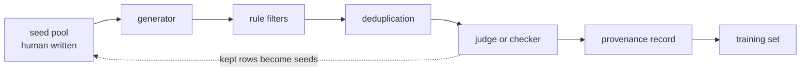

import Infographic from '@site/src/components/Infographic';
import SyntheticFilterLab from '@site/src/components/viz/SyntheticFilterLab';

**In one line.** Synthetic data is a funnel, not a faucet: generating a lot is easy, and the value is in the filters, the deduplication and the record of where each row came from.

:::note Not from a lecture
This chapter is written for this site from the papers and posts under Further reading. The generator in the code is a **stub**: a seeded Python function that imitates a model's habits (new topics, added constraints, copies, refusals). No model or API is called, so the funnel numbers describe the pipeline, not any real generator.
:::

## The idea in plain words

You need ten thousand examples of a task and have two hundred. Synthetic data means asking a model, or a script, to write the rest. It helps when real examples are scarce, private, or missing rare cases, and when you want a particular format. It hurts when the generated rows are repetitive, quietly wrong, or all sound like the same author.

A pipeline has the same few stages every time: **seeds** (a small human-written pool), a **generator** that produces candidates from them, **cheap rule filters**, **deduplication**, a **quality judge**, and a **provenance record** for each survivor. Most of the engineering lives after the generator. A stub that makes six hundred candidates and keeps a sixth shows the shape.

<Infographic src="/img/llme/synthetic-data-generation-pipeline.svg" alt="A five-step funnel from 600 generated rows to 101 kept, a table of where each generation recipe ends up, and a table comparing diversity of human and stub instructions." caption="The funnel and what survives it. Every count and diversity figure is printed by block 1." />

Two failure modes need their own tools: near-duplicates, which waste training and flatter evaluation, and the slow loss of rare cases when models train on their own output.

<Infographic src="/img/llme/synthetic-data-generation-dedup-and-collapse.svg" alt="MinHash and LSH results on 3,004 real instructions, and a toy showing types alive over generations for three data strategies, plus a shrinking Gaussian." caption="Near-duplicate search on real instructions (block 2) and a toy of recursive training (block 3)." />



## How it works

### Generation recipes

**Self-Instruct** (Wang et al., 2022) starts from 175 human-written seed tasks. The model is prompted with a few tasks from the pool and asked for a new instruction; a second step decides whether the task is a classification task; instances are then generated, input first for most tasks, and output first for classification tasks so that the inputs are not biased towards one label. New instructions join the pool only if their ROUGE-L similarity to every existing instruction is below 0.7, and instructions with words such as "image", "picture" or "graph" are dropped because a text model cannot do them. The paper reports over 52,000 instructions and more than 82,000 instances, and that tuning GPT-3 on them gave a 33% absolute improvement on Super-NaturalInstructions, on par with InstructGPT001 on that benchmark.

**Evol-Instruct** (Xu et al., WizardLM, 2023) evolves an existing instruction instead of inventing one. In-depth evolving makes it harder with five operations: add constraints, deepening, concretising, increased reasoning steps and complicating the input. In-breadth evolving writes a new instruction of similar difficulty on a different topic. A final **elimination** step discards failed evolutions: no information gain, a response containing "sorry" and shorter than 80 words, a response that is only punctuation and stop words, or an instruction that copies words from the evolving prompt. The authors evolved instructions from Alpaca to about 250,000 and sampled 70,000 to compare fairly with Vicuna's 70,000.

The stub in block 1 uses the same moves: a *breadth* recipe (new topic), *constraint* and *deepen* recipes (extend an existing row), a *paraphrase*, and four recipes that model typical failures (an exact *copy*, a *short* fragment, a *refusal*, an image request).

### Filtering

| Filter | Cost | Catches | Misses |
| --- | --- | --- | --- |
| Rules (length, banned words, format) | near zero | refusals, fragments, impossible tasks | anything well-formed but wrong |
| Rejection sampling with a checker (unit tests, answer match) | one run per sample | wrong answers where an automatic check exists | tasks with no checker |
| Judge model (LLM-as-judge) | one call per row | vague, unhelpful or off-topic rows | the judge's own biases, which must be tested against human labels |
| Deduplication | hashing or embeddings | repeated and near-repeated rows | rows that are different but equally narrow |

The stub judge in block 1 is a deterministic scoring rule, not a language model: it gives a base score, a point for a sensible length, extra for a constraint or a deepening clause, and a small hash-based wobble. It stands in for a real judge only to show where a judge sits in the funnel. Use a real judge only after you have checked it against human labels on a sample, and look for accidental preferences such as favouring length.

### Duplicates and diversity

Two rows can differ as strings and be the same example. **ROUGE-L** compares the longest common subsequence of words and is what Self-Instruct uses. **MinHash** compares sets of word n-grams (shingles) through a short signature of hashed minima, whose agreement rate estimates the Jaccard overlap; **LSH** puts rows whose signatures agree on a band into the same bucket so only those pairs are compared. Lee et al. (2022) used MinHash on whole documents and exact suffix-array matching on repeated substrings, and found duplicates in all four datasets they studied, including in the validation sets: train-test overlap affected over 4% of the validation set of standard datasets.

Deduplication removes copies, not narrowness. For breadth, measure **distinct-n** (the share of word n-grams that are unique), the **mean pairwise cosine** of sentence embeddings (lower is more varied) and the share of rows that have a neighbour above cosine 0.9.

### Model collapse: what the paper claims

Shumailov et al. (Nature, July 2024) show that *indiscriminate* use of model-generated content in training causes irreversible defects in which the tails of the original distribution disappear. The preprint defines early collapse (losing the tails) and late collapse (modes blur into each other, with small variance). Its language-model experiment fine-tuned OPT-125m on wikitext2 for several generations on the previous generation's output, starting from a model whose perplexity was 34 on real data against a zero-shot 115, and it concludes that access to the original data must be preserved. Gerstgrasser et al. (2024) ask what happens if data *accumulate* instead of being replaced: in their experiments replacing the real data tends towards collapse while accumulating each generation's synthetic data alongside the real data avoids it, and their linear-model analysis gives a finite bound on the error.

The two papers do not contradict each other. They test different data policies. Block 3 is a toy of exactly that difference, on a distribution you can count.

## A real system that works this way

**Cosmopedia** (Hugging Face, March 2024) is a synthetic corpus of over 30 million files and 25 billion tokens generated with Mixtral-8x7B-Instruct-v0.1. The authors fought sameness by prompting for four audiences (young children, high school and college students, researchers) in three styles (textbook, blog post, wikiHow article), and they ran a decontamination pass: 10-gram overlap finds candidate samples, and a sample is discarded when the matched text covers more than half of the benchmark sample, across MMLU, HellaSwag, PIQA and other benchmarks. Diversity here is engineered through the prompt grid, not hoped for.

## Code you can run

Everything runs on CPU, seeded, with the Dolly instruction set (`databricks/databricks-dolly-15k`) as the real text. Its dataset card gives the licence as CC BY-SA 3.0 and says Databricks employees wrote the records and were told not to use generative AI, which is why it serves as the human reference. The generator is the stub described above. Environment: Python 3.14, sentence-transformers 6.1.0, datasets 5.0.1, numpy 2.5.3, scipy.

### 1. The funnel, a provenance record and what diversity survives

```python
import hashlib
import json
import random
from collections import Counter
import numpy as np
from datasets import load_dataset
from sentence_transformers import SentenceTransformer

OPENERS = [
    "Explain how", "Write a short guide to", "Summarise the main ideas behind", "List the common mistakes people make with",
    "Compare two approaches to", "Draft a short email to a colleague about", "Give me a checklist for",
    "Describe to a ten year old why it matters that we understand", "Outline a one-week study plan for",
    "Argue for and against", "Tell me what a newcomer should know about", "Create five quiz questions on",
]
TOPICS = [
    "hash tables", "vaccines", "compound interest", "unit testing", "the water cycle", "binary search",
    "mutexes", "photosynthesis", "version control", "inflation", "database indexing", "the French Revolution",
    "load balancing", "bicycle maintenance", "sleep hygiene", "password managers", "tidal energy", "sourdough baking",
    "the Roman aqueduct", "public key cryptography", "garden composting", "chess openings", "plate tectonics",
    "supply and demand", "gradient descent", "urban cycling", "the printing press", "coral reefs", "time zones",
    "regular expressions", "volcanic islands", "household budgeting", "the immune system", "caching",
    "bird migration", "recycling plastics", "cloud storage", "the Silk Road", "meditation", "solar panels",
]
TAILS = ["", "", "", " in a small team", " for a school project", " on a tight budget", " without jargon", " in plain language"]
CONSTRAINTS = ["Answer in under 80 words.", "Use exactly three bullet points.", "Include one concrete example.",
               "Avoid technical jargon.", "End with a one-line summary.", "Write it as a numbered list."]
DEEPEN = ["Then explain the most common mistake people make.", "Then say how you would test your answer.",
          "Then describe what would change at ten times the scale.", "Then give one counter-argument and answer it."]
SWAPS = [("Explain", "Describe"), ("Write", "Compose"), ("Give me", "Provide"), ("List", "Enumerate"),
         ("Summarise", "Sum up"), ("Draft", "Prepare"), ("Compare", "Contrast")]
SEEDS = [f"{OPENERS[i % 12]} {TOPICS[(7 * i) % 40]}{TAILS[i % 8]}." for i in range(12)]
BAD = ("copy", "short", "refusal", "multimodal")

def make_instruction(rng):
    return f"{rng.choice(OPENERS)} {rng.choice(TOPICS)}{rng.choice(TAILS)}."

def stub_generate(parent, rng):
    kind = rng.choices(["breadth", "constraint", "deepen", "paraphrase", "copy", "short", "refusal", "multimodal"],
                       weights=[40, 12, 15, 8, 7, 6, 6, 6])[0]
    if kind == "breadth":
        return make_instruction(rng), kind
    if kind == "constraint":
        return parent + " " + rng.choice(CONSTRAINTS), kind
    if kind == "deepen":
        return parent + " " + rng.choice(DEEPEN) + " " + rng.choice(CONSTRAINTS), kind
    if kind == "paraphrase":
        for old, new in SWAPS:
            if parent.startswith(old):
                return new + parent[len(old):], kind
        return parent, kind
    if kind == "copy":
        return parent, kind
    if kind == "short":
        return " ".join(parent.split()[:2]), kind
    if kind == "refusal":
        return "Sorry, I cannot help with that request.", kind
    return "Look at the image and describe the graph in detail.", kind

def tokens(text):
    return [t.strip(".,?!").lower() for t in text.split() if t.strip(".,?!")]

def rouge_l(a, b):
    ta, tb = tokens(a), tokens(b)
    prev = [0] * (len(tb) + 1)
    for x in ta:
        cur = [0]
        for j, y in enumerate(tb):
            cur.append(prev[j] + 1 if x == y else max(prev[j + 1], cur[-1]))
        prev = cur
    if prev[-1] == 0:
        return 0.0
    p, r = prev[-1] / len(tb), prev[-1] / len(ta)
    return 2 * p * r / (p + r)

def rule_ok(text):
    return 5 <= len(tokens(text)) <= 40 and not any(w in text.lower() for w in ("image", "picture", "graph", "sorry"))

def stub_judge(text):
    score = 6.0 + (1.0 if 9 <= len(tokens(text)) <= 30 else 0.0)
    score += 1.5 * any(c.lower().rstrip(".") in text.lower() for c in CONSTRAINTS)
    score += 1.0 * any(d.lower().rstrip(".") in text.lower() for d in DEEPEN)
    digest = int(hashlib.sha256(text.encode()).hexdigest(), 16) % 100
    return round(min(10.0, score + (digest - 50) / 50), 2)

rng = random.Random(0)
parents, candidates = list(SEEDS), []
for i in range(600):
    parent = rng.choice(parents)
    text, kind = stub_generate(parent, rng)
    candidates.append({"id": i, "parent": parent, "text": text, "kind": kind})
    if rule_ok(text):
        parents.append(text)

pool, fate = list(SEEDS), Counter()
for c in candidates:
    if not rule_ok(c["text"]):
        c["fate"] = "rule"
    elif max(rouge_l(c["text"], p) for p in pool) >= 0.7:
        c["fate"] = "duplicate"
    elif stub_judge(c["text"]) < 7.0:
        c["fate"] = "judge"
    else:
        c["fate"] = "kept"
        pool.append(c["text"])
    fate[(c["kind"], c["fate"])] += 1

kept = [c for c in candidates if c["fate"] == "kept"]
print(f"generated {len(candidates)}; kept {len(kept)} ({len(kept) / len(candidates):.1%})")
for stage in ("rule", "duplicate", "judge", "kept"):
    print(f"  {stage:9s} {sum(c['fate'] == stage for c in candidates):4d}")
print("\nrecipe        generated  rule  duplicate  judge  kept")
for kind in ("breadth", "constraint", "deepen", "paraphrase", "copy", "short", "refusal", "multimodal"):
    row = [fate[(kind, s)] for s in ("rule", "duplicate", "judge", "kept")]
    print(f"{kind:12s} {sum(row):9d} {row[0]:5d} {row[1]:10d} {row[2]:6d} {row[3]:5d}")
print("known-bad recipes among the kept rows:", sum(c["kind"] in BAD for c in kept))

record = {"text": kept[0]["text"], "generator": "stub_generate v0", "parent": kept[0]["parent"],
          "judge_score": stub_judge(kept[0]["text"]), "sha256": hashlib.sha256(kept[0]["text"].encode()).hexdigest()[:16]}
print("\nprovenance record for the first kept row:")
print(json.dumps(record, indent=2))

human = [r["instruction"] for r in load_dataset("databricks/databricks-dolly-15k", split="train").shuffle(seed=0)][:600]
model = SentenceTransformer("sentence-transformers/all-MiniLM-L6-v2")

def distinct2(texts):
    grams = [tuple(w[i:i + 2]) for t in texts for w in [tokens(t)] for i in range(len(w) - 1)]
    return len(set(grams)) / len(grams)

def spread(texts):
    e = model.encode(texts, normalize_embeddings=True, batch_size=64)
    sim = e @ e.T
    nearest = (sim - 2 * np.eye(len(texts))).max(1)
    return sim[np.triu_indices(len(texts), 1)].mean(), (nearest > 0.9).mean()

print("\nset                          rows  distinct-2  mean pairwise cosine  rows with a neighbour above 0.9")
for label, texts in (("human instructions (Dolly)", human), ("stub, all candidates", [c["text"] for c in candidates]),
                     ("stub, kept after filters", [c["text"] for c in kept]), ("human, same size as kept", human[:len(kept)])):
    cos, near = spread(texts)
    print(f"{label:27s} {len(texts):4d} {distinct2(texts):10.3f} {cos:21.3f} {near:32.3f}")
```

Read the funnel first. Of 600 candidates, the rules drop 130 (every short fragment, refusal and image request), the 0.7 ROUGE-L filter drops 281 as duplicates (including 34 of 40 exact copies; the other 6 fail the judge) and the judge drops 88, leaving 101 rows or 16.8%. None of the four known-bad recipes survives. Now read the diversity table. The raw stub output is very narrow: distinct-2 of 0.069 and 73.7% of rows with a neighbour above cosine 0.9, against 0.733 and 0.7% for 600 real Dolly instructions. Filtering helps (distinct-2 0.187, near-neighbours 9.9%), but the survivors are mostly constraint and deepening variants that share long suffixes, so their mean pairwise cosine goes *up* from 0.174 to 0.249, and human text of the same size is far wider (0.850 and 0.056). A funnel removes junk and copies. It does not create breadth the generator never had.

The lab replays this exact run for other thresholds. Its defaults (judge 7.0, ROUGE-L 0.70) give 130, 281, 88 and 101 rows, distinct-2 0.187 and mean cosine 0.249, as printed.

<SyntheticFilterLab />

### 2. MinHash and LSH on real instructions

Three thousand Dolly instructions plus four planted near-copies. Exact Jaccard is computed for every pair with a sparse matrix product so the estimate can be checked.

```python
import itertools
import re
import numpy as np
from datasets import load_dataset
from scipy.sparse import csr_matrix

data = load_dataset("databricks/databricks-dolly-15k", split="train").shuffle(seed=0)
real = [r["instruction"] for r in data][:3000]
planted = [(10, real[10]), (20, real[20] + " Please."), (30, real[30]), (60, real[60] + " Thanks!")]
real += [text for _, text in planted]
print("instructions (Dolly sample of 3,000 plus 4 planted near-copies):", len(real))

def shingles(text, k=3):
    words = re.findall(r"[a-z0-9']+", text.lower())
    if len(words) < k:
        return {" ".join(words)}
    return {" ".join(words[i:i + k]) for i in range(len(words) - k + 1)}

sets = [shingles(t) for t in real]
vocab = {}
rows, cols = [], []
for i, sh in enumerate(sets):
    for s in sh:
        rows.append(i)
        cols.append(vocab.setdefault(s, len(vocab)))
X = csr_matrix((np.ones(len(rows)), (rows, cols)), shape=(len(real), len(vocab)))
inter = (X @ X.T).toarray()
size = np.asarray(X.sum(1)).ravel()
union = size[:, None] + size[None, :] - inter
exact = np.divide(inter, union, out=np.zeros_like(inter), where=union > 0)
upper = np.triu_indices(len(real), 1)
exact_pairs = exact[upper]

PRIME = (1 << 61) - 1
NUM_PERM = 128
rng = np.random.default_rng(0)
A = [int(v) for v in rng.integers(1, PRIME, NUM_PERM, dtype=np.uint64)]
B = [int(v) for v in rng.integers(0, PRIME, NUM_PERM, dtype=np.uint64)]

def stable_hash(s):
    h = 1469598103934665603
    for ch in s.encode():
        h = ((h ^ ch) * 1099511628211) & 0xFFFFFFFFFFFFFFFF
    return h % PRIME

def minhash(sh):
    hashes = [stable_hash(s) for s in sh]
    return np.array([min((a * h + b) % PRIME for h in hashes) for a, b in zip(A, B)], dtype=np.uint64)

sigs = np.stack([minhash(s) for s in sets])
agree = np.zeros(len(exact_pairs))
for start in range(0, len(exact_pairs), 500000):
    i, j = upper[0][start:start + 500000], upper[1][start:start + 500000]
    agree[start:start + 500000] = (sigs[i] == sigs[j]).mean(1)
sampled = np.random.default_rng(1).choice(len(exact_pairs), 4000, replace=False)
print(f"128-permutation MinHash against exact Jaccard, 4,000 random pairs: mean absolute error {np.abs(agree[sampled] - exact_pairs[sampled]).mean():.4f}")
hot = np.flatnonzero(exact_pairs >= 0.3)
print(f"on the {len(hot)} pairs with exact Jaccard of at least 0.3: mean absolute error {np.abs(agree[hot] - exact_pairs[hot]).mean():.4f}")

BANDS, ROWS = 32, 4
buckets = {}
for idx in range(len(real)):
    for b in range(BANDS):
        buckets.setdefault((b, tuple(sigs[idx, b * ROWS:(b + 1) * ROWS].tolist())), []).append(idx)
candidate = set()
for members in buckets.values():
    if 1 < len(members) <= 50:
        candidate.update(itertools.combinations(members, 2))
print(f"LSH with {BANDS} bands of {ROWS} rows compared {len(candidate):,} pairs instead of {len(exact_pairs):,}")
print("\nexact Jaccard    pairs   found by LSH   recall")
for lo, hi in ((0.5, 0.6), (0.6, 0.8), (0.8, 1.01)):
    idx = np.flatnonzero((exact_pairs >= lo) & (exact_pairs < hi))
    found = sum((int(upper[0][k]), int(upper[1][k])) in candidate for k in idx)
    print(f"{lo:.1f} to {min(hi, 1.0):.1f}    {len(idx):5d}   {found:12d}   {found / len(idx):.3f}")

def survivors(threshold):
    removed = np.zeros(len(real), dtype=bool)
    for i in range(len(real)):
        if not removed[i]:
            removed |= (exact[i] >= threshold) & (np.arange(len(real)) > i)
    return int((~removed).sum())

for t in (0.9, 0.7, 0.5):
    print(f"keep one row per cluster above Jaccard {t}: {survivors(t)} of {len(real)} remain")
for (i, _), j in zip(planted, range(3000, 3004)):
    print(f"planted copy of row {i}: exact Jaccard {exact[i, j]:.2f}, MinHash estimate {np.mean(sigs[i] == sigs[j]):.2f}")
```

The 128-permutation signature estimates Jaccard well: a mean error of 0.0002 on random pairs, 0.0324 on the pairs that matter (exact overlap of at least 0.3). LSH with 32 bands of 4 rows compares 2,003 pairs instead of 4.5 million and still finds every pair above 0.8 and 98.8% of those between 0.6 and 0.8, but only 89.9% between 0.5 and 0.6. That is the S-shaped trade of banding: choose bands and rows from the threshold you care about. The data itself repeats: Dolly has templates ("Identify which instrument is string or percussion: ..."), and keeping one row per cluster above Jaccard 0.5 shrinks 3,004 rows to 2,849. Real instruction sets are not as clean as they look.

### 3. A toy of recursive training

A distribution of 200 types with Zipf weights, resampled and refitted each generation from 500 samples. This is not a language model: it isolates the sampling error that the paper's discrete analysis blames for losing the tails.

```python
import numpy as np

TYPES, M, GENERATIONS, RUNS = 200, 500, 30, 40
weights = 1.0 / np.arange(1, TYPES + 1)
real = weights / weights.sum()
entropy = lambda p: float(-(p[p > 0] * np.log(p[p > 0])).sum())
print(f"real distribution: {TYPES} types with Zipf weights, entropy {entropy(real):.3f} nats")
print(f"the rarest 100 types hold {real[100:].sum():.3f} of the probability")

def simulate(strategy, seed):
    rng = np.random.default_rng(seed)
    p = real.copy()
    pool = rng.multinomial(M, real).astype(float)
    alive, ent = [], []
    for _ in range(GENERATIONS):
        sample = rng.multinomial(M, p).astype(float)
        if strategy == "replace":
            p = sample / sample.sum()
        elif strategy == "accumulate":
            pool = pool + sample
            p = pool / pool.sum()
        else:
            fresh = rng.multinomial(M // 10, real).astype(float)
            p = 0.9 * sample / sample.sum() + 0.1 * fresh / fresh.sum()
        alive.append(int((p > 0).sum()))
        ent.append(entropy(p))
    return alive, ent

print("\nstrategy                                      types alive after generation 1, 10, 30    entropy after 30")
for strategy, label in (("replace", "train only on the last model's samples"),
                        ("accumulate", "keep real data and every generation"),
                        ("mix", "mix in 10% fresh real data each time")):
    alive, ent = (np.mean(x, axis=0) for x in zip(*(simulate(strategy, s) for s in range(RUNS))))
    print(f"{label:44s} {alive[0]:6.1f} {alive[9]:6.1f} {alive[29]:6.1f}            {ent[29]:.3f}")

print("\nGaussian refitted from 20 samples each generation, 200 runs")
sigma = np.zeros((200, 51))
for r in range(200):
    rr = np.random.default_rng(r)
    mu, s = 0.0, 1.0
    sigma[r, 0] = s
    for g in range(1, 51):
        x = rr.normal(mu, s, 20)
        mu, s = x.mean(), x.std()
        sigma[r, g] = s
print("generation  mean sigma  median sigma")
for g in (0, 10, 20, 50):
    print(f"{g:10d}  {sigma[:, g].mean():10.3f}  {np.median(sigma[:, g]):12.3f}")
```

When each generation trains only on the previous one's samples, the number of types still alive falls from 126.2 after the first generation to 46.2 after ten and 21.5 after thirty, and entropy drops from 4.149 to 2.634 nats. Keeping the real data and every generation stops the loss (162.4 types alive, entropy 3.962) but cannot bring back types the real sample never contained: even the first 500-row real sample misses about 38 of the 200. Mixing 10% fresh real data each round settles at about 82 types, between the two. The Gaussian refit shows the late-collapse picture: the fitted standard deviation falls from 1.0 to 0.126 on average after 50 generations. These are a small toy with fixed settings, not a prediction for any model.

## Designing with it

1. **Seed well.** The generator inherits the seeds' range. Spend human effort on a small, varied seed set and watch which recipes grow it.
2. **Order the filters by cost.** Rules first, then deduplication, then the expensive judge, so the judge sees fewer rows.
3. **Pick thresholds on your data.** A ROUGE-L threshold of 0.7 works for Self-Instruct; on short, template-heavy instructions it removes most variants. Use the lab idea: sweep, then look at the kept rows.
4. **Measure diversity, not just volume.** Track distinct-n, mean pairwise cosine and the near-duplicate share for every batch.
5. **Keep real data in the mix** and evaluate on real held-out data, never only on synthetic rows.
6. **Decontaminate against your evaluation sets** with n-gram overlap, as the Cosmopedia authors did, and deduplicate the evaluation sets too.
7. **Write a provenance record per row:** the generator and its version, the seed or parent, the filters passed, the judge score and a hash. Check the generator's terms of use before training on its output (see [knowledge distillation](/docs/llm-engineering/knowledge-distillation)).

**Failure modes to name**

- *Narrow but unique:* every row differs and all of them say the same thing (block 1, mean cosine up after filtering).
- *Judge drift:* a judge that prefers long answers trains your model to ramble.
- *Evaluation leakage:* generated training rows that echo benchmark items.
- *Recursive degradation:* generating from a model trained on the previous model's output with no fresh real data.

## Where this stands in 2026

:::info Industry view

- **Synthetic data is routine for instruction tuning and for pre-training mixtures.** Self-Instruct and Evol-Instruct (2022 and 2023) set the pattern, and Cosmopedia (2024) shows a very large generated corpus with a deliberate prompt grid and decontamination.
- **The collapse debate is about data policy.** The Nature paper warns about indiscriminate recursive training; the accumulation study shows that keeping real data alongside synthetic data avoids it in its settings. Practical guidance is to keep a real-data anchor, not to avoid synthetic data.
- **Deduplication is a quality lever on its own.** Lee et al. found duplicates in every dataset they studied and that deduplication reduced verbatim memorised output tenfold.
- **Provenance and terms of use are engineering requirements** wherever a hosted model generated the rows.

:::

## Practice questions

<details>
<summary><strong>Q1.</strong> Why does Self-Instruct drop a new instruction when its ROUGE-L similarity to an existing one is 0.7 or more?</summary>

A generator happily rephrases what it has already produced. Without a similarity check the pool fills with near-copies, training time is wasted and the data looks larger than it is. The threshold keeps only instructions that are different enough from everything already kept.<br /><em>Authored · conceptual</em>

</details>

<details>
<summary><strong>Q2.</strong> In block 1 the filters raise distinct-2 from 0.069 to 0.187 but the mean pairwise cosine rises from 0.174 to 0.249. Reconcile the two.</summary>

Deduplication removed many repeated rows, so the share of distinct bigrams rose. The survivors, though, are mostly constraint and deepening variants of a few parents and share long clauses, so on average they sit closer together in embedding space than the unfiltered mixture did. Distinct-n counts unique wording; mean cosine measures overall closeness in meaning. Both are needed.<br /><em>Authored · interpretation</em>

</details>

<details>
<summary><strong>Q3.</strong> You must find near-duplicates among 50 million documents. Why not compare every pair, and what does MinHash with LSH change?</summary>

Pairwise comparison grows with the square of the number of documents. MinHash compresses each document into a short signature whose agreement rate estimates Jaccard similarity, and LSH hashes bands of the signature into buckets so that only documents sharing a bucket are compared. Block 2 compared 2,003 pairs instead of 4.5 million and recovered all pairs above 0.8.<br /><em>Authored · applied</em>

</details>

<details>
<summary><strong>Q4.</strong> A colleague says the Nature paper proves synthetic data ruins models. Is that what it shows?</summary>

No. It shows that indiscriminate, recursive training on model output makes the tails of the distribution vanish. Later work that accumulates synthetic data alongside real data finds collapse avoided in its settings. The conclusion is about data policy: keep real data in the mix and track provenance.<br /><em>Authored · interpretation</em>

</details>

<details>
<summary><strong>Q5.</strong> Your judge scores long answers higher and your kept set gets longer each round. What do you check and change?</summary>

Correlate the judge's scores with answer length on a sample, and compare them with human labels. If length drives the score, normalise for length, add a length-controlled criterion or switch to a checker where one exists, and re-run the filter so the next round does not amplify the bias.<br /><em>Authored · applied</em>

</details>

## Further reading

- [Wang et al., "Self-Instruct: Aligning Language Models with Self-Generated Instructions" (ACL 2023)](https://arxiv.org/abs/2212.10560): the pipeline, the ROUGE-L filter and the 52,000-instruction dataset.
- [Xu et al., "WizardLM: Empowering Large Pre-Trained Language Models to Follow Complex Instructions" (ICLR 2024)](https://arxiv.org/abs/2304.12244): Evol-Instruct and elimination evolving.
- [Shumailov et al., "AI models collapse when trained on recursively generated data" (Nature, 2024)](https://www.nature.com/articles/s41586-024-07566-y) and the [earlier preprint](https://arxiv.org/abs/2305.17493): early and late collapse and the discrete analysis behind block 3.
- [Gerstgrasser et al., "Is Model Collapse Inevitable?" (2024)](https://arxiv.org/abs/2404.01413): accumulating real and synthetic data.
- [Lee et al., "Deduplicating Training Data Makes Language Models Better" (2022)](https://arxiv.org/abs/2107.06499): MinHash and suffix-array deduplication.
- [Hugging Face, "Cosmopedia: how to create large-scale synthetic data for pre-training"](https://huggingface.co/blog/cosmopedia): a prompt grid, decontamination and deduplication in practice.
- [Databricks Dolly 15k dataset card](https://huggingface.co/datasets/databricks/databricks-dolly-15k): the real instruction text used in blocks 1 and 2.
- Related chapters on this site: [knowledge distillation](/docs/llm-engineering/knowledge-distillation), [tuning embedding models and rerankers](/docs/llm-engineering/tuning-embedding-models-and-rerankers), [LLM evaluation methods](/docs/llm-evals/llm-eval-methods).

## Check yourself

- I can describe the stages of a synthetic-data pipeline and say which are cheap and which are expensive.
- I can explain how Self-Instruct and Evol-Instruct generate and filter instructions.
- I can implement ROUGE-L and MinHash deduplication and explain what bands and rows trade off in LSH.
- I can measure diversity with distinct-n, mean pairwise cosine and the near-duplicate share, and explain why filtering does not guarantee breadth.
- I can state what the model-collapse papers claim and why replacing and accumulating data behave differently.
- I can write a provenance record and name the licence and contamination checks to run before training.
