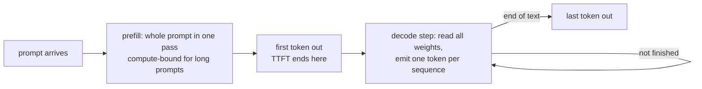

import Infographic from '@site/src/components/Infographic';
import RooflineLab from '@site/src/components/viz/RooflineLab';

**In one line.** Generating one token means streaming every weight of the model out of memory to do almost no arithmetic with it, so the cost of a decode step is set by memory bandwidth, and the cheapest way to use the idle compute is to serve many sequences in the same step.

:::note Not from a lecture
This chapter was written for this site from the sources under Further reading. Hardware figures are quoted from the NVIDIA H100 product page as fetched on 2 October 2026, and every other number is printed by the code below.
:::

## The idea in plain words

A language model answers in two very different phases.

**Prefill** reads your whole prompt at once. All the prompt tokens go through the network together as one big matrix multiplication, so the GPU's arithmetic units are busy and the weights, once loaded, are reused for every token in the prompt.

**Decode** then writes the answer one token at a time. Each new token needs a full pass through the network, but it carries only one new row of numbers. To multiply that single row by a weight matrix, the hardware must still read the entire matrix from memory. Read 16 gigabytes of weights, do a few billion multiplications, throw the weights away, and repeat for the next token.

Think of a chef with a huge pantry and one pan. Prefill is cooking for a banquet: one trip to the pantry feeds a hundred plates. Decode for a single user is cooking one omelette per trip. The chef is not slow at cooking, the chef is slow at walking. The fix is not a faster pan but more omelettes per trip, which is what batching does.

The measure that captures this is **arithmetic intensity**: floating-point operations performed per byte moved from memory. Every chip has a **ridge point**, the intensity at which it stops waiting for memory and starts being limited by arithmetic. Below the ridge the job is **memory-bound**, above it **compute-bound**. The picture of that limit is called the **roofline**.

<Infographic src="/img/llme/why-decoding-is-memory-bound-roofline.svg" alt="A roofline chart with the batch 1 decode point far left on the memory slope and the ridge at 295 FLOP per byte, beside a table of decode step time, tokens per second and compute utilisation for seven batch sizes." caption="The roofline for Llama 3.1 8B in bf16 on the H100 SXM figures. Every number is printed by block 1 below." />

<Infographic src="/img/llme/why-decoding-is-memory-bound-metrics.svg" alt="A request timeline of one prefill step then many decode steps, the definitions of TTFT, TPOT, latency and throughput, a table of latency and throughput against batch size, and the CPU measurements of prefill against decode." caption="What users feel and what operators pay for. The table is block 4 and the CPU strip is blocks 2 and 3." />



## How it works

### The cost of one forward pass

For a model with $P$ parameters, one token costs about $2P$ floating-point operations: one multiply and one add per weight. A batch of $B$ tokens costs $2PB$. The weights are read once per forward pass whatever the batch, so the bytes moved are $P \cdot b$ where $b$ is bytes per parameter (2 for bf16, 1 for int8, 0.5 for 4-bit). Ignoring the attention cache for the moment, the arithmetic intensity of a decode step is

$$I = \frac{2PB}{P\,b} = \frac{2B}{b}$$

The parameters cancel. In bf16 the intensity of a decode step is simply the batch size, 1 FLOP per byte at batch 1.

### The roofline

A chip has a peak arithmetic rate $F$ (FLOP/s) and a memory bandwidth $M$ (bytes/s). A step needs at least $\text{FLOPs}/F$ seconds of arithmetic and at least $\text{bytes}/M$ seconds of data movement, and it cannot finish before the larger of the two:

$$t_{\text{step}} = \max\!\left(\frac{2PB}{F},\ \frac{P\,b}{M}\right)$$

The two terms are equal at the ridge, $I^{*} = F / M$. For the H100 SXM figures used here, $F = 989.5$ TFLOP/s dense bf16 and $M = 3.35$ TB/s, so $I^{*} = 295.4$ FLOP per byte. A bf16 decode step reaches that intensity only at a batch of about 295. Below it, the step time does not change with the batch at all: **a batch of 64 costs the same wall-clock time as a batch of 1, and delivers 64 times the tokens.**

Two knobs move the ridge in practice. Quantising weights to int8 or int4 shrinks $b$, so the same intensity is reached at half or a quarter of the batch (block 1 prints 148 and 74), and the step at batch 1 gets proportionally shorter because there are fewer bytes to read. A chip with more bandwidth relative to its arithmetic has a lower ridge and is easier to keep busy.

### The four numbers people quote

| Metric | Meaning | Mostly decided by |
| --- | --- | --- |
| **TTFT**, time to first token | request arrives until the first token is produced | queueing plus prefill time |
| **TPOT**, time per output token | gap between successive tokens for one user | decode step time |
| **Latency** | TTFT plus TPOT times the number of later tokens | both of the above |
| **Throughput** | output tokens per second across all users | batch size times step rate |

Databricks' engineering write-up uses the same definitions and adds one more, **model bandwidth utilisation (MBU)**: achieved memory bandwidth divided by peak bandwidth. Because decode is memory-bound, MBU is the efficiency number that matters, much as MFU (the share of peak FLOPs) is for training.

### Why the batch is not quite free

Weights are shared by the whole batch but the **KV cache**, the stored attention keys and values for each sequence, is not. Every sequence in the batch adds its own cache to the bytes read each step. Block 4 uses the real Llama 3.1 8B config to size that cache, 128 KiB per token, and shows the consequence: at batch 128 the step is 8.00 ms rather than 4.79 ms, and throughput rises 77 times instead of 128. The next chapter is about this term.

### Prefill is compute-bound only when the prompt is long enough

Prefill is a decode step with $B$ replaced by the prompt length $T$. Short prompts are still memory-bound, because the weights are read once for few tokens: block 1 shows 16 and 128 tokens both costing 4.79 ms. Past 295 tokens the time grows linearly with the prompt, and a 2,048-token prompt takes 33.24 ms. This is why long prompts and chat turns compete for the same chip: a prefill is a short burst of heavy arithmetic that the decode steps of other users must wait behind, a problem the batching chapter returns to.

## A real system that works this way

**Databricks' LLM inference performance write-up** gives measured numbers that follow this model. It defines MBU and works one example: a 7-billion-parameter model moving 14 GB of parameters in 14 ms per token achieves 1 TB/s, which is 50 per cent MBU on hardware with 2 TB/s of peak bandwidth. Its measurements on a single A100 report that moving from batch size 1 to 64 raised throughput 14 times while latency rose about 4 times. Those are their measurements on their stack, not a law: they show the shape that block 4 predicts, throughput growing much faster than latency, and the gap to the ideal 64 times is the KV-cache and scheduling cost that the simple model leaves out.

**FlashAttention** is the same idea applied inside one operator. Its paper observes that standard attention is limited by reads and writes between GPU high-bandwidth memory and on-chip SRAM, and cuts that traffic by tiling the computation while keeping the result exact. The speedup comes from moving fewer bytes, not from doing fewer operations.

## Code you can run

Four blocks. The first and fourth are arithmetic on named parameters, so they are exact and deterministic. The second and third time real code on this machine, so their numbers change slightly from run to run: read them for their shape. All run on CPU in a few seconds after the first download of the config and model.

### 1. A roofline calculator with named hardware

Hardware is a named record, not a hidden constant. The H100 figures are the ones quoted on NVIDIA's product page on 2 October 2026: 3.35 TB/s of bandwidth and 1,979 TFLOP/s for FP16 and BF16 Tensor Core, which the page marks as the figure with sparsity. NVIDIA's datasheet footnote says specifications are one half lower without sparsity, so the dense figure used here is 989.5 TFLOP/s. The parameter count is read from the model's real config on the Hub by building the model on the `meta` device, which allocates nothing.

```python
import torch
from dataclasses import dataclass
from transformers import AutoConfig, AutoModelForCausalLM


@dataclass(frozen=True)
class Hardware:
    name: str
    peak_flops: float
    bandwidth: float

    @property
    def ridge(self):
        return self.peak_flops / self.bandwidth


H100_SXM = Hardware("H100 SXM", peak_flops=989.5e12, bandwidth=3.35e12)


def count_parameters(repo):
    config = AutoConfig.from_pretrained(repo)
    with torch.device("meta"):
        model = AutoModelForCausalLM.from_config(config)
    return sum(p.numel() for p in model.parameters())


def decode_step(hw, params, bytes_per_param, batch):
    flops = 2 * params * batch
    traffic = params * bytes_per_param
    t_compute = flops / hw.peak_flops
    t_memory = traffic / hw.bandwidth
    t = max(t_compute, t_memory)
    return {
        "intensity": flops / traffic,
        "step_ms": t * 1e3,
        "tokens_per_s": batch / t,
        "compute_util": t_compute / t,
        "bound": "compute" if t_compute > t_memory else "memory",
    }


def prefill(hw, params, bytes_per_param, prompt_tokens):
    flops = 2 * params * prompt_tokens
    traffic = params * bytes_per_param
    t = max(flops / hw.peak_flops, traffic / hw.bandwidth)
    return t * 1e3


params = count_parameters("NousResearch/Meta-Llama-3.1-8B")
print(f"Llama 3.1 8B parameters from the Hub config: {params / 1e9:.3f} B")
print(f"{H100_SXM.name}: ridge point {H100_SXM.ridge:.1f} FLOP per byte")
print()
print("decode, bf16 weights (2 bytes per parameter), one step produces one token per sequence")
print("batch  intensity  step_ms  tokens/s  compute_util  bound")
for batch in [1, 8, 32, 64, 128, 295, 512]:
    r = decode_step(H100_SXM, params, 2, batch)
    print(f"{batch:5d}  {r['intensity']:9.1f}  {r['step_ms']:7.2f}  {r['tokens_per_s']:8.0f}  {r['compute_util']:12.3f}  {r['bound']}")
print()
print("ridge batch by weight format (batch at which decode stops being memory-bound)")
for label, nbytes in [("bf16", 2), ("int8", 1), ("int4", 0.5)]:
    print(f"{label}: batch {H100_SXM.ridge * nbytes / 2:.0f}")
print()
print("prefill time lower bound, one request, bf16")
for tokens in [16, 128, 512, 2048]:
    print(f"prompt {tokens:5d} tokens: {prefill(H100_SXM, params, 2, tokens):7.2f} ms")
```

The table is the roofline in numbers. Decode time is flat at 4.79 ms, which is 16.06 GB of bf16 weights divided by 3.35 TB/s, from batch 1 to batch 295, and the batch-1 upper bound is 209 tokens per second. Compute utilisation at batch 1 is 0.003: **the chip's arithmetic units are idle 99.7 per cent of the time.** At batch 512 the step becomes compute-bound at 8.31 ms. The lab below is the same calculation with sliders. Its default of 8.03 billion parameters is the rounded count, so its tokens-per-second column can differ from the code's in the last digit.

<RooflineLab />

### 2. The same shape on this machine

A real matrix multiplication shows the shape without any model. One 8192 by 8192 fp32 layer is 268 MB, and the loop feeds it batches of vectors. Starting at batch 2 avoids the batch-1 case, which ran markedly faster per byte in my tests, presumably through a matrix-vector kernel.

```python
import time
import torch

torch.manual_seed(0)


def fastest(fn, repeats=7):
    fn()
    times = []
    for _ in range(repeats):
        start = time.perf_counter()
        fn()
        times.append(time.perf_counter() - start)
    return min(times)


source = torch.randn(64 * 1024 * 1024)
target = torch.empty_like(source)
seconds = fastest(lambda: target.copy_(source))
bandwidth = 2 * source.numel() * 4 / seconds
a = torch.randn(4096, 4096)
b = torch.randn(4096, 4096)
seconds = fastest(lambda: a @ b, 5)
peak = 2 * 4096**3 / seconds
print(f"this machine: copy bandwidth {bandwidth / 1e9:.0f} GB/s, fp32 matmul {peak / 1e9:.0f} GFLOP/s")
print(f"ridge point {peak / bandwidth:.1f} FLOP per byte")
print()

weights = torch.randn(8192, 8192)
print("one 8192 x 8192 fp32 layer (268 MB), batch of vectors through it")
print("batch  ms_per_step  rows/s    GFLOP/s")
rows = {}
with torch.inference_mode():
    for batch in [2, 4, 8, 16, 32, 64, 128, 256, 512]:
        x = torch.randn(batch, 8192)
        seconds = fastest(lambda: torch.nn.functional.linear(x, weights))
        rows[batch] = seconds
        print(f"{batch:5d}  {seconds * 1e3:11.1f}  {batch / seconds:7.0f}  {2 * batch * 8192**2 / seconds / 1e9:9.0f}")
print(f"batch 2 to batch 32: step time x{rows[32] / rows[2]:.2f}, rows per second x{(32 / rows[32]) / (2 / rows[2]):.1f}")
```

On the run printed above, the machine copies memory at about 116 GB/s and multiplies fp32 matrices at about 1,429 GFLOP/s, a ridge of 12.4 FLOP per byte. Going from batch 2 to batch 32 changes the step time by only 4 per cent and delivers 15.3 times as many rows per second. Then the curve bends: by batch 512 the step takes 57 ms and the layer is limited by arithmetic. The bandwidth this kernel reaches at small batches is below the copy bandwidth, a property of this CPU's kernel, so trust the flat-then-rising shape and not the gigabytes per second.

### 3. A real model, prefill against decode

SmolLM2-135M-Instruct in fp32, with a 128-token cache already in place for the decode rows. `cache.crop(-1)` removes the token each step just added so the cache length stays fixed.

```python
import time
import torch
from transformers import AutoModelForCausalLM

torch.manual_seed(0)
name = "HuggingFaceTB/SmolLM2-135M-Instruct"
model = AutoModelForCausalLM.from_pretrained(name, dtype=torch.float32).eval()
vocab = model.config.vocab_size


def fastest(fn, repeats=5):
    fn()
    times = []
    for _ in range(repeats):
        start = time.perf_counter()
        fn()
        times.append(time.perf_counter() - start)
    return min(times)


with torch.inference_mode():
    print("prefill: the whole prompt in one forward pass")
    print("prompt_tokens  ms     tokens/s")
    prefill_rate = {}
    for tokens in [8, 32, 128, 512]:
        ids = torch.randint(0, vocab, (1, tokens))
        seconds = fastest(lambda: model(ids, use_cache=True))
        prefill_rate[tokens] = tokens / seconds
        print(f"{tokens:13d}  {seconds * 1e3:5.1f}  {tokens / seconds:8.0f}")

    print()
    print("decode: one new token per sequence, 128 tokens already cached")
    print("batch  ms_per_step  tokens/s")
    decode_rate = {}
    for batch in [1, 4, 8, 16, 32, 64]:
        ids = torch.randint(0, vocab, (batch, 128))
        cache = model(ids, use_cache=True).past_key_values
        new = torch.randint(0, vocab, (batch, 1))

        def step():
            model(new, past_key_values=cache, use_cache=True)
            cache.crop(-1)

        seconds = fastest(step, 7)
        decode_rate[batch] = batch / seconds
        print(f"{batch:5d}  {seconds * 1e3:11.1f}  {batch / seconds:8.0f}")

print()
print(f"prefill at 512 tokens runs {prefill_rate[512] / decode_rate[1]:.0f}x faster per token than decode at batch 1")
print(f"decode at batch 32 delivers {decode_rate[32] / decode_rate[1]:.1f}x the tokens per second of batch 1")
```

Prefill handles the 512-token prompt at about 2,837 tokens per second. Decode at batch 1 produces about 76 tokens per second, so prefill is roughly 37 times faster per token, the memory-bound versus compute-bound gap in a real model. Across the runs I made while writing, the prefill-to-decode ratio ranged from 31 to 37 and the batch-32 gain from 7 to 11 times, so quote the shape and not the digits. Growing the decode batch to 32 delivers 10.7 times the single-sequence rate, because the weights are read once per step whatever the batch. The curve is less clean than block 1 because a 135M model on a CPU pays overheads that a GPU serving an 8B model does not, such as Python and per-layer launches, but the ordering is the same.

### 4. TTFT, TPOT, latency and throughput, with the KV cache

This block adds the term block 1 ignored. The KV cache per token is $2 \times \text{layers} \times \text{KV heads} \times \text{head dimension} \times 2$ bytes, read from the Llama 3.1 8B config. Each decode step now moves the weights plus every sequence's cache.

```python
import json

from huggingface_hub import hf_hub_download

PEAK_FLOPS = 989.5e12
BANDWIDTH = 3.35e12
PARAMS = 8.030e9
BYTES_PER_PARAM = 2

config = json.load(open(hf_hub_download("NousResearch/Meta-Llama-3.1-8B", "config.json")))
head_dim = config["hidden_size"] // config["num_attention_heads"]
kv_bytes_per_token = 2 * config["num_hidden_layers"] * config["num_key_value_heads"] * head_dim * 2
print(f"KV cache per token from the config: {kv_bytes_per_token} bytes ({kv_bytes_per_token / 1024:.0f} KiB)")


def step_seconds(batch, context):
    flops = 2 * PARAMS * batch
    traffic = PARAMS * BYTES_PER_PARAM + batch * context * kv_bytes_per_token
    return max(flops / PEAK_FLOPS, traffic / BANDWIDTH)


def prefill_seconds(tokens):
    return max(2 * PARAMS * tokens / PEAK_FLOPS, PARAMS * BYTES_PER_PARAM / BANDWIDTH)


prompt, output = 512, 256
average_context = prompt + output / 2
ttft = prefill_seconds(prompt)
print(f"prompt {prompt} tokens, {output} new tokens, average context {average_context:.0f}")
print(f"TTFT lower bound: {ttft * 1e3:.2f} ms")
print()
print("batch  TPOT_ms  latency_s  throughput_tok/s  vs_batch_1")
base = None
for batch in [1, 8, 32, 64, 128]:
    tpot = step_seconds(batch, average_context)
    latency = ttft + tpot * (output - 1)
    throughput = batch * output / latency
    base = base or throughput
    print(f"{batch:5d}  {tpot * 1e3:7.2f}  {latency:9.3f}  {throughput:16.0f}  {throughput / base:9.1f}x")
```

Latency barely moves between batch 1 and batch 8 (1.237 s to 1.282 s) while throughput rises 7.7 times. At batch 128 the cache traffic is 128 sequences times 640 tokens times 128 KiB, about 10.7 GB against 16.06 GB of weights, the step is 8.00 ms, and a user waits 2.048 s instead of 1.237 s. That is the throughput-versus-latency trade in one table: you buy 77 times the throughput with a 66 per cent longer wait. These are lower bounds from the roofline, with no queueing, no scheduling gaps and no communication, so real systems do worse and the table is best read as a ceiling.

## Designing with it

- **Find the bound before optimising.** At low batch, make the model smaller to read: quantise the weights, use fewer KV heads, or add bandwidth. Adding FLOPs does nothing. At high batch, the remedies reverse.
- **Report MBU, not just tokens per second.** A decode step that moves 16 GB in 8 ms is at about 60 per cent of an H100's 3.35 TB/s regardless of how fast the throughput number looks.
- **Batch is the main lever, and memory caps it.** The ridge batch is often hundreds, but KV cache memory usually runs out first. Chapters 2 and 3 are the two halves of that story.
- **Separate the latency targets.** TTFT depends on prefill and queueing, TPOT on the decode step. A chatbot cares about both, a batch summariser only about throughput, and they call for different batch sizes.
- **Quote hardware with the date and the precision.** The same datasheet row can be sparse or dense, bf16 or FP8, and the wrong one shifts the ridge by a factor of two or more.

## Where this stands in 2026

:::info Industry view

- Serving engines now treat the two phases separately. vLLM's documentation states that its V1 scheduler prioritises decode requests and that chunked prefill is enabled by default where possible, with `max_num_batched_tokens` as the knob: lower values give better inter-token latency, higher values better time to first token.
- Because decode is memory-bound, fewer bytes per weight is a direct lever. Hugging Face's inference guide also cautions that quantisation can slightly raise latency, because of the extra quantise and dequantise step, with AWQ and fused AWQ modules as the exceptions it names. The format and the kernel matter together, which chapter 4 covers.
- Datasheet numbers deserve suspicion. NVIDIA's headline 16-bit Tensor Core figure for the H100 is the with-sparsity rate, and the datasheet footnote says the dense rate is one half lower. Check the footnote before building a calculator on a headline number.
- The roofline is a first model, not a forecast. Real decode also pays for communication across GPUs, scheduler gaps and non-ideal kernels. Treat the roofline as the ceiling that profiles are compared against.

:::

## Practice questions

<details>
<summary><strong>Q1.</strong> A bf16 decode step at batch 1 has an arithmetic intensity of 1 FLOP per byte. Where does the 1 come from, and why does it not depend on the model size?</summary>

One token costs $2P$ operations and the weights are $2P$ bytes at 2 bytes each, so the intensity is $2P / 2P = 1$. The parameter count cancels, so every bf16 model is equally memory-bound at batch 1.

</details>

<details>
<summary><strong>Q2.</strong> Using the chapter's H100 figures, roughly how long does one batch-1 decode step take for a 70-billion-parameter model in bf16 spread across two GPUs, ignoring communication?</summary>

The weights are about $70 \times 10^{9} \times 2 = 140$ GB. Two GPUs give $2 \times 3.35 = 6.7$ TB/s, so about $140 / 6700 \approx 21$ ms per token, around 48 tokens per second. This is a lower bound, and splitting a model across GPUs adds communication that it ignores.

</details>

<details>
<summary><strong>Q3.</strong> Block 1 prints the same 4.79 ms for a prompt of 16 tokens and a prompt of 128 tokens. Why, and what happens at 2,048?</summary>

Both are below the ridge of about 295 tokens, so the step is limited by reading the weights, which costs the same for any prompt shorter than that. At 2,048 tokens the arithmetic dominates and the time is $2PT / F = 33.24$ ms, which grows in proportion to the prompt.

</details>

<details>
<summary><strong>Q4.</strong> Quantising weights from bf16 to int4 keeps the model on the same GPU. What happens to the batch-1 step time and to the ridge batch, and what does the estimate leave out?</summary>

Bytes per weight fall from 2 to 0.5, so the step time at batch 1 falls by a factor of 4, from 4.79 ms to about 1.2 ms, and the ridge batch falls from 295 to 74. The estimate ignores the cost of dequantising weights on the fly and the quality loss, both discussed in the quantisation chapter.

</details>

<details>
<summary><strong>Q5.</strong> In block 4, batch 128 gives 77 times the throughput of batch 1, not 128 times. What is missing, and what would you change to close the gap?</summary>

Each sequence adds its own KV-cache reads to the step, so the step grows from 4.82 ms to 8.00 ms. Reducing the cache bytes per token closes the gap: fewer KV heads (grouped-query attention), a smaller cache dtype, or a latent compression of the cache, all covered in the next chapter.

</details>


## Further reading

- [Databricks, "LLM Inference Performance Engineering: Best Practices"](https://www.databricks.com/blog/llm-inference-performance-engineering-best-practices): the TTFT, TPOT, throughput and MBU definitions and the A100 batching measurements quoted above.
- [Williams, Waterman and Patterson, "Roofline: An Insightful Visual Performance Model for Multicore Architectures"](https://www2.eecs.berkeley.edu/Pubs/TechRpts/2008/EECS-2008-134.html): the performance model behind the chart; the abstract describes it as a visual model tying floating-point performance, operational intensity and memory performance together.
- [Dao et al., "FlashAttention: Fast and Memory-Efficient Exact Attention with IO-Awareness"](https://arxiv.org/abs/2205.14135): an IO-aware attention kernel, tiling between HBM and SRAM.
- [NVIDIA H100 product page](https://www.nvidia.com/en-us/data-center/h100/): the memory, bandwidth and Tensor Core figures, opened 2 October 2026.
- [vLLM documentation, optimization and tuning](https://docs.vllm.ai/en/latest/configuration/optimization/): chunked prefill, decode priority and `max_num_batched_tokens`.
- [Hugging Face Transformers, optimizing inference](https://huggingface.co/docs/transformers/main/en/llm_optims): static KV cache, speculative decoding and the quantisation latency caveat.
- Related chapters: [how a transformer generates text](/docs/theory/dnn/transformer-inference-step-by-step), [FlashAttention](/docs/theory/dnn/flashattention-efficient-transformers) and the next chapter, [the KV cache and paged attention](/docs/llm-engineering/kv-cache-and-paged-attention).

## Check yourself

- I can explain why a decode step reads every weight yet does almost no arithmetic with it.
- I can compute arithmetic intensity and the ridge point from a peak FLOP rate and a bandwidth.
- I can say why a batch of 64 decodes in the same time as a batch of 1 until the ridge, and what ends that.
- I can define TTFT, TPOT, latency, throughput and MBU, and say which one each design choice moves.
- I can explain why prefill is compute-bound only for long prompts.
- I can explain why throughput rises by less than the batch factor once the KV cache is counted.
- I can read a hardware datasheet figure and check whether it is sparse or dense before using it.
