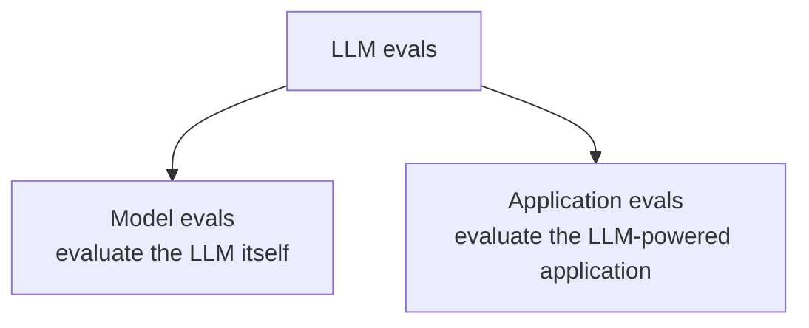
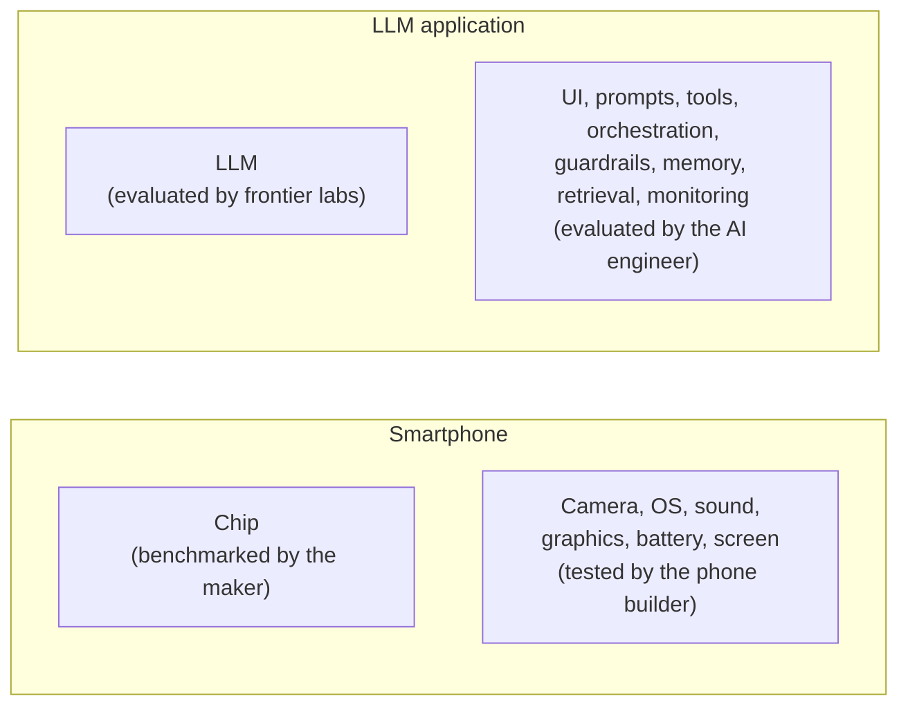

> **Video 2 of 19** · [Watch on YouTube](https://www.youtube.com/watch?v=cNF_MO82Qew) · Translated from the
> Hindi transcript. Notes follow the video section by section, in its order.

LLM evals are a complete testing setup, not a metric, and they come in two kinds: model evals, which judge an LLM, and application evals, which judge the product you build around it.

## What LLM evals are

With the why covered (why evaluations are needed, and how they differ from software testing), the main topic is **what LLM evals are**. The definition:

> LLM evals are systematic, repeatable tests used to judge an LLM or LLM-powered system against a clear criteria.

So LLM evaluations are tests applied both to LLMs and to LLM-based applications, and they have three main characteristics.

### 1. Systematic

Systematic means **no vibe testing**: not five questions that came to mind, answers that looked right, and done. Instead you create **proper datasets** that try to cover every kind of **edge case**, so you can test your chatbot or LLM-based system properly.

For the CampusX chatbot, for example, you would randomly pick the chats of **100 real users** with the system, build a dataset from them, and test on that dataset, so you see the chatbot's real-world behaviour.

### 2. Repeatable

Repeatable means that if tomorrow you change the prompt, the model, the retriever, the chunking strategy, or all of these, you can still evaluate the system **exactly as before**. Your dataset can be applied the same way to **any version** of the software to extract results.

That is what lets you compare version one with version two: with one test dataset, you see how each version performs on it, and so whether the system is improving.

### 3. Clear criteria

Most important of all, an evaluation depends on the **criteria** you evaluate against. For the CampusX chatbot these might be:

1. The answer must be **correct**.
2. The answer must be full of **simple explanation**.
3. The explanation must come from **CampusX's own course content**.
4. It must be **safe**: nothing unsafe, no abuse, no threatening tone.

Without criteria you are vibe testing; with criteria you are doing proper evaluation.

This is still theory, and the whole workflow is revisited later through a proper example. The summary so far: LLM evals are tests of LLMs or LLM-based applications against given, clear criteria, and they are usually repeatable and very systematic.

## An eval is not a metric: it is the entire testing setup

A common doubt, and one held here too when first hearing of this topic: that an eval means a **metric**. Coming from machine learning and deep learning, evaluation meant metrics such as accuracy, precision and recall, so the natural assumption is that LLM evals are also just a set of metrics.

That is not right. An LLM eval is **the complete testing setup** you create to test LLMs. Take a RAG chatbot whose retriever you want to evaluate:

- **What** you are testing: the retriever component is part of the eval.
- **Against what criteria**: for instance, how accurate the retriever is.
- **The dataset** prepared for the evaluation is part of the eval.
- **When** you run the tests: offline, or after deployment in production.
- **Which tools** you use: say RAGAS, because it is a RAG application.

So whenever someone asks what LLM evals are, the answer is: not just a metric, but the entire testing setup, meaning what is tested, on what basis, when, and with which tool, all combined.

The goal of an LLM eval is also **not to give you a score**. Its goal is to answer **practical questions** such as:

- Can the model be used for a particular task or application?
- Is this system good enough to ship, can it go to production?
- Did prompt version 2 improve over prompt v1?
- Is the RAG answer grounded in the retrieved context?
- Is the agent completing the task correctly?
- Is the chatbot safe for real users?
- Is the latency under control?

If this has not fully clicked yet, it will make sense once it is revisited through a practical example.

## Two kinds of LLM evals: model evals and application evals

Before seeing how LLM evals work, one distinction needs to be clear, because it helps a lot later. LLM evals today can be divided into two parts:

- **Model evals**, which evaluate **LLMs**;
- **Application evals**, which evaluate **LLM-based applications**.

The definition above already contains both: tests "used to judge an LLM **or** LLM-powered systems". Model evals evaluate a given LLM; application evals evaluate a whole LLM-based application.

:::note

As the video itself cautions, "model evals" and "application evals" are not official terms; they were coined for this course to simplify the topic. In industry both are still just called LLM evals, and people infer from the use case which one is meant.

:::

## Model evals

> Model evals evaluate the model itself. The main idea is to test and evaluate the capabilities of a model.

The single goal: when a new LLM is released, test its capabilities, **benchmark** them and **document** them. You will have noticed that every new LLM release quotes benchmarks and leaderboards: this LLM came top on that benchmark or leaderboard, with this much accuracy, at this percentage. What is happening is that evals are built and kept ready; as soon as a new LLM arrives it is tested on them to find its capability level, and the results are documented and published online, showing how capable the LLM is.

### The eight capabilities LLMs are tested on

1. **Reasoning**: can the LLM solve a problem by thinking step by step?
2. **Knowledge**: does it have basic world knowledge, general knowledge? It should know everything in the world from before its **cutoff date**.
3. **Basic maths**: can it solve maths problems?
4. **Coding**: can it write code?
5. **Instruction following**: given 10 instructions, does it follow all of them, one after another?
6. **Long-context handling**: can it pull out correct answers even from a very large context?
7. **Multimodal understanding**: can it understand, or produce, images, text and sound?
8. **Tool use**: can it use tools properly?

Every new LLM is evaluated and documented against these eight capability categories, and the evaluation is done with **benchmarks**.

### Example benchmarks

| Capability | Example benchmark |
| --- | --- |
| General knowledge and reasoning | **MMLU**: questions across many subjects (science, history, law, medicine), recorded and evaluated |
| Maths | **GSM8K**: grade-school maths questions |
| Coding | **SWE-bench** (very famous), and **HumanEval** |
| Instruction following | **IFEval** |
| Long context | **Needle in a Haystack** |
| Multimodal | **MMMU** |

So: LLM evals divide into model evals and application evals; model evals test an LLM's capabilities (the eight above); and the capabilities are tested with benchmarks. The next lecture is a whole lecture on the most popular benchmarks: how they are applied to LLMs, how results are extracted, the complete workflow.

### How much of this an AI engineer does

As an AI engineer you will **not work much on model evals**. Evaluating, benchmarking and documenting a new LLM is not your job; it is the job of the big **frontier labs**, which test their new models on these benchmarks and report how they do.

What you need is to know what model evaluation is, what benchmarks are, and **how to read them**. Then, when you pick up a new project, knowing which model tops which benchmark lets you make a better decision about which LLM to put in your application. You will feel more literate, even though there is a good chance you never run model evaluations yourself. As a project developer, one important job at the start of a project is deciding whether you need OpenAI's LLM, Anthropic's, or whether an open-source LLM will do, and that decision comes out of model evals.

## Application evals

This is the category to study well. It should be your topic of interest, and it is the one you will do in practice, because an AI engineer's job is to build LLM-based applications, so evaluating them is your job too. Application evals are the **main topic of this playlist**. Model evals get just one dedicated lecture, so that you have literacy in how model evaluation works.

### Why they exist: the LLM is just one component

Beginners especially tend to think an LLM application is all about the LLM, since it is the brain. With more experience and bigger applications you realise the brain is important, but many other things have to go in for the application to work properly:

- the **user interface**;
- the **prompt**, the system prompt;
- **tools** and **APIs** you add;
- the **orchestration code**, say in LangGraph: control goes from here to here, branching happens here, then control goes in parallel;
- **guardrails** at application level, a very important one;
- **output parsers**, if you use them;
- **memory and context**, super important;
- for a RAG system, the separate **retrieval system**, the **embedding model** and **vector databases**;
- after deployment, the whole **monitoring setup** and the whole **feedback loop**.

In a proper LLM-based application the LLM is just one component, which is why application evals matter so much. Model evaluation tells you how capable the model is; the whole system you built around it also has to work properly.

### The smartphone analogy

Smartphones have a chip, Snapdragon, MediaTek, whoever makes it, and chip manufacturers release benchmark scores for each new chip to show how strong the processor is. But does a good processor guarantee a good smartphone? Obviously not. You also need the camera system, the operating system, the sound system, the graphics card, the battery; only when all of these work well together does the phone run well. A good processor alone does nothing, and every part you add, the battery, the graphics card, the screen, has to be tested too.

The same applies here: the frontier labs do the evaluation of the LLMs for us, but the responsibility for evaluating the whole system built on top is ours, as AI engineers.

### Definition and what application evals ask

> Application evals assess the behaviour and performance of an LLM-powered application, whether at the level of the entire system or a specific component within it.

So application evals work at two levels. For a RAG chatbot:

- **System level**: how good the final response is, the latency, the cost per token.
- **Component level**: whether the retriever works properly, whether the embedding model works properly, whether the reranker works properly.

In an application eval you do not ask "Can the model do this?"; that is model evaluation's job. You ask **whether your product will work properly**. For the CampusX chatbot, application evals answer:

- Was the student's question answered correctly?
- Was the course material used properly?
- Was the answer faithful?
- Was the answer easy for a beginner?
- Did hallucination happen?
- Did the answer come quickly?
- Is the chatbot safe?

That is why this whole course talks about application evals. Going forward, when you see a YouTube video titled "LLM evaluation", you can assume it is teaching application evaluation, not model evaluation, most likely 99% of the time, and that is what you need to study.

## Summary and what comes next

This lecture covered the **why** (why study this topic) and the **what** (what LLM evals are, and their two types, model evals and application evals). Next comes the **how**: how LLM evaluations are actually done. That how is taught from the perspective of **application evals**, not model evals.
