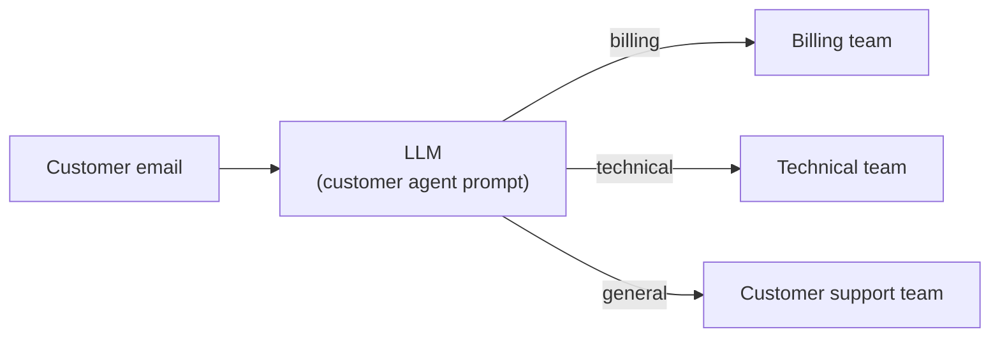
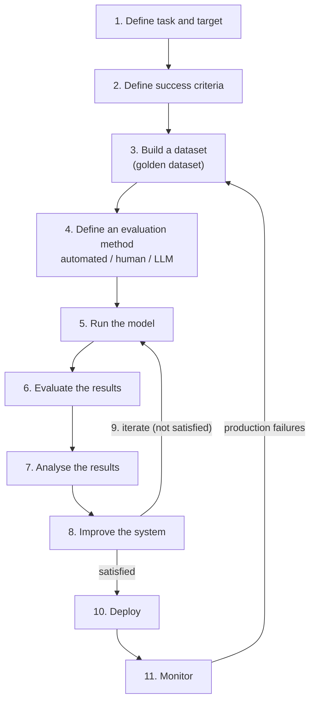

> **Video 3 of 19** · [Watch on YouTube](https://www.youtube.com/watch?v=Pv4mkG2K_s8) · Translated from the
> Hindi transcript. Notes follow the video section by section, in its order.

Evaluating an LLM application follows one workflow, from defining what to test through to feeding production failures back into a golden dataset, and the same workflow applies to simple classifiers, RAG systems and agents alike.

## Where the course stands: from why and what to how

So far the lecture has covered the **why** (why study this topic) and the **what** (what LLM evals are, and their two types, model evals and application evals). Now it moves to the **how**: how LLM evaluations are actually done.

One disclaimer: the how is taught from the perspective of **application evals**, not model evals, because application evals are where the course focuses.

## The example application: routing Zomato's customer emails

The topic is the **workflow of LLM application evals**: how you evaluate a typical LLM-based application. It is taught with the simplest possible example.

You are engineers working for a company, say **Zomato**. Being a big company with many customers, it receives a lot of mails every day, and replying to them manually is difficult, so it wants to automate the setup. It wants a system that reads each mail and, based on its content, classifies whether the customer is asking:

- a **billing**-related question,
- about a **technical** problem, or
- a **general** query.

The benefit is routing: a billing query goes straight to the billing team, a technical query to the technical team, and a general query to the customer support team. Nobody has to sit and manually read the mails and tag the teams.

The system built for this is very simple. An LLM is put in place and given a prompt along the lines of "you are this customer agent who will read the email and decide where to route it". The user's email goes in, and the LLM does the routing. You could literally build it in 5–10 minutes.

The real question: should it be deployed directly? No. That is the point of everything discussed so far. Before deploying, the system has to be **evaluated**. The flow that follows is the one you will see again and again throughout the course: it is shown on a very simple application, but you use the same workflow even for a very complex agent.

## The evaluation workflow, step by step

### Step 1: define the task and target

First, define **what** you want to evaluate. Here the **target** is this system, this workflow. The **task** of the evaluation is a simple classification task: check whether the system classifies correctly or not.

### Step 2: define a success criteria

Next, define the success criteria: how would you know the system is working correctly? The answer (given correctly by a viewer in the live session) is **accuracy**. If the system receives 100 queries and routes 90 of them to the right place, it is 90% accurate.

So for this system the success criteria is **classification**, and the **metric** that tells you whether classification is happening correctly is **accuracy**.

### Step 3: build a dataset

Next comes the most important step: building a dataset. On one side is the message, the content of the mail; on the other is its type, labelled manually by you:

| Email | Type |
| --- | --- |
| My card was charged twice | Billing |
| The app crashes on login | Technical |
| What are your hours? | General |

Only three rows are shown here; generally you would create **50 to 500 rows**.

The best way to create it is to bring your **actual data**. If this is Zomato, pick up your past chats, build the dataset from them, and do the labelling manually too, getting someone to sit and label it. In the language of LLM evals this is called a **golden dataset**.

### Step 4: define an evaluation method

Then you decide **who performs the evaluation**. There are two or three options:

1. **Automated**,
2. a **human**, or
3. **another LLM**.

Performing the evaluation means: you send this dataset into the system you built, and the system gives an answer for each message. Say it answers billing for the first, general for the second and general for the third. You then compare its answers with the labels and calculate the system's accuracy.

Who calculates that accuracy here? Putting a human on it would mean needlessly paying a salary, and there is no need to bring in an LLM either. You simply write **Python code** that computes the accuracy score. So in this case the eval method is **automated**, because this is a simple LLM application.

Now imagine the application were a **chatbot**. The expected column would hold a long textual answer, and the LLM's output would be a long textual answer too. How would you compare the two? Checking through code whether one paragraph is correct against another is very difficult, because you have to find out whether the **semantic meaning** is the same. You could sit a human down, but a human is **costly**: lots of testing means paying lots of salary. The third option sits in between: an **LLM** can do this testing.

So at this point you need an evaluation method, and it can be automated, a human, or an LLM.

### Recap of the first four steps

Going over it once more from top to bottom:

- **Task and target**: the target is the whole system, the whole workflow; the task is to evaluate whether it works correctly.
- **Success criteria**: classification, with accuracy score as the metric.
- **Dataset**: built, 50–100 rows.
- **Evaluation method**: when the system produces its answers, the accuracy is calculated in an automated way.

### Step 5: run the model

Running the model simply means sending your dataset into the system you built, so that it generates answers.

### Step 6: evaluate the results

Here the Python code calculates the accuracy score. Suppose it comes out at **80%**: you sent 100 rows, 80 were classified correctly and 20 went wrong.

### Step 7: analyse the results

Now you try to work out **where the mistakes are happening**. If a system whose simple job is to read text and classify it into billing, technical or general gets it right only 80% of the time, where is the scope for improvement? Several things can be fixed:

- **The system prompt**: perhaps it is written in a way that makes the model confuse billing with technical.
- **The model**: perhaps the LLM you picked cannot manage the task, for example a model with fewer parameters, an open-source model.

There is not a lot of scope for improvement in an application this simple, but the system prompt and changing the model are two options.

### Step 8: improve the system

The evaluation result is in: 80% accuracy. Your manager says improve it. So you go and tweak the prompt or change the model; you **improve the system** (the step is about the system, not only the model).

### Step 9: iterate

Right after improving the system, you **trigger the evaluation again**. This is what was meant earlier by LLM evals being **repeatable**: you have one golden dataset and you keep making changes to your system and re-running it.

- This time you changed the **prompt** and re-ran on the dataset: accuracy became **90%**. The manager says improve it further.
- Next time you decide not to think too hard and just change the LLM, putting in a **heavy LLM**. Re-running on the same dataset gives **95%**. Now the manager is happy, and you stop.

So you iterate in a loop: take the model, run it on the dataset, evaluate the results, analyse them, make improvements, and go round again. Eventually you reach the point where the system feels **worth deploying**.

### Step 10: deploy

You then actually go on and deploy the system online.

### Step 11: monitor, and feed production failures back

Deployment does not end the work. Without **monitoring**, the system can fail online as well, so you monitor it consistently and look for **failures in production**. The system was 95% accurate on your test dataset, but when it receives new data from real customers it may start making mistakes.

The important step here: take the production failures back into the dataset. Say a particular mail should have been classified as billing but the model called it technical. You pick up that instance, the content of that mail, add it to your **golden dataset**, and restart the whole process.

In this way the golden dataset keeps getting **richer**, you keep improving the system on it, and you keep deploying. The whole evaluation runs continuously inside one big loop.

The example is very simple, but the **same flow applies to RAG systems and to agents**. The whole flow, once more: define task and target, define a success criteria, build a dataset, define an evaluation method, run the model, evaluate the results, analyse the results, improve, iterate; when satisfied, deploy and monitor; wherever mistakes happen, make those cases part of the dataset and evaluate again. You keep doing this for as long as the system is in deployment, and that is how you build **reliable LLM-based applications**.

## Question: who decides the output is wrong during monitoring?

A good question from the live chat, and one that will keep coming up. Suppose a customer sends a mail that is essentially a billing issue but gets redirected to the technical team. The technical team follows up, and the customer replies that their concern is billing, not anything technical. A process is set up so that the technical team **flags** the case ("we were sent wrong information"), and it gets added to the dataset. So a monitoring system is in place for exactly this.

## One application, several evals

One more important point, a very important line:

> One LLM-based application may have several LLM evals.

You might build one RAG application and run multiple evaluations on it. The Zomato example was a single evaluation, but on a single LLM application you commonly run many. For a RAG system, for example:

- one evaluation to test the **retriever**'s performance;
- a separate one to check the **embedding model**'s performance;
- a separate eval to test the **whole RAG workflow**;
- a separate eval checking the **latency** of the whole system.

So generally more than one eval runs on an LLM-based application. The example here showed only one, but in practice you will see multiple evals run on a single application. It is a very important point to remember; the rest follows in the coming videos.
