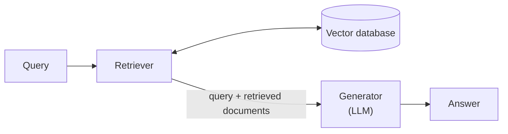
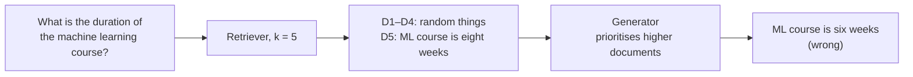
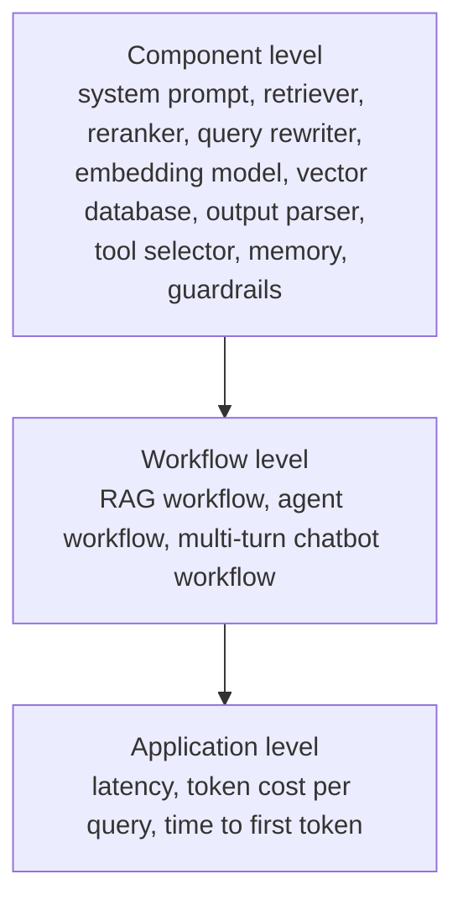

> **Video 4 of 19** · [Watch on YouTube](https://www.youtube.com/watch?v=DcZ-XCk-O_M) · Translated from the
> Hindi transcript. Notes follow the video section by section, in its order.

An LLM application almost always needs more than one eval pipeline, for two reasons: it has multiple failure points, and each failure point carries multiple risk categories.

## Recap of the previous session

Technically the course has had a single session so far, and it covered three very important things:

1. **Why** LLM evals are needed: through case studies, the problems that arise if you deploy an LLM application to production without evaluating it.
2. **What** LLM evals are: a systematic and reliable way of evaluating LLMs and LLM-based applications against a clear criteria. They come in two types:
   - **Model evals**, where you evaluate an LLM, using benchmarks. These are generally done by frontier labs; you need to know them only so you can understand and decide what kind of LLM your application needs.
   - **Application evals**, where you evaluate an LLM application you have built. The course mostly revolves around these, and as an AI engineer most of your time goes into them.
3. **How**: what an eval pipeline looks like, and how an evaluation is performed step by step.

Today's session starts from the last line of the previous one: generally speaking, **one LLM-based application has several LLM evals**. Whenever you build an LLM application, it has not one eval pipeline but several. The question now is **why**: why can't one eval pipeline evaluate your application? The answer is built up intuitively, through examples.

## The example: a RAG chatbot

Say you are building a **RAG chatbot** for your company, school or college. Its components, which should be memorised by now:

- a **retriever**, connected to a **vector database**;
- a **generator**, which is an LLM.

The query comes to the retriever, which fetches relevant documents from the vector database based on the query. The query and the retrieved documents are then both given to the generator, which answers based on that relevant context.

## Reason 1: multiple failure points

One very big reason for multiple eval pipelines is that an LLM-based application has **multiple failure points**: it can break in many places.

Looking at the basic RAG architecture, where can mistakes happen, where can the code break, where are wrong responses likely? Two failure points are easy to see (and were spotted correctly in the live chat):

- **The retriever** may fetch the wrong documents. If it does, the generator will give a wrong answer based on them.
- **The generator** may ignore correctly retrieved documents, hallucinate and give a wrong answer.

Both have to work correctly for the application to work, so you put **one evaluation pipeline on the retriever and one on the generator**. That is simple logic. The two pipelines, looked at independently and only from above (their nature is not discussed yet):

### The retriever pipeline

The retriever's goal is to take a query and bring the relevant documents from the vector database. So its eval pipeline checks: **given a query, are you getting the right relevant documents?**

### The generator pipeline

The generator's basic job is to take a context and generate an answer from it. Its pipeline checks whether the answer was generated correctly from the given context. The quality checked here is **faithfulness**, sometimes also called **groundedness**: the answer must be generated from what was in the context, the relevant documents, with no facts created on its own beyond that.

For example, the question is *"What is the duration of the machine learning course?"* and the extracted document says **3 weeks**. The answer should say exactly that: the machine learning course duration is three weeks. Nothing extra should appear by itself, such as "it is a great course", or "you can also purchase the Python course; the duration of the Python course is four weeks". The answer should be **grounded in the context**. So this pipeline checks, throughout, that the context and the generated answer are **faithful** to each other.

### Both components pass, and the answer is still wrong

So RAG has two failure points, the retriever and the generator, and each gets an eval pipeline. Now assume both pipelines report that the retriever and the generator are working correctly.

The question (yes or no): does that **guarantee** that the RAG application works correctly? Many in the live chat said yes, some said no. Here is a scenario that answers it.

A user asks *"What is the duration of the machine learning course?"* The question goes to the retriever, where **k is set to five**. In the retriever, k means fetching the **five most relevant documents** from the vector database. Of those five:

- D1, D2, D3 and D4 are some random things;
- D5 says *"the duration of the ML course is eight weeks"*.

Did the retriever do its job? Forget **reranking** for now; assume the system has none. Then yes, obviously. Giving it a k of five means it has to bring the correct answer within five documents, and it did. It is like being given five attempts to crack an exam: if you crack it even once in five, the job is done.

All five documents, together with the question, now go to the generator. Its system prompt says it will get a question and a lot of context, and should merge them to generate an answer. But it will focus more on the **documents at the start**: generally the generator often answers from whatever was retrieved higher, whatever comes first in the context. Or say the system prompt itself guides it to give more priority to the higher documents, D1, D2, D3, D4, and answer from them.

So the generator picks something up from those higher documents. Somewhere among them it says the **Python course duration is six weeks**. It catches this fact and that fact, and answers: *"the duration of the ML course is six weeks"*.

Is the answer from the RAG chatbot right or wrong? Obviously **wrong**. But did the generator do its job properly? Yes. It had been told to generate the answer based on the higher-priority documents. It was simply given the wrong documents, and even on those it tried to do its job correctly. It did **not hallucinate**: the six-weeks figure came from the documents above, not out of thin air. It just mixed up the wrong things while diligently following the instructions it was given.

So in that sense the generator was independently working fine, and the retriever was independently working fine, **yet the pipeline broke** and the application gave wrong results.

### The workflow-level eval, and the fix

The discussion was about why an LLM application needs more than one eval. There are multiple failure points, and evaluations were placed on two of them. But the **interaction** between them forms a **workflow**, and that workflow needs an eval of its own: a **workflow-level eval** that checks how the combination of retriever and generator works together. Such an eval would **flag this error**.

So you need not only individual component-level evals but also evals on their interaction, at the workflow level.

Say you build that eval too, one that evaluates the retriever and generator in combination. It tells you that the answer was wrong and needs fixing, and what the mistake is: the most correct document sits at the very **bottom of the priority order**. Most likely you need to add a **reranker**. After the results arrive, a reranker reranks them based on the query: D5 should have the highest priority, so it brings D5 to the top and moves D1, D2, D3 and D4 down. Suddenly the whole RAG pipeline starts working correctly.

The whole point of the example: if you place evals only at the component level, your pipeline is not necessarily going to work. **Individual components can work correctly while the pipeline fails.**

### All three evals pass, and it still isn't ready

Now you have three evals: the retriever's own eval, the generator's own eval, and an eval for the pipeline made from the two, checking how their combination works. If all three are fine, is the application the user will use **guaranteed** to work?

Many in the live chat said a problem can still occur. For example: everything works correctly, but the whole pipeline takes **10 seconds** to answer a question. The user types a question, waits 10 seconds, and only then gets the answer. Is that fit to deploy to production? No. So you also have to set up an eval at the **application level**, one that checks that **latency stays below a threshold**.

### The three levels where failure points exist

The simple point of this whole discussion is where failure points exist in an LLM-based application. There are **three levels**:

1. **Component level.** Whatever LLM application you build, any of its components can fail, and each needs its own eval pipeline:
   - the **system prompt** can make mistakes;
   - in a RAG application: the **retriever**, **reranker**, **query rewriter**, **embedding model**, **vector database**;
   - in a structured-output-based application: the **output parser**;
   - in an agent: the **tool selector**, **memory**, **guardrails**.
2. **Workflow level.** Even if everything is fine at the component level, the workflow can have problems: the RAG workflow, as just shown; an agent's workflow; a multi-turn chatbot's workflow.
3. **Application level.** Even if everything is fine at the workflow level, you still need evals on the entire application: how much **latency** the whole application has, how much **token cost** you spend answering a single query, how long it takes for the **first token** to print.

That is all this part set out to show: some 15–20 minutes spent proving, with an example, why multiple evals are needed.

## Reason 2: multiple risk categories

Multiple failure points are one reason. The other is **risk categories**.

You have three things you can put evals on: individual components, workflows and the entire application. But within each of these there are **variations** too:

- **Application level.** For a RAG chatbot, what obviously matters to a user is that the answer is **correct** and **helpful**. But it also matters that the answer is **safe**: you should not be chatting with the chatbot and have it tell you some other user's phone number and email. So beyond correctness and helpfulness, safety matters at the application level as well.
- **Workflow level.** For the retriever–generator workflow just discussed, one aspect is whether the answer is **faithful**, **grounded**. Another is that producing that answer should not **cost** too much, not above a threshold. That risk matters too.
- **Component level.** The retriever has only one job, fetching relevant documents. But its **latency** matters as well: if it fetches the right document but takes 5 or 10 seconds to do it, things can go wrong there too.

So not only are there multiple failure points; each failure point has **multiple aspects** to it, and these are called **risk categories**. They are broadly divided into three parts:

1. **Application quality**: whether the app does its actual job well, giving correct, relevant, complete answers to what the user asked. In short, whether the answer coming out of the system is good and correct.
2. **Safety**: ensuring the answer is **not harmful**. Several things are checked here: no toxic content, no dangerous content, no biased content, no private data leaking, and no way to **jailbreak** it into doing something it shouldn't.
3. **Operations**: once deployed, whether it can run in a **fast, cheap and reliable** way.

All risks are organised into these three categories.

### The risk-category table

A table on screen lists the risk categories you will see, or use when building your own applications, under each of the three headings. It is not exhaustive, but it holds the important ones that come up again and again. Application quality is organised further into general LLM applications, RAG-specific, agent-specific and multi-turn-chatbot-specific categories.

**Application quality, general LLM applications.** Take any general LLM application, for example a **text summariser** into which you put a big answer and get back a summarised answer or bullet-point notes. The risks:

- **Correctness and accuracy**: is the generated summary accurate, correct?
- **Relevance**: is the answer related to exactly what was asked?
- **Completeness**: did every question asked get an answer?
- **Instruction following**: if a particular format or length was specified, did the answer come in that format and length?

These are core risk categories the course will explore going forward.

**Application quality, RAG-specific.**

- **Context relevance**, the most important in RAG: the retriever's job of making sure the retrieved documents are relevant.
- **Retriever recall**: related, essentially the same thing.
- **Groundedness and faithfulness**: the generated answer came from the context, with no extra information added.
- **Citation accuracy**: being able to cite that a particular generated line was extracted from a particular document, as you have probably seen in ChatGPT.

**Application quality, agent-specific.**

- **Tool selection**: is the agent selecting the right tool for the right job?
- **Parameter correctness**: when calling a tool, is it passing the right parameters?
- **Task completion**: is the agent completing tasks correctly, or is its failure rate high?
- **Error recovery**: if the agent starts doing something wrong mid-task, can it recover from there?

**Application quality, multi-turn chatbot.** Here the user keeps chatting and the conversation keeps going.

- **Context retention**: how much of the earlier conversation the chatbot can remember.
- **Clarification behaviour**: if the chatbot is confused about a path, or gets something ambiguous from the user, can it ask for clarification?

**Safety**, which has four or five dimensions:

- **Toxicity**: is the answer toxic?
- **Harmful content**: is something coming out that should not, such as self-harm-related, weapons-related or illegal-acts-related content?
- **Bias**: does the chatbot answer everyone the same way, or differently based on user profile?
- **Personal information**: is the chatbot, or RAG chatbot, handing out someone's personal information, such as credit card information or contact details?
- **Prompt injection and jailbreak resistance**: can someone, by giving prompts, get the LLM application to do something it should not?

**Operations**:

- **Latency**,
- **cost per request**,
- **token efficiency**,
- **error / failure rate**,
- **latency under load**.

## Summary: why more than one eval pipeline

In a nutshell: based on these risk categories you create **different evaluation pipelines**. It is the same application, but it has one eval pipeline for latency, one for safety, one for correctness. So whenever you build an LLM application, most of the time, 99.99% of the time, you will put **more than one evaluation pipeline** on it, for two big reasons:

1. There are **multiple failure points**.
2. There are **multiple risk categories**.
