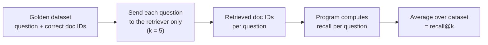
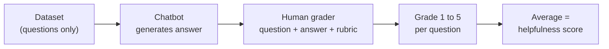
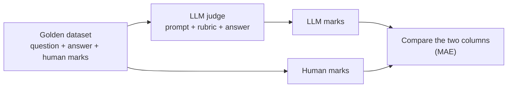

> **Video 5 of 19** · [Watch on YouTube](https://www.youtube.com/watch?v=uQFLY8rQVYA) · Translated from the
> Hindi transcript. Notes follow the video section by section, in its order.

Every eval pipeline is executed by one of three things: a program, a human or an LLM. This video gives one example of each, then separates reference-based evals from reference-free ones.

## What an eval method is

So far the course has established that you will need to build multiple LLM evals. The next, very important, idea is the **method**: what mechanism the eval pipeline you build actually works on.

> An LLM eval method is the mechanism you use to decide whether an LLM's output is good or not. The actual procedure that takes an output and produces a judgement about it.

You build an evaluation pipeline to find out whether a component, workflow or application is working correctly. The **method** is what carries that pipeline out. Primarily speaking, every evaluation pipeline uses one of three methods:

1. **Programmatic** (or **deterministic**): a program executes the eval.
2. **Human**: a human carries out the eval.
3. **Model-graded** (also called **LLM-graded**): an LLM executes the eval.

Put in the least confusing way: the question is simply **who executes the evaluation pipeline you built**. A program, a human or an LLM. There is nothing apart from these three.

The pipeline from the last class is an example. There you were AI engineers at Zomato: every incoming email went to an LLM, which categorised it as a billing, technical or general issue. The quantity to capture was **accuracy**, how accurately the emails were classified, and that accuracy was calculated by Python code. So that eval was **programmatic**.

This class gives one example of each of the three pipeline types. A programmatic example was already given in the past, but a more relevant one follows here.

## Method 1: programmatic evaluation of a RAG retriever

The scenario: a **RAG chatbot for CampusX**, so that users can interact with it and get help without anyone replying to them manually by mail. The aim is to build it well, so it will get every kind of eval pipeline. The first is at the **component level**, and the component picked is the **retriever**.

The retriever's job: as soon as it gets a question, it brings the most relevant **k** documents from the vector database. The pipeline checks whether it is doing exactly that correctly, and it is built through the same flow as before.

### Task, target and success criterion

- **Task**: the retriever should work correctly.
- **Target**: a single component, the retriever.
- **Success criterion**: how do you quantify that a retriever is working correctly? With the metric **recall@k**.

> Out of all the correct items that exist, how many did the system retrieve in its top k results?

The worked example. The question is *"What are the prerequisites for the ML course and how long is it?"* All the CampusX documents have been chunked and put into a vector store, and it is already known that the correct answer is hidden in two documents: **1001** and **1003**. The question goes to the retriever with **k = 5**, and it fetches 1001, 1002, 1004, 1005 and 1006.

Reading the definition: out of all the correct items that exist (two), how many did the system retrieve in its top k? Only one. So recall is **1/2, or 50%**. Ideally it should be **100%**; it cannot go above 100 or below zero.

That is what recall@k means, and computing it is a very good way to judge whether any retriever is working. Other measures exist too, such as **precision**, and you can also compute **rank**, but to keep the discussion simple the success criterion here is recall@k alone.

### The dataset

Next comes the dataset shown on screen. **50 to 100 questions** that users might ask once the chatbot is live on the website were sampled, trying to cover every case: edge cases, difficult questions, easy questions and random questions.

Then a **human expert** was sat down and told: take each question, go to the vector database, and find which of all the documents has the correct answer to this question hidden inside it. In a way this builds the **golden dataset**. It was done for all 50 to 100 questions.

### The evaluation method and the run

The evaluation method is very simple: recall is determined **programmatically**.

1. Take all 50 questions and send them **only to the retriever**, not to the whole RAG chatbot. The retriever's k is five.
2. For Q1 the retriever returns five documents, for the second question another five, and the same for the third, fourth and fifth. Every question now has its retrieved documents.
3. With the original correct answers and the retrieved documents side by side, calculate recall **per row**, that is per question. For the first question all the information was in a single document, 1001, and the retriever brought 1001, so recall is **100%** (one). For the second, the correct documents were 1001 and 1003; the retriever brought 1001 but not 1003, so recall is **0.5**.
4. Keep calculating this for every question, and at the end **average** the whole quantity. That average is the **recall@k over the entire dataset**, and it tells you how successful the retriever is at fetching relevant documents.



The evaluation method was a **program**: a program was written to do this whole job, and running it gave a recall of **67%**.

### Improving the retriever

Next you study deeply the questions where recall is very bad, and after analysing them you try to improve, not the model, in this case the **retriever**. Options include:

- **Improve the embedding model.** It may not be capturing semantic meaning correctly.
- **Query expansion.** Instead of sending the user's question directly, first expand it a little through an LLM, then send the expanded question to the retriever.
- **Increase k.** It is k = 5 now; try k = 10.
- **Reranking.** A document may be in the top 10 but not the top five. Add a reranker and the document at position eight moves to position three, so you automatically see better results.

That is how a component-level programmatic eval is run, and along the way you learned (or revised) how to evaluate a retriever with recall@k. This stays at the surface level rather than going deep.

Notice that no human was needed to evaluate the retriever; the program did the job. If a program can do it, there is no reason to bring in a human, because humans are costly: you have to pay a salary.

### Which aspect of relevance this covers

Relevance has several aspects:

1. How many of the correct documents you managed to fetch from the vector database.
2. How many of the documents you brought were **not** useful.
3. Whether the documents that came back were properly **ranked**.

This eval covers only the first aspect. Which documents are actually relevant was told by the person who created the golden dataset: for this question only one document, 1001, is related; for that one, only two, 1001 and 1003. Bring both and you bring the most relevant information; bring one and you bring half; bring neither and you bring zero relevant documents. That is how relevance is being defined here.

### Who executes the eval decides the method

Whether an eval is programmatic, human-based or model-generated depends on **who runs it when it is executed**. Creating the golden dataset is a **separate activity**. The classification is based on who executes the LLM eval, runs it and extracts the scores. Obviously the golden dataset is created by a human.

## Method 2: human evaluation of chatbot helpfulness

In the second example the **entire execution** of the evaluation pipeline is done by a human.

Assume again a chatbot on the CampusX website, this time a general sort of chatbot you can ask anything: when is the next course launching, what is a course's fee, will I get a certificate, what is the course validity. It is a RAG chatbot, so it answers from CampusX's documents.

The safety and operations part is not being evaluated here. This is the **application quality** part: the **helpfulness** of the answer, whether the answer a user got to their question was helpful.

### Task, target and success criterion

- **Target**: the **entire application**. Not one component, not one workflow.
- **Task**: evaluate its **helpfulness**. Helpfulness means the answer was **accurate**, its **tone** was right, and it was **complete** in itself.

Defining a success criterion here is **very tricky**. You are evaluating a whole application on whether it is helpful, and there is **no correct metric** for that; it varies from business to business. So a **rubric** was defined for CampusX, rating helpfulness from **one to five**:

- **5**: the chatbot's answer is correct, accurate, complete and in exactly the right tone.
- **3**: partially helpful.
- **1**: not helpful at all; it started saying something else entirely.

### The dataset

Evaluation needs a dataset, so again one of some **50 to 100 questions** was built, thinking from a coverage point of view: normal questions, difficult questions, edge cases, random questions, a representation of whatever users might ask.

Notice that this dataset has **only one column**: the question asked to the chatbot. For example:

- How long is the ML course?
- Is the ML course right for me if I already know Python?
- What's the fee for the DL course?
- Do I get a refund if I drop out midway?
- Can I pay the fee in instalments?

About 50 samples of such questions went into the dataset.

### The evaluation method: a human

Can helpfulness be measured programmatically? Could some piece of code evaluate everything and report that the chatbot is 70% or 90% helpful? No. It is too nuanced, and it needs **human judgement**. So the evaluation method becomes **human**.

Running the pipeline:

1. Take one question at a time and send it to the chatbot, which generates an answer.
2. Sit a person down with the instructions: look at this question, look at this answer, and assign a grade based on the rubric that has been defined.
3. Repeat for the next question, and for the entire dataset.



### Why more than one grader

Generally you sit **more than one human** down, say grader A and grader B. One grader makes sense: you trust their judgement. The benefit of two or more is this: if the two graders' grades **fail to match on many questions** (one keeps giving two marks, the other four), it tells you there is **ambiguity in your rubric**. The criterion you defined may have a problem.

So multiple graders are often used just to **refine the rubric**. If they agree a lot, the instruction is pretty clear. If they disagree, the instruction is ambiguous, both are confused by it, and that produces numbers like these. That point is the only reason the second grader was included; for now, assume only one human is doing all the evaluations.

Finally you take the average and get your **helpfulness score**, produced by your human. This is a very simple scenario of a human coming into the picture and carrying out the evaluation pipeline end to end.

### The other kinds of evaluation humans perform

In LLM evals, humans evaluate in more than one way. What was just shown, looking at a chatbot's answer and giving it a score, is the simplest. The others:

- **Red teaming.** A group of individuals deliberately attack an LLM-based system and try to figure out where it breaks. Before big LLMs launch, red-teaming teams try to break the system; wherever it breaks, that data is sent back to the development team and fixed. It is a kind of evaluation humans perform, different from the one just studied.
- **A/B testing.** You have two versions of a chatbot, put both into production and A/B test them, having told your users to rate their experience so far. The version with the better rating is selected and deployed across the entire region. Here your **users are evaluating your application in production**, which is again a different kind of evaluation.
- **Direct grading and rating.** The flowchart just seen.
- **Golden dataset and rubric creation.** Someone asked earlier why humans were needed for the golden dataset even in the programmatic example. That work is itself a kind of evaluation: saying "for this particular question the answer is hidden in this document" is performing an evaluation.
- **Human in the loop.** Some cases are so complex that you do not trust only programmatic or LLM-based evaluations. If the LLM or the programmatic checks cannot handle a case, or it falls near a threshold, a **grey area**, you pass the responsibility to a human, who gives the answer based on their judgement.

In a nutshell, humans perform **five** kinds of evaluation in the world of LLMs: direct grading and rating, red teaming, A/B testing in production, golden dataset creation, and human in the loop.

### Advantage and disadvantage of human evaluation

- **Biggest advantage: reliability.** Hire a sensible person and you trust their judgement. A human brain can figure this out far more easily than a machine, so it is much more reliable than a program or an LLM, and there is more trust in the system.
- **Biggest disadvantage: cost.** You have to pay to hire people. That is why, if your application works at scale, with lakhs or crores of users, you most likely cannot use humans for its evaluation.

## Method 3: model-graded evaluation (LLM-as-a-judge)

So what if you cannot use programmatic checks, because what you want to evaluate is very ambiguous (like how helpful a chatbot is), but you also cannot sit humans down because they are costly? What sits between programmatic and human, with the strengths of both?

The answer is **LLMs**, the third category: using LLMs for evaluation. Used correctly, it is the **most useful category**, which is why most LLM evaluation pipelines being built are based on LLMs; their evaluation method is model-graded, or LLM-graded. The very popular technique used here, which you will study a lot in this course, is called **LLM-as-a-judge**: you use an LLM like a judge to evaluate something.

### The setup: CampusX UPSC

The case study needs a little setup. Imagine a website and YouTube channel that prepares students for **UPSC**, said to be India's most difficult exam; cracking it makes you an IAS officer. The exam has three rounds: **prelims**, then **mains** for those who pass, then the **interview**, after which selection happens. Prelims is **MCQ-based**; mains is **subjective**, where you write subjective answers.

The website, **CampusX UPSC**, prepares students for both prelims and mains. Over time it realises it could conduct an **automated test**. For prelims that is very easy, because the exam is MCQ-based and anyone can conduct it. For mains it is difficult, because the answers are subjective and evaluating them needs **subject-matter experts**.

Lakhs of students come to the YouTube channel and could take this exam, so it is a very big earning opportunity. The only problem: if even **10,000 students** sit the mock test, all 10,000 subjective papers must be evaluated. Think how many subject-matter experts that needs, each paid on a per-paper basis. Profitability drops.

Then a company arrives and says: we have built a platform; send it any number of students. Our **LLM-based system** will evaluate any number of students, even lakhs, on the basis of **your defined rubrics**, and you pay only a fraction of the cost. That makes business sense; it is simple logic.

That is the platform to build. Say it has been built; now **it has to be evaluated**. You are the platform that conducts UPSC mock mains exams and returns their evaluations, and you must evaluate whether this system works correctly. At scale humans cannot be brought in, so it has to be done through LLMs.

### Task, target and success criterion

Again the same flow. The target is the application you built; the task is to evaluate whether it checks papers correctly, **whether it evaluates papers like human experts do**.

What is the success criterion? For the chatbot it was helpfulness; for the retriever, recall@k. Here, what does success look like? Multiple perspectives can be true, and the question is deliberately a little vague and ambiguous. (One student suggested "similarity score", which prompts the question: similarity of what?)

The success criterion chosen: **if the platform can evaluate UPSC answers exactly the way human experts do, the platform is successful**. Then it can be deployed, launched and used to earn money. Most people would agree that if the platform starts evaluating papers like humans, the job is done. Other success criteria are possible, but this is a good one. The exact **metric** comes a bit later.

### The rubric

Based on this success criterion a dataset has to be built, and this is where it gets interesting. First, define a **rubric**. Assume the UPSC paper has three questions (there could be any number):

1. *"Ethical governance is impossible without administrative accountability. Discuss."* 15 marks.
2. *"Examine the role of the Governor in Centre-State relations."* 10 marks.
3. *"Federalism in India is more cooperative than competitive. Critically analyse."* 15 marks.

An expert who evaluates papers very well was brought in and asked: which dimensions should be checked when answering this question, what should an answer contain to count as a good answer? For the first question the expert defined four or five things. The answer is good if it:

- talks about ethical governance and accountability,
- explains the link between them,
- gives mechanisms,
- cites examples,
- has a balanced conclusion.

So each question gets a rubric of five or six dimensions: if these are found in the answer, it is a good answer.

:::warning

The rubric is **not the dataset**. It is a rubric that can evaluate an answer to a question.

:::

### The golden dataset

The dataset looks like this: an **answer ID**, **which question** the answer is for, the student's **exact answer** (not a summary), and the marks given by a **human evaluator**. This is the golden dataset, created by a human evaluator, and it has only some **50 to 100 rows**. So not many papers needed evaluating, only 50 to 100 answers (not even whole papers), by one subject-matter expert. It was not a very big job.

The expert looks at each answer, sees which question it answers, reads it, and marks it against that question's rubric:

- One student's answer to question one covers the first, second, third, fourth and fifth points, so it gets **13 out of 15**.
- Another student's answer to the same question covers the first point only partially, misses the second, third and fourth, and has the fifth, so it gets **4**.

That is how the golden dataset is built: define a rubric, conduct the papers, pull out some students' answers, and have a human expert evaluate them against the rubric. It is basically how a human would evaluate a UPSC mains paper.

### The evaluation method: an LLM

Can these papers be evaluated programmatically, by putting the student's answer into some Python code and comparing it with the human's evaluation? Not really. And a human is not wanted, because it is obviously costly. So there is only one way: **use an LLM**.

Running this evaluation simply means bringing an LLM into the picture and giving it instructions. The prompt is built from the golden dataset and the rubric:

```text
You are grading a UPSC mains answer against an evaluation rubric.

Question: <taken from the question paper>
Marks: <how many marks the question is for>
Rubric: <the exact rubric for that question>

Aspirant's answer: <the answer the student wrote>

For each dimension, decide whether the answer genuinely addresses it,
then allocate marks. Do not reward verbosity, keyword stuffing, or
confident assertions that lack substantiation. Reward structure,
relevant examples and balanced argumentation.

Return: which dimensions were addressed, the total marks you are giving,
and a one-sentence justification of why you gave that many marks.
```

Every answer a student wrote is picked up and sent to this LLM, which returns the marks it gave for that particular answer to that particular question. This is done for all the answers.

### Comparing the judge with the human: MAE

Now you have side-by-side information: for the same answer, how many marks the **human** gave and how many the **LLM** gave, both looking at the **same rubric**.



The success criterion is hidden in these two columns. If they are very similar, the LLM evaluates papers the way the human does, meaning the system works correctly, at least on these 50 answers.

The metric for "these two columns are similar" (a student, Himanshu, gave it): **MAE**, **mean absolute error**. Subtract each pair and take the absolute value, 13 − 12, plus 4 − 8, plus 8 − 8, and so on for all 50 answers, then divide by 50.

Suppose it comes out as **2.3**. That means that, on average, the LLM deviates from the human by **plus or minus 2.3 marks** when evaluating answers. The whole goal becomes bringing this number down towards **zero**, because at zero the LLM evaluates answers exactly the way a human does. That is the success criterion.

Ways to bring it down:

- bring a **better LLM** into the picture,
- change the **system prompt**,
- change the **rubric**.

You keep doing these in a loop, but you now have an evaluation mechanism that tells you how to build a system that evaluates UPSC answers exactly like a human. That is how LLM-as-a-judge works, with a relatable example. (It took a lot of effort to build; the examples that came to mind before this one were very boring.)

### The mindset change

Until now you would build LLM-based applications and be happy. Now you are thinking like a **production engineer**, who first figures out whether the application will really work correctly and only then deploys it. Building an LLM-based application is the easy part. The difficult, challenging part is making sure it **works each time, everywhere**.

## Reference-based vs reference-free evaluation

One last topic for this class: two terms that are sometimes asked about, discussed, or found online. You have already seen both.

> **Reference-based evaluation** is an evaluation where you have a reference, a known correct answer or the key things a correct answer must contain, written down in advance for each test case. You grade by comparing the output against the reference.

Which of the three examples were reference-based, meaning the correct answer was already known in the golden dataset?

- **UPSC (LLM-as-a-judge): reference-based.** The golden dataset records how many marks the human gave each answer. Correctness here means evaluating like a human, so the human's evaluation is the correct answer, and the system is told to try to give the same marks.
- **Retriever (programmatic): reference-based.** For each question it was stated in advance that the answer is in document 1001, or in 1001 and 1003. The correct thing is defined beforehand.
- **Chatbot helpfulness (human): not reference-based.** The dataset is simply the list of questions. The questions go to the chatbot, it answers, and the human is asked whether the answer is right, but there is **no correct answer in the data**. The human reads the rubric and decides from their own judgement what to give between one and five.

That last type is called **reference-free evaluation**:

> You have no predefined correct answer. You judge the output's quality directly, on its own terms, against a criteria or rubric. But a rubric here is a scale, a standard, not a per-item correct answer.

| | Reference-based | Reference-free |
| --- | --- | --- |
| Correct answer in the golden dataset | Yes, written down in advance per test case | No |
| How you grade | Compare the output against the reference | Judge the output on its own terms against a criterion or rubric |
| Examples in this video | Retriever recall@k; UPSC LLM-as-a-judge | Chatbot helpfulness graded by a human |

So, given any evaluation pipeline, you can classify it by asking one question: **is the correct answer given to you in your golden dataset?** If not, it is reference-free; if yes, it is reference-based. That is the whole difference, and it is why the human example was deliberately chosen to have no reference.

## What comes next

One very important topic is still left: **offline vs online evaluation**. Everything studied so far is, in a sense, offline evaluation. Evaluation also keeps running after the system goes to production; that is online evaluation, and it comes next.
