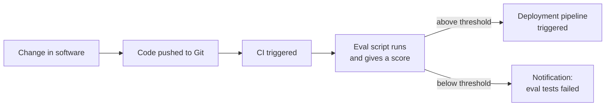
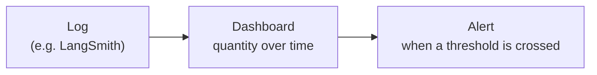
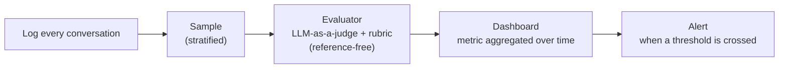
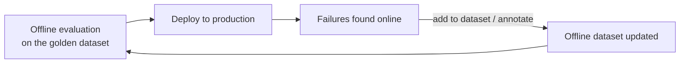

> **Video 6 of 19** · [Watch on YouTube](https://www.youtube.com/watch?v=SahaDGzN-Bk) · Translated from the
> Hindi transcript. Notes follow the video section by section, in its order.

Offline evals check whether your application works correctly before it is deployed; online evals check whether it keeps running normally on live traffic afterwards, and the two work together in one loop.

## Recap of the course so far

So far the LLM evals course has covered five things:

1. **Why** evals are needed.
2. **What** evals are, including both types, model-based and application-based.
3. **How** an LLM eval looks: the eval pipeline.
4. **Why a single application needs multiple eval pipelines.** No LLM-based application gets just one eval pipeline; ideally you build several, for two reasons:
   - there are **multiple failure points**: failure can come at the component level, the workflow level and the entire application level, so evals have to monitor all three;
   - there are **different risk categories**: application quality, safety and operations (separate evals for latency and all kinds of metrics).
5. **The eval methods** used to perform evaluation: programmatic methods, LLM-as-a-judge, and evals with humans.

## Today's agenda: offline eval vs online eval

The topic of this session is **offline eval versus online eval**: first what offline eval is, then what online eval is, then the differences between them.

## What offline evals are

The good news is that there is nothing new to study here: you have already studied offline evals. Every eval pipeline built and shown in the last two or three sessions is an example of an offline eval.

The idea: **any eval pipeline you put on your LLM application before deploying it is an offline eval.**

Take the **UPSC application** from the last video, an LLM application that evaluates mains mock-test papers just like a human would. The evaluation was built step by step: a golden dataset was created, LLM-as-a-judge was used as the method, and the evaluation was performed. That evaluation happens **after the software is built but before deployment**, so it is an offline eval.

In very simple words: whenever you have an LLM-based application and want to test it fully before deploying it, to see whether it is fit to deploy, the evals you run there are offline evals. Everything studied so far comes under offline eval; it has simply been given a new name.

## The three benefits of offline evals

Why not build LLM-based software and deploy it straight away? Because without testing you do not know how it will behave in production, and there could be any kind of risk. The case studies at the very start of the course, Air Canada and ChatGPT, showed that you cannot deploy LLM-based software to production without testing it.

### 1. Pre-release testing

The first benefit is **pre-release testing**: before releasing, you can test properly.

An interesting point here, which you may also study in the LLMOps course: the whole process of building, testing and deploying software can be automated to the point where you create a **gate**. If the result of running your eval is above, say, **95%**, deploy the software; if it is below 95%, do not. This uses **CI/CD**:

- You make some changes in the software, and the code is pushed to Git.
- CI is triggered (through GitHub Actions, in this example), and the eval script kept there runs and gives a score.
- If the score is above the threshold, the deployment pipeline triggers automatically.
- If it is below, you get a notification that the eval tests failed.

So offline eval does not only give you pre-release testing; used correctly, it works as a **release gate**. If the eval passes, the software is deployed; if not, it is rolled back to the previous version.

### 2. Comparing versions

The second very important benefit is **version comparison**. Say you have to build your LLM-based software, the UPSC one for instance, with either a **Claude** model or an **OpenAI** model. Everything else, the rest of the code, is the same; only the model differs. Which gives better results for your purpose?

You build two versions of the software and run **the same eval** on both. Since the eval is the same, the golden dataset is the same, so the field is level. If Claude scores more than OpenAI in the results, you use Claude.

You can do this for anything: different **prompts**, different **models**, different **rerankers**, different **vector databases**, even different **architectures** of the application. Whenever you have more than one possibility and have to choose, running your eval on multiple versions of the software makes the choice for you.

### 3. Regression testing

The third, also very important, benefit is **regression testing**, a well-known software term. As a viewer put it correctly, it is a **test of change**.

Suppose version one of the CampusX chatbot is already live and students are interacting with it. In production you observe a pattern: whenever students talk about **refunds**, the chatbot answers in a slightly cold way. You always want the chatbot to talk to students in a good tone, so you go into the system prompt and add an instruction: be very kind and very polite, answer nicely.

After that change its personality becomes far too soft. If someone asks the cost of the **Insider plan**, which is **19,500**, it very softly says "it's around 19,000" to make it sound good to the other person. (It is not a perfect example, but it makes the point.)

Often you are building a very complex system; you go to improve one thing and other things get messed up. You improve performance on one thing, and performance on others gets worse. **This is called regression.** Whenever you improve your software, you have to make sure that the thing you are improving does improve and, at the same time, nothing else breaks.

Offline eval helps with this too. The golden dataset holds different types of cases, different types of student questions, trying to cover every kind: **refund** questions, **pricing** questions, **course-curriculum** questions. Running the eval on every type of question shows how the results come out for each type. If your success rate on refund questions was **90%**, it should stay around 90 after the prompt change; if it drops to **80**, there is some form of regression, and you should not make the change.

So whenever you make a small change anywhere, the system prompt, the model, the vector database, anything, nothing else should break because of it, and offline evals let you test that.

### Summary of offline evals

What has been studied so far is what is called offline evals, and it has three important benefits:

1. You get to test **before release**.
2. You can **compare two versions** whenever you are in doubt.
3. Whenever you change existing software, you can test that **nothing breaks elsewhere**.

These are the three biggest reasons offline evals are super important; work cannot go on without them.

## The three problems you face in production

Now suppose you built your LLM-based software, ran offline evals on it, and all the results passed. The software is deployed. What problems can come up in production? There are three major ones.

### 1. Unanticipated inputs

For the CampusX chatbot, offline testing used a golden dataset of **200 to 500 questions** you think the user might ask, and the chatbot was tested only on those. Deploying it opens it to the real world: a student can now ask any type of question, including ones the software was never tested on. For example:

- people suddenly start talking in a **mix of Hindi and English**, when the model was trained or fine-tuned mostly on English because you anticipated English-only conversations;
- many **ambiguous half-questions**, where you cannot even tell what the user wants to ask;
- **angry rants**, with a question hidden behind a lot of anger;
- **adversarial prompt injections**, people trying somehow to get the chatbot to give an answer it should not give;
- many kinds of **edge-case** scenarios.

In production the chatbot faces a much bigger superset of inputs than anything you showed it or tested it on, and it can face anything.

### 2. Emergent or systematic failures

Many small failures do not show up in the offline setup; they only appear once the software is in production. These are problems faced **only at scale**:

- **Load.** CampusX launches a new course, suddenly a lot of people come, and there are thousands of concurrent users on the chatbot at once. Latency suddenly increases. You could never have tested this offline, because offline you cannot bring thousands of users.
- **Subtle bias** that only becomes visible across thousands of conversations. Say the chatbot is slightly biased against people from a non-technical background. You find this out only once it has chatted with thousands of people and a lot of data comes in: then you start to see the pattern that it talks properly to people with a technical background but develops a bit of bias when talking to non-technical people.

So many kinds of systematic failures can occur in production that you would not have anticipated earlier.

### 3. Drift

The third, and the most technical of the three, is **drift**: slowly, the offline eval you used for testing and deployment starts becoming **obsolete**.

Suppose you have built the CampusX chatbot today and put all your documents into it: the pricing structure, course pages, curriculum pages, lecture transcripts. That is today. Over the year, as the business operates, you keep making changes: the price of some course changes, some curriculum changes a little, the policies change a little. After a year, the documents you give the chatbot to build the RAG may look very different from those of a year earlier.

But the test cases, the golden dataset, were built according to **today**. After a year, since the data and its distribution have changed, the golden dataset and the whole eval pipeline become kind of obsolete. Offline, the eval pipeline will still report good results when you test the application; online, you will see a lot of negative feedback from users, who do not like the chatbot's behaviour. All because things keep changing while the eval setup does not. If drift slowly creeps into a system, its offline eval setup becomes obsolete and its results stop mattering.

### Why offline evals cannot cover these risks

To recap the three risks after deployment:

1. The user will ask any kind of question, and you have no control over it.
2. Emergent systematic failures can come, such as bias, or latency rising when concurrent load increases.
3. Drift can come into the picture.

So offline eval is necessary, because testing before launch is necessary. But after launch there are many kinds of risks in production that offline eval **cannot** cover. The simple reason is how offline evals work: they need a golden dataset with the correct answers, and evaluation happens on that basis. Once you are in production you no longer have any golden dataset. The user can ask anything, and you have no correct answers: you do not even know which student will ask what question tomorrow, or what the correct answer to it is.

## What online evals are

That is why **online evals** come into the picture. The definition:

> Online eval is evaluating your system on live production traffic after deployment, as real users interact with it.

It is a different type of evaluation, run in production after the software is deployed. Its biggest characteristic is that it **works without an answer key**, without a golden dataset. That is why it is super critical: it helps make sure the deployed software keeps running correctly, and tells you that nothing is going wrong online.

## Offline vs online evals

Based on the discussion so far, the differences:

| | Offline eval | Online eval |
| --- | --- | --- |
| When | Before deployment | After deployment, running consistently |
| Data | A fixed dataset you create, the golden dataset | Live production traffic; run on the questions being asked |
| Answer key | Mostly yes, your golden dataset | No; you estimate on the go what the correct answer might be |
| Input | Only what you anticipate, what you put in the golden dataset | Cannot be anticipated; anything can come |
| Catches | Regression | Drift, surprises, emergent bugs |
| Best used for | Gating (CI deploys the code when the score is above the threshold), version comparison, CI | Drift detection, and how the chatbot is performing in the real world |
| Cost and speed | Fast, cheap and repeatable: simple code or an LLM on a small dataset | Can be costly, at very large scale |

On cost: the chatbot might be talking to 500 people in a day, and you would have to monitor those 500 conversations. So a **sampling** technique is used: rather than monitoring each of, say, 50,000 conversations, you randomly monitor around 1,000 of them, which brings the cost down.

### Not rivals: correctness vs normality

The most important thing to understand is that the two are **not rivals**. Online eval is not a replacement for offline eval; they always happen together and are **complementary**. A very good line, read somewhere:

> Offline eval checks whether your application is working correctly. Online eval tells you whether your application is running normally in production.

Both have their own purpose; you cannot use one in place of the other. The rest of the lecture goes deeper into how online eval works and what differs from offline eval.

### Example: the UPSC grader

Take the UPSC grader that checks papers. In its offline evaluation last class, the question was whether the grader evaluates papers **exactly the way a human does**. The measure of correctness was how close the marks the grader gives a particular answer are to the marks a human gave it.

Now suppose you evaluated this system offline, were satisfied, and deployed it. In the online setup, can you measure its correctness, how correctly it is evaluating the answer in front of it right now? **No.** For the answer being evaluated at this moment you do not know how many marks a human would give it; there is no golden dataset for it, and no human perspective at all in production. No human has evaluated this answer; the system is evaluating it directly, for the first time. So correctness cannot be measured.

What you can check online is that the system is running **normally**. How? Look at last week's **distribution of scores**: plot a graph of the distribution of all the answers evaluated by the system last week. If this week's distribution looks the same, you can say the system is working the same way it did last week, and if last week was right, today is right too. You make that the **baseline** and keep comparing against it in production. If in some particular week the distribution suddenly changes a lot, the system is doing something different from normal; something has become abnormal. That gives you a trigger to go and look at what went wrong.

Distribution of what? Of **scores**. Say you evaluate 1,000 people's papers in a week: the first student got 300 marks, the second 456, the third 700. You can plot those scores. Watching this week and the next three weeks, you learn what the baseline distribution looks like. Then in some particular week very high scores suddenly start appearing, around 900, 800, 700. The distribution has changed.

A viewer pointed out that the change might be due to some other trend; perhaps very intelligent students suddenly started taking the exam. That can happen, but you **get to know**: you go and investigate why the system is suddenly giving such high scores. That is what online eval does. It cannot always guarantee correctness (in many cases it can, in many it does not); mostly it tells you whether the application is working **normally**.

Do not hold on too tightly to the example; it was constructed just to explain the difference between **correctness** and **normality**, and it does not apply everywhere.

## Questions: how is quality estimated without an answer key?

If online evals now feel important, as if work cannot go on without them, the lecture is landing; if they feel unnecessary, something is off in the understanding or the teaching.

A viewer asked: online eval has no answer, so how do you actually estimate quality? There are many ways.

- **Metrics that need no correct answer.** For a **RAG chatbot**, you can check **faithfulness** without knowing the correct answer. Faithfulness means whether the answer was generated from the retrieved context only. You have the context and the generated answer, so you ask an LLM whether this answer was generated from this context. Many metrics can be answered like this.
- **A workaround when the metric does need the correct answer.** Then you are restricted and have to use your brain to reach a conclusion. In the UPSC example there was no right answer, so the workaround was comparing against the **baseline distribution** to see whether the system works normally.

Another example: can a chatbot's **correctness**, whether it is giving the right answer, be measured online after deployment? Every new question arrives without its correct answer, so it cannot be evaluated directly. Is there some other signal instead of the answer key? Say the chatbot has a **thumbs-up / thumbs-down** option. If in the last hour you suddenly see thumbs-down ratings on a lot of conversations, you understand that something has gone wrong and the chatbot is giving wrong answers. So the **user's feedback** became the stand-in for correctness, again a workaround.

Another question, about the general metrics and signals tracked in online evaluation, is exactly what comes next.

A viewer also did not follow the distribution part, so once more. In production there is no way to find out whether the system is evaluating the current paper correctly: you have the paper's answer, but not how many marks a human gave it, so you cannot compare "the human gave this much, I gave this much". So how do you judge whether today's evaluations are right? You store the total score of every evaluated paper somewhere and plot it over a one-week window, on a scale from 0 to 1,000.

- **Week one**: most students' marks around 500, quite a lot around 700, very few around 200.
- **Week two**: the same graph now shows most students around 800, and very few around 200, 300 or 500.

Comparing the two graphs, this week is clearly different from last week. And before this, the same kind of distribution formed every week: weeks one, two, three and four looked alike, and in the fifth week it changed. Comparing distributions week by week tells you something is different this week, something has gone wrong: why did the software suddenly start giving more marks? With no way of measuring correctness, you compared against the last baseline, and that told you whether the software is working normally.

## The online evaluation pipeline

Now the most important section of the class: what an online evaluation pipeline looks like.

### Step 1: logging

The first, very important step is **logging**. The chatbot is live and people are talking to it. To evaluate anything, you first have to keep recording everything that is happening, all the conversations happening right now. If you do not record it, it is lost, and then there is nothing to evaluate.

> The idea behind logging is simple: you capture a structured, replayable record of every conversation turn.

If the CampusX chatbot is deployed on the website and **50,000 conversations** happen in a day, you store those 50,000 conversations properly somewhere. What does storing a conversation mean? You store:

- **identifiers**: a **conversation ID** for every conversation; a **turn ID** for every turn inside it (the user speaks, the chatbot speaks, the user speaks, the chatbot speaks); a **user ID**; a **session ID**; a **timestamp** for when it happened;
- **content**: the **question** the user asked; the **context** generated in the RAG chatbot while answering it; the **output** the chatbot gave from that context and question;
- **operational data**: **latency** in milliseconds, **prompt tokens**, **completion tokens**, **total cost**, whether an **error** came and, if so, its **status code**;
- **user signals**: behavioural signals such as pressing **thumbs up or thumbs down** during the conversation; **escalation**, such as "I don't want to talk to you, get me a human" or "give me your email ID, I need to mail"; the user **rephrasing** the same question again and again because they feel the chatbot cannot help them.

Everything is stored. The tool for this, as a viewer answered correctly, is **LangSmith**, taught earlier on the channel, where a chatbot was built and every conversation was stored in LangSmith. In LangSmith you have different **projects**, and in them all the conversations: what the user sent, what the output was, and a lot of metadata.

#### Engineering properties of logging

This logging has some engineering properties you should know:

1. **Non-blocking.** Logging is itself an operation, and you have to run the chatbot and log at the same time. The two should not interfere with each other: doing both together should not increase latency. The conversation happens normally on one side, and logging happens on its own on the other.
2. **Durable and queryable.** You use some data-warehouse type of tool, or an observability tool such as LangSmith, where the information is stored in a very structured way and, very importantly, can be fetched back any time in the future.
3. **Late-signal attachment.** Many user signals do not come immediately, while the conversation is running; they come later. Say a conversation did not help a user, and the next day they sent a mail to CampusX support. The escalation happened a day after the conversation, but it still has to be recorded against it. You have the conversation ID, so you work out that the escalation came from that same conversation ID. Any late signals have to be stored too.
4. **PII handling.** If during a conversation the user shared sensitive personal information with the chatbot, such as their phone number, address or card number, you remove or blur it before storing it in LangSmith, so that none of your teammates or employees can extract it from LangSmith later. Privacy should be maintained. Since it is textual information, this is done by **masking**. PII means **personally identifiable information**: phone number, card number, date of birth, Aadhaar number. Anything like this told to the chatbot is masked before being stored.

So the first step, before evaluating anything, is to store and log everything somewhere, generally a data warehouse or an observability tool like LangSmith.

### Which signals matter: captured vs computed

Before step two, you need to know what matters in online evaluation: which signals you pay attention to in order to tell whether the chatbot is working correctly. There are two kinds:

- **Computed signals**: ones you have to extract, calculate or figure out.
- **Captured signals**: ones already present, which you just store somewhere.

Examples of **captured** signals:

- **Thumbs up / thumbs down**: the user gives you the signal; you pick it up and store it in LangSmith as it is, without calculating anything.
- **Latency**: however long the chatbot took to give a particular answer, you store directly in LangSmith.
- **Cost per conversation**: how many tokens were spent and how much money it cost. You do not calculate it; the LLM provider tells you, or it is calculated in advance, so no real-time calculation is needed.
- **Token usage**: simply counting.

Examples of **computed** signals: say you want to see your chatbot's **faithfulness** in production. You will not get that just by storing the chat. You have to build an **online evaluator**, send the chat to it, and it computes and gives you the faithfulness score. Likewise **answer relevance**, **correctness**, **hallucination**, **toxicity**, and **bias and fairness** all have to be computed.

These are all chatbot-related, and they are the kind of general quantities that are present in any normal software too; LLM-based software is not special in this.

### The pipeline for a captured quantity: log, dashboard, alert

For a captured quantity such as latency, nothing has to be calculated, so after logging in LangSmith you go straight to the next step, **dashboarding**.

In every production setup you create a **dashboard** that shows these quantities over time: latency in the last 1 hour, the last 24 hours, the last week, the last 6 months. A captured quantity needs no computation; you send it directly to the dashboard, look at its graph, and understand from the graph whether the system is working normally.

For example, you launch a course, 500 people come to the website at once and start chatting with the chatbot, and its reply time suddenly goes up. The latency graph, which had been running steady, suddenly spikes. Seeing that, you know something has gone wrong and quickly **allocate more resources**: on AWS you start more EC2 instances, more load balancers and so on, and manage the traffic somehow, so that after a while latency comes back down.

Dashboarding has an important next stage: **alerting**. Nobody will watch the graph all day; no engineer will look at it 24 hours a day, since they may be on leave or asleep. So you set up **alerts**: if a quantity crosses a threshold, an alert goes out on Slack, or email, or (not generally used, but possible) WhatsApp, to the concerned engineer: "latency has gone above 4 seconds". They quickly go and bring things back to normal.

So the flow for a captured quantity is: **log → dashboard → alert**. This is not the flow for computed quantities, which comes next.

#### LangSmith: Monitoring and Alerts

In LangSmith there is a **Monitoring** section. Click it and select your project, and a dashboard is already built for it, with separate graphs for **trace latency**, **error rate**, **LLM call count**, **LLM latency** and **cost**. From these you understand your system's health.

The interesting part: you can select the last 1 hour, 3 hours, 6 hours. You always look at these quantities **aggregated**. The latency of the current chat does not matter; the overall, aggregated latency over the last hour is what is meaningful. In a single conversation latency may go up and down, and a single conversation in isolation does not matter. But if latency is rising across many conversations in the last hour, the average latency is going up, which shows that a **system-level** problem has happened.

Alongside it is **Alerts**, where you can create new alerts: select a project, give the alert a name, select the metric to alert on, and set a condition ("alert when feedback metric" is more than some value in the last 5 minutes, and so on). The alert then goes to you on Slack, PagerDuty, Dynatrace or another platform, or you can connect your own API and alert your own way.

So dashboarding and alerting come together. This is the flow for a captured quantity, with no computation and no evaluator. The quantity is recorded directly in the **tracing** (for example a latency of 2.03 seconds), picked up from there and shown in Monitoring, and if it suddenly rises over the last hour, the alert system lets you know so that you can take the necessary action.

### The pipeline for a computed quantity: hallucination

Now the main and most interesting part: tracking a **computed** quantity in production. The example: checking in real time, in production, whether the chatbot is **hallucinating**.

**Log first.** If the chatbot carries out 500 conversations a day, you log each of them with a tool like LangSmith.

**Set up an evaluator.** Step two is to create an evaluator, and it is a **reference-free** evaluator. From the last class: an evaluation where the golden dataset has an answer key is **reference-based** (the UPSC example); an evaluation with no golden dataset and no correct answer key is **reference-free**. To find the hallucination rate, is there a golden dataset or an answer key telling you whether the chatbot's answer to a user's question is a hallucination? No. So it is reference-free evaluation.

But the evaluation still has to happen, so you use an **LLM as a judge**. You bring a somewhat more powerful LLM, show it the **retrieved context**, the **question** the user asked and the **output** your LLM generated, and ask it whether the LLM is hallucinating. You also write a **detailed rubric** that guides the LLM-as-a-judge in deciding whether the original LLM is hallucinating at a particular place.

**Sample.** There is a very big problem, though. If the chatbot holds hundreds or thousands of conversations a day, should this LLM-as-a-judge evaluator be let loose on all of them? Obviously not: it would be very, very costly. You already pay to run the chatbot for those conversations; paying again to evaluate them can more than double the cost. So a step comes in between: **sampling**. From the day's conversations you randomly select a sample, say **1,000 conversations**, and run the LLM-as-a-judge evaluator on those.

**Dashboard and alert.** The evaluator pulls out a quantity, the **hallucination rate**, which goes to the dashboard just like the captured quantities, and alerts are created from that same dashboard.

So the flow is exactly the same as for captured quantities, with two additions: **sampling**, to save cost, and an **evaluation** step in between that computes the value (the hallucination rate). After that, the steps are identical. How this works in practice is shown shortly.

### Better than random: stratified sampling

Is random sampling the best strategy, or is there something better? A viewer suggested **ignoring conversations that got a thumbs up**, which is valid: where a student gave a thumbs up, they are most likely happy with the chatbot's performance, so most likely there was no hallucination. It is not exactly a fact, but it is a good signal, and keeping those conversations teaches you nothing.

Instead you can focus more on conversations:

- that got a **thumbs down**;
- that **ended abruptly** in the middle;
- where **escalations** happened;
- where the user asks the **same question again and again**, rephrasing it in different ways;
- where **money** is being discussed: refunds, admission, fees.

Not all conversations are the same. So you do **stratified sampling**: first divide all conversations into categories, then take **more samples from the problematic categories** (lots of money talk, thumbs down received) and fewer from the normal ones. In the resulting sample there is a greater chance of detecting hallucination properly.

This is the same idea as clustering, and it needs a small model of its own to detect which conversations had a thumbs down, which one is going one way, which another. That is a technicality; the point is that even for sampling you do not do plain random sampling, you do stratified sampling.

### The entire online eval flow

So the flow is:

1. **Log** everything.
2. **Sample**.
3. Set up the **evaluator**, which evaluates the sampled conversations and pulls out the metric.
4. **Aggregate** the metric over a time period and show it on the **dashboard**.
5. If a threshold is crossed, trigger the **alerting** system.

That is only **one** evaluation pipeline. You put multiple evaluators, multiple eval pipelines, in place like this.

### Evaluators in LangSmith

In LangSmith there is an **Evaluators** option, with "Get started with evaluators". Under **Show all templates** there are a lot of options, and next to each one it says **LLM-as-a-judge**:

- **Security**: **PII leakage** (it computes whether the chatbot is leaking any kind of personal information, with an LLM-as-a-judge sitting behind the scenes); **prompt injection**; **code injection**.
- **Safety**: **toxicity**; **bias and fairness**.
- **Quality**: **hallucination**; **correctness**.
- Others for **assertions**, **conciseness**, a **code checker**, the **quality of the conversation**.
- **Trajectory**, which is actually for agents, not chatbots.
- Separate ones for **image-based** chatbots and **voice-based** chatbots.

To set up a hallucination pipeline, click the hallucination template, then:

1. give it a **name**;
2. select the **application** to run the evaluation on (an organisation can have more than one);
3. select the **model** for the LLM-as-a-judge, OpenAI or Claude or whatever, provide your **API key**, and set whatever settings you want, such as **temperature**;
4. write the **prompt** for the LLM-as-a-judge: here you define the **rubric** telling it how to detect hallucination, and add any instructions, reminders or context of your own (all of this is covered later);
5. specify the **format** it should answer back in.

Then there are two options: run this evaluator on **tracing**, or run it on a **dataset**. What does each mean? Tracing means all the conversations being traced and logged, so running it on tracing makes it an **online evaluator**. Datasets belong to the offline setup, so running it on a dataset makes it an **offline evaluator**. LangSmith is an overall evaluation platform where you can do both online and offline evaluation.

You can build datasets in LangSmith too: under **Datasets & Experiments** you create a new dataset and keep adding your examples. Select that dataset for the hallucination evaluator and it becomes an offline evaluation; select tracing and it becomes online. With no dataset present, Datasets & Experiments shows two options, **Create a dataset** and **Run an experiment**; clicking **New experiment** gives you code for conducting offline experiments, which comes in the coming sessions.

So LangSmith gives you the whole setup: create datasets, run offline experiments, log, monitor, alert, and run online and offline evaluators. It is a complete evaluation platform. This is an overview class, which is why none of it is done hands-on yet.

### Closing the loop: production failures back into the offline dataset

In the first class's workflow (which was for the offline setup), there was a "deploy and monitor" step: if some failure happens in production, you pick up that case and put it into your offline dataset. The same happens here.

Suppose that while tracing, your team identifies that something went wrong in a particular conversation. At the top there is an **Add to dataset** option: clicking it makes that conversation part of your **offline dataset**, so the next offline evaluation runs on the updated dataset. This is how you **close the loop**, with offline and online working together, in sync, the whole time.

There is also an option to **annotate**: add a particular conversation to an **annotation queue** and record what went right and what went wrong in it. So you keep annotating the data coming in online and making it part of your offline data.

A circle forms: offline evaluation, deployment to production, failures in production, those failures added back into the offline dataset, offline evaluation again, deployment, new failures. This is the **self-improving loop**: online failures keep going into the offline dataset, and once there, they are part of offline evaluation.

That is all for today: an overall idea of online evaluation, why it happens, how it happens and what the flow is, without anything hands-on. It was a very beginner-level class.

## Questions at the end

**"A dashboard shows faithfulness 0.87 and latency 3. Is the bot good? How do we judge from the dashboard?"** Every quantity has a **baseline** defined, and that baseline generally comes from your **offline evaluation**. You compare against it. If faithfulness is 0.87 and the baseline is 0.85, 0.87 is better, so you are happy. But if in the last 24 hours faithfulness drops to 0.75, that is concerning against the 0.85 baseline, so an alert fires, or you come and make improvements to the system.

## The mindset shift, and the plan ahead

Before the course began, the promise was that after finishing it you would not just take an API key, build a chatbot or RAG chatbot, and go to sleep. Your mindset would level up: you would start thinking about how your chatbot will work correctly for thousands, lakhs, crores of people. Not only building it, but learning to run it properly, is the idea of this playlist. That is what will set you apart from the competition, because not many people are studying this yet, and it will give you value in interviews and whenever you present yourself. And this is only the start: technically this is the second lecture.

Next, the course applies what these sessions covered:

- how the **golden dataset**, mentioned again and again, is built;
- how **offline evals** are run;
- how **online evals** are run;
- along the way, tools and libraries: **LangSmith**, **DeepEval** and **RAGAS**.

## What comes next

The next topic is **benchmarks**. Of the two kinds of LLM evals, model-level and application-level, everything so far has been application-level. One or two sessions now go to **model-level evals**, studying benchmarks and so on, and then the course moves into application evals. The goal is to complete the playlist this month, give or take a week.

One last question: **"If offline a score goes from 92 to 99, is that good for production?"** It depends; the question is incomplete. Which quantity went from 92 to 99, and did other quantities come down while it rose? If everything is improving, obviously it is good. But in improving one thing, nothing else should go down, because that is exactly what happens in LLM-based systems: you improve one thing and regression happens, as other things drop.
