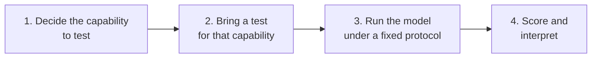

> **Video 7 of 19** · [Watch on YouTube](https://www.youtube.com/watch?v=FPS0rIAQwzo) · Translated from the
> Hindi transcript. Notes follow the video section by section, in its order.

The course so far has been an overview; from here it goes into specifics, starting with model evals: evals that test an LLM's capabilities directly.

## Recap of the course so far

The recap is there partly for the teacher: starting with one gets the flow going and makes clear how today's topic connects to what came before.

- The course began with **why we need LLM evals**.
- Then **what LLM evals are**, with one very important distinction: there are two types.
  - **Model evals** evaluate LLMs themselves.
  - **Application evals** evaluate LLM-based applications. These are the main focus of the course; RAG evaluation, agent evaluation and so on come under them.
- Then an **eval pipeline**, basically how evals work.
- Then the interesting question of **why we need multiple eval pipelines**.
- The last video covered **online evals**: once an application is evaluated and deployed, how you keep evaluating it after deployment.

That completes an overview of the whole course. The rest of the course takes the same material and covers it slowly, in more detail. Today's goal is **model evals**. They will not fit in one lecture; the aim is to finish them in two.

## Why AI engineers need model evals

Following the CampusX why-what-how flow, the first question is "why". But the question is framed from this course's perspective: not "why do model evals exist?" but **"why do AI engineers need model evals?"**

The general answer is already known. Model evals exist so that we can **measure the capabilities of our LLMs**, and measuring matters because of the famous line: *if you can't measure, you can't improve.* Model evals give you mechanisms for evaluating many types of capability in any LLM.

For frontier labs the need is obvious: evals tell them what to improve, where things went wrong and how to shape their training. But if you are an AI engineer whose day-to-day job is building LLM-based applications, why do you need them?

Look back at everything discussed so far. It was all about evaluating LLM-based applications: for a RAG application, how to evaluate the retriever, the generator, the whole pipeline, the whole application. Not once did the discussion ask how you evaluate, or select, the **LLM that runs the application**, the brain of the application. There are four reasons you need to.

### 1. Comparing models to choose one

Suppose you are building a RAG application for your company today. The very first question is which LLM to use: OpenAI's or Claude's? In a professional setting you cannot say "use whichever you like, both are good". In a team meeting you have to bring **concrete pointers** for why one should be chosen over the other.

Model evals are what let you do that: these are the capabilities our application needs, in that capability this particular LLM scores higher, so we should choose it over the competitor. Reason one is that you can compare two or more models and pick one for your application.

### 2. Tracking whether new models really improve

Your RAG application is deployed with Claude's Opus 4.8 and everything is working. Then Claude's Fable arrives, and your manager asks you to research whether to deploy Fable or stay on Opus. How would you know *as a fact* that Fable is better? Again, model evals. The numbers that justify whether a new model beats the previous one come only from model evals.

### 3. Knowing whether a model is safe

Model evals are how you can say that the model you have deployed, or are about to deploy, is safe: how much it hallucinates, how safe it is to use, whether it can be jailbroken.

### 4. Deciding between an API and hosting your own model

Should you use a proprietary LLM like Claude or an open-source LLM like DeepSeek? Both have advantages. Claude may be more expensive and DeepSeek a bit cheaper, but Claude may be more powerful and better across several capabilities that DeepSeek cannot match. So do you use the API directly, or pull an open-source model from Hugging Face, put it on your company's server, write your own APIs and build the application around it? That comparison, too, is made with model evals.

In a nutshell, **without model evals you are blind.** If you want to know how good a model is, or compare two models, model evals are the only option. That is why the topic is very important for an AI engineer and will be covered properly.

## What a model eval is

So far a model eval has only been described as a way to evaluate your LLMs. The more formal definition:

> A model eval is a systematic process of measuring an underlying model's capabilities, behaviour, reliability and operational characteristics under controlled conditions.

It is the same idea, expanded: a process that lets you test any LLM's capabilities and behaviour.

### The four steps of every model eval

At a technical level, every model eval, of whatever type, follows four steps.

1. **Decide the capability to test.** LLMs are general-purpose models with many capabilities, so no single model eval tests them all. It is not like IQ in humans, where one number tells you quite a lot about a person; unfortunately LLMs have a separate model eval for each capability. So first you decide what you want to test: reasoning, coding, how safe it is to use, instruction following, and so on.
2. **Bring a test** (or a mechanism) that tests that capability. More on this step shortly.
3. **Run the model on the test under a fixed protocol.** The model basically sits the exam. You fix things such as which prompts you use and what the conditions are, so the test can be repeated later, and so that if you are testing several models they all get the same conditions.
4. **Score and interpret.** Once the test is done, you publish or interpret whatever score comes out.

### Two types of test: benchmarks and custom evals

Step 2, bringing a test, is the important one, and there are two types of test in model evals.

- **Benchmarks.** Standardised, shared tests such as MMLU or SWE-bench. Because everyone runs the same test, they are great for comparing models on common ground. A benchmark is the same for all models, everyone recognises and uses it, and you can compare two models' numbers openly. Each benchmark tests a specific capability, such as maths, reasoning or instruction following.
- **Your own evaluation sets (custom evals).** Rather than a benchmark, you build a test from "data you assemble from your actual task, which measures what you specifically care about rather than what is generically useful." You run it because you need to know how your given LLM will perform on *your* application.

### Why custom evals, if benchmarks exist: the Zomato email example

The obvious question: if benchmarks already tell me how good a model is at maths, reasoning and coding, why run a custom eval of my own?

Take the system from the first session, built for Zomato: it reads the content of an incoming email and decides where the mail should be routed. Say there are three categories, **billing**, **technical** and **refund**. You have two model choices:

- **Model A**: a proper big LLM, top of the leaderboard but expensive, roughly **$15 per 1 million tokens**. Think of it as something like Claude's Opus.
- **Model B**: a small model, obviously cheap, only **50 cents per 1 million tokens**, and mid-table on public benchmarks. Think of it as something like MiniMax or a lower-billion-parameter Qwen model.

Common sense says: why think so hard, deploy model A, it will give good results anyway. But at Zomato's scale, putting model A in directly can make the cost grow a lot. And if you look only at benchmarks, model A beats model B on every one of them: maths, coding, language generation, everything. So benchmarks alone give the obvious answer, model A.

Instead you do one small thing: build your own dataset. Pick up 200 to 500 past emails and label each one as technical, billing or refund. You are building a **golden dataset**. Give it to both model A and model B and compare the results:

| Measure | Model A (big) | Model B (small) |
| --- | --- | --- |
| Classification accuracy | 94% | 91% |
| Urgency accuracy | 88% | 87% |
| Cost to process 1,000 emails | $6 | less than $0.21 |
| Latency per request | 4.1 s | far lower |

Model B is lower on classification, but not by much; surprisingly, because the task is not that difficult, the small model still scores 91%. **Urgency accuracy** means reading the mail and working out how urgently the user needs a reply; there the two are almost level. On cost the figure for model B is corrected on the spot to less than $0.21. Model A, being a big model, takes 4.1 seconds to serve a request; model B serves requests far faster.

Based on this table, the choice is straightforward. Even though model A is very powerful compared with model B, **for our task model B is a much better value proposition**: we lose very little accuracy but save a lot of money and latency. So we go with model B.

Now ask: if we had depended only on benchmarks, would we ever have reached this conclusion? No. Model A would have beaten model B on every benchmark. Only because we ran a custom eval on our own data did we find that model B is actually better for our work.

So a model eval is the process of testing a model's capabilities, done in two ways: run **standardised benchmarks** to learn the model's generic capabilities, or run **custom evals** on your application and your data to learn which model suits your kind of work.

## Plan: benchmarks today, custom evals next

This whole session is spent on benchmarks: what they are, how they work, their evaluation process, which famous benchmarks exist and how to read them. The session could be called **LLM benchmarking**. The next session covers **how to run custom model evals** on a given LLM. So the topic is split into two parts.

## The eight core capabilities of an LLM

Before benchmarks can be discussed properly, you need to know what capabilities an LLM has. The biggest strength of LLMs is that they are general purpose: text generation, sentiment analysis, summarisation, parts-of-speech tagging and much more. Benchmarks are what test those capabilities.

In total there are **eight core capabilities** that everyone has agreed on, and most benchmarks you meet in future fall into these eight categories. They were touched on earlier in the course; here they get more detail. This part is text heavy, with a lot read from the screen, because the explanations in the document are well written. (The document itself is shared with the class to read in full; the session compresses it into about 10 minutes.)

### 1. Knowledge and reasoning

The two are clubbed together because they often work together. This domain measures two things:

- how much **factual knowledge** the LLM has, learned at training time;
- whether it can **connect** that knowledge, connect the dots.

What is measured:

- **Factual recall across subjects** such as biology, physics, chemistry and history. The benchmark MMLU, for example, evaluates a model on 57 subjects. Across all fields of knowledge you test whether the LLM can answer the basic and important questions.
- **Multi-step logical reasoning**: whether the model can connect multiple facts and reach a conclusion in the right sequence. For example, ask it to summarise the whole of human evolution, right from the Big Bang until now, analyse it and explain why today's society is the way it is. That tests several things at once: its factual knowledge of what happened from the Big Bang onward and in what order, and then its ability to connect all of it to explain the impact on today's society. Knowledge and reasoning are both being tested.

**Why frontier labs care:** a good score on knowledge and reasoning simply tells you how intelligent a model is. Every model wants to score well on these benchmarks because this is what a model's intelligence is judged on.

**Where it is used in the real world:**

- a research chatbot that analyses research papers and conducts new research (knowledge and reasoning are both checked);
- analysing complex customer questions (listed in the document, though it is not clear it is used that much);
- analysing technically accurate documents, such as uploading a machine learning paper and asking questions about it, which tests reasoning heavily;
- a chatbot that helps professionals in their field, such as a lawyer with law or a teacher with a subject.

It is a very important capability, since it decides how intelligent a model is.

### 2. Coding and software engineering

From the point of view of economics, this is arguably the most important capability: it is where model providers and frontier labs can earn a lot of money. Cursor's valuation reached 60 billion, all because of this capability. LLMs can code and do software engineering tasks, software development is a huge field, and a model that does well there creates a lot of value for a lot of enterprises.

The basic question is: **can the model write code that actually works?** Beyond that, can it do real software engineering tasks and edit large codebases? The sub-capabilities tested:

- **Function-level code generation**: given an English sentence such as "build me this function in Python", can it build the function, generate its test cases, and improve the code based on errors from those tests?
- **Bug fixing** in existing codebases.
- **Multi-file, long-horizon engineering tasks**: given a whole codebase, can it refactor all of it around some one aspect?
- **Running multiple commands on the command line**: installing packages, configuring servers, setting up an environment.
- **API and function calling.**

Real-world relevance: whenever you build an AI coding agent, of which there are now a great many, this is the capability of the LLM you rely on. That makes it super important.

### 3. Mathematics

This measures whether the model can do **accurate symbolic and numerical reasoning**. Maths is basically a form of reasoning, working step by step towards a solution, but it has more real-world applications of its own. What is tested:

- **Grade-school maths**: seventh- or eighth-class problems.
- **Competition-level problem solving**: Olympiad-style problems that need creative thinking.
- **Undergraduate-level problems.**
- **Research-level mathematical reasoning**: open-ended problems whose solutions do not yet exist.

It matters because many fields depend on it. Applications for scientific computing, financial modelling, engineering simulations and data analysis all rely on the model's mathematics capability. Many benchmarks have been built for it, because testing it is super important.

### 4. Long context

Context is how much information the model can see while answering a particular question, and it is limited. Today's models have context windows of up to 1 million tokens, but the big question is whether the model can actually **use** all of it.

This domain "measures whether a model can effectively use information from very long inputs, sometimes containing hundreds of thousands of tokens." What is measured:

- extracting a small fact from a very long context;
- fetching the details of one person or entity from a very large document;
- summarising a very large context;
- for a coding agent, maintaining the whole context of a very large codebase.

**Why frontier labs care:** models claim context windows of 128K, 200K or 1 million tokens. In practice, as a chat grows longer, the ability to retain context diminishes and the quality of the chat degrades over time. Testing this capability shows which models actually work well on large contexts. It applies everywhere: whatever kind of LLM-based application you build, long context is an important capability to measure, because it tells you how long a context your model really handles.

### 5. Vision and multimodal

Here you go beyond text into the domain of vision: can the model understand images and videos? It matters because we live in a multimodal world and text alone does not do the job. Today we switch on video and ask things like "here is everything in my fridge, what can I make from it?", or ask for a particular book in a library. So there need to be benchmarks for multimodal capabilities too.

### 6. Agentic and tool use

A capability that is steadily becoming very important. The whole field of agentic AI emerged from the idea that you do not just want LLMs that print text; you want LLMs that can **do** things, and for that you attach tools. So you test how effectively a model uses tools:

- Can it browse the web by itself?
- Can it do structured tool calling?
- Can it interact with APIs?
- Can it use desktops and computers?

It is important for frontier labs because you are already seeing lots of agentic applications, and building them needs a reliable model that can do agentic tasks. These benchmarks are what tell you whether it can.

### 7. Safety and alignment

Very straightforward: this measures whether the model **can be trusted to behave responsibly**. Things checked:

- that it does not generate harmful content;
- that it is not easy to carry out adversarial attacks on it;
- whether it is **truthful or sycophantic**. Present an idea to ChatGPT and it often starts praising you straight away: "yes, yes, this is the best idea in the world". That should not happen; ideally a model is truthful. In personal experience, Claude is much more truthful than ChatGPT: ChatGPT often hypes you up, while Claude says "no, what you said has these flaws".
- **Cybersecurity skills**: recently models and benchmarks have appeared that check whether an LLM can do cryptography, reverse engineering and digital forensics. The recent Claude Fable was very strong in cybersecurity and found many vulnerabilities in existing software. Separate benchmarks now exist to test for such skills.

Safety is very important for frontier AI labs. Governments pressure them to make their models safe, and it is also a huge reputational concern: even a minor incident could bring their business to a halt. So tracking and measuring this capability matters a great deal to them.

### 8. Instruction following

Somewhat underrated, but very important. It measures whether the model did **exactly what the user asked, in exactly the way they asked**. If you ask for a bullet list, did it give one? If you say under 200 words, or ask for a friendly answer, does it comply?

This translates directly into user feedback. If the model will not do what users say, they are unhappy, they leave the product and go to another company. Also tested: when the user's instructions are ambiguous, does the model ask **clarifying questions** back?

### Summary of the eight

These are the eight capabilities every frontier lab focuses on, and every benchmark you read about in future targets one of them:

1. Knowledge and reasoning
2. Coding and software engineering
3. Mathematics
4. Long context
5. Vision and multimodal
6. Agentic and tool use
7. Safety and alignment
8. Instruction following

## Why so much theory first

You may be thinking: this is the fourth session of the course, it has been mostly theory so far, it is getting a bit boring, and is it even important?

From experience of teaching complex topics: whenever the theory was covered well in overview mode first, people enjoyed the practical part that followed much more, because they had learned to see things from several perspectives. If golden datasets and metrics were taught on day one, you would learn only as much as was taught. Within two sessions, when things become practical, you will find you understand everything you study and can also ask more questions and explore further.

So covering a lot of theory up front, while trying to keep it from getting boring, is a conscious choice, unlike some other classes, companies and YouTube channels that teach practical things from day one. It worked in past courses such as MLOps and deep learning, where a good amount of time spent on theory eventually translated into good practical experience. You have to trust the approach on this.
