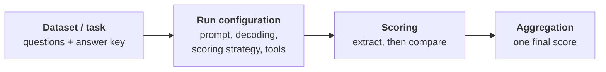
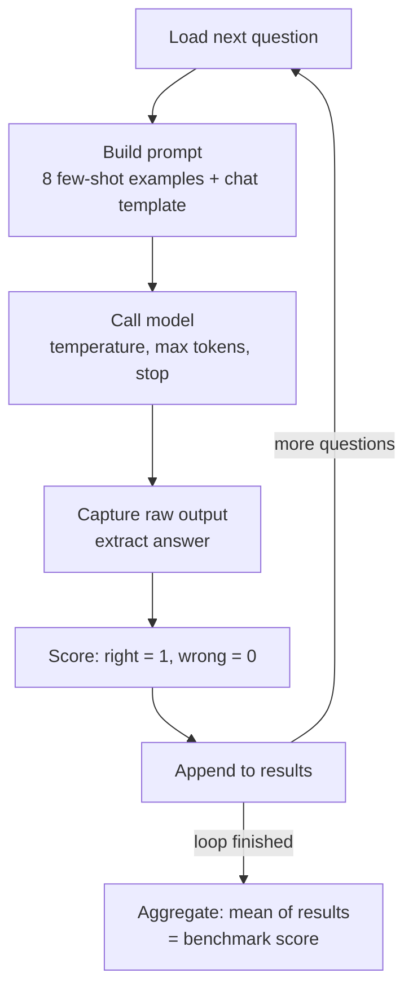
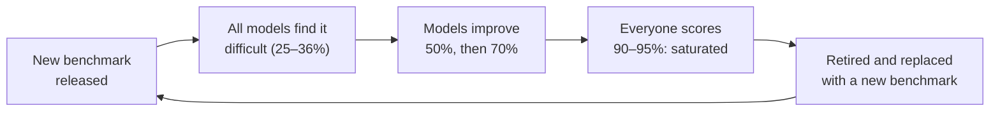

> **Video 8 of 19** · [Watch on YouTube](https://www.youtube.com/watch?v=qIiU3lyjrhM) · Translated from the
> Hindi transcript. Notes follow the video section by section, in its order.

A benchmark is a standardised test for one capability of a model; this video takes one apart, runs one, and then shows why the numbers should be taken with a pinch of salt.

## Where this fits

So far: why model evals are important, then what model evals are formally, with two types, **standardised benchmarks** and **custom evals**. This session is all about benchmarks. Before benchmarks came the **eight core capabilities**, which is what benchmarks test. With those done, you are equipped to study benchmarks themselves, in overview mode, over the next 10–15 minutes.

## What a benchmark is

"Benchmark" is a very famous term. Whenever a new model comes out, benchmarks are thrown at you from left, right and centre: this model scored so much on SWE-bench, so much on ARC-AGI. YouTube videos are made on the basis of how different models score on different benchmarks.

In simple words:

> A benchmark is basically a standardised test used to measure a particular model capability.

## The four parts of any benchmark

Pick up any benchmark and you will find four things in it:

1. **Dataset / task**
2. **Run configuration** (run config)
3. **Scoring method**
4. **Aggregation method**



The four are explained through one example benchmark, **GSM8K**. It is an old benchmark, from around 2020–2021, and is not used that much any more. The name stands for **Grade School Mathematics**, and **8K** means its dataset has around 8K rows. (Which capability does it test? Mathematics.)

### 1. Dataset and task

The dataset is **the questions plus the answer key**. Every benchmark's dataset has both questions and answers; it is like a golden dataset. GSM8K has maths questions with their solutions. A sample question:

> Natalia sold clips to 48 of her friends in April, and then she sold half as many clips in May. How many clips did Natalia sell altogether?

48 in April and 24 in May (half), so you simply add them: the answer is **72**, which is the answer given in the dataset. The whole dataset is very simple maths questions at grade-school level, the maths of sixth, seventh and eighth class.

You can find it yourself: search "GSM8K" and it turns up in two or three places, including Hugging Face and Kaggle. In the dataset's repository on Hugging Face, go to **Files and versions**, then **main**, and there it is: a question column and an answer column, around 8,500 question-answer pairs. MMLU and every other benchmark likewise has its own dataset of questions and answers.

Along with the dataset you are told a **task**. For GSM8K the task is: when the model is given a simple grade-school mathematics problem, it has to generate the answer.

### 2. Run configuration

Every benchmark also gives guidelines on the settings to keep while evaluating with it. You cannot run one model in one setting and another model in a different setting; when you evaluate two models, **all settings must be exactly the same** for both. Those settings are the run configuration, which has three parts: prompt construction, decoding and sampling configuration, and scoring strategy and environment.

#### Prompt construction

You pick a question from the dataset and send it to the model, which works out an answer. But along with the question you also send a **system prompt**, and how that is written matters: if the prompt differs, one model gives one result and another model a different one. So the benchmark fixes the prompt.

- **Zero-shot or few-shot.** Zero-shot means you simply give the question and say "solve this". Few-shot means the prompt first shows some solved questions of the same kind ("I solved these like this, got it?") and then attaches the question to solve. GSM8K uses few-shot: it is classically reported at **8-shot**, meaning eight solved examples go into the system prompt before your question. Zero-shot makes a model perform worse; few-shot improves performance.
- **Chain of thought or direct.** Allowing chain of thought means telling the model to look at the question and solve it step by step. The GSM8K answer itself shows this: Natalia sold 48/2 = 24 clips in May; Natalia sold 48 + 24 = 72 clips altogether. Without chain of thought, asked for the answer directly, the chance of a mistake is higher. GSM8K allows chain of thought.

So the options when constructing the prompt are few-shot, zero-shot, chain of thought, or normal.

#### Decoding and sampling configuration

- **Temperature** is kept around **zero** for benchmarks like this. Above zero, answers become creative and vary from run to run.
- **Max tokens** is fixed in advance, the same for model A and model B, neither very low nor very high. Too low, and because chain of thought is triggered, the answer may run out midway while the model is still thinking, so it never produces an answer. Too high, and a very powerful model can reason at great length.

#### Scoring strategy and environment

This is a very interesting setting.

- **pass@1**: show the model the question once; its one answer is either right or wrong. A **strict** strategy.
- **pass@k**: say pass@5; ask the same model the same question five times, and if it is right **at least once** in the five, count it as correct. A more **lenient** strategy.
- **majority@k** (for example majority@8): ask the same question k times, get k answers, and take the one that appears most often as the answer, basically the **mode** (as in mean, median, mode).

This too stays the same during evaluation. For GSM8K, most likely pass@1 is used (the paper would confirm it); some benchmarks use pass@k depending on how difficult their questions are. So when someone says their model scores 82% on some benchmark, dig in and ask whether that was pass@1, pass@k or majority@k.

**Tools** are also decided in advance. Allow web search and the model can quickly find an answer on the internet; give it a code interpreter and it will solve all the maths questions through code. GSM8K obviously does not allow tools. Some benchmarks do, such as **SWE-bench**, the software engineering benchmark, which tests solving GitHub issues: the model has to go to GitHub and fetch the issues, which needs tools.

### 3. Scoring method

You sent the question, with the system prompt, in the defined settings, and the LLM gave back an answer. That answer can come in any form: "The answer is 72", just "72", or 72 written out in words. Because it is an LLM, it can give any kind of output. Scoring has two parts.

1. **Extraction.** First you have to do a lot of work to extract the answer in the right format: enforce **structured output**, or use **regex**. Here the correct answer is 72, so you want exactly that number and nothing else.
2. **Comparison.** For a maths test it is an exact comparison: `72 == 72`. Any other number is wrong, giving **1 or 0**. For a benchmark with **open-ended** answers (72 is closed-ended), where a whole paragraph comes back as the answer, you have to use **LLM-as-a-judge**; an example of such a benchmark comes later in the course.

So the comparison is done programmatically, by LLM-as-a-judge, or by a human.

### 4. Aggregation

Every question gives a 1 or a 0. Aggregation combines them: if there were 1,000 questions and the LLM got 920 right, it scored **92%** on the benchmark. Most of the time it is this straightforward: give the LLM each of the 8,500 questions, score each answer, count the rights and wrongs, and assign a percentage.

Sometimes it is not. **MMLU** checks general knowledge across **57 subjects**, so you may publish a separate result per subject: biology 87%, physics 91%, economics 72%. Then you have to combine them into one overall MMLU score, and you cannot just add the percentages and divide by 57, because the data may have fewer biology questions and more economics ones. You may need a **weighted mean**. So aggregation has different strategies too.

### Summary, and where all this is written

A benchmark is a standardised test, and inside it: the **task** (what is measured), a **dataset** with questions and answers, the **run configuration** (the conditions the test runs under), the **scoring mechanism** and the **aggregation mechanism**.

All of it is written in the **research paper**. Most benchmarks you read about today were originally published as research papers. Search for the GSM8K paper and you find the paper in which researchers first presented the benchmark to the world, stating the dataset, run configuration, scoring mechanism and aggregation mechanism they used; the same dataset is then available on the internet. MMLU has its paper, SWE-bench has its paper, and the structure is always the same. That is researchers' job: studying how to test a particular capability of an LLM. Researchers in each field bring out benchmarks for that field, the benchmarks and their datasets become popular, and every new LLM that comes to market is measured on them.

Lots of benchmark names are deliberately held back for now; they come later, once the overall idea of what a benchmark is has settled.

## How a frontier lab evaluates a model on a benchmark, step by step

Imagine you are a frontier lab, OpenAI or Anthropic or whoever, and you train your own LLMs. You have trained a new one, say **CampusX v1**, and a new benchmark has come out and is getting very famous: **GSM8K**, which tests the mathematical capabilities of any LLM. You want to test CampusX v1 on it.

Simply put, model evaluation on a benchmark is **a loop**, in which each question of the benchmark's dataset is a row. You pick up a question, build the prompt exactly as the benchmark says, keep the settings exactly as the benchmark says, and send it to the LLM. The LLM sends back an answer; you compare it with the actual answer and score it using the benchmark's scoring mechanism. You do this as many times as there are rows, then aggregate all the scores using the aggregation strategy, which again the benchmark specifies. You are basically following the research paper.

The steps, as laid out on screen:

1. **Load the item**: the first time round the loop, load the first question.
2. **Build the prompt**: inject the few-shot examples if the benchmark is few-shot, apply the chat template, add any instructions. Now you have the exact string to send to the model. Here that means passing the item (the question), `few_shot=8` so eight examples go in, and the whole chat template.
3. **Call the model with the pinned decoding config**: `model.generate` (in LangChain you would call `invoke`), sending the prompt from the previous step, the temperature, the max tokens, and a stopping criterion so nothing goes wrong.
4. **Capture the raw output** and **extract the answer**. If the model said "The answer is 72", extract just 72 into the prediction.
5. **Score** it: is the answer true or false, right or wrong?
6. **Store** the score by appending it to a list.

After roughly 8,500 rounds the loop ends and you have a big `results` list with a 1 or 0 against every question. Take its **mean**, and that is your score on the whole dataset.

The on-screen code is pseudocode. Its shape, following the steps above:

```python
# Pseudocode, as shown on screen
results = []
for item in dataset:                                  # 1. load the item
    prompt = build_prompt(item, few_shot=8,           # 2. build the prompt
                          chat_template=chat_template)
    raw_output = model.generate(prompt,               # 3. call the model with
                                temperature=0,        #    the pinned decoding config
                                max_tokens=max_tokens,
                                stop=stop)
    prediction = extract_answer(raw_output)           # 4. extract the answer
    score = prediction == item["answer"]              # 5. score it
    results.append(score)                             # 6. store it
final_score = mean(results)                           # aggregate
```



At least for simple benchmarks, this is all you do; more complex benchmarks come later with their own examples.

## Why the loop is harder than it looks: eval harnesses

The process looks very simple: take a question, send it, check the answer, repeat. Just a loop, easily done. But when you write proper code rather than pseudocode, you realise it is not that straightforward:

- extracting the correct answer from "This is the answer: 72" or 72 in words needs extra code;
- the exact scoring mechanism from the benchmark paper needs its own code;
- sending thousands of questions to an LLM needs a **batching** strategy;
- when an API call fails midway you need **retry** code;
- if there are **rate limits**, you need code to handle them.

The job is just a loop, but running a **reliable** loop at the scale of 8,000–10,000 LLM calls needs a lot more engineering around it.

So people generally do not write all this themselves. All that plumbing code on the side, handling these additional things, has a name: an **eval harness**. An eval harness is a piece of code that you write in order to execute model evaluation, and in practice libraries do it for you. Famous ones:

- **LM Evaluation Harness**
- **Inspect**
- **HELM**

With these you can test your LLM on any benchmark without writing much code. Without them you would write all the plumbing yourself, which is hectic, and it might not be standardised, so one evaluation gives one result and the next gives another. The analogy on screen: the **benchmark is the exam paper**, and the **eval harness is the administration that conducts the exam**, handling everything else on your behalf.

## Demo: running GSM8K with LM Evaluation Harness

The demo needs an OpenAI API key (the one used on screen is deleted afterwards). First install the library, `lm-eval`:

```bash
pip install lm-eval
```

The key is needed because the model being tested is an OpenAI model. You could equally test another model, including one pulled from Hugging Face; the library supports that. **LM Evaluation Harness** (search for lm-evaluation-harness) is a very famous library built by the company **EleutherAI**. It lets you run model evaluations and already supports a lot of benchmarks, with a list of which ones somewhere in its documentation. This demo uses GSM8K.

After providing the OpenAI key, the whole evaluation is not even code but a single command:

```bash
# (implied, not shown in narration): the --model value, the max_retries number
# and the output_path value are not read out
lm_eval \
  --model openai-chat-completions \
  --model_args model=gpt-5.6,num_concurrent=5,max_retries=3 \
  --tasks gsm8k_cot \
  --num_fewshot 8 \
  --apply_chat_template \
  --limit 20 \
  --output_path results \
  --log_samples
```

What each part does:

- **model_args**: which model to evaluate. The target is GPT-5.6, which has just come out. `num_concurrent=5` is how many questions it handles concurrently; `max_retries` is set too.
- **tasks**: the GSM8K benchmark, with **CoT**, meaning chain of thought is allowed.
- **num_fewshot 8**: 8-shot prompting.
- **apply_chat_template**.
- **limit 20**: evaluate only 20 questions rather than the whole dataset, because this run only checks that the setup works. For a proper evaluation you would drop this line and all ~8,000 questions would be evaluated. That is avoided here on cost: a full GSM8K evaluation would cost about **₹2,300** for one run, whereas 20 questions costs hardly ₹3–4, or less.
- **output_path**: where the results are written.
- **log_samples**: log every result that comes back.

Running it starts the evaluation. No loop, no code: everything is handled by one command. That is the level of abstraction an eval harness gives you; otherwise you would write this code and all the plumbing yourself.

Behind the scenes it makes 20 API calls, one per question. The result comes out at **around 90%**: the model got **18 of 20** questions right. The logging is there too: a GSM8K results folder, a folder for the model, and a JSON object for every question with its doc id, which question was sent and what answer came back. The whole evaluation is there to go through at leisure (the code is shared with the class).

That is how evaluation is done, and these libraries make it this easy for any supported benchmark. What just ran was a small, not very significant evaluation. But remove the `--limit` and you are genuinely testing GPT-5.6 on GSM8K, and that result could be published. OpenAI would do the same.

### DeepEval also has benchmarks

**DeepEval** offers this too. In its docs, under **Benchmarks**, then **available benchmarks**, there is a list that includes GSM8K. But DeepEval sits more on the application-eval side, and running an OpenAI model through it needed a lot of code, whereas LM Evaluation Harness needed not even code, just one command. That is why it was used here. Think of DeepEval as mainly for application evaluation; it lets you try out your own small fine-tuned LLMs on a benchmark, but its benchmark options are limited and mostly **saturated** benchmarks. The most premium option is LM Evaluation Harness: it is the standard, used in industry, including by big companies, to run benchmarks.

## Who runs benchmarks

Most benchmarks are open, freely available on the internet, so anyone can evaluate any LLM. So who actually wants to? There are primarily three categories.

### 1. Frontier labs

The obvious candidate: OpenAI, Anthropic, Google DeepMind. Whenever they bring out a model they benchmark it, because it helps them in three ways.

- **During development.** Benchmarks show whether the next model they are training is improving on the previous version. They pull out the model at different checkpoints during training and run benchmarks, so during pre-training they have a fair idea whether training is going in the right direction, and can change its trajectory midway.
- **Release gating.** Deciding whether the new version is better than the previous one and whether to release it.
- **Marketing.** If a new model scores very well on a particular benchmark, that is great marketing. You will have heard channels say "this new model has totally smashed the coding benchmarks", and then every YouTuber covers it.

:::warning

As an AI engineer choosing a model for your application, **don't rely on the benchmark numbers given by the frontier labs.** Ask who ran the evaluation. If the answer is "we did, in our controlled settings", don't trust it much. It is like a car's quoted mileage of 25 against the much lower figure you get when you actually drive it. Lab numbers are a **ceiling**, the upper limit, because the labs create favourable conditions in every way before running benchmarks and publishing the numbers. On top of that they **cherry-pick**: the benchmarks their model does well on go right at the top, the ones it does poorly on go further down, so the model looks like a beast, but in real-world use the results are not that impressive.

:::

This has happened to everyone. Very hyped models keep arriving. Take Fable: in personal use it did not match its hype. Your experience may differ, but it never felt as strong as it was made out to be, strong enough that "the government has banned it"; Einstein-level answers were expected and did not appear. People even said that behind the scenes it sometimes sends queries on to Opus. So be careful.

### 2. Third-party evaluators

Some leaderboards exist, such as **LM Arena**, and some companies whose whole job is benchmarking different LLMs, building a ranking score and listing them. They have done this for a long time, so people have come to trust them. When they test a Claude model and an OpenAI model, they test both **in the same conditions**, so their ranking is more reliable. These are independent organisations whose product is evaluation itself; that is what they are paid for.

Their numbers are the most reliable and trustworthy. The LM Arena leaderboard, for instance, is run by a third party and explains how the whole leaderboard is built. They also tell you things many leading labs do not, such as the **cost and latency** of using each model. Labs just give the benchmark number, not how long it will take or how much it will cost.

:::note

LM Arena ranks models mainly from crowdsourced human votes, where people compare two anonymous models' answers side by side, rather than by running fixed benchmark datasets like GSM8K. It is a third-party ranking, as described, but its method is human preference, not a standard benchmark run.

:::

### 3. AI engineering teams (you)

Teams building LLM-based applications often do not rely on either of the above. They say: we have the tools, publicly available benchmarks and libraries like LM Evaluation Harness, so let's run our own evaluation and see how the model scores on a particular benchmark **in our conditions**, and test its latency and cost too.

So there are three stakeholders who do, or can do, these evaluations: **frontier labs**, **third-party evaluators and companies**, and **AI engineers themselves**.

A student's comparison from the class is accepted as right: leaderboards are like **IMDb ratings for models**. What a leaderboard actually is, an aggregation of multiple benchmarks, and which other leaderboards exist, is covered properly in the next class rather than this one.

## Why benchmarks mislead

Benchmarks are super important and tell you about a particular capability of an LLM, but they are not flawless, and you should not always believe what they say. In a lot of scenarios benchmarks are **misleading**, so you cannot trust them blindly; be very, very careful whenever you read one. There are four kinds of problem.

### 1. Benchmark contamination

Many benchmarks, MMLU, GSM8K and many more still to come, are **public benchmarks**: the research paper, the whole methodology and the dataset are all publicly available on the internet. The ones that came out long ago, in 2021, 2022 or 2023, have had their datasets online for a long time.

Now imagine OpenAI trained 5.6 recently, six months ago, scraping the whole of the most recent internet data into it. There is a good chance the public benchmark's dataset, the questions **and their correct answers**, became part of the model's pre-training. If it has already seen all 8,000 questions and answers, then when you later ask it one, there is no guarantee whether it is **thinking or has memorised it**.

So for big models pre-trained on huge datasets, these benchmarks are often **contaminated**: the model already knows the answers because they were in its training data. This is a very big problem, especially with public benchmarks. The solutions:

- use **private benchmarks** (there are many; covered next class);
- use **dynamic benchmarks**. Ordinary benchmarks are **static**: once published, the dataset stays the same for years. Dynamic benchmarks keep updating their dataset, daily or within some window.

### 2. Benchmark saturation

A benchmark comes out, say in 2021. It is new, no model has seen it, and most models perform poorly on it, scoring 25% or 36%, all hovering around there. But the benchmark is static while models keep improving every six months, so the new models gradually do better on the same benchmark: the previous generation was at 36%, then models reach 50, then 70. Over time they hover at 90–95% and **all cluster in one place**, with little difference between them: the most recent Opus at 95%, GPT-5.6 at 94%, Google Gemini at 92%.

That clustering is **benchmark saturation**. The benchmark is no longer useful because it cannot differentiate models: if everyone gets the same marks, what use is the exam? How do you tell who is good and who is bad? So the benchmark is removed, a new one is brought in, and the industry starts working on that.

GSM8K, the example used throughout, is a saturated benchmark: everyone gets 94, 95 or 97% on it, and it is not used. MMLU is saturated. SWE-bench has saturated too.

So benchmarks have a **life cycle**:



### 3. Configuration gaming

When frontier AI labs run benchmarks themselves, they can **tamper with the configuration**: give their own model the most favourable conditions and the rival model default ones. The basic idea is that within the run configuration you give yourself the most favourable conditions. For example, run GSM8K but give your model a **Python interpreter** tool; it writes code to solve all the maths questions and obviously scores better.

There is a lot of room for tampering with configuration, and it creates a lot of variation, 5–10%. So be wary, especially of frontier labs saying "our model totally smashed it". Never accept that. How did you test the model in your own house? You have your own eval harness; what did you change in it? What max tokens, what reasoning level, what temperature? What is the latency, what is the cost? None of that is stated; you just get a number, 92% on this benchmark. That is not to be trusted.

### 4. Aggregation

Aggregation, the last step where per-question numbers are combined, is where many people play smart. MMLU has questions from 57 subjects. A model might score well in physics but very poorly in economics. The model provider, instead of giving individual scores, gives you the **average**, and never mentions the weak economics result.

Now suppose you have to build an **economics-based chatbot**. You see the good MMLU score across 57 subjects and deploy the model. It performs very badly on economics questions, because its separate economics marks were very poor. Because things can be hidden inside benchmark numbers, you did not find out, and this happened to you.

### Take benchmarks with a pinch of salt

These four are the major reasons to take benchmarks with a pinch of salt. Don't accept the number thrown in your face. Implement a **methodology of your own**, and decide on that basis which model will work for you and which will not. That is discussed further later.

## What comes next

Not everything planned was covered in this session. One more session continues the topic, on how to handle this more practically, including the leaderboards and private benchmarks deferred above.
