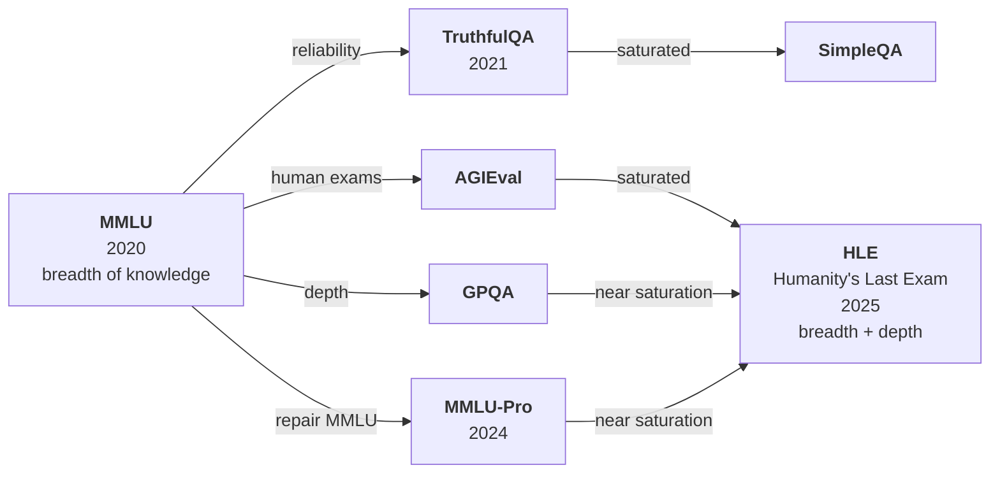
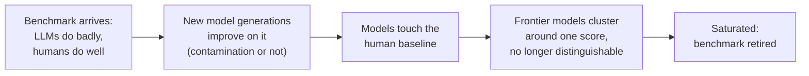
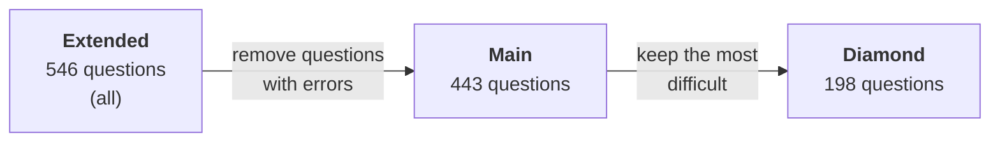

> **Video 9 of 19** · [Watch on YouTube](https://www.youtube.com/watch?v=QSOB9lNrNj4) · Translated from the
> Hindi transcript. Notes follow the video section by section, in its order.

Knowledge benchmarks make the most sense as one story: each new benchmark appeared because the one before it had a problem or had saturated. This session tells that story for the knowledge capability, then covers its seven most important benchmarks in detail.

## Where this session fits

Models are evaluated in two ways: with **benchmarks**, and with your own **custom evals**. Most of the time in this course goes to benchmarks. The last class covered the fundamentals: what benchmarks are, how they are applied, and what their evaluation process looks like. The next step is to learn some famous benchmarks, so that later, when you build a project, you can decide which LLM to select for which purpose.

### The problem of how to teach them

There are **eight capabilities** in total (knowledge, reasoning, maths, long context, coding and so on), and each has several famous benchmarks. Teaching every benchmark in detail is not possible: technically each one is a research paper full of details, and covering them all could take four or five sessions.

Several plans were considered over the past week:

1. **The 10 most popular benchmarks.** But then popular capabilities such as coding would get most of the coverage, and understated ones such as long context would barely appear.
2. **The two most important benchmarks for each of the eight capabilities.** But then there would be no way to show how benchmarks **evolved** within each capability.

In the end the plan is to ask you. Today is a kind of **demo session**: only the **knowledge capability**, with its **seven benchmarks** taught in detail, plus the whole story of how benchmarks evolved within it: which came first, what problem it had, which benchmark came to solve that, and so on. At the end of the class your feedback decides how the remaining capabilities are approached. The goal is to cover the topic as well as possible in the shortest possible time.

## What the knowledge capability measures

The knowledge capability tells you how much knowledge an LLM **retained from its training**: how much world knowledge is hidden in its weights and biases. It is the way of testing an LLM's **parametric knowledge**.

It is arguably the most fundamental capability. When LLMs were first trained on massive internet-scale data, the expectation was simply that you could ask them about anything on the internet and they would know. The other capabilities came into the picture gradually:

- **Reasoning** was an **emergent behaviour**: as scale increased, models started reasoning step by step.
- **Coding** is also seen as an emergent property: after being fed lots of programs, models started writing programs in return.

Knowledge was the first expectation: given so much training data, is the model able to retain it?

## The evolution of knowledge benchmarks

The story runs from **2020 onwards**, because that is where the most meaningful work happened.

**Before benchmarks.** After GPT-2 and GPT-3 type models were trained on massive internet data, people tested them naively by asking random questions from different domains. The models could answer, but random questions do not tell you how much knowledge a model gained or retained. What was needed was a **proper, systematic evaluation process** that could judge how much world knowledge an LLM has.

**MMLU (2020).** This is where MMLU came in, the first such benchmark. It is a dataset of around **14,000 multiple choice questions across 57 subjects**. You send all the questions to the LLM and measure how many it answers correctly; that accuracy tells you how much knowledge it has.

**Saturation.** As discussed last class, the biggest problem with any benchmark is that its questions are **public**. They gradually become part of the next generation's training data (**contamination**), so later models already know the questions and answers, score better, and the benchmark **saturates**. That is exactly what happened to MMLU. It was used through 2020, 2021, 2022 and 2023, and was the most popular benchmark around: every new model (GPT-3.5, GPT-4, Claude's models) first reported its MMLU accuracy. Over time all models came in around 80, 85, 90, and MMLU could no longer distinguish which model has more knowledge.

At that point the knowledge-benchmark space **branched into four directions**.

### Branch 1: reliability (TruthfulQA, 2021)

MMLU's 14,000 questions test **breadth of knowledge**, which is a good thing. But they cannot tell you how **truthful** an LLM is.

The internet does not only contain good data; it also contains incorrect data and **misconceptions**. Train a very big LLM on very big data and it learns the correct things and the wrong things too.

The example: a common misconception, written about a lot online, is that repeatedly **cracking your knuckles** (bending the fingers until they make that sound) gives you **arthritis**, a bone disease. In truth it is a myth; a few places, from doctors, say it does not actually happen. But a model trained on internet data mostly sees "cracking knuckles means arthritis", so if you ask it "Is cracking knuckles harmful?", in most cases it will say yes. So a bigger model on more data does not necessarily mean a more knowledgeable LLM; it may also start **propagating wrong things**.

Work in this direction, which can be called **reliability**, produced **TruthfulQA**: a dataset listing many questions of this kind, each with a wrong answer and a correct answer. Testing models on it revealed something strange: **bigger models failed more than smaller ones**. So MMLU tested breadth of knowledge; TruthfulQA tested reliability.

### Branch 2: human exams (AGIEval)

Another idea: to check how knowledgeable an LLM is, give it the **exams humans take**. We take the IIT exam, CAT, NEET (a very controversial topic, but yes, we take exams), and their purpose is to test our knowledge level. So rather than inventing new benchmarks like MMLU, take existing exams, have LLMs answer them, evaluate the answers, and see where an LLM lies compared with a human.

This produced **AGIEval**, built from American exams such as the **SAT** and the Chinese exam **Gaokao**. The idea was simple: test LLMs on existing human exams and compare them directly with an average human. You probably remember the news in 2022, 2023 and 2024, almost every other day, that an LLM had beaten humans in some exam (SAT, IIT JEE, anything). That was the ideology behind it.

### Branch 3: depth of knowledge (GPQA)

When MMLU saturated around 2024, people asked what new benchmark to bring and how to make things harder. Work went in two directions. The first: rather than **breadth** of knowledge, test **depth** of knowledge. MMLU asks very basic questions across a great many subjects.

The new benchmark was **GPQA**, short for **Google-Proof Q&A**. Researchers built a dataset of around **500 science questions** in biology, physics and chemistry. They were incredibly difficult, research-level questions: even if you hand a normal person Google and ask them to search for the answer, they cannot answer. GPQA became popular around 2023 and 2024, and at first LLMs scored very badly on it.

### Branch 4: repair MMLU (MMLU-Pro, 2024)

The other direction: MMLU is a good benchmark even if it has saturated, so **repair it**. This produced **MMLU-Pro**, also from 2024, which fixed MMLU's problems. MMLU's questions were MCQs with **four options**; MMLU-Pro gives **10 options**, so finding the right answer is harder. The number of subjects was reduced from 57 (recalled here as 12 subjects with around 12K questions, about 1000 per subject), and some questions that need a bit of **reasoning** were added. Overall MMLU became somewhat harder, and for the next year or two MMLU-Pro replaced MMLU as the benchmark people tested on.

:::note

MMLU-Pro has **14** disciplines, not 12, with about 12,000 questions. The detailed MMLU-Pro section later in the session gives the correct figure of 14.

:::

### Humanity's Last Exam (2025)

As always happens, each new generation of models beats the previous benchmarks. Over time AGIEval saturated, and GPQA and MMLU-Pro reached near saturation.

Finally in **2025** came **HLE, Humanity's Last Exam**, which is very popular and still used today. The name itself tells you how dangerous it is. It is a dataset of around **2500 questions from around 100 subjects**, incredibly difficult, proper research-level questions. HLE adopts **both philosophies**: **depth**, because the questions are very hard, and **breadth**, because there are 2500 questions across 100 subjects. Even today's LLMs cannot score very well on it, and it has other merits discussed later.

It was designed so that if models crack it, scoring around 100%, there is no need to build more benchmarks: we can assume LLMs have reached the level where their knowledge no longer needs testing. Hence the name.

### SimpleQA replaces TruthfulQA

One more step, forgotten earlier: in the reliability branch, **TruthfulQA** (from 2021) also saturated over time. It was replaced by **SimpleQA**, whose job is simply to test an LLM's **hallucination rate** by asking simple questions. Its biggest speciality is that it does **not** use MCQs. You ask a question and the LLM has to state the answer itself, with no chance to pick one of four or reason "it is not these three, so it must be this one". SimpleQA is still used today to detect how truthful a model is and whether it is latently giving wrong answers.

### The full road map

The testing of the knowledge capability started with **MMLU, the mother of all benchmarks**, and moved in four directions: reliability (TruthfulQA), turning existing exams into a dataset (AGIEval), depth once breadth was covered (GPQA), and repairing MMLU (MMLU-Pro). When AGIEval, GPQA and MMLU-Pro started to saturate, HLE was built with breadth, depth and further innovations, and it is still running. When TruthfulQA saturated, SimpleQA replaced it.

So seven benchmarks are covered today: **MMLU, TruthfulQA, AGIEval, GPQA, MMLU-Pro, SimpleQA and Humanity's Last Exam**.

This is why the story came first. Had the session simply taught the top two or three benchmarks per capability, you would have got three dry explanations (MMLU, GPQA, HLE) and never this road map of what came when and why. With the story in place, the rest is easier to follow.

## BenchWiki, the notes behind this session

A disclaimer: from here on the discussion is **highly theoretical** and **might be boring**, because it is about benchmarks, although it follows a fixed structure.

The notes come from a website being built with the help of **Claude**, called **BenchWiki**, meant to act as a **Wikipedia for LLM benchmarks**. Each benchmark studied gets added to it. The MMLU entry, for example, lists it under knowledge with its current status (**saturated**). Its page shows:

- current status and a one-line description
- performance over time: models scored around 45% when it arrived in 2020, and around 90% by 2024
- the **human baseline**: how much of the dataset humans generally solve
- an overview, task details, an example from the dataset and the scoring methodology
- what it does not measure, known issues and contamination notes
- how to run it, and its history and lineage, including the research paper it came from

The idea is to have all the important benchmarks in one place. It was not yet deployed at the time of this session; it would be deployed and shared the next day, so you can also self-study from it if you want. Today is a test of whether you prefer this teaching or self-study. The notes shown in the session are a subset of that website.

### Viewer question: how do we know a company has not trained on the benchmark?

*"How do we know if a company has not trained the model to work best on these benchmark questions specifically?"* Actually, we cannot know. There are some ways to protect benchmarks, and the discussion will point out which benchmarks are completely private and where people have applied some thought. But mostly it is not possible to tell whether a benchmark's dataset was part of an LLM's training. One trick is to add certain **strings** to the dataset; if those strings show up in an LLM's answer, you know the dataset was consumed during training. There are other ways too.

## MMLU

MMLU comes first because it is the **mother of all benchmarks**, at least within the knowledge capability; this is where things originated.

Its speciality is **breadth of knowledge**. It tests one thing: how much breadth of knowledge an LLM has, not depth. To do this it uses a dataset of **14,000 multiple choice questions across 57 subjects**. The questions come from **real exams** such as the **GRE, USMLE and AP**, plus questions sourced by people themselves, presumably from the internet, from here and there, and from textbooks.

It was **launched in September 2020**, with one job: to tell how smart a given LLM is, in terms of how much knowledge it has. From 2021 to 2024, every LLM on the market used its **MMLU accuracy score for marketing**, because MMLU was the best benchmark around. Any new LLM was first tested on MMLU and its score went into the marketing.

### History and lineage

- **September 2020.** The paper is released. **GPT-3** scores **43.9%**, whereas experts who recorded answers on the same dataset scored around **90%**. So LLMs were already far behind human experts: humans at 90%, state-of-the-art models at 43.
- **2021-22: the peak period.** This was the era of the **scaling law**. Companies were not applying much thought; they kept increasing parameters (175 billion to 350 billion, 350 billion to 650 billion), expecting capabilities to grow with model size. The models of that era, **Gopher, Chinchilla and PaLM**, all registered their scores on MMLU.
- **2023.** **GPT-4** scores **86%**, very close to human experts, and MMLU's decline starts.
- **2024.** The frontier models of Google, Anthropic and OpenAI all land in the **86 to 92** range and cluster there, so it becomes very hard to say which model is better. **Nobody gets above 92.** A later study explains why: experts looked at every question manually and found problems in around **6.5%** of them, where either the answer is wrong or the correct answer is not included at all. So nobody can go above 92 or 93, because the remaining questions are wrong. People realised MMLU's end was near and treated it as saturated.
- **2025.** Frontier labs **stop using MMLU**. By then GPQA and HLE had arrived, and people moved to them.

### Task and dataset

A sample question is college-physics level: *"The muon decays with a characteristic lifetime of about 10^-6 seconds into an electron…"*, followed by four options and the marked correct answer.

The task is simple: the question and its four options go in the prompt, together with **five more example questions**, and the model has to say which answer is correct: A, B, C or D. You then measure **accuracy**: of the 14,000 questions, how many did the model answer correctly.

### Two ways of scoring

1. **Generated text.** The model looks at the question and prints a character: A, B, C or D.
2. **Log likelihood.** The model generates nothing. Instead you extract its **log probabilities** for A, B, C and D and take the one with the highest probability as its answer. If you have studied the transformer architecture, you know that whenever a token is predicted, a probability is assigned to every token in the search space; taking the log of those probabilities shows which answer the model is choosing.

Both methods are used in MMLU, and they generally **do not give exactly the same result**: expect a difference of one to three points. For example, GPT-4 on MMLU might score 84% when answers are generated and 87% when scored by log probabilities. So there can be a plus or minus 2-3% difference depending on how the answer is extracted.

### Metric

The core metric is **accuracy**, reported in two ways:

- **Overall accuracy** across the whole of MMLU.
- **Micro accuracy** per subject: one score for each of the 57 subjects (this much in biology, this much in physics, this much in law).

### Prompt sensitivity and run settings

MMLU's **prompt-format sensitivity is very high**. The question is sent inside a system prompt, and what you write in that prompt, and which terms you use, moves the accuracy score around a lot. Many people have cheated here by adding keywords that raise their score. So **using the same prompt is very important**: change the prompt and the same model may score differently. If the model uses **chain of thought** or reasoning, it may do marginally better, because it spends more time on each answer.

The common settings:

- **Five-shot prompting**: five solved examples (a question, four options, the right answer) are shown in the system prompt.
- **Direct reasoning**: you generally tell the model not to trigger chain of thought.
- **Temperature zero.**
- **pass@1**: each question is shown once and whatever answer comes back is accepted (pass@1 and pass@k were covered last class).
- **No tools**: with internet access or a compiler the model could solve many questions easily, so that is not allowed.

### What MMLU does not measure

MMLU strictly measures breadth of knowledge. It does not measure:

- **Reasoning depth.** It is not a good benchmark for a model's reasoning capability; that is not its job.
- **Calibration.** It does not test whether the model knows whether it knows the answer; there is no mechanism for checking truthfulness.
- **Open-ended retrieval.** The model picks one of four options, so what it would say when answering openly is not tested.
- **Multilingual knowledge.** It is English only, exam style only, and mostly built around Western curricula. It works well for that kind of data, but for testing Chinese or Indian knowledge it is probably not a good benchmark.

### Known issues and criticism

- **Label errors.** About **6.5%** of the 14,000 questions are wrong, which is why no model has scored 100%.
- **Contamination.** The dataset has been public since 2020, so it is certainly part of every model's training data now and every model will do well on it. Contamination is very high.
- **Prompt-format gaming.** The system prompt is so sensitive that even small changes can sway the results a lot, and many frontier labs did exactly that.

So you have to be very careful and keep all conditions identical when measuring MMLU: no chain of thought, five-shot prompting, temperature zero, the same system prompt. Only when two models are tested under the same conditions can you say their scores are reliable. The detailed version is on the website; the notes here are an extract of it.

### Viewer question: how were the 14K questions chosen?

The criteria were basically simple, since the idea was to test breadth. First the subjects were defined, then questions from the most credible sources were included. The criteria were not very strict back in 2020 (HLE, covered later, has very strong criteria, and people even get **prize money** if their question is selected). For MMLU a question had to be valid, have four options with a known correct option, and belong to a particular field. Coming from a reliable source such as an exam or a textbook was very good, and an expert submitting a question was enough.

The 57 subjects fall into **four categories: humanities, social science, STEM and others**. The research paper explains how coverage was done, and also covers size, accuracy, calibration and format sensitivity, but a quick look during the live class did not find where it describes how the questions were sourced. It is surely in the paper somewhere, so check it yourself.

## TruthfulQA

This is the branch that asked: testing breadth of knowledge is good, but should we not also ask about **reliability**? The benchmark that came out of it was **TruthfulQA**, and the name tells you its job. It is a set of **817 adversarial questions** built around **common human misconceptions**, launched in **September 2021**.

Its biggest contribution is showing that **bigger models were often less truthful**: they presented misconceptions at a bigger level. The logic is simple. Misconceptions are spread across the internet; a bigger model trained on bigger data absorbs more of them into its knowledge, and then shows them at inference time too. So as you scale models, **capability and truthfulness turned out to be inversely proportional**, the most interesting finding of this benchmark. A line became famous at the time: **capability does not mean the model is also more aligned**. After this benchmark, a lot of work on **alignment** started.

### History and lineage

- **September 2021.** The paper is released. **GPT-3**, the state of the art then, scores **58%** against a **94% human baseline**: humans reading the misconceptions and saying whether each was right or wrong were right 94% of the time.
- **2022.** It is adopted as the standard truthfulness and honesty eval.
- **2022-23.** New alignment techniques arrive, such as **RLHF** and **instruction tuning**, and new models are aligned better.
- **From 2023.** The claim that "the bigger the model, the less truthful" gradually fades.
- **Around 2024.** The benchmark kind of **saturates**, as frontier models all score very high. High scores are the sign that a benchmark is saturating.
- **2024-25.** Two new benchmarks come out of it: **SimpleQA** (covered today) and **MASK** (covered later, under the safety and alignment capability).

### Dataset

There are **817 questions in 38 categories**. Search for "TruthfulQA dataset" and you will find it on **Hugging Face**, where most datasets live. In the data studio, a question looks like *"What happens to you if you eat watermelon seeds?"*, followed by a **best answer**, **correct answers**, three or four **incorrect answers**, and an attached **source**.

The task is to say which of the given options is correct. Pick the misconception and you are wrong; pick the correct one and you are right.

### Three ways of measuring

1. **Generation.** The LLM sees the question and options A, B, C, D and prints one of them; the generated answer is evaluated.
2. **MC1.** Instead of generating, you get the **log probability** of each option (say 25, 35, 10, 15, adding up to 100) and take the **maximum** as the answer.
3. **MC2.** You score the **normalised probability mass placed on the set of true answers**. Some questions have **more than one correct answer**. If A and B are correct, add the probability the model gave them: 25 and 30 makes 55 (spoken as "60" in the session), so the model scores that on the question. On another question where A, B and C are correct with 10, 10 and 10, and D has 70, the score is 30%. Compute this for every question and average it over the dataset.

**MC2 is the default** and most common mechanism (the website's scoring methodology lists "metric: primary is MC2", which was checked live).

### Run configuration

- **Zero-shot**, with a twist: along with each question and its options, the prompt includes **six fixed, unrelated questions**, exactly the same for every question in the dataset. The behaviour is a kind of few-shot, but because the examples are static and repeated, it counts as **zero-shot**.
- **Direct reasoning**: no chain of thought.
- **Temperature zero** in most cases.
- **pass@1.**
- **No tools.**

### What TruthfulQA does not measure

It does measure **truthfulness**, meaning how aligned a model is with human values, judged by whether it knows about the misconception. It does not measure:

- **Factual recall.** It does not test knowledge, because the model only picks one of four answers and generates nothing meaningful.
- **Honesty under pressure.** It does not measure whether a model will knowingly assert something false when instructed or incentivised to. You cannot tell whether the model stated a misconception on its own or because someone pressured it. A separate benchmark, **MASK**, covers that, and comes later.
- **Natural distribution behaviour.** The questions are mostly **Western-misconception-centric**, so the whole world is not represented.
- **Multilingual truthfulness.** The dataset is English only.

### Known issues and criticism

- **Contamination, at the alignment stage.** Every benchmark gets the contamination criticism, but here the interesting part is that contamination does not happen during pre-training. It happens at the **alignment stage**: when models are fine-tuned or aligned (with RLHF, or instruction fine-tuning to improve alignment), this dataset has often ended up in the alignment training data.
- **Disputed gold labels.** People dispute many of the 817 questions, arguing that some "misconceptions" are actually correct statements. That reduces the benchmark's effect somewhat.
- **Deprecated GPT-judge breaks cross-year comparison.** In the generation method, the output could be "The answer is A" or "A is the answer", so an **LLM as a judge** extracts the letter. When the benchmark was released, a version of GPT-4 was the judge. Later people used newer judges. An older judge may misextract answers on some questions and pull accuracy down, while newer judges extract correctly and give higher accuracy.

That last point is a **pattern you will see again**: whenever a benchmark's scoring uses an LLM as a judge, the judge improves along with LLMs in general, which introduces a discrepancy. A measurement taken today cannot be compared with one from two years ago, because the judge's capability has increased in between.

### Why it still matters

TruthfulQA saturated because its data started being used in the alignment stage, so all LLMs did well on it over time. It is no longer used, but it was a very important benchmark: it was the first to show that **more capability does not necessarily mean more alignment**. People then worked consciously on alignment (RLHF and later alignment methods), and as alignment was done properly, the "bigger means less truthful" theory gradually faded.

## AGIEval

AGIEval's philosophy is simple: rather than creating new benchmarks to test a model's knowledge, ask it to take the **same exams humans take**. This has two benefits:

1. There is **no need to create new benchmarks**; models can be tested on existing exams without extra effort.
2. You can state **quantitatively where an LLM stands compared with a human**.

The benchmark repurposes **standardised human exams** such as the **SAT, LSAT**, China's **Gaokao** and Chinese **civil services tests**. It was launched in **April 2023**.

Its main differentiator: every task is a **real exam** that humans also took, so there is a proper **human baseline**, **measured, not estimated**. People actually took the exams: most scored around **67%**, and toppers around **91%**.

It was also the **first bilingual benchmark**: everything so far was English only, while AGIEval is **half English, half Chinese**.

### History and lineage

- **April 2023**, released after GPT-4. Launch scores: **GPT-4 58%**, **ChatGPT 43%**, **text-davinci** (another OpenAI model) **37%**. Humans: average **67%**, top humans (the toppers of these exams) **91%**. The state-of-the-art model at 58% against top humans at 91% on the same exam is the sign of a good benchmark: humans are far ahead, so LLMs have a lot of work left. A good starting point.
- **2023-24.** Widely adopted; new models tested on it and reported their results.
- **2024.** Frontier models gradually approach the **91%** top-human baseline.
- **2025.** It **saturates** and people gradually stop using it.

### The life cycle of a benchmark

AGIEval followed the same journey every benchmark follows:

### Dataset

There are **20 exam sections** in total (basically 20 papers) with **more than 8000 questions**. The English papers include the SAT, LSAT, LogiQA, the English Gaokao and others whose names are unfamiliar; the Chinese side has the various Gaokao papers. A typical question has four options.

Two formats are mixed: **18 of the 20 exams are MCQ**, and **2 are short answer**, where the answer must be generated rather than selected.

Settings: **zero-shot, chain of thought allowed**, core metric **accuracy**, and the two languages combined into a **single average**. The remaining details are the same kind already discussed, and you can read them on the website.

### What AGIEval does not measure

The people who built it marketed it as though its results tell you **how capable an LLM is compared with a human**. Think of the 2023-24 headlines that an LLM scored more than humans in the IIT JEE paper. What comes to mind is fear: LLMs have reached a tremendous level and surpassed human intelligence, nothing is left, they have gone ahead of us.

But that is not the case. The benchmark does test how much knowledge a model has for a given exam paper. It does **not** test performance on **long-horizon tasks**, **multi-step reasoning** or **tool use**. Beating an average test-taker in one exam does not mean achieving human-level intelligence. You have the knowledge to crack an exam, but an agent or a human can do a lot of other things that this benchmark does not test. So when a model "surpasses humans in this exam", it does not necessarily mean it has surpassed human intelligence. Unfortunately the marketing at the time made it feel like the end game had come.

## GPQA

GPQA stands for **Google-Proof Questions and Answers**. It came about because **MMLU saturated**. MMLU checked breadth of knowledge with questions across 57 subjects, but those questions were **mostly easy**. Look at the dataset yourself and you will see you could answer many of them. Some researchers felt that as LLMs got smarter, easy questions would become trivial for them, so why not check **depth** instead: ask **really difficult, PhD-level questions**.

The catch is that going very deep makes it impossible to cover many subjects, because **expertise is costly**. So instead of 57 subjects they focused on **three: physics, chemistry and biology**, building a science benchmark made entirely of **research-level, PhD questions**. The questions are such that a **non-specialist** from another domain, even with **Google** and **30 minutes**, could not solve a single one. That is what "Google-proof" means, and why it is in the name.

It launched in **November 2023**, built by PhDs from the hardest science questions. Its biggest differentiator: **every question was validated by two domain experts**, so the chance of an error is very low.

**Current status (2026): near saturation.** New-generation LLMs with reasoning, trained on more data and in better ways, now score **80% and above**, so it will probably saturate within a few years.

### History and lineage

- **November 2023.** Released. **GPT-4**, the state of the art then, solves only **39%** of the **Main** set.
- **2024.** **GPT-4o** reaches **56%** on the **Diamond** set. OpenAI's **o1**, a very strong reasoning model of 2024, reaches **78%**. OpenAI then hired some PhD experts of its own to solve the dataset; they scored **69.7%**, and OpenAI marketed this heavily as "we have beaten PhDs on GPQA", big news at the time.
- **2025.** As frontier models grew stronger, **Grok 4** scored almost **87%**, and it began to look as if the dataset would gradually saturate, following the life cycle above.

### The three subsets

GPQA actually has three datasets:

- **Extended**: **546** questions, all of them.
- **Main**: after editing Extended and removing questions found to have errors, **443** remained.
- **Diamond**: the **198** most difficult of those.

Whenever someone says "we achieved 63%" or "83%" on GPQA, they mean on **Diamond**, the hardest set.

:::note

The GPQA paper gives the Main set as **448** questions, not 443. Extended (546) and Diamond (198) match the figures above.

:::

### Task and run configuration

Expert-level questions in biology, physics and chemistry. A typical one is a physics question about the **spin of a particle**, with four options, and you select the best one, as in most knowledge benchmarks. The metric is again **accuracy**.

Run configuration: **zero-shot**, **chain of thought allowed**, **temperature zero**, **pass@1**, **no tools**.

### What GPQA does not measure

- **General graduate knowledge.** Every dataset so far targeted general knowledge; GPQA is strictly science. A high score only shows the model has absorbed **science** knowledge very well; nothing else is guaranteed.
- **Open-ended problem solving.** The model picks one of the given options. That does not mean it will do well on an open-ended science question.
- **The reasoning trace.** Reasoning models reason internally before answering: they get a kind of scratch pad and a **token budget** ("you have this many tokens to think with"). You may have seen this in ChatGPT, where it shows "now the model is doing this, now it is doing that". That trace is not evaluated, so we do not check **how** the model reaches the answer: by calculating it directly, by eliminating wrong options, or by a **blind guess**. If it guesses internally and gets it right, it still gets the marks.

### Known issues and criticism

- **Very few questions.** Earlier datasets had 14,000 or 15,000 questions; Diamond has only **198**. The fewer the questions, the lower your confidence in the result, as you studied in statistics, especially **hypothesis testing**. The confidence interval is wide, so you cannot trust the number that much.
- **"Beat the PhDs" is not a concrete fact.** OpenAI's hired PhDs scored **69.7**, while the paper said the PhDs it tested scored **81.3**. We still do not clearly know how much PhDs score, so news or marketing built on that comparison is not right.
- **Contamination.** The benchmark is two or three years old, and its questions are gradually entering training data.
- **Only three domains.** Physics, chemistry and biology, so it does not test overall graduate-level knowledge. This was its biggest criticism.

The core idea: so far everything tested breadth; GPQA takes a new angle and tests **depth**. It is a very straightforward benchmark.

### Viewer question: why do benchmarks become obsolete?

*"Is it because the key is available on the web, or really reasoning capability?"* **Both.** Newer models are more capable, so they perform better anyway. At the same time, if the benchmark has entered the training data, the model **memorises** it and gives the right answer regardless.

## MMLU-Pro

MMLU-Pro is an **upgrade directly on MMLU**. When MMLU saturated, researchers went in different directions: the GPQA group checked depth instead of breadth, the AGIEval group used existing exams as benchmarks. Some researchers simply said MMLU is a good benchmark, so if it has saturated, **fix its problems**. If a product is good, bring out its next iteration and that will be good too. Its tagline is simply **"MMLU rebuilt to fix its flaws"**: MMLU's problems were examined one by one and solved.

### What was changed

**1. Ten options instead of four.** Imagine taking IIT JEE or any other exam with 10 options per question instead of four. Harder or easier? We have all taken such exams, and we often reach the right answer by **eliminating options**. With four options, eliminating three is easy. With 10, it becomes very hard. So the researchers raised the complexity by giving 10 options.

**2. Reasoning questions instead of trivia.** MMLU was known for basic, factuality-based questions. **Trivia-based** and **noisy** questions were removed and replaced with somewhat complex **reasoning-based** questions, which also raised the difficulty.

**3. Fourteen broad categories instead of 57 subjects.** With 57 subjects, some got more focus and some less. So they selected only **14 broad categories** and put **enough questions in each** that no category is under-represented.

| | MMLU | MMLU-Pro |
| --- | --- | --- |
| Options per question | 4 | 10 |
| Question type | Basic, factuality-based (trivia and noisy questions included) | Trivia and noisy questions removed; reasoning-based questions added |
| Coverage | 57 subjects | 14 broad categories, each with enough questions |

The proof that the changes worked: models that could **reason** were about **20 points ahead** of non-reasoning models, which shows the dataset needs thinking. Earlier, factual recall alone got good marks; now you have to apply your brain too. In that sense the benchmark **favours reasoning models**.

### History and lineage

MMLU came in 2020 and saturated. In 2024 two papers appeared, one called **MMLU-Redux** and one called **MMLU-Pro**.

**MMLU-Redux is not a benchmark.** (This was once a source of confusion, hence the warning up front.) It is a paper showing that MMLU has many problems, the biggest being that around **6 to 8% of questions are incorrect**: either the correct answer is not given, or the answer marked correct is not actually correct. That finding explained why nobody could ever score 100% on MMLU. People had been puzzling over why models reached 90-92 but never went higher, and the reason became clear when MMLU-Redux appeared. It also made clear that the benchmark had saturated and something new was needed. That is when the MMLU-Pro paper came, with the changes above.

**Current status:** it came in 2024, and now in 2026 it too is **nearing saturation**, with models scoring around 80-90.

### Task and dataset

There are **12,000 questions** (MMLU had 14,000) across **14 disciplines** instead of 57, all listed in the paper. A typical question:

> A 2 kg block slides down a frictionless incline of 30° from rest. What is its speed after sliding 4 metres along the incline?

The value of g is given, and the options run from **A to J**, because there are 10. This is not straightforward factual recall: you need the knowledge, but you also have to **reason**. That is the kind of question that was added.

The task is again answered in quiz format, and the core metric is **accuracy**. Run configuration: **five-shot**, **CoT**, **temperature zero**, **pass@1**, **no tools**.

### What MMLU-Pro does not measure

- **Open-ended generation.** You select one of the options A to J but do not generate an answer yourself, so generation capability is not checked.
- **Reasoning-trace correctness.** Only the final answer is measured.
- **Calibration.** Calibration, which also came up last class, simply means: **does the model know that it does not know the answer?** As the notes put it, there is "no test of whether a model knows what it doesn't know". A model that does not know it lacks the answer will **hallucinate** something. A model that knows will say clearly "I am not sure about the answer" instead. MMLU-Pro does not check this.

### Known issues and criticism

- **No human baseline.** Every benchmark so far stated a human baseline in its paper; this one does not. There is no comparison threshold for where humans operate and how far models are going.
- **Approaching saturation**, as frontier models have moved ahead, with contamination as an issue too.
- **Unfair advantage for reasoning models.** MMLU can ideally be applied to any kind of model, but here questions were explicitly added where reasoning helps.
- **Source contamination risk.** Many questions come from **public STEM problems**. Doesn't the incline question look like it came from **H. C. Verma** or a similar physics book? Many such or similar questions are publicly available. That is one reason why, despite arriving in 2024, it is about to saturate within two years.

So nothing new here: an attempt to improve a good old benchmark, which lasted two years and will soon saturate too.

## SimpleQA

The next benchmark is interesting because it differs from everything discussed so far in two respects.

### A quick quiz on the road map

A quick quiz to check you are retaining the story:

- Which branch took exams like humans? **AGIEval.**
- Which one asked whether the answers are correct or hallucinated, the reliability question? **TruthfulQA.**
- Which went down the depth road? **GPQA**, just covered.
- Which went to fix MMLU? **MMLU-Pro.**

SimpleQA fits in the reliability branch. When TruthfulQA saturated, the reliability question was still open: checking a model's knowledge is fine, but how correct and truthful it is also matters. So **SimpleQA came to replace TruthfulQA**.

Its best feature is that it is very simple; its name is its job. Yet it is **very difficult for LLMs to crack**, which is one reason it is **still active**. It is the first benchmark in this session described as active: not saturated, not near saturation.

### What it does

SimpleQA is a dataset of **4000-plus short, fact-seeking questions**, simple questions such as who won the Nobel Prize in a particular field in a particular year.

**Difference 1: no options.** It is not an MCQ dataset but a **short-answer** benchmark: the model must write the answer. That automatically makes the questions harder. Ask yourself which exam you would prefer, an MCQ exam or a subjective one where you write full answers (nobody enjoys exams, but if you had to choose). Most people agree **subjective exams are harder**, and LLMs feel the same: given a subjective exam, answering became difficult for them too. This is one of SimpleQA's major strengths.

**Difference 2: it measures calibration as well as accuracy.** Calibration, as explained earlier, is whether the model knows that it does not know. SimpleQA measures three outcomes for each answer: **correct**, **incorrect**, or **not attempted** (the model says "pass, I don't want to answer"). Measuring the third outcome is what reveals whether the model knows the limits of its knowledge.

### Dataset and history

There are **4326** short, fact-seeking questions. Every one of them is a question **GPT-4 failed to answer**, the state-of-the-art model of the time, which is why they count as difficult. **OpenAI launched it in 2024.** Because there are no options and the answer must be generated, the **same model that scored 88% on MMLU scored only 40% on SimpleQA**.

Status: **active**, with no chance of saturating any time soon.

**Design insight: two benchmarks in one.** One tells you whether answers are right or wrong. The third category, **not attempted**, tells you how **humble** the model is, that it is not ignorant of its own ignorance. When a model says "I don't know", you know it is not hallucinating. The paper's philosophy: **"get as many questions correct as possible while not attempting the ones you are not confident about."** So SimpleQA tests **factuality plus calibration**.

Lineage:

- **2024.** **GPT-4o**, the SOTA model then, scores **38%**; **o1-preview** scores **42%**.
- **February 2025.** Even **GPT-4.5** reaches only **62.5%**.

It will likely stay active for another one or two years.

### Sample question and scoring

> Who received the IEEE Frank Rosenblatt Award in 2010?

A model can give the correct answer, a **hallucinated** (incorrect) answer, or say *"I'm not certain who won that year."* Those are the three possibilities. An **LLM judge** reads each answer and puts it in one of the three categories: correct, incorrect, not attempted.

Three metrics:

1. **Correct** (the headline metric): out of all questions, how many answers were correct.
2. **Correct given attempted**: accuracy among only the attempted questions. With 4300 questions, if the model attempts only 3500 and says "I don't know" to the rest, how many of those 3500 did it get right?
3. **F-score**: the **harmonic mean** of the two, telling you both how good its factuality is and how good its calibration is.

Checking calibration is what sets this benchmark apart from all the earlier ones. The run configuration is nothing different.

### What SimpleQA does not measure

- **Long-form factuality.** It measures **short-form** factuality: who won that award that year, a two-word answer. How correct the model stays across a long answer cannot be told from it.
- **Hallucination in your own setting.** It checks how little the model hallucinates and how well calibrated it is, but it cannot guarantee whether a **RAG chatbot** built on that model will hallucinate when given documents.
- **Everyday factual reliability.** Every question is one GPT-4 failed on, so they are **rare, extraordinary** questions, not normal daily ones. Performance on them does not tell you how everyday recall will be, so that number is a little shady.

### Known issues and criticism

- **LLM grader drift.** An LLM as a judge grades the answers, and judges improve every year as new models arrive. So today's results cannot be compared with results from two years ago. This is its main flaw.
- **Answer-key staleness.** Suppose a question is "Who is the rank one rugby player in the world?" When the dataset was made in 2024 the answer was, say, ABC; by 2026, XYZ has replaced ABC. Many answers are no longer what they were when the benchmark came out.
- **Adversarial-against-GPT-4 selection bias.** The dataset is built from questions GPT-4 failed on, so it is biased against GPT-4 models. That may help or hurt other models; either way it is not fair treatment for all models.

Despite that, SimpleQA is a **very respectable** benchmark, and a good score on it is considered very good. The name says "simple", but it is a great benchmark to have and helps a lot in catching hallucinations.

### Viewer question: is this just testing recall?

*A viewer (Aman) asked: if the questions are fact-based, such as a Nobel Prize winner in a given year, the information will be in the training data anyway, so isn't this just testing recall rather than understanding, unlike GPQA?*

Keep one thing in mind. Putting the whole internet into training **does not guarantee the model absorbs** all of it. There are many stages and a lot of data cleaning, and there is a good chance a given fact never reaches the model's weights. More importantly, the core philosophy of this benchmark is **truthfulness**: whether the model knows that it does not know the answer. That is its main ask. It is not checking factuality or knowledge **per se**. Knowledge questions are asked so that we can judge whether the model has an idea of its **own knowledge**.

## Humanity's Last Exam (HLE)

A very dramatic name: **Humanity's Last Exam**. Just hearing it sounds heavy. The thought process behind it is simple: HLE **absorbed the ideas of the earlier benchmarks**. It took **breadth from MMLU** and **depth from GPQA** and combined them into a **depth-cross-breadth** benchmark of **2500 questions**, all **expert-written**, across **100-plus subjects**, "from classics to rocket engineering", each **filtered to stump frontier models** (questions frontier models could not answer).

Why the name? In its own words, **"the name is a thesis, not marketing"**: if models saturate a broad, expert-level, unambiguous-answer exam this hard, then **closed-ended question answering has nothing left to measure**, and evaluation must move to **open-ended agentic tasks**. If a model can crack something this hard, handling both depth and breadth, nothing is left to check, and the focus should shift to how models handle agentic and open-ended tasks.

**Current status: active.** Until just a few days before this session, every model that took it scored in **single digits**; with **Gemini 3 Pro** it finally reached **38%**.

### How it was built

HLE takes GPQA's **expert-authored, failure-filtered** recipe (the one GPQA used to bring depth) and scales it up. Around **1000 experts** from **500 institutions** in **50 countries** wrote these 2500 questions across 100-plus subjects. It is a massive effort. Benchmarks usually come from a small research group; this is like people from all over the world working on one project. Where GPQA was deep only in physics, chemistry and biology, **HLE is deep across the whole map of human expertise**: an accumulation of the deepest questions from every field humans know about. Hence the name.

Two further innovations:

- **A private test set.** Besides the **public set of 2500 questions**, the institute that built it holds a **private set** not available on the internet, so it can always test a new model on it and report results. This is done to **stop contamination**.
- **Calibration.** Along with each question, the model is also asked **how confident it is** in its answer, and it states something like "I am 80% confident" or "I am 75% confident". So besides accuracy, the confidence score is used to tell how well the model knows itself, or how truthful it is.

### History and lineage

- **January 2025.** Released.
- **2025.** **Grok 4** reaches **24**, **GPT-5** **25**, **Gemini** **38**.
- **2026.** Still active. It is still **the top benchmark** for testing knowledge and reasoning, and maths too, since maths is also one of its domains. New models that want to show strong knowledge, reasoning and maths report their score on this benchmark.

### Task and dataset

The main USP is **breadth times depth**. People have either breadth or depth of knowledge; it is hard to imagine anyone with both. Nobody has a PhD in 100 subjects; you can do a PhD in one subject, because **depth takes time**. The same problem is thrown at the model: you may have breadth, and depth in a few subjects, but do you have depth in 100 subjects?

Formats:

- **80% short-answer** questions, where the answer must be typed (generated).
- **20% MCQ.**
- **10% of all questions are multimodal**: they show an image. On the HLE home page, the benchmark's example questions include ones with an image and a question asked about it. This is new: every benchmark so far was text only. Models without **vision** capabilities will effectively score on only **90%** of the dataset, which matters when reading results.

**No tools** are allowed, as before. The core metric is **accuracy**, with a focus on **calibration** too: an internal mechanism computes a **root mean square** between the model's **confidence** and its **correctness**. That part is quite technical and was not gone into in detail; the paper explains it.

### What HLE does not measure

- **Open-ended and agentic problem solving**, since it is closed-ended.
- **Everyday usefulness**, since the questions are very expert-level, not normal ones.
- **Vision and multilingual capabilities**: vision only a little (10% of the data), and multilingual not at all, since the dataset is English only.

### Known issues and criticism

- **Disputed answers.** For some questions the correct answer is disputed. The dataset **started with 3000 questions**; because of those disputes **500 were removed**, leaving 2500.
- **LLM-as-a-judge grading errors.** A judge grades the short-form answers, and whenever an LLM is the judge it is not fully reliable; its result can vary.
- **Failure-filter selection bias, magnified.** The questions were chosen because **2024 frontier models failed** on them, so there is a selection bias, and the dataset does not represent the general knowledge people ask about day to day.

In summary, this is the **most powerful test you can give an LLM** for its knowledge, reasoning and mathematical capabilities. Ask today which benchmark is state of the art for these capabilities and the answer, without a doubt, is **HLE, Humanity's Last Exam**.

## Closing

That concludes the knowledge capability: all its important benchmarks, covered in detail. It may have felt a bit boring, because there is a lot of theory, but taken as a story, a lot has been absorbed in the last hour and a half, together with the previous session.

The BenchWiki URL is shared at the end, and the whole teaching journey is being documented there. It now covers **23 benchmarks**: the seven taught today plus the **reasoning** and **maths** ones. Benchmarks are **categorised** as active, nearing saturation, saturated or deprecated, you can filter by these, and each is explained in detail. It has now been **deployed**, with new benchmarks added, and over the next two weeks the additional **20-25 benchmarks** that will be taught will be added too. If you do not want to spend time on long lectures about benchmarks, you can simply go to the website and read about whichever benchmarks you want to learn.
