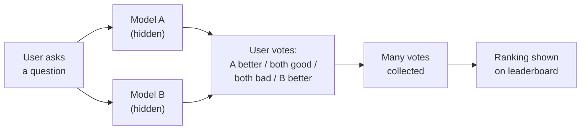
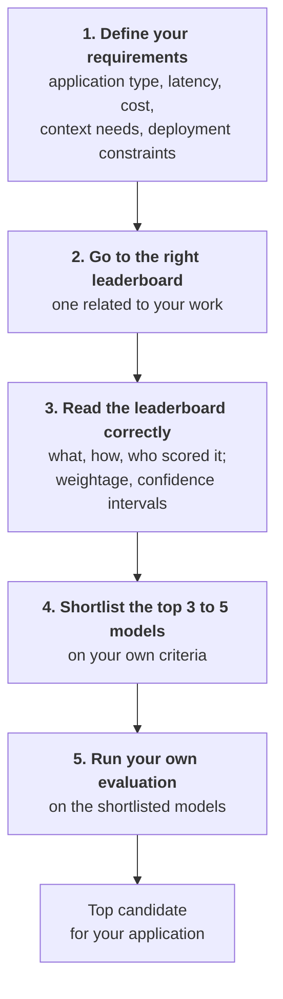

> **Video 10 of 19** · [Watch on YouTube](https://www.youtube.com/watch?v=SoZPmKb5uGc) · Translated from the
> Hindi transcript. Notes follow the video section by section, in its order.

If benchmarks are the exam, leaderboards are where the results get published. This session covers what they are, how they differ, where they mislead, and how to use them as a filter when choosing a model.

## What a leaderboard is

A benchmark is an **exam** that tests LLMs on one particular aspect. Once the exam is taken, the result comes out, and it has to be published somewhere. That place is the **leaderboard**, just like the leaderboard at school that shows who topped.

The definition on the slide:

> An LLM leaderboard is a public ranking or comparison table that shows how different LLMs perform on a common set of evaluations.

The benchmark's result is taken and shown on the leaderboard, which becomes a single place to compare different models on one benchmark. You immediately get an overview of which model is best on that benchmark.

## Why leaderboards exist

1. **Comparing models across labs with a common reference.** All models took the same exam, so you can see who came first, second and last, and that tells you which one to use in your application.
2. **Trust.** Leaderboards are generally **third party**. If OpenAI or Claude themselves announce their score on a benchmark, you may not trust it as much, because OpenAI obviously wants its own model praised. If a third party tests both Claude and OpenAI on one exam and publishes the results, you believe it more, because its stakes are not as high.
3. **Guiding model selection when you don't have the resources to run evals yourself.** Say you want a chatbot with maths capabilities for your students. Ideally you would test it yourself, but you cannot test the hundreds of models that exist. Bringing 100 models and running your evaluations on all 100 takes a lot of money, time and effort. If someone else has done it, you simply go to the leaderboard, pick up the top 10, and choose from those.
4. **Spotting saturation.** If many top models start **clustering** around the same score (say the top 10 LLMs on a knowledge benchmark all score between 92 and 94), that clustering on the leaderboard tells you the benchmark is saturating.
5. **Discovering new models.** This has been a personal habit since 2022-23. The top three or four places generally stay the same (Google, OpenAI and Anthropic models), but if you scroll down to positions 10, 12, 15, 20, new models start appearing. They are not the best, but they can work for your purpose, and they are generally **cheaper**.

## Who uses leaderboards

**AI engineers.** People who build LLM-based applications use leaderboards for **shortlisting**. To build an application in the maths domain, you go to a maths leaderboard and pick your **candidate models** there. Generally you do not select a single model from a leaderboard. You select candidates, run your own evals on them, and that gives you the best model for your application. Leaderboards help you filter from 100 models down to five.

**Frontier labs.** Leaderboards tell them where they stand, and whether they should release their next model at all. Suppose you are OpenAI, your current model is GPT 5.5, and the competitor is Opus 4.8. On a particular benchmark, the next model you are training cannot beat even Opus 4.8. You would not release it, because people would immediately say it is worse than the competitor's previous model, and that is bad marketing. Instead you move to the next iteration and release only when you can leave the others **significantly** behind on the leaderboard. Labs actually do this: internally they plan and strategise when to bring each release to market, and constantly check where they lie on the leaderboards.

This is why models sometimes appear on a leaderboard under a **hidden name**. **Nano Banana** has such a funny name because it first appeared in **stealth mode** on an image leaderboard, without saying it was Google's model. It completely smashed the benchmarks. Once it was clearly beating everything significantly, it was released publicly, and since the name had already become famous and done the marketing, Google kept it.

**Researchers.** Leaderboards show what is happening right now: which benchmarks have saturated and on which ones good work is going on. From that, researchers find new techniques and ideas, basically **new research directions**.

**Policy makers and safety institutes.** They have big stakes here. They constantly monitor what level current models operate at, and whether a new model has appeared that leaves everyone else far behind. Then they have to come into the picture, stop it, or step in to make changes. This is what happened with Fable 5: the US government came in immediately because it saw the model as dangerous.

**The open-source community.** Leaderboards drive **discovery**. Many people go to leaderboards to find new models. If a new research lab of 101 people releases a small model that scores very well on one benchmark and reaches the top three or four, the lab gets publicity and the model becomes famous. This is how the Chinese labs came into the picture: a new model appeared overnight and started competing with the top model on some benchmark, and it got discovered, publicised and marketed.

## The four types of leaderboard

### 1. Benchmark-specific leaderboards

The simplest type. These rank models using the result of **one particular benchmark**: MMLU, HumanEval for coding, GSM8K for maths, or GPQA. All models are run on that single benchmark and the ranking is shown as a leaderboard. The main idea is to show which model performs best on this benchmark.

The problem is that they give a very **narrow view**: you learn how a model does on one benchmark, not how good it is overall. The example is the leaderboard on the **Humanity's Last Exam (HLE)** website, where Gemini 3 Pro sits at 38%, along with calibration error and other figures.

Most famous benchmarks have their own leaderboard, built and maintained by the research teams themselves. Honestly, this type is not very useful.

### 2. Multi-benchmark leaderboards

The useful category. These bring together the results of **multiple benchmarks** and give a **cumulative score**. They compare models across multiple benchmarks and evaluation dimensions instead of relying on one test, for example combining knowledge, reasoning, mathematics, coding, instruction following and data analysis into one leaderboard.

A very good example is **LiveBench**, described as a challenging, contamination-free LLM benchmark with **23 objective tasks across seven categories** (reasoning, coding, agentic coding and so on). It shows each model's score in each category plus an overall score, so you get a view of how a model does in general across capabilities.

These leaderboards also give information on other aspects: **cost per token, latency, output speed, context window size**. The example is **Artificial Analysis**, a company whose whole job is building leaderboards and providing this kind of information. It has separate leaderboards for intelligence, speed and cost per task, separate ones for HLE and GPQA Diamond, for coding agents, and for speech, image, audio and hardware, plus an overall one that cumulates everything. It is a very exhaustive list, like a proper product.

This is the category used most, personally and by people in general. It answers the question: **which model provides the strongest overall combination of capability, cost and performance?** This is the leaderboard you will use the most.

### 3. Human-preference-based leaderboards

Here the ranking is not based on a benchmark but on **comparisons**. A user comes to the website and asks a question. The same question goes to two models, A and B. Both answers come back, and the user says which one they liked. The user is effectively scoring on helpfulness, clarity, writing quality, creativity, whatever makes a good way of answering. Once a lot of votes are collected, a ranking is made from them and shown on the leaderboard. These rank models using **human votes**.

The famous example is **LMArena**. In battle mode you ask anything, for instance "What are LLM leaderboards?". Two models answer behind the scenes without you knowing which ones they are. You are then asked: A is better, both are good, both are bad, or B is better. In the demo, choosing "B is better" without reading reveals that the two were Claude Opus 4.8 Search and Fable. Votes collected from people all over the world, all day, build the leaderboard. The current ranking at the time of recording is led by Fable 5, with Opus 4.8 Thinking also near the top, and there are separate categories: normal chat, code, image and video.

The limitation: a user finding an answer better does not necessarily mean it really is better. Humans get won over when an answer is formatted very nicely, or says something they personally like, so there is **human bias**. But because it happens at scale, with people all over the world voting, you can still trust it to a degree, which is why the top models also lead these leaderboards.

### 4. Application-specific leaderboards

These are built around a **particular domain or job**: a dedicated coding leaderboard that combines all the coding benchmarks into one score, or separate leaderboards for agentic tasks, for generating SQL queries, or for medical questions.

The example is the **Berkeley Function Calling Leaderboard**, which specifically tells how good a model's **tool-calling** capacity is and ranks models on that. It uses multiple benchmarks but within a **single domain**. There are many of this type; coding has its own as well.

### Summary of the four

- **Least useful:** the single-benchmark leaderboard.
- **Most useful:** the multi-benchmark leaderboard measuring general capability, which also tells you cost, latency and everything else.
- **Human-based:** popular, and used a lot for marketing ("who is top on LMArena"), but it is its own category.
- **Application-specific:** what you use when building an application in a particular domain.

## Why you cannot trust leaderboards blindly

Leaderboards are very powerful and give a summarised overview of the whole LLM landscape at once, but you **cannot blindly trust them**. This matters because as an AI engineer, step one of building an application is usually model selection, and step one of model selection is usually looking at which model tops the leaderboards. That creates a bias: if it is on the leaderboard, it must be right. It is not so. The reasons:

**1. Benchmark performance may not transfer to real applications.** A model hitting 80 or 90 on a leaderboard does not mean it will give equally good results in your real application. It is like the famous saying that solving problems on **Kaggle** does not make you a good data scientist in real life: Kaggle data is very clean and the problem statement very clear, while in the real world everything is messy. Benchmark data is generally cleaned too, so models will perform well on it. The real world has ambiguous requests, missing information, company-specific data, tool failures and unusual edge cases, and you do not know whether the model handles them the same way.

**2. Contamination.** As discussed earlier, benchmarks get contaminated very easily, and then the leaderboard score is contaminated and **inflated** too. The score may be genuine, or the model may have memorised the questions or already known similar ones.

**3. Models can be over-optimised for the leaderboard.** People have started discussing this genuine problem in the last one or two years. When a leaderboard such as LMArena becomes very popular, companies see that the most talk is about who tops it, and decide they have to top it. Topping LMArena means winning humans over, which means a certain kind of formatting, softer answers and flattering answers. So they feed that kind of data to the model in the training or fine-tuning stages. The model then does well in LMArena-type situations rather than on actual capability: it scores well on the leaderboard, but its real-world capabilities do not improve.

This is **Goodhart's law**: *when a measure becomes a target, it becomes less useful as a measure.* The analogy is a car company that knows people in India buy cars on mileage alone. The whole engineering team focuses only on improving mileage, so the overall car becomes bad, because nobody works on driving dynamics or how long it takes to go from 0 to 100. Make a metric the target and it stops being a good metric. Companies are now building models to top leaderboards while actual performance is not as good.

**4. Hidden choices in composite leaderboards.** This applies especially to leaderboards that combine multiple benchmarks. Which benchmarks are included and which are excluded is up to the leaderboard. How the scores are normalised, and how much weightage each capability gets in the overall score, is often not disclosed. These hidden things can trouble you, so the more transparency a leaderboard has, and the more you can find out about it, the better.

**5. Small differences don't matter much.** Say one model scores 84.3 and another 84.1, and they land in third and fifth position. The difference is only 0.2, but you start feeling you should take the third one and not the fifth. There is a good chance the two are very similar, and the fifth might even have been better for your application. Focusing too much on rank creates a **rank bias**. If the difference is small, the models are at the same level. In IIT JEE there is not much difference between rank 1 and rank 25; anyone can get one or two questions wrong. The same logic applies.

**6. Human preference leaderboards have human biases.** As already discussed, the top model on LMArena is not necessarily the objectively best model. Humans prefer longer, more confident, better formatted and more entertaining answers. A better model that does not do those things will lose in the human ranking.

**7. Scores are stale, incomplete or self-reported.** Back on the Humanity's Last Exam leaderboard, Gemini 3 Pro shows 38.3, but the most recent models (such as Fable) are not there, because the maintainers have not updated it yet. Leaderboards are often not updated: you find results for old model versions and not the new one, or results for discontinued models. On some leaderboards the company puts in its own model's results, and then there is no reason to trust them.

These six or seven reasons are why you use leaderboards carefully rather than blindly. They are useful, but you cannot be blind.

## How to read leaderboards when selecting a model

The last topic: you are an AI engineer building an LLM-based application, and your first job is selecting the model. The guideline:

**Step 1: get your requirements clear before visiting any leaderboard.** Write down clearly:

- what type of application you are building
- how much latency it needs
- how much cost you can bear
- what your context needs are
- whether there are deployment constraints: can you use general publicly available models, or do you need an on-premise model?

With this clear, you will not be biased towards the rank-one model and will start thinking objectively. For example, if you must set up on-premise, you obviously cannot use Claude Fable and have to look towards open source.

**Step 2: go to the leaderboard related to your work**, not just any leaderboard.

- Building an **agent**: an agent-related leaderboard.
- Building a **chatbot**: perhaps an LMArena-type leaderboard, because it gives a direct measurement of chatting.
- Building **RAG**: **MTEB**, a leaderboard ranking **embedding models**, since RAG needs an embedding model.
- **Budget constraints**: Artificial Analysis or the **Vellum** leaderboard, which give exact information on how fast models are and how much they cost.

**Step 3: read the leaderboard correctly.** Understand everything:

- What is being scored, and how?
- Who evaluated it?
- What was the inference budget? Is reasoning on or not?
- When is the evaluation dataset from, how old is it, and is it being updated?
- Is a private test set maintained?
- Have the benchmarks saturated?
- For a small dataset, is the **confidence interval** given? If not, two very close models are effectively the same.
- For a composite leaderboard, what weightage has each capability been given?

The point is not to blindly trust a number. Read the star-marked footnotes, the key definitions and the frequently asked questions, and you will be in a better position to judge the leaderboard.

**Step 4: shortlist the top three to five models** on the basis of your criteria.

**Step 5, the most important: run your own evaluation** on those models. Their results on your own evaluation set give you your top candidate.

The single most important line to take from this session:

> **Leaderboards are a filtering tool, not a decision tool.**

You do not go to a leaderboard and decide which model to build your application with; that is the wrong strategy. You shortlist four or five top models with the help of leaderboards, run your custom evals on all of them, and pick one.

## What comes next

The upcoming classes are practical. The next session is all about **how to run your custom evaluation on a given LLM**, so the flow above gets done hands-on there. Benchmarks are not fully complete, but they are covered conceptually, and leaderboards are done. After custom evals, the course moves to **application evals**, covering both **RAG evals** and **agent evals**.
