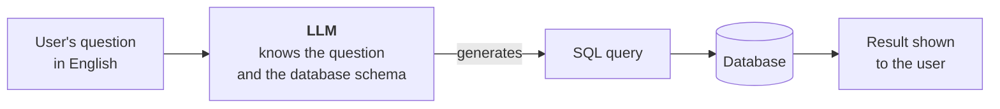
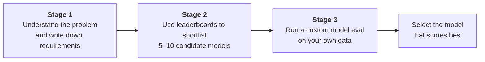
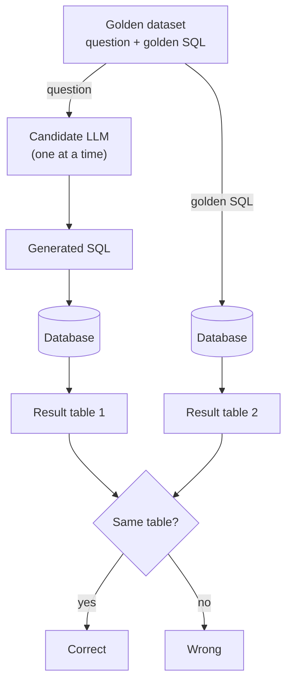
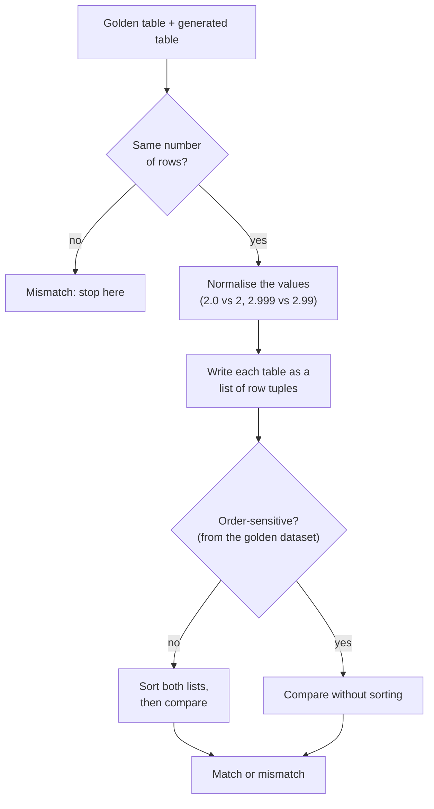
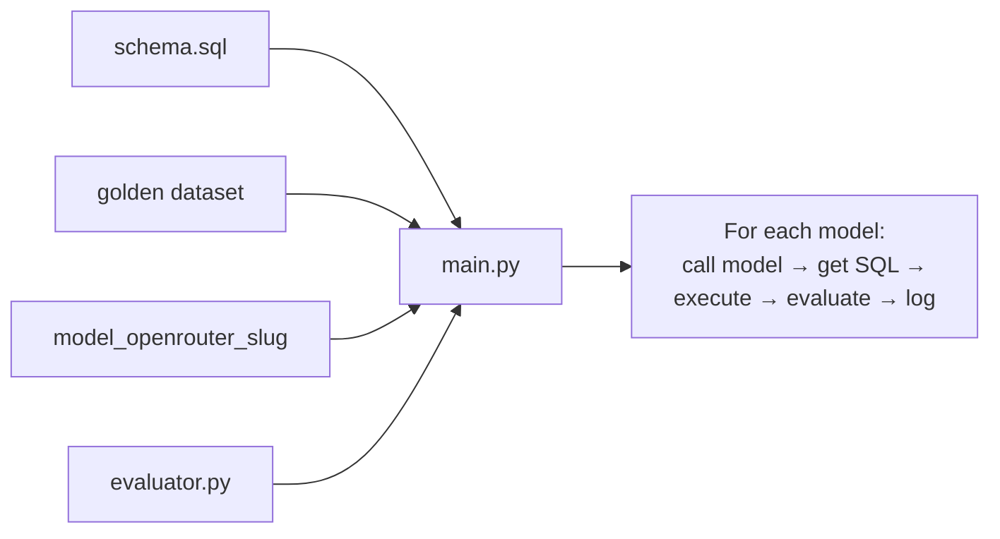

> **Video 11 of 19** · [Watch on YouTube](https://www.youtube.com/watch?v=RG5A-W3eMHI) · Translated from the
> Hindi transcript. Notes follow the video section by section, in its order.

Benchmarks tell you which models are good in general; a custom model eval tells you which of them is best for your application. This session shows the whole selection process on one case study, from requirements to a final pair of finalists.

## Recap and today's agenda

After a lot of theory, the course now turns fully practical: every session from here on is hands-on. Because the theory was covered in depth, these practicals should be easier to appreciate.

The recap. In the first one or two sessions the course established that there are two kinds of LLM evals: **model evals** and **application evals**. The main focus will be application evals, but model evals come first. Within model evals there are again two kinds:

- **Benchmarks**, generic datasets that test very specific LLM capabilities such as knowledge, reasoning and maths.
- **Custom model evals**, where you run LLMs on your own data and your own application to find out which model suits that application best.

A simple example: you are building a chatbot for your company and it needs an LLM as its brain. Benchmarks will give you the top four or five candidates in the market. Which of those four or five is best for *your* application is the question custom model evals answer.

So today's agenda, in simple words, is **to learn how to run custom model evals**, through a case study, with no new theory.

## The case study: AskCricinfo

The problem statement chosen for this is cricket. ESPNcricinfo is one of the top websites for live cricket scores, used for years by a lot of people. During a match it runs a textual commentary, and in between it takes questions from users and answers them.

The trouble is scale. Many people follow the feed, and sometimes literally 500 questions arrive in 5 minutes. The questions are simple, for example during an India vs Pakistan match:

- What is Virat Kohli's batting average against Pakistan?
- The last time India played Pakistan, how many wickets did Jasprit Bumrah take?

Behind the commentary team sit analysts, live. The commentary team passes them a question, the analysts (who have access to Cricinfo's database) write a query on the spot, and the answer goes back to the commentary team, which puts it into the feed. Cricinfo did this for years, but it does not scale: in a match like India vs Pakistan they cannot answer everyone.

So they built a feature on the website where any cricket fan can ask any cricket question. It is called, if remembered correctly, **AskCricinfo**. During the match they share its link; you pick what you want to talk about (say the IPL) and ask something like "who has scored the most runs against Bumrah?". (The live demo of the site failed at this point, which is Cricinfo's embarrassment, not the class's; check it after the class.)

What the feature does behind the scenes:



The LLM knows both the question and the schema of the database (how it is organised, which columns it has), and from these it generates SQL. The system runs that SQL on the database and shows the result to the user. This system replaces the analysts, and it can handle any number of queries, so the whole thing becomes scalable.

### Our role: engineers at Cricinfo

Assume you are an engineer at Cricinfo and this feature request has landed on your team. Before building anything, the biggest question is: **which LLM should we use?** The LLM is the brain; it does the main work.

In a company you cannot just say "let's use Fable, it's the top model right now." You have to give good input and good reasoning for why a model is selected, which means a proper evaluation before selection. Technically, the thing being built is a **text-to-SQL application**, and the goal of the class is to select the one best model to be its brain.

This is not RAG. No external documents are given to the model to answer from; only the database schema, which stays the same every time. So this is not a RAG chatbot; it is a text-to-SQL application.

## The plan: three stages

Custom evals are not run straight away. The leaderboards from the last session are part of the process too, because the job of a leaderboard is **filtration, not selection**.



## Stage 1: gathering the requirements

When an AI engineering team gets a task, it first writes down its requirements very clearly. This is done by asking a set of key questions.

### The task

What is the task, technically? Building a text-to-SQL application. That is what a model is needed for.

### The cost ceiling

The next question, one you would ask your product manager or engineering manager, is the **cost ceiling**: how much can be spent on running this application?

To estimate it, think about why Cricinfo answers questions at all instead of just giving commentary. It is a **retention play**. The north star of any website is that users stay on it as long as possible. Small features like "ask us any record and we'll tell you instantly" keep you on the site; the longer you stay, the more ads you see, and the more ads you see, the more the site earns. So this feature helps generate revenue.

The class threw out numbers (30-plus lakh, 2 lakh, 5 lakh) for a per-month budget. Nobody has the real answer, so keep it simple: the business manager says **stay under ₹3 lakh a month**. It could be 5 or 10 lakh; that is not the point. The guideline is 3 lakh.

### Estimating what the system will actually cost

Working out the actual spend is the AI engineer's task. The system burns money mainly because the LLM charges **per token**. There are other small costs such as deployment, but since the website is already running and the feature is integrated into it, deployment cost is ignored here. The cost is essentially the LLM's, assuming a paid API of the OpenAI or Anthropic type.

A user sends a question, for example "how many runs has Virat Kohli scored in the IPL?". You do not send that text to the LLM directly; you build a prompt from it. The system prompt used here:

```text
You are a text-to-SQL generator. Given a database schema and a question,
return a single SQL query that answers it using SQLite syntax.
Return only the SQL query.
```

- **SQLite** because that is the database used in this class; Postgres, MySQL or anything else would work too.
- **Only the SQL query**, with no explanation, because the system just runs it on the database.

Below the instructions comes the **schema**. For now the domain is narrowed to the IPL only (cricket also has international T20s, Test matches, women's and men's cricket and more), as if the system were being launched at IPL time. The schema has two tables:

- **matches**: the record of each IPL match: which two teams, which ground, which date, who the umpire was, and so on.
- **deliveries**: ball-by-ball data for every match. A T20 match has 240 balls (40 overs across both innings), and for each ball there is the batsman, the bowler, whether it was a six or a four, whether a wicket fell and who took it.

After the schema comes the user's question. The example here is a fairly complex one: *"Which bowler has the best economy rate among bowlers who have bowled at least 500 legal balls?"* The LLM returns an SQL query as output.

The LLM charges for both input and output. Every provider (Anthropic, for example) lists a rate for **input tokens** and a rate for **output tokens**, and output tokens are more expensive.

Pasting the whole input prompt into a token-counting website gives **352 tokens**; round it to **400**. The system prompt and schema are identical every time; only the question changes, which does not make much difference. Pasting the output query gives about **100 tokens**, so assume 100 output tokens on average. Each request therefore sends 400 tokens and gets 100 back.

The other number you need is **how many questions a day**. The class guessed 1 to 2 crore, which is far too high: this is one feature hidden inside a match page, not the home page. (Honestly, this feature has never been used here personally.) The traffic will be very **spiky**: plot questions per day over 365 days and the spikes fall on important matches, such as a Chennai match or CSK vs MI. As a gut-feeling average, assume **50,000 questions a day**. You could argue with this number, but it is the assumption for the class.

### Can we afford the top model?

The newest intern says "Sir, use Fable, it's a great model." Check it. Claude Fable 5 costs **\$10 per million input tokens** and **\$50 per million output tokens**. Multiply by 30 for a month and by the magic number **95**, the USD-to-INR conversion, because the budget is in rupees.

```text
Per query  = (10 / 1,000,000) × 400  +  (50 / 1,000,000) × 100
           = 4/1000 + 5/1000
           = 0.009 USD

Per day    = 0.009 × 50,000  = 450 USD
Per month  = 450 × 30        = 13,500 USD
In rupees  = 13,500 × 95     ≈ ₹12.82 lakh per month
```

(Working it live, the daily figure first came out as \$250 and then \$7,500 a month, before the slip was caught: 9 × 5 is 45, so the daily cost is \$450.)

₹12.82 lakh against a ₹3 lakh budget is about 4x over. This model is beyond our means; we have to go down to something around a quarter of the price, something like Claude Sonnet, which should just about fall within budget.

This is how you do the calculation, and this is how you gather requirements.

### A detour: prompt caching

The pricing page also lists **5-minute cache writes**, **1-hour cache writes**, and **cache hits and refreshes**. These come from **prompt caching**.

The idea: a large part of the prompt you send may be the same across many queries. Here, the system prompt and schema are the same for all 50,000 queries of the day; only the question changes. Yet every time you pay for that repeated input. Providers therefore offer to **cache a portion of your prompt on their servers**, so that later requests do not pay full price for it.

For Fable, with a 5-minute cache:

- The **first** request pays **\$12.50** per million for the cached part instead of \$10. It costs more than normal input because you are paying for the cache processing too.
- Every **subsequent** request within the window pays only **\$1** instead of \$10 for that part.
- Output is still charged the same, but input drops sharply for the remaining 49,999 questions, which is a significant reduction.

The 5 minutes is a **refresh cycle**. If the next question comes 3 minutes later, it is still in the cache and costs \$1. If it comes 7 minutes later, the cache has expired and you pay \$12.50 again to write it. For Cricinfo, answering 50,000 questions a day, 5 minutes works well because some question will arrive within every 5 minutes. At night there may be none from 2:00 to 6:00; that is fine: the first query at 6:00 pays \$12.50 again and then it is back to \$1.

For an application with fewer users, say only 1,000 questions a day because the website is not that famous, you would use the **1-hour cache write** instead: pay \$20 once, and any question within that hour costs \$1; after the hour, pay again.

How it works internally is not taught here, only pointed to: it relies on **KV caching**, a famous concept related to the attention mechanism, where the K and V vectors are cached. It will be covered in a future session. Running the numbers, if you were paying around ₹12 lakh for Fable, caching could bring it down to around 6–7 lakh.

Prompt caching helps when part of the prompt stays the same again and again. It does not help as much in a **RAG chatbot**, because there a big part of each prompt is the retrieved context, which changes with every query. Here it can save a lot of money.

A question from the class: without column descriptions, how does the LLM understand what data the tables hold? Here the schema is already very descriptive, so no explanation was added. But if your company's database has very domain-specific, technical column names, add another paragraph below the schema describing each column. That control is yours. The system prompt gets bigger and costs more, but prompt caching can solve that too.

### Latency

You should know in advance what latency your application can tolerate. A research assistant that goes to the internet and gathers information does not need low latency. This application does: people ask during a live match because curiosity has struck.

The class suggested 5 seconds, which feels too long. Two to three seconds is a good number; beyond three, you start to feel something has gone wrong ("is my money being deducted?"). So keep it to **2–3 seconds**. That rules out a model with very high latency, or a reasoning model that spends a long time thinking before it answers.

### Context window

Does the context window matter here? Not much, because the context never grows. Each question is disjoint, with no relation to the previous one; there is no conversation, no user session, no multi-turn exchange. It would matter for a chatbot or a coding assistant. For this application, even a model with a small context window is fine.

### Deployment

Do you need open-source models on your own on-prem servers for privacy? No. There is no data here that must stay on your own servers, so public APIs such as OpenAI and Anthropic are fine. In fact public APIs are preferred, because their infrastructure is more reliable and robust: Anthropic's API is unlikely to go down, while your own setup would need a very technical team and might still not be reliable.

### Correctness

How important is accuracy? Very. Cricket fans are super finicky about records. Ask who has scored the most runs in the IPL and get Jasprit Bumrah by mistake, and a screenshot goes straight onto Instagram and Twitter, ESPNcricinfo is embarrassed, and market sentiment turns. You cannot be incorrect and you cannot hallucinate.

Correctness is checked in two ways: on leaderboards, by checking coding ability (generating SQL is like a coding task), and with your own custom eval, which shows how accurate the model is on your data and your task.

### The requirements, summarised

- **Task:** text-to-SQL.
- **Cost ceiling:** ₹3 lakh a month.
- **Latency:** no more than 2–3 seconds.
- **Context window:** does not matter much.
- **Deployment:** no preference; public APIs are, if anything, preferred.
- **Correctness:** matters a lot.

With these requirements in hand you are in a better position to explore leaderboards. You will not just pick the first model you see.

## Stage 2: shortlisting 5–10 models from a leaderboard

### Which leaderboard?

Ideally there would be a text-to-SQL leaderboard to consult directly. Search for one and you will find two or three:

- **BIRD-SQL**, a benchmark for text-to-SQL tasks. It was rejected for two reasons. First, it is not updated: the models are older, and some are fine-tuned versions (one entry is not a model you can recognise, most likely something fine-tuned on SQL data) that you could not use anyway. Second, and this settled it, the acronym: "BI" from "BIg" and the "R" taken from the middle of "laRge". (Said as a joke; the real reason is that it is not updated.)
- **Spider**, another text-to-SQL leaderboard, which appears to evaluate whole harnesses rather than models; an entry like "Loop Sentinel Agent V2 Pro" is most likely a complete system some company built.
- **LiveSQLBench**, which has a leaderboard but is also not updated; the next generation of models has arrived since. It was also not fully clear which data it used for the benchmarking.

In short, these text-to-SQL leaderboards could not be trusted. The fallback: **use coding leaderboards**, because generating SQL is a kind of coding activity. Coding capability is treated as an **alias** for SQL-generation capability.

The leaderboard chosen is **llm-stats.com**, a third-party site that pulls data from many leaderboards, does some analysis of its own and gives an overall rating. Its "Best AI for coding" leaderboard aggregates almost every type of coding benchmark into one rating, and it is fully up to date. It also lists cost, speed and context for each model. The top coding models on it include GPT-5.6, Fable 5, Mythos Preview, GPT-5.6 Terra, Kimi K3 (which caused an uproar in the news two or three days earlier), Claude Opus 4.8 and Opus 5 (released just two or three days earlier). It has **146 models** in all.

### Reading the blended price

The leaderboard shows only one price per model, not separate input and output prices. Hovering over it (after a refresh, thanks to a tip from the class) shows **"Blended price per million tokens, 4:1 input/output ratio"**. You should know how to read this.

For Claude Fable 5, input is 10 and output is 50. Blended 4:1:

```text
(4 × 10 + 1 × 50) / (4 + 1) = 90 / 5 = 18
```

That 18 is the number on the leaderboard. Many leaderboards give a blended price, so always check which ratio they use: 4:1, 8:1 and so on differ between leaderboards.

The nice part: this prompt's input-to-output ratio is 400:100, which is exactly **4:1**. So the blended number is tailor-made for this situation and can be used directly:

```text
Monthly cost = (400 + 100) × (blended price / 1,000,000) × 50,000 × 30 × 95
```

### The filtration strategy

1. **Download the data for all 146 models** and compute each model's monthly cost with that formula (Fable came to about 12 lakh; some cheaper model to 8 lakh, and so on).
2. **Reject every model over budget.** Some 50–60 models remained (the exact number is not remembered); the expensive ones dropped out.
3. **Normalise the coding rating** to the 0–1 range with the min-max normalisation from machine learning. For example, the lowest rating in the column belongs to GPT-4.1 nano at −1.1 and the highest is 50, so a model rated 50 becomes (50 − (−1.1)) / (50 − (−1.1)).
4. **Normalise the speed column** (how many characters the model prints per second) to 0–1 as well.
5. **Combine the two into one score** for every model:

```text
score = 0.9 × normalised rating score + 0.1 × normalised latency score
```

Take GPT-5.6: its normalised rating is 1, because its rating is the maximum. It prints only 17 characters a second, which is very low when one model prints 63, so suppose its normalised speed is 0.2; its score is computed from those.

**Why only 10% weight for latency?** Shouldn't it be 50-50? No, because the output is just one SQL query of hardly 100 tokens. Even a slow model prints that in a second or a second and a half; a very slow one might take two to four seconds. If the output were a long essay, speed would matter a lot, since a model giving three or four characters a second would take ages. This weighting is a personal opinion; you could use other splits such as 0.75/0.25.

6. **Sort by the score** and take the top 10.

One caveat: this exercise was done before the class with a **₹5 lakh** budget in mind, not the 3 lakh agreed in the discussion. That is why some models on the list cost around 4 lakh.

The table showed each model's monthly cost, throughput and overall score. **GPT-5.6 Terra** came out on top. Of the ten:

- **Muse Spark 1.1** is Meta's (Facebook's) model and can currently only be used in the US, so it is out.
- The paid models such as GPT and Claude are costly, but some open-source models are very cheap and not far behind. **MiniMax M3** scores 0.76 against GPT-5.6 Terra's 0.9, at a fraction of the cost. Open-source models such as Qwen and GLM come out cheap, the GPT ones expensive, and Sonnet somewhere in the middle. How each does on *your* task is still to be tested.

### The five models to test

A live class cannot test all of them, so five are picked:

1. **GPT-5.6 Terra**: the top candidate, from OpenAI. A bit expensive, but top. GPT-5.6 Luna is skipped because Terra, from the same company, should beat it.
2. **Kimi K3**: it has received a lot of praise in the past week.
3. **Grok**: "you never know what Elon Musk will do."
4. **Claude Sonnet**: the only model from the Anthropic family on the list.
5. **MiniMax M3**: GLM, Qwen and MiniMax are all Chinese models, so only one is tested, and MiniMax could deliver results for very little money.

Gemini 3.6 Flash could have been tried but was left out. You can test all nine available models yourself: you only need to add each model's name to a list, as shown later.

That clears stage two.

### Why the theory came first

With all the theory behind you, these practical discussions should mean more: you have a stake in them and more questions come to mind. Taught without that theory, this class would feel confusing. Preparing the theory first is "very unsexy", and many people leave in the first few sessions, but those who stay start getting real value by the seventh or eighth.

A question from the class about whether a costly model is worth it belongs to the next stage, once the custom eval results are in. Then the question becomes whether GPT-5.6 Terra justifies its price, or whether MiniMax M3 is close enough. It varies by application. For a very sensitive application, such as a medical one where you cannot be wrong, you pay extra to be more right. For a consumer-grade application where being a little wrong is not high-stakes, you might pick a cheaper model to save cost.

## Stage 3: running the custom model eval

### The process

You need two things:

1. **A dataset.** Cricinfo would already have one. Here, a complete IPL dataset from 2008 to 2024 is taken from Kaggle.
2. **A golden dataset.** Roughly 30 to 50 questions, each with a correct SQL query. For example: "How many [runs] did Virat Kohli hit in the IPL from 2018 to 2022?" or "At which ground did Jasprit Bumrah play the most matches from 2012 to 2016?". A **data analyst** writes the SQL for each question, runs it on the database and validates that it answers the question correctly.

The golden dataset must be **representative of the distribution of real user questions**. Of 50, perhaps 10 easy, 20 medium and 20 hard. Within those, build variety: five questions on joins, five on subqueries, some on window functions, covering every kind of possibility. It is usually created manually; if an LLM creates it, make sure it is completely correct.

Then the evaluation:



Take question one, send it to the first model (say GPT-5.6 Terra), get its SQL, and run it on the database. Also run the golden SQL for question one on the database.

**How do you decide whether the generated query is correct?** Not by string matching, comparing the two queries character by character. The same result can be reached by many different queries, so the analyst's query and the LLM's query may differ textually and both be right. Instead, run both, get two result tables, and **compare the tables**. If they are the same, the generated query is correct.

Repeat for every question up to question 50, marking each right or wrong, then compute the **accuracy**, for example "GPT-5.6 Terra: 95%". Repeat for the second, third, fourth and fifth models. At the end you have each model's accuracy on your data, which truly represents how it performs on your task.

### How big should the golden dataset be?

A question from the class: could it be 100 questions? There is no limit, but there are two problems:

1. Golden datasets are generally made by humans, so they cost time, effort and money.
2. Every question is an LLM call per model. Five models × 50 questions is 250 calls; 500 questions is 2,500 calls. The evaluation has its own budget.

Anything from 50 to 500 is fine, as taught earlier. After deployment, questions where the model fails are added to the golden dataset over time. For this classroom setting, only **20 very difficult questions** are used.

A question about frameworks like DeepEval versus building golden datasets manually is deferred: DeepEval has not been covered yet. Frameworks do make this work more convenient, and that will be covered when DeepEval is taught.

## The code, step by step

The code is mostly pre-written and run at the end. There are 12 steps, ticked off as they are done.

### Step 1: the dataset

The Kaggle data (`deliveries.csv` and `matches.csv`) goes into a `data` folder. To keep the evaluation simpler and faster, the data is trimmed from 2008–2024 down to **2020–2024** only.

### Step 2: load it into SQLite

`db.py` looks long but simply reads the two CSV files, takes those years' data and stores it in a SQLite database. (Cricinfo would already have this database; here it is built on the go.) Running it creates the database with two tables, `deliveries` and `matches`, which SQL queries can now run on.

### Step 3: extract the schema

The schema (tables, their columns and the column types) must go into the system prompt on every call, so it has to be extracted first. `schema_extractor.py` studies the database and writes the schema into a file.

```bash
python3 schema_extractor.py
```

This creates `schema.sql`, containing the two tables with all their columns and types, ready to be loaded into the prompt.

### Step 4: create and validate the golden dataset

Ideally this is done manually; here an LLM was asked to make a set of **very difficult** questions. Keeping only hard questions is not really right (you should include easy ones too), but it makes the difference between good and bad models visible. That gave **20 questions**.

In `golden_dataset_generator.py`, each dictionary is one question. For example: *"What is the average number of runs scored per match? Give a single number."*, with its query (think of it as written by the data analyst) and a difficulty label, "hard". The code below the questions runs every query on the database and reports whether it ran, so a broken query would surface as an error.

```bash
python3 golden_dataset_generator.py
```

```text
20 out of 20 queries passed
```

This checks only that there are no SQL errors and the queries are well formed, not that the answers are right.

### Steps 5–6: save it as CSV

`make_golden_dataset.py` pulls the 20 queries out of the generator file and writes them to a CSV.

```bash
python3 make_golden_dataset.py
```

This creates `golden_hard.csv`. Alongside each question and its golden query, it records:

- the **number of rows** expected (1 for the first question), and
- whether the query is **order-sensitive**, meaning whether it needs `LIMIT`, `ORDER BY` descending or ascending. For the first question it is false: no `ORDER BY` is used. Why this matters is covered with the evaluator.

So far: dataset, loaded into the database, schema extracted, golden dataset generated by an LLM, validated by running it, and saved as CSV. Six of the 12 steps are done.

### Step 7: test the flow once with one model

Before testing all five models, run the flow end to end once: take one question (Q1), send it to an LLM, and check that an SQL query comes back.

The five models come from different companies (OpenAI, Anthropic, Grok and Chinese labs), each with its own API. Rather than write separate code for each, use a platform that has all of them in one place: **OpenRouter** (named by Saurabh in the class). Kimi K3, Terra, Sonnet and the rest are all available on it, and it integrates directly with LangChain: just as you used `ChatOpenAI`, you can use `ChatOpenRouter` to talk to any model. OpenRouter also gives some free credits, enough to test one or two models; running all five here cost about \$5 (₹500).

`first_test.py` needed one change, loading the API key from the environment rather than writing it in the file:

```python
from dotenv import load_dotenv

load_dotenv()
```

The model used is **GPT-4o**. It is not a candidate; it only checks that the flow works. The file picks one question, sends it through `ChatOpenRouter`, and checks that a correct SQL query comes back.

```bash
python3 first_test.py
```

The output showed the question and, in return, an SQL query and nothing else, which means the system prompt and the code flow will work later. This step was optional.

### Step 8: pick the candidate models

The file `model_openrouter_slug` holds a list of five tuples. Each tuple has the model's name and its **slug** on OpenRouter, which is needed when hitting the API. Searching OpenRouter for, say, Sonnet 5 shows the exact slug string that goes into the list. To test 10 models instead of five, search all 10 and add their official OpenRouter names. This is, in effect, the model database.

### Step 9: build the evaluator

`evaluator.py` holds the algorithm that compares the two result sets. It is given two DataFrames: the **golden** one (from running the golden query on the database) and the **generated** one (from running the model's query). The comparison logic:



- **Row count first.** If you ask for the top five batsmen and one table has five rows and the other three, they cannot be the same; the three-row query is wrong, and the matter ends there.
- **Normalise the values.** Not the min-max normalisation from earlier. Here it means treating 2.0 in one table and 2 in the other as the same, or 2.999 and 2.99 as the same, so that a correct query is not marked wrong over formatting.
- **Organise row by row** into tuples in a list, for both tables.
- **Sort, then compare.** (The sorting step was briefly missed while explaining and then put back in its place.) Sorting is needed because a slightly different but correct query may return the same rows in a different order: a value in row one of one table may be in row two of the other.
- **Unless order matters.** If the golden dataset marks the query as order-sensitive (it has an `ORDER BY`), skip the sorting and compare as is. A match then means both queries applied the correct `ORDER BY`; otherwise it is false.

There are two or three more checks, not covered in detail because it was already 10 pm. The point is that a lot of thought went into `evaluator.py` so that two tables are compared correctly. If this part feels rushed, paste the code into Claude line by line and ask it to summarise the logic.

### Step 10: orchestrate everything in `main.py`

`main.py` ties it together:

1. Load the five models.
2. Run the golden dataset on each model.
3. Run the generated SQL and the golden query on the database.
4. Evaluate with the evaluator.
5. Log the scores in one place.

It depends on:

- `schema.sql`, used to build the system prompt;
- the golden dataset, without which nothing works;
- `model_openrouter_slug`, which says which models to run;
- `evaluator.py`, which says whether each result was right.

Inside the main function: load the schema, load the golden dataset, connect to the database, then loop over every model; inside the loop, call the model, get the SQL, execute it, and call the evaluate function from `evaluator.py` to see whether the results matched, logging everything as it goes.



### Running it

```bash
python3 main.py
```

The first run hit a problem: the file was called `golden_hard`, but the code assumed a different file name. Renaming it to the golden-dataset name the code expects fixed it, and the evaluation started.

```text
OK match
mismatch
OK match
...
```

"OK match" means the generated query's result matched the golden query's result; "mismatch" means it did not.

## Watching the results come in

### GPT-5.6 Terra

It got the first question right, failed the second, got the third. After seven or eight questions it had made only one mistake (question two). It then failed questions 10 and 11, labelled **brutal** because they are really difficult. With 18 questions done it had four errors, finishing at **80%**.

While waiting, some questions from the class:

- *Would you use AI tools to write this code?* Yes, obviously. You could also hand-code a very simple version; the project is simple, and the extra code and comments are there because the code was generated. At your level, do not pressure yourself to understand code line by line. If you understand what each file and function does, you are in control.
- *Can we build a proper end-to-end text-to-SQL project with complex joins and reasoning?* The goal of this course is to evaluate projects, not build them. Projects will mostly arrive ready-made and then be tested. A separate class might be possible, but scope is limited, and there is nothing that difficult here; you can do it yourself.

### Kimi K3

Kimi K3 is a new model from **Moonshot AI**, with **2.7 trillion parameters**. People say it is very close to Fable 5 at a third of the cost, and it caused a stir in US share markets because such a powerful frontier model came from China as **open weights** (not exactly open source).

It hit an **SQL error** on question six. That means the generated SQL itself was invalid, a syntax error, not merely a wrong answer. Three SQL errors followed quickly.

A question from the class asked whether normalisation is better than keeping everything in a single table, since normalised data needs more joins and could raise the SQL error rate. After first checking which normalisation was meant, the answer for **database** normalisation: for analysis, **denormalised** tables are preferred, so if the activity is analytical you use denormalised tables; for **transactional** databases you normalise. The Cricinfo team will almost certainly have denormalised the data already. The terms are **OLTP** (online transaction processing) and **OLAP** (online analytical processing).

Kimi K3 is also **very slow**, possibly because it is a big model and a reasoning model, and its reasoning settings were left untouched, so it may be spending a long time reasoning. That means latency issues on top of poor performance.

This is a very good lesson, seen live: **a sensational model on a leaderboard does not guarantee it will do as well on your task.** Kimi K3 is all over the news, yet on this task it is slow and not performing well. (A student mentioned its Reddit reviews are poor; people have probably run custom evals of their own.)

It ended with six SQL errors and two mismatches: **55%**, 11 questions right. That is bad for a frontier model of this scale.

Latency (how long the whole run took per model) could also have been measured, but that code was not written; it will be added later.

### Grok

Grok is clearly faster than K3, and at first made no errors at all. It cracked question two, which both GPT and Kimi K3 had failed, and handled the brutal ones too. Grok is often underrated, and you can never underestimate Elon Musk. Its first error came on a question about commentators. It ended with only two mistakes: **90%**, and fast.

Its monthly cost: about **₹2.5 lakh**, almost half of Terra's and far less than Kimi K3's. At this point it is the clear winner.

A student noted that this kind of evaluation is not done by a project manager. Right: it is technical work done by AI engineers. You give the report to the project manager, who takes the final decision, but much of the input comes from you.

### Claude Sonnet 5

Sonnet is very fast: seven questions done almost immediately, the fastest so far. This is Sonnet 5, which should be around the previous generation of Opus. It lost two questions, then one more on the brutal set, ending at **85%**. Its cost: about **₹2.84 lakh**, so Grok is cheaper.

### MiniMax M3

The "dark horse" got the second question wrong straight away; three models have now failed that one, along with the brutal 10th and 11th. Grok is faster than MiniMax. Then came SQL errors again: the Chinese models keep producing SQL errors, while the American models at least give valid syntax. MiniMax finished at **65%**.

### The final results

| Model | Accuracy on the 20 golden questions | Notes from the run |
| --- | --- | --- |
| GPT-5.6 Terra | 80% | Most expensive; about twice Grok's cost |
| Kimi K3 | 55% | Poorest; several SQL errors, very slow |
| Grok 4.5 | 90% | Fast; about ₹2.5 lakh a month |
| Claude Sonnet 5 | 85% | Fastest in this run; about ₹2.84 lakh a month |
| MiniMax M3 | 65% | Cheap; SQL errors |

This is a small dataset: with 20 questions, one question carries 5% of the score. Ideally it should be larger, though Grok would probably still lead. You can also **run the evaluation several times** on the same dataset, since each API call is independent. If Grok still has the top average score over five runs, you have more statistical evidence. It costs more, but gives you confidence that repeated runs give the same result.

## Choosing between the finalists

Terra is very costly, so it is out. The choice is between **Grok 4.5** and **Claude Sonnet 5**: their costs are close and their leaderboard index was about equal. On speed, the leaderboard's throughput says Grok is faster, but in this run Claude was faster.

Sonnet has the edge on reliability: Anthropic feels like a more reliable company, so its API and everything around it should be more reliable than Grok's, which carries some of Elon's personality. So the lean here is towards Sonnet as the more stable choice. A student argued that Sonnet's good latency justifies pushing for an extra 25K in budget; these are exactly the discussions that happen. But the decision is yours. In companies, when a team cannot decide, it votes.

## Wrapping up

That was the session, and its goal was achieved. The one rushed part was the code explanation; the code will be shared the next day. Try running this whole custom eval yourself on another kind of application (text-to-SQL is only one option); doing it once will deepen your understanding.

From the closing questions: system design would suit this kind of case-study session too, and case studies will feature there. The next course after evals will be **AI security**. The code repository was not ready yet and would follow the next day.

## What comes next

The model-evals part of the course is now complete: benchmarks, and running custom evals to select a model. Going forward, the focus shifts to **application evals**: you have learned to select a model, and next comes evaluating the application built on it.
