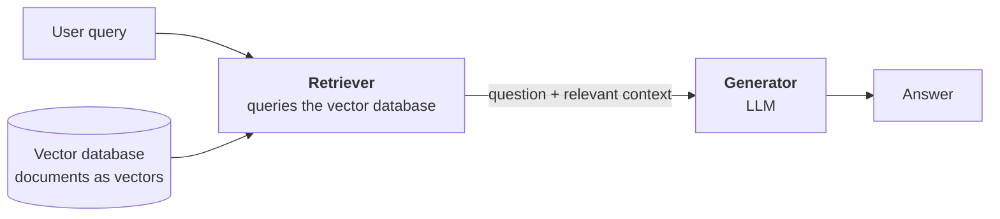
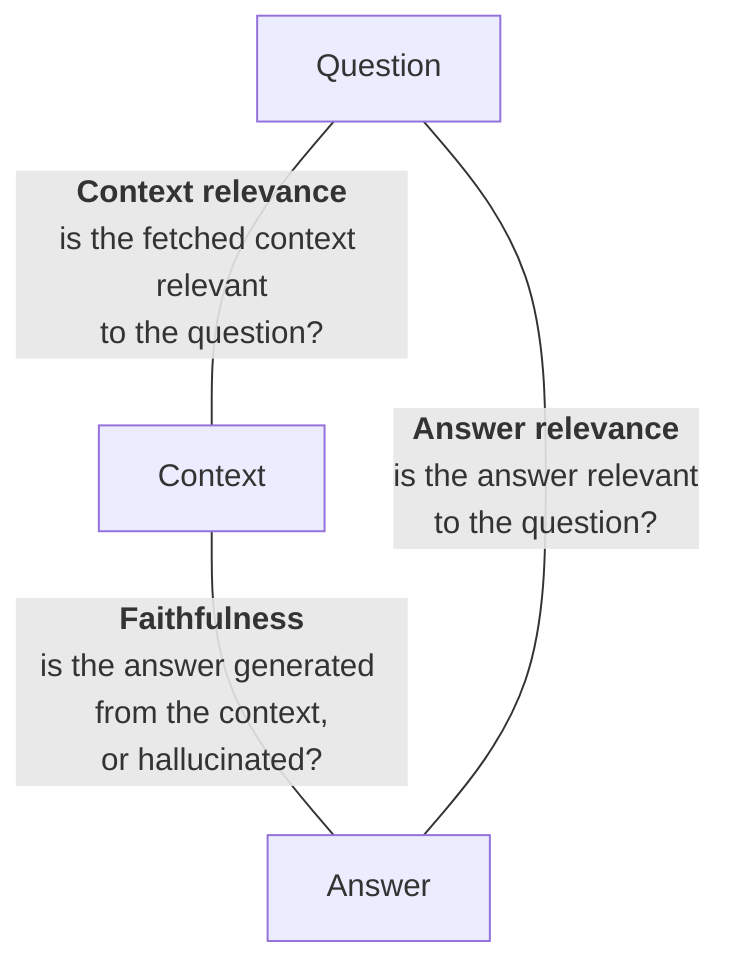
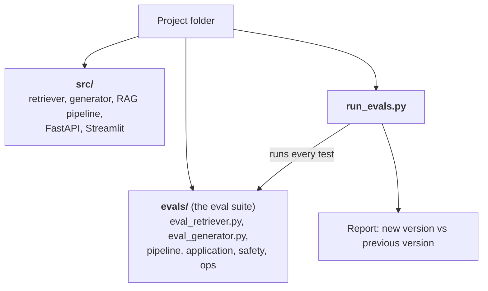
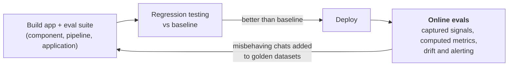

> **Video 12 of 19** · [Watch on YouTube](https://www.youtube.com/watch?v=4zn-gSckVTQ) · Translated from the
> Hindi transcript. Notes follow the video section by section, in its order.

Evaluating a RAG chatbot is not naming three or four metrics; it is a framework. You build an eval suite at three levels while you build the app, use it for regression testing before every deployment, and keep evaluating online after deployment.

## Recap: where the playlist stands

Two big milestones are done.

- **Fundamentals** (the first three or four lectures): why LLM evals are needed, what they are, reference-based vs reference-free evals, online vs offline evals, and the most important idea, that there are two kinds of LLM evals: **model evals** and **application evals**. The playlist said it would focus on application evals, but it covered model evals first.
- **Model evals** (the last two or three sessions), which themselves come in two kinds:
  - **Standardised evals**, called **benchmarks**. The knowledge-capability session, with its multiple benchmarks, belongs here.
  - **Custom model evals**, where you build your own dataset to choose a model for your own application. That was the previous lecture.

Now comes the most important part of the playlist, **application evals**: given an LLM-based application, how do you evaluate it using everything learnt so far?

## Which applications this playlist will evaluate

LLM-based applications come in many kinds:

- simple chatbots
- RAG-based chatbots
- agents
- multimodal apps, where the work happens in a modality other than text, for example an image generator
- fixed-schema-output applications, where the app uses the LLM to return output in a fixed schema. The Zomato case study from a few lectures ago is one: read an email's content and classify it as a support, refund or technical email.

Teaching application evals for every one of these is not possible, so two were selected:

1. **RAG**, because most of the chatbots you build in your professional journey will have RAG functionality.
2. **Agents**, because agents are also very important.

A plain chatbot with neither RAG nor agent functionality is not covered; if you can handle the harder cases, the easier ones follow. The fixed-schema kind is also fairly easy. Multimodal apps are slightly different rather than difficult, and they are rare in production: very few companies and projects are multimodal, while RAG and agent design patterns are everywhere.

So this session and the next few are about **RAG evals**: build a RAG chatbot and evaluate it properly. After them you should be able to answer a question asked in roughly eight out of ten GenAI interviews: **"How do you evaluate your RAG chatbot?"** Most students cannot answer it convincingly. Many have never studied evals, and those who have rarely give a structured answer. Watch these sessions properly and you will be able to give an answer that impresses the interviewer.

## The project: a CampusX doubt solver

The problem statement is deliberately not fancy. Plenty of elaborate ideas were available, but the focus here is how to evaluate even a simple RAG application well, not how to build a fancy one. The app is simple; evaluating it is where the fun is.

The premise: in this LLM evals course there are around two lectures a week, and after each lecture you get the recording and the **transcript**. Those transcripts become the documents. Feed them to the LLM, and you can ask it any doubt about the playlist. It is a RAG chatbot for **this course only**, because a transcript exists for every lecture of it.

How RAG works is not re-explained; you already know the pieces: a retriever, a generator, a vector database and an embedding model. The plan is to build the chatbot and evaluate it, and in fact to evaluate it **during** the building.

## The evaluation framework: an eval suite at three levels

A single evaluation is never enough for an LLM-based application; you need many. The chatbot will be evaluated from every angle, at different levels. It gets deployed only when all of those pass, and after deployment it keeps being evaluated through **online evals**.

The three levels, as taught earlier in the playlist for any LLM-based application:

1. **Component level**
2. **Pipeline level**
3. **Application (system) level**

### The RAG architecture being evaluated

When a query arrives, it goes to the vector database, where all documents are stored as vectors, and the closest four or five relevant documents come back. That whole job is the **retriever**'s: it outputs the question plus relevant context. The question and context go to the **generator**, which produces the answer. The retriever and generator connected together form the pipeline you call RAG.

### Component level: steps 1 to 4

**Step 1: build the retriever.** Load the documents, chunk them, pass them through the embedding model to turn them into vectors, and use a retriever to fetch relevant documents for a new query.

**Step 2: evaluate the retriever**, immediately and independently, ignoring the rest of the app. A retriever works correctly if, given a question, it fetches the right documents from the vector database. Two metrics:

- **Recall**: of all the correct documents, how many did I bring back?
- **Precision**: of the documents I brought back, how many were useful?

**Step 3: build the generator**, once you are satisfied with the retriever. The generator is an LLM that takes a question and relevant context and returns an answer. It is built in isolation.

**Step 4: evaluate the generator**, with two or three metrics:

- **Faithfulness**: was the answer generated only from the given context, or did the model hallucinate something?
- **Answer relevance**: is the answer relevant to the question?
- **Citation accuracy**: ChatGPT sometimes cites where it took a point from, a line of a document or a link. The doubt solver will do the same, telling you in which session Nitish sir discussed the topic and linking that transcript. How accurate those citations are gets judged here.

The generator is evaluated **in isolation**: it is not yet connected to the retriever. You hand it questions and context yourself, like a golden dataset, because the pipeline does not exist yet. When both the retriever and the generator work well on their own, the component level is done.

### Pipeline level: steps 5 and 6

**Step 5: build the RAG pipeline.** This just means connecting the retriever and the generator, a very simple piece of code.

**Step 6: evaluate the pipeline** with the famous **RAG triad**. Three things exist in a RAG pipeline: the user's **question**, the **context** the retriever brought from the vector database, and the **answer** the generator produced. Each pair of them has a metric:

If all three hold, the RAG pipeline is working, and the pipeline level is done.

Notice the flow. You do not build the whole chatbot and then evaluate it; building and evaluating go together. It is just like software, where you do not build the entire application and then test it, but test at the function level and the feature level along the way. Here the components were tested, then the pipeline they form, and now the application.

### Application level: steps 7 to 9

**Step 7: application-level quality evals.** Is the doubt solver as a whole functioning correctly? More metrics come in:

- **Correctness**: is the answer correct?
- **Completeness**: does the answer answer the whole question? If a question has two parts and the answer handles only one and ignores the other, it is not complete, even if the part it answered is correct.
- **Style**: does the doubt solver explain things in the same style as the CampusX teachers? This can be evaluated too.

**Step 8: safety evals**, run on the same application:

- Is the response toxic?
- Does the response leak personally identifiable information in any way?
- Can the doubt solver be jailbroken?

**Step 9: ops evals**, which primarily check three things:

- latency
- cost per query
- tokens spent

### The eval suite

Everything across the three levels, combined, is the **eval suite**, your entire testing suite. Whenever you test the application, you do not run one test; you run all of them together. Only then do you know whether the app works correctly from every aspect.

Asked in the chat whether golden datasets will be generated: yes. Many of these evals need a golden dataset; some do not.

## Using DeepEval instead of hand-written code

Until now, including the custom model evals in the last lecture, the eval code was written by hand. Doing that for this whole suite would be a very big project. Instead the course uses the library **DeepEval**, which already has many of these metrics:

- under RAG: answer relevancy, faithfulness, contextual precision, contextual recall, contextual relevancy
- under safety: toxicity, PII leakage

DeepEval is presented as the current state-of-the-art library, used by most big companies for LLM-based evaluation. Its whole syntax is based on **pytest**, Python's main software-testing library, so if you have written tests with pytest you will feel at home.

**RAGAS** could do all of this work too. DeepEval is chosen for two reasons:

1. RAGAS was already taught in the Advanced RAG course.
2. DeepEval is broader. Its scope extends to agents, multi-turn chatbots, non-LLM applications and image-based applications, so its adoption is higher, and there is a good chance that in a year or so it becomes the standard library for LLM evaluation.

RAGAS is still good; there is nothing wrong with it.

## Regression testing

Once the eval suite is built, the next very important task is **regression testing**: the act of running your whole eval suite on your application.

The idea: version 1 of your software is running and you build version 2. How do you know version 2 is objectively not worse than version 1? Run the whole eval suite in one go and you get a report: this metric was this much and went down, that one went up. That gives you a clear picture of whether the new version is objectively better, and that decides whether it gets deployed.

### The project layout that makes it work

- A **project folder** containing:
  - **`src/`**, the RAG chatbot's source code: the retriever file, the generator file, the RAG pipeline file, maybe a FastAPI app for the API and a Streamlit app for the UI.
  - **`evals/`**, all the evaluation files: `eval_retriever.py` for the retriever, `eval_generator.py` for the generator, and similarly separate files for the RAG pipeline, the application, safety and operations. All the files in this folder, holding all the tests, are the **eval suite**.
  - **`run_evals.py`**, outside the folders. Trigger it and it runs every test on the application one by one and generates a report.

Analysing that report tells you, file by file, whether the new retriever beats the old one, whether the new generator beats the old one, and so on.

So: build the app, build the eval suite in the process, and keep one script, `run_evals.py`, that runs it all. Whenever the application is complete or you change it, run that script, read where the new version stands against the previous one, and decide whether to deploy.

## Regression testing done more seriously

What follows sits more in the LLMOps and engineering domain than in evaluation proper, but it is related. What was just described is the basic way. Much more can be done.

### Experiment tracking

If you have studied MLOps, you may have used **MLflow** to run multiple experiments on an application. The same works here.

The first time you build the app, it has settings: how many characters per chunk, how much overlap, what temperature, some embedding-model settings. Keep them in one place and run the eval suite for the first time. It returns a number per metric, for example retriever recall of 82 and precision of 68. Log this run, its configuration values and its metric values in a tool like MLflow. That first run is your **baseline**.

Then you try to improve: increase the chunk size, decrease the overlap, and run the suite again. The new readings for the new settings get logged too, and you can compare them with the previous run straight away. You literally get a dashboard where you can see how each metric has moved up and down over, say, the last 10 runs. Experiment tracking and dashboarding become part of regression testing.

### Adding CI as a gate

You can go further by adding **CI**, continuous integration. Take a CI tool, for example GitHub Actions, and set a condition: whenever anything in the code changes and you push (say you changed the chunk size), re-run the whole eval suite. A new set of readings arrives and is compared automatically with the current baseline.

Define a threshold, for example that the new reading must not be 3 lower than the previous one. If it is lower, pause the deployment: the change cannot ship because it is worse than the current baseline, so the software has regressed. If the change improves on the baseline, let it deploy.

That makes CI a **gating mechanism**. You can keep changing, improving, pushing and deploying without tension, because a change only deploys when it has a positive impact over the current baseline; otherwise it is rejected. The same eval suite you built is now working as a gate.

All of this will be demonstrated. CI itself may not be shown in this playlist; most likely Himanshu will show it, because it belongs to the LLMOps teaching. The topic could have been skipped, but since it is related it is covered once here.

### The three levels of regression testing

1. **Simple**: run the software once to get baseline numbers, then run it each time after a change and compare the numbers manually.
2. **With an experiment tracker** such as MLflow: every trigger of the eval pipeline logs metric values against the configuration settings, and a dashboard shows them visually.
3. **With CI**: every eval run automatically checks whether the new version's metrics beat the baseline. If they do, deploy and **replace the baseline with the new metrics**, and keep doing this continuously.

MLflow is not the only option. Confident AI, another product from DeepEval's company, does this too, and so does Weights & Biases; there are many players. Hold on to the concept, not the tool. If you understand the concept, a week with any tool is enough to learn it. The company you join may not use MLflow. For machine learning, MLflow has become the de facto standard, but no standard tool has been established for LLMs yet.

## After deployment: online evaluation

Once regression testing shows the new version beats the baseline, you deploy it. But evaluation does not stop after deployment. Evaluating the live software is **online evaluation**, and it measures three or four things.

**1. Captured signals.** Every time a student asks the chatbot a doubt, capture the latency of the answer, its cost, and whether the student gave a thumbs up or a thumbs down. Tools for this include **LangSmith**, **Langfuse** and **Confident AI**; in the LLM world this is called **tracing** or **observability**. You add a little tracking code to your application, and every interaction on the live software gets captured (latency, cost, tokens, thumbs up, thumbs down) and shown on one dashboard, for example LangSmith's.

**2. Computed metrics.** Beyond storing what comes in as it comes, you also compute some values online, such as the deployed app's faithfulness, answer relevance or correctness. Some of what you tested offline gets tested online too.

**3. Drift.** Is the software's performance getting worse over time? As described in an earlier lecture, you keep a graph of, say, the last 24 hours for a metric such as faithfulness. If the faithfulness curve suddenly drops over the last 8 hours, that is drift. You detect it, raise an alert, and then improve the app.

**4. A self-improving loop.** Sometimes the application will misbehave in a chat with some student. Pick up those specific instances and add them back into your offline eval dataset, so your golden datasets keep getting richer and future versions get evaluated better offline.

That is the entire evaluation strategy: build a RAG application and test it at all of these levels, as laid out on this page.

## Plan for the next four sessions

1. **Component-level evaluation**: build the retriever and test it, then build the generator and test it. This is where DeepEval is used for the first time.
2. **Pipeline level**: build the RAG pipeline and run the three RAG-triad metrics.
3. **Application level**: run all the application-level evaluations (possibly sooner than planned; it depends on how things turn out).
4. **Regression testing and online evals**, in the final session.

Together, those four sessions carry out the whole framework in practice. It is not started today because it is around two hours of work, best done in one stretch; splitting it into an hour today and an hour on Saturday breaks the flow. So today's class was kept specifically for this discussion.

## Answering the interview question

Even with just today's session you can tackle "How do you evaluate your RAG chatbot?" well. The answer goes like this:

- First I will build an **evaluation suite**. (What is that? I will test my application at three levels.)
- **Component level**: test the retriever and the generator, and name their metrics.
- **Pipeline level**: the RAG triad.
- **Application level**: correctness, completeness; then safety and operations metrics.
- Once that is in place, use it for **regression testing**, which can run at three levels (basic, with experiment tracking, with CI/CD). I would operate at whichever level suits my company.
- When regression testing passes and gives a new baseline, **deploy**, and do not stop there: run **online evaluations**, and explain what they cover.
- Pick up the mistakes seen online and keep adding them to the **offline eval**.

From interviewing candidates: many people do not know this answer at all because they never studied evaluation. Most of those who did simply list three or four metrics (recall, precision, answer relevance) and think that is the answer. Answer it as a framework instead and the interviewer will see that you know it in depth and have actually done it.

Doing all of this hands-on over the next four sessions will ingrain it much more deeply. The aim is for those four lectures to be a resource from which anyone in the world could understand RAG evaluation, and the promise is that they will be explosive.
