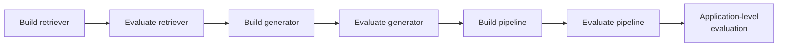
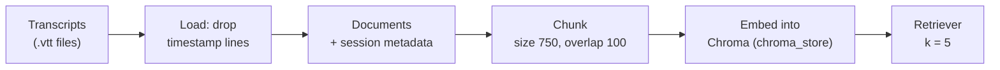
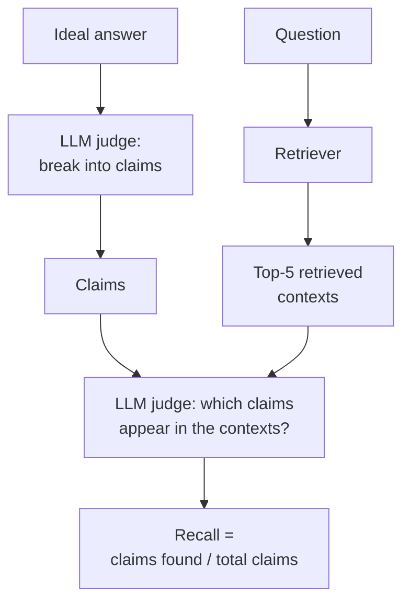

> **Video 13 of 19** · [Watch on YouTube](https://www.youtube.com/watch?v=9Dkz3ckRj8c) · Translated from the
> Hindi transcript. Notes follow the video section by section, in its order.

The first part of the RAG eval suite is the component level, and the first component is the retriever: build it, evaluate it on contextual recall and contextual precision, then improve it until the numbers justify moving on to the generator.

## Where this session fits

This session connects directly to the previous one, which set the problem statement (the RAG application to be built) and a step-by-step roadmap for evaluating it. Over the next three classes, including this one, the goal is to build a **RAG eval suite** that evaluates the application at three levels:

1. the **component** level
2. the **pipeline** or workflow level
3. the **application** level

All those evaluation pipelines together form the eval suite used for regression testing.

Today's goal is the first part: evaluating the **components**. In any RAG application the two most important components are:

- the **retriever**, whose job is to fetch relevant context from the vector database for a given query
- the **generator**, whose job is to take the query plus relevant context and produce an answer relevant to the question

Both have been built in the past, but never evaluated. The plan is to start with the retriever and then move to the generator.

## Setting up the project

The project will run for the next two or three classes, so it is worth setting up properly. Create a folder named **RAG eval project** and open it in VS Code. The setup instructions are standard.

### Directory structure

Files are not created randomly; the project follows a structure:

```text
rag-eval-project/
  data/      # lecture transcripts: the knowledge base
  src/       # application code: retriever, generator, RAG pipeline, later a Streamlit app
  evals/     # evaluation pipelines: retriever, generator, whole RAG pipeline
  goldens/   # golden datasets
```

More folders can be added later if needed.

### Adding the transcripts

Every lecture gets a transcript, and those transcripts are the knowledge base for the RAG application. The transcripts of the first eight sessions are copied into `data/`. They look exactly like movie subtitles: a timestamp, then what the teacher or students said during that timestamp. Each file is long, because each lecture is two hours.

### Virtual environment and dependencies

Because it is a new project with its own dependencies, they are installed inside the project rather than globally, using **uv** with **Python 3.11**. The libraries:

- **LangChain**, because a lot of the work happens through it
- the **OpenAI** library
- **DeepEval**, for the testing
- **pytest**, because it appears to be a dependency of DeepEval
- **python-dotenv**, to work with environment files

```bash
uv init --python 3.11
uv add langchain openai deepeval pytest python-dotenv
uv add langchain-openai langchain-chroma  # (implied, not shown in narration)
```

uv sets up the project quickly: a `pyproject.toml` and a `.gitignore` appear. The last step is a `.env` file holding the OpenAI API key.

## Build first, then evaluate, component by component

As the last session said, you never build the whole application and then test it. You work exactly like software: write a new module or function, test it, move ahead, test the new thing, and the application gets built that way. For an LLM-based application:



## Building the retriever

A retriever gets a query as input, converts it into a vector with an embedding model, and searches a vector database where the chunks are already stored as vectors. The five or 10 nearest vectors it fetches are the **context**.

Building this means: fetch the documents (the transcripts), chunk them, embed them, and make a retriever object that is used whenever the retriever is run or evaluated.



The code lives in `src/retriever.py`. It was generated with Claude and is copied into the project:

- **Imports and `load_dotenv()`**, since the OpenAI key comes from the environment file.
- **Setup:** the data directory is `data`, and the vector database directory is `chroma_store`. That directory does not exist yet; it is created the first time the code runs, and all the chunks are stored in it as vectors.
- **`build_retriever`** first calls **`load_store`**.
- **`load_store`** brings in the embedding model, OpenAI's **`text-embedding-3-small`**, then checks whether the vector database already exists. If it does, no new one is created. If not, it loads all transcripts as documents with `load_transcripts`, chunks them and builds the store.
- **`load_transcripts`** looks complex but simply goes into the data directory, loads every `.vtt` file and reads it line by line. For each line it asks: does it contain a timestamp? If so, ignore it; if not, add it to the text. Keeping the timestamps would make the retriever's quality very bad, because text interrupted by timestamps again and again does not capture semantic meaning well. The text goes into a LangChain `Document`, and the document's **metadata** records which **session** the line was spoken in, so that later the app can cite that the answer was taught in a particular session.
- **Chunking** starts deliberately small: **chunk size 750, chunk overlap 100**.
- The chunks and embeddings go into Chroma's `from_documents`, and `as_retriever` turns the store into a retriever object with **k = 5**.
- Finally the retriever is **invoked** with a question: it converts the question to a vector, fetches the nearest five vectors, and the results are looped over and printed.

```python
import os
import re

from dotenv import load_dotenv
from langchain_core.documents import Document
from langchain_openai import OpenAIEmbeddings
from langchain_chroma import Chroma
from langchain_text_splitters import RecursiveCharacterTextSplitter  # (implied, not shown in narration)

load_dotenv()

DATA_DIR = "data"
DB_DIR = "chroma_store"

TIMESTAMP = re.compile(r"\d{2}:\d{2}:\d{2}")  # (implied, not shown in narration)


def load_transcripts():
    docs = []
    for name in sorted(os.listdir(DATA_DIR)):
        if not name.endswith(".vtt"):
            continue
        session = os.path.splitext(name)[0]  # (implied, not shown in narration)
        lines = []
        with open(os.path.join(DATA_DIR, name)) as f:
            for line in f:
                if TIMESTAMP.search(line):
                    continue
                lines.append(line.strip())
        docs.append(Document(page_content=" ".join(lines), metadata={"session": session}))
    return docs


def load_store():
    embeddings = OpenAIEmbeddings(model="text-embedding-3-small")
    if os.path.exists(DB_DIR):
        return Chroma(persist_directory=DB_DIR, embedding_function=embeddings)
    docs = load_transcripts()
    splitter = RecursiveCharacterTextSplitter(chunk_size=750, chunk_overlap=100)
    chunks = splitter.split_documents(docs)
    return Chroma.from_documents(chunks, embeddings, persist_directory=DB_DIR)


def build_retriever():
    store = load_store()
    return store.as_retriever(search_kwargs={"k": 5})


if __name__ == "__main__":
    retriever = build_retriever()
    result = retriever.invoke("What is regression testing?")
    for doc in result:
        print(doc.page_content)
```

### Running it

The test question is **"What is regression testing?"**, which was discussed in detail in the previous session. The first run takes a little time because the vector database is being created: a `chroma_store` folder appears, and then five chunks come back. They contain lines such as "there is nothing special in regression testing, basically run the eval suite you have made once", so the retriever is fetching relevant context. It works; how well it works has not been evaluated yet.

### Question: what happens when documents change?

Say a new session is held and its transcript arrives (session 10). You paste it into `data/`. With the current setup you then have to **delete the `chroma_store` folder** and run `retriever.py` again, so the embedding is performed again and the documents are brought into vector form again. You repeat this every time the documents change.

A student pointed out that ideally **data ingestion and retrieval should be decoupled**. That is correct. The focus here is on evaluation rather than application development, so the code is deliberately simplified, not production-grade; explaining production-grade code would eat the session's time. The instruction to Claude when generating it was to write basic code anyone can understand at a glance. That is a conscious choice.

## How a retriever fails

Now the question is whether this retriever works correctly. A retriever is a function that takes a query and returns five (or 10, whatever k is) relevant contexts. There are two ways it can fail.

**Failure mode 1: it misses the right context.** Say the question is ABC and the vector database holds chunks 1 to 100. The correct answer is inside chunks **1, 15 and 13**. A bad retriever brings back **27, 28, 29**: not a single relevant chunk.

**Failure mode 2: it brings the right context, but noisy.** The correct chunks are 1, 15 and 13, and the retriever brings **1, 15, 27, 28, 29**. It got two of the three, but the other three are **noise**. All five go to the generator, so it receives two useful contexts and three useless ones, and there is a good chance the final answer is not good.

Each failure mode has a metric:

- **Recall** measures how many of the correct contexts the retriever brought. Formally: out of all the correct contexts available in the vector database, how many did it bring? If five are correct and it brings three, recall is **3/5**.
- **Precision** measures how many of the contexts it brought are really useful. If it brings five and only two are useful, precision is **2/5**.

The ideal retriever has both high: the closer recall and precision are to one, the better.

### The tension between recall and precision

There is a **trade-off**. Suppose recall is 3/5: of five correct contexts, only three are fetched. The quick hack to raise recall is to **increase k**. With k at 5 you get three of five; make k 10 and there is a good chance you get the remaining two as well. Increasing k always increases recall. But now, of your 10, five are correct and five are noise, so precision takes a hit. As you push recall towards 100, precision moves towards zero. The k number trades off between precision and recall, so raising both takes some thought.

### Both are reference-based evals

True or false: **recall and precision are both reference-based evaluations.** True. A reference-based eval needs a golden dataset or golden answer at evaluation time; a reference-free eval does not. To say whether recall is low or high, you must know what the correct context looks like for every query, and that is exactly where a **golden dataset** with golden context is needed. With so many evaluations coming in the next three classes, it matters to be clear which ones are reference-based and which reference-free.

## The obvious method: recall and precision from chunk IDs

Step by step, the textbook approach needs a golden dataset with two columns: **question** and **document or chunk IDs**. (How it is built comes later.)

| Question | Relevant chunk IDs |
| --- | --- |
| What is regression testing? | 72, 89, 100 |
| What is the RAG triad? | 120, 111 |
| What are online evals? | 151, 121, 130 |

Someone studied all the chunks and found that regression testing is discussed only in chunks 72, 89 and 100, and so on, for around 50 questions.

**Recall.** Run the retriever (k = 5) on the first question. It returns **72, 81, 89, 99, 100**. All three expected chunks (72, 89, 100) came, so recall for this question is **1**: perfect. For "What is the RAG triad?" it returns **1, 2, 3, 120, 5**. Of the expected 120 and 111, only 120 came: recall **1/2 = 0.5**. Calculate this for all 50 questions and average them to get the average recall.

**Precision.** Same work. For the first question, of the five chunks three are correct and two noisy: precision **3/5**. For the second, one is correct and four are noise: **1/5**. Average over all rows for the average precision.

Together these two numbers tell you how well the retriever works.

## Why that method fails for this application

This method is not wrong in general. Many books and videos teach it, and it works in some places, but it fails in many, and it is wrong for this application. The method used today is totally different.

Students were asked to think about why. Some answers, and why they miss:

- *"We should look at the content of the chunks."* Not necessary. The chunk number already represents that chunk's content; using numbers is not the problem.
- *"The answer may exist in any of the chunks but not in all."* Not really. A question may be discussed in three different places, and the answer made by combining all three. Whoever builds the golden dataset is a knowledgeable person doing it manually and will not put useless chunks in.
- *"A change in the documents' content will change the IDs."* This is in the right direction.

The real reason has two parts.

**First, building the dataset is miserable.** Printing the chunk count shows roughly **800-plus chunks**. The person building the golden dataset must read a question, then read all 800 chunks to decide which ones can answer it, then repeat that for the next question, 50 times. Nobody would want that job.

**Second, and decisive, the dataset breaks whenever you tune the retriever.** Suppose someone does sit all night and builds it. The next day the retriever gets recall 65, which is not good, so you want to improve it. One way is to change the chunking parameters, currently 750 and 100, to, say, **1000 and 150**. But the moment the chunk size changes, the chunks change, you rebuild the whole vector database, and you get new chunks: where there were 800, maybe now there are 700. The golden dataset is now **void**, because those chunk numbers were valid only for the previous chunk size. Every tweak of the chunking parameters means building the golden dataset again, and that was already a hectic task. This is a very bad example of engineering.

Where can the ID method work? When the documents are very cleanly separated from each other (document one very different from document two, two very different from three), you do not tamper with them, and you set the chunking parameters once and keep them throughout. If the chunk size never changes, this kind of golden dataset works. Here it is not like that: the documents are related, and information spreads across them (a question may be answered in session one and again in session five). So the chunking parameters will be tweaked, and every tweak would void the dataset. Too much effort.

## The real method: an ideal-answer golden dataset

The new golden dataset again has two columns, but the second is the **ideal answer**, not document IDs.

| Question | Ideal answer |
| --- | --- |
| What is regression testing? | The definition taught in class |
| What is the RAG triad? | The explanation taught in class |

One important point: the ideal answer is **not** what you find on Google. It is built from what was taught, from what is in the vector database. The person went to the relevant chunks (for example the three chunks on regression testing), joined them and wrote an answer from them. That answer is not necessarily "correct" in a universal sense, but it is the answer taught in class. You do this for 50, 100 or 500 questions.

### Contextual recall with an LLM judge

1. Give the first question, "What is regression testing?", to the retriever. It fetches **72, 81, 89, 99, 100**.
2. Bring in an **LLM as a judge** and ask it to break the **ideal answer** into **claims**. Suppose the ideal answer says that regression testing is a way to test whether your new version is better than your previous version; that it runs an eval suite against your software; and that it can be used for CI as well. That gives **three claims**.
3. Ask the same LLM to go through the retrieved contexts one by one and say which claims each contains. Claim 1 is in 72; 81 has none; claim 2 is in 89; 99 has none; claim 3 is in 100.
4. All three claims were found somewhere in the five contexts, so the retriever brought 100% of the context needed: recall = **3/3 = 1**.

For "What is the RAG triad?", the retriever returns **1, 2, 3, 120, 5**. The ideal answer breaks into two claims: that the RAG triad is a combination of three metrics, and that those are answer relevance, faithfulness and context relevance. Chunks 1, 2, 3 and 5 cover no claim; the fourth (120) covers the second. One of two claims found: recall **1/2**. Repeat for every question in the golden dataset.



**The benefit.** Say recall is 65 and you raise the chunk size from 750 to 1000. Does the golden dataset have to change? No. The ideal answer was written once, and it stays the same when chunks change; information that was in one chunk may move to another, but the ideal answer does not care. The effort is made once, and you are saved from rebuilding the golden dataset again and again.

This is the technique **DeepEval** uses, and it calls it **contextual recall**. The ID-based version taught earlier is called **recall@k**, and it is not used here. It is still recall, but with an LLM-as-a-judge flavour.

**Question: what if the judge merges several claims into one, and they sit in two different chunks?** That can happen. Two design choices reduce it: the person creating the golden dataset writes the answer by combining **atomic claims**, so that an LLM can break it down easily; and you use a **good-quality judge** with a well-written system instruction that it follows well.

### Contextual precision with an LLM judge

The first question again goes to the retriever and returns 72, 81, 89, 99 and 100. This time the ideal answer does not need to be broken into claims. The judge's system prompt:

> Here is the question. Here is the ideal answer. Here is one retrieved chunk. Is this chunk relevant? Does it contain information that helps produce that expected answer? Answer yes or no and give a reason.

For each chunk in turn (starting with 72), the judge sees the question, the ideal answer and that chunk, and says whether the chunk helps make the answer. That labels every chunk as correct or noisy. If three are correct and two are noise, precision is **3/5**. Repeat for all questions and average.

### Precision is rank-aware

One more detail: precision also considers the **rank** of the retrieved chunks. Take two cases, each with five chunks, two correct and three noisy:

- **Case A:** correct, correct, noise, noise, noise
- **Case B:** noise, noise, noise, correct, correct

By the simple formula (useful chunks over all chunks), both have precision **2/5**: the same. But if you could send only one of them to the generator, you would obviously choose case A, which brought the two correct chunks to the top of the ranking. A is the better retriever, yet plain precision cannot tell them apart.

DeepEval's **contextual precision** handles this. Walk down the ranking and, at each position, compute the fraction of chunks seen so far that are correct:

| Position | Case A | Case B |
| --- | --- | --- |
| 1 | 1/1 = 1 | 0/1 = 0 |
| 2 | 2/2 = 1 | 0/2 = 0 |
| 3 | 2/3 ≈ 0.66 | 0/3 = 0 |
| 4 | 2/4 = 0.5 | 1/4 = 0.25 |
| 5 | 2/5 = 0.4 | 2/5 = 0.40 |

Averaging each column, case A clearly comes out higher. So the idea of precision (of everything that came, how much is correct) is still there, but it also accounts for whether the correct chunks come up in rank.

:::note Correction
DeepEval's contextual precision does not average precision at every position. It averages precision@k only at the positions where a chunk is **relevant**, then divides by the number of relevant chunks. For case A that is (1 + 1) / 2 = 1.0, and for case B (0.25 + 0.40) / 2 = 0.325. The conclusion is the same (A scores higher, and the metric is rank-aware), but the numbers differ from averaging all five positions.
:::

### What changed from the plan

Over the last 15 to 20 minutes the method changed: a new kind of golden dataset (ideal answers), with recall and precision computed from it. In both calculations an **LLM as a judge** is used, so this is no longer a programmatic evaluation. The initial plan had it as programmatic, but the chunk-ID problem changed that.

## How to build the golden dataset

This is the biggest question. There are three or four ways.

**1. Hand-authored.** The best way, but you need knowledge of the entire data. The instructor is well placed for it, knowing what was taught in which session. For example, put in the question "What is the RAG triad?", knowing it was taught in session eight; go into session eight's chunks (15, 20, 25, 30 of them), find those about the RAG triad, and construct an answer from them, perhaps with an LLM's help. Repeat 15, 20, 25, 50 times. Human judgement makes mistakes unlikely. The problem is that it is **not scalable**: after 50 questions you get tired, or you pay someone.

**2. LLM-assisted drafting.** This is what was used for this session. Upload the data to Claude, explain the kind of dataset you want, and **review it very carefully** when it is built. The building is not the human's job, but the review is: read each question and its ideal answer and check whether it was actually taught. Cost, time and effort go down, but mistakes can creep in. On the RAG triad, the LLM might write something it read on the internet rather than something from the classes, and human review removes that manually.

**3. DeepEval's Synthesizer.** DeepEval has a **Synthesizer** module for creating golden datasets. It was tried for this very project, and the experience was not great, but it is worth knowing it exists. Human review is again very important, since an LLM is still doing the work.

The code (`generate_goldens.py`, saved into the project as `goldens/goldens_generator.py`) is not explained in detail, partly because its output was not good. Roughly: it loads and chunks all the transcripts, picks some random chunks, and sends them to DeepEval's `Synthesizer` class, with an LLM and formatting instructions for the golden dataset format. Run it:

```bash
python goldens/goldens_generator.py
```

DeepEval's verbose output says it is generating goldens from contexts (its mechanics are for another time). A JSON file appears in `goldens/` with, per entry, an ID, a question, an ideal answer and a source field for the session, which has to be filled in because DeepEval does not have that information. Reviewing it manually:

- *"What specific grade school math problems does the GSM8K dataset contain for model training?"* The benchmarks class taught GSM8K, so this is a good question-answer.
- *"What methodologies assess how to validate LLMs' robustness against adversarial exploits and misinformation generation?"* No student would come to the doubt solver and ask this; it cannot be their language. DeepEval over-optimised the question. Not a good entry.
- *"Is the platform's success criteria to evaluate UPSC answers exactly as human experts do?"* An early session used a UPSC example, and this asks about the mechanics of that example, which is not useful: the course is about LLM evals, not how the UPSC application is built. DeepEval has no idea where to put importance or what doubts people will ask; it just pulls questions from whatever transcripts it got.
- *"If schema details are omitted, how might adding descriptive prompts aid LLMs in parsing technical columns?"*

The file is shared (your run will produce different questions), but the point stands: the quality was not good enough to evaluate the retriever with. There are probably more subtleties to the method, but the first attempt did not give impressive results for this application, so it is not used here, though people do use it.

**4. Production logs.** Once the app is deployed, people ask questions; sometimes it answers wrongly, sometimes correctly. Interactions with **positive signals** such as thumbs up can become entries in the golden dataset, because there the retriever and the whole chatbot worked correctly. It cannot be the first way, since you need some entries at the start.

### The dataset used here

Method 2 was used. All the transcripts went to Claude with very clear instructions: a RAG chatbot is being built, its retriever needs evaluating on contextual precision and contextual recall, and that needs a golden dataset with these two columns. Questions were made **one at a time**, not many at once, for a set of **15 questions**. They read like a student's language:

- "What is an online eval and how is it different from offline eval?"
- "What is faithfulness versus groundedness?"
- "How do I know if my eval is reference-based or reference-free?"
- "Why can't we test LLM apps the same way we test normal software?"

The answers come from the transcripts, and all 15 were checked manually. The file is saved as `goldens/retriever_goldens.json`.

To recap the path so far: evaluate the components, starting with the retriever; build the retriever; discuss how to evaluate it, first the wrong method, then why it is wrong, then the correct one; then build the golden dataset. Now everything is ready to calculate contextual precision and contextual recall with DeepEval.

## A short intro to DeepEval's structure

Whenever you evaluate with DeepEval, you use primarily **three things**.

**1. `LLMTestCase`.** One `LLMTestCase` represents **one row of your golden dataset**. Whenever you see it in DeepEval code, it means one row. In the example, the answer relevancy metric (also part of the RAG triad) is being tested on a golden dataset of two rows, so there are two `LLMTestCase`s. Each has fields such as `input` (the question, e.g. "What is the capital of France?") and `actual_output` ("The capital of France is Paris.").

**2. The metric.** Which metric to evaluate on: here `AnswerRelevancyMetric`; similarly there are contextual precision and contextual recall. Each metric has parameters:

- `model`: which LLM acts as the judge, for example 4.1
- `threshold`: score below it and the test case **fails**, above it and it **passes**. If precision for a case comes out 1/2 = 0.5 and the threshold is 0.7, that test case fails
- `include_reason=True`: gives the reason the test case passed or failed

**3. `evaluate`.** It simply runs the metric on the test cases and returns scores. All test cases (both `LLMTestCase`s) and the metric are passed to it.

```python
from deepeval import evaluate
from deepeval.metrics import AnswerRelevancyMetric
from deepeval.test_case import LLMTestCase

test_cases = [
    LLMTestCase(
        input="What is the capital of France?",
        actual_output="The capital of France is Paris.",
    ),
    # second row: another question and its actual output (not read out)
]

metric = AnswerRelevancyMetric(model="gpt-4.1", threshold=0.7, include_reason=True)

evaluate(test_cases=test_cases, metrics=[metric])
```

That is the general structure of DeepEval code: `LLMTestCase` for the rows, one or more metrics, and `evaluate` to evaluate the test cases on those metrics. The same structure now evaluates the retriever on contextual recall and contextual precision.

## The retriever eval code

The code is in the repository's `evals` folder:

- **Imports**, including the retriever.
- **Parameters:** the golden dataset path, the judge model (the LLM as a judge), and the threshold.
- **Load the golden dataset**, the JSON file just created, with 15 questions (G01 to G15).
- **Loop over it**, 15 iterations. In each, send the question to the retriever, which brings back five contexts; extract their text into a variable.
- **Make an `LLMTestCase` per row**: `input` is the question, `expected_output` is the ideal answer, `retrieval_context` is what the retriever sent. The fourth field, `actual_output`, is what the generator would produce; since the generator is not in the picture, it gets a placeholder, "generator not evaluated in this run", which you can ignore.
- **Two metrics:** `ContextualRecallMetric` and `ContextualPrecisionMetric`, each with the threshold, the judge model and `include_reason=True`.
- **Call `evaluate`** with all 15 test cases and both metrics.
- **Log the configuration:** the embedding model, chunk size, chunk overlap, top five, the judge model and the golden dataset used.

The main code is really three things: make 15 `LLMTestCase`s (one per row), set up the two metrics, and call `evaluate` with both.

```python
import json

from deepeval import evaluate
from deepeval.metrics import ContextualPrecisionMetric, ContextualRecallMetric
from deepeval.test_case import LLMTestCase

from src.retriever import build_retriever

GOLDEN_PATH = "goldens/retriever_goldens.json"
JUDGE_MODEL = "gpt-4.1"  # (implied, not shown in narration: the judge is not named here)
THRESHOLD = 0.7

with open(GOLDEN_PATH) as f:
    goldens = json.load(f)

retriever = build_retriever()

test_cases = []
for row in goldens:
    docs = retriever.invoke(row["question"])          # (implied, not shown in narration: key names)
    retrieved = [d.page_content for d in docs]
    test_cases.append(
        LLMTestCase(
            input=row["question"],
            expected_output=row["ideal_answer"],      # (implied, not shown in narration: key names)
            retrieval_context=retrieved,
            actual_output="generator not evaluated in this run",
        )
    )

recall = ContextualRecallMetric(threshold=THRESHOLD, model=JUDGE_MODEL, include_reason=True)
precision = ContextualPrecisionMetric(threshold=THRESHOLD, model=JUDGE_MODEL, include_reason=True)

evaluate(test_cases=test_cases, metrics=[recall, precision])

print({  # (implied, not shown in narration: how the configuration is logged)
    "embedding_model": "text-embedding-3-small",
    "chunk_size": 1000,     # logged wrongly: the retriever still uses 750 at this point
    "chunk_overlap": 150,   # logged wrongly: the retriever still uses 100 at this point
    "top_k": 5,
    "judge_model": JUDGE_MODEL,
    "golden_dataset": GOLDEN_PATH,
})
```

### Running it, and the import error

Save it as `evals/eval_retriever.py` and run it:

```bash
python3 evals/eval_retriever.py
```

```text
ModuleNotFoundError: No module named 'src'
```

The problem is the line importing `build_retriever` from `src/retriever.py`. Running `eval_retriever.py` directly means that, from that file's perspective, there is no `src` folder, because you are already inside `evals`. The fix is to turn both folders into modules with an `__init__.py` in each, and run it as a module from the project root:

```bash
touch src/__init__.py evals/__init__.py
python3 -m evals.eval_retriever
```

Now DeepEval starts its work and runs all the test cases.

### The baseline

Both scores come out at **80**, and **5 of 15** test cases fail. Next, look at the individual test cases. Ideally you study them completely and read the **reason** given for each; only then do you understand what mistake happens in which kind of test case.

Congratulations: that is your first eval run. Write the baseline down:

- **Baseline:** recall 80, precision 80, 10 of 15 passed, 5 failed.

## Improving the retriever

You should not stop at the baseline. What can raise recall and precision?

### Change the chunking parameters

The simplest suggestion is the two chunking parameters: **chunk size** and **overlap** (in characters). They were deliberately set low at 750 and 100, so raise them to **1000 and 150** in `retriever.py`. In `eval_retriever.py` the logged values already said 1000 and 150 (they had been written wrongly earlier), so now they are correct.

Because the chunks change, **delete the existing vector database**; otherwise the rerun will not build a new one. Run the eval again. This time it prints **697**: the total chunk count.

- **After 1000 / 150:** contextual recall **97**, contextual precision **83**, and only **3** failures instead of 5.

Increasing the chunk size raised recall a lot and precision a little. This is the new baseline. Recall is now quite good (a 93% pass rate), so focus shifts to precision.

### Add a reranker

A student suggested changing the overlap; another suggested a **reranker**, which is exactly right. Bringing in a reranker always takes precision up. Contextual precision is **rank-aware**, as discussed. A reranker takes the retriever's contexts and reranks them, moving the most meaningful chunks up and the non-meaningful ones (the noise) down. By definition, that should raise precision.

Teaching rerankers is not the goal of this class; Himanshu has already covered it in the advanced track course, so watch that video if you have not studied rerankers. Here it is simply implemented to show whether it helps.

In the repository's `src` folder there is a reranker next to `retriever.py`; copy it into `src`. The eval code changes slightly: where it used `build_retriever`, it now uses the **reranking retriever**.

```python
# before
retriever = build_retriever()

# after: the reranking retriever from src/reranker.py
retriever = build_reranking_retriever()  # (implied, not shown in narration: exact function name)
```

The logged configuration now says reranker instead of the plain retriever. On the run, a **sentence-transformer model from Hugging Face**, which powers the reranker, is downloaded.

- **With the reranker:** precision rises from 83 to **85**, recall comes down a little (to **92**), and only **2** test cases fail against the **0.7** threshold, down from 3.

Precision moved a little; a bigger jump was expected.

### A bigger embedding model

What else can improve retriever quality? You could increase k, but that is the tricky part: recall may rise while precision falls. A student suggested improving the **embedding model**, which is also very important. In `retriever.py`, switch from `text-embedding-3-small` to **`text-embedding-3-large`**. Cost obviously increases, but see whether it helps. Two changes are needed: the logged configuration also says large, and, since the embeddings change, **delete the vector database** so a new one is built with the new embedding model. The reranker stays in.

- **Current baseline:** 92 and 85, with 2 failing.
- **With the large embedding model:** recall rises to **99**, precision stays at **85**, but **3** cases fail again.

After trying quite a lot, precision will not go higher.

### Lower k

Maybe decrease **k from 5 to 3**: recall takes a hit, but precision may come up. Change it in the retriever; this does not require recreating the vector database.

- **With k = 3:** precision actually drops, to **84**.

Another point raised in class: a very basic reranker was used, and a better-quality reranker would help more. The reranker was clearly helping, so a better one is a good option.

Some variation also comes anyway: rerun with the same settings and the numbers shift slightly. The reason is that there are very few rows, only **15** in the golden dataset, so that variance will remain. Lowering k gave no real benefit; the numbers just move plus or minus a little.

## Where the retriever ends up

Roughly, the retriever now achieves **recall of 95-plus**, which is very good, and **precision around 85**, which is also fairly good. The options left are a **better reranking model** and more chunking experiments: the current setting is 1000/150, and 1500/200 is worth trying.

In a nutshell, perhaps for the first time you built a RAG project's retriever and, alongside it, gained a very important piece of information: its retrieval quality. You can actually say the retrieval quality of your retriever is good (recall above 95, precision around 85), and move ahead with some confidence to build the generator. That was the main idea of today's class: build a retriever, evaluate it and improve it.

## What comes next

By the plan, the component level has two parts. The retriever part is done; the **generator** remains, and it is built in the next class.
