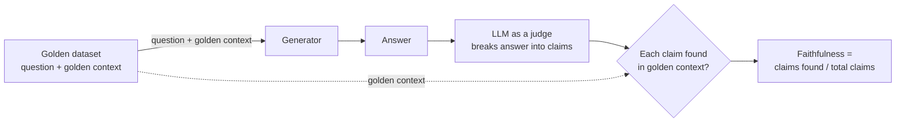
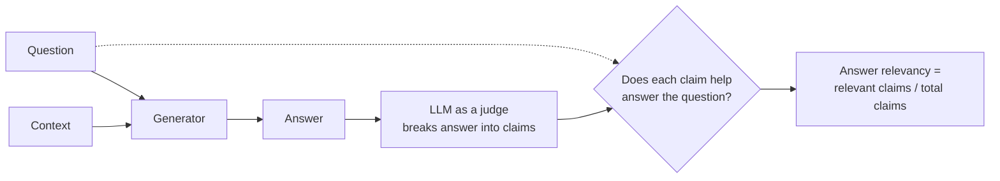
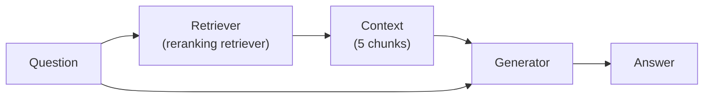
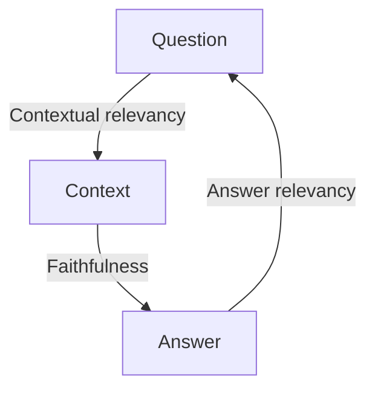
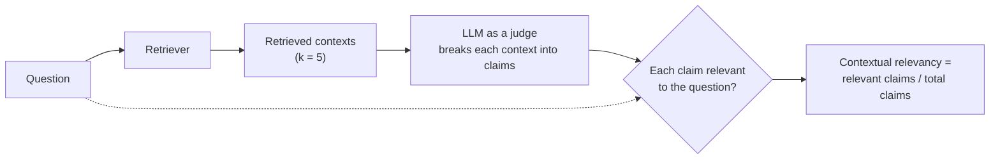

> **Video 14 of 19** · [Watch on YouTube](https://www.youtube.com/watch?v=PATGn2XhmCY) · Translated from the
> Hindi transcript. Notes follow the video section by section, in its order.

With the retriever already evaluated, this session builds and evaluates the generator on its own, then connects the two into a RAG pipeline and evaluates the whole pipeline with the RAG triad.

## Plan of action for this session

Two classes ago the RAG evals started, with a detailed plan for evaluating a RAG application. Within that plan the current job is one thing: building a **RAG eval suite**, a set of evaluations you run together to get an evaluation of the whole RAG application. The suite is built at three levels:

- **Component level**
- **Pipeline level**
- **Application level**

RAG has only two components: the **retriever** and the **generator**. The last session completed the retriever evaluation with two metrics, **recall** and **precision**. Today's plan is to learn to evaluate the generator, and then, in the same session, to evaluate the complete RAG pipeline.

## Building the generator

To evaluate a generator you first have to build one. The RAG application is not built in one go and then tested; it is built component by component, testing each component as it is built, exactly as in software. Build the retriever, evaluate the retriever; build the generator, evaluate the generator.

The generator is a very simple component. In a RAG pipeline the retriever takes a query, embeds it, sends it to a vector database and fetches back 5 or 10 relevant docs. Those docs plus the question go to the generator, whose job is to produce an answer from them. So the generator is a function with two inputs (the question and the relevant documents) and one output (the answer). It basically uses an LLM, nothing more.

The code is not written from scratch; it is already in the course repo, pushed to Git, in a new file `src/generator.py`:

- Import the libraries and call `load_dotenv()`, because the OpenAI API key is needed.
- The LLM is `gpt-4o-mini`: cheap, with **temperature set to zero**. Most of the time at evaluation time temperature is set to zero (although this particular step is building the RAG, not evaluating it).
- A simple prompt for the generator:
  - "You are a helpful teaching assistant for a course on LLM evaluations. Answer the student's question only from the context provided below."
  - Rules: use only information present in the context and do not add outside knowledge (RAG chatbots answer from the context, not from training knowledge, so this is written explicitly); if the context does not contain enough information, say "I don't have enough information in the course material to answer that" (in other words, do not hallucinate: if you do not know, say so); keep the answer clear and concise.
  - The prompt takes the **context** from the retriever and the **question** from the user.
- A simple LangChain chain: prompt → LLM → `StrOutputParser` to extract the string.
- A `generate` function that takes the query and the context and returns the answer.
- A small block at the bottom only for testing it, which you can ignore.

```python
from dotenv import load_dotenv
from langchain_openai import ChatOpenAI
from langchain_core.prompts import ChatPromptTemplate
from langchain_core.output_parsers import StrOutputParser

load_dotenv()

llm = ChatOpenAI(model="gpt-4o-mini", temperature=0)

prompt = ChatPromptTemplate.from_template(
    """You are a helpful teaching assistant for a course on LLM evaluations.
Answer the student's question only from the context provided below.

Rules:
- Use only information present in the context. Do not add outside knowledge.
- If the context does not contain enough information to answer, say
  "I don't have enough information in the course material to answer that."
- Keep the answer clear and concise.

Context:
{context}

Question:
{question}"""
)

chain = prompt | llm | StrOutputParser()


def generate(query, context):
    return chain.invoke({"question": query, "context": context})


if __name__ == "__main__":
    context = "..."  # a dummy context written by hand (text not read out in narration)
    print(generate("What is online eval?", context))
```

Copy it into a new `src/generator.py` and save. The test block uses a **dummy context** made by hand, not one from the retriever, and the question "What is online eval?". Running it prints:

```text
Online eval means evaluating your system on live production traffic after
deployment. It works without an answer key, unlike offline eval.
```

The answer comes straight from the dummy context. That proves only that the code works. Whether the generator works well or badly is unknown until it is evaluated.

## The generator's failure modes

The first-principles way to evaluate any system is to ask where and how it can fail: find its **failure modes**. A generator has two major ones.

### Failure mode 1: an unfaithful response

You give the generator a question and some context and tell it to answer from that context. It reads the context but adds some information from its own side. That is an **unfaithful** response.

The example:

- **Question:** "Does the CampusX AI engineering programme include live classes?"
- **Context fetched:** "The AI engineering programme includes recorded lessons, coding assignments, projects and weekly doubt-solving sessions." Nothing says whether there are live classes.
- **Answer:** "Yes. The programme includes two live classes every week along with weekly doubt-solving sessions."

This is clearly not faithful. When the LLM did not find the answer in the context it created one with its own freedom. This is a **hallucinated** or **unfaithful** response, and it is very dangerous: in a RAG application it can create massive problems. The Air Canada case study discussed earlier in the course was exactly this, a bot telling a customer to book the ticket and have the money reimbursed later. That was a generator failure: it ignored the context, created information and gave it to the user.

The metric that tests this is **faithfulness**: how faithful the generated answer is to the context.

An important point: often the retriever fetches completely wrong context. A correct generator will still build its answer from that wrong context, even if the answer comes out completely wrong. So **being faithful does not necessarily mean being correct**. Faithfulness only promises: whatever context arrived, right or wrong, the answer is built entirely from it, without one bit of information added from the generator's side.

### Failure mode 2: an irrelevant response

Same question: "Does the CampusX AI engineering programme include live classes?" This time the answer is:

"The programme includes coding assignments, projects, recorded lessons and weekly doubt-solving sessions."

Is it faithful to the context? Yes, fully; it may be almost word for word the context. Is it **relevant** to the question? No. It does not answer what the user asked. The generator held on to the context, but the answer is not relevant for answering the question, so the user still did not get an answer.

A relevant answer would have been: "The provided context does not confirm that the programme includes live classes. It only mentions recorded lessons, coding assignments, projects and weekly doubt-solving sessions." That is relevant to the question and also faithful, since it creates no information itself.

This second metric is **answer relevance**.

There are other generator metrics, such as citation accuracy, completeness and correctness, but those will be tested at the application level, not now. So the generator is evaluated on two things:

1. **Faithfulness**: did the answer come from the context, or is the generator inventing something?
2. **Answer relevance**: is the answer relevant to the question, and does it answer it properly?

That was the "what". Next is the "how": how each metric is calculated, then implementing them in DeepEval and running them.

## How faithfulness is calculated

Faithfulness needs a dataset (where it comes from is covered shortly). It has two columns: **question** and **golden context**.

- A question, for example "What is the RAG triad?", discussed in an earlier session.
- Its golden context: someone sifts through all the chunks in the vector database, pulls out every chunk that talks about the RAG triad, and puts them here.
- Then another question, "What are online evals?", with every chunk that talks about online evals.
- Repeat for 10, 15 or 50 questions.

This is a golden dataset containing golden context. The process:

1. Take a question and send it to the **generator**, together with its **golden context**. A generator always needs two things: a question and context.
2. The generator produces an answer.
3. Send the answer to an **LLM as a judge**, which breaks it into **claims** (say five).
4. The judge takes each claim and checks whether it exists anywhere in the golden context.
5. If claims 1, 2 and 4 are found but 3 and 5 are not, faithfulness for this question is **3/5**.
6. Repeat for every question and take the average.

A critical point: the generator is evaluated **in isolation**. The connection from retriever to generator is not in the picture yet. The context the generator receives does not come from the retriever; it comes from the golden dataset.



The graphic in the video shows the same thing. Question: "What does it mean for a benchmark to get saturated?" The golden context is provided from the dataset, not by the retriever. The answer is broken into claims one, two and three. Claim one exists in the golden context: good. Claim two exists: good. Claim three does not: bad. So faithfulness for this question is **2/3 = 0.67**. Do this for every question in the golden dataset and average; that is your faithfulness score.

Recap of the flow: build a golden dataset of questions and golden context, send both to the generator, break the generated answer into claims, check each claim against the golden context, and divide the number of claims found in the context by the total number of claims.

### Questions from the chat

**Can you evaluate LLM applications other than RAG and agentic systems, for example an application that acts as an interview [unclear]?** Yes. DeepEval offers every kind of metric. If you do not need agentic or RAG metrics you can go to multi-turn; for a chatbot, there are chatbot metrics. If your application is something completely different (not a chatbot, not RAG, not an agent) you can create **custom metrics**, which is the next class. Any kind of LLM-based application can be evaluated.

**Do we pass a subset of the golden dataset, or the full one?** This is a completely new golden dataset made only for faithfulness, and the score is computed over the whole of it: all 15 questions if there are 15, all 50 if there are 50.

**Are we not checking precision and recall for the generator?** No, this is completely different. Recall is actually the opposite process: there you generate context and compare it with an ideal answer. Here you have the ideal context and a generated answer. If it reminded you of recall, that is good; you are reconnecting ideas.

## How answer relevance is calculated

Answer relevance is even easier. It does not need a golden dataset as a reference, so it is a **reference-free eval**.

1. Send a question and context to the generator; it generates an answer.
2. Give an LLM as a judge the question and the answer, and ask whether the answer is relevant to the question.
3. The judge breaks the answer into claims again: claim one, two, three.
4. It compares each claim with the question: does this claim help answer the question, or is it irrelevant? Helps: relevant.
5. If claims one and two help and claim three does not, answer relevancy for this question is **2/3**.



You still use a dataset, but only to get answers generated for many questions. Nothing in it is used as a reference to check "this is correct". That is the main difference.

The example: query "What does it mean for a benchmark to get saturated?" Generated answer: "A benchmark gets saturated when model scores cluster high and close together, so it can no longer tell models apart. Separately, benchmark contamination happens when test data leaks into training data." It has three claims:

1. Saturation is when all the models' scores start clustering and coming out the same. **Relevant.**
2. The benchmark cannot differentiate between two good models. **Relevant.**
3. Benchmark contamination is test data leaking. **Off-topic, so irrelevant.**

Score: **2/3 = 0.67**, repeated for every question. This is simpler than faithfulness: there are no comparisons against a reference, you just leave it to the LLM's judgement whether each claim answers the question.

### Questions from the chat

**What if the generator misses some claim point?** Then its relevancy comes out bad, and that is the point: the aim is to judge whether the generator is good or bad. If it misses the good claims, it is bad.

**Is the LLM that breaks the answer into claims different from the one that analyses them?** No, in DeepEval's implementation it is the same LLM, and it makes no difference. Every LLM API call is independent anyway. The first call says "break this answer down"; the next takes the question and one statement and asks whether they are related. There is no shared context between the calls, so using two different LLMs makes no sense. Use one good LLM.

**Since it relies on LLM reasoning, won't there be false positives and false negatives?** Correct. In every LLM-as-a-judge method the judge can make mistakes, and you should assume it will; the theory classes said repeatedly that you cannot rely completely on an LLM as a judge. The good thing is that if you run the same judge twice, it makes the same mistakes both times. It is like a bad cricket pitch: it is bad for both teams, so the match is judged on the same basis. A faulty judge run twice at least removes the bias between runs. Your application's faithfulness might ideally be 40 but come out 30 because of the judge; next time it will still be around 30, so two evaluations can be compared. The only real fix is a **good, powerful judge**. It does not cost much, because you are not serving crores of users, only testing on some samples, so use the best LLM you have. It costs a bit, but you get the security of a very powerful judge.

**Is the final score an average, since the number of claims may change?** Yes. That was one question; the dataset has 15. Each question gets a faithfulness score and an answer relevancy score, and their averages are the generator's final faithfulness and answer relevancy scores.

**Is the number of claims a hyperparameter you decide?** No. There is no restriction where you decide how many claims to break into; it is not a hyperparameter.

**If the generator gives statement two, misses statement one (the main answer) and adds an irrelevant statement three, what is the score?** 50%: two claims, one right and one wrong. Remember that neither metric is about correctness. Faithfulness says how faithful the answer is to the context; answer relevance says how relevant the answer is to the question. Relevant does not mean correct. **Correctness** is a different metric, for the next class.

## Creating the faithfulness dataset

To build the question and golden-context dataset, the whole vector database, with all its chunks, was exported. The repo has a script, `export_chroma_chunks`, that exports all the chunks in the vector database at once. There were some **862 chunks**, all exported into a JSON file.

That JSON file was then given to **Claude** with the instruction to create this dataset, with one important condition: **step by step**, one question and golden-context pair at a time. Claude analysed all 862 chunks and generated the first question. That question and its context were then read and checked (having taught all these classes, it is known what was taught where), and each pair that looked right was added to a JSON file. This produced a dataset of **15 questions**.

There are three ways to do this:

1. Manually.
2. With an LLM's help, while you do the reviewing.
3. DeepEval's synthesizer, shown last class. It has not been made to work properly yet, so a later class will show it properly.

The dataset is in the repo's goldens folder as `faithfulness_dataset`: 15 questions, each with its ideal context, all verified (you can verify it too). Copy it into your own goldens folder as a new file `faithfulness_dataset.json` and save.

## Implementing the generator eval in DeepEval

The eval code is in the repo's evals section as `eval_generator.py`. It is the same shape as the retriever eval:

- Load the faithfulness golden dataset just made.
- The judge model is `gpt-4o-mini`; you can use a more powerful model if you like.
- Set a **threshold**: below it counts as a fail, above it as a pass.
- Load the dataset into a file object, then loop over it, making an `LLMTestCase` for each question:
  - `input`: the query, from the golden dataset.
  - `actual_output`: the answer, which comes from the `generate` function inside your generator. The question and the context, both from the golden dataset, are sent to the generator.
  - `retrieval_context`: the context from the golden dataset, the ideal context.
- Define two metrics, `FaithfulnessMetric` and `AnswerRelevancyMetric`, both built into DeepEval, passing the threshold, the model and `include_reason=True` so you learn why a test case failed.
- Call `evaluate` with all the test cases and metrics.

```python
import json

from deepeval import evaluate
from deepeval.metrics import AnswerRelevancyMetric, FaithfulnessMetric
from deepeval.test_case import LLMTestCase

from src.generator import generate

JUDGE_MODEL = "gpt-4o-mini"
THRESHOLD = 0.7  # (implied, not shown in narration: the value is not read out)

with open("goldens/faithfulness_dataset.json") as f:
    goldens = json.load(f)

test_cases = []
for row in goldens:
    query = row["question"]            # (implied, not shown in narration: key names)
    context = row["golden_context"]    # (implied, not shown in narration: key names)
    answer = generate(query, "\n\n".join(context))
    test_cases.append(
        LLMTestCase(
            input=query,
            actual_output=answer,
            retrieval_context=context,
        )
    )

faithfulness = FaithfulnessMetric(
    threshold=THRESHOLD, model=JUDGE_MODEL, include_reason=True
)
answer_relevancy = AnswerRelevancyMetric(
    threshold=THRESHOLD, model=JUDGE_MODEL, include_reason=True
)

evaluate(test_cases=test_cases, metrics=[faithfulness, answer_relevancy])
```

The extra hyperparameters of `evaluate` were not added here; you can add them if you want. Create `evals/eval_generator.py`, paste, save, and run it as a module:

```bash
python3 -m evals.eval_generator
```

Once more: at this point the generator is **not connected to the retriever**. The context comes from the dataset.

In a live class a test case or two tends to lag and the run takes longer; when testing normally, without a live class running, everything is very fast. It is not a money problem (the OpenAI platform wallet was recharged with $10 that day); the delay has some other cause.

### First result

| Metric | Score |
| --- | --- |
| Faithfulness | about 0.91 |
| Answer relevancy | about 0.73 |

Faithfulness is quite good; anything above 90 is good. Answer relevancy is not that great and needs improving.

### Why faithfulness is high straight away

Why did faithfulness come out at 91 on the very first run, without tweaking any code? Because faithfulness takes no effort. The generator is an LLM given a question, a context and the instruction to answer from that context. Today's LLMs have very high **instruction-following** capability, so there is a high probability the answer is built from that context. Answer relevancy is lower because it asks something harder: is the generated answer relevant for answering the question? Scoring well on faithfulness is easier than scoring well on answer relevance.

## Improving the generator

For the retriever, last class discussed several fixes: change the chunk size, change the embedding model, add a reranker. For a generator there are not many options. The two biggest are:

1. **Switch to a better model** that follows instructions better.
2. **Improve the generator's system prompt.** The prompt in `src/generator.py` matters a lot; tweak it properly and results improve.

That is what was done here. The individual tweaks cannot all be shown, because the prompt was improved across multiple runs. After running two, three, four times, the results were analysed (which test cases were failing and what reasons they gave), all of that was put into an LLM (Claude), and the prompt was refined gradually over **three or four iterations**. The final version replaces the simple prompt. It has more rules, each added by looking at an individual failed test case:

- Use only information present in the context. Do not add outside knowledge. (As before.)
- Do not strengthen or overstate claims. If the context says two things are different, do not upgrade that to "separate methods" or strong wording.
- The context is an informal lecture transcript: synthesise and rephrase what is there; do not require the question's exact wording to appear.

Save and re-run the evaluation with the new system prompt.

:::tip

DeepEval's `evaluate` runs the test cases **in parallel**, not sequentially. That is why evaluation is fast.

:::

| Metric | Before | After prompt tweak |
| --- | --- | --- |
| Faithfulness | about 0.91 | 0.96 |
| Answer relevancy | about 0.73 | 0.92 |

Answer relevancy of 0.92 is a very good score. So if your generator is not doing well on these two metrics, your options are limited: tweak the system prompt a lot, and change to a better model. A better model improves both quantities automatically.

One test case still fails, and it could be analysed and the prompt improved further. But if you tweak your whole system prompt too much to fit one golden dataset, you risk a kind of **overfitting**: good results on your test data, but when new context arrives from the retriever the faithfulness score may drop sharply. That gets tested when the pipeline is built, because then the context comes through the retriever instead of the golden dataset, which shows whether the prompt only suits the test data or works on the whole pipeline. (Spoiler: it holds up there too, because it is a fairly general system prompt.)

## Component level done

Both components have now been evaluated at the component level. That part of the eval suite is complete, with four metrics:

- **Recall** and **precision** for the retriever.
- **Faithfulness** and **answer relevancy** for the generator.

These results are reproducible. On your machine they will be a little plus or minus, not 96 here and 76 there. Some change is unavoidable because LLMs are probabilistic, but not much.

The narrative so far: the goal is to evaluate a RAG application; that needs a RAG eval suite; the suite is built at three levels; the first level is complete; along the way four new metrics were learned and implemented in DeepEval.

### Questions from the chat

**Can the entire evaluation, including generating goldens, be done with open-source models? There were rate-limiting issues generating goldens.** Certain models do have rate-limiting issues. You can tweak that in settings, or use smaller models. With GPT-5 the same issue appeared: there is a limit on how many parallel LLM calls you can make at once. `gpt-4o-mini` did not have that restriction, which is why it is used here. You can use GPT-4.1 or others, but you will need to check settings in your OpenAI dashboard. For fully open-source, Himanshu confirmed in the chat that DeepEval has a way (set a sync config) but it needs a lot of glue code. That is the benefit of open-source libraries: you can tweak a lot yourself. A demo will come in the next class.

**Recall and contextual precision for the retriever, answer relevancy and faithfulness for the generator: is that always true for RAG apps, or does it change by use case?** For RAG it holds. In DeepEval's documentation, select RAG and you see only **five metrics**: answer relevancy, faithfulness, contextual precision, contextual recall (four done already) and **contextual relevancy**, which comes shortly. Those five are the core metrics. Others, such as correctness, style or completeness, are **custom metrics** you define yourself, using a concept called **G-Eval**, in the next session. Whatever RAG application you build, you will have these four.

**When you change multiple prompts, should you save every prompt and its score? Is there an option?** Yes. After a run, DeepEval prints: "Run `deepeval view` to analyze and save testing results to Confident AI". **Confident AI** is DeepEval's parent company. Running that command stores the whole run there, so every prompt change and every run can be saved: a form of **experiment tracking**. To use it you create a Confident AI account and supply its API key. Running `deepeval view` opens Confident AI; after logging in it asks for the API key, which is created inside a project (here a project called "test three", on the last try). The run then appears on the Confident AI dashboard: **14 of 15 tests passed**, and you can click the failing one and inspect every individual row. You can also store configs with each run, such as which system prompt you used and your chunk size, just as you did in MLflow. This is more LLMOps than the hard-core evals of this course, and connects to what Himanshu teaches (he uses MLflow for it), but Confident AI has this option too.

## Building the RAG pipeline

The retriever is built, the generator is built, and both work properly. Now connect them, which completes the RAG pipeline, and then evaluate the pipeline as a whole at the pipeline level. Step by step:

1. Build the pipeline.
2. Evaluate it.

Building it is simple: join the two components, connecting the two files into a single component. The repo has `src/rag_pipeline.py`:

- Bring in the retriever (the **reranking retriever** is used) and the generator.
- Make a class called `RAGPipeline`.
- Inside it, step by step: fetch context with the retriever, convert that context into a string, send the context and the question to the generator, and return the answer it gives.
- A test block at the bottom runs it.

It is basically glue code: take the question, send it to the retriever, take the context it returns, send context and question to the generator, display the answer.



```python
from src.retriever import RerankingRetriever  # (implied, not shown in narration: exact module and class names)
from src.generator import generate


class RAGPipeline:
    def __init__(self):
        self.retriever = RerankingRetriever()  # (implied, not shown in narration)

    def run(self, question):  # (implied, not shown in narration: method name)
        docs = self.retriever.retrieve(question)  # (implied, not shown in narration)
        context = "\n\n".join(docs)
        answer = generate(question, context)
        return answer, docs


if __name__ == "__main__":
    pipeline = RAGPipeline()
    answer, docs = pipeline.run("What is drift and why does it matter after deployment?")
    print(answer)
```

Copy it into a new `src/rag_pipeline.py`, save, and run it. This time the question goes to the **real retriever**, which fetches context, and question plus context go to the **real generator**. This is the real application. Run it as a module, because it has imports:

```bash
python3 -m src.rag_pipeline
```

It prints the question, the answer and the five retrieved chunks. The answer begins: "Drift refers to the gradual change in a system's performance or the relevance of its evaluation setup over time, particularly after deployment. It matters because as a business operates…" and it is produced from the retrieved context. No error is thrown, so the pipeline works. Next it has to be evaluated at the pipeline level.

## Evaluating the pipeline: the RAG triad

This is pipeline-level evaluation, not application-level. Search the internet for how to evaluate a RAG pipeline and you will find one keyword: the **RAG triad**. There are three things:

- The **question** the user asked.
- The **context** the retriever generated from that question.
- The **answer** generated from the question and the context.

A metric exists on each pair:

| Pair | Question it asks | Metric |
| --- | --- | --- |
| Answer and context | Did the answer come from the context? | **Faithfulness** |
| Answer and question | Is the answer related, relevant, to the question? | **Answer relevancy** |
| Context and question | Is the retrieved context related, relevant, to the question? | **Contextual relevancy** |



Together these three are the RAG triad. If you do well on all three, the RAG pipeline is working fine.

### Why re-compute faithfulness and answer relevancy?

Faithfulness and answer relevancy were computed a moment ago for the generator. Why compute them again? As Prem said in the chat: **this time the context is different**. At the component level the generator got its context from the golden dataset. Now that the pipeline exists, the context comes from **the retriever**, so the scores will differ. That is the main change between component level and pipeline level. The calculation is exactly the same; the only difference is that faithfulness uses the retriever's context instead of the ideal context. Answer relevancy is unchanged: the generated answer and the question go to the LLM as a judge.

### How contextual relevancy is calculated

Contextual relevancy asks how relevant the context your retriever pulled is for answering the question.

1. Give the retriever a question (it needs nothing else).
2. It returns context: with k = 5, five contexts.
3. An LLM as a judge breaks the first context into claims (claim one, two, three…), then the second, then the third, and so on.
4. Say there are 15 claims in total across the retrieved context.
5. For each claim individually, ask the judge: is this claim related or relevant to this question? Yes or no.
6. If 10 of the 15 claims are relevant, contextual relevancy for this question is **10/15**.
7. Do this for all the questions (15 in the golden dataset) and average; that is the whole pipeline's contextual relevancy.



This is also **reference-free**: the golden dataset is needed only for its questions. These metrics are all LLM as a judge because they are reference-free; no other kind of evaluation is possible here. The alternative is a human judge, which is costly, so the LLM is the solution.

### Implementing the pipeline eval

The repo's evals folder has `eval_rag_pipeline`. Again very simple:

- Imports, including the `RAGPipeline` just created.
- The dataset is again `faithfulness_dataset.json`; same judge model; a threshold.
- Load the golden dataset and create an `LLMTestCase` for every row, where:
  - `input` is the question from the golden dataset;
  - `actual_output` is what the generator produced, via the pipeline;
  - `retrieval_context` now comes **from the RAG pipeline**, meaning the retriever sends it. (In `eval_generator.py` it came from the golden dataset.)
- Define all three built-in metrics and call `evaluate`. The same format again, nothing special.

```python
import json

from deepeval import evaluate
from deepeval.metrics import (
    AnswerRelevancyMetric,
    ContextualRelevancyMetric,
    FaithfulnessMetric,
)
from deepeval.test_case import LLMTestCase

from src.rag_pipeline import RAGPipeline

JUDGE_MODEL = "gpt-4o-mini"
THRESHOLD = 0.7  # (implied, not shown in narration: the value is not read out)

with open("goldens/faithfulness_dataset.json") as f:
    goldens = json.load(f)

pipeline = RAGPipeline()

test_cases = []
for row in goldens:
    question = row["question"]  # (implied, not shown in narration: key name)
    answer, docs = pipeline.run(question)  # (implied, not shown in narration: method name)
    test_cases.append(
        LLMTestCase(input=question, actual_output=answer, retrieval_context=docs)
    )

metrics = [
    FaithfulnessMetric(threshold=THRESHOLD, model=JUDGE_MODEL, include_reason=True),
    AnswerRelevancyMetric(threshold=THRESHOLD, model=JUDGE_MODEL, include_reason=True),
    ContextualRelevancyMetric(threshold=THRESHOLD, model=JUDGE_MODEL, include_reason=True),
]

evaluate(test_cases=test_cases, metrics=metrics)
```

Create `evals/eval_rag_pipeline.py`, paste, save, and run the same command as before with the new module name:

```bash
python3 -m evals.eval_rag_pipeline
```

### Pipeline result

| RAG triad metric | Score |
| --- | --- |
| Faithfulness | about 0.92 to 0.93 |
| Answer relevancy | about 0.86 |
| Contextual relevancy | about 0.42 to 0.43 |

Faithfulness is a very good sign, and answer relevancy is good too. This clearly proves the generator's system prompt was written well: even with the context now coming from the retriever, answer relevancy has not dropped much. The only problem in this evaluation is **contextual relevancy**.

## The curious case of the retriever

If contextual relevancy is low, who is the culprit? The **retriever**: it is the one bringing the context. But re-running last class's `eval_retriever` (recall and precision; last time recall was 90-plus) gives:

| Retriever metric (evaluated alone) | Score |
| --- | --- |
| Recall | 99% |
| Precision | 89% |

So evaluated independently, the retriever's own metrics are very good, but in the pipeline its contextual relevancy is just 42%. How can one retriever be good and bad at once? (It is not overfitting.)

Go back to the definitions:

- **Recall** is good: if 100 correct contexts were needed to answer a question, 99 of them are brought.
- **Precision** is good: of 100 contexts fetched, 89 are helpful for answering.
- **Contextual relevancy** says how relevant the context you pulled is for answering the question.

Precision and contextual relevancy sound very similar: precision says how many of the contexts you brought are useful, and contextual relevancy says how relevant all of your context is. Yet one is 89 and the other 42. As Rahul said in the chat: **too much noise per chunk**.

With k = 5 you get contexts C1 to C5. Four of them contain the information needed to answer; one does not. Precision is obviously high. But there can also be noise **inside each context**. Suppose one context has five lines and only two are useful. Broken into claims that is five claims, two useful: contextual relevancy of 2/5. Another context might have only one useful claim out of five. Because even one useful claim makes the chunk useful, it counts as useful for precision. But the chunk is full of noise. That is exactly what the score shows: the chunks each contain one or two sentences that help answer, and a lot of noise around them.

So:

- Recall checks how many of the correct contexts you bring.
- Precision checks how many of the contexts you brought are noise.
- Neither checked how much noise there is **inside a single context**. Contextual relevancy does.

Which parameter would improve contextual relevancy? **Chunking.** Try reducing the chunk size: smaller chunks have a chance of less noise. That is left for you to try. If faithfulness, answer relevancy, recall and precision are all good, a not-so-good contextual relevancy does not matter much, because the answers are coming out good at the end. Reducing noise would lift the other values a little, but since the other four are working well, a somewhat low contextual relevancy can be accepted. Try reducing the chunk size, reducing overlap, other parameters; contextual relevancy might rise, but there may be a trade-off where it goes up and the other four start coming down.

## Where the eval suite stands

The pipeline level is now complete too. What remains is **application-level** evaluation, checking things not checked so far:

- Whether the answer is **correct**.
- Whether the answer is **complete**.
- Whether the answer's **style** matches the CampusX style.
- Then the **safety** evals and **ops** evals, in the next class.
- Then **regression testing** and **online eval**.

The course is on track, with two important things done. The promise at the start of the course was that you would understand and perceive these systems better than others. Everyone builds RAG applications; you should now look at one through a different lens, and that scarce knowledge should help you perform better in interviews. Attendance is low, both in the live class and on YouTube (hardly 3,000 to 5,000 viewers), so it may seem niche or even boring, but the effort is to keep it logical, narrative-driven and progressive. Not many people are serious about evaluations yet, but that should change within a year.

## What comes next

The next class covers application-level evaluation: custom metrics built with G-Eval (correctness, completeness, style), followed by the safety and ops evals.
