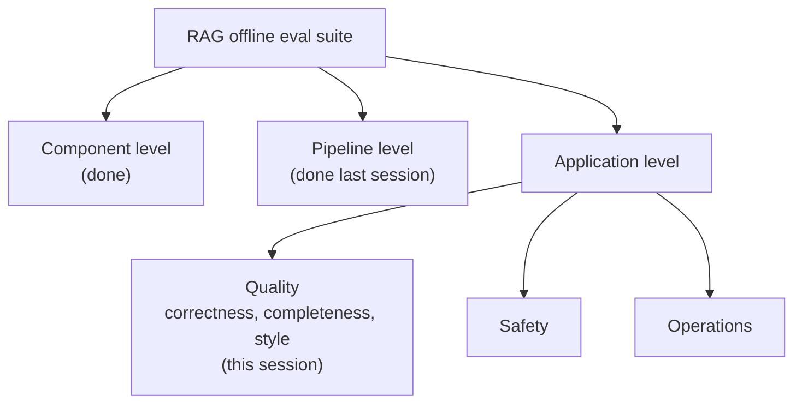
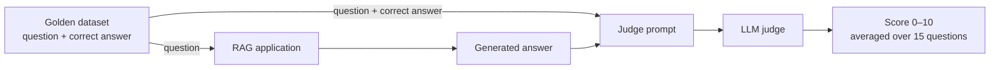
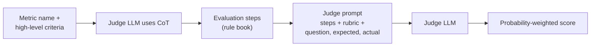

> **Video 15 of 19** · [Watch on YouTube](https://www.youtube.com/watch?v=nlyxlKD5cvU) · Translated from the
> Hindi transcript. Notes follow the video section by section, in its order.

Some qualities of an answer cannot be counted, only judged, and this session introduces G-Eval, the technique that makes an LLM judge's scores stable, then uses it to evaluate the doubt solver's correctness, completeness and style.

## Where the eval suite stands

Two or three sessions ago RAG evaluation began with a detailed plan. The primary goal is an **offline eval suite** for the RAG pipeline, built at three levels: component, pipeline and application. The component-level evals are built, and the last session did the evaluations at the RAG pipeline level.

The application level has three kinds of eval suite: one checks the application's **quality**, one its **safety**, and one its **operations**. This session covers strictly the first, the quality of the RAG application, through three metrics:

1. **Correctness.** Is the answer coming out of the RAG chatbot right or wrong?
2. **Completeness.** If a question contains two sub-questions, does the answer cover both, or is it a partial answer?
3. **Style.** Does the doubt solver's explanation style match the CampusX teaching style?



After this come safety (two or three metrics) and operations, most likely both in the next session along with regression testing. Along the way this session teaches a new, important concept that comes up in interviews: **G-Eval**.

## Count-based metrics

So far five metrics have been covered for the RAG pipeline: **recall, precision, faithfulness, answer relevance** and **context relevance**. They share one pattern: they are **count-based metrics**.

Take faithfulness, which asks whether the generator built its answer entirely from the context or invented something. The way it was calculated: break the generated answer into claims with an LLM (claim one, two, three, four), check each claim for whether it exists in the context, then count. If three claims came from the context and one was invented, faithfulness is **3/4**. You are literally counting how many of the total claims come from the context. Recall, precision, answer relevance and context relevance all did more or less the same thing: break into claims with an LLM, count how many are in your favour and how many against, and turn that ratio into a score with some formula.

## Metrics that need judgement, not counting

What if a metric has no notion of counting at all?

**Style.** Suppose you have to evaluate whether a generated answer follows the CampusX teaching style. Counting and taking a ratio will not work. If you break the answer into statements, what do you test each one for? Say the CampusX style is *why, what, how*. That does not exist in every sentence; it exists at the level of the whole answer. So here you need not counting but **judgement**: someone who reads the answer and assigns a score, "on a scale of one to five, the CampusX style in this is at level four", or "five, the whole answering style matches".

**Correctness.** Can correctness be counted? You could break the answer into claims, take the golden (correct) answer, and ask of each claim whether it relates to the golden answer. But not every claim relates directly. Suppose the chatbot uses an **analogy** to explain something. An analogy is by nature a different example from the current scenario, so analysed in isolation it makes no sense; it only makes sense inside the answer. Compare it as an independent claim against the golden answer and the judge LLM will say it is unrelated, call it a false claim, and penalise it. So correctness also has to be checked at the level of the whole answer, not the claim.

There are many metrics like this: completeness, helpfulness, and all the safety-related metrics. Such judgement can come from a human or an LLM, but the claim-count-ratio method will not work. All three metrics in this session are **judgement-based**, so the score has to come from an LLM.

## Measuring correctness with an LLM judge

Take correctness: if you ask the RAG chatbot 10 questions, what percentage does it answer correctly?

1. **Prepare a golden dataset**, because you have to show what a correct answer looks like. Each row is a question and its correct answer. (How it is made comes later.) Assume 15 rows. "Correct" means universally accepted answers, the same you would find on Google, not necessarily what was taught in class.
2. Feed each question to the RAG chatbot and get back a **generated (actual) answer**.
3. Give an **LLM judge** a prompt like this, filling in the three values:

```text
You are evaluating whether an AI's answer is correct.
You will be given a question, an expected answer, and the actual answer.

Compare the actual answer against the expected answer and decide how
factually correct it is. Give a score from 0 to 10, where 10 = fully correct
and 0 = completely wrong.

Question: {question}
Expected answer: {expected_answer}
Actual answer: {actual_answer}
```

4. The judge looks at all three and returns a score for that question. Do this for all 15 questions and take the average.



The difference from the earlier metrics: before, the LLM judge did a small job (break into claims, check each against the context) and the score came from a ratio. Here there is no ratio; you depend completely on the LLM's judgement to "look and tell me a number out of 10". It is actually easier than what came before. In the same setup you can swap correctness for completeness or helpfulness; the flow stays the same.

## The flaw: high variance

Theoretically this works, but in practice it does not give good results and is not considered a good evaluation method. Why? Some answers from the chat:

- *"The judge itself makes mistakes."* True, but always true. Assume a good, state-of-the-art judge that makes very few mistakes.
- *"Latency and cost."* There will be latency and some cost, but on 15 questions not much. Not the main reason.
- *"The system prompt might become big and miss details."* It is not big: a one- or two-line question, an expected answer of maybe 10 lines, a generated answer of 10 lines.
- *"Criteria need to be given through the prompt."* The criterion is given, in that one line; it is the only criterion.
- *"LLM issues like bias and hallucination."* Bias is an issue, yes, but the answer being sought is more specific.

The big flaw is that the score has **very high variance**: evaluate once and one score comes, evaluate again and a noticeably different one comes. If the setup is identical (same question, same expected output, same generated output), re-running the evaluation should not change the score much. Here it does, for two reasons.

**Reason 1: a loose criterion.** The only guidance is one line: "Compare the actual answer against the expected answer and decide how factually correct it is." Each question is an independent LLM call, and the judge may perceive that loose statement differently in each call, measuring correctness from one angle in one call and another angle in the next. You did not give it a tight **constitution**, a **rule book**, for exactly how to measure correctness, so scores can vary a lot from round to round.

**Reason 2: a single integer output.** You simply ask it to generate a score between 0 and 10. Everything is probabilistic: every token is assigned a probability. Say internally it gave seven 40%, eight 51% and six 9%. Eight is highest, so it outputs eight. Run the same question again and a slightly different interpretation happens: eight gets 40%, seven 51%, six still 9%. Now it outputs seven. It had a little doubt between seven and eight, so one run says seven and the next says eight, and the score keeps going up and down.

Averaged over 15 questions the overall score can swing: 60 once, 70 once, 75 once. The evaluations run so far did not behave like this; re-run, 85 became 86 or 84, never a jump from 75 to 85. This is the biggest reason the method is not used directly in industry: you do not use LLM as a judge directly.

:::tip Try it yourself

The recommendation is: if you are running this project on your machine, write code that measures correctness this naive way, run it three or four times, and see how much the result varies.

:::

## What G-Eval is

**G-Eval** solves exactly this problem. It is a research paper from **2023**, worth reading, especially after this class, when what it proposes will make good sense. It is a technique for making an LLM judge reliable.

**Step 1: metric and criteria.** You say which metric you want to calculate (here, correctness), and give a **criteria**: a high-level criterion for calculating it. The one line above is exactly that: "Compare the actual answer against the expected answer and decide how factually correct it is." In other words, calculate correctness on the basis of factuality.

**Step 2: evaluation steps via chain of thought.** From here G-Eval takes over. It brings an LLM judge, generally GPT-4 (the paper says G-Eval gives its best results with GPT-4), and first asks it to use **CoT (chain of thought)** to convert the criterion into **evaluation steps**: four or five exact steps. You are now creating the rule book, the constitution, for how correctness will be measured, and all later evaluation follows it. This is the first thing that differs from normal LLM as a judge: a high-level criterion from the programmer or evaluator is broken down with CoT. Chain of thought means thinking step by step about a problem; it was covered with the ReAct pattern in the LangChain playlist, where chain-of-thought prompting breaks a problem into steps. Here it breaks a high-level criterion into several evaluation steps, which are then used to calculate correctness.

**Step 3: the judge prompt.** With the evaluation steps in hand, a system prompt is built. An example G-Eval system prompt:

```text
You are an evaluator scoring the correctness of an AI-generated answer.
You will judge the ACTUAL OUTPUT against the EXPECTED OUTPUT using the
evaluation steps below.

Evaluation steps:
1. Compare only the factual claims in the actual output against the
   expected output.
2. A claim is wrong only if it contradicts the expected output or is
   factually false.
3. A factually accurate answer scores high even if it is shorter or covers
   fewer points.
4. Do not deduct for brevity or omitted points; only wrong statements count.
5. Additional correct information must never lower the score.

Scoring rubric:
9–10: ...
5–8: ...
0–4: ...

Question: ...
Expected output: ...
Actual output: ...
```

The high-level criterion is now defined much more tightly, which addresses the first problem. The variance came partly from the judge perceiving the criterion differently on each call; converting it into four or five bullet points of rule book makes the judge far more deterministic, leaving it little scope to use its own mind: follow what you are told. Below that a **scoring rubric** guides the scoring further (this kind of answer scores 9 to 10, this kind 5 to 8, this kind 0 to 4), followed by the question, expected output and actual output.



## Step 4: the probability-weighted score

The next innovation targets the second problem: asking for a single integer between 0 and 10, which could be eight, seven or six, made variance very likely. G-Eval uses a **probability-weighted score**.

To see how, recall how any LLM or transformer generates output. The final layer of the network has as many nodes as there are output tokens. Say there are 10,000 output tokens: every word, every digit. Based on the input, the model assigns a probability to every token ("is", "the", "zero", "hello", …), say 0.61 to one and 0.31 to another. The token with the highest probability is printed in that cycle; it is added to the input and the process repeats, the maximum-probability word coming out each time. Output is printed in this **auto-regressive** manner.

If the prompt says "analyse all this and assign a score between 0 and 10", then even with 10,000 tokens, the tokens 0, 1, 2 … up to 10 will get the highest probabilities, because the prompt explicitly demands a number. Words like "is" and "the" get low probabilities; a word like "with" cannot be the output for this prompt at all, so it gets a very low probability.

Instead of taking the printed token, extract the **top-k** tokens. You cannot extract all 10,000 (too much compute), but LLMs let you see the top-k probabilities. Say you take the top five for the current prompt:

| Token | Probability |
| ----- | ----------- |
| 8     | 0.70        |
| 7     | 0.20        |
| 9     | 0.05        |
| "the" | 0.01        |
| ":"   | (small)     |

1. **Ignore the non-numerical tokens**; they do not matter.
2. **Normalise.** The remaining three (8, 7, 9) sum to 0.95, not one, because many tokens were dropped. Divide each by 0.95: 0.70 → 0.73, 0.20 → 0.21, 0.05 → 0.0526.
3. **Take the weighted average**: multiply 8 by 0.73, 7 by its probability, 9 by its probability, and add. The answer is **7.84**.

In a normal setup, printing the token's actual value, the output would obviously be **eight**, because out of all the tokens the model gave eight the highest probability, and the correctness score would simply be eight. G-Eval instead factors in how sure the model was about seven, about eight and about nine, and gets **7.84**.

Because it is a weighted average, the number does not jump from six to eight between runs. If it is 7.84 once, the next time it might be 7.4 or 7.9, not a jump from 6 to 8. The LLM-as-a-judge problem is solved by not taking the output and instead taking the log probabilities. This is the main innovation of G-Eval.

Finally, divide by 10, because the output is always kept between zero and one: **0.784**. Compare with a threshold, 0.7 as with every metric so far: above 0.7 is a pass (the answer is correct), below 0.7 a fail.

## G-Eval's two innovations, revised

1. **Criteria to evaluation steps with CoT.** Instead of sending a single criterion in the system prompt, you send a whole rule book. In every API call the judge has more clarity about what to do and less scope to think, so the system behaves more deterministically. Leave more thinking to the LLM and it may do something different each time, which brings variance.
2. **Log-probability weighting.** Instead of extracting the 7, 8 or 9 it prints, take the top five tokens out of the 10,000, catch their probabilities, normalise, take the weighted average, and use that score rather than the token. Scores stay stable across evaluation runs.

Because of these two innovations G-Eval beats the plain approach: compare normal LLM as a judge with G-Eval and G-Eval mostly gives better results. The paper says exactly this; its figure shows the same weighted-sum idea, how much probability went to one, to two and to three. With normal token usage the output would have been three, but weighting gives **2.59**, so there is less jumping around.

Tracing back the whole discussion: count-based metrics were all that had been studied; some metrics depend on judgement instead, so LLM as a judge is needed; its big flaw is that scores vary a lot between runs, for two reasons (a high-level criterion the LLM interprets differently each time, and taking its printed score at face value). G-Eval solves both, with CoT evaluation steps and a weighted score of log probabilities, giving stable, reliable results across runs. All three metrics in this session use it.

G-Eval is actually a very simple thing that does only two new things. If someone asks whether G-Eval is something special and new: no, it is still LLM as a judge, with two core innovations. It is a way of improving LLM as a judge.

## DeepEval's G-Eval implementation

All of this could be done by hand, but the **DeepEval** library implements G-Eval for you. Its documentation example: the library imports, then the familiar **LLM test case** with input, actual output and expected output. The real point is that so far built-in metrics (recall, precision) were used, but DeepEval has **no built-in correctness metric**, so you make an object of the `GEval` class:

```python
from deepeval import evaluate
from deepeval.metrics import GEval
from deepeval.test_case import LLMTestCase, LLMTestCaseParams

test_case = LLMTestCase(
    input="...",
    actual_output="...",
    expected_output="...",
)

correctness = GEval(
    name="Correctness",
    criteria="Compare the actual answer against the expected answer and decide how factually correct it is.",
    evaluation_params=[
        LLMTestCaseParams.INPUT,
        LLMTestCaseParams.ACTUAL_OUTPUT,
        LLMTestCaseParams.EXPECTED_OUTPUT,
    ],
    model="gpt-4o-mini",
    threshold=0.7,  # (implied, not shown in narration: the value is not read out)
)

evaluate(test_cases=[test_case], metrics=[correctness])
```

- `name` says what the metric is: correctness.
- `criteria` is the high-level criterion. Name plus criterion is exactly step one.
- `evaluation_params` says which parts of the test case to work on: the input question, its answer and its expected answer, taken from the test case.
- `model` is the judge; any other GPT-4 model can be used.
- `threshold`: the final score is compared with it to say true or false, passed or failed.
- In `evaluate`, you just pass the correctness metric.

When the code runs, DeepEval automatically breaks the criterion into evaluation steps, builds the judge prompt, sends it to the model, extracts the log probabilities of the top-k tokens, normalises them, takes the weighted average, divides by 10, compares with 0.7, and reports true or false for whether the answer is correct.

### Questions from the chat

**When exactly is the weighted average calculated?** You have a question, the RAG chatbot's generated answer, and the correct answer from the golden dataset. You give a high-level criterion (check whether this answer is correct against this one, on the basis of factuality) to the judge. It breaks the criterion into evaluation steps and builds a judge prompt: look at this question, this answer and this correct answer, and score by these steps. When that reaches GPT-4o, its job is simply to generate a number between 0 and 10, eight or nine or 10. Paste that whole prompt into ChatGPT and you would get a number depending on how correct the answer is; paste it into another ChatGPT tab and nine or 10 might come instead of eight, because asked for one integer it can be unsure between eight and nine from turn to turn. So that number is eliminated. Instead you ask: while calculating internally, what probability did you assign to eight, to nine, to 10? The top five tokens are pulled out, normalised and weighted-averaged, and that average is the output, for every question. An LLM can print any word in the world at any point; it prints a particular word because that word's probability came out highest. G-Eval just goes one step back: it asks not for the generated token but for the probabilities, and uses them to get the output. This rests on how a transformer generates, its auto-regressive behaviour.

**What if we want to evaluate a response against specific guidelines but have no expected answer?** It depends on what you want to measure.

**Do we only use eval methods like DeepEval and G-Eval, or are there others?** You can simply use LLM as a judge directly, and that works too. The only problem is that the score jumps around: 85 once, 95 the next time.

**Are there other G-Eval metrics apart from correctness?** Yes. For all judgement-based metrics (correctness, completeness, style, helpfulness, safety-related metrics) you use G-Eval.

## Correctness vs faithfulness

Correctness asks whether the answer the RAG application produced is right **in the eyes of the world**. Two things matter with respect to being right, and they differ:

- **Faithfulness**: the answer is grounded in the context, extracted from what came from the context, meaning what was taught in the course.
- **Correctness**: at the Google level, the world level, the answer is factually correct.

| Faithful? | Correct? | What happened                                                                                                  |
| --------- | -------- | -------------------------------------------------------------------------------------------------------------- |
| Yes       | Yes      | The ideal case.                                                                                                |
| No        | Yes      | Something was taught wrong, and the generator answered from its training knowledge instead of the context.     |
| Yes       | No       | Something was taught wrong in class, and the generator faithfully repeated it, so the answer is actually wrong. |
| No        | No       | It ignored the context, hallucinated, and what it hallucinated is also wrong.                                  |

A RAG application's answer should be both faithful and correct.

## Building the correctness eval

### The golden dataset

First, a golden dataset: questions on one side, correct answers on the other. Correct again means what is right in the eyes of the world, not what was taught. Most likely a human expert with deep knowledge of the subject makes it. Here it is a dataset of **15 questions**, shared in the goldens folder of the repo: each row has the question, its ideal answer, and which session the discussion happened in.

Copy it, go to the code's `goldens` folder, create a new file `correctness_goldens.json`, and paste it in.

### The eval file

Next create an eval file, `eval_application.py`, and paste in the prepared code, then walk through it line by line:

- Library imports.
- The path of the golden dataset just created.
- The judge model, **GPT-4o mini**, and the correctness threshold, **0.7**: a score below 0.7 counts as a fail.
- Open the golden dataset.
- Create the RAG pipeline, because each question has to go to it to generate the actual answer.
- A loop that runs 15 times, once per golden question: send the current question to the RAG pipeline, get the generated (actual, not ideal) answer, and build a test case with question, actual output and expected output. This is the same code used so far.

The new part is the metric: a new `GEval` metric called correctness. One thing is done differently here. Instead of a high-level `criteria`, **evaluation steps are provided directly**, so G-Eval's CoT step does not happen at all; if you give criteria, G-Eval creates the evaluation steps internally, but if you give evaluation steps directly, that step is skipped.

```python
import json

from deepeval import evaluate
from deepeval.metrics import GEval
from deepeval.test_case import LLMTestCase, LLMTestCaseParams

from src.rag_pipeline import RAGPipeline

GOLDENS_PATH = "goldens/correctness_goldens.json"
JUDGE_MODEL = "gpt-4o-mini"
CORRECTNESS_THRESHOLD = 0.7

with open(GOLDENS_PATH) as f:
    goldens = json.load(f)

pipeline = RAGPipeline()

test_cases = []
for row in goldens:
    question = row["question"]            # (implied, not shown in narration: key names)
    answer, docs = pipeline.run(question)  # (implied, not shown in narration: method name)
    test_cases.append(
        LLMTestCase(
            input=question,
            actual_output=answer,
            expected_output=row["ideal_answer"],  # (implied, not shown in narration: key name)
        )
    )

correctness = GEval(
    name="Correctness",
    evaluation_steps=[
        "Compare the actual output against the key facts in the expected output.",
        "Heavily penalize statements in the actual output that contradict the expected output or are factually wrong.",
        "Reward statements that match the expected output in meaning, regardless of the wording.",
        "Do not penalize the actual output for omitting information; only wrong statements count here.",
    ],
    evaluation_params=[
        LLMTestCaseParams.INPUT,
        LLMTestCaseParams.ACTUAL_OUTPUT,
        LLMTestCaseParams.EXPECTED_OUTPUT,
    ],
    threshold=CORRECTNESS_THRESHOLD,
    model=JUDGE_MODEL,
    strict_mode=False,
)

evaluate(test_cases=test_cases, metrics=[correctness])
```

### Criteria or your own evaluation steps?

Which is better: giving a high-level criterion and letting it generate the steps, or writing the steps yourself? Writing them yourself, because every call to the judge then sends the **exact same steps**. With criteria, one call generates some evaluation steps and the next call may generate slightly different ones, adding variation. With your own steps there is no variability at all, so this reduces the variance problem a little further.

When to use which:

- **At the start** of designing an evaluation pipeline, when you do not yet know how the model is evaluating or which questions are going right and wrong, send **criteria** to test the evaluation process, and trust the LLM to generate good evaluation steps.
- After two or three runs, once you start seeing where evaluation fails and passes and understand the picture, send **your own evaluation steps**. That is the best.

The rest of the metric: the evaluation parameters (question, generated answer, ideal answer), the threshold and the judge model.

`strict_mode=False`: set it to `True` and the whole weighted calculation does not happen; if it says eight, eight is printed; if seven, seven. Keep it `False` so the weighted calculation shown step by step happens, which is what is wanted. Then the test cases and the correctness metric are passed to `evaluate`.

:::note

In DeepEval's documentation, `strict_mode=True` makes a metric's score binary (1 for a perfect result, 0 otherwise) and overrides the threshold to 1. Leaving it `False`, as here, is what keeps the normal G-Eval score.

:::

### First run: 66%

Run it from the terminal:

```bash
python3 -m evals.eval_application
```

```text
Correctness: 66%   passed 8 / failed 7
```

The correctness score is **66%**: eight of 15 questions passed and seven failed. For each failure you get complete detail: question, actual output, expected output, and the reason for failing. One question, for example, got a weighted score of **0.58**, with its reason.

Debugging live is difficult, but this was all tested offline before the class. The problem: in the golden dataset every question was answered very well, because as a human expert the aim was to write the correct answer. Reading the failure reasons, they all say the same thing: the RAG pipeline's answer is not as complete as the golden answer. If the question is "What is an offline eval?", the golden dataset defines offline eval very thoroughly, and the generated answer may cover only 70% of it. Just because the coverage is not complete, the judge considers it incorrect.

### Refining the steps and adding a rubric

Look again at the current evaluation steps. Step two says to penalise statements that are the exact opposite of the ideal answer. Step three rewards statements with the same semantic meaning. Step four says not to penalise omitted information, only wrong statements. So even though the steps say that incomplete coverage should not be penalised, it is still being penalised; this was found by reading the reasons for the wrong test cases.

So a second version of the metric is created: paste it below the existing correctness, and import `Rubric` to clear the error. The wording differs slightly:

- "Compare only the factual claims in the actual output against the expected output." (Same.)
- "A claim is wrong only if it contradicts the expected output or is factually false." (Same.)
- A factually accurate answer must still score high even if it is shorter, less detailed and covers fewer points than the expected output. Do not deduct for brevity. In other words, do not penalise a correct answer for not being as long, for missing elaboration, for fewer examples, or for omitted points.

This states the criterion more strictly. The new addition is a **scoring rubric**. Without one, G-Eval decides by itself, from the evaluation steps, how much to score an answer. Now that control is taken too:

- A clear factual error: score 0 to 4.
- Mostly correct, with one or two small inaccuracies: 5 to 8.
- All claims factually correct: 9 to 10.

Earlier the model was told only on what aspect to evaluate; now it is also told how scoring is decided.

```python
from deepeval.metrics.g_eval import Rubric

correctness = GEval(
    name="Correctness",
    evaluation_steps=[
        "Compare only the factual claims in the actual output against the expected output.",
        "A claim is wrong only if it contradicts the expected output or is factually false.",
        "A factually accurate answer must score high even if it is shorter, less detailed, and covers fewer points than the expected output.",  # (wording partly unclear in narration)
        "Do not deduct for brevity, missing elaboration, fewer examples, or omitted points.",
    ],
    rubric=[
        Rubric(score_range=(0, 4), expected_outcome="The answer contains a clear factual error."),
        Rubric(score_range=(5, 8), expected_outcome="Mostly correct, with one or two small inaccuracies."),
        Rubric(score_range=(9, 10), expected_outcome="All claims are factually correct."),
    ],
    evaluation_params=[
        LLMTestCaseParams.INPUT,
        LLMTestCaseParams.ACTUAL_OUTPUT,
        LLMTestCaseParams.EXPECTED_OUTPUT,
    ],
    threshold=CORRECTNESS_THRESHOLD,
    model=JUDGE_MODEL,
    strict_mode=False,
)
```

Remove the previous version, keep the new one, and run the pipeline again.

Where did this idea come from? The reasons for the seven failed test cases were studied, and all seven showed a common pattern: the ideal answers in the golden dataset were written very well, from every angle, while the RAG chatbot's generated answers are not of that quality. They miss a point or so but are correct in themselves. So the evaluation criterion was made a little **lenient**: do not seek perfection; if an answer is correct despite being short or missing a point or two, consider it correct and score it that way.

The score improves to **0.84**. It could be improved further by changing the retriever or the generator so that correctness goes up; that will be discussed later, but not now, to avoid digressing. The point here is how correctness is evaluated, not how it is improved.

### Why the rubric parameter

Someone asked earlier about the `rubric` parameter. It exists so that the responsibility of scoring is not left to the judge LLM either: you tell it exactly how many marks to give in each case. Without it, that independence stays with the LLM. Once you understand your evaluation pipeline, it is a good idea to provide **both** evaluation steps and a rubric, which makes the application quality pipeline more deterministic.

### Re-running: stable scores

Re-run it and the score should hardly move, not from 0.84 to 0.80, 0.90 or 0.75, because so much control is kept by you. The whole point of G-Eval is to make evaluation more deterministic and less probabilistic.

```text
Run 1: 0.84   passed 14 / failed 1   (test case 7 failed)
Run 2: 0.83   passed 14 / failed 1   (test case 7 failed)
```

The same case fails both times. It is very deterministic and varies only slightly.

## Completeness

Nothing new is needed for completeness. The same golden dataset is used: a question, its ideal answer, and a generated answer. Suppose the ideal answer is made of three points, **A, B and C**, but the generated answer covers only A and B. Ask an LLM to compare the generated answer with the ideal one and say how complete it is. It sees three pointers discussed in one and two in the other, and might say "out of 0 to 10, this is a 7.5". The LLM judge does that; you just add one more metric, and the rest of the setup is exactly the same.

Define completeness right below correctness and modify `evaluate` to take two metrics. It has the name completeness, its own evaluation steps (in the shared code, to read at leisure), and a rubric of 0 to 4, 5 to 8 and 9 to 10.

```python
completeness = GEval(
    name="Completeness",
    evaluation_steps=[...],  # (not read out in narration; in the course code)
    rubric=[
        Rubric(score_range=(0, 4), expected_outcome="..."),  # (not read out in narration)
        Rubric(score_range=(5, 8), expected_outcome="..."),
        Rubric(score_range=(9, 10), expected_outcome="..."),
    ],
    evaluation_params=[
        LLMTestCaseParams.INPUT,
        LLMTestCaseParams.ACTUAL_OUTPUT,
        LLMTestCaseParams.EXPECTED_OUTPUT,
    ],
    threshold=CORRECTNESS_THRESHOLD,  # (implied, not shown in narration)
    model=JUDGE_MODEL,
    strict_mode=False,
)

evaluate(test_cases=test_cases, metrics=[correctness, completeness])
```

Now the run gives both scores:

```text
Correctness:  ~0.83
Completeness: 0.68   passed 5 / failed 10
```

Correctness is about the same, around 0.83. Completeness is **0.68**, and more concerning, only five questions pass and 10 fail. Not a good result.

### Fixing the generator prompt

Same approach: study the reasons the judge gives for all the failures. It turns out the RAG pipeline's generator was told to give very **concise** answers from the context, limiting its scope: don't say much, say only as much as has been told. In `src`, the generator's prompt is very restrictive, essentially "quietly generate the answer from inside the context without saying much".

So the prompt was refined. Replace the generator's prompt with the new one; the line added is:

```text
Answer thoroughly: identify every distinct part of the question and cover
each one, and include all the relevant points the context provides for
answering it. If the question has multiple parts or the concept has multiple
components, address all of them rather than stopping at the first.
```

It repeatedly pushes the generator to look at the question from every angle and answer all its parts. It does not tell it to invent anything; the answer must still come from the context. It only says: don't miss any part of the question. That is a bit of prompt engineering, a simple fix. There are other kinds of fix, discussed later; for now the point is how to measure completeness and improve it in a small way.

Re-run with this small change:

```text
Completeness: 0.75   passed 14 / failed 1
```

Before it was passed five, failed 10. Fine-tuning the generator's prompt a little improved completeness a lot and cut the failed test cases sharply. That is how you improve the scores; fixing things further down the pipeline will be discussed in more detail later.

## Style

The last metric: does the answer generated by the RAG pipeline follow the **CampusX style**, the brand style? This matters too, and again nothing new is needed. Here you do not even need an ideal answer. You simply define a **rubric** very clearly describing what the CampusX style is; the judge reads that rubric and the generated answer and says how well the answer follows the style. Add one more metric to the existing code.

The whole file is replaced with a version whose correctness and completeness code is exactly the same, plus a third metric, style, which states exactly what a CampusX-style explanation is:

```python
style = GEval(
    name="Style",
    evaluation_steps=[
        "Reward an intuitive, explanatory tone: plain language, the idea explained before any formula or jargon, and technical terms briefly unpacked when used.",
        "Reward a direct, conversational register that addresses the student as a CampusX lecture would, rather than a dry, formal or textbook tone.",
        "Reward the use of a concrete example, analogy or why-it-matters framing where it helps.",
    ],
    rubric=[
        Rubric(score_range=(9, 10), expected_outcome="Clearly in a CampusX teaching voice: intuitive, conversational, explains before it formalizes."),
        Rubric(score_range=(5, 8), expected_outcome="Reasonably clear but somewhat flat, formal, or textbook-like."),
        Rubric(score_range=(0, 4), expected_outcome="Dry, stiff, jargon-heavy or robotic; does not read like a teaching explanation."),
    ],
    evaluation_params=[
        LLMTestCaseParams.INPUT,  # (implied, not shown in narration)
        LLMTestCaseParams.ACTUAL_OUTPUT,
    ],
    threshold=CORRECTNESS_THRESHOLD,  # (implied, not shown in narration)
    model=JUDGE_MODEL,
    strict_mode=False,
)

evaluate(test_cases=test_cases, metrics=[correctness, completeness, style])
```

Running it now should score style poorly, because the generator prompt says nothing at all about what the CampusX style is, and it is being measured directly:

```text
Correctness:  ~0.8
Completeness: 0.75
Style:        0.54
```

Style is **0.54**, as expected, because the RAG chatbot was never guided on how to answer in the CampusX style.

### Two fixes

**Fix 1: improve the generator prompt.** Replace the generator's existing prompt with a new one (its formatting got a little messed up on screen). It includes:

```text
Write in flowing, conversational prose, the way a teacher explains something
out loud, not as a bulleted or numbered list. Only use a list when the
question genuinely calls for enumeration. Explain the intuition first in
plain language and briefly unpack any technical terms you use.
```

It tries to explain what the style is.

**Fix 2: correct an over-correction in the rubric.** The style steps say "reward the use of a concrete example or analogy". Wherever test cases were failing, one reason the judge gave was that the answer had no analogies or examples. It took that one point very much to heart, as if every explanation must contain an analogy or example, which is not correct. So the style metric gets this line instead:

```text
An analogy or concrete example is a bonus when the concept is abstract, but a
clear, direct, well-explained answer is fully acceptable.
```

Replace the old style metric with the new one. With both changes (refined generator prompt, and the over-correction in the G-Eval metric fixed), run it one final time. Style should improve, not to 100%, but better than before.

```text
Style: ~0.74   passed 9 / failed 6
```

### Prompt engineering matters

Prompt engineering is sometimes loosely dismissed as not mattering. It does: to improve these metrics you have to tweak prompts and system prompts, and tweaking them correctly shows up as real improvements in the evaluation scores. Understand prompt engineering, whether you do it yourself or through an LLM.

Just two changes (tweaking the generator prompt and reducing the over-correction) took style to around **0.74**. It can be tweaked further, but it will not go very high, because if it does, other metrics such as faithfulness start taking a hit. 0.74 is good: nine questions pass and only six fail. You could also lower the threshold a little; 0.7 is a bit harsh, and 0.6 would do.

## Other G-Eval metrics

That is how to create an application evaluation pipeline with G-Eval, and these are only three examples. You can build many custom metrics this way, helpfulness for instance. DeepEval's G-Eval page explains G-Eval with exactly what this class covered: how it is calculated, examples, and what else can be measured: correctness (done here), **coherence**, **tonality** (style was measured here). **Safety**, in the next class, will also use G-Eval. Many kinds of custom metric are possible, but the method is the one seen today.

## What comes next

Against the plan of action from the first slide, application quality is now done. What remains is the **safety** and **operations** part, in the next class.
