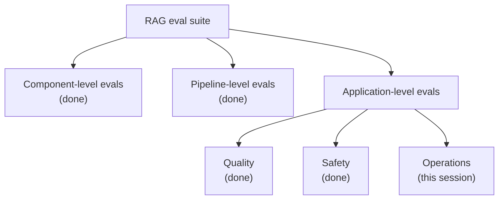
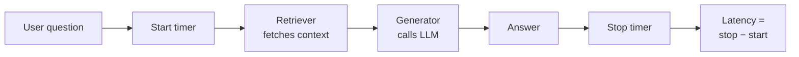

> **Video 17 of 19** · [Watch on YouTube](https://www.youtube.com/watch?v=kuTgQM9zhq0) · Translated from the
> Hindi transcript. Notes follow the video section by section, in its order.

A RAG system that gives good answers still has to run reliably, quickly and cheaply, and this session builds the operational evals (latency, cost and reliability) that complete the doubt solver's eval suite.

## Recap: the one part left

The same diagram kept being drawn session after session, so this time it is a ready-made flow chart. For the last five sessions the work has been building a **RAG eval suite** to evaluate a RAG application: a **doubt-solver chatbot** that helps students of the LLM evals course. The plan had three levels:



Only **operations** remains. The plan was to cover regression testing in this lecture as well, but the lecturer is not feeling well, so this session covers only operational evals and regression testing moves to the next session. With operational evals the whole eval suite is complete, and the next session uses it for regression testing.

## What operational evals are

Here the focus is specifically on RAG applications. The definition on screen: operational evals for a RAG application answer a **different question** from quality evals such as correctness, faithfulness and relevance.

Every eval studied so far, at the component, pipeline or application level, judged the application's **quality**: faithfulness, correctness, completeness, the quality of the output coming out of it. Operational evals do not answer that. They answer: *even if the RAG system gives good answers, can it run **reliably, quickly and economically** in production?*

They also differ in how they work. Nearly all the metrics so far (arguably all of them) used an **LLM as a judge** internally, and some needed **golden datasets**. Operational evals need **neither**. You simply measure a software system on different qualities. In the words on screen, operational evals are *primarily software and telemetry driven; unlike quality evals, they usually do not require golden datasets or LLM judges.* They are measurements you take against your application to find out whether, deployed at scale, it will work reliably, quickly and economically.

### The three operational evals covered

1. **Latency**: how long users have to wait to see answers.
2. **Cost**: how much money you spend to answer each query.
3. **Reliability**: how many times the whole pipeline ran properly and how many times an error came.

A fourth, **throughput**, also exists, but it needs **load testing**, which is outside this course's scope, so it is not covered.

## Should operational evals be in the offline suite?

Operational evals are super important because they answer a critical question: is the **deployed** system actually behaving well? By definition, then, they sound useful only post-deployment. So should they be part of the **offline** eval suite built before deployment at all, or is that a waste of time?

Most of the class said yes; one or two were unsure. The answer is **obviously yes**. Before deployment too you need to know your system's latency, what you pay per query, and how reliable it is.

### The scenario

You build a RAG application that fetches the **top five chunks** from the retriever and gives them to an LLM. You calculate the quality metrics and, as an afterthought, the operational ones too, on your laptop. Then, to improve the system, you make three big changes: add a **reranker**, fetch the **top 10** chunks instead of five, and replace the LLM with a **bigger** one. Measuring again:

| Metric             | Before | After |
| ------------------ | ------ | ----- |
| Correctness        | 91%    | 95%   |
| Faithfulness       | 94%    | 96%   |
| Answer relevance   | 93%    | 95%   |
| Average latency    | 2.3 s  | 4.1 s |
| P95 latency        | 4.8 s  | 6.2 s |
| Average cost/query | ₹0.72  | ₹1.08 |
| Timeout rate       | 2%     | 1%    |
| Success rate       | 99.8%  | 99.9% |

(P95 latency is a type of latency, explained shortly.)

Had you not measured operational evals, you would have missed this completely. Latency jumped from 2.3 to 4.1 seconds without you knowing, you would deploy, users would suddenly say "your application has become slow", and you would be paying more money without knowing how much more. As a team building a RAG application for scale, you should have everything clear beforehand, and operational evals give the complete picture. Measuring only quality is not enough; operational evals also tell you whether your system has **regressed**, become worse than before.

### Absolute values vs the differential

These are not proper production values. 2.3 seconds on your laptop does not mean 2.3 seconds once deployed. But the **comparison**, 2.3 against 4.1, is true: bringing in the new model and making the changes increased latency. That **differential** is what is important to study, and it is the benefit of keeping operational evals offline. Offline, their absolute value is not very dependable, but the direction of change tells you what has broken. That is why operational evals should always be in the offline eval suite.

Their bigger use is post-deployment. In a session or two, with **online evals**, you will see that observability tools such as **LangSmith** or **Confident AI** log all these values by default, and there they matter a great deal. The point here is only that this does not make them unnecessary offline.

**From the chat (Tarun):** whenever you compare two experiments you keep the setup exactly the same. That is an assumption throughout; change the experiment's setup and the direction that comes out is no longer reliable.

The summary line on screen: **"Do not wait until production to discover that your RAG pipeline is too slow or too expensive."** Without operational evals offline, you would only find out after deployment that latency and cost went up.

## Latency

Latency is very important, in interviews and when actually building a chatbot at a company, so the next 15 minutes deserve focus.

**Latency** is the amount of time a system takes to respond to a request. A user sends the chatbot a question, say they type "What is MMLU?" and hit enter; how many seconds pass before the full reply is shown to them? That duration is latency.

### The basic idea: a timer

To build a latency eval you essentially make a **counter**. The pseudo-code: take the question from the user, give it to the RAG pipeline, and get the answer back. Internally the pipeline calls the retriever, which brings the context, then sends context and question to the generator, which calls the LLM and returns the answer. Start the counter before the pipeline call, stop it when the operation completes, and take **stop minus start**. You are measuring how long an operation takes to carry out.



But it is not that straightforward. There are several considerations.

### 1. Prefer latency distributions over averages

In production, latency is shown on a dashboard card, always for a **time window**: the last one hour, 24 hours, one week, one month. Say in the last hour 2,000 students each asked the chatbot one question. Each question has its own latency value, so you have 2,000 values, and you build a **distribution** from them (basically a PDF): most students' latency is around 2 seconds, very few around one second, very few around 4 seconds.

Do not simply report the **mean** of those 2,000 values. More useful are the **P50, P95 and P99** latency values:

- **P95**: 95% of all your requests completed within this time.
- **P50**: 50% of requests completed within this time; basically the **median**.
- **P99**: the 99th percentile.

The later values, P95 and P99, are what gets looked at. The average case of 2 seconds may be fine, but for the few users who waited a very long time, how long was it? Their user experience is getting very bad. Observability tools such as LangSmith calculate all these values from the same distribution. Do not stop at the mean; find P95 and P99 too, because those **tail latencies** tell you how bad the bad experience is for the users getting the worst latency: the worst-case scenario.

### 2. Report component-level latency, not only end-to-end

**End-to-end latency** (question seen to answer shown) is needed anyway, but also report **component-level latency**, its breakdown. If end-to-end is 4.5 seconds, say that the retriever took 1.5 seconds and the generator 3 seconds; then you know where the time goes. Always break it down: embedding, retrieval, reranking, generation. That shows where there is scope for improvement and where time can be reduced.

### 3. Measure TTFT separately

**TTFT** is **time to first token**. LLM apps **stream**: as soon as they get the first token from the LLM they show it on screen, which is why an answer on Claude or a chatbot looks as if it is being printed in front of you rather than appearing all at once. Streaming improves the user experience. Displaying the whole answer at once after it is complete has two problems:

1. A lot of text suddenly appearing at once is hard to read, whereas words appearing one after another can be read along.
2. If an answer takes a long time to generate, nothing shows on screen for a while and the user gets bothered that nothing is happening. With streaming they see movement immediately and sit patiently.

So besides end-to-end latency, report how long the LLM took to produce the **first token** after the question reached it. That is TTFT.

### 4. Watch for cold starts

Starting a machine takes a little time, 5 or 10 seconds; that is a **cold start**. The same happens at server level: a server shuts down and starts again, a vector database has just started when you connect, or the server hosting an LLM API has just started. The reasons on screen: a connection being initialised, a model loading, a vector-database connection being set up, a network handshake, a cache initialising, a container or serverless code starting. In all of these the **first question** takes extra time to answer.

Include the first and second questions in your measurement and your latency comes out higher. So when measuring latency, generally **skip the first one or two questions** and start measuring from the third. You will have seen this in the course: the first run shows a **reranking model being downloaded from Hugging Face**. That is a cold start; subsequent questions already have the model and do not fetch it again.

### 5. Report token count and context size with latency

Latency depends on these. A very big answer takes longer to generate, a small one less. Sending a lot of context to the LLM takes longer to process, less context takes less. So always report the **token count** alongside the latency value.

### 6. Distinguish latency from throughput

- **Latency**: how long it took to process a **single request**.
- **Throughput**: how many requests the system can handle in a given amount of time, in parallel.

The analogy: latency is how long one customer in a restaurant waits for food to arrive at their table; throughput is how many customers the restaurant's kitchen can serve in an hour.

Generally there is a threshold: you can serve only so many customers per second. Below it, latency is fine; cross it and latency rises too. Suppose the server hosting a RAG application can handle **10,000 concurrent users** per second, and one day demand spikes and **20,000** arrive at once. The first 10,000 are served; the next 10,000 wait in a **queue** that is processed gradually, so their latency is high. That is why latency and throughput are discussed together: only then do you understand why latency is what it is. On your own machine, sending single user requests, throughput does not come into it, so say clearly that the latency value is for one user interacting with the application. On a server, say how many concurrent users there were when you got that latency value.

### 7. Repeat runs, because external APIs are noisy

Say the latency script has **10 sample questions** and sends each once: 10 latency values, one per question. That is not reliable, because the LLM is an **external API** and something may be going wrong on its server. Run the same experiment several times and average. Here each question is sent **five times**, giving **50** latency values, and the per-question averages are used, just to reduce the noise.

### 8. Track failures separately from latency

Suppose the 50-request trial gives a **P95 of 3 seconds**, with a **2% timeout rate**. (1% of 50 would be 0.5, so take 2%: that is one request.) One question went unanswered because the server timed out. In a second experiment with another 50 requests, the timeout rate is **8%** (four questions unanswered) but P95 is **2 seconds**. It looks as if latency improved, but timeouts increased too. Measure latency in isolation and you can get a **false sense** that it improved, when really many questions are not being answered at all and only the answered ones are fast. To see the whole picture, measure timeouts and the reliability metrics alongside.

### 9. Define latency budgets, at system and component level

Decide a **budget** to suit your application and business. For example: the RAG application's **P95 latency should never exceed 3 seconds**; if it does, that is bad and must be improved. That is a constitution for yourself. Make budgets at the component level too, for example the retriever should never take more than 1 second to retrieve documents. The number comes from a mixture of things (your application, your users, industry standards), but you need one number, kept in your script, as the threshold not to cross.

### 10. Use representative and segmented workloads

When building the question set for the latency script, make it **representative and segmented**. Of 10 questions: three simple, four medium, three complex. Every kind of question a user might ask should be represented, because only then do you see the real latency. Send only simple questions and the latency comes out low; deploy, people ask every kind of question, and the server shows a completely different latency.

### The latency eval script

So a latency eval is not as simple as starting a timer, calling the RAG application, stopping the timer and subtracting. All these considerations have to be in the code. The script here was created **with Claude**, giving it exact instructions to consider all these points and measure latency accordingly. It is about 100 lines of code, so it is not walked through line by line (read its docstring), but the idea is the same. What it sets up:

- A set of **five questions**, each repeated **five times**: 5 × 5 = **25** calls.
- **Two warm-up runs**, not counted.
- Budgets: **P95 end-to-end latency** no more than **3 seconds**, and **time to first token** no more than **1.2 seconds**.

Copy it, go to VS Code, create a new file `eval_latency.py` in the `evals` folder, paste it, and run it from the terminal:

```bash
python3 -m evals.eval_latency
```

### Adding streaming to the generator

The generator had one change that had not yet been pushed to the repo: a **streaming** feature. There was no streaming before; it was added so that **TTFT** can be measured. A new function in the generator lets the RAG application produce streaming output. Copy that code into `src/generator.py`, replacing the old code, and run again.

The run prints that the reranker is being loaded from Hugging Face, and "warming up, two runs discarded".

:::note Correction made in the video

It was first said that the first two runs of **every question** are discarded. That is not so: only the **first two runs overall** are discarded, out of the total (25 here).

:::

It takes time because the RAG application is being run 25 times. That is actually too few; the latency values will not be that reliable. To get a good, reliable number you would do this perhaps 500 or 1,000 times, but this is what can be done now.

### Reading the latency report

The table is the main output; each row is one metric.

**End-to-end latency:**

| Stat   | Value  |
| ------ | ------ |
| Mean   | 3.6 s  |
| Median | 3.8 s  |
| P95    | 5.3 s  |
| P99    | 5.3 s  |
| Min    | 1.3 s  |
| Max    | 5.3 s  |

The mean means that across the measured requests the average latency was 3.6 seconds. P95 of 5.3 means 95% of requests were served in 5.3 seconds or less; P99 is very close. The fastest answer came in only 1.3 seconds.

**The breakdown:** **retrieval** took around **700 milliseconds** (0.7 s) and **generation** around **2.9 seconds**; add the two and you get the end-to-end figure. The generator takes almost **four times** as long, which is expected, since it has to call the LLM, while the retriever ran on your own machine and fetched the context quickly. Retrieval's values sit very close together (756, 762, P95 983, the maximum just crossing 1 second). The main time goes in generation.

**TTFT**, the reason streaming was coded: mean **1.6 seconds**, meaning on average the user starts seeing the first token 1.6 seconds after typing the question, which is good, not bad. P50 is about the same, **P95 is 2 seconds** (still fine), **P99 is 2.1 seconds**, minimum 1.3.

**Average answer length**: the answers to the five questions average about **1,158 characters**. As discussed, "latency scales with output length": longer answers mean higher latency, shorter answers lower.

**SLOs.** An **SLO** is a **service level objective**, the threshold you defined: **3,000 ms** for P95 end-to-end latency and **1.2 seconds** for TTFT. The current setup **fails both**: P95 end-to-end is 5.3 seconds against the 3,000 needed, and TTFT P95 is 2,081 against 1,200 milliseconds. So the RAG pipeline needs improvements before it meets its SLOs, and the team would sit down and discuss how to reduce latency.

## Ways to reduce latency

**Reduce generator time** (where most of the time goes):

- **Use a faster model.** If you are using, say, Gemini 3.1, use its Flash variant. Quality may take a slight hit, but latency may come down. Whether quality or speed matters more for your application decides it.
- **Use a model router.** Read the question and judge whether it is simple or complex. Simple questions go to a small model, complex ones to a big model. Latency drops on the simple questions, so the overall average and P95 can come down too.
- **Prompt for concise answers**, and optionally set an answer-length limit. You can literally write in the system prompt "Make sure your answer does not exceed 500 words", a hard cap it will try to stay within.

**Reduce the context size** sent to the generator:

- **Reduce k**: if k = 10, make it k = 5.
- **Contextual compression**: send a compressed version of the context instead of all of it. Compression itself takes some time, so look at the trade-off.

**Break the retriever down further**: time to embed the query, time to retrieve from the vector database, time for the reranker. Analyse these separately to find the scope for improvement; currently at 700 ms, maybe it can be brought to 500 ms.

**Cache what can be cached.** Caching increases speed: if something repeats, store it instead of redoing the whole process. It can happen at many levels:

- **Embeddings**: if the same question keeps being asked, store its embedding so it need not be turned into a vector every time.
- **Retrieval**: the same question retrieves the same context, so store that too.
- **Reranking**: same question and same context give the same reranking, so cache it.
- **The system prompt**: as discussed in an earlier session, only two things vary from question to question, the question and the context. The generator's big block of rules is sent again and again, identical each time, so cache it instead.

**Optimise infrastructure distance.** Suppose the vector database is hosted on a server in **Mumbai**, the reranker is an API, say **Cohere**'s (a company whose reranking API takes a question and your context and returns reranked context), hosted in the **US**, and the LLM API is in **Europe**. The three systems talk to each other to produce the answer, and the distance between them adds half a second or some fraction of a second. Plan the infrastructure so that when serving the India region, the reranker, vector database and LLM are all in India, and when serving the US, all three are in the US. That saves fractions of a second too.

Latency is critical for certain applications; understand it well, then solve it.

## Cost

**Cost** is how much money your system spent to answer one query. Having seen the whole RAG pipeline, where can money be spent?

- **The LLM**: the biggest expense of any LLM-based application. You generally use an API from OpenAI or Anthropic and pay per request, calculated by tokens: how many go in as input and how many come out as output, at a set rate.
- **The vector database**, if it is a commercial one, say **Pinecone**, used for better service and performance.
- **A paid reranker**, like the Cohere one just shown.
- **The embedding model**, which converts each question into a vector. Not much, but still a cost.
- **Infrastructure**: wherever the whole application is hosted.

The discussion focuses on the **LLM**, because that is where most of any application's cost goes. Ask any company or application developer where they have poured money like water, and they will say the **token burn** of their LLMs. It is the dominant factor in cost analysis. A real operational eval measures the whole system's cost, but here the assumptions are: the vector database is free, the reranker is free, the embedding model is very small or local, and nothing is deployed, so infrastructure is not in the picture. The whole discussion is about **LLM cost**.

The definition on screen: *cost is the monetary expense incurred to process a user query, driven primarily by the LLM tokens consumed during generation.* So measure the tokens and multiply by the rate. Every LLM provider has a rate per model; **OpenRouter**, for example, lists the pricing (the rate) of any model. On OpenAI's model page the pricing is generally per **1 million tokens**, different for input and output, and as a rule of thumb **output is about 4× as costly as input**.

Conceptually it is very simple:

1. Count the tokens in what you send (the system prompt, i.e. the input tokens) and multiply by the input rate: the input cost.
2. Count the tokens in the LLM's output and multiply by the output rate: the output cost.
3. Add them: the total LLM cost.

### Considerations for measuring cost

1. **Cost per query** is the most important number. Cost for the last hour, day or month is also computed, but the key metric is how much one query costs.
2. **Break it into input and output cost** separately, so you can see where there is scope for improvement: can the input cost be reduced, or the output cost?
3. **Measure cost as a distribution.** Do not take a single number; also compute, say, the **P95 cost**. 2,000 queries in the last hour give 2,000 cost numbers; plot them as a distribution and look at the long tail. Maybe a question generally costs **2 paise**, but some cost **₹1.5** and some even **₹3**. Analysing why those tail questions cost so much is important.
4. **Segment cost by query type**, as with latency: how much a simple, a medium and a difficult question each cost.
5. **Set a cost budget.** The business team will say the application cannot cost more than so many rupees a month to run; translate that roughly per query, for example no more than **50 paise** on a complex question.

### The cost eval script

Again the script was generated with **Claude**, given all these considerations and asked for a cost eval script for this application. It has everything except the distribution part, which has not been implemented yet (you could add it). In `evals`, `eval_cost` covers exactly what was just discussed:

- **Four questions**, each sent **three times**.
- The **pricing** for the model, set because the model name is known.
- The **budgets**.
- A **USD to INR** conversion. It is set to 88, which is wrong; it is probably 95 or 96 now, so it is changed to around 95.

The rest of the code is there to study if you want; the main logic is what you need to know. Create `eval_cost.py` in `evals`, paste it, fix the conversion factor, and run it.

Unlike latency, cost does not fluctuate much whether measured after deployment or offline on a laptop, because the rates are the same. Latency has a lot of variance; cost works well offline too, so it is a more reliable metric.

### Reading the cost report

- Model: **GPT-4o mini**, used for the RAG chatbot (the same model is also used for the evaluations; don't get confused).
- Pricing: **15 cents** per million input tokens and **60 cents**, four times as much, for output.
- **12 samples**: four questions, each sent three times.
- Average input tokens about **1,700**, of which about **1,109 were cached automatically**. OpenAI worked out that the system prompt was the same across these questions and cached that much internally by itself.
- Average output tokens **209**.
- **Average cost per query**: roughly **2 paise**.
- Minimum and maximum sit in a **very tight range**, so cost is **stable**, unlike latency, which fluctuated a lot.
- **More is spent on input tokens than output tokens.** In applications generally it is the opposite. A **coding agent**, for example, gets a one-line instruction ("generate this file for me") as input and does all the work in the output, so output costs a lot. This application is the other way round.
- **Projections**: at **2,000 questions a day**, about **₹57 per day** and **₹1,700 per month**. With 5,000 requests instead of 2,000, these numbers keep growing.
- **Budget**: the current model and setup are within budget, so the cost **SLO passes**. Had it failed, changes would be needed.

### Why so much was cached

The point about caching was almost missed: prompt caching here is very **aggressive** (of about 1,753 input tokens, around 1,109 were cached) because the same question is sent three or four times in a row, and the API recognises that. In a real production setup, where different questions go to the model, this caching factor will be somewhat lower. **From the chat (Kritika):** this happens automatically; no caching code was written. The provider, OpenAI, is caching at its own end, which is why the input cost comes out a bit lower.

### Ways to reduce cost

- **Reduce the context size.** Fewer input tokens, and possibly fewer output tokens too, because with less information to process the output also comes out smaller. Use smaller chunks or contextual compression.
- **Make the system prompt more efficient.** Tweak it carefully: if it is 1,000 tokens, how can it be brought to 800 without losing its essence?
- **Instruct the model** to answer within so many words; give concise answers.
- **Use a cheaper model.** That option is always there.
- **Use caching wherever possible.** Caching at every level will not help cost here, but the more effective your **prompt caching**, the more money you save.

There are not many ways to save cost, unlike latency, which can be improved across the whole system. Since most of the cost comes from the LLM, you can only optimise a little around it. The **biggest lever is which model you use**. If cost grows too much at scale, you can always switch to **open-source models** hosted on your own infrastructure. Changing the model changes cost the most; the rest are small optimisations worth about plus or minus 5%.

### No golden dataset, no judge

Across the latency and cost scripts, notice: no golden dataset was made anywhere, and no LLM is used as a judge in them. The scripts obviously send questions to the LLM internally, but there is no judging involved, so they are **free to run** in that sense.

## Reliability

The definition on screen: *reliability is the ability of a RAG system to successfully serve requests without errors, timeouts, crashes or broken pipeline stages.*

Ten users each send the chatbot one question. Only eight get an answer; the other two see "try again after some time". The reason could be anything: the LLM API failed, the reranking API failed, the vector database could not produce context, or the server was down. But serving eight requests out of 10 successfully is what reliability measures: the system is currently **80% reliable**.

What is measured:

- **Error rate** and **success rate**: complementary. Error rate = 1 − success rate. Error rate is the percentage of requests that failed.
- **Timeout rate**: there is an allowed time; a request that takes longer times out, which is different from an error. The percentage of requests that exceed the allowed time.
- **Retry rate**: after a timeout, how often a retry happened. The percentage of requests that require at least one retry.

### Considerations for measuring reliability

1. **Measure overall success and failure rates**, obviously.
2. **Categorise failures instead of one generic error rate.** With a 20% failure rate, break down why: the LLM API failed, the retriever failed, the reranker failed, a timeout, a **rate limit** (you cannot make more than so many API requests in a given period, so a rate-limit error meant the request could not be served), parser or formatting errors, or internal exceptions triggered in your code. Reporting how much of that 20% came from API failures, reranker failures and internal errors gives a better idea. That needs a lot of extra code, which has not been done here. In a good evaluation, or in a company, you write many **try-except blocks**: wrap the API call in one, and if it blows up there you know; wrap reranking in one, and so on.
3. **Measure reliability under load separately.** *A pipeline may be highly reliable in a single-user offline test but start failing when concurrency rises.* Testing on a laptop by sending 20 questions, you may well see a 100% success rate. In the real world, with thousands of users connecting from different machines at once, the failure rate is higher. With concurrent users the failure rate always rises; keep that in mind.
4. **Use enough samples.** Running 25 or 50 questions is too few: 25 of 25 or 50 of 50 may well get answered. Send 1,000 and you will see one fail.
5. **Use representative requests** with different kinds of queries (simple, difficult, moderate) so you see an overall segmentation. Complex queries might show a higher error rate while simple ones are fine. The list on screen: simple queries, long-context queries (very big context), complex questions, queries producing long answers, and certain edge cases.

### The reliability eval script

This code is also small and, admittedly, not production grade, but it does the work. It measures three things: **error rate, success rate** and **retry rate**. Copy it, create `eval_reliability.py` in `evals`, paste, and run. It sends **four questions**, each **five times**, so **20** API hits, with **max retries of two**: even if retries come into the picture, at most two are allowed.

The expectation is a 100% success rate, zero error rate and next to no retries. Had **Ollama**'s models (it has cloud models too) been used instead of OpenAI, the reliability score would come out a bit lower. The output:

```text
Success rate: 100%
Error rate:   0%
Retries:      none needed; every question answered on the first attempt
```

Sending 20 requests from a laptop to a very reliable API, there are not many reliability concerns. Post-deployment it becomes a very important metric: thousands of users in a given period, how many were served successfully, what the error rate was, how many needed a retry, how many timed out. On a laptop setup the number does not matter much, but the eval suite you build should still include all of this.

### Questions from the chat

**Himanshu: running DeepEval itself on five metrics with 100 goldens causes rate-limit errors.** Right; or with some other expensive model, rate-limiting errors start coming too. It depends on the setup. The current setup is very ideal, so no failures appear. Increase the number of requests and users, or move to a slightly less reliable API, and you will see these numbers spike. It was still worth discussing.

**Tushar: do we set budgets separately for dev mode and prod mode, since testing 1,000 questions in dev mode will cost money?** Generally not, at least not for cost. For latency you can, because production latency generally comes out higher than on your machine once the system is online with servers in different places, so the latency budget may go up in production. Cost, though, stays the same.

## Wrapping up operational evals

Three important operational evals were covered: **latency** in detail, **cost/tokens** in detail, and **reliability**. The fourth, **throughput** (how many requests you can serve in a given time), is also tested, but through **load testing** or **stress testing** with dedicated software that emulates many requests hitting your application. That is out of scope here, but in a proper company setup, building production software, stress-testing throughput is an important aspect.

With that, the **whole RAG eval suite is built**. It took five sessions, but the entire flow chart is done.

## What comes next

Next is **regression testing**: a flow that uses this suite to tell, after any given change, whether the system improved, stayed the same or got worse, and so whether to deploy the new version. After that one more session, **online evals**, remains, so two more sessions in all. This took a lot of time, but none was wasted; the decision was made consciously to study RAG evaluation very thoroughly. After that comes **agent evaluation**, which can go faster now that the fundamentals are clear, probably in fewer sessions.
