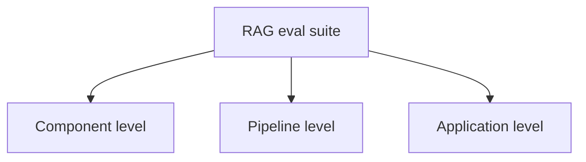
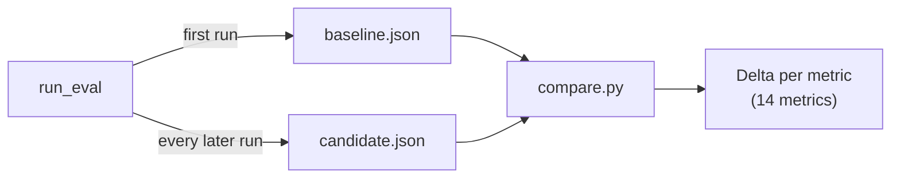
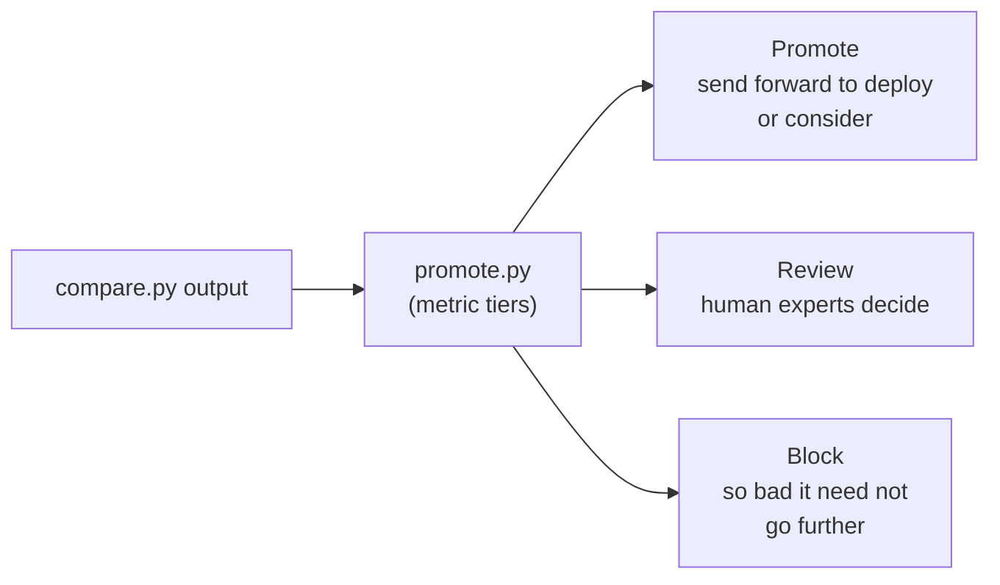

> **Video 18 of 19** · [Watch on YouTube](https://www.youtube.com/watch?v=Aov5QczE3Vo) · Translated from the
> Hindi transcript. Notes follow the video section by section, in its order.

With the RAG eval suite complete, this session ties it into one script so that after any change you can see, metric by metric, whether the application improved or quietly got worse.

## Recap: the RAG eval suite is built

The last five or six sessions went into RAG evals in detail, and all of that work fits into one diagram: a **RAG evaluation suite**, a bunch of evals that can evaluate any RAG application at three levels.



All three sets of evals are now built, and along the way around **14 different metrics** were explored: faithfulness, answer relevancy, the safety metrics and the operational metrics. So the whole suite can now be said, proudly, to be built.

Today's topic is **regression testing**: how to execute the entire suite from a single script and directly generate a summary of how the RAG application is currently performing, and whether the changes you made brought an improvement or broke something. After this, only one session remains in RAG evals, **online evals**, which takes the whole thing into a production setup.

## What regression means

The term comes from the word *regression*, whose plain English meaning is "returning to a previous, less advanced or worse state". If your system ends up in a worse state than before, that is regression, and testing for it is regression testing.

### The recall example

Suppose you have a working RAG application and at some point notice that **recall** is not good enough. Two common ways to improve recall are to **increase k** or to **add a reranker**. Say you do both. Recall improves, from 85% to 90%, which is good news.

But those changes, while improving one aspect, made other aspects **regress**: precision took a hit, contextual relevancy went down, or latency went up because of the reranker. You never measured any of that, because your whole focus was recall. Recall was bad, you fixed it, you were happy, and you deployed. Only after deployment did you realise that chasing recall had spoiled three or four other important aspects of the application, which can be very damaging.

So whenever you make any change to the system, you have to make sure the application still performs on **every** aspect the way it did before the change. Testing for that is regression testing. In practice: after any change (raising k, adding a reranker), you **rerun the whole suite of around 14 metrics**, compare the new values with the previous ones (the **baseline**), and conclude whether the change has taken the system backwards. Only if it has not do you move forward and deploy.

### Not a new idea

Regression testing is a very old concept from software, not something specific to LLM applications. When building websites, Android apps or desktop applications you bring in changes too: say you build v2 of an API, moving it from Flask to FastAPI. Once the new system is in place you test whether overall performance is better or worse than before. It is a software development concept that applies very well to LLM-based application development, which is why you should know it.

:::note Disclaimer from the session
The concept is explored here at a **conceptual** level. Everything is shown in code, but the procedure in a company may differ. The concepts, theory and idea are the same; the execution can differ. This session uses a bare-shell method where all the code is written by hand, whereas companies use dedicated regression-testing tools. Understanding the concept lets you adopt any tool.
:::

## The setup for the CampusX doubt solver

The RAG eval suite for the CampusX doubt solver currently contains three kinds of eval tests:

- **Quality evals:** the quality of the application, with metrics such as faithfulness, answer relevancy and contextual relevancy.
- **Safety evals:** toxicity, PII leakage, scope adherence.
- **Operations evals:** latency, cost and so on.

Right now these are all independent Python files. To run one eval you type its command and press enter; the operational, safety and quality evals each live in separate files, so running the suite means running every eval manually. The plan is to automate this with **one script** that, when run, executes all the evals in sequence and produces results for all 14 metrics by the end.

### The five steps

1. **Build the script.** Simple Python code that calls the other Python programs and executes them in sequence.
2. **Save a baseline.** The first time the script runs the whole suite, save the results for the 14 metrics somewhere, preferably a JSON file. This `baseline.json` captures the current state, and future runs are compared against it.
3. **Make changes.** Whatever you want to improve (recall, precision, latency), change the system accordingly: increase or decrease k, increase or decrease chunk size, change the model, change the system prompt.
4. **Rerun the script** on the new version of the software and save the new results as JSON too, in a file called `candidate.json`. Now there are two files, each holding results for the 14 metrics: one from before the changes and one from after.
5. **Compare** the two metric by metric (this metric was this much before, it is this much after) and conclude, individually, whether any metric has got worse.

These steps together are regression testing.

### run_eval and compare.py

In code this needs a runner script (call it `run_eval` or similar) that runs all the other evals, and a second Python script, `compare.py`.



`compare.py` takes both files as input and calculates a **delta** (a difference) for each of the 14 metrics. A negative delta means the metric's value dropped, so that metric has regressed.

## The two complexities

### 1. Not all metrics point the same way

For some metrics higher is better: faithfulness, recall, precision, where closer to 100 is better. For others lower is better: latency, cost, and (as seen earlier) toxicity. So for each metric you must store somewhere whether an increase is good or a decrease is good.

### 2. LLM judges are non-deterministic

Apart from the operational evals, most of the evals (quality and safety) are essentially **LLM-as-a-judge** under the hood, and LLMs are probabilistic. Run the pipeline once and precision comes out at 85.6; run it again without changing anything and there is a good chance it comes out 84.8. `compare.py` would simply report that precision regressed, yet nothing regressed, because nothing was changed. This non-deterministic behaviour of regression testing has to be suppressed somehow.

### Solving it with a noise threshold

Asked in the live class how to fix this, students suggested a **noise threshold** and taking the **variance**, which is the answer.

In reality the baseline is not created from a single run. In the same initial setup you run the whole pipeline **five to 10 times** without changing anything, which gives, for every metric, 10 values with a little variation among them. Take recall: measured 10 times in the same setup it comes out 90, then 90.8, then 89.7 and so on.

Calculate the **standard deviation** of those 10 values to see how much variability there is. To stay on the safe side, use **two standard deviations** as the noise threshold: if the standard deviation is 0.5, the threshold is 2 × 0.5 = 1. From then on, any change in recall smaller than 1 in future experiments is treated as **noise**, not regression.

Example: recall is 90. You change k from three to five, rerun the pipeline, and recall comes out 89.5. It dropped, but it lies inside the permissible range of ±1, so it is not regression; the drop comes from the noise inherent in the system because of the LLM judge. If instead it came out 87.5, that is outside the noise, and it is regression.

### The metric registry

So every metric needs two pieces of information:

1. Its **direction**: whether it is better when it goes up or when it goes down.
2. Its **noise threshold**, which could be 1 for one metric, 5 for another, more for a third.

This is stored in a third file, the **metric registry**. With these three files (the run pipeline, `compare.py` and the metric registry) regression testing can be done; conceptually no other machinery is needed.

:::warning Second disclaimer: tiny golden datasets
The golden datasets used in this course are really small (10, 5 or 15 entries), so the numbers vary a lot between runs. Quite literally, PII leakage can be 60% on one run and 80% on the next, as seen when the system was simply run again. As a dataset grows, the system becomes more stable.
:::

## Implementing it in the code base

Most of the code is already written and the focus is not on the code, but on seeing the whole thing in action. The changes are made to the existing code base step by step.

### Step 1: merge the operational evals into eval_ops

The `evals` folder holds the individual eval files. For operations there are three, built in the last class: `eval_reliability`, `eval_cost` and `eval_latency.py`. These three are merged into one file, **`eval_ops`**; running it runs all three operational evals together.

### Step 2: merge the safety evals into eval_safety

Safety also has three separate files: `eval_leakage`, `eval_toxicity` and `eval_scope` (which checks scope adherence). These are merged into one file, **`eval_safety`**.

Both merged files already exist. You may delete the individual operational and safety files and work only with the consolidated ones if you want cleaner code; both are kept here because the individual files make the code easier to understand, while the merged files serve regression testing.

### Step 3: refactor the quality evals

The quality evals are **not** merged into one file. There are four of them: `eval_retriever`, one for the generator, one for the whole pipeline, and one for the application (the one built first). Their only problem was that they were written to print their output in the terminal.

Each is refactored with the logic kept exactly the same: the procedural, line-by-line code is wrapped in a **`run` function**, and the file gets an `if __name__ == "__main__"` block. The file can now be run on its own, and another script can also call it and get it executed.

```python
def run():
    ...  # the same evaluation code as before


if __name__ == "__main__":
    run()
```

The same change is made in the generator, application and pipeline files.

### Step 4: harness.py

To tie the four quality eval files together so that they receive the **same input** and return output in **the same format** from the same place, there is a small harness, `harness.py` (written with Claude's help). Its only job is to standardise how these four quality evals are run; without it you could not send them the same input or extract their output in one standardised format.

### Step 5: run_suite.py, the main pipeline

The runner script is **`run_suite.py`**, the main pipeline. Whenever you want to do regression testing, you run this file. Behind the scenes it runs all the quality evals, then the safety evals, then the operational evals, and generates a complete report. On the first run it stores all results in `baseline.json`; on every subsequent run it stores them in `candidate.json`.

### Step 6: the metric registry file

The **metric registry** file solves the two complexities. Against every one of the 14 metrics it records the **direction** ("higher" meaning more is better, or lower) and the **noise tolerance**.

The noise tolerances came from running `run_suite.py` multiple times without changes. Ideally it should be run 10 times; here it was run only twice, because it takes time and costs money. In an ideal setup you run it 10 times without changing the code, calculate each metric's standard deviation from the 10 values, multiply by two, and write that number into the registry for each metric.

### Step 7: compare.py

Finally, `compare.py` picks up `baseline.json`, `candidate.json` and the metric registry, calculates each metric's delta, and reports which metrics **regressed**, which had **no change**, and which **improved**.

## Demo: running the suite after a chunk-size change

A `baseline.json` already exists, which is the baseline to compare against. There is also an old `candidate.json`, which is deleted so a fresh one can be generated.

### Making a change

In `retriever.py`, the chunk size and chunk overlap are reduced: the chunk size goes from 1500 to **500** and the overlap to **100**. The narrative: contextual relevancy was coming out very low, around 43–44%, and reducing chunk size is one way to raise it.

Because the chunk size changed, the **Chroma store** (the vector database) is deleted, so that all the embedding happens again from scratch.

### Running run_suite

From the `evals` folder, `run_suite` is run with an input note that gets logged: that the chunk size is now 500 and the overlap is now 100. As soon as it starts, the whole eval suite built over the last five sessions executes by itself, and when it finishes all metrics are logged to `candidate.json`.

It takes a while because 14–15 evaluations are running. First the pipeline is rebuilt, since the vector database was deleted and has to be created again, and then the evaluations run on top of it. The output shows **six evaluations** in total: retriever, generator, pipeline and application (four), then safety (fifth) and operations (sixth).

- The retriever eval finishes first: **recall 96**, **precision 90**.
- Next is the generator eval, tracking faithfulness and answer relevancy. It takes around 5 minutes.

### Questions while it runs

- **Direction as −1 and 1?** A student suggested encoding direction as −1 or 1 and multiplying it with the difference, giving a standard "higher is better" rule. That is the same thing the code does; −1 and 1 works too. To restate the registry: for every metric it holds whether the higher or lower side is good, and the noise threshold measured by running the baseline repeatedly with the help of the standard deviation. Both are needed at comparison time: to know whether a rise is good or bad (that is what makes regression visible) and whether the change is bigger than the noise.
- **How do you tell whether a bad answer came from retrieval or generation?** The metrics together tell you. If recall, precision and contextual relevancy are good but the answer is wrong, the generator is at fault. If the generator's metrics are fine but one of the retriever's metrics has moved, the retriever is at fault.
- **It takes time.** Yes; if this is integrated into CI, these tests take time to run. There is no hurry to deploy immediately; you can take time at deployment because you want only the best software to be deployed. Doing it properly is the priority, not how long it takes.
- **Online evals next.** Everything studied so far will be run in an online setup in the next session, which completes the coverage. Not covering online would cover only half the story: if you cannot do evaluation after deployment, there is no benefit.

### The last leg

The safety numbers come in, then the operational evals run: latency first, then cost, then reliability. The behaviour is exactly what earlier sessions showed; nothing new was built today. The evals were only stitched together into one automated script instead of being run individually.

A student called this **"CI in local"**, which is correct. Take the same thing to GitHub with GH Actions and you are performing CI. At a conceptual level, regression testing is part of CI in a proper production setup and is used within CI.

:::warning Evaluation itself costs money
Even with small datasets, one single execution of this pipeline costs somewhere around ₹25 to ₹30, maybe more. Imagine golden datasets with 50, 100 or 500 rows instead of 15. The evaluation process has its own cost, and you have to be smart about it too.
:::

**Can the metrics be combined into one composite score?** It depends on the application. If you are a domain expert who understands how your RAG application works, which quality metrics matter and how they relate, you might build a formula that assigns weights and gives one number for overall quality. In practice this is generally not done: the separate metrics exist because they describe different aspects of the application, and merging them into a single dimension is most likely not useful. It is a tempting idea.

The run finishes with all 14 metrics and their results displayed, and `candidate.json` appears alongside the baseline with exactly the same results logged.

## Demo: comparing candidate with baseline

Now the two files, the baseline (before) and `candidate.json` (after the change), are compared. The metric registry helps, because it says whether a number going up is good or bad and gives each noise threshold. `compare.py` is run with the input `all`, so it reports on every metric: improved, worse, or unchanged.

The result:

- **Most metrics are flat.** Whatever variation there is lies within the noise threshold, so it is treated as nothing.
- **Around four or five metrics improved.**
- **Two metrics regressed.** One is **contextual relevancy**, the very metric all this work was meant to improve: it went from around 45 to 38. The other is the **PII leakage** score, which also fell, and that is a very big regression.

Now you look at the whole report and decide whether the system has regressed. Sometimes it is obvious. Here a safety metric dropped a lot: if a safety metric falls by 20% after a change, that is a **big red flag** that the change is not good. Why would you compromise on safety? Contextual relevancy is also taking a hit. So the system is regressing on two metrics, though there is some improvement too.

At this point a **human** comes into the picture and decides whether the change is good or not. That is subjective and depends on the application. What regression testing gives you is the report showing which metrics went up and which went down after the change; that is its whole goal.

## promote.py: a small decision framework

One more small file, `promote.py`, holds a bit of decision-making code. It reads the report and produces a summary of whether to approve the new change.

Each metric is placed in a **tier**:

- a metric whose drop is simply not acceptable;
- a metric whose drop can be discussed (maybe the new version can still be deployed);
- a metric whose drop does not really matter.

On that basis it gives one of three verdicts:



The framework will vary from application to application, and it is not at all necessary; it was made only to reach a conclusion quickly about whether to make a change.

Running `promote.py` picks up the output of `compare.py` and gives a judgement: **block**, because a very important safety metric fell by 20%, so there is no point approving the change. Had the safety metric not dropped and only contextual relevancy fallen, the logic would put the change into **review**, and human experts would weigh a small drop in contextual relevancy against five improved metrics. Further tests would follow, and on that basis you would decide, upgrade the version and deploy.

That is not the goal here, though. The goal is that after any change you have a complete report in front of you: which metrics are taking a hit, which are improving and which are flat.

## Tools, and how far this topic goes

In practice this is generally done with software. The LLMOps course (taught by Himanshu) covers the same concept with **MLflow**; another team might use **Confident AI** or some other tool. Here it was shown through hand-written code to plant the concept, which stays the same: computing the noise threshold, building a decision-making framework, computing baselines multiple times. The only difference is that tools are more sophisticated, and obviously much better.

That is regression testing in practice, and this is as much coverage as the topic gets. It is related to LLM evals but does not directly belong to it, because no new evaluation is learned here; the aim was a high-level overview of how the work done so far is tied up and used in a proper production setup.

This was a short, one-hour class. Online evals were kept for a separate session because they need a proper two hours, and a three-hour class was not wanted. So this class gave a **flavour** of regression testing: what it is, why it matters, and how it is implemented in an eval setup.

## Closing question: computing the noise threshold properly

A student checked that the values used to calculate the standard deviation for the noise threshold all come from runs where every parameter value is the same. That is correct.

Here the suite was run only twice. On an actual project in a company, run it at least **five to 10 times** to get the standard deviation. Done properly, more statistics comes in: p-values, whether a change is statistically significant, standard deviation, hypothesis testing. It is a big field. Imagine a very large-scale system like ChatGPT: after any improvement you have to prove the whole system has not regressed, and only when you are sure do you deploy. Where crores and billions of rupees are at stake, regression testing is a critical part, and all those statistics concepts are used to deal with the uncertainty. A lot of study and many experts are needed there. This session took it only to a surface level, enough to crack interviews.
