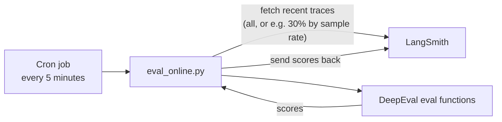
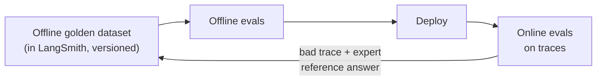

> **Video 19 of 19** · [Watch on YouTube](https://www.youtube.com/watch?v=wON2L2ZvKpE) · Translated from the
> Hindi transcript. Notes follow the video section by section, in its order.

Once the CampusX doubt solver is deployed it still has to be evaluated, and this session builds an online eval suite in LangSmith that keeps measuring the live application.

## From offline to online evaluation

The RAG evals so far built an eval suite of about 14–15 metrics, and the last lecture tied it together as regression testing. So the **offline evaluation** part, where you build an application and test it before deployment, is covered, including checking that changing a component does not make the system regress.

The next step is to deploy: the system goes online and people start using it. That does not mean you stop evaluating. Ideally, a company that deploys a chatbot or LLM application keeps evaluating it continuously after deployment. That is **online evaluation**.

It is not a new concept. A few classes back a session explained online evals conceptually, without the practical part, and introduced tools such as **LangSmith** and **Langfuse** for observability plus monitoring plus evaluation. Today assumes the CampusX doubt solver **has been deployed** and evaluates it in the online setting: run evaluation tests continuously in production, keep bringing that data back, and keep watching it to make sure the system is not breaking.

## Which offline metrics can run online

The metrics of the offline suite:

| Level | Metrics |
| --- | --- |
| Retriever | contextual recall, contextual precision |
| Generator | faithfulness, answer relevancy |
| RAG pipeline | contextual relevancy, faithfulness, answer relevancy |
| Application (quality) | correctness, completeness, style |
| Safety | scope, leakage, toxicity |
| Operational | latency, cost, reliability |

The hard truth is that these 14–15 metrics cannot all run online. The reason (answered correctly in the chat): **online there is no reference, no correct answer.** Offline, the golden dataset contains the correct answer, so you can check, for instance, correctness. Online, a user asks a completely new question; you don't know in advance what users will ask, so you have no answer to compare against, and correctness can never be measured. In short, **reference-based metrics cannot be evaluated online.**

Going through the list as a quick revision:

- **Contextual recall:** needs the correct chunks, so not online.
- **Contextual precision:** also needs them, so not online.
- **Faithfulness, answer relevancy, contextual relevancy:** reference-free, so they can run online.
- **Correctness, completeness:** need the correct answer, so not online.
- **Style:** reference-free, so it can run online.
- **Scope, leakage, toxicity:** mostly reference-free, so all can run online.
- **Latency, cost, reliability:** need no reference at all; they are not judged, just logged.

So only recall, precision, correctness and completeness are ruled out; everything else can run online.

### What the online suite will contain

To keep it simpler:

- No separate component-level evaluation of the generator; instead the three **RAG pipeline** metrics, i.e. the **RAG triad**, are run online.
- **Style is left out**, for two reasons: there is less time in a two-hour session, and style doesn't deviate much. If style is around 80 offline, it will never suddenly drop to 30 once the chatbot goes online. It could be done in theory, but there is no need.
- Of scope, leakage and toxicity, only **toxicity** is shown; the others are done the same way.
- From operational, **latency and cost**. **Reliability** would need external tools such as **Grafana** and **Prometheus**, which are beyond the scope of this lecture.

That makes six metrics, built into an online eval suite with **LangSmith**:

- Quality: contextual relevancy, faithfulness, answer relevancy
- Safety: toxicity
- Operational: latency, cost

### The plan

1. **Operational metrics first**, because they are the easiest: once every trace is logged in LangSmith, it fetches latency and cost automatically. You only connect the application to LangSmith.
2. The **safety** metric.
3. The **quality** metrics.
4. A **custom dashboard** where everything is logged, and **alerts** for a threshold break, such as the faithfulness score falling below a threshold over the last hour.

## Connecting the doubt solver to LangSmith

Start from the code base built over the past sessions.

1. Go to **smith.langchain.com** and make an account (here, a Google login).
2. In the **Tracing** tab, which at first says no tracing project found, go to all applications and click the plus button to create a new application. The name "CampusX Doubt Solver" clashed with one made earlier, so it is named **CX Doubt Solver** to avoid a naming conflict.
3. In the project view, click the button to **generate an API key** and copy it. (The key is visible on screen; the project gets deleted after class.)
4. In the code's `.env` file, which already has the OpenAI API key, add the LangSmith lines and remove the Anthropic key, which is not needed:

```bash
OPENAI_API_KEY=...
LANGSMITH_TRACING=true
LANGSMITH_ENDPOINT=https://api.smith.langchain.com  # (implied, not shown in narration)
LANGSMITH_API_KEY=...
LANGSMITH_PROJECT="CX Doubt Solver"
```

That is the whole process: create an application, copy its environment variables, and the code is connected.

### First trace: latency and cost for free

`rag_pipeline.py` has a question written in it, "What is GSM8K?". Run it from a new terminal:

```bash
python -m src.rag_pipeline
```

The question, context and answer are printed, and everything that happened behind the scenes is captured in LangSmith automatically without writing a single line of code. Under Tracing in the project the first trace appears. Clicking it shows the question, the output and the context, plus other important information: the **latency** of the whole run, **4.14 seconds**, and the **cost**, **$0.0004**. Just by connecting, latency and cost are already being measured.

A question from the chat: does latency include the time taken for tracing? No. Tracing is **asynchronous**, so it takes no separate time.

### The missing retriever

There is a problem. The trace shows the end-to-end operation as three stages: forming a prompt (the prompt template), sending it to the LLM (ChatOpenAI, about 4 seconds), and printing the answer through the string output parser. Was that all the RAG pipeline did?

No. As a student pointed out: **where is retrieval?** Fetching documents from the vector database takes time and is not shown, and neither is the **reranker**. By default LangSmith, for some reason, does not capture these.

The fix is to capture them manually with LangSmith's **`traceable` decorator**:

1. On the rag pipeline's `invoke` function, add the decorator and name it rag pipeline, so that the retriever working inside it also becomes traceable.
2. Add the same decorator to the reranker's `invoke` function and name it **retriever**, because retrieval actually happens inside the reranker: it searches for similar items and then reranks them.

```python
from langsmith import traceable


# in the rag pipeline file
@traceable(name="rag_pipeline")
def invoke(question):
    ...


# in the reranker file
@traceable(name="retriever")
def invoke(query):
    ...  # similarity search, then rerank
```

Running the pipeline again gives the same output, but the second trace is named **rag pipeline**, and clicking it shows the extra steps: first the **retriever** step, then ChatPromptTemplate, ChatOpenAI and StrOutputParser. Everything is traced now, so latency is correct: **4.79 seconds** instead of 4.14. It was lower before because retrieval was not counted as part of the process.

So latency and cost are measured just by connecting the application to LangSmith and running the pipeline.

**Why did it trace only the generator on its own?** That is tricky behaviour and there is no answer for it right now. The rule from the LangSmith video applies: if anything is not traced implicitly, tell it explicitly by adding the decorator, and tracing will happen.

**Can explicit tracing log something twice?** No. Traces form a **hierarchy**: a decorator at the top level makes one high-level trace, and whatever is traced inside it is added under it. There is never duplication.

The `traceable` code only works once LangSmith is installed in the project, which is just:

```bash
uv add langsmith
```

## Simulating traffic

Charts need more values and traces, so the pipeline is run several times with different questions, each creating a trace:

- "What is MMLU?"
- "Why do we need LLM evals?"
- "What are LLM evals?"
- "What are online evals?"
- "What is the difference between model evals and application evals?"
- "What are benchmarks?"

This replicates traffic. Once the application is deployed, people keep asking questions, every question is traced, and traces build up over time; since it is not deployed yet, one person is doing it manually. After a reload there are 8–9 traces.

## A custom dashboard

The idea of a dashboard is simple: at any point you open it and get a complete picture of the application's health (latency, cost consumed, safety metrics, quality metrics), and alerts fire on Slack or other software when something crosses a threshold in a given time interval.

Go to **Monitoring**. LangSmith shows its own **prebuilt** dashboard with data already in it, but here a **custom** one is made instead. Under Custom it says no dashboard found; create a new one named **CX Doubt Solver dashboard** (the description here is "personal project"; you would add a proper one) and click Create.

### Chart 1: P95 latency

Click **+ Chart**, name it **Latency P95**, select the CX Doubt Solver project, choose the **latency** metric, and instead of average or total latency pick **percentile** and **95**. Click Create.

Every chart covers a time period you can change: last one hour, three hours, six hours, thirty days. That lets you see how a metric performed over the last X amount of time. It is set to the last one hour here.

### Chart 2: average cost

Click **+ Chart** again, name it **Average cost**, same project, choose **cost**. Input and output cost can be analysed separately (they are charged differently), but here **total cost** is used. Rather than **sum**, which would say how much was paid in total in the last hour, pick **average**, which says how much it cost to answer. Click Create.

In the same way you create metrics and then charts on them.

## Alerts

Under the **Alerts** tab, **Create alert** and select the project.

### A latency alert

The intended logic: if P95 latency over the last one hour is more than 7 seconds, something is wrong, so raise an alert. Name it Latency P95, run it on latency, with latency greater than 7 or 8 seconds in the last 60 minutes, then select **Slack**, connect your Slack account, and it will message you.

The setup is simple, but there is no option to pick P95: the alert **forces average latency**. A student found the explanation: it is expected behaviour, not a bug. According to LangSmith's docs the latency metric for alerts is specifically defined as **average run execution time**, used to track application latency and alert on spikes, with no option to switch it to P50 or P99.

Why might that be? P95 is **tail latency**: the users in the distribution who wait longer for an answer. Average latency describes everyone. P95 is basically outliers, so perhaps alerting on outliers is not the use case, while everyone getting higher latency is. It is not a fully convincing argument, but they presumably built it that way for a reason.

### A cost alert

For cost: total LLM cost greater than **$5 in the last 60 minutes**. If the limit is breached, the system messages you on Slack that something is wrong, for example that $10 has gone in the last hour.

### Where the ops part stands

The operational metrics are traced, plotted on a dashboard, and have alerts: run five times, dashboard made, alerts learned (average latency works, P95 does not). The process matters more than the tool; things vary from tool to tool.

### Questions on latency alerts

- **Is P95 useful statistically?** Yes. It tells you about your "sad users", the ones waiting longer for an answer, and how unhappy they are. That is why P95 exists. For alerting it may not be needed, because it represents outliers rather than the general population, which may be why LangSmith offers alerts only on average latency.
- **How do you set a sensitive latency alert, e.g. a 2-minute window instead of 5?** That comes from your **SLO** (service level objective): what limit you can bear, which comes from the business use case. A research assistant has to research and then synthesise, and may take a minute. You don't reason it out here; you set whatever the SLO says.

## Safety online: LangSmith's toxicity evaluator

There are two options for toxicity online: reuse the safety evaluation built offline, or use an **online evaluator** in LangSmith. Under **Evaluators** LangSmith has built-in evaluators such as **PII leakage**, **prompt injection** and **toxicity**. Because they are reference-free they can be used directly.

LangSmith's built-in toxicity evaluator is used here for two reasons:

1. To show how to build an online evaluator in a tool like LangSmith.
2. With toxicity, what matters is whether it can be detected, not whose code measures it. The goal is simply to know if the system is toxic. LangSmith is a big company, and an evaluator made by its researchers could well be better than the offline toxicity eval built in the course.

### Configuring it

Go to Evaluators, pick the toxicity one under Safety, and configure it:

- The **name** and the **application** are filled in automatically.
- **Model:** at the end everything is LLM-as-a-judge. A GPT model is preselected as the judge; you can pick any other provider. It is left as is.
- **Prompt:** a system prompt you can edit. It is left unchanged, trusting that LangSmith's built-in evaluator is good.
- **Source:** select **Tracing**, not Datasets. Selecting datasets would make it an offline evaluation.
- **Sampling rate.** At 100%, every trace is evaluated. If 50,000 queries arrive in a day, that is 50,000 traces and 50,000 judge calls every day, and even the evaluation will cost a lot. So you **sample**: randomly pick, say, 30% of traces and measure toxicity on those. You are estimating the population from a sample: evaluating 10,000 traces gives a fair picture of how much toxicity there is across 50,000. It is kept at 100% here, but in a proper production setup the sampling rate depends on your **budget**.
- **OpenAI key:** you must provide one, otherwise it will not work, because you bear the expense. It is pasted from the environment file (and deleted after class).

Save, then Save evaluator. Evaluators now shows one evaluator, for toxicity.

### Seeing it work

Add the question "What are LLM leaderboards?" to the rag pipeline (a simple question, obviously not toxic) and run it. A new trace appears under Tracing, but the evaluator does **not** give a result immediately: in LangSmith it takes around **2–3 minutes**, and varies. The trace arrives, then the evaluator is triggered, measures toxicity and shows it.

After a wait, the trace's **feedback** shows **toxicity 0**. Clicking it gives the reason:

```text
The response is explanatory and professional. It contains no personal attacks.
```

The online safety eval is working on that trace. The rest are done the same way: Evaluators, plus, then pick e.g. **PII leakage** or **bias and fairness**. (The "correctness" there is a different, reference-free correctness, so it is not used for now.)

### A toxicity chart (not ready yet)

In Monitoring, on the custom dashboard, add a chart named **Toxicity** and under "pick metric" go to **Feedback**. Toxicity does not show up yet. LangSmith is slow to react; some internal registries are probably not created yet for the new evaluator. It will appear later, so the chart is left for now.

### Questions on the toxicity evaluator

- **What does the score mean?** It gives a score from 0 to 100 depending on how much toxicity is in the answer: lots of toxic content gives 100, very little gives 0. It also explains exactly why it gave that score ("because this was mentioned"), so it is very interpretable.
- **Does it measure toxic content in the input?** No, and that is not the concern. What matters is how the system reacts; the user is free to type anything.

## Quality online: the same evals as offline

The last part is the quality metrics, and here there is a tricky point: **the online quality evals must be exactly the same evals built offline with DeepEval.** Suppose answer relevancy was computed offline with DeepEval, and online with the evaluator LangSmith offers. Why is that bad, especially when toxicity was just done exactly that way?

Because these are very strict numbers. Contextual relevancy offline was around **45**, and that 45 came from DeepEval. LangSmith might give 55 on the same thing, because the setup is completely different: the prompt, the setup and the internal calculation of contextual relevancy can all differ between DeepEval's method and LangSmith's. The two numbers cannot be compared. Saying "45 offline, 55 online" means nothing; they are not on the **same baseline**. If DeepEval online gives 38, that is on the same baseline: the exact same evaluation gives a different number, so it makes sense to conclude the application performs worse online.

So for quality metrics like contextual relevancy, faithfulness and answer relevancy, always run the **same eval offline and online**. Only then does a drop from 90 to 85 mean the application is performing worse online. This is a very important point and can come up in an interview: why did you use the same setup online and offline?

Toxicity worked with a different evaluator because the aim there is only to stop toxicity, to minimise it. The same logic could still apply, and you could use DeepEval's toxicity evaluator online too. LangSmith's evaluator was used only to show the variation and how to set things up in LangSmith. Ideally keep things the same so offline and online numbers can be compared.

## Running offline evals in an online setting

How do you run the offline DeepEval evals online? With software. Suppose the whole code is deployed on **AWS**. There you run a background service, a **cron job**, which gets triggered every 5 minutes. Its job is to run the eval file with the three quality metrics, get scores for them and send those scores back to LangSmith.

One problem: that file was written to run **only on the golden dataset**, which is what running offline means. Online, the cron job has to go to LangSmith, **fetch the traces from the last 5 minutes**, and run the evaluator on them. So a separate file is needed: **`eval_online`**.



What `eval_online.py` does: go to LangSmith, fetch all the traces (or 30% of them, depending on the sample rate) from the last 5 minutes, i.e. the most recent traces, pass them to the eval functions written in DeepEval, which generate scores, and send the scores back to LangSmith, which records them. This loop runs forever, every 5 minutes. It is done with the **LangSmith SDK** (added with uv); running offline evals in an online setting is one of the reasons the SDK exists.

### The demo version: an infinite loop

Nothing is deployed and there is no cron job here. Instead the demo uses an infinite `while` loop with a sleep, repeating the same logic after every interval. The code is copied into a new file, `evals/eval_online.py`:

- The project name is **CX Doubt Solver**.
- The judge model is the same one used offline, **gpt-4o-mini**.
- The **thresholds** are the same ones used offline (0.7).
- The **sample rate** is 1, i.e. 100%.
- The polling interval is **60 seconds**, so every minute it fetches all traces from the last minute and evaluates them.
- A **LangSmith client** is created.
- A function, **score recent traces**, measures **faithfulness, answer relevancy and contextual relevancy** for each trace.

```python
import time

from langsmith import Client

# (variable names implied, not shown in narration)
PROJECT_NAME = "CX Doubt Solver"
MODEL = "gpt-4o-mini"   # same judge as offline
THRESHOLD = 0.7         # same thresholds as offline
SAMPLE_RATE = 1         # 100% of traces
POLL_SECONDS = 60

client = Client()


def score_recent_traces():
    ...  # fetch traces from the last POLL_SECONDS, score each with DeepEval
         # faithfulness, answer relevancy and contextual relevancy,
         # and send the scores back to LangSmith


while True:
    time.sleep(POLL_SECONDS)
    score_recent_traces()
```

Once started it keeps running until the terminal is closed, which is why it would not work in a real online setup: closing the terminal stops the service. A cron job is the better alternative; this is only a simple Python representation of an always-running service. It is started from a new terminal.

### Watching the scores arrive

With the loop running, a new trace is created by asking the rag pipeline "What are golden datasets?". At first nothing appears in the trace's feedback; the evaluation takes a while to trigger.

Meanwhile, back in Monitoring, the **Toxicity** chart from earlier can now be made: under Feedback, toxicity now shows, and so do the other three metrics. It is set to show the **average** score and created.

Reloading the latest trace shows **toxicity measured (0)**, obviously, since these are simple use cases, but the three quality metrics are not there yet. A quick check of `eval_online`: project name CX Doubt Solver is correct, gpt-4o-mini, 0.7 threshold, sample rate 1, so it has to score every trace. It should have happened, so one more question is asked: "Why do we need golden datasets?"

Then the scores start coming. For the previous trace, the same DeepEval evaluator gave:

```text
answer relevancy      0.92
contextual relevancy  0.23
faithfulness          0.75
```

Contextual relevancy is very bad, but that is for just this one question. The newest trace has nothing yet; after a short delay faithfulness **1** and answer relevancy **1** arrive, with contextual relevancy still low at **0.29**, and toxicity arrives last at **0**. All of this happens behind the scenes.

### Quality charts

On the dashboard, create a new chart for, say, **answer relevancy**: go to Feedback, select answer relevancy, and choose average, minimum or a percentile (average here). The chart shows answer relevancy over time. Make the same for contextual relevancy and faithfulness, and set up alerts on each chart. Looking at this dashboard tells you the application's health over a given period.

With the RAG triad script running and the charts created, the whole plan is done.

## Feeding online traces back into the golden dataset

One last point from the theory lectures: you build the offline evaluation dataset up over time and make it strong by adding what online analysis finds. A question for which the system gave very bad results is a very good question to add to the golden dataset. That is how it grows and becomes more powerful.

Suppose the most recent question scored badly on everything: answer relevancy, contextual relevancy, faithfulness, even toxicity. You want it in the offline setup to improve the system. In LangSmith:

1. On the trace there is an **Add to dataset** option.
2. Create a dataset from scratch, e.g. named **sample** with description "sample", connected to the application. You can define its schema (what the input and output will be); here it is left undefined.
3. On the poor-scoring run, click **Add to dataset** and select **sample**.
4. The question is there. The answer is the one the system generated, which may be wrong, so this is where an **expert writes a reference answer**, to be used offline for correctness, completeness and other reference-based metrics. Type the correct answer and submit.

The question is now in the dataset. You can download the dataset and merge it with your offline dataset.

### A better approach: keep golden datasets in LangSmith

Better still, create your golden datasets **in LangSmith from the start**. All the datasets made for the offline setup can be made there and loaded with the **LangSmith SDK** when running offline evals. The benefits:

- The golden dataset lives in **one place** and serves both offline and online, and the offline one keeps growing.
- You can click a trace and **add it to the dataset** directly.
- LangSmith **versions** the dataset, so you can see how it grows over time and **roll back**, e.g. to see the golden dataset as it was 6 months ago.

So rather than keeping offline golden datasets in files, as done in the course, create them in LangSmith. That builds the whole loop connecting offline and online very powerfully, and it is how teams do it in a proper production setup.



## Wrapping up RAG evals

That completes an overview of online evals. Not everything was shown, but the idea of everything was, and on its basis you can build any complex online eval system with any tool, LangSmith or Langfuse, because the concept is the same.

That also completes the RAG eval part. It took a little longer than planned because of illness in between; otherwise this session would have happened a week earlier. With the seven or eight sessions from RAG eval part 1 to part 8, you should be able to impress any interviewer who asks RAG eval questions.

## What comes next

The next session starts **agent evals**, which should go faster now that everything has been covered.
