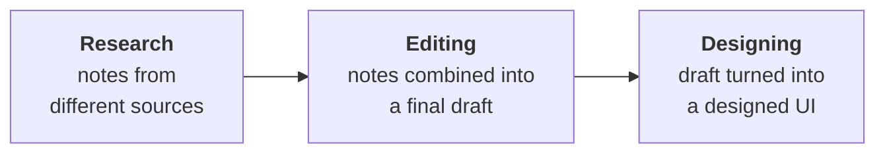
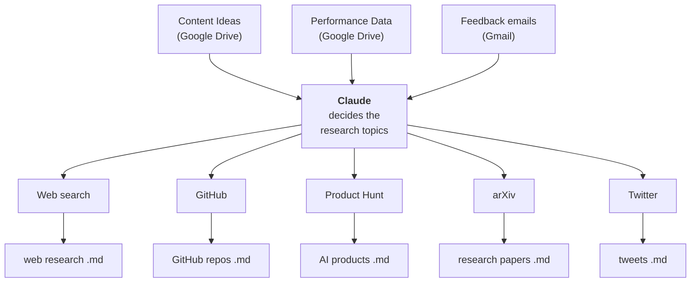

> **Video 1 of 8** · [Watch on YouTube](https://www.youtube.com/watch?v=3_TN1i3MTEU) · Translated from the
> Hindi transcript. Notes follow the video section by section, in its order.

Before the theory begins, this video solves a real CampusX problem with MCP, building an AI newsletter end to end, to show how much MCP makes possible with very little code.

## Why this video is different

For the last two or three months, the most requested topic on the channel has been **MCP, the Model Context Protocol**. Almost every video drew a comment asking to drop everything else and cover MCP, and more requests arrived on LinkedIn and by mail.

The delay came from wanting to research a topic thoroughly before teaching it, while being busy with the LangGraph playlist and with running CampusX. In the last three or four weeks there was time to read and research MCP, and that research produced a detailed curriculum and enough background to teach it.

## The plan: the MCP Trilogy

MCP gets a small mini playlist of **three videos**, and only three:

1. **The Why.** Why MCP came into the picture and exactly what problem it solves.
2. **The What.** How MCP works at the architecture level: what MCP servers, clients and hosts are, and how they interact with each other.
3. **The How.** Practical work in code: solving use cases and learning to implement MCP in your own project.

Because there are three videos, the playlist gets a fancy name: **"The MCP Trilogy"**.

Before starting those three information-dense videos, the aim here is to **inspire** you, because a teacher's responsibility is not only to teach but also to inspire. So this video solves a problem with MCP in front of you; once you see a big problem being solved easily, you will want to study the next three videos more deeply. The project took six or seven days of time and effort, it was built with MCP, and it solves a problem CampusX was actually facing. That is why this video is called **"The Trailer"**.

## The problem statement: keeping up with AI

The problem is a very common one that everyone can relate to. AI is growing at a very rapid pace: new products, new libraries and new research papers arrive every day. That makes it very hard for anyone who wants to learn AI completely and master it. If you make a roadmap to become an expert in AI in the next six months, within one or two months many of its topics can become obsolete while new ones appear.

Students face this, and so do teachers, even after six or seven years in the domain. A common question is: how do you stay up to date with developments in AI? Honestly, keeping up with the pace of AI is incredibly difficult for everyone. But a few small habits help to stay in the loop, and one that has really helped over the last three years is **newsletters**.

Since ChatGPT was released, the habit has been to subscribe to multiple AI newsletters (one example is **The Neuron**). They arrive by mail daily from different companies, and at least one gets read every night before sleeping. That at least ensures some awareness of the important developments.

## The idea: a CampusX AI newsletter, automated with MCP

Thinking about how to help students with this problem led to an idea: what if CampusX started its **own AI newsletter**? The biggest obstacle is the work involved. You have to do a lot of research every day, then write it well because it goes to so many people, and then design it. With a tight time constraint, the idea sat unexecuted for three or four months.

Then, three weeks ago, reading about MCP and realising its powers raised the question: what if the newsletter problem were solved with MCP? The last three days went into exactly that and nothing else. The problem statement: make a newsletter with the help of AI and MCP, where the **research**, the **content creation** and the **design** are all done by AI. The whole newsletter process is automated, so that a good newsletter can reach students regularly. That solution now exists on the machine, and the rest of the video shows how it was executed step by step.

## Step 1: what the newsletter will look like

Before anything else, the most important step is to have a clear picture of what the CampusX newsletter will contain. With a copy and pen, and after studying many other newsletters, the structure came out as **nine sections**:

1. **Introduction.** A short paragraph telling the reader what to expect, building a little curiosity so they want to read on.
2. **Big Story of the Week.** A single news item that shook the whole AI world.
3. **Quick updates.** Three to five news items that are less important but still worth knowing.
4. **Top research papers of the week**, with a summary and a download link for each.
5. **GitHub repos.** Big companies do a lot of open-source work and keep releasing repos, so the top AI-related repositories of the week are listed.
6. **A small tutorial** you can read in five minutes and still benefit from.
7. **Top AI products** of the week, described crisply, since new AI products arrive daily.
8. **Most popular tweets** on X, to give an idea of what leading personalities are talking about.
9. **Closing notes** that summarise the newsletter and give a teaser for the next one.

This is not claimed to be the best structure, but it is a good starting point. Visualising the newsletter first matters most, because once it is clear, the rest of the work gets easier.

## Step 2: the process of making the newsletter

Since AI is doing the work, the exact steps have to be clear. Thinking it through gives **three stages**:

1. **Research.** The chatbot goes to different sources and researches according to a prompt that says what to search and on what basis. For each piece of research it prepares a note.
2. **Editing.** All those notes from the different sources are gathered and edited into a final draft.
3. **Designing.** The draft is converted into a properly designed UI so that it looks good.



## The toolbox

**The main AI is Claude**, which does all the heavy lifting. Claude was chosen because MCP came from Claude's side, from **Anthropic**, so it seemed the most capable chatbot for this process. ChatGPT did not have as many integrations or MCP support, and the others seemed to lag a little, whereas Claude had very strong MCP support.

Around six or seven **tools** are used to build the newsletter: a tool for **Git**, one for **web search**, one for **Google Drive**, one for **arXiv** (where research papers are published), one for **Gmail**, one for **Product Hunt** (where AI products are launched), and one or two more. Claude was connected to all these tools **through MCP**.

At this point it may not seem meaningful to say that MCP is needed to connect a tool to an AI, but that is exactly what the next three videos set out to understand. For now: there is a main AI, Claude, it has been given the capability of many tools, and the connection between the AI and the tools is made through MCP.

## Phase 1: research

The research phase does two things: it works out **which topics** to research, and then it **researches** them.

### Part one: deciding what to research

Claude gets a very detailed prompt with instructions. First, it has to go to the Google Drive account and fetch two files:

- **Content Ideas**: a list of topics, written in advance, around which the newsletter can be published.
- **Performance Data**: dummy data telling Claude how past newsletters did with the audience: the date sent, the subject, the **open rate**, the **click rate** and the **average read time**. This data would come from a tool like **Mailchimp**, used to send newsletters. There is no real data yet, since the first newsletter has not gone out, but in future there will be. Claude is being trained into the habit now of checking the content ideas and past performance before researching.

Claude is also given access to email, with the instruction to study all the **feedback mails** received and use them too in deciding what goes into the next newsletter.

So the research topics are decided from three things: the **Content Ideas** file, the **Performance Data** file, and the **feedback emails**.

### Part two: researching in five places

Once Claude knows which topics to research, it goes to **five different places**:

1. **Web search**, to fetch the most interesting and most important news on those topics, which feeds the first section of the newsletter.
2. **GitHub**, to find trending repositories.
3. **Product Hunt**, to find the products trending in the last week.
4. **arXiv**, to fetch trending research papers.
5. **Twitter**, to find what leading personalities are talking about.

Each place produces one note: a markdown file with the research for that source written in detail. So the research phase ends with **five markdown files**.



## Phase 2: editing

With five research documents on the desktop, the next job is a final draft of the newsletter. Claude gets another prompt: read all the documents, then go to Google Drive, where a **sample newsletter** has been prepared. The sample has exactly the structure described earlier: intro, Big Story of the Week, Quick Updates, Top Research Papers, Top GitHub Repos, Learning Blog of the Week, Top AI Products, Top Tweets of the Week and a Closing Note.

The instruction: pick up all the research documents from the desktop, look at the Drive to see what the final newsletter should look like, and convert the research into a **final draft** in that format. (The slide says "insights" here by mistake; it should say "final draft".) The final draft is saved back on the desktop in the same folder, and the editing phase is complete.

## Phase 3: designing

Claude gets a third prompt with two things: go to the desktop and fetch the final draft document, and a **design specification** describing how the newsletter's UI should look. Claude designs the draft to that UI **as an HTML page**. Newsletters can be designed in different ways, and an HTML page is one of the options. The design comes from the specification and the content comes from the final draft. The HTML file is saved in the same desktop folder.

Once the HTML file exists, the work is finished: go to a tool like Mailchimp and mail that HTML page to all the contacts. That is the entire flow. Now for the practical: the whole newsletter in **three prompts**.

## The setup in Claude Desktop

Claude Desktop is installed on the machine. Clicking the tools icon lists all the MCP tools currently available: **web search**, **Drive search**, **Gmail search**, and **calendar search** (which could find when the next newsletter is due). There is also **Canva**, which could do the design, but HTML design gave better results, so Canva is not used. There is also **arXiv**, control of the **local file system**, **GitHub**, **Notion**, **Product Hunt** and **Twitter**.

There are three prompts ready: one each for the research, editing and designing phases.

### A quick demo: checking the calendar

First, a quick look at how Claude Desktop communicates with an MCP server. The prompt: *"Can you check my calendar and tell me when do I have to send my next AI newsletter?"* Claude uses the calendar tool, which was linked with Claude Desktop earlier, and answers:

```text
Based on your calendar, you have an event scheduled for your next AI
newsletter on Monday, September 1st, 2025, 8:00 PM.
```

The calendar really does have a dummy event, "Next AI newsletter", on 1 September, and Claude can read it. So the newsletter has to be made and sent on the 1st.

## Running the research prompt

The research prompt is very long. It opens:

> You are an AI newsletter research agent. Your task is to generate fresh newsletter content by combining past performance insights, content ideas, audience feedback and community trends. Follow the instructions carefully.

It then tells Claude to read the two files from Google Drive and check the recent mails; part B is to go to arXiv, find research papers and store them in a given format in a given file; part three is research on GitHub, stored in a given format; part four is Product Hunt; part five is Twitter. At the end, all the files are saved on the desktop.

There is nothing to do except copy the whole prompt, paste it into Claude, hit enter, and watch:

1. **Reading source files from Google Drive.** Claude finds a folder called **"AI Newsletter Demo"** and sees three files in it: *Sample Newsletter*, *AI Newsletter Performance* and *AI Newsletter Content Ideas*. It fetches and reads the two it needs.
2. **Email feedback.** It searches the email and finds four results, the same feedback mails shown earlier.
3. **Analysis.** From these three sources it decides what to research. The top-performing topics, according to the dummy data, are AI in healthcare and finance, the OpenAI vs Anthropic competition, Llama 3.2 and AI hardware, and open-source LLMs. It also shows a user-feedback summary from the mails and defines its research focus areas.
4. **Part A, web research.** It searches the internet and saves what it finds to a file through the local file system, asking permission first. Allowed. Behind the scenes it creates a directory and writes the research into a file inside it; you can watch it being written.
5. **arXiv.** Allowed; it searches for research papers, completes the research and saves the results to a file.
6. **Git.** Claude seems intelligent enough to run these researches **in parallel**: while one branch is being worked on, work on another starts alongside. That is an observation and may not be right. Part C searches repositories and creates a file for them.
7. **Product Hunt**, part four, then **Twitter**, the last branch.

Finally Claude reports:

```text
I have successfully completed the AI newsletter research for your
September 1st deadline.
```

with a summary of everything.

On the desktop there really is a folder called **"AI Newsletter"** with **five files**:

- **Web research**: the Big Story of the Week with its headline, summary and a link to read more, plus three or four Quick Updates.
- **Research papers**: different papers with their description and possible impact.
- **Git repos**: the top four or five repos of the week, with their stars, description and GitHub link.
- **AI products of the week**: five products.
- **Top tweets**: five tweets.

The research phase is complete.

## Running the editing prompt

The editing prompt is very simple:

> You are an AI newsletter assembly agent. Your task is to create this week's AI newsletter using the research material and the sample template [on Google Drive]. Follow the key instructions carefully.

Its instructions:

1. **Read the source research files**: the five files in the desktop folder.
2. **Read the sample newsletter template**: go to Google Drive, enter the AI Newsletter folder and read the sample file.
3. **Generate the newsletter** from these two: *"Populate each section with the latest research results from the five markdown files. Ensure smooth transitions, clear section headers and an engaging editorial tone."* For each item it lists what to add.
4. **Output**: generate a markdown file with a given name and save it back to the same desktop folder.

Pasted into Claude Desktop, it runs: "Reading research files", then going to the Drive for the sample, "Fetching files", and you can open the file to watch it being written. Then: **"Newsletter assembly complete."**

On the desktop is the newsletter draft: the intro, Big Story of the Week, Quick Updates, Top Research Papers, Top GitHub Repos, a **Learning Corner of the Week** (a small mini-tutorial you can read in a minute), Top AI Products of the Week, Top Tweets of the Week and Closing Notes. The final draft is ready; only the design remains.

## Running the designing prompt

The designing prompt:

> You are an email template builder agent. Convert my finalized weekly newsletter markdown into a production-ready HTML email with solid design and compatibility across major email clients.

- **Input**: go to the AI Newsletter folder on the desktop and read the final draft.
- **Output**: two things, the newsletter in **HTML** format and a version in **plain-text** format. The two formats exist because some email client, such as Gmail, might treat the HTML email as spam or not use it; if the UI does not load on a user's computer, they can at least see the plain text.
- **Design and coding requirements**: the layout and structure, the styling, the content mapping, deliverability and tracking, the format of the plain-text fallback, and how testing is to be done.
- An **example HTML markup** for Claude to base its generation on.
- Save both files back into the desktop folder.

Pasted into Claude and run, Claude first reads the final draft, then starts building the email newsletter in HTML. It generates the whole HTML, which takes a little while, and shows a preview. Inside the **output** folder on the desktop is the HTML file. Double-clicked, it opens as exactly the newsletter a reader would get by mail: the intro, a detailed Big Story of the Week with links to read more, Quick Updates with four or five news items, Top Research Papers, Top GitHub Repos of the Week, a Learning Corner with a roughly one-minute tutorial, Top AI Products (whose links open on Product Hunt), tweets (which open on X) and the closing note. All the links work.

The problem statement is solved. It feels very satisfying to have started from the concept of a newsletter, planned its structure and research phase, built the flow, and then had the AI do everything.

## How much code did it take?

With so many tools integrated into Claude, how much code had to be written? Claude's **developer** settings page is where MCP servers are added. For any MCP server, open **Edit Config**; it gives a file called **`claude_desktop_config.json`**. Opened in Visual Studio Code, it shows that adding each MCP tool only meant writing a piece of **JSON**. For example, the Twitter MCP tool needed only a small block of config. (A secret key is visible in it; it will be deleted.) The same goes for arXiv, GitHub and the other servers: only configuration.

No function calls or API calls to any tool have to be written by hand. You provide the configuration to Claude Desktop and the MCP servers handle the rest. If the GitHub MCP server changes tomorrow, nothing in this code needs to change; this much configuration is enough to run the tool through Claude Desktop.

So configuration in a single file gave access to many tools, and Claude can use them to get any kind of work done, like this end-to-end newsletter. That is how powerful MCP is: without writing much code, you make your AI much more capable of solving any problem statement.

## Two questions, and what comes next

Two questions for you: did you find MCP interesting, and is there a problem statement in your mind that MCP could solve? And would you like to subscribe to a weekly AI newsletter generated with the help of AI? Say so in the comments.

The next three videos cover everything about MCP. Why MCP is needed you may have picked up a little from this video already; next comes how MCP works at the architecture level, and then MCP practically from every angle: building your own **MCP servers**, building your own **MCP clients**, and solving many kinds of problem statements in the third video. It is a very powerful piece of technology, and learning it today will make you more powerful.
