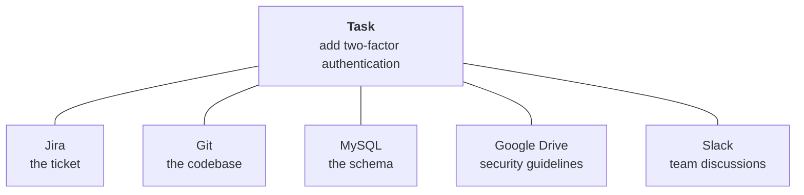
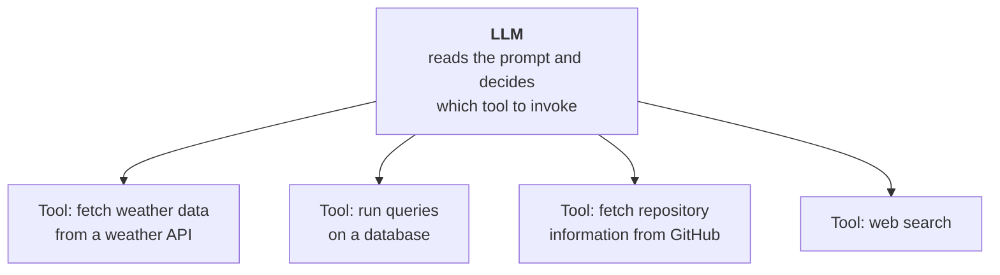
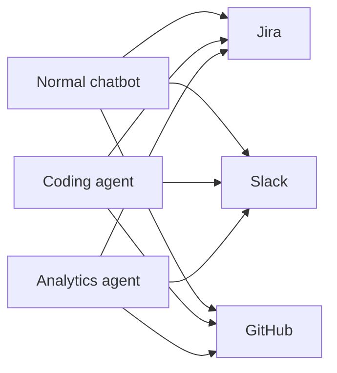
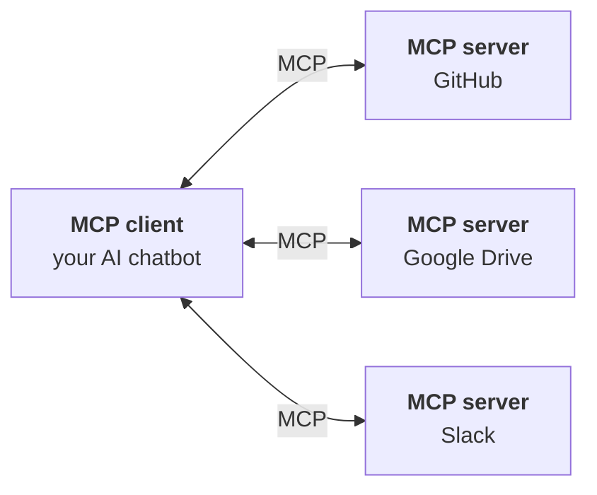
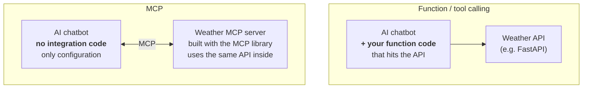
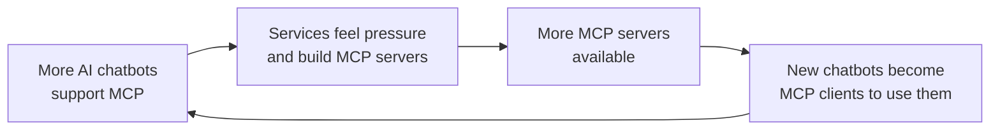

> **Video 2 of 8** · [Watch on YouTube](https://www.youtube.com/watch?v=Zmy439spZB4) · Translated from the
> Hindi transcript. Notes follow the video section by section, in its order.

This video explains, as a story running from ChatGPT's launch to today, exactly why MCP was needed and which problem it solves.

## Why this playlist, and the goal of this video

The term MCP has become very popular in the last year, and it looks as though in the next three to five years **MCP will become an industry standard**, meaning everyone in the industry will have to integrate MCP into their software. That is why so many requests came in to cover it.

The last 30 to 40 days went into studying MCP and implementing it on a laptop, and that produced a curriculum of **three videos**: **The Why**, **The What** and **The How**, with the goal of teaching MCP in depth.

This is the first of those three and covers **the why**: in depth, why MCP was needed and what problem it solves. It takes a **storytelling approach**, starting from when ChatGPT came into the picture and walking through everything that has happened up to today, in order to build a deep intuition for why MCP is needed as a technology.

## 30 November 2022: ChatGPT arrives

The story begins on **30 November 2022**, the day ChatGPT was released. Within **five days** it crossed **1 million users**, and within the next **two months** it crossed **100 million**. No software before ChatGPT had reached such crazy numbers, not Google, not Facebook, not Twitter.

ChatGPT is a **completely different class of software**, because it gives a capability no software gave before: you can talk to machines exactly as you talk to a human, **in your natural language**.

Our relationship with machines is perhaps 500 to 600 years old: first mechanical machines, then electrical ones, and for the last 50 years computers. Through all of that the relationship has been **transactional**: you perform an action and get a result back. Feeling hot, you press the switch to turn on the fan. To calculate something, you press buttons on a calculator. To fill a form, you type on the keyboard and press a button. You get your work done by communicating in a very minimal way.

After ChatGPT, you can talk to a computer the way you talk to a person. You can express yourself, and the machine can express itself back. You can have a thoughtful discussion with your computer, and even make it your **work partner**. That is why ChatGPT is a completely different class of software.

## The three waves of adoption

Like any software, ChatGPT was adopted gradually, in **three stages**.

### Wave 1: the stage of pure wonder

Around the first week of December, a student sent a WhatsApp message: *"Sir, try out this particular chatbot once, it's crazy good."* The whole of the next day went into talking to ChatGPT, shocked at how intelligent it was. Most people had the same experience the first time.

In this stage people did one thing: **satisfied their curiosity**. They asked ChatGPT absurd questions, such as *explain quantum physics from a cat's perspective*, *what would happen if gravity were reversed*, or *write a song about pizza in the style of Shakespeare*. ChatGPT answered intelligently, and people posted the screenshots on LinkedIn, Instagram and WhatsApp. Social media exploded with these screenshots. Nothing meaningful happened, but curiosity was satisfied a little.

### Wave 2: professional adoption

Once the initial period ended and people understood ChatGPT a little, a question came naturally: the fun is fine, but is this chatbot intelligent enough to **help with professional work**?

This was the first time a lawyer put a **50-page contract** into ChatGPT and asked for a summary, and it did it. Maybe the first time a coder pasted code with an error and asked *"can you debug this?"*, and it did it. Or a teacher who had to plan a curriculum and did not feel like reading everything asked it to do that, and it did it again.

For the first time everyone realised collectively that this was not just a tool for jokes. It had **serious potential** and could become a work partner, and you could **double your productivity** with it: work that took **6 hours** might now take **3**. The world saw a **productivity boom**; everyone's productivity rose and everyone's way of working got a little easier. Here ChatGPT showed its true power.

### Wave 3: the API revolution

OpenAI did not release only ChatGPT. Alongside it, they released the **API of their GPT models** to the general public, saying that you can integrate ChatGPT-like chat capabilities into your existing software.

That did happen. Many companies realised that however good their software was, it would be great to bring ChatGPT-like intelligent features into it:

- **Microsoft** added **Copilot** to Word, Excel and PowerPoint, a way to communicate with their software naturally.
- **Google** integrated AI into Gmail, Docs, Sheets and Drive.
- **New-age tools** started arriving, such as **Cursor** and **Perplexity**.

AI was no longer restricted to ChatGPT; the software you already used started getting AI capabilities. AI became more **accessible**: you find it not only in ChatGPT but in the different software around you.

Across these three waves, LLMs came into our world completely. After ChatGPT and its API, all the software around us became **AI-enabled**, and AI became very accessible.

## The problem of fragmentation

With that accessibility came a new problem: **the problem of fragmentation**.

You use a lot of software daily, and all of it became AI-enabled. You use **Notion** and **Slack**, and both are AI-enabled, but Notion's AI has no idea what is happening in Slack's AI. If you use **VS Code** with a coding assistant installed, that coding assistant has no idea what discussion is going on in **Microsoft Teams**.

Suddenly we realised we were living in **multiple AI worlds**: Notion's AI world, Slack's AI world, the VS Code coding assistant's AI world, and so on. Even a small task means **juggling between these AI worlds**: some information is in one place, some in another, and your job is to go to all of them, merge the information and get the work done.

This is not what anyone wanted. The vision on first seeing ChatGPT was a **unified AI agent** that understands your whole work end to end and, when you get stuck, can solve any problem for you. Instead we got **five different AI tools**, getting a bit of work done in each.

Building that unified AI agent is not easy, and the biggest obstacle on the way is **the problem of context**.

## What context is

Context is a very fundamental concept in MCP, so fundamental that it is in the name: Model **Context** Protocol.

In the simplest words:

> Context is everything an AI can see when it generates a response.

A slightly more formal definition: **context refers to the information that the LLM uses to generate a response**. That information can be **conversation history**, and it can also be **external documents**.

### A simple example: conversation history

You are talking to ChatGPT about **quantum physics**. You ask what quantum physics is, where to learn it from, which books are good. Then, suddenly, you ask: *"How difficult is it to learn this particular topic?"* How does ChatGPT know what "this topic" is? **Conversation history.** It looks at the whole conversation, realises you are talking about quantum physics, understands you are asking how hard quantum physics is to study, and answers.

In this scenario, **the conversation history is the context of the AI model**. While typing its next response, the AI can see the whole conversation history and uses it to produce the response.

### A harder example: a software engineer's day

Here context appears in a very simple form, a conversation history. It is not always that simple, especially in professional use cases.

Suppose you are a **software developer at a startup** whose product is an ed-tech site where people buy courses, **just like Udemy**. You are given a requirement: add **two-factor authentication** to the website so that it becomes more secure. The work goes like this:

1. A **ticket** is raised on software like **Jira** and assigned to you.
2. You go to **Git** and pull the most up-to-date codebase onto your machine.
3. Since you are adding two-factor authentication, you need to understand the existing **database schema**, so you open software like **MySQL**, which your company uses, and study the schema.
4. You remember that you also have to follow certain **security guidelines**, so you go to **Google Drive** and fetch the security document.
5. If you get stuck, you talk to a teammate or get help through software like **Slack**.

The task is to develop a two-factor authentication system, but **the context for that task exists in many places**. It is not like the last example, where the whole context sat in one conversation history.

### Doing it with ChatGPT: the copy-paste approach

Now do this work with the help of an AI, say ChatGPT:

1. Go to Jira, copy whatever the ticket says about how to implement the solution, paste it into ChatGPT.
2. Go into the codebase, copy the code of **10 to 12 files** of the existing authentication system, paste it into ChatGPT.
3. Go to MySQL, copy the schema, paste it into ChatGPT.
4. Fetch the security document and paste its specifications into ChatGPT.
5. Copy any relevant Slack discussions and paste them into ChatGPT.

Finally, after **20 minutes** of pasting, you ask your first question: *how do I implement two-factor authentication in such a system?*

## The context assembly problem

You can see how **scattered** the context is, and how difficult and time-consuming it is to build. That is the biggest problem: before asking one simple question, you first have to copy **thousands of lines of code** into ChatGPT.

In a way, developers have become **human APIs**, whose job is to **assemble context** for software like ChatGPT. It would not be wrong to say that more time goes into this context assembly than into actually developing the product.

On top of that, you have to keep track the whole time of what context you have given the AI, what is left, what the AI has forgotten, and what needs summarising. **None of this is scalable.** With a big company codebase, can you summarise it for your AI, or copy-paste all of it into ChatGPT? Assembling context from different places like this and handing it to the AI is simply not possible. That is why building a unified AI agent is so hard: the biggest challenge is **context assembly**.

To summarise the context problem: in a real professional scenario, your context **exists across systems**. Copy-pasting all of it into one place and then talking to ChatGPT or any AI software is very difficult, and **at scale it is not possible at all**. If you want your AI chatbot to understand everything about your work and help you solve problems, it has to **see all your work**; all your work has to be part of its context. But your work is scattered, so showing it to the AI became a laborious, manual copy-paste job, and the bigger the project and the more tools you use, the more that approach fails.

Ideally, software like ChatGPT would go to all those places **by itself** and fetch the necessary context, and the manual copy-paste would disappear. And that problem was eventually solved.

## Function calling

In **mid-2023**, OpenAI released a new concept called **function calling**. It was very simple but very powerful: with function calling you can make your **LLM call an external function**. Your LLM is then not only for chatting; if needed, it can also **complete a task**.

In function calling, you give your LLM a **set of functions**, and for each function a **description** of what it does.

Suppose you give the LLM a function called **`load_file`**, with the description that if the user ever wants to load the content of a file, it can use this function. When the user prompts *"Read the content of the file abc.txt"*, the LLM understands that, instead of normal chatting, the user is asking it to do some work. It scans the list of functions, and for whichever function's description matches the task, it asks for that function to be called **with the right set of arguments**: here, call `load_file` with the argument `abc.txt`. You then call `load_file` with that input, and the task is executed.

A very small concept, but **path-breaking**: for the first time you could not only chat with an LLM but also get it to execute a task.

### Architectures with many tools

Architectures of this kind started appearing: one LLM connected to many functions, many **tools**.

You create different functions for your different tasks, each function internally defines how to execute its task, and the LLM has only one job: read the user's prompt and work out **which tool to invoke**. This was a very revolutionary idea.

### A shower of tools

After it arrived, there was a **shower of tools**. Every company already working with LLMs realised the power of tools and, to make their workflows and **context assembly** seamless, started building all kinds of tools:

- **Tools for enterprise software.** Every company uses **Salesforce**, **Slack**, **Google Drive** and **databases**, so developers were told to build a Salesforce integration tool for the AI chatbot, a Slack bot tool for Slack, connectors for Google Drive, tools to run queries on the database, and a Git integration tool. That way the AI can connect to every place the context lives and fetch it at any time.
- **Internal tools.** HR departments built functions to access employee data; finance teams built tools for accounting systems; marketing teams built tools for campaign management; IT departments built tools for infrastructure management.
- **Tools in AI-first software.** **Cursor**, the AI-powered code editor, built a **file system access** tool that can access and intelligently search any file on your local file system. **Perplexity** built a tool for **web browsing and real-time information retrieval**. **ChatGPT Plus**, a subscription feature, let you browse, upload files and execute code. **Claude** launched **Computer Use**, with which it can completely control your computer.

Within **six months** of function calling arriving, the whole AI world had a shower of tools.

### The software engineer's day, with tools

Back to the same developer, with the same two-factor authentication task and wanting ChatGPT's help, but now with all the necessary tools:

- A Jira ticket is raised and assigned. Instead of copying its content by hand, you tell ChatGPT: *"Go and check whether I have a new ticket assigned on Jira or not."* Because ChatGPT is connected to Jira through a tool, this happens **behind the scenes, automatically**. Yes, there is a new ticket: develop two-factor authentication.
- *"Can you fetch the most updated codebase from GitHub?"* GitHub is connected through a tool, so the whole codebase arrives.
- *"I will need the schema to build two-factor authentication."* MySQL is connected through a tool, so the schema arrives.
- *"Fetch the security guidelines from Drive."* A connector exists for Drive too.
- Finally: what are my teammates saying on Slack about this? That information is fetched too.

All the context is now assembled, and you ask: *"Now that you can see everything, tell me how can I build a two-factor authentication system."*

That is the power of tools. The context that was scattered is now **connected** to the AI chatbot. ChatGPT can actually see your entire work, and since it can see all of it, it can help you with it properly. The context assembly problem that stood in the way of a full-fledged unified AI partner was solved by tools.

## The flaw: the integration problem

When function calling and tools arrived, people felt, for a few days at least, that the context assembly problem was solved. After a while they realised that, although tools work and do bring you all the context, the approach has **a very big flaw**.

You need to give your AI context, the context is scattered across different tools, so you **write a function for every tool**. For example, the chatbot being built in the **LangGraph playlist** has two tools, a **calculator** tool and a tool that fetches the **stock value** of any company in the stock market, and each tool has its own function. The basic idea: **every tool needs its own function code**.

### n × m integrations

Suppose your company works with **three AI chatbots**:

1. A **normal chatbot** for asking anything about the company.
2. A **coding agent** used by all the company's software developers.
3. An **analytics agent** given to the data analysts for automated data analysis.

And suppose the company works with some **20 different SaaS tools**, such as Jira, Slack, GitHub, MySQL, Drive and 15 more. How many functions do you have to write? With **n AI chatbots** and **m tools or services**, you have to code a total of **n × m** integrations or functions. And this is a small example; in big companies the numbers are bigger, with more chatbots and more SaaS or internal tools.

Writing and coding so many functions is a **development nightmare**, for four reasons.

1. **The sheer amount of code.** Every function needs its own **authentication method**; every tool has its own **data format** and **API patterns**; every tool wants **error handling** done differently. Coding all this is a separate task in itself; you would need a separate software team just to create these integrations.
2. **Maintenance.** Three chatbots and 20 integrations means **60 functions**, and you have to maintain all 60. If Google Drive changes its API a little tomorrow, every Google Drive integration fails, and none of your three or four chatbots can talk to Google Drive until you debug it.
3. **Security.** In big companies you must make sure your software does all this securely. But with 60 different integrations, each with its own **OAuth** and **API keys**, you cannot manage them from a single place. The information is spread over different files, so your security is **fragmented**, and somehow a hack might get performed.
4. **Cost and time.** Connecting 20 tools to one chatbot means 20 individual integrations, 20 functions, which is complex in itself; making the chatbot fully functional might take **2 or 3 months**. Then there is the cost of setting up a whole team to handle the integration part, and paying their salaries.

Consider the end goal: all of this was meant to make your existing developers' work easier, and to do it you have to hire more developers. **Just see the irony**: you set out to make something easier and it became harder. The tools and function-calling solution, adopted to solve the context assembly problem, brought an **integration problem** of its own at scale, and people found that one very heavy to solve too.

### Summary of the integration problem

A company uses more than one AI chatbot, for example **Perplexity**, **Cursor** and **ChatGPT**, and wants all three connected to **GitHub**. That means **three separate integrations**: Perplexity–GitHub, Cursor–GitHub and ChatGPT–GitHub, and all three look different from each other. **Every AI tool is building its own way to call every API.**

It would be far better to build a **single GitHub integration** that works with Perplexity, with Cursor and with ChatGPT alike. That is what we want to achieve, and that is how the integration problem gets solved. The thing that came to solve it: **MCP, the Model Context Protocol**.

## How MCP works, in simple words

MCP has two entities, a **client** and a **server**, and all communication runs between them.

- The **client** is nothing new: it is simply your **AI chatbot**, such as ChatGPT, Cursor, Perplexity or your own chatbot.
- The **server** is the **service you want to connect your AI chatbot to**, such as GitHub, Google Drive or Slack.

The general architecture of any MCP application is a **single client connected to many servers**, one AI chatbot connected to multiple tools. The language in which all the conversation between client and servers happens is what we call **MCP, the Model Context Protocol**.

How do you make your AI chatbot an MCP client, or your tools MCP servers? If you read the MCP protocol and its documentation properly, you could write the whole code that establishes this communication **from scratch**. But **Anthropic gives you a readymade library, an SDK**:

- To make your AI chatbot an **MCP-compatible client**, install the **MCP client SDK** on the machine where the chatbot runs.
- To make your tools **MCP-compliant servers**, use the **MCP server SDK** to build them.

These SDKs are how MCP clients and MCP servers get built.

## MCP versus function and tool calling, at a technical level

**Function or tool calling.** For whatever tool you want to connect, you write a function **inside your AI chatbot** to access its API, like the calculator and stock tools shown earlier. There is a kind of client-server model here too. Say you want to connect your chatbot to a **weather tool**: somewhere on a server there is the weather tool's API, perhaps written in **FastAPI**. That is the server side. To access it, you write a function in your chatbot's code that hits this API and brings back the data. That is the client side. **The company wrote the server code, you wrote the client code**, and the task completes only when the two work together.

**MCP.** There is still a weather server where the weather data lives, but this server is built **with the MCP library**. The code is a little different, but internally it uses **the same API**. The main difference is on the **client side**: you do not need to write any code in your AI chatbot at all. You have already configured the client and server to connect, they speak the same language, Model Context Protocol, and so there is no separate code to fetch the API's data. **The server does all the heavy lifting.** Once the two are connected, the client, your AI tool, knows it has access to the server, and it can pick the tool of its choice from inside that server to get its work done.

So the major difference: **in MCP the server does the heavy lifting**, and on the client side you make the connection and sit back. If you build a **GitHub server** in MCP, that server is responsible for everything:

- the whole **business logic**;
- **authentication**;
- the API's **rate limiting**;
- **data format translation**, so the LLM on the other side can understand what it receives;
- **error handling**, sending the right error codes to the client if something goes wrong.

The client simply connects to the server and speaks the same language, MCP. This is covered in much more detail in later videos; for now it is an overview.

## The benefits of MCP

All of MCP's benefits follow from that one fact.

**1. Far fewer integrations, and none on the client side.** After MCP arrived, famous service providers such as **GitHub**, **Google Drive** and **Slack** built their own **official MCP servers**, so any MCP-compliant AI tool can connect to them easily. With three chatbots and 10 services, you used to write **3 × 10 = 30** unique integrations. Now, to connect to 10 MCP servers you need only **10 integrations**, and even those are written on the server side, by the service provider itself. On the client side you only configure your AI tool to connect. Where there were **m × n** integrations, there are now only **m + n**, and the actual code-writing is delegated to the server side.

**2. No maintenance overhead.** You write no connection code on your side, so nothing can break there. If the API changes tomorrow, that is the server's headache; the server updates its code, and nothing changes on the client side.

**3. Reduced cost and time.** Connecting your chatbot to 10 services used to mean building 10 integrations, which took time. Today you just build the AI chatbot; the 10 servers already exist, and you connect to them directly **on day one**. That saves time, and it saves cost because you do not have to hire separate engineers to create and maintain the integrations.

**4. Better security.** Connecting one AI chatbot to multiple services means maintaining **one JSON config file** with all the connections in one place. The **GitHub** entry, with a personal access token, is only a few lines, and that alone connects the chatbot to a GitHub account. The **Notion** entry, with an API key, is just as short. Managing or **auditing** a single file is much simpler than the old situation of different API keys kept in 10 different files for 10 different tools. It is a much better security model.

Everything rests on one simple fact: **in MCP the entire heavy lifting is done by the server**. On the client side, the AI chatbot does nothing; you maintain a JSON file like this to connect to various servers, and that is it.

## Why MCP is spreading so fast

Why is MCP's ecosystem growing so quickly, and why does it look set to become an industry standard in the next three to five years? The dynamics are simple.

Some very famous AI chatbots openly say they **support MCP**: **Claude Desktop**, **Cursor**, **Windsurf** and **Perplexity**. As soon as they did, **pressure** started to build on services such as **GitHub**, **Slack** and **Google Drive**. These companies can see that, in future, people will do their work through AI tools. You will no longer open drive.google.com to read a document; you will ask your chatbot to fetch that document from that folder in your Drive. So their future traction, their future users, will come through AI tools, and if those tools support MCP, they should build MCP servers from their APIs. Once a service has an MCP server, **any MCP-compliant tool** can connect to it without writing custom code.

So MCP servers are being built for all the famous services, and the more servers there are, the more the whole ecosystem benefits. A company that builds a new AI chatbot tomorrow only has to make it an **MCP-compatible client**, and on **day one** it can connect to **thousands of MCP servers** without writing any code.

More AI clients arrive, so more servers get built; more servers exist, so new chatbots are under pressure to connect to them, and new clients become MCP-compliant automatically. It is a kind of **network effect**, and it makes the ecosystem grow **exponentially**.

The result is more adoption, more standardisation and more value in the ecosystem. Any client or server, any AI chatbot or tool, that does not adopt MCP is **cut off from this massive ecosystem** and has to write lots of custom code to interact properly with all the services, which would be foolish. MCP has positioned itself exactly right, and it looks as though within three to five years it will become an industry standard.

## What comes next

That completes the story of why MCP is needed, from day one to today's scenario. The next video goes into detail at the **architecture level** to understand how MCP works: **the What of MCP**.
