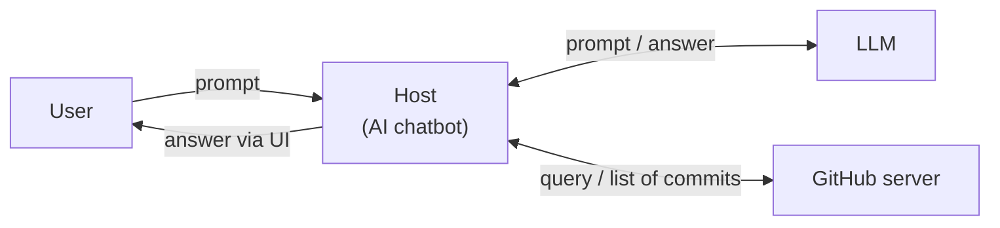
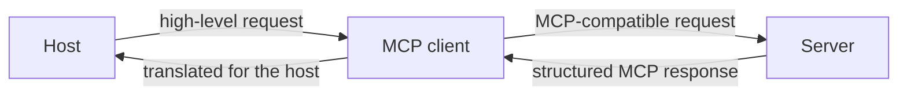
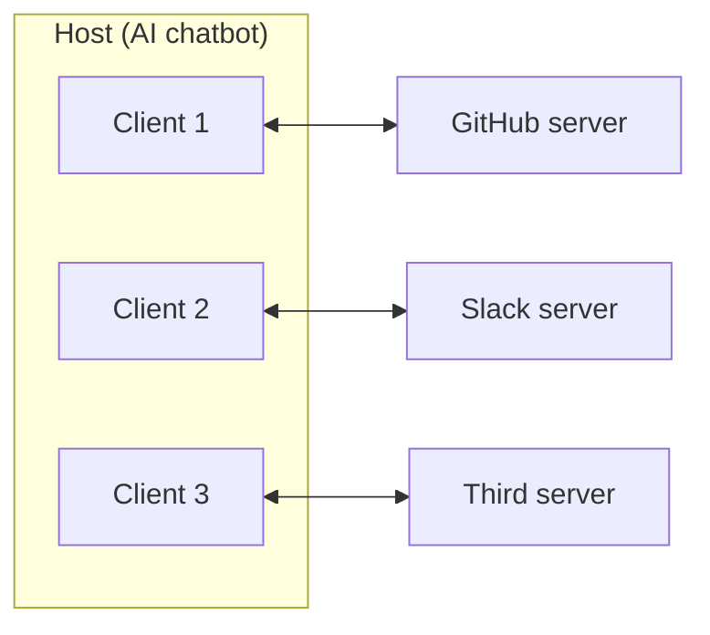
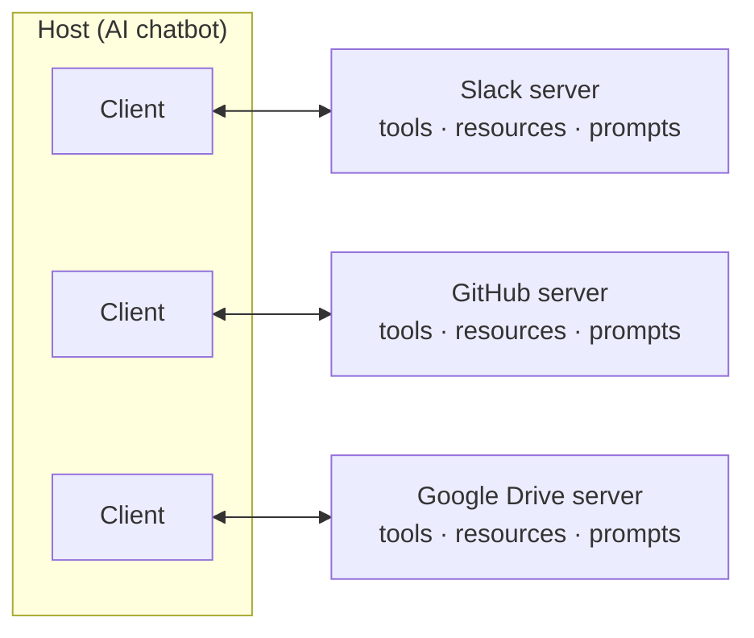
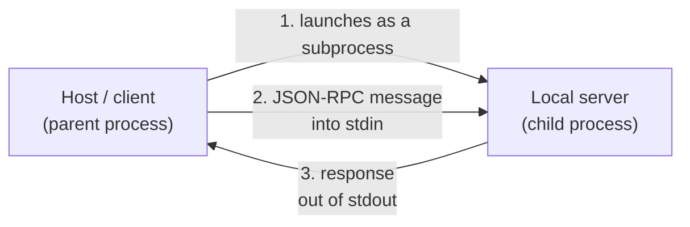
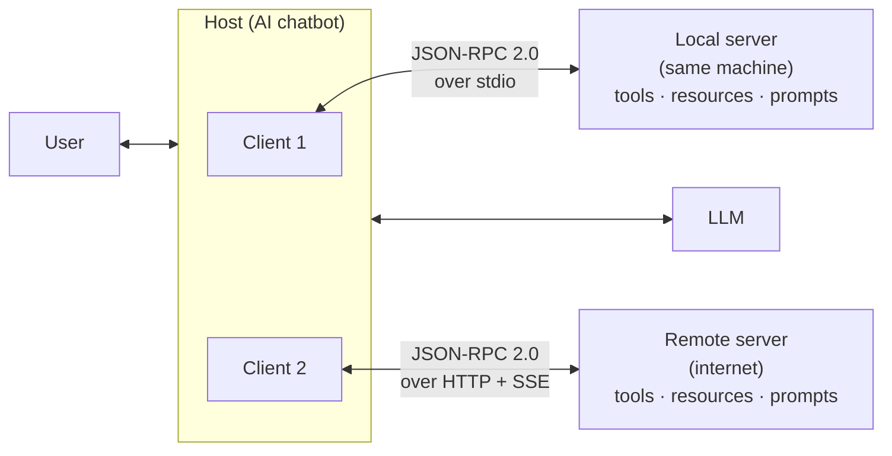

> **Video 3 of 8** · [Watch on YouTube](https://www.youtube.com/watch?v=nQa31xdXbGk) · Translated from the
> Hindi transcript. Notes follow the video section by section, in its order.

This video builds the MCP architecture from its simplest version, adding one refinement at a time until the complete diagram is on the table.

## Where this video fits

The previous video explained in detail **why** MCP is needed. This one starts on the **what** of MCP, which was planned as three topics:

1. The **architecture** of MCP, which is very important.
2. The **lifecycle** of MCP: how the client and the server talk to each other, decoded step by step.
3. Some **advanced concepts** of MCP.

All three in one video would have made it far too long, so the "what" is split into three parts: architecture, then lifecycle, then advanced concepts. This part covers the architecture in detail. The final architecture diagram is shown at the start, and the goal is to understand it from first principles: start with a very basic version and keep adding detail until you reach that diagram.

## The simplest version: a host and a server

In its simplest form the MCP architecture has only **two things: a host and a server**.

If you remember the last video using the word "client" where this one says "host", don't worry. Understand this video from scratch and forget the previous one for now.

- **The host** is simply the AI chatbot the user interacts with. The user asks it questions through a prompt, and behind the scenes the host is connected to an LLM, from OpenAI, Anthropic or Gemini. It can be a ready-made chatbot such as **Claude Desktop** or the **Cursor IDE**, or a custom chatbot you built yourself, like the one built in the LangGraph playlist. The setup is the same either way.
- **The server** is basically a tool that can execute some particular task. It could be **GitHub's** server, for managing a Git repository easily; **Slack's**, for reading or writing messages in a Slack channel; or **Google Drive's**, for manipulating the files in your Drive account.

All the communication happens between these two entities.

### Example: "Are there any new commits on the GitHub repo?"

1. The user sends the question to the host as a prompt.
2. The host has a very simple job: it passes the prompt as it is to the LLM.
3. The LLM reads it and realises the answer is not in its training data, so it needs an external tool or server. It checks which servers are available, sees there is a GitHub server, and tells the host: "I don't know the answer, but to find it, go and ask the GitHub server."
4. The host goes to the GitHub server and gives it the query.
5. The GitHub server checks behind the scenes for new commits in the repo and hands the list back to the host.
6. The host takes this information back to the LLM, which now has enough to answer.
7. The LLM gives its answer to the host, and the host shows it to the user through the UI.



That is the overall simplified version of MCP's architecture.

## Refinement 1: the MCP client

The summary so far says there are two parties, host and server, and all communication runs between them. That is not entirely correct. **In reality the host never talks to the server directly.** Whenever it needs to, it goes to a helper friend, the **MCP client**.

The client is the entity that helps the host communicate with the server. No direct communication between host and server is possible; every communication goes via the client. The client's biggest quality is that it **speaks the same MCP language the server speaks**, which is why it is super easy for the client to communicate with the server.

### The same example, with the client

The user again asks the chatbot (the host) whether there have been any recent commits in the Git repository.

1. The host takes the prompt and generates a **high-level request** from it, "find the recent commits in the Git repository", and gives it to the client.
2. The client **converts** this high-level request into an **MCP-compatible request** and sends it to the server.
3. Because the request is in MCP's format, the server can read and understand it easily, and starts its work.
4. When it finishes, the server generates a **structured MCP response** and sends it to the client.
5. The client's other job is to **translate** this structured MCP response into a language the host can understand, so the host can do its work.



### The client and server relationship is one-on-one

In MCP the relationship between a client and a server is **one-on-one**: a client can connect to and talk with only one server at a time.

Suppose the host is connected to a GitHub server and you connect a second server, Slack's. The client currently connected to GitHub cannot talk to the Slack server, because the relationship is one-on-one. The host needs **another client**, which connects one-on-one with the Slack server. Connect a third server and you need a third client, again one-on-one with that server.



### The phone and SIM analogy

To make a call you use a phone, and the phone needs a network, say Airtel or Jio. But the phone does not communicate with the network directly; a helper device does that job, the **SIM**.

- The **phone** is the host.
- The **SIM** is the MCP client.
- The **network** (Airtel or Jio) is the server.

And if you need more than one network, say Airtel, Jio and Vodafone, you install multiple SIMs in the phone, one for each. Again each SIM has a one-on-one relationship with its network. Exactly the same thing happens in the MCP architecture.

In summary: one host (an AI chatbot) can connect to multiple servers, for example GitHub, Slack and Drive. But the host does not do the low-level communication with these servers itself. It installs **one client per server**, and each client handles all communication with its own server end to end.

### Why follow this architecture: two benefits

**1. Decoupling.** The architecture is decoupled, meaning there is a separation of concerns. Whatever the host is saying to GitHub, and whatever it is saying to Drive or Slack, these communication channels know nothing about each other; each one runs in its own separate way. This gives the system a sense of **safety**: if a problem appears on the GitHub line, the Slack and Drive lines keep working properly. It also lets you do things **in parallel**: if a user request needs work from both Slack and GitHub, the two separate clients can do both tasks at the same time, so overall execution is faster.

**2. Scalability.** You can connect any number of servers to one host. You just keep adding one client per server inside the host, as many clients as servers, and the setup can scale to any size.

By now you should have a clear idea of the host, the client and the server.

## Refinement 2: primitives

The next refinement is **primitives**, also a very important concept in the MCP architecture.

The simple definition: **primitives are the things a server can offer to the host.** Whatever offerings the server provides to the host in this architecture are called primitives. A server provides three kinds:

1. **Tools**, to get any work done by the server.
2. **Resources**, some documents or static knowledge.
3. **Prompts.**

### Tools

Tools are **actions the AI can ask the server to perform**. If your host is connected to the GitHub server, everything the GitHub server can do for you counts as a tool:

- telling you how many commits are in your repository is one tool;
- telling you how many active issues the repo currently has is another tool, another functionality;
- telling you how many repositories are in your GitHub profile is another.

Similarly, a **Google Drive** server could offer a tool to search for a particular file or folder in your Drive account, or a tool to create new files in your Google account.

### Resources

Resources are **structured data sources the AI can read**: documents sitting on the server that the host can fetch.

- On the GitHub server you can fetch the **README file** of any repository. That README is a kind of static resource.
- If your host is connected to a **database server**, you can fetch the **schema** of a database as a resource.

The simple differentiation: if the thing you want to bring in is **static**, meaning it is not changing, it is a **resource**. If it is **dynamic**, such as the number of commits, issues or repositories, which keep changing, you fetch it with a **tool**.

### Prompts

The third primitive is a little confusing. The slide defines prompts as **predefined prompt templates and instructions that the server offers to help shape the AI's behaviour**.

Take a setup where the host is connected to a single server, GitHub's, which offers all three: tools, resources and prompts. The user tells the chatbot: **"Create an issue for a bug: the login button doesn't work."** The user wants an issue created in the Git repository saying the website's login button is not working.

The flow is fine as far as it goes. The host tells the client to go to the server and find which tool can create an issue; it turns out there is a tool called **create issue**. Behind the scenes the AI host generates a text:

```text
Title: Login bug
Body: The login button doesn't work
```

and gives it to the client, telling it to have the server call the create issue function and create this issue on the repo.

The only problem is that this text is **vague**. Issues on a Git repo should normally be more descriptive. But nobody gave the LLM (the AI host) any guidelines on what format to use for an issue, so it wrote one in a vague way of its own choosing, which is not a very good way of doing it.

The **prompt primitive** solves this. You create and keep a prompt like this on the server:

- **Name:** issue report prompt.
- **Description:** "Write clear, detailed GitHub issues", so the LLM can read it and understand when to use this prompt.
- **Role:** system. **Content:** "Always include title, steps to reproduce, expected, actual, environment."

With that instruction, the LLM now generates something like:

```text
Title: Bug in login button
Steps to reproduce: open the login page, enter credentials, press the login button
Expected behaviour: it should log in
Actual behaviour: nothing is happening
Environment: Chrome, macOS
```

This text then goes through the client to the server, and it is the better way. What changed is that a sort of **guideline** now lives on the server; the LLM in the AI host reads it and learns to use the server better. That is the fundamental of the prompt primitive: **it helps an AI host learn to use the server in a better way**. It is not useful in every case, only in some specialised cases, but MCP gives you the option.

In a nutshell, primitives are the offerings a server gives the host: **tools** to get an action performed, **resources** to provide a static document, and **prompts** to guide the AI and its response.

### Standard operations on the primitives

MCP does not only give you primitives; it also gives **standard operations (functions)** for dealing with them.

**Tools, two operations:**

- **`tools/list`**: the client inside the host asks the server directly, "Tell me, brother, what tools can you provide?" The call goes to the server and brings back a list of all its tools. For a GitHub server the list would read something like: a function to create an issue, a function to push code, a function to commit code, a function to read the number of repositories.
- **`tools/call`**: call the functionality you want to use. To create a new issue you simply call create issue, and it executes based on the arguments you pass. As the slide puts it, the client tells the server, "Please run this particular tool with these particular arguments."

**Resources, four operations:**

- **`resources/list`**: which static documents are available on the server for you to fetch ("What resources are available?").
- **`resources/read`**: read a particular document ("Give me the content of this resource").
- **`resources/subscribe`** and **`resources/unsubscribe`**: if you subscribe, the server tells you when the document changes; after you unsubscribe, the client no longer finds out about changes.

**Prompts, two operations:**

- **`prompts/list`**: the set of all the prompts the server offers.
- **`prompts/get`**: fetch a specific prompt template.

This part is practical. In the next video, where a server is coded from scratch, you will see how these functions are implemented.

### Summary so far

Everything so far fits in one image:

- There is a **host**, basically the AI chatbot, which can be connected to **multiple servers**, such as Slack, GitHub and Google Drive servers.
- To connect and communicate with each server you need **one client**; three servers means three separate clients.
- Every server offers **primitives**: tools, resources and prompts.
- MCP also offers **standard methods** for talking to those primitives, such as `/list` and `/call`.



## Refinement 3: the data layer

Two final things remain: the **data layer** and the **transport layer** of the MCP architecture. Both are a bit technical, but if you understand them properly you have complete knowledge of the MCP architecture. The data layer comes first.

The definition on the slide:

> The data layer is the language and grammar of the MCP ecosystem that everyone agrees upon to communicate.

Go back to the summary diagram. It has been said again and again that the client and the server talk to each other, and that the language they talk in is what we are calling MCP. But what that language looks like, what its grammar is, how it is written and what its rules are has not been discussed yet. That is what studying the data layer means, and that is what comes now: understanding this language and its grammar in and out.

First, one very important fact:

> In MCP, JSON-RPC 2.0 serves as the foundation of the data layer.

In simple terms, the **grammar of the MCP language is provided by JSON-RPC**. JSON-RPC gives us the rules for writing the language of MCP. So to understand the data layer you have to understand JSON-RPC. Time for a pause, then, to step back and understand what JSON-RPC is.

### What RPC is

JSON-RPC stands for **JavaScript Object Notation Remote Procedure Call**. JSON has come up on this channel many times, but RPC may be new to you. It is a very famous term too, used a lot in **distributed computing**.

The slide's definition:

> A remote procedure call allows a program to execute a function on another computer as if it were local, hiding the details of the network communication and data transfer. This abstraction makes it easy to build distributed applications.

A distributed application is one where one component sits on one machine and another component sits on a different machine. Say you are writing a program, but the functions, dependencies and libraries it needs all sit on another machine. To run correctly, your program has to call those functions on the other machine. RPC helps you do that, and it calls them in a way that makes it seem as if they were on your own machine.

A simple example: instead of writing `add(2, 3)` the way you normally call a function, you send an RPC request: "Please run add with parameters 2 and 3." That is how simple it becomes to execute a function on another machine. RPC is basically **calling a remote procedure or function**. If that is not completely clear yet, the technicalities come next.

### What JSON-RPC is

The name tells you the job. **JSON-RPC is a marriage between RPC and JSON.** The slide's definition:

> JSON-RPC combines the concept of remote procedure calls with the simplicity of JSON, allowing developers to structure RPC requests and responses in a standardised JSON format.

In simple terms: you need to make remote procedure calls, so a program on your machine can call functions on another machine. You do that with RPC, and you **write** those RPC requests in **JSON**, a standard kind of language for this type of communication. That mixture is JSON-RPC. The current version is **2**, hence the full term **JSON-RPC 2.0**.

### A JSON-RPC request and response

Suppose a program on your machine needs a function that sits on another machine. You make a remote procedure call using JSON-RPC, and the client machine's request to the server looks like this:

```json
{
  "jsonrpc": "2.0",
  "method": "add",
  "params": [2, 3],
  "id": 1
}
```

It is a dictionary-like structure:

- **`jsonrpc`: `"2.0"`** says this request uses JSON-RPC, version 2.
- **`method`** is the name of the function you want to execute on the server: `add`.
- **`params`** are the parameters to call it with: inputs 2 and 3. You want the function to run on the server and send back the result for these inputs.
- **`id`** is an ID you will have to match when the response comes back.

The server responds, also in JSON-RPC:

```json
{
  "jsonrpc": "2.0",
  "result": 5,
  "id": 1
}
```

It repeats the JSON-RPC version (**the version must match**), puts whatever result it got from calling the function under the **`result`** key, and ends with **`id: 1`**. When this reaches the client, the client matches the ID: "I sent ID 1, and ID 1 is coming back, so this is correct and I can accept it."

You can think of this as somewhat like a **REST API**, which also handles communication between two machines. But REST is based on REST principles and uses verbs such as GET and POST. JSON-RPC is a different variant, a different flavour.

### An error response

Now suppose you called method `add`, but there is no method called `add` on the server. The response is still in the language of JSON-RPC, but instead of a result it carries an **error**:

```json
{
  "jsonrpc": "2.0",
  "error": {
    "code": -32601,
    "message": "Method not found"
  },
  "id": 1
}
```

Just as HTTP has error codes such as 404 and 500, JSON-RPC has its own **standardised error codes**; here it is **-32601**. The ID comes back again, so the client can work out which response belongs to which request.

That is JSON-RPC. The point to take away is that the communication between client and server in MCP is written in exactly this way. **This is the grammar of that language; these are the rules** that communication follows.

### How MCP's data layer uses JSON-RPC

Here are different scenarios, and what the request and response look like in each. The messages below are **simplified**: the real JSON-RPC messages carry a bit more technicality, but the skeleton is roughly this.

**Discovering tools.** You connect your GitHub server to your AI chatbot for the first time, and the chatbot wants to know what tools the server has. The standard operation for that is `tools/list`. The client forms exactly this structured message:

```json
{
  "jsonrpc": "2.0",
  "id": 1,
  "method": "tools/list"
}
```

The method name is `tools/list` (where the earlier example had `add`), and there are no params because this method does not need any. The server knows how to speak JSON-RPC, so it does its work and replies with the same ID and, in the result, a list of its tools:

```json
{
  "jsonrpc": "2.0",
  "id": 1,
  "result": {
    "tools": [
      { "name": "list_issues" },
      { "name": "list_pulls" }
    ]
  }
}
```

`list_issues` can fetch all the issues of a repository, and `list_pulls` can list all the PRs. A real server would list more tools; these are two examples.

**Calling a tool.** During normal conversation the client wants to use one particular tool on the server, `list_issues`. The standard operation is `tools/call`. The request again has `jsonrpc: "2.0"`, a different ID, the method `tools/call`, and this time **params**. The client already knows which params each function needs, because the tools list response includes each function's required parameters. So in params it states the tool's **name** and its **arguments**. The server does its work and responds, for example: there are currently two issues in that repo, each with its ID, title and state (open).

**Listing resources.** To see which resources the server has, the client writes a JSON-RPC request with `jsonrpc: "2.0"`, ID 3, and the standard method `resources/list`, with no params. The response says, in effect: "I have these two documents; you can use them."

**Reading a resource.** To read one particular document, the client calls the method `resources/read` and passes the document's **URI** in params. The response contains the URI and whatever text is in that document.

### Batching

Something not discussed yet: in JSON-RPC you can send **multiple requests to the server together**. This is called **batching** of requests. Say you want to list the issues and also see the pull requests at the same time. You write the calls inside a list: one JSON-RPC call to list the issues and one to fetch the pull requests. The server responds accordingly, giving you the responses for both merged together.

### Notifications

You can also send **notifications**. The client can send one to the server, or the server can send one to the client.

How is that different from a normal request and response?

- **Request and response.** When the client generates a request and it reaches the server, the server is responsible for generating a response. **For every request there has to be a response.** That is an important point.
- **Notification.** If the client generates a notification for the server, the server has no responsibility to reply. A notification is **fire and forget**. If the server sends one, the client just looks at it; no reply is needed.

So a request needs a response, and a notification does not.

Remember the `subscribe` and `unsubscribe` methods on resources. Once you subscribe, the server notifies the client whenever the document changes: "Look, this document has changed." That is done with notifications. The example notification the server sends the client says that a particular file has been **updated**, with its name, who updated it and when; the server sends this because the client has subscribed.

The interesting thing to notice is that **this JSON-RPC body has no `id`**. There is no ID because no response is needed back. Whenever you do need a response, the request carries an ID and the response replies on the same ID, as in all the examples so far. A notification has no such need.

Notifications are a very important concept, in MCP as well, and they will come up again later. For now, remember that **JSON-RPC is what brings the notification feature into the MCP architecture**.

### Another error example

Suppose the client calls the `list_issues` function for a repository that is not available. The error response comes back with the same ID and an **error** containing an error code (JSON-RPC has different error codes, which will be covered later) and the message **"missing required field: repo"**. The actual mistake: when the client called the function it sent only the **owner's** name and never sent the **repo** name. So the server naturally replies with an error: "Which repository's issues should I tell you? You never told me the repository name."

That is a quick overview of how requests and responses are structured with JSON-RPC, and how the client and the server each do their work. It is a very technical topic, and most likely you will never need to write code at this low level; libraries do all of this internally. It is shown here so that you have a **conceptual understanding**.

### Why JSON-RPC and not a REST API?

One last question before concluding the data layer: **why did Anthropic, while designing MCP, decide that the entire data layer would run on JSON-RPC?**

It is a logical question. There are two machines: the **host machine**, where the AI chatbot runs, and the **server machine**, where GitHub's code sits. The goal is for the host machine to call some functions on the GitHub machine, for example to get the count of issues in a GitHub repo. So you are executing a function on a remote machine and bringing its result back. A **REST API** does exactly that (it was covered in the FastAPI material); you could simply use GitHub's API. So what does MCP need that REST cannot give but JSON-RPC can? Understanding that gives you a bit of the designers' mindset.

There are more reasons than this, but here are the **five main ones**:

| # | JSON-RPC | REST API |
| --- | --- | --- |
| 1 | **Lightweight.** A request is a very simple JSON with plain text, no headers and no metadata. Easy to write, easy to debug, easy to send over a transport from one machine to another. This was a very big reason for choosing it. | Communicates through HTTP behind the scenes, so many headers and a lot of metadata get attached to each request. Creating a request is hard work, debugging an error in it is hard work, and sending it is more time-consuming and costly because it carries more. |
| 2 | **Bidirectional.** Two-way communication: so far the client formed requests and sent them to the server, but the server can also generate a request for the client, and the client responds. Some advanced concepts in later videos use this. | Client-server, but **one-way**: the client always sends the request and the server responds. |
| 3 | **Transport agnostic.** No fixed transport is defined. It works with HTTP, with stdio, with WebSockets, and even with a custom transport you write yourself. | The transport is HTTP. |
| 4 | **Supports batching**, as shown above. In the AI world you will often need to send multiple requests to the server together. | One request at a time; for a second request you have to do the work again. |
| 5 | **Supports notifications**: you can fire off a notification and no response comes back. | No notification feature; a one-request, one-response model. |

On point 3: **transport** is how the communication between the two machines travels, whatever carries it. For REST that is HTTP. The exact benefit MCP gets from JSON-RPC being transport agnostic becomes completely clear in the transport layer section below.

Beyond these five there are five or six more reasons in the MCP documentation that led Anthropic's team to use JSON-RPC instead of some other protocol.

The data layer discussion got a bit technical, as warned at the start, but that is the most simplified explanation of what the data layer is, what its components are, and the key role JSON-RPC plays in it.

## Refinement 4: the transport layer

The one last thing to study in the MCP architecture is the **transport layer**. The definition on the slide:

> The transport layer is the mechanism that moves JSON-RPC messages between the client and server.

So far it is clear that MCP has two parties, the client and the server, and they can communicate because they speak the same language. We have also seen that language's mechanics and grammar: the requests the client writes and the responses the server gives are both written in JSON-RPC. What has not been discussed is **how those messages actually reach each other**, the medium they travel through. The answer is the transport layer: the mechanism in MCP by which JSON-RPC messages get from client to server and from server to client.

The transport layer always has a **mode of transport**, and that mode depends on **what kind of server** you are dealing with.

### Two kinds of servers: local and remote

You might think there is only one type of server, but MCP actually has two:

- **Local server**: a server running on the **same computer as the host**, that is, installed on the host's computer.
- **Remote server**: a server installed on **some other computer**, on a network or the internet.

### Demo: a local server and a remote server in Claude Desktop

This machine has Claude Desktop installed, along with a lot of MCP servers.

**Local server: the filesystem server.** It is installed on the laptop itself, and if you ask which files are in a particular directory, it tells you.

- Ask **"Is there a Python file on my desktop?"** Claude automatically understands it should go to the filesystem server. The server is triggered, it asks for permission, and then it searches the desktop. It replies that there is no Python file.
- Ask **"List down all the folders that are present on my desktop."** It asks for permission again and lists the folders currently on the desktop. In fact there is also a `hello.py` file, which somehow it could not find for the previous question.

You get the idea: this is a local server, and it has to be local, because otherwise it could not tell you which file is in which folder on your machine.

**Remote server: the GitHub MCP server.** Ask **"Can you list down my top five most starred repositories?"** Claude understands on its own that it should use the GitHub MCP server, picks it, searches the repositories, and returns the top five most starred ones.

So MCP servers come in two types, remote and local. And the important point:

- With a **local** server, the mode of transport is **stdio**.
- With a **remote** server, the mode of transport is **HTTP + SSE**.

:::note

HTTP + SSE was MCP's original remote transport. The MCP specification revision of March 2025 replaced it with **Streamable HTTP**, which still uses HTTP POST and can still stream responses with SSE. The ideas explained below carry over.

:::

### Local servers and the stdio transport

**stdio** stands for **standard input output**. You will have met it if you programmed in C++, Python, Java or any other language at school or college; if not, here it is from scratch.

stdio refers to the **built-in streams every program has**, and there are two:

- **Standard input**, through which a running program's process takes input from the external world.
- **Standard output**, through which it sends output to the external world.

Programming courses teach this because you use both from the start. In your first hello world program you take input from the keyboard; for the program the keyboard is the outside world, so that input comes through standard input. When you print output on the monitor, the monitor is the external world for the program, so that goes through standard output.

Why does stdio appear in MCP? Because with local servers, MCP very smartly uses **stdio as the transport layer between the client and the server**. It works in three steps:

1. **The host launches the server as a subprocess on the same machine.** This sets up a **parent-child relationship** between the host and the server, which means the host gets **control of the server's standard input and output**.
2. **Using that control, the host (the host's client) sends JSON-RPC messages into the server's standard input.**
3. **The server receives the messages, reads and processes them, and sends its output back to the host through standard output.**



### Demo: the three steps with `hello.py`

In theory this may sound like "fine, it must happen that way", so here is a small demo that performs all three steps. On the desktop is a Python file, `hello.py`, with nothing special in it: it asks the user for input (their name), and as soon as it gets the name it prints "Hello" and the name. A hello world program.

```python
name = input()  # asks the user for their name (prompt text not given in narration)
print("Hello", name)
```

To run it, go to the terminal and type:

```bash
python3 hello.py
```

On Enter, the program asks for a name. Type `Nitish`, press Enter, and it prints:

```text
Hello Nitish
```

Those were the three steps. You may object that you have been running Python files from the command prompt for years, so what is new? What is new is seeing the process behind the scenes:

- **Step 1.** The terminal is working like the **host**, and the Python file is working like the **server**. Running the command launches the server as a subprocess from the host, so the terminal gets control of the Python file's stdio.
- **Step 2.** Typing `Nitish` and pressing Enter sent a message into the server's standard input; it went straight to the Python file, because their standard input and output are connected.
- **Step 3.** The Python file received the input, processed it, produced the output "Hello Nitish", and sent it back to the terminal through standard output.

Exactly this happens when you install a local server on your own machine. Behind the scenes Claude Desktop **starts the filesystem MCP server**, creates a JSON-RPC request and sends it through standard input in just this way. The filesystem server receives it, does its work, produces the output and sends it back through standard output. It all works because of the parent-child relationship: the host started the server as a subprocess and so got control of its standard input and output.

### Benefits of stdio as a transport

1. **Very, very fast.** You are literally exchanging data between two processes on the same machine. The server is not in some data centre in the US; it is on the same machine, and the two are directly connected because one process started the other.
2. **Very, very secure.** No network ports are opened; everything happens on the same machine, so no kind of attack is even possible.
3. **Very simple to implement**, because every language supports stdio, so implementing it in MCP did not take much effort.

That is how a host communicates with a local server over stdio.

### Remote servers and the HTTP + SSE transport

For remote servers the transport is **HTTP + SSE**.

**Why HTTP?** It is the most popular application protocol on the internet. With HTTP the host can reach a server wherever in the world it is. That is the primary reason for using it as the mode of transport for remote servers.

**How it works.** The host sends an **HTTP request** to the server, and it is actually a **POST request** (HTTP has different request types, such as GET, POST and PUT). The request carries a **JSON payload**, and the **JSON-RPC messages go inside that JSON payload**.

A bonus of using HTTP is that **all the standard authentication methods HTTP supports** can be used. If you need to provide API keys to connect to a particular server, you can do it very easily over HTTP. There is not much more to say about HTTP, since it has been discussed a lot already.

**What SSE is.** The new part is **SSE**, which stands for **Server-Sent Events**; you can think of it as an extension of HTTP. It is used for **streaming**. The streaming concept came up in LangGraph a few days ago: when you talk to AI models, the response should appear to stream, because that is a better user experience. If you want a streaming response from your server, you use SSE.

Technically, with SSE **the server can send multiple messages to the client over a single open connection**. If the host/client is connected to the server by a connection, the server can use SSE to send multiple messages over it. Instead of sending one big JSON, the server starts streaming the data, **chunk by chunk**, sending each piece as soon as it is ready, so you see the data arriving as a stream.

SSE is ideal if you are dealing with a **long-running task** or need **incremental updates**, and both matter a lot in the AI world. Long-running tasks certainly happen: an agent performing a series of tasks will take some time, and you will want to keep the user updated as things happen on the server. SSE is used for this.

That covers both halves of the transport layer: how to work with local servers and how to work with remote servers.

### Back to "transport agnostic"

When the reasons for using JSON-RPC in MCP were discussed, one big reason was that JSON-RPC is **transport agnostic**: you can implement it over different types of transport. Now that you have studied the transport layer, that statement should make sense.

Local servers used the **stdio** transport, and remote servers used **HTTP + SSE**. But in both cases the way of writing the message was the same: **JSON-RPC**. That works because JSON-RPC does not care which mode of transport carries it from one place to another. Use it with stdio or with HTTP, it makes no difference.

This was an important requirement for MCP. Anthropic knew some servers would be remote and some local. With a REST API instead of JSON-RPC, remote servers would have been fine, but they could not have handled local servers, because HTTP will not work locally; you would have had to set up a web server on your own machine even for local servers, which is hectic in itself and adds a lot of complexity. So they chose JSON-RPC, which works locally over stdio and remotely over HTTP. And if some other mode of transport is needed in future, such as WebSockets, JSON-RPC will work with that too.

:::note

HTTP itself works fine on a single machine (a server on `localhost`). The real point is the one made next to it: every local server would then have to run its own web server, which is extra setup and complexity that stdio avoids.

:::

That is the brilliance of MCP's architecture: **the data layer and the transport layer are separated**. Even if you change the transport layer tomorrow and bring in a new transport, you do not need to change anything in the data layer. This is one of the most important things about the MCP architecture. It is worth thinking like the people who built these systems; you will answer questions better in interviews.

## The final MCP architecture

Everything studied in this video fits into one final diagram. To summarise before ending:

- There is a **host**, basically an AI chatbot, which takes messages from the user and sends them to an **LLM**.
- To do some work it needs **external servers**, but the host cannot connect to them directly, so it keeps **clients**: **one client for every server**, with a **one-on-one relationship** between client and server.
- Servers are of **two types**: **local**, running on the same machine, and **remote**, running on another machine on the internet.
- Whatever the server, it has **three primitives** inside: **tools, resources and prompts**. These are what the server offers the host.
- Communication between client and server uses **JSON-RPC 2.0**.
- The medium that transmits those messages is **stdio** for local servers and **HTTP + SSE** for remote servers.



That is the entire MCP architecture, built from first principles: starting from the most basic version and adding refinements one by one until the whole architecture is in front of you. If you have followed this far, you should be able to explain each of these components to anyone.

Understanding the architecture well matters because in the upcoming videos you will be able to visualise things, and that is very important.
