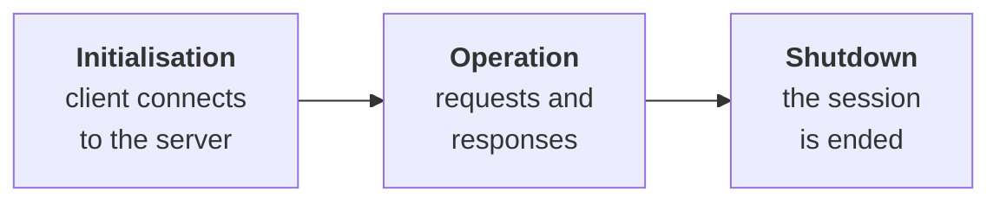
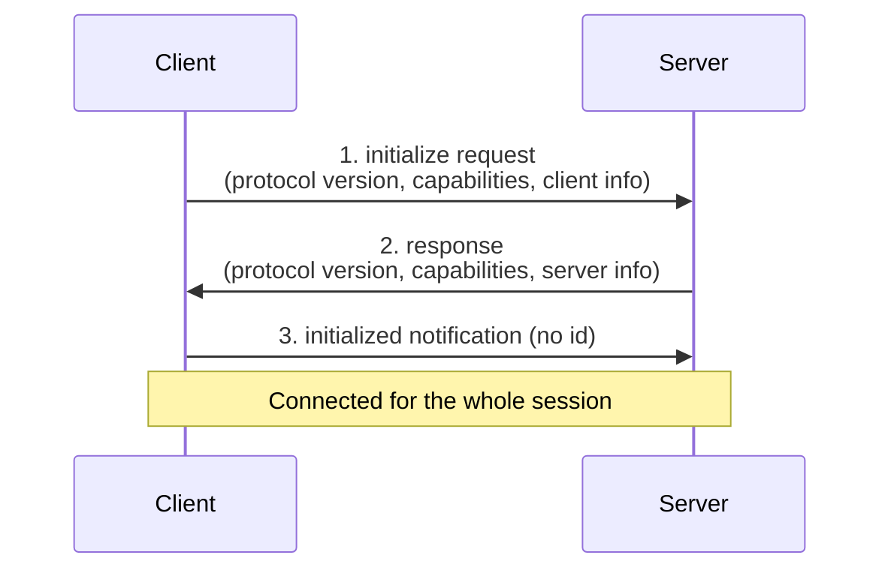
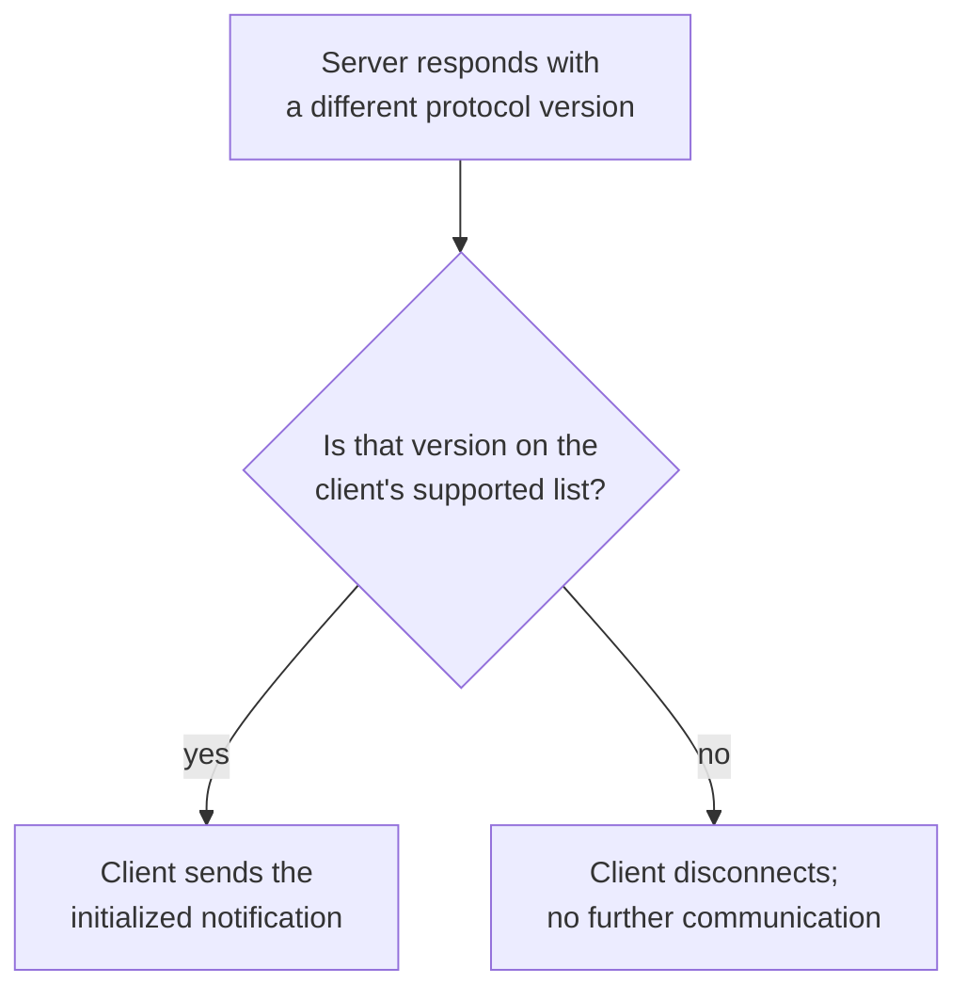
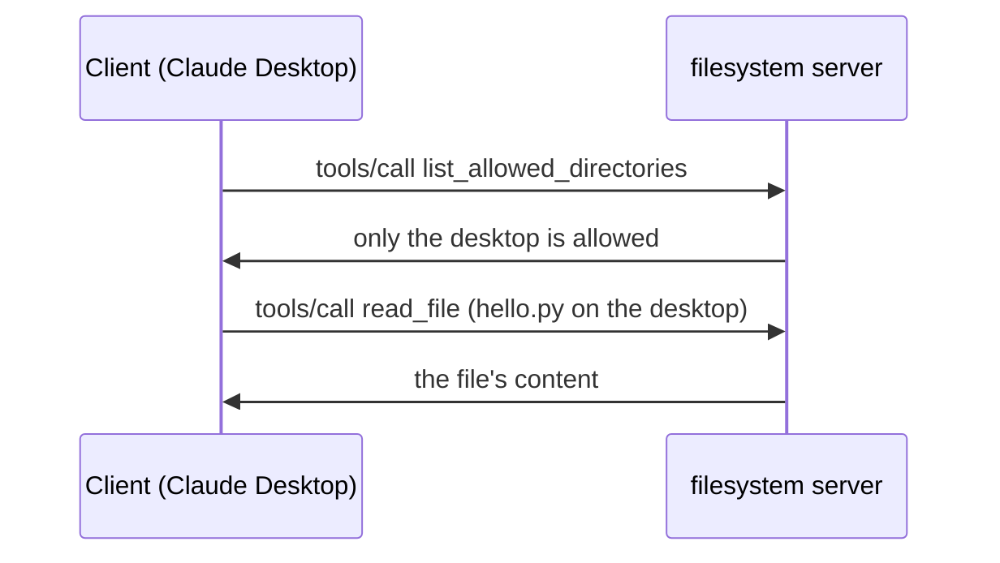
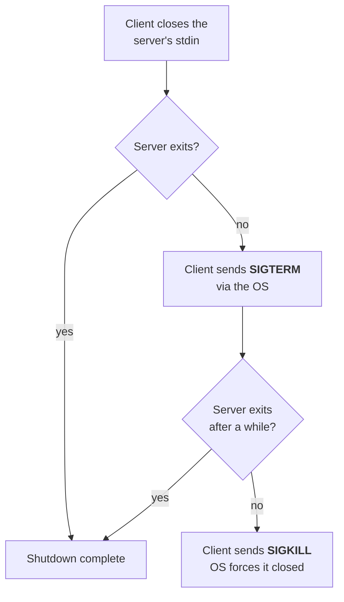
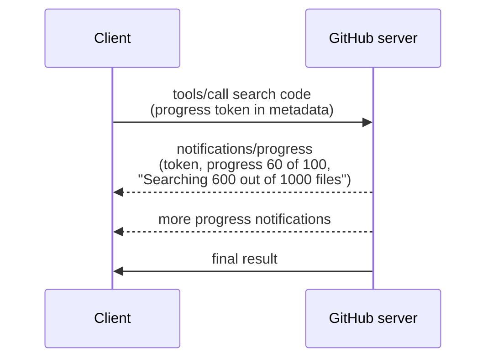

> **Video 4 of 8** · [Watch on YouTube](https://www.youtube.com/watch?v=sBHeMcxupmE) · Translated from the
> Hindi transcript. Notes follow the video section by section, in its order.

This video shows how the host, client and server from the architecture video work together, step by step and in what order, so that MCP functions properly: the MCP lifecycle.

## Where this video fits

The playlist has covered two important things so far: in detail, **why MCP is needed**, and then, in the last video, MCP's **architecture**: what a host is, what a client is, what a server is. This video takes the journey forward with a very important concept, the **MCP lifecycle**: how that whole architecture works together, which things are done step by step, and in what order, to make sure MCP functions properly.

Later, when you code your own servers and clients, this video will be very useful, because that coding builds on today's material. Watch it end to end.

## What the MCP lifecycle is

The definition:

> The MCP lifecycle describes the complete sequence of steps that govern how a host and a server establish, use and end a connection during a session.

First, what a **session** is: **one continuous connection between the client and the server**. Suppose your host is **Claude Desktop** and you have connected a **GitHub server** to it. When you start Claude Desktop, it automatically connects to the GitHub server behind the scenes, and until you close Claude Desktop, a continuous connection stays open between the two. That connection is the session.

The **MCP lifecycle** is the sequence of steps followed during that session to **establish, use and end** the connection: the step-by-step rule book for how the MCP architecture works during a session.

## The three stages

The lifecycle has three stages:

1. **Initialisation.** At the start of a session, the host or client tries to connect to the server.
2. **Operation** (normal operation). You send the user's questions to the server and the server responds.
3. **Shutdown.** The session, the continuous connection, is broken, either by closing the host (you close Claude Desktop) or by shutting down the server. Shutting down the server is often not in your control, so shutdown mostly happens when you close the host, the client.



## Phase 1: initialisation

In initialisation, the client and server interact **for the first time**. The MCP documentation says:

> The initialisation phase must be the first interaction between the client and the server.

Two things happen in this phase.

1. **Version compatibility.** MCP is a protocol that is continuously evolving, so different versions of it exist. First you check whether the client and the server are on the **same protocol version**. If they are not, then later, during normal communication, when you call methods, some code may blow up. That is why this is checked first.
2. **Capability exchange and negotiation.** The client tells the server everything it can do, and the server tells the client everything it can do.

You can call the whole initialisation phase a **handshake**: the two sides shake hands and agree on the terms of how they will communicate in future.

It breaks down into three steps.

### Step 1: the client sends an initialize request

The client calls a method on the server named **`initialize`**, and sends three important things:

- its **protocol version**, which is written in the format of a **date**;
- its **capabilities**, meaning what it can do for the server. Two are sent here:
  - **roots**: giving the server access to a directory on the host system;
  - **sampling**: if the server ever needs AI, it can get the work done through the host's AI.

  These are somewhat advanced concepts, covered later. For now: the client tells the server what it can do for it.
- its **implementation info**: the client's **name** and the **version** it is currently on.

```json
{
  "jsonrpc": "2.0",
  "id": 0,
  "method": "initialize",
  "params": {
    "protocolVersion": "YYYY-MM-DD",
    "capabilities": {
      "roots": {},
      "sampling": {}
    },
    "clientInfo": {
      "name": "...",
      "version": "..."
    }
  }
}
```

### Step 2: the server responds

As soon as the request reaches the server, the server responds and tells the client **the same three things** in return:

- its **protocol version**, so both parties know which MCP version they are operating on;
- its **capabilities**: here, the **tools** capability (it has some functions the client can use) and **resources** (which the client can also use);
- its **implementation info**: its name (it is a **filesystem** server) and its version.

### Step 3: the client sends the initialized notification

Once this succeeds (the client's request went to the server and the server's response came back), the client's responsibility is to send a **notification** back to the server to say the connection is successful. This is the **`initialized` notification**. Being a notification, it has **no id**, so the server does not need to reply. Once it is sent, the client and server are **connected for the whole session**, and the client can get any work done by the server as it wishes.



### Two rules during initialisation

1. > The client should not send requests other than pings before the server has responded to the initialize request.

   While the client is sending the initialize request in step 1, it cannot send anything else: it cannot call a tool, and it cannot ask for the list of tools. The one thing allowed is a **ping** request, which is explained later in this video; it is a very small thing.

2. > The server should not send requests other than pings and logging before receiving the initialized notification.

   Until step 3 happens, the server may not say anything else. It too can do two things: send a **ping**, and send **logging** statements, if it has something to log or tell.

In summary: until steps 1, 2 and 3 have happened, the two parties may not exchange any other kind of message. If other messages were exchanged, the system could crash, because a proper handshake has not happened yet.

## Demo: watching initialisation in Claude Desktop's logs

The setup:

- **Claude Desktop** is installed, and an MCP server called **filesystem** is installed in it. With this server you can work with files at any location on the machine: find out how many files are on the desktop, or create a new file on the desktop or elsewhere. It helps with manipulating the filesystem.
- It is a **local server**, running on the same machine, so all the communication between Claude Desktop and the filesystem server goes through **stdio**.
- A terminal on the right runs a command that shows the logging Claude Desktop performs behind the scenes. Those logs show which **JSON-RPC messages** are exchanged between the client (Claude Desktop) and the server (filesystem). The command is a big one and does two jobs: it **filters** some log messages and **beautifies** the output, because raw terminal output shows many things together and is hard to read.

On starting, Claude Desktop connects to the filesystem server, and during that connection the whole handshake, the initialisation phase, takes place. Start Claude and watch the terminal:

1. The client hits the **`initialize`** method on the server. It gives its protocol version; it shares **no capabilities**; and it shares its implementation info: its name is **claude-ai**, its version, it speaks **JSON-RPC 2**, and the **id of the request is 0**.
2. The server replies with its protocol version, which is **a different one**. So there is a bit of a **protocol mismatch** here (how that is handled comes shortly), but the communication still went through. In its capabilities the server says it has **tools**, **no prompts** and **no resources**. Its implementation info gives its name as **secure-filesystem-server** and its version. Again JSON-RPC 2, and the id is exactly the same as the request's.
3. The client immediately fires a notification called **`initialized`**, **without an id**.

Those are the three steps. More messages appear after these, which are explained once the theory is covered. The point is that as soon as the client starts, it tries to connect to the server behind the scenes, and exactly what was studied in theory happens.

## Version negotiation

In the demo, the client shared a protocol version with the server, and the server shared a different one. What happens on a mismatch is called **version negotiation**.

The client's request carries one protocol version; the server's response carries a different one. The client then goes to its **config** and checks which MCP versions it supports, and whether the server's version is on that supported list:

- If it **is**, the client sends the **initialized** notification.
- If it **is not**, the client **disconnects** from the server at that point, and no further communication happens.



In the demo, the client supported the version the server sent, so the connection was established and the conversation could continue.

## Capability negotiation

> Client and server capabilities establish which protocol features will be available during the session.

During initialisation, the client and server tell each other which capabilities they have, and this matters for all further communication: the client learns what it can demand from the server, and the server learns what it can demand from the client. **Expectations get set.**

### Client capabilities

The client mainly provides three capabilities.

**1. Roots.** The client gives the server access to its base directory. Say you are working in the **Cursor IDE**, an AI host with a client running inside it, and you connect it to the filesystem server. During that connection, Cursor gives the server its **roots**: access to the project folder you are building in. Later, if the user says "create a new file", the filesystem server has access to that base directory and can create files or make changes there.

**2. Sampling.** As the last video said, MCP is a **bidirectional** protocol: it is not only the client that sends requests to the server; sometimes the server sends a request to the client. Sampling is one such case: the server asks the client for help. If the server ever needs AI, it can ask the client, because the client has its own AI. Example: you ask the server to summarise all the documents on it, and there are thousands of them. Rather than implementing its own AI, the server tells the client to generate the summary, and the client generates it through its AI. This is an advanced concept, studied later and shown practically.

**3. Elicitation.** The server can ask the client for **incomplete information**. Say the client is connected to a GitHub server and asks it to fetch the names of all the repositories in your GitHub account, but gives **no API key** to connect to GitHub. The server sees that incomplete information has arrived and sends back a message saying it also needs the API key. The server is requesting the missing information from the client. Again an advanced concept, discussed in detail later.

### Server capabilities

The server offers four main capabilities. Three have already been discussed:

- **Tools**: to get some work done by the server.
- **Resources**: to fetch some static document.
- **Prompts**: to understand how to get work done by the server.
- **Logging**: the server can send **logging statements** to the client. Say the server is doing a **long-running task**, such as a **train booking**, which has multiple stages: filling the form, making the payment, the confirmation arriving. The server keeps telling the client periodically: the form has been filled (a log goes to the client), the payment has been made (another log), the confirmation has come (another log). It is the same logging you know from Python, but with the server: it can log statements and send them to the client. Covered in future.

### Sub-capabilities: `listChanged` and `subscribe`

There are also **sub-capabilities**, two of them: **`listChanged`** and **`subscribe`**. (They were on the slide earlier.)

- **`listChanged`**: suppose the server had **five tools** when you connected, and during the session a new tool is added. The server fires a **notification** to the client saying it has a new tool. Likewise if it had five resources and a sixth is added, it notifies the client that a sixth resource has been added. It is a way of saying something has been **added to or removed from** the server.
- **`subscribe`**: when a particular resource changes, the server sends a notification about it to the client. Say you are connected to the GitHub server, and the **README** file of one of your repos, listed as a resource on the server, changes. The notification of those changes is sent to your client, because it is subscribed.

These are quite practical, and this is only an overview; later in the playlist, when you build your own servers and clients, these features are built and shown, which makes them much clearer.

So during initialisation, capabilities are **negotiated**, expectations get set, and further communication between client and server happens properly.

## Phase 2: operation

> During the operation phase, the client and the server exchange messages according to the negotiated capabilities.

Whatever was agreed during initialisation is the basis for all communication in the operation phase. Two things to keep in mind:

1. **Respect the negotiated protocol version**: frame your JSON-RPC messages according to that version's guidelines.
2. **Use only the capabilities that were successfully negotiated**: talk only about what each side said it could do.

The operation phase divides into two parts.

### Part 1: capability discovery

So far the server has said "I support tools, I support resources, I support prompts", but the client does not yet know **exactly which tools** (or resources, or prompts) are available inside. **Capability discovery** finds out. The client sends a JSON-RPC request:

- to learn the tools, it hits **`tools/list`**;
- to learn the resources, **`resources/list`**;
- to learn the prompts, **`prompts/list`**.

The server replies with a message like: *these are the tools I support: list repos, get file, search code, create issue, list PRs.* This is how you find out exactly which tools and resources the server offers.

**Capability discovery happens automatically**: as soon as initialisation ends, the client makes this request by itself.

### Back to the demo: the extra messages explained

That explains the extra messages in the logs after the three initialisation steps. First the client sent the initialize request, the server replied, and the client said the connection is established. Immediately after that, the client fired **three batch requests**: **`tools/list`**, **`prompts/list`** and **`resources/list`**, with **ids 1, 2 and 3**.

The server's response to id 1 lists all its tools, with each tool's **description**, what it expects as **input**, some additional properties and its **schema**: **`read_file`**, **`read_multiple_files`**, **`write_file`**, **`edit_file`**, **`create_directory`**, **`list_directory`**, **`directory_tree`**, and so on. The server sends the complete details of every tool, every function, it has.

To the second request, the list of prompts, the server returns **"Method not found"** with an error code, and the same for resources. Right at the start, the server said it had only the **tools** capability, but Claude still asked which prompts and resources it had. Since the server has neither, it sent back the method-not-found error both times.

So capability discovery happened automatically, triggered as soon as initialisation ended. The client passes the complete list of tools to the host, the host stores it, and in future, when a user request comes in, it works out which tool from that list is best for the task and calls it. That is the second part of the operation phase.

### Part 2: tool calling

Suppose the user asks: *"There is a file on my desktop named hello.py; what is written in it?"* The client forms a request that hits the **`tools/call`** endpoint, says **which specific tool** it wants, and sends whatever **arguments** that tool needs. The server serves the request and extracts the file's content.

### Demo: reading `hello.py`

The question to Claude: *"Can you tell me what's written in the hello.py file on my desktop, which is located on my desktop?"* After pressing enter:

1. Claude asks for permission; choose **Allow once**.
2. The client hits **`tools/call`** on the server for **`list_allowed_directories`**: first, tell me which directories I have permission to access. The server replies that it can currently access **only the desktop**.
3. Claude asks permission to use another tool. With that information, the client calls **`read_file`**, asking for the content of `hello.py` on the desktop.
4. The server responds with the code written in that file, and Claude displays it.



That is the operation phase: first you **discover capabilities** (exactly which tools, resources and prompts exist), then, as your requirement demands, you **call** a particular tool or resource and the server responds.

## Phase 3: shutdown

In the shutdown phase the session between client and server is **terminated**, and there are only two main reasons: the **client shuts down** or the **server shuts down**. Generally one side initiates the shutdown, and **typically that is the client**; the server generally does not end the session.

An interesting point: in the shutdown phase, **the client and server exchange no JSON-RPC messages**. In initialisation and operation, the heavy lifting of communication was done through JSON-RPC messages, but here there are none. The entire responsibility for shutdown belongs to the **transport layer**.

Recall the two kinds of server: **local servers** run on your machine and use the **stdio** transport; **remote servers** run on another machine and use **HTTP**. Here is how the transport layer performs shutdown in each case.

### Shutdown with stdio (local servers)

Say you are working with a local server, **filesystem**, and need to shut down.

**Client-initiated shutdown** (what generally happens):

1. The client **closes the server's input stream**, its **stdin**. As covered in the last video, with stdio the client starts the server as a **subprocess**, so the client controls the server's stdin and stdout. It closes the input stream from its side and **waits for the server to exit**.
2. If the server does not exit, the client uses the **operating system**: it sends a low-level signal called **SIGTERM** (signal terminate), asking the OS to tell the server it has to shut down.
3. The client waits a while. If the server still does not close, it sends another low-level signal, **SIGKILL** (signal kill), forcing the OS to close the server.

The difference: **SIGTERM** is politely telling the server "pick up your things and go"; **SIGKILL** is saying angrily "get out right now".



**Server-initiated shutdown** (the slide mislabels this as client-initiated too, and it should say "may", not "should"): sometimes the server **may** close its output stream to the client and exit on its own. This is **rare**, so do not focus on it much; the client-driven case above is far more common. Generally the client controls shutdown, not the server.

### Shutdown with HTTP (remote servers)

- **Client-initiated** (the common case): the client **closes the HTTP connection** it has open to the server.
- **Server-initiated**: if the remote server wants to shut down, it closes the HTTP connection from its side. The client should be **prepared to handle such a dropped connection**. A shutdown from the server's side means something went wrong there and it closed suddenly, perhaps from overloading or any other reason, possibly **mid-process**. So the client should be able to handle it properly: close any running task **gracefully** and **try to reconnect** to the server.

There is nothing more special here. When the client initiates the shutdown, as is common and as it should be, it simply terminates the POST connection it made over HTTP. That is all that happens in the HTTP version of the transport layer.

### Demo: shutdown in the logs

In the same example, do nothing except close Claude Desktop. As soon as the client closes, shutdown is triggered automatically and appears in the logs: an event reading **"Server transport closed"**, with no metadata for now. The thing to observe: **no JSON-RPC message** appeared during shutdown, as the theory said.

The whole terminal window now shows the entire MCP lifecycle: **initialisation, operation, shutdown**. That is the regular flow you will generally see: the conversation starts with initialisation, operations are performed, then shutdown happens.

## Special cases

Sometimes special cases come up during the lifecycle. Four of them follow.

### Pings

> A ping is a lightweight request-response method defined in MCP.

Its purpose: **to check whether the other side (host or server) is still alive and the connection is responsive.** Sometimes long-running tasks are going on and there is a connection, but no message has been exchanged for a long time. In that case one side periodically sends pings to the other.

A ping request has JSON-RPC version 2, an **id**, and the method name **`ping`**. It can be sent **by the client to the server or by the server to the client**; both are possible. Whenever one party sends a ping, the other party must respond, with the **same request id** and an **empty result**, because it is a ping.

```json
{
  "jsonrpc": "2.0",
  "id": "...",
  "method": "ping"
}
```

```json
{
  "jsonrpc": "2.0",
  "id": "...",
  "result": {}
}
```

When ping is useful:

1. **Checking whether the other side is up before full initialisation.** While establishing the connection, either the server or the client can send a ping, and in fact they do.
2. **During long-running tasks.** If the server is doing a long-running task and client and server have not talked for a long time, the client can send **periodic pings** so the connection does not **silently drop**. If there is no active communication between the two, the operating system, a proxy or a firewall may decide the connection is not needed and close it. Pinging makes the OS or proxy see active communication and keep the line running.

### Error handling

A request will not always be correct and get a correct response; sometimes something goes wrong.

> Error handling in MCP is how the host and server signal that something went wrong with a request.

MCP handles errors **the same way JSON-RPC does**; in fact MCP has **inherited the entire standard error object of JSON-RPC**. The error codes you would see from JSON-RPC in any other distributed system are the ones you see in MCP.

Where errors can come from, the most common scenarios:

1. **Initialisation**: the protocol version **mismatches** between the two parties, and you have to handle an error right there.
2. Calling a **method the server never told you about**, never negotiated.
3. Calling a particular tool with an **invalid argument**.
4. **Something went wrong with the server**: it went down, an internal server failure while processing the request.
5. **Timeout exceeded**: the client decided in advance how long it would wait for a response, and the response took longer. (Timeouts are covered shortly.)
6. The JSON-RPC message sent by the client or server has a problem in its **syntax**, or was not formed properly at all.

There can be other scenarios too.

A typical MCP **error object** has the JSON-RPC version, the id of the request it belongs to, and a dictionary called **`error`** with three things:

- **`code`**: what kind of error it is;
- **`message`**: telling the other party what the mistake was;
- optional **`data`** that helps with debugging.

```json
{
  "jsonrpc": "2.0",
  "id": 2,
  "error": {
    "code": -32601,
    "message": "Method not found",
    "data": "..."
  }
}
```

The demo already showed one: when the client asked the filesystem server for its prompts, the reply was an error object with the message **"Method not found"** and a code, but no `data`, because it is optional.

**Common error codes.** Just as HTTP has 404 (not found) and 500 (server failure), JSON-RPC has standard error codes:

| Code | Meaning |
| --- | --- |
| **-32601** | Method not found (exactly what the demo showed) |
| **-32602** | Invalid parameters sent to the tool, e.g. it needed a file and you sent a path |
| **-32600** | Invalid request |
| **-32700** | The request body is not valid JSON |
| Beyond 32000 | Can be authentication failure, rate limit exceeded, quota errors, internal issues, anything |

:::note

The video describes **-32600** as "the method you are hitting does not exist at all". In JSON-RPC, a missing method is **-32601** (Method not found); **-32600** (Invalid Request) means the JSON sent is not a valid request object. Also, the range reserved for implementation-defined server errors is **-32000 to -32099**.

:::

You do not need to memorise much, but you should have a rough idea of the common codes; the description explains the rest.

### Timeouts

Suppose the client sends a request and the server takes too long to respond. The user keeps sitting and waiting, which is not good. So you define a **threshold**, a **timeout**: after this much time you stop waiting and **cancel the request**.

> Timeout is about ensuring requests don't hang forever.

Its purposes:

1. **Avoiding an unresponsive or overloaded server.** A remote server may have many clients connected and be taking a long time to handle your request. You will not wait forever; you cancel and tell the user.
2. **Freeing resources.** The memory and CPU used to keep the request going should not be held indefinitely; you free them as soon as you know the response is not coming.
3. **Feedback to the user.** You can tell the user something went wrong. Otherwise the poor person sits for hours thinking the response will come some time.

How it works step by step:

1. When you write a client you use an **MCP SDK**, which lets you set a timeout inside the client **per request**. Say you set **30 seconds** for a particular request.
2. The client sends the request, and the server takes more than 30 seconds to reply.
3. The client triggers a timeout. Behind the scenes, it sends the server a **cancellation notification**: stop whatever previous request I sent; I do not want its answer.
4. The server stops processing that request and does not send any answer.

Example: the client sent a request to **scan all the files in the entire codebase and say which files contain the term MCP**. With a very big codebase the server takes a long time, and the timeout threshold is crossed. The client can then send a cancellation notification: JSON-RPC 2, the method name **`notifications/cancelled`**, and in params the **request id 7**, because the original request had id 7, plus the **reason**: the timeout was exceeded, it went beyond 30 seconds.

```json
{
  "jsonrpc": "2.0",
  "method": "notifications/cancelled",
  "params": {
    "requestId": 7,
    "reason": "Timeout exceeded (30s)"
  }
}
```

### Progress notifications

Sometimes the client gives the server a **long-running task**, and it would be good if the server kept telling the client periodically how much progress has been made.

Example: you are connected to the GitHub server and say: *"This is my repository; scan all its files and tell me which files have security vulnerabilities."* That is a long-running task, checking every file in the codebase. It would help to be told: *tracked 200 out of 400 files*, then *250 out of 400*, then *300 out of 400*. The user then knows how long it will take and how much is done. That is the benefit.

> The purpose of progress notification is to let the client know that a long-running request is still making progress.

The process:

1. When the client makes the request (scan all the files of my repo), it adds a **progress token** to the request's **metadata**. Here the request uses the **search code** function to scan a particular repository, with a progress token in the metadata. The token's name can be anything.
2. The server understands it must keep giving updates. It fires **`notifications/progress`** notifications. Being notifications, they need no id for a reply, but they must report progress against that particular token, so the params carry the **progress token** and the **progress** (for example, 60 out of 100) and can also carry a **message**, such as *"Searching 600 out of 1000 files"*: 60% of the work is done.
3. The client receives the notification and shows it to the user, nicely formatted, so the user has **real-time feedback** on how far the work has progressed.



An example from outside MCP (it is not known whether MCP is used behind the scenes): the **research assistant** in ChatGPT or other chatbots shows a **progress bar** after you enter a query, how much research is done and how much is left, so you know how long to wait. It is purely for a **better user experience**; the work happens behind the scenes either way, but progress notifications give the user better feedback.

## What comes next

That covers the MCP lifecycle, and with the why, the architecture and the lifecycle studied, it is time to code. From the next video the playlist moves into practical work: building your own **MCP servers** and your own **MCP clients**.
