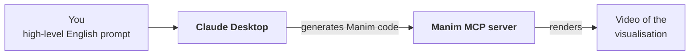

> **Video 5 of 8** · [Watch on YouTube](https://www.youtube.com/watch?v=y-uPv3ltOTY) · Translated from the
> Hindi transcript. Notes follow the video section by section, in its order.

This video starts the practical "how" of MCP by experiencing client-server communication with readymade pieces only: Claude Desktop as the client and existing MCP servers on the other side.

## Where this video fits

The playlist is split into three parts: **why** MCP is needed, **what** MCP is, and **how** to use it practically. The "why" is done, and so is the "what", which covered two things: the **architecture** of MCP and the **lifecycle** of MCP. This video begins the "how" part, which explains in detail how to implement MCP in your own project.

The "how" part is planned as three videos, and all three look at the same thing: in MCP, all communication happens between a **client** and a **server**.

1. **This video.** Both sides are readymade. The client is **Claude Desktop**, and the servers are existing ones such as the Google Drive server. You build neither your own client nor your own servers; you purely experience MCP with readymade tools.
2. **Next video.** The same communication again, but this time you build your **own MCP server** and connect it to Claude Desktop.
3. **Third video.** The same client-server communication once more, but the client is also yours: instead of Claude Desktop you build your **own MCP client**, which talks to your own MCP server.

Together these three videos are meant to cover the entire "how" of MCP.

## Plan of action

First install Claude Desktop on your machine, then connect it to **four different MCP servers**. Recall that there are two kinds of server: **local servers**, installed on your machine, and **remote servers**, which live somewhere on the internet. The plan is two of each:

- **Local:** a **file system** server, which lets you manipulate different directories on your machine; and a very interesting server called **Manim**. You may not have heard of it, but it is fun to watch.
- **Remote:** the **Google Drive** server, which lets you manipulate your Google Drive account; and the server for **X (Twitter)**, which lets you read tweets and post your own.

Why two of each, when one local and one remote would have shown the idea? There is a strong reason, and it needs the concept of **connectors**.

## Two ways to connect an MCP server to Claude Desktop

Any MCP server can be connected to Claude Desktop in two ways.

**1. The configuration file.** This is the first and most normal way. AI hosts such as Claude Desktop or the Cursor IDE have a config file, which is a JSON file. You open that JSON file and add your MCP server's details to it. This was shown in some past videos.

**2. Connectors.** This second way has arrived more recently. In simple words:

> A connector is a built-in feature that links Claude to MCP servers automatically, without the need for manual setup and configuration.

With a connector you do not open any configuration file or make any edits. You press a button, and Claude Desktop is connected to the MCP server.

### Why connectors exist

Most of Claude's users are **non-technical end users**. They do not want the hassle; they just want to use Claude Desktop and connect it to their existing applications, such as Google Drive, Notion or Slack, so that Claude Desktop can take context from those applications.

The problem is that connecting an MCP server needs a little technical knowledge. You have to open the configuration file, go to the MCP server's GitHub page, pick up the configuration details and paste them into the config file. That is a difficult job for a non-technical user.

So Anthropic thought: what if we build direct connectors for the common SaaS tools that almost everyone uses? Then, instead of the configuration path, you click a button and the MCP server is connected. The connector system handles all the technicality behind the scenes: authentication, getting you signed in, handling API keys. As an end user you only press a button.

With connectors, connecting to MCP servers becomes:

- **Easier**, because there is nothing technical to do.
- **Safer**, because the Anthropic team wrote all of this code themselves, so they ensure its safety.
- **More consistent.** On the config-file route, a server you had edited in often did not load properly when you ran it. Through a connector, it works correctly far more often; the performance stays consistent.

You can think of connectors as an **app store for MCP servers**. Open Claude Desktop or ChatGPT and there is a plus option that says "connect tools", with some tool names listed underneath. That listing says: these are the MCP servers you can connect directly to your AI host.

### Why not force every MCP server to use a connector?

If connectors are so good, why keep the JSON-file option at all? Why not make every MCP server connect through a connector? There are two reasons.

**Reason 1: connectors are curated and managed.** Every connector you see is for a famous SaaS tool: Google Drive, Notion, Canva. The Anthropic team knows everyone uses these, so they took these MCP servers and built a connector wrapper around each one, so that the end user gets connected with a single click. But the Anthropic team had to write that entire code, host it and maintain it. On top of that, building a connector means handling **OAuth login flows**, looking after **security patches**, doing **rate limiting**, and making sure the whole experience of using the MCP server stays **stable**. All of that takes effort.

Now imagine forcing every MCP server to have its own connector. There are thousands of MCP servers in the world, and 10 to 15 new ones, maybe more, arrive every day. The Anthropic team would have to write a connector around every one of them. That is not scalable at all; one company cannot sit and build connectors for every MCP server in the world.

**Reason 2: MCP is an open standard.** From day one, MCP promised that anyone can build their own client and anyone can build their own server. If MCP servers had to wait for a connector before they could be used with software like Claude Desktop, that would close the ecosystem. Picture it: you build your MCP server but cannot connect it to Claude Desktop directly. You submit it to Anthropic, their team reviews it, builds a connector around it, and only then can your server be used with Claude Desktop. At that point there is no benefit in MCP being an open standard. All the control sits with Anthropic, who decide whose MCP server runs and whose does not. That would be a very big flaw.

That is why both options exist:

- For the standard SaaS products everyone uses, the Anthropic team builds **connectors** so you can connect easily.
- For your company's own MCP servers, or ones you have built personally, you use the **JSON configuration file** approach. The benefit is that you can build a server today and connect it to Claude Desktop the same day.

### The answer to "why two of each"

This is why the plan has two local and two remote servers: among the local ones, one is connected **through a connector** and one **through the JSON file**; the same among the remote ones. The aim is to give you an experience of every possible combination.

| | Through a connector | Through the JSON config file |
| --- | --- | --- |
| **Local server** | Filesystem | Manim |
| **Remote server** | Google Drive | Twitter (as first planned) |


## Installing Claude Desktop

Search Google for "Claude Desktop download" and download it from the link that comes up, choosing the Mac or Windows build for your operating system. It is a simple install; install it and sign in. The interface is almost exactly the same as ChatGPT's; nothing new.

### Where connectors live

Since connectors were just discussed, here is where to find them. Click the **"Search and tools"** option. You will see options to connect to some tools directly: **Drive**, **Gmail** and **Calendar**. For any other tool there is an **"Add connectors"** option, which offers many MCP servers you can connect through connectors, in two groups:

- **Desktop extensions**: these are **local** MCP servers.
- **Web**: these are **remote** MCP servers.

There is a lot there: Asana (a famous tool), Atlassian, Box, Canva, Gmail, HubSpot, Hugging Face, and Indeed for jobs. Many integrations are already available and more are being added gradually, so explore this once.

Now the plan runs step by step, one server at a time.

## Server 1: Filesystem (local, connector)

Connecting the file system MCP server is very easy because a readymade connector exists for it.

1. In Claude Desktop, click the tools icon and go to **Add connectors**.
2. Under **Desktop extensions** you will see a connector called **Filesystem**. Click it and install it. It is a small install and finishes instantly.
3. Tell it **which directories** it may access.

Installing Filesystem does not give it access to every directory on your machine. By default you have to say which folders it can reach. Here the **Desktop** is given access, which means the Filesystem MCP server can access the files on the Desktop and create new files there, but has no access to any other location. This is a **safety feature**: if you give access to the whole computer and something goes wrong behind the scenes, you can suffer a lot of damage. You can add more directories if you want, such as your Downloads folder or the directory of a coding project you are working on. For the demo, only the Desktop is added.

4. Save. The extension is **disabled** at first, so **enable** it, then close the dialog.

:::warning

Whenever you connect a new MCP server to Claude Desktop, you have to **restart Claude Desktop**. Close it and start it again.

:::

After the restart, Filesystem appears under the connectors. Clicking it shows all the tools Claude Desktop now has access to. It is as if the **`tools/list`** function had been called and the list of tools fetched here. You can also switch off any specific tool.

### Demo: reading from the Desktop

The prompt: *"Can you tell me if there are any PDF files on my desktop?"*

This is the best part of MCP: whenever the host uses a tool from an MCP server, it first asks you, the user, for **permission**. Allow it.

Something goes wrong at first: it reports that it cannot access the desktop. After dismissing that warning it searches again. On the first attempt it finds no PDF files, and then it finds them: **five PDF files** on the Desktop. That is reading.

### Demo: writing a file to the Desktop

First a simple request: *"Write a code to print Fibonacci numbers in Python."* Claude writes the code, in two or three versions. Then a small follow-up prompt:

*"Now write the first version in a .py file and save it on my desktop."*

It writes the whole thing into a file; allow it. Checking the Desktop, the file is there, and opening it shows the code. This is how the Filesystem MCP server manipulates a particular directory on your machine.

These are very basic use cases. People use the file system server in very innovative ways. For example, your Downloads folder has been collecting files for three or four months and has turned into junk; you can ask Claude Desktop to organise it properly, and it will organise the whole thing. Or point it at a code project folder and it will summarise it for you instantly. Explore this yourself, and if you cannot think of a use, ask ChatGPT or Claude; you will very likely find one that suits you.

## Server 2: Manim (local, JSON config file)

### What Manim is

At some point in your data science journey you have probably watched a video from the YouTube channel **3Blue1Brown**. It mostly has mathematics videos, with some on neural networks and LLMs too. Its biggest USP is that mathematical concepts are explained through very strong **visualisation**: complex mathematics made understandable visually.

Being a teacher too, the natural curiosity on first following that channel was: how does this person create such good visualisations? In one of the videos, it seems, the creator said that he uses a **Python library called Manim**, and with Manim he codes the entire visualisation himself. That is very difficult. Having tried it in the past, coding visualisations like the ones on that channel by hand is very hard.

What has changed recently is that **LLMs are good at coding**, so you can get Manim code generated by an LLM. With MCP you can go one step further, because there is an **MCP server for Manim** that you can connect to Claude Desktop:



You write in plain English that you want to understand some mathematical concept visually and send that prompt to Claude Desktop. Claude Desktop, connected to the Manim server, generates the Manim code and sends it over, and the Manim server makes a video of the visualisation and gives it back. **Input: an English sentence. Output: a video**, looking almost like the ones on 3Blue1Brown.

This server has been in regular use here for about a month and a half. Whenever a mathematical concept needs understanding, a prompt is generated, the visualisation is produced from it, and learning has improved a lot since.

### Setting it up

Search Google for "Manim MCP server" and use the server at the first link. It was built by an individual; **it is not an official server**. Its README explains properly how to connect it to Claude Desktop.

This is a **local server**: you first clone its Git repository onto your machine, and once the folder is on your machine you connect it to Claude Desktop. You need three things: **Python**, **Manim**, and the **tools for using MCP**. Step by step:

1. Open a terminal (on Windows, the command prompt) and install Manim. Here it is already installed, so pip reports "requirement already satisfied".

    ```bash
    pip install manim
    ```

2. Install MCP. Also already installed here.

    ```bash
    pip install mcp
    ```

3. Clone the Manim server repository. Clone it onto the **Desktop**, because Claude has access to the Desktop: first go to the Desktop, then run the clone command copied from the repository page. The Manim MCP server folder now appears on the Desktop.

Now comes a little technical work. There is **no connector** for this server, so you use the earlier method: add the server to the JSON file manually. Copy the configuration snippet from the README and paste it into Claude Desktop's JSON file:

4. In Claude, go to **Settings → Developer → Edit Config**. This locates the JSON file. Open it in VS Code and paste in the whole snippet.
5. Fill in three paths in the snippet:
    - The **absolute path of Python**. In the terminal, run `which python3`, then copy and paste the result.
    - The location of **Manim's executable** (on Windows this is `manim.exe`; this machine is a Mac). Run `which manim` and paste the path it shows. On Windows you will most likely just need to put your username into the path.
    - The path of **`manim_server.py`**. `cd` into the Desktop, then into the Manim MCP server folder, then into its `src` folder, and run `pwd`. The path (here under user Nitish, Desktop) is what goes in.

    ```bash
    which python3
    which manim
    pwd
    ```

6. Save and close the file, and close Claude Desktop too, since a new MCP server always needs a restart.

After the restart, the Manim server shows up as integrated.

### Demo: a vector transformation animation

The test prompt, written in advance, asks Claude to *"use the Manim server to create an animation showing the concept of vector transformation in linear algebra"*, and spells out the steps:

- first make a **2D coordinate grid**;
- draw the two **basis vectors i and j** in it;
- apply a given **matrix transformation**;
- show the whole grid **bending**, and show the **new vectors** being formed;
- add a given **title**.

After pressing enter, Claude starts writing Manim code: exactly the code 3Blue1Brown would have to write by hand. Here Claude writes it and will also execute it and generate the video. Some warnings appear, which is a little concerning; allow it, and the Manim code runs.

One issue: **LaTeX is not installed** on this machine, so mathematical symbols will not print properly. Claude works around it in a way where the symbols may not look as good. If you want everything perfect you need to install LaTeX, but that is not advised here, because it is an install of around **10 to 15 GB**.

The video is made. Playing it: the two basis vectors **i** and **j**, the matrix, and then the transformation, with the whole grid moving according to the matrix. The new vectors should ideally be shown too, and they are: **i′** and **j′** are the new vectors.

It is a very simple, lovely visualisation, but the sky is the limit. Whatever concept you find difficult in machine learning or deep learning, you can visualise it: go to ChatGPT or Claude, describe your problem, get a prompt written for it, paste that prompt into Claude Desktop, and within a few minutes you have a visualisation that makes the concept much easier. This is exactly what 3Blue1Brown does, except that he also teaches. You can customise a lot too, such as a different theme or different kinds of text; Manim has many features. Using this library has improved learning output here a lot, and it is well worth using.

## Server 3: Google Drive (remote, connector)

So far, two MCP servers are connected, and both are **local**. Next come two **remote** servers, starting with the **Google Drive** server.

Adding it is again very simple, because Claude Desktop offers a direct Google Drive connector. Click the tools icon and you are directly offered an option called **"Drive search"**. Click it, and it takes you through Google's sign-in to authenticate. Sign in and you are done: clicking the icon again shows Drive search **enabled**.

### Demo: summarising a Drive document

There is a document on the Drive called **"AI newsletter content ideas"**. The prompt: *"Can you summarise the document from my Google Drive?"* Claude searches, finds the document and returns its summary. It is quite easy and quite useful: you can bring your Google Drive's context straight into Claude Desktop.

:::note

The Google Drive server is **read-only**. You can read any document on your Drive, but you cannot write anything there: no creating new files and no editing existing ones. It is still a very useful MCP server.

:::

## Server 4: Twitter / X (JSON config file)

Search Google for "Twitter MCP server" and click the link that comes up; it opens a GitHub repo with very simple instructions for connecting the server to Claude Desktop.

1. **Create a developer account on X (Twitter).** Click the link in the README (open it in a new tab) and log in to X. Once logged in you see your **developer dashboard**; you need this.
2. The README's **step 2** says to add a configuration to your Claude Desktop config file: a small piece of code to go into Claude's JSON file.

### A correction to the plan: this is a local server

Reading the whole README, it turns out this MCP server is **not a remote server; it is a local one**. The configuration says the command is **`npx`**, with the server's path in the arguments. What happens behind the scenes is that this MCP server is **npm-installed on your machine**. It feels as though you installed no local server yourself, but that piece of configuration does an npm install on your machine behind the scenes. So it is actually a local server. This was a mistake in the plan.

The **revised plan**: finish the Twitter server anyway, and then also connect an actual **remote** server, a **weather MCP server**, whose files sit on a remote server and run from there.

### Adding the Twitter configuration

3. Copy the configuration piece from the README. In Claude go to **Settings → Developer → Edit Config** and open the file in VS Code.
4. Paste it carefully **inside the `mcpServers` dictionary**. Where the bracket of the Manim server entry ends (blue in the editor), put a **comma** and paste after it, so that you stay inside the outer bracket (purple). This is the Twitter MCP entry.
5. Fill in **four secret keys**: **API key**, **API secret key**, **access token** and **access token secret**. You get these from the developer portal. You are in the **default project** (you can create a new project if you want); open it and click **Keys and tokens**, where all four are available:
    - Under **API key and secret**, click **Regenerate**, then copy the API key into the config, and the API key secret into its place.
    - Under **access token and secret**, click **Generate**, then copy the access token and the access token secret into their places.
6. Save.

:::tip

If this does not work on your machine on the first go, install **npm** once (it is a package manager). After that it will most likely start working.

:::

7. Close the file, close Claude Desktop and open it again.

The Twitter MCP server now appears with **two tools**: **post tweet** and **search tweets**.

### Demo: searching and posting tweets

The prompt: *"What are the top tweets on AI this week?"* Claude uses the Twitter MCP server; allow it. It creates a search term and searches tweets behind the scenes, then returns the most recent tweets on AI.

Next, posting: *"Post a tweet on my behalf saying Hello from CampusX."* Allow it. This fails:

```text
I wasn't able to post a tweet due to an authentication error. This suggests
the Twitter account isn't properly connected or authorized. There may be
permission restrictions on the account.
```

So there may be a setup issue; check whether it happens on your machine too. At least **reading works**. For writing, the permission has to be found in the documentation, probably in the settings. Under **user authentication settings** it says the app currently has only **read** permission; both **read and write** are needed, which means filling in that whole form. That is left for after the recording, but it shows the idea: this is how you connect the Twitter MCP server to Claude Desktop.

## Server 5: Weather (JSON config file)

Search Google for "weather MCP server" and click the second link. The setup is again very simple: add a piece of code to your JSON file. Before that, two things:

1. **Install uv** on your machine. It is already installed here, but you should install it:

    ```bash
    pip install uv
    ```

    The README also lists two dependencies to install; they turned out not to be needed here, so the server is set up without installing them.

2. **Get an AccuWeather API key.** Search Google for "AccuWeather API key", create an account (a **free account for around 15 days** is available, which is sufficient) and copy the API key it gives you.

Then copy the configuration snippet from the README, and again go to Claude → **Developer → Edit Config** → VS Code. This time put a **comma** after the previous entry and paste the snippet. Make **two changes** in it:

- Paste your **API key** in its place. (All the API keys shown during the video will be deleted after it is uploaded, so there is no need to worry about them.)
- In the **command**, replace `uvx` with the **full path of `uvx`**. Find it by running `which uvx` in the terminal and paste that path in.

```bash
which uvx
```

That's it. The reason this counts as a **remote server**: with the help of uv, the MCP server is run **from a path that does not exist on your machine**; it is a GitHub path.

:::note

Running a server with `uvx` from a GitHub source still downloads the package and runs it as a process **on your own machine**, talking to Claude Desktop locally. By the local/remote definition used earlier in this playlist (installed on your machine versus hosted on the internet), this weather server behaves as a local server that fetches its code from GitHub, much like the `npx` Twitter server. A remote MCP server is one hosted elsewhere that you connect to over the network.

:::

Save, close the file, close Claude Desktop and start it again. Clicking the tools icon now shows the **weather** tool.

### Demo: current weather in Gurgaon

The prompt: *"Can you tell me the current weather of Gurgaon?"* Claude calls a function from the weather MCP server, and replies:

```text
I'm having trouble accessing the weather services right now due to a
technical issue. Let me try searching.
```

It then falls back to a **web search**, pulling from three or four places. The underlying problem is an API-related issue; the tool shows **"Error calling tool"**. Trying to debug it did not help; it seems to be an issue with this particular machine. Hopefully it runs on yours. If it does not, say so in the comments, and a future video will show another weather tool running properly.

The video has already run long, with some unexpected work at the end, so it wraps up here.

## Finding more MCP servers

One last important thing: how do you find new MCP servers, or know whether one exists for a particular tool? Search Google for **"awesome MCP servers"**. You get a GitHub list with a fully up-to-date collection of all kinds of MCP servers on the internet, **divided into categories** so you can explore category by category. The Manim server used above was found there, and you will find many more hidden servers like it that can help a lot with your work. Think of it as a **discovery platform for MCP servers**. There are other websites and marketplaces with MCP server listings too.

The recommendation after this video: go fully into **exploration mode**. Install Claude Desktop, think of a workflow you want to automate with AI (like the **AI newsletter** idea mentioned earlier), and try to build it with the help of MCP.
