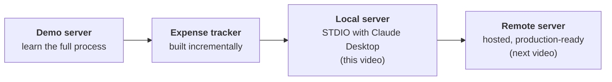
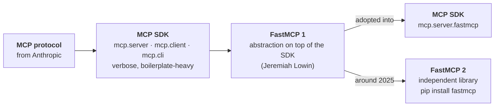
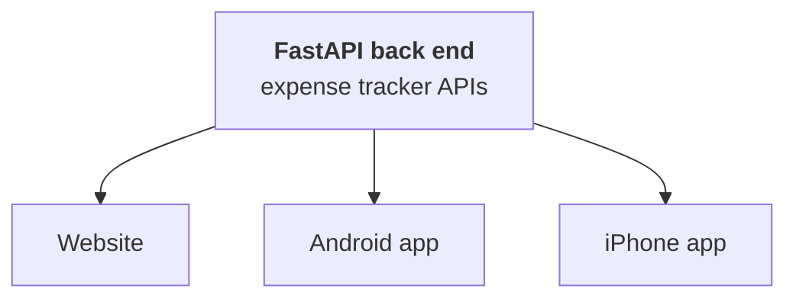

> **Video 6 of 8** · [Watch on YouTube](https://www.youtube.com/watch?v=tc2oOznpdE0) · Translated from the
> Hindi transcript. Notes follow the video section by section, in its order.

This video teaches you to build your own MCP server, a local one that runs on your machine and talks to Claude Desktop over STDIO, by building a useful expense tracker server step by step.

## Recap of the playlist so far

The playlist is divided structurally into three parts: **why**, **what** and **how**. Before these came a **trailer**, which automated a newsletter-creation process with MCP, just to inspire you to study MCP.

- **Why:** a detailed look at why MCP is worth studying, meaning what improvement it brings over older approaches.
- **What:** covered in two parts, first the **architecture** of MCP and then the **MCP lifecycle**.
- **How:** first announced as three parts, it has actually become three to four parts.

The previous video gave a practical flavour of MCP without building anything of your own: readymade servers such as the Google Drive server, with Claude Desktop as the client. Building your own servers takes two videos:

1. **This video:** only **local** servers.
2. **Next video:** **remote** servers, where you build a server, host it somewhere remotely, and anyone can then access it.

After that comes one more part of "how": building your own **MCP clients**, hopefully in a single video. Counting them up, today's video is the sixth, and some more advanced concepts may be covered once all these videos are made.

## What gets built: an expense tracker MCP server

YouTube videos on building MCP servers tend to be either very simple (a calculator-tool kind of server) or rather advanced. Since this is the first build, the choice is an **intermediate** one: moderate difficulty, but genuinely useful. The server is an **expense tracker MCP server**.

The idea is that you manage your expenses by talking to a chatbot such as Claude Desktop. You write in plain English, *"Today I bought milk for ₹20, add it"*, and it makes an entry in the database. Two days later you can ask *"how much did I spend in total in the last 7 days?"* or *"how much did I spend on entertainment this month?"*

Expense tracking is usually done through apps, where you fill in lots of forms to enter expenses and cannot ask natural questions like these; you read your spending off graphs. Here the whole process happens in natural language, because you have the power of LLMs.

### Demo of the finished server

The server was built some time ago and is in personal use, integrated with Claude Desktop (it appears under the tools icon as the expense tracker). A few sample queries:

- **Adding:** *"Add 500 travel expense for cab ride yesterday."* Completely natural language. Claude adds it to the database: amount 500, a category it deduces by itself, a note, and a date worked out from "yesterday".
- **Viewing:** *"Show me all expenses from September in tabular fashion."* Claude works out the start date (1 September) and end date (30 September) by itself, and returns a table: six expenses totalling 16,000.
- **Summarising:** *"How much did I spend in total in August on health?"* Category set to health, start and end dates set to August's. The reply: nothing was spent on health in August, and for comparison, 870 was spent on health in September.
- **One more:** *"How much have I spent on travel this month?"* ₹500 on travel. Claude also adds its own feedback: some transport-related expenses sit under both "transport" and "transportation", totalling 2610 for the month including the cab. Two different categories have been created; the reason comes later in the video.

Expense tracking through an app feels cumbersome: open the app, fill in a form. When you are talking to ChatGPT or Claude all day anyway, writing one sentence to add an expense, and pulling out any analysis whenever you need it, makes this a very useful server in personal life. This is exactly what the video builds.

## Plan of action

1. **A demo server first**, a basic-level server (think of the calculator server), to understand the whole process once: installation, running the server, and integrating it with Claude Desktop.
2. **Then the expense tracker, incrementally**: one basic feature first, then more features added gradually, so that in three to four iterations you have a properly functioning tool. For now it is a **local server**: it runs on your machine, and Claude Desktop, on the same machine, talks to it through the **STDIO transport**.
3. **Next video:** take the same local server, make it a bit more production-ready, and convert it into a **remote server**, hosted on some service so that anyone anywhere in the world can use the expense tracker from their Claude Desktop or MCP client.



## A clarification before coding: MCP SDK or FastMCP?

MCP is a protocol, a set of rules; following those rules you can build your own servers and clients. But coding all those rules yourself in Python from scratch has two problems:

1. **It is very complex for a beginner.** Bringing together so many rules and building a server from them is difficult.
2. **It is redundant.** If you build two servers, you repeat the same set of rules in both, which is not the sign of a good programmer.

So today readymade libraries are used, and you build servers without writing complex boilerplate. The confusion is that YouTube shows two different libraries: some videos use the **MCP SDK**, others use **FastMCP**, and although the names differ, the code inside looks the same. Here is the story of how the ecosystem evolved, chronologically.

### Stage 1: the MCP SDK

When Anthropic released the Model Context Protocol, people wanted to build their own servers and clients, but they started implementing the protocol from scratch and hit the same two problems: it was complex (building MCP servers was not everyone's cup of tea), and multiple servers meant heaps of redundant code.

:::note

The video dates MCP's release to the end of 2023. Anthropic announced the Model Context Protocol in **November 2024**.

:::

So Anthropic released its official Python SDK, the **MCP SDK**, with three sub-libraries:

- **`mcp.server`**: build your own servers.
- **`mcp.client`**: build your own clients.
- **`mcp.cli`**: run MCP commands on the command line, for example to run your server or to debug.

All three still install together with:

```bash
pip install "mcp[cli]"
```

### Stage 2: FastMCP arrives, and merges in

The first version of the MCP SDK turned out to be **verbose and boilerplate-heavy**. Even a very simple server, one that adds two numbers, needed a big block of code in the MCP SDK, largely boilerplate plus handling the transport yourself. It is scary just to look at, not beginner-friendly, and not many people managed to build servers with it.

**Jeremiah Lowin**, CEO of **Prefect** (a tool you can think of as an MLOps tool, a somewhat more beginner-friendly version of Airflow), identified this problem and wrote an abstraction on top of the MCP SDK called **FastMCP**. It is very beginner-friendly and lets you build servers very quickly: the same add-two-numbers server takes only a few lines. Compare the two side by side and the difference is obvious.

FastMCP became so popular that the MCP SDK **adopted it**: FastMCP started coming by default inside `mcp.server`, importable with one line:

```python
from mcp.server.fastmcp import FastMCP
```

The analogy is **TensorFlow and Keras**. TensorFlow came first and was very difficult; Keras was built on top of it and made building neural networks simple; Keras became so famous that in TensorFlow 2 it became the main library you code with. The FastMCP that went into the SDK is **FastMCP version 1**.

### Stage 3: FastMCP goes independent

FastMCP's creator saw that it could be scaled in many more ways, with many more features, whereas the MCP SDK's focus was only on MCP and its spec. So around 2025 the two parted ways. FastMCP established itself as an independent library, and a few months ago **FastMCP 2** came out:

```bash
pip install fastmcp
```

The MCP SDK still contains FastMCP, but version 1.0. Installing `fastmcp` does **not** install the MCP SDK; it installs FastMCP alone, version 2.



So there are two options today:

| Option | Install | What you build with |
| --- | --- | --- |
| MCP SDK | `pip install "mcp[cli]"` | The FastMCP (version 1) inside the SDK |
| FastMCP alone | `pip install fastmcp` | FastMCP 2.0, for both server and client |

That is why you see both kinds of video, yet the same code: the code is FastMCP code either way.

### The same thing has happened before: WSGI and Flask

**WSGI**, the Web Server Gateway Interface, lets Python apps talk to web servers. It too is a protocol, a specification, just like MCP, and building back-end servers directly on it was difficult. **Flask**, written on top of WSGI, simplified that code a lot. Over time people forgot WSGI and everyone uses Flask. Here, the **MCP SDK is like WSGI** and **FastMCP is like Flask**.

This video takes the **FastMCP** approach, in the belief that FastMCP will become the standard: the MCP SDK is a low-level specification, FastMCP a developer-friendly abstraction, and in software the developer-friendly option generally wins the race. You can use the MCP SDK if you prefer; the code you write will not differ, only the library.

One more side note: the name FastMCP probably rings a bell, **FastAPI**. There is a connection between these two libraries, explained at the end of the video.

## The demo MCP server

The demo server is very basic, with two tools:

- **Roll dice**: returns a value between 1 and 6.
- **Add two numbers.**

The focus right now is not a good server but the whole process of building one, taken step by step.

### Step 1: install uv

**uv** is the new package manager, much faster than pip, and FastMCP recommends it for building MCP servers. If pip works on your machine, install it from the terminal or command prompt (on a machine that already has it, you see "requirement already satisfied"):

```bash
pip install uv
```

### Step 2: create a project folder and open it in VS Code

Create a new folder, here on the Desktop, named directly "expense tracker MCP server" (the code inside will later be changed to the expense tracker). Open it in VS Code with **File → Open Folder**. It is empty.

### Step 3: initialise uv

Open the terminal in VS Code and run the following, where the dot means the current directory:

```bash
uv init .
```

Some files are generated, including `main.py`, which is where the code goes.

### Step 4: add FastMCP

```bash
uv add fastmcp
```

(With pip this would be `pip install fastmcp`.) Lots of other dependencies are installed too. FastMCP comes with its own CLI, so check the install with:

```bash
fastmcp version
```

It reports the FastMCP version (**2.11**, so FastMCP 2 as planned), the MCP version, the Python version, the platform (macOS here) and the root path where FastMCP is installed. If all of this shows correctly, FastMCP is installed correctly in your project.

### Step 5: write the basic server

Replace the code in `main.py` with the basic server:

- Import the `FastMCP` class from `fastmcp`.
- Create the MCP server instance. Several things can be specified; for now just the name, **"Demo Server"**.
- Make one Python function per tool. The dice function takes how many dice to roll (1, 2, 3, 4) and returns that many rolls.
- A plain Python function becomes an MCP tool once you add the decorator `@` + your server's name + `.tool`.
- The same for the add-two-numbers function: write the function, put the decorator on top, done.
- Run the server with `mcp.run()`.

```python
import random  # (implied, not shown in narration)
from fastmcp import FastMCP

mcp = FastMCP("Demo Server")


@mcp.tool
def roll_dice(n_dice: int = 1) -> list[int]:  # parameter name implied, not shown in narration
    """Roll n_dice 6-sided dice and return the results."""  # (implied, not shown in narration)
    return [random.randint(1, 6) for _ in range(n_dice)]  # (implied, not shown in narration)


@mcp.tool
def add_numbers(a: float, b: float) -> float:  # parameter names implied, not shown in narration
    """Add two numbers together."""  # (implied, not shown in narration)
    return a + b  # (implied, not shown in narration)


if __name__ == "__main__":  # (implied, not shown in narration)
    mcp.run()
```

That is how simple building an MCP server with FastMCP is.

### Step 6: test it with the MCP Inspector

Test the server before using it. The well-known debugging tool is the **MCP Inspector**, which comes along with FastMCP:

```bash
uv run fastmcp dev main.py
```

A server starts behind the scenes and the Inspector opens. It is a tool from Anthropic for checking whether your MCP server works correctly; if you have used **Postman** while building APIs, this is the equivalent for MCP servers.

1. Check the **transport type**: **STDIO**, because server and client run on the same machine. Change nothing else and click **Connect**. If it connects, the server is working.
2. You see **Resources**, **Prompts** and **Tools**, the three primitives. This server has no resources and no prompts, only tools.
3. Click **Tools**, then **List Tools**. Behind the scenes a JSON-RPC message goes to the server asking for `tools/list`. The **History** panel shows all JSON-RPC communication so far: the initialisation, where capabilities were exchanged, and now the `tools/list` call. The answer: two tools, `roll_dice` and `add_numbers`.
4. Test `add_numbers` right there: give two numbers, click **Run Tool**. History updates with the tool call, and the result is **11**.

You can also see notifications, ping the server, and find sampling, elicitation and authorisation, everything discussed in the "what" section. It is a very good debugging tool: rather than checking a server only after integrating it into Claude, run it through the Inspector first. This server is simple and works, so no more time is spent here.

### Step 7: run the server

In another terminal:

```bash
uv run fastmcp run main.py
```

The server starts and prints its details: the server name, the transport in use, the FastMCP and MCP SDK versions, where to find the docs and where you can deploy. Every client on your machine can now connect to it. There is no custom client yet, so instead of connecting this way, the server is installed straight into Claude Desktop.

### Step 8: install it in Claude Desktop

Close both terminals and open a new one:

```bash
uv run fastmcp install claude-desktop main.py
```

That is: install, on which client (Claude Desktop), and which file (`main.py`). You could also give the server a name or add environment variables; that is shown later. The output: **"Successfully installed Demo Server in Claude Desktop"**.

Opening Claude, a problem appears: Claude cannot connect to the demo server. Under **Settings → Developer** the demo server is shown as not added correctly. Click **Edit Config** and look at Claude's file: the demo server has been added at the end, but its command says only `uv`.

:::warning

If this happens to you, replace `uv` in the config with its **absolute path**. Get it by running `which uv` in the terminal, paste it in, save and close the file. Then quit Claude Desktop completely and start it again.

:::

After the restart **Demo Server** appears; turn it on, and it has two tools, roll dice and add numbers.

- *"Roll a die"* → allow once → "You rolled a 2."
- *"Roll two dice"* → allow → one came 4, one came 3.
- *"Add 234 and 567"* → allow once → the work gets done.

That is how you build a basic MCP server and integrate it with Claude Desktop. The next step is to replace this simple server with the expense tracker.

## The expense tracker: features and storage

The expense tracker has three main features:

1. **Add expense**: add whatever you spent, very easily.
2. **List expenses**: see what expenses you have made.
3. **Summarise**: ask in simple words how much you spent this month, or in a particular category last month.

You could, and after the video you should, implement more:

- **Edit expense**: for example you said by mistake the cab ride cost ₹500 but it actually cost ₹300.
- **Delete expense**: remove an expense completely.
- **Add credit**: your salary came, or you got money from somewhere.

With these it becomes a proper expense tracker. Since the point here is learning, not developing a product, the video sticks to three features; do try the rest yourself.

**Storage:** all transactions go into a database. A real production setup would use a proper database such as Oracle, MySQL or Postgres, but since the focus is the MCP server, the video uses **SQLite**, the easiest to set up, stored inside the project folder, so new transactions are quick to show. If you do this project properly, replace SQLite with a proper database.

## Version 1: add expense and list expenses

The code is first written in a `test.py` in the project folder: a temporary file with no role in the MCP server, only for checking that the code runs correctly. The skeleton is exactly the same as the demo: import FastMCP, create the server, make some tools, run with `mcp.run()`. The differences:

- A database file called **`expenses.db`** is created inside the project folder; all transactions are stored there.
- An **`init_db`**-style function initialises the database: it runs a SQL query that creates a table named **`expenses`** if it does not already exist, with these columns:
  - `id`: unique for every transaction
  - `date`: when the transaction happened
  - `amount`: how much money it was for
  - `category`: such as travel
  - `subcategory`: such as cab ride
  - `note`: a side note on what the transaction was about, such as "cab ride to airport"
- The function is executed, so the table exists.

Then two tools:

- **Add expense** takes the date, amount, category, subcategory and note. Inside, it connects to the database with the `sqlite3` library, gets a cursor object, and executes an INSERT query with `execute`. An MCP tool should always have a description; this one is **"Add a new expense entry to the database."**
- **List expenses** returns every transaction in the database at once, with no date-range filter for now. It selects everything from the table in ascending order and returns the rows properly. Its description is **"List all expense entries from the database."**

If you have taken any database class this code is straightforward; if not, paste it into ChatGPT for a line-by-line explanation.

```python
import os  # (implied, not shown in narration)
import sqlite3
from fastmcp import FastMCP

DB_PATH = os.path.join(os.path.dirname(__file__), "expenses.db")  # (implied, not shown in narration)

mcp = FastMCP("ExpenseTracker")  # server name implied, not shown in narration


def init_db():
    with sqlite3.connect(DB_PATH) as c:
        c.execute("""
            CREATE TABLE IF NOT EXISTS expenses(
                id INTEGER PRIMARY KEY AUTOINCREMENT,
                date TEXT NOT NULL,
                amount REAL NOT NULL,
                category TEXT NOT NULL,
                subcategory TEXT DEFAULT '',
                note TEXT DEFAULT ''
            )
        """)  # column types implied, not shown in narration


init_db()


@mcp.tool
def add_expense(date, amount, category, subcategory="", note=""):
    """Add a new expense entry to the database."""
    with sqlite3.connect(DB_PATH) as c:
        cur = c.execute(
            "INSERT INTO expenses(date, amount, category, subcategory, note) VALUES (?,?,?,?,?)",
            (date, amount, category, subcategory, note),
        )
        return {"status": "ok", "id": cur.lastrowid}  # (implied, not shown in narration)


@mcp.tool
def list_expenses():
    """List all expense entries from the database."""
    with sqlite3.connect(DB_PATH) as c:
        cur = c.execute(
            "SELECT id, date, amount, category, subcategory, note FROM expenses ORDER BY id ASC"
        )
        cols = [d[0] for d in cur.description]
        return [dict(zip(cols, r)) for r in cur.fetchall()]


if __name__ == "__main__":  # (implied, not shown in narration)
    mcp.run()
```

Copy the whole code into `main.py` and save. The next time Claude Desktop restarts it should see the updated server.

### Getting it into Claude Desktop

After a restart the expense tracker does not appear. So run the install again from a new terminal:

```bash
uv run fastmcp install claude-desktop main.py
```

Close and restart Claude. The same error appears as before, and you know why: in the config, replace `uv` with the full path copied from the terminal, save, close, quit Claude and start it again. Now the **expense tracker** is there, with the **add expense** and **list expenses** tools.

### Trying it

- *"Add an expense: cab ride to Delhi last Sunday"*, with a fare in rupees. It is added (the server is harmless, so the permission is always allowed).
- *"Add expense groceries yesterday for 500."* This time it does not ask for permission. Done.

Checking the database: `expenses.db` has been created, and clicking it shows two transactions. The category is **transportation**. The **subcategory is empty**, because Claude did not fill it in. The notes are being added and everything else is correct. Claude worked out the dates itself: "yesterday" became the 26th, because today is the 27th.

That is the first version of the expense tracker.

## Version 2: list expenses in a date range

Listing everything at once is not that useful. Usually you want expenses in a date range: last month, last week, yesterday. So the list tool gets two parameters, **start date** and **end date**, and fetches all expenses in that range. The only change inside is the query: instead of fetching all expenses, a WHERE clause fetches those between the two dates. Nothing else in the code changes.

```python
@mcp.tool
def list_expenses(start_date, end_date):
    """List expense entries within an inclusive date range."""  # (implied, not shown in narration)
    with sqlite3.connect(DB_PATH) as c:
        cur = c.execute(
            """
            SELECT id, date, amount, category, subcategory, note
            FROM expenses
            WHERE date BETWEEN ? AND ?
            ORDER BY id ASC
            """,
            (start_date, end_date),
        )
        cols = [d[0] for d in cur.description]
        return [dict(zip(cols, r)) for r in cur.fetchall()]
```

Replace the old `list_expenses` in `main.py` with this version and save. Meanwhile Claude has been asked to add a lot of test transactions, which are now visible in the database. Because the server changed, **close Claude and start it again**, then go back to the previous chat:

- *"Show me all the expenses from September first week."* Claude works out the start date (1) and end date (7) and lists them: what was spent on 1 September, on the 3rd, and so on.
- *"List my expenses from the last week in tabular manner."* It works out last week's dates and shows a table: **3500 across four transactions**.

## Version 3: the summarise tool

The next feature is summarising, to answer questions like *"how much did we spend on transport last week?"*, *"on groceries last week?"* or *"on entertainment last month?"*: a total for a particular category within a date range.

The tool is called **`summarize`**, with the description **"Summarize expenses by category within an inclusive date range."** It takes three arguments: **start date**, **end date** and **category**, where the category is **optional**:

- With a category, it reports the total spent in that category in the date range.
- Without one, it reports the total spent across all categories in the date range.

The code only looks long because the query is broken into pieces, since the category may or may not be present:

1. A **base query**: select the category and the sum of amounts as the total from the expenses table where the date is between the two dates.
2. If a category is given, append `AND category = ?` and pass the category's value.
3. Finally append `GROUP BY category ORDER BY category ASC`.

The rest of the code is the same as before.

```python
@mcp.tool
def summarize(start_date, end_date, category=None):
    """Summarize expenses by category within an inclusive date range."""
    with sqlite3.connect(DB_PATH) as c:
        query = """
            SELECT category, SUM(amount) AS total_amount
            FROM expenses
            WHERE date BETWEEN ? AND ?
        """
        params = [start_date, end_date]

        if category:
            query += " AND category = ?"
            params.append(category)

        query += " GROUP BY category ORDER BY category ASC"

        cur = c.execute(query, params)
        cols = [d[0] for d in cur.description]
        return [dict(zip(cols, r)) for r in cur.fetchall()]
```

Copy the new tool from `test.py` into `main.py` as the third tool, save, and close and restart Claude. The expense tracker's tools now include **summarise**.

- *"What was my total expense on education last week?"* Claude did not query at all; it answered from the data it last had.
- Reworded as *"total expense on education in last 10 days"*, it calls `summarize` with start date 18, end date 27, category education. Allow once. The output: **₹1800**, spent on an online course subscription.

## Version 4: a categories resource for consistent entries

This improvement is small but very important. When adding an expense, Claude decides the date and the **category** by itself. Adding *"a new expense: Udemy course purchase on last Friday, ₹999"*, the amount is given but Claude picks the category. Today it may write "education", tomorrow "upskilling", or "education" with a small e. Irregular entries like these get into the database and cause problems at analysis time later (this is also why "transport" and "transportation" both appeared in the opening demo). You need a consistent schema and consistent entries so analysis is easy.

A second problem is visible too: the database has a `subcategory` column, but Claude is ignoring it completely.

The fix is to **force Claude to choose only from your categories and subcategories**, so the same thing is selected every time. That is done by adding a **resource** to the server, a JSON file:

- A JSON file in the project folder lists the names of almost all categories, and inside each category the names of all its possible subcategories.
- In the server, `@mcp.resource` adds a resource: a function called **`categories`** whose job is simply to open that JSON file (its path is given as a categories path), read it, and return whatever content it contains. This resource is what gets provided to Claude.

```python
CATEGORIES_PATH = os.path.join(os.path.dirname(__file__), "categories.json")  # file name implied, not shown in narration


@mcp.resource("expense://categories", mime_type="application/json")  # URI implied, not shown in narration
def categories():
    with open(CATEGORIES_PATH, "r", encoding="utf-8") as f:
        return f.read()
```

Paste the resource code into `main.py` below all the tools, put the categories path at the top of the file, and save. Close Claude, start it again and return to the same chat.

This time the **plus button** shows **"Add from expense tracker"**, and inside it **categories**. Clicking it attaches the whole content of the JSON file to the chat as a resource. Then:

*"Add a new transaction: cab ride to airport last Wednesday 700. Pick category from the pasted text"* (the resource).

The category now comes out as **transport**, the one specified in the resource, and it has to pick a subcategory as well. This is a much better approach: a consistent category and subcategory go into the database every time.

### Where to take it from here

That is as far as this server goes in the video, but add more features: nothing else changes, you simply keep adding new tools in `main.py`, restart Claude, and the new tools appear. It is a very useful server compared with installing an app and filling in forms; it feels far more natural, and with a little effort Claude can give very detailed analysis, as long as the entries are made correctly. Make sure you add **delete expense** and **edit expense**, and features to **add credit** and **add a budget**, to turn it into a proper expense tracking MCP server.

## FastMCP and FastAPI

Now the side note from earlier. FastMCP's creators studied FastAPI a lot while building it, and the principles used in FastAPI are used inside FastMCP, so the **design philosophy of the two libraries is kind of the same**. Beyond that, FastMCP is **compatible with FastAPI**: you can easily build a FastMCP server from a FastAPI app, and the reverse, a FastAPI app from a FastMCP server.

### Why that matters: the CampusX example

Think about how MCP is being adopted by companies like Google, Microsoft and many software companies, each with its own products. Suppose **CampusX** is a company whose product is the expense tracker application from this video. It is available on three platforms: a **website** (create an account), an **Android app** and the **iPhone**. The front end runs in all three places, and the back end is written in **FastAPI**: the same APIs power the website, the Android app and the iPhone app.



A demo project shows this. Its `main.py` is a FastAPI application doing exactly what the video did:

- a database, `expenses.db`, initialised the same way;
- a **Pydantic** class to validate each expense;
- three endpoints matching the three features: **`/expenses`** to add an expense, **get expenses**, and **get expense summary**.

In the FastAPI docs page the three endpoints are listed. Running add expense with date 20-09-2025, amount ₹1000, category entertainment and note "Netflix subscription", then clicking **Execute**, works: the database now has the entertainment item, Netflix subscription for ₹1000, alongside two earlier test transactions. These APIs can be connected to the website and the Android app as well.

So CampusX has a product running on three platforms with its users. Then it hears of MCP, which lets you connect an existing application to applications like Claude Desktop and ChatGPT. As a business owner, the more platforms your application runs on, the better, so you would need an MCP server. Building one means putting in the same effort again that went into the FastAPI application, rewriting everything with a library like FastMCP, as this video just did.

To save exactly that effort, FastMCP lets you **convert your FastAPI application directly into a FastMCP server**. In a separate file, `server.py`:

1. Import `FastMCP` from `fastmcp`.
2. Import `app`, the FastAPI app, from the main file.
3. Create the server with `FastMCP.from_fastapi`, passing that app and a name.
4. Run it.

```python
from fastmcp import FastMCP
from main import app

mcp = FastMCP.from_fastapi(app=app, name="Expense Tracker")  # name value implied, not shown in narration

if __name__ == "__main__":  # (implied, not shown in narration)
    mcp.run()
```

No other code is needed; it works out by itself that the FastAPI application must become an MCP server. As a company you do not have to redo the server development. You can add extra tools if you want, but you do not need to.

Test it with the Inspector (on `server.py`, not `main.py`):

```bash
uv run fastmcp dev server.py
```

Connect: no resources, no prompts. **Tools → List Tools** shows **three tools**. Running add expense with date 15-09-25, amount ₹2000, category shopping and note "Purchased cricket bat" shows success, and the database has the entry: shopping, 2000, bought a cricket bat.

Installing it in Claude Desktop is just as easy (remove the previous one first):

```bash
uv run fastmcp install claude-desktop server.py
```

This is the main benefit of FastMCP: features like this cut a company's development time a lot. It is a new feature, but a very interesting and useful one that is likely to be used a lot going forward.

## What comes next

This video built a useful local server of your own, neither very easy nor very difficult. The next video converts this same server into a **remote server**.
