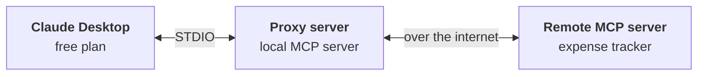

> **Video 7 of 8** · [Watch on YouTube](https://www.youtube.com/watch?v=GF7-ZzUausU) · Translated from the
> Hindi transcript. Notes follow the video section by section, in its order.

The last video built local MCP servers with FastMCP; this one uses the same library to build remote MCP servers and deploy them, so that anyone in the world can use them.

## Local versus remote MCP servers

- A **local** MCP server runs on your own machine: the same machine on which the MCP host and client are running.
- A **remote** MCP server runs on a **different machine on the internet**.

Advantages of a remote server over a local one:

1. It can **serve multiple clients at the same time**.
2. Remote servers generally run on internet servers that are themselves very powerful machines, so they are **more powerful in compute** and can take on more compute-intensive tasks.

The disadvantage: a local server is **fast**, because all the communication happens on the same machine, while a remote server is **relatively slow**, because its communication goes over the internet or some network.

As a rule of thumb, the **enterprise** MCP servers you see in future, the servers of big companies, will mostly be **remote**. That is what makes remote servers important to study. This video not only builds a remote server but also **deploys** it.

## Plan of action

1. **Build a very simple remote MCP server** with basic functionality: adding two numbers, or generating a random number. The good news is that, from a code point of view, a local and a remote MCP server look **almost the same**, so there is nothing new to learn in coding terms. A few changes are still needed to make it remote.
2. **Fit the expense tracking MCP server's code** into that simple remote server.
3. **Deploy the expense tracker.** There are multiple options, such as AWS or a platform like Render, but the one used here is **FastMCP Cloud**, a service from the people behind the FastMCP library, free right now, which makes deploying remote servers very easy.
4. **Identify problems** in this simple setup and **rectify** them.

## Building the test remote server

The steps are the same ones used last video for the local server.

1. **Install uv** from your terminal or command prompt (on a machine that already has it you see "requirement already satisfied"):

   ```bash
   pip install uv
   ```

2. **Create a new folder**, here on the Desktop, named "test remote server", and open it in VS Code with **File → Open Folder**.
3. **Initialise uv** in the folder from a new terminal:

   ```bash
   uv init .
   ```

4. **Add FastMCP:**

   ```bash
   uv add fastmcp
   ```

5. **Add the server's code** to `main.py`.

### The code, and the one change that makes it remote

It is a very basic server. It initialises the server, then has:

- a tool that **adds two given numbers**;
- a tool that **generates a random number in a given range**;
- a **resource** that gives some information about the server.

The main difference from a local server is in the run line. Last video's code ended with a bare `mcp.run()`, which in FastMCP means the transport is **STDIO**. Here the transport is set to **HTTP**, meaning **streamable HTTP**; the **host** says requests are accepted from any IP address; and a **port** is defined. That is the only change, and the most important one, to make a remote MCP server. The rest of the code is written exactly as for a local server.

```python
import random  # (implied, not shown in narration)
from fastmcp import FastMCP

mcp = FastMCP("Simple Calculator Server")


@mcp.tool
def add(a: float, b: float) -> float:  # parameter names implied, not shown in narration
    """Add two numbers."""  # (implied, not shown in narration)
    return a + b  # (implied, not shown in narration)


@mcp.tool
def random_number(min_val: int = 1, max_val: int = 100) -> int:  # parameter names implied, not shown in narration
    """Generate a random number in a given range."""  # (implied, not shown in narration)
    return random.randint(min_val, max_val)  # (implied, not shown in narration)


@mcp.resource("info://server")  # URI implied, not shown in narration
def server_info() -> dict:
    """Information about this server."""  # (implied, not shown in narration)
    return {"name": "Simple Calculator Server", "tools": ["add", "random_number"]}  # (implied, not shown in narration)


if __name__ == "__main__":
    mcp.run(transport="http", host="0.0.0.0", port=8000)  # port value implied, not shown in narration
```

### Running it

Check that the code works by running it. The full command is `fastmcp run` with your file (here `main.py`, not `server.py`), the transport, the host and the port:

```bash
fastmcp run main.py --transport http --host 0.0.0.0 --port 8000  # port value implied, not shown in narration
```

If that feels too long to remember, just run the file:

```bash
uv run main.py
```

The server starts and reports its name, **Simple Calculator Server**, the transport, **streamable HTTP**, and the server's **URL**.

### Debugging it in the MCP Inspector

In another terminal, open the Inspector:

```bash
uv run fastmcp dev main.py
```

Select the transport **Streamable HTTP** and click **Connect**. Then:

- **Resources → List Resources** shows the **server info** resource with all its details.
- There are no prompts on this server.
- **Tools → List Tools** shows the two tools. Running the random number tool with minimum **10** and maximum **100** gives **22**.

The server runs correctly, so it can be deployed.

## Deploying on FastMCP Cloud

The URL is **fastmcp.cloud**. Create an account first. The page offers two options: use one of their **templates** to create a remote MCP server, or **deploy your own code**. To deploy your own code, you first have to push it to Git.

### Pushing the code to GitHub

Create a new repository on GitHub named "test remote MCP server", with the description "Test MCP server", change nothing else, click **Create repository**, and copy its path. Then in the project:

- git is already initialised;
- `git status` shows the new files;

```bash
git add .
git commit -m "initial commit"
git remote add origin <repository address>
git push origin main
```

Checking GitHub, everything has arrived, including `main.py` with the code.

### Deploying from your own code

In FastMCP Cloud, choose **Deploy from your own code**. The first time, it asks you to **connect your GitHub account**; the prompts are simple, just keep pressing OK. Your recent repositories then appear, including "test remote MCP server". Select it and set up:

- **Name:** randomly generated, and part of your remote server's **URL**, so you can put in your own name or your company's name. It is left unchanged here.
- **Entry point:** the file that holds your code, `main.py`.
- **Authentication:** none for now.
- **Discoverable:** if selected, your server gets listed on a curated FastMCP page. Not needed here.

Click **Deploy**. The build gets ready, and the remote MCP server is deployed, just like that.

## Using the remote server in Claude Desktop

Copy the server's URL. You can share this URL with any friend or colleague; all they need is Claude Desktop on their machine.

In Claude, go to **Settings → Connectors**. Claude has added a new feature for adding custom remote MCP servers: at the very bottom is **Add custom connector**.

:::warning

People on Claude's **free plan** do not get the "Add custom connector" option; it is available only on the **Pro** plan for now, like a beta feature. It is expected to reach everyone in future. If you are on the free plan, a workaround that works even there comes later in this video.

:::

On the Pro plan, click it, give a name ("Nitish test MCP server"), give your URL, confirm with **Add**, then close and restart Claude. The server "Nitish test MCP server" now appears with its two tools, **add** and **random number**. Asking *"Generate random number between 11 and 20"*, Claude asks for permission; allow it, and you get the random number.

That is how simple it is to build a remote MCP server with FastMCP and share its URL with anyone; anyone on the Pro plan can add it to Claude Desktop this easily.

## Moving the expense tracker onto the remote server

The main goal is to turn the expense tracker server into a remote MCP server and deploy it. Rather than repeating the whole process, work smartly: take the whole `main.py` of the expense tracker from the last video and paste it as it is into the test server project, replacing the test code, and remove one part of it that is not needed. The expense tracker code now lives in the same project.

One more thing is needed: the **categories JSON file**. Create a new `categories.json` in the project and paste its content in.

### Checking in the Inspector

Run the code once, which creates the database:

```bash
uv run main.py
```

Then open the Inspector:

```bash
uv run fastmcp dev main.py
```

Connect, go to **Tools → List Tools**, and the tools are there. Running **list expenses** with start date 1-09-2025 and end date 3-09-2025 gives an error, *"start date is a required property"*, apparently some formatting issue (it has to be a string). Still, the tools and the resources are being discovered, so the plan is to deploy it and run it in Claude Desktop, and debug if it does not work there.

### Redeploying by pushing

Just push the updated code. FastMCP Cloud is intelligent enough to notice changes in the GitHub repository and create a new build from them.

`git status` shows three changes: `main.py` modified, and two new files. It is unclear whether the database should be uploaded; it is uploaded for now, but probably should not be, because it gets created automatically at run time. In that case you would put `expenses.db` in the `.gitignore` file. The approach is to run it first and deal with whatever problems appear.

```bash
git add .  # (implied, not shown in narration)
git commit -m "expense tracking code added"
git push origin main
```

On GitHub the repository now has `expenses.db` and the new `main.py`. On fastmcp.cloud it has detected the new commit and starts a build on it, with everything else unchanged. Once the latest commit is in production, restart Claude Desktop. The test server's tools are now **add expense**, **list expenses** and **summarise**.

- *"Can you tell me about all of my expenses in September?"* It queries the dates and says there are no expenses in September. That is expected: a new database was uploaded, or rather a new one was created there.
- *"Add an expense: Navratri dinner last night, 1000."* It works everything out; allow once. Then a problem, one that also appeared when trying this before recording: *"I apologize, but I'm unable to add the expense right now because the database is set to read-only mode."*

### Fixing the read-only database

With the SQLite code as written, the database is in **read-only mode**, at least when deployed on a server, so no expense can be added. The fix is code suggested by ChatGPT, used exactly as it came. It is not examined in depth; basically it gives a command to **create a new directory** for the database. The goal here is not SQLite fundamentals but how remote servers are built and deployed, so you can use the code directly. It replaces the existing database code, and nothing else changes.

```bash
git status
git add .  # (implied, not shown in narration)
git commit -m "read only issue solution"  # message spoken as "add write" or "read only issue solution"
git push origin main
```

FastMCP Cloud catches the new commit again and creates a new build. Once this third commit is in production, restart Claude and add an expense:

*"Trip to railway station, 15th September, cab ride"*, with a fare in rupees. Allow once. This time: *"Done, I have added the cab ride expense."* Then *"Show me all of my expenses in September"* returns **two** expenses: the one just added and the earlier Navratri dinner test.

So the database can now be both written and read. You have a **remote expense tracker MCP server**, and you can share its URL with anyone, who can add it to Claude Desktop on their machine and track expenses. That is a truly powerful feature to share with others.

## Fixing the flaws

The remote server has some obvious flaws, which need removing to make it a perfect remote MCP server.

### Flaw 1: the server is synchronous, so it blocks

The whole server runs **synchronously**: all the tools, the resources and all the database operations are synchronous, which in simple words means **blocking**. If one user calls the add expense tool, which uses the database behind the scenes, the server is not usable by other users at that moment. They have to stand in line and wait: the second user is served next, and the third, fourth and fifth all wait.

The fix is to convert the server to **asynchronous** using Python's **async/await**, with two changes:

1. Make an **asynchronous version of every tool**.
2. Make the **database asynchronous** too, so database operations can happen in parallel. Instead of SQLite, use its "brother" library, **aiosqlite**, which helps with asynchronous database operations. "aio" means **asynchronous I/O** (input-output).

The code may not feel comfortable yet; meanwhile, read a little about async/await in Python. The obvious changes in the updated code:

- the **aiosqlite** library replaces the SQLite library;
- every function uses its **async/await** version;
- every tool uses its **asynchronous** version.

```python
import aiosqlite  # replaces sqlite3


@mcp.tool
async def add_expense(date, amount, category, subcategory="", note=""):
    """Add a new expense entry to the database."""
    async with aiosqlite.connect(DB_PATH) as c:  # (implied, not shown in narration)
        cur = await c.execute(  # (implied, not shown in narration)
            "INSERT INTO expenses(date, amount, category, subcategory, note) VALUES (?,?,?,?,?)",
            (date, amount, category, subcategory, note),
        )
        await c.commit()  # (implied, not shown in narration)
        return {"status": "ok", "id": cur.lastrowid}  # (implied, not shown in narration)
```

Now if one user calls add expense, another user can use add expense at the same time, or any other tool, because the database behind the scenes also works asynchronously.

This code had not been tested before the recording. First add the library:

```bash
uv add aiosqlite
```

Then push:

```bash
git status
git add .  # (implied, not shown in narration)
git commit -m "add async feature"
git push origin main
```

The new commit is detected and the deployment builds. The deployment **failed twice** along the way because of some minor bugs in the code; once they were resolved, the latest code went up to Git and into production.

Testing it cannot quantify any performance gain, since there is only one user, but it at least shows nothing broke. Restart Claude Desktop and ask *"Add an expense: online course subscription last Saturday, 500."* Allow once, and it is added. The server still works after adding async support, so it is no longer blocking and can handle **multiple concurrent users**.

### Flaw 2: free-plan users cannot add a custom connector

Users without Claude's Pro plan cannot add this server directly as a connector, because **Add custom connector** under Settings → Connectors is only available to Pro users for now (it is said to be rolling out to everyone in future; it is being tested with Pro users). FastMCP has a workaround, a **jugaad**, that avoids the custom connector route entirely, so the remote server can be connected even on the free plan.

FastMCP lets you create a **proxy server**. The basic idea: on the free plan you cannot connect Claude Desktop directly to the remote MCP server, so you put a proxy server in between, and that proxy is a **local MCP server**. As the last video showed, local servers can be connected even on the free plan: you run the install command and the configuration is added to Claude's JSON file automatically.



Claude Desktop talks to the proxy, the proxy talks to the remote server, the remote server replies to the proxy, and the proxy passes the information back to Claude Desktop.

First, in Claude Desktop, **disconnect** the test MCP server, and not only disconnect it but **remove** it, so there is no direct way to reach the remote server any more.

The proxy server's folder is made exactly the way a local server was made last video: a new directory, uv initialised, and this code added. It is very simple:

- import `FastMCP` from `fastmcp`;
- call `FastMCP.as_proxy`;
- pass the **remote server's URL** (copied from FastMCP Cloud);
- give the proxy a **name**, here "Nitish server proxy";
- call `mcp.run()` under `if __name__ == "__main__"`.

```python
from fastmcp import FastMCP

mcp = FastMCP.as_proxy(
    "YOUR_REMOTE_SERVER_URL",  # the URL copied from FastMCP Cloud
    name="Nitish server proxy",
)

if __name__ == "__main__":
    mcp.run()
```

Since it is a bare `mcp.run()`, it runs on **STDIO**: this is a local server.

Test it in the Inspector first:

```bash
uv run fastmcp dev main.py
```

The transport type is **STDIO**; click **Connect**, then list. There is a slight delay, because it is connecting remotely to the remote server. It shows **categories** (why categories appears first is not clear). **List Tools** shows add expense, list expenses and summarise, so the proxy can reach the remote server.

Then install it in Claude Desktop, exactly the command from the last video:

```bash
uv run fastmcp install claude-desktop main.py
```

It reports "Successfully installed in Claude Desktop". After restarting Claude, the proxy server fails to start, for the same reason as last video: the config file has the new entry for the proxy server, but not the **complete path of uv**. Run `which uv` in the terminal, paste the whole path into the config, save, close, and restart Claude.

Now there is no error, and "Nitish server proxy" shows all three tools.

- *"List all September expenses"* → *"It appears there are no expenses recorded for September 2025."*
- *"Add an expense: grocery last Saturday, 500."* → added.
- *"List all September expenses"* → it works.

The whole process is a bit slower, because the communication is indirect, but it works. With this proxy workaround, even on the free plan you can add remote MCP servers as connectors.

### Flaw 3: every user sees every other user's expenses

The last problem, which you may already have spotted, is a very big **logical flaw** in the main code. If 10 users use the server, together or separately, **any user sees the expenses added by any other user**. The table has no column called **user ID** at all, so there is one central database into which any number of users add their expenses. When one user says "show me my September expenses", there is no way to know which user is asking, so every user is shown everyone's expenses.

If you have worked with databases, the solution will come to mind: **specify a user ID with every entry**. When a user adds an expense, log their user ID along with the expense's details; later, when the user asks for their September expenses, fetch only the expenses corresponding to that user ID.

But there is a problem. Adding a user ID column is no big deal, but nobody logs in: the LLM chats directly with the database, and there is **no authentication** in between. If the user in front says they are user number 123, how do you know to believe it? So the whole process also needs **authentication**.

As it stands the system is faulty and **not a good candidate for a remote MCP server**. You can still use it as a **local** server, since only you use it on your machine, but you cannot share it with others on a server. What is needed is to bring authentication into the entire flow.

## What comes next

This is where the playlist moves towards the advanced MCP features mentioned earlier, such as sampling, elicitation and authentication. Two things come next:

1. **The next video** builds your own **MCP client**, so you do not rely on Claude Desktop and can access these servers from your own client.
2. Then the **advanced concepts**, starting with **authentication** to solve this problem, and also what **sessions** are, how **sampling** is done and how **elicitation** happens.

The video leaves this as a cliffhanger.
